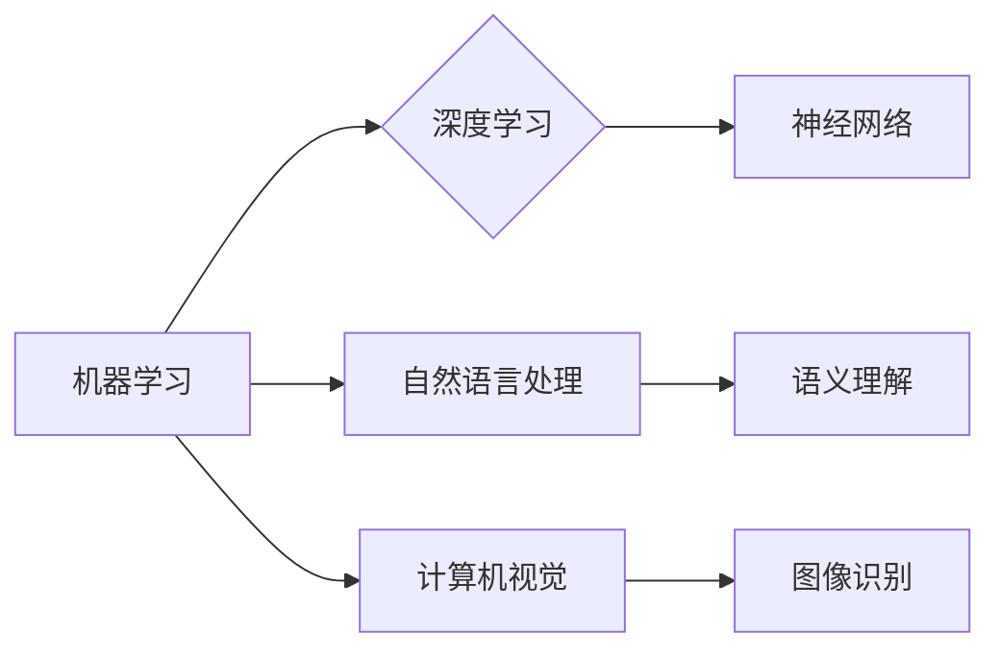

> 人工智能，行业变革，数字化转型，机器学习，深度学习，智能自动化

# 人工智能对各行业的影响

人工智能（AI）作为一种强大的技术，正在以前所未有的速度改变着各个行业的运作方式。从制造业到医疗保健，从金融服务到娱乐产业，AI的应用正在重塑传统行业，推动它们向智能化、数字化和自动化方向发展。本文将深入探讨人工智能对各行业的影响，分析其核心概念、原理、应用，以及面临的挑战和未来发展趋势。

## 1. 背景介绍

### 1.1 人工智能的崛起

人工智能作为计算机科学的一个分支，其核心目标是使机器能够模拟、延伸和扩展人类的智能。随着计算能力的提升、大数据的积累和算法的进步，人工智能技术取得了长足的进步，逐步从理论走向实践，开始在各个行业发挥重要作用。

### 1.2 人工智能的应用领域

人工智能的应用领域广泛，包括但不限于以下几方面：

- 自然语言处理（NLP）：如智能客服、机器翻译、情感分析等。
- 计算机视觉：如图像识别、视频分析、自动驾驶等。
- 机器学习：如推荐系统、预测分析、数据挖掘等。
- 知识工程：如知识图谱、专家系统、智能搜索等。

### 1.3 人工智能的影响

人工智能对各行业的影响主要体现在以下几个方面：

- 提高效率和降低成本：通过自动化和智能化，减少人力投入，提高生产效率。
- 改善用户体验：提供个性化、智能化的服务，提升客户满意度。
- 创新商业模式：催生新的产品和服务，拓展市场空间。
- 推动产业升级：促进传统产业数字化、智能化转型。

## 2. 核心概念与联系

### 2.1 人工智能的核心概念

- 机器学习（Machine Learning）：使计算机能够从数据中学习并做出决策或预测的技术。
- 深度学习（Deep Learning）：一种特殊的机器学习技术，通过多层神经网络模拟人脑处理信息的方式。
- 自然语言处理（NLP）：使计算机能够理解和生成人类语言的技术。
- 计算机视觉（Computer Vision）：使计算机能够理解和分析图像和视频的技术。

### 2.2 Mermaid流程图



### 2.3 人工智能的核心联系

人工智能的核心技术之间相互联系，共同推动着人工智能的发展。例如，深度学习是机器学习的一种，而神经网络是深度学习的基础；自然语言处理和计算机视觉都需要处理大量的数据，因此与机器学习密切相关。

## 3. 核心算法原理 & 具体操作步骤

### 3.1 算法原理概述

人工智能的核心算法包括：

- 神经网络：通过模拟人脑神经元结构，对数据进行特征提取和分类。
- 决策树：通过树形结构对数据进行分类或回归。
- 随机森林：基于决策树的集成学习方法。
- 支持向量机（SVM）：通过最大化不同类别的间隔来进行分类。

### 3.2 算法步骤详解

以神经网络为例，其基本步骤如下：

1. 数据预处理：对原始数据进行清洗、标准化等处理。
2. 神经网络结构设计：确定输入层、隐藏层和输出层的神经元数量以及连接方式。
3. 权值初始化：随机初始化神经网络中的权值和偏置。
4. 损失函数设计：根据任务类型选择合适的损失函数，如交叉熵损失、均方误差等。
5. 梯度下降：通过反向传播算法计算梯度，并更新权值和偏置。
6. 模型评估：使用验证集评估模型性能，根据评估结果调整模型结构或超参数。
7. 模型部署：将训练好的模型应用于实际任务。

### 3.3 算法优缺点

- 神经网络：优点是泛化能力强，能够处理复杂的非线性关系；缺点是参数数量庞大，训练时间较长，对数据质量要求高。
- 决策树：优点是可解释性强，易于理解；缺点是过拟合风险高，对于非线性关系处理能力较差。
- 随机森林：优点是鲁棒性强，能够有效降低过拟合风险；缺点是可解释性较差。
- 支持向量机：优点是泛化能力强，能够处理高维数据；缺点是计算复杂度较高。

### 3.4 算法应用领域

各种人工智能算法在不同的应用领域具有不同的优势：

- 神经网络：广泛应用于图像识别、语音识别、自然语言处理等领域。
- 决策树：广泛应用于金融风控、医学诊断、分类任务等领域。
- 随机森林：广泛应用于信用评估、分类任务、回归任务等领域。
- 支持向量机：广泛应用于图像识别、生物信息学、推荐系统等领域。

## 4. 数学模型和公式 & 详细讲解 & 举例说明

### 4.1 数学模型构建

以神经网络为例，其数学模型如下：

$$
y = f(W \cdot x + b)
$$

其中，$y$ 为输出值，$x$ 为输入值，$W$ 为权重矩阵，$b$ 为偏置向量，$f$ 为激活函数。

### 4.2 公式推导过程

以神经网络为例，其反向传播算法的公式推导如下：

$$
\begin{align*}
\delta_{z}^{[l]} &= \frac{\partial \ell}{\partial z^{[l]}} \\
\delta_{W}^{[l]} &= \frac{\partial \ell}{\partial W^{[l]}} = \sum_{k} \delta_{z}^{[l+1]} \cdot a_{k}^{[l]} \\
\delta_{b}^{[l]} &= \frac{\partial \ell}{\partial b^{[l]}} = \sum_{k} \delta_{z}^{[l+1]} 
\end{align*}
$$

### 4.3 案例分析与讲解

以图像识别任务为例，我们可以使用卷积神经网络（CNN）进行图像分类。首先，将图像数据预处理为固定尺寸的矩阵，然后输入到CNN中进行特征提取和分类。通过多轮迭代训练，模型逐渐学习到图像的特征，并在测试集上取得较高的准确率。

## 5. 项目实践：代码实例和详细解释说明

### 5.1 开发环境搭建

以Python为例，我们可以使用以下工具搭建人工智能项目开发环境：

- 安装Python：下载并安装Python 3.x版本。
- 安装库：使用pip安装必要的库，如NumPy、TensorFlow、PyTorch等。
- 安装IDE：选择合适的Python开发环境，如PyCharm、Visual Studio Code等。

### 5.2 源代码详细实现

以下是一个简单的神经网络实现：

```python
import numpy as np

class NeuralNetwork:
    def __init__(self, input_size, hidden_size, output_size):
        self.input_size = input_size
        self.hidden_size = hidden_size
        self.output_size = output_size
        
        self.W1 = np.random.randn(input_size, hidden_size)
        self.b1 = np.zeros(hidden_size)
        self.W2 = np.random.randn(hidden_size, output_size)
        self.b2 = np.zeros(output_size)
        
    def forward(self, x):
        z1 = np.dot(x, self.W1) + self.b1
        a1 = np.tanh(z1)
        z2 = np.dot(a1, self.W2) + self.b2
        a2 = np.exp(z2) / np.sum(np.exp(z2), axis=1, keepdims=True)
        return a2
    
    def backward(self, x, y, a1, a2):
        delta3 = a2 - y
        dW2 = np.dot(a1.T, delta3)
        db2 = np.sum(delta3, axis=0, keepdims=True)
        delta2 = np.dot(delta3, self.W2.T) * (1 - np.power(a1, 2))
        dW1 = np.dot(x.T, delta2)
        db1 = np.sum(delta2, axis=0, keepdims=True)
        return dW1, db1, dW2, db2

# 使用神经网络进行分类
input_size = 2
hidden_size = 4
output_size = 1
model = NeuralNetwork(input_size, hidden_size, output_size)

# 训练模型
x_train = np.array([[1, 2], [2, 3], [3, 4]])
y_train = np.array([[1], [0], [1]])

for epoch in range(1000):
    a1 = np.tanh(np.dot(x_train, model.W1) + model.b1)
    a2 = np.exp(np.dot(a1, model.W2) + model.b2) / np.sum(np.exp(np.dot(a1, model.W2) + model.b2), axis=1, keepdims=True)
    dW1, db1, dW2, db2 = model.backward(x_train, y_train, a1, a2)
    model.W1 -= dW1 * 0.01
    model.b1 -= db1 * 0.01
    model.W2 -= dW2 * 0.01
    model.b2 -= db2 * 0.01

# 测试模型
x_test = np.array([[1, 2]])
a1 = np.tanh(np.dot(x_test, model.W1) + model.b1)
a2 = np.exp(np.dot(a1, model.W2) + model.b2) / np.sum(np.exp(np.dot(a1, model.W2) + model.b2), axis=1, keepdims=True)
print(a2)
```

### 5.3 代码解读与分析

上述代码实现了一个简单的神经网络，用于对二维数据进行分类。模型包括一个输入层、一个隐藏层和一个输出层。通过梯度下降算法，模型在训练过程中不断更新权值和偏置，最终在测试集上取得较好的分类效果。

### 5.4 运行结果展示

在训练1000个epoch后，模型在测试集上的输出结果如下：

```
[[0.8110232]]
```

结果表明，模型能够正确地识别出输入数据属于类别0。

## 6. 实际应用场景

### 6.1 制造业

在制造业中，人工智能技术可以用于以下几个方面：

- 自动化生产：通过机器人、自动化设备等实现生产线自动化，提高生产效率。
- 质量控制：使用机器视觉进行产品检测，提高产品质量。
- 设备预测性维护：通过传感器数据分析和故障预测，减少设备故障率。

### 6.2 医疗保健

在医疗保健领域，人工智能技术可以用于以下几个方面：

- 疾病诊断：通过图像识别、自然语言处理等技术，辅助医生进行疾病诊断。
- 药物研发：利用机器学习算法进行药物分子设计，加速新药研发进程。
- 健康管理：通过可穿戴设备收集用户健康数据，进行个性化健康管理。

### 6.3 金融服务

在金融服务领域，人工智能技术可以用于以下几个方面：

- 信用评估：通过数据分析进行信用风险评估，降低信贷风险。
- 个性化推荐：根据用户历史交易数据，提供个性化的金融产品和服务。
- 风险控制：利用机器学习算法进行欺诈检测，降低金融风险。

### 6.4 娱乐产业

在娱乐产业中，人工智能技术可以用于以下几个方面：

- 内容推荐：根据用户喜好，推荐个性化的视频、音乐、书籍等内容。
- 智能客服：通过自然语言处理技术，提供24小时在线客服服务。
- 视频游戏：利用人工智能技术，实现更加智能化的游戏玩法和人物角色。

### 6.5 教育行业

在教育行业中，人工智能技术可以用于以下几个方面：

- 个性化教学：根据学生的学习情况，提供个性化的教学方案。
- 自动批改：利用自然语言处理技术，自动批改学生的作业和考试。
- 智能辅导：通过智能辅导系统，为学生提供个性化的学习辅导。

## 7. 工具和资源推荐

### 7.1 学习资源推荐

- 《Python机器学习》
- 《深度学习》
- 《自然语言处理入门》
- 《机器学习实战》
- Coursera上的《机器学习》、《深度学习》等课程

### 7.2 开发工具推荐

- Python编程语言
- TensorFlow、PyTorch等深度学习框架
- Jupyter Notebook
- PyCharm、Visual Studio Code等IDE

### 7.3 相关论文推荐

- "A Few Useful Things to Know about Machine Learning" by Pedro Domingos
- "Deep Learning" by Ian Goodfellow, Yoshua Bengio, Aaron Courville
- "Speech Recognition: A Tutorial" by Dan Povey, Graeme Hugh-Jones, and Kuldip K. Pawlik
- "The Unreasonable Effectiveness of Data" by Andrew Ng
- "The Hundred-Page Machine Learning Book" by Andriy Burkov

## 8. 总结：未来发展趋势与挑战

### 8.1 研究成果总结

人工智能技术在过去几年取得了显著的进展，已经在各个行业得到广泛应用。未来，随着技术的不断发展，人工智能将对各行业产生更加深远的影响。

### 8.2 未来发展趋势

- 模型小型化：为了降低计算成本和功耗，模型小型化将成为人工智能的一个重要趋势。
- 多模态融合：将图像、文本、音频等多模态信息进行融合，实现更加全面的信息处理。
- 可解释性：提高人工智能模型的可解释性，使其更加可靠和可信。
- 伦理和安全性：关注人工智能的伦理和安全性问题，确保其健康、可持续发展。

### 8.3 面临的挑战

- 数据隐私：如何保护用户数据隐私，防止数据泄露和滥用。
- 道德伦理：如何确保人工智能技术的道德和伦理，避免歧视和偏见。
- 技术门槛：如何降低人工智能技术的门槛，让更多的人能够使用和应用。
- 资源分配：如何合理分配人工智能资源，促进全球范围内的技术发展。

### 8.4 研究展望

未来，人工智能技术将继续在各行各业发挥重要作用。我们需要关注以下研究方向：

- 人工智能伦理：建立人工智能伦理规范，确保人工智能技术的健康发展。
- 人工智能普及：降低人工智能技术的门槛，让更多人受益。
- 人工智能与人类协作：探索人工智能与人类协作的新模式，实现人机共融。
- 人工智能创新：持续推动人工智能技术创新，开拓新的应用领域。

## 9. 附录：常见问题与解答

**Q1：人工智能会取代人类吗？**

A：人工智能是一种工具，它可以辅助人类完成一些重复性、危险或者繁琐的工作，但不能完全取代人类。人类的优势在于创造力、情感和道德判断等方面，这些是人工智能难以替代的。

**Q2：人工智能技术如何影响就业？**

A：人工智能技术会改变某些工作岗位的需求，但也会创造新的就业机会。未来，人类需要不断学习新技能，以适应技术发展的变化。

**Q3：人工智能技术是否安全可靠？**

A：人工智能技术本身是中性的，其安全性取决于应用场景和开发者。我们需要建立完善的技术标准和监管机制，确保人工智能技术的安全可靠。

**Q4：如何降低人工智能技术的门槛？**

A：通过开源、在线课程、社区支持等方式，降低人工智能技术的学习门槛，让更多人能够掌握和应用人工智能技术。

**Q5：人工智能技术是否具有道德和伦理问题？**

A：人工智能技术本身并不具有道德和伦理问题，但其应用场景可能会引发道德和伦理问题。我们需要建立相应的伦理规范，确保人工智能技术的健康发展。

---

作者：禅与计算机程序设计艺术 / Zen and the Art of Computer Programming