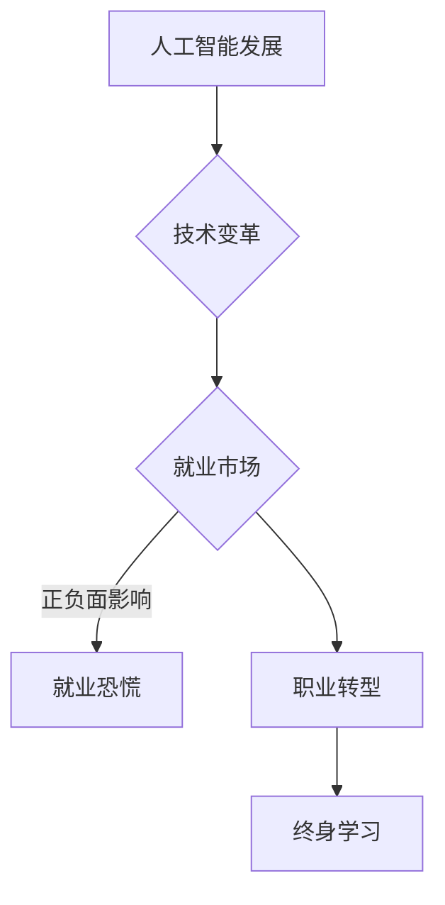

# 人工智能的发展与就业恐慌

> 关键词：人工智能，就业恐慌，技术变革，职业转型，未来工作，终身学习

## 1. 背景介绍

近年来，人工智能（Artificial Intelligence, AI）的发展势头迅猛，从语音识别到自动驾驶，从医疗诊断到金融服务，AI技术正在深刻地改变着我们的生活方式。然而，随着AI技术的不断进步，人们开始担忧，AI是否会取代人类的工作，引发大规模的就业恐慌。本文将深入探讨人工智能的发展趋势，分析就业恐慌的成因，并提出应对策略。

### 1.1 问题的由来

人工智能的快速发展，使得一些传统行业的工作岗位面临被机器取代的风险。例如，自动驾驶技术的成熟可能导致大量司机失业，智能制造的普及可能使生产线上的工人失去工作。这种担忧不仅存在于普通大众中，也引起了政府、企业和社会各界的广泛关注。

### 1.2 研究现状

关于人工智能与就业的关系，学术界和产业界存在不同的观点。一方面，一些研究认为AI技术将导致失业率上升，尤其是低技能工作将受到冲击。另一方面，也有研究指出AI将创造新的工作岗位，并提高生产效率，从而促进经济增长。

### 1.3 研究意义

探讨人工智能的发展与就业恐慌，有助于我们更好地理解技术变革对就业市场的影响，为政府制定相关政策、企业进行人才战略规划以及个人进行职业规划提供参考。

## 2. 核心概念与联系

### 2.1 核心概念

- **人工智能（AI）**：指由人制造出来的系统所表现出的智能行为，包括学习、推理、自我修正等。
- **技术变革**：指技术进步引起的社会经济结构和生产方式的根本性变化。
- **就业恐慌**：指人们对未来可能失去工作机会的担忧和恐惧。
- **职业转型**：指个人根据市场需求和个人兴趣，调整自身职业方向和技能的过程。

### 2.2 架构的 Mermaid 流程图



## 3. 核心算法原理 & 具体操作步骤

### 3.1 算法原理概述

人工智能的核心算法包括机器学习、深度学习、自然语言处理等。这些算法通过学习数据中的规律，使计算机能够执行特定任务，如图像识别、语音识别、自然语言理解等。

### 3.2 算法步骤详解

- **数据收集**：收集相关领域的大量数据，用于训练和测试AI模型。
- **数据预处理**：对收集到的数据进行清洗、标注、标准化等处理。
- **模型选择**：根据任务需求选择合适的AI模型。
- **模型训练**：使用预处理后的数据训练模型，调整模型参数。
- **模型评估**：使用测试数据评估模型性能，并根据评估结果调整模型。
- **模型部署**：将训练好的模型部署到实际应用场景中。

### 3.3 算法优缺点

- **优点**：
  - 提高工作效率和准确性。
  - 降低人力成本。
  - 创造新的应用场景和商业模式。
- **缺点**：
  - 可能导致部分工作岗位消失。
  - 技术伦理和安全问题。
  - 需要大量专业人才。

### 3.4 算法应用领域

- **工业自动化**：如智能制造、智能物流等。
- **金融服务**：如智能投顾、智能客服等。
- **医疗健康**：如智能诊断、远程医疗等。
- **教育领域**：如智能教育、个性化学习等。

## 4. 数学模型和公式 & 详细讲解 & 举例说明

### 4.1 数学模型构建

人工智能的数学模型主要包括概率模型、统计模型、优化模型等。以下以线性回归为例，介绍数学模型的构建过程。

#### 4.1.1 线性回归

线性回归是一种预测连续值的机器学习算法，其基本原理是通过线性关系拟合数据，预测目标值。

#### 4.1.2 公式推导

假设我们有一个包含m个样本的线性回归问题，每个样本有n个特征，目标值是连续变量y。线性回归模型可以表示为：

$$
y = \beta_0 + \beta_1x_1 + \beta_2x_2 + ... + \beta_nx_n + \epsilon
$$

其中，$\beta_0, \beta_1, ..., \beta_n$ 是模型的参数，$\epsilon$ 是误差项。

为了找到最优的参数值，我们可以使用最小二乘法，即最小化误差平方和：

$$
S = \sum_{i=1}^{m}(y_i - \beta_0 - \beta_1x_{1i} - ... - \beta_nx_{ni})^2
$$

通过对 $S$ 求导，并令其等于0，可以得到参数的估计值：

$$
\beta = (\mathbf{X}^T\mathbf{X})^{-1}\mathbf{X}^T\mathbf{y}
$$

其中，$\mathbf{X}$ 是特征矩阵，$\mathbf{y}$ 是目标值向量。

### 4.2 案例分析与讲解

以下是一个简单的线性回归案例，使用Python的scikit-learn库进行实现。

```python
from sklearn.linear_model import LinearRegression
from sklearn.model_selection import train_test_split
from sklearn.metrics import mean_squared_error

# 生成模拟数据
import numpy as np
X = np.random.rand(100, 1) * 10
y = 3 * X.squeeze() + 2 + np.random.randn(100) * 0.5

# 划分训练集和测试集
X_train, X_test, y_train, y_test = train_test_split(X, y, test_size=0.2, random_state=42)

# 创建线性回归模型
model = LinearRegression()

# 训练模型
model.fit(X_train, y_train)

# 预测测试集
y_pred = model.predict(X_test)

# 计算均方误差
mse = mean_squared_error(y_test, y_pred)
print("Mean Squared Error:", mse)
```

运行上述代码，可以得到测试集上的均方误差，用于评估模型的预测效果。

## 5. 项目实践：代码实例和详细解释说明

### 5.1 开发环境搭建

为了进行人工智能项目实践，我们需要搭建以下开发环境：

- Python编程语言
- NumPy、Pandas等科学计算库
- scikit-learn、TensorFlow、PyTorch等机器学习库
- Jupyter Notebook或PyCharm等开发工具

### 5.2 源代码详细实现

以下是一个使用scikit-learn进行线性回归的完整代码实例：

```python
# 导入所需库
import numpy as np
from sklearn.linear_model import LinearRegression
from sklearn.model_selection import train_test_split
from sklearn.metrics import mean_squared_error

# 生成模拟数据
X = np.random.rand(100, 1) * 10
y = 3 * X.squeeze() + 2 + np.random.randn(100) * 0.5

# 划分训练集和测试集
X_train, X_test, y_train, y_test = train_test_split(X, y, test_size=0.2, random_state=42)

# 创建线性回归模型
model = LinearRegression()

# 训练模型
model.fit(X_train, y_train)

# 预测测试集
y_pred = model.predict(X_test)

# 计算均方误差
mse = mean_squared_error(y_test, y_pred)
print("Mean Squared Error:", mse)
```

### 5.3 代码解读与分析

上述代码首先导入了所需的库，然后生成了一个模拟数据集，包含100个样本和一个特征。接着，代码将数据集划分为训练集和测试集，创建了一个线性回归模型，并在训练集上训练模型。最后，代码使用测试集评估模型的预测效果，并打印出均方误差。

### 5.4 运行结果展示

运行上述代码，可以得到测试集上的均方误差，用于评估模型的预测效果。

## 6. 实际应用场景

### 6.1 金融风险评估

在金融行业，线性回归可以用于评估贷款申请人的信用风险。通过分析申请人的收入、负债、信用记录等特征，预测其违约概率，从而为金融机构提供决策依据。

### 6.2 住房市场预测

线性回归可以用于预测住房价格。通过分析房屋的面积、位置、年代等特征，预测其价格，为房地产企业提供市场分析工具。

### 6.3 智能推荐系统

在智能推荐系统中，线性回归可以用于预测用户对某个商品或内容的兴趣度。通过分析用户的浏览、购买、评价等行为，预测其推荐列表的排序，从而提高推荐系统的准确性。

## 7. 工具和资源推荐

### 7.1 学习资源推荐

- 《Python机器学习》
- 《机器学习实战》
- 《深度学习》
- 《人工智能：一种现代的方法》

### 7.2 开发工具推荐

- Jupyter Notebook
- PyCharm
- Google Colab

### 7.3 相关论文推荐

- "Machine Learning: A Probabilistic Perspective"
- "Deep Learning"
- "The Hundred-Page Machine Learning Book"

## 8. 总结：未来发展趋势与挑战

### 8.1 研究成果总结

本文探讨了人工智能的发展趋势，分析了就业恐慌的成因，并提出了应对策略。通过深入理解人工智能技术，我们可以更好地应对技术变革带来的挑战，实现个人和企业的可持续发展。

### 8.2 未来发展趋势

- 人工智能将更加普及，渗透到各行各业。
- AI技术将与其他技术深度融合，如物联网、区块链等。
- 人工智能将更加注重伦理和安全问题。

### 8.3 面临的挑战

- AI技术的安全性、可靠性和可解释性。
- AI技术带来的就业冲击和社会问题。
- AI技术的普及和伦理问题。

### 8.4 研究展望

未来，人工智能将面临更多的挑战和机遇。我们需要加强人工智能伦理研究，推动AI技术的可持续发展，实现人工智能与人类的和谐共处。

## 9. 附录：常见问题与解答

**Q1：人工智能是否会完全取代人类工作？**

A：人工智能可以取代一些重复性、低技能的工作，但无法完全取代人类工作。人工智能是人类智慧的延伸，需要人类的创造性和情感智慧。

**Q2：如何应对人工智能带来的就业冲击？**

A：个人应加强终身学习，提升自身技能，适应技术变革。政府和企业也应提供相关培训和支持，帮助员工顺利实现职业转型。

**Q3：人工智能是否会加剧社会不平等？**

A：人工智能技术的应用需要公平、透明的规则，防止出现歧视和不公平现象。同时，政府和企业应关注技术变革带来的社会影响，采取措施缩小贫富差距。

**Q4：如何推动人工智能的可持续发展？**

A：加强人工智能伦理研究，制定相关法律法规，推动AI技术的公平、透明、可解释和可控。同时，关注AI技术对环境的影响，实现绿色发展。

作者：禅与计算机程序设计艺术 / Zen and the Art of Computer Programming