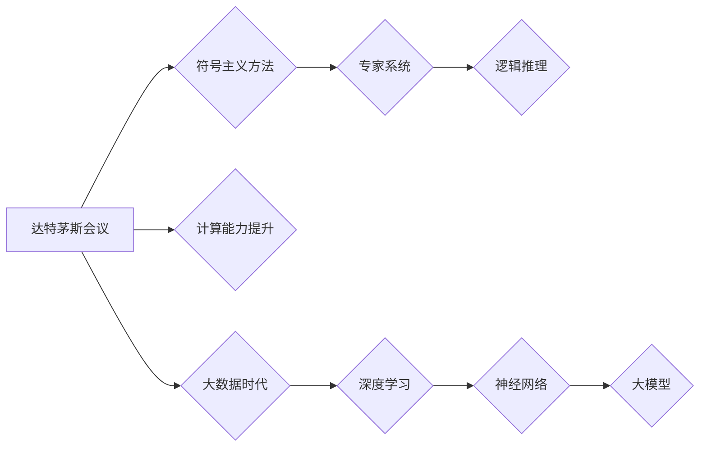

> 人工智能，机器学习，深度学习，大模型，预训练，自然语言处理

# 从达特茅斯会议到AI大模型

人工智能（Artificial Intelligence, AI）的发展历程，宛如一部波澜壮阔的史诗。从最初的设想与探索，到如今的AI大模型时代，每一步都凝聚着无数科学家和工程师的智慧与汗水。本文将带领读者穿越历史的时空，回顾从达特茅斯会议到AI大模型的演变过程，探讨这一领域的关键概念、核心算法、应用场景以及未来发展趋势。

## 1. 背景介绍

### 1.1 人工智能的诞生

人工智能的概念最早可以追溯到20世纪50年代初。当时的科学家们对人类智能的本质充满好奇，并试图通过计算机模拟人类思维的过程。1956年，美国达特茅斯会议（Dartmouth Conference）的召开，标志着人工智能学科的正式诞生。会议期间，与会专家提出了“人工智能”这一术语，并定义了人工智能的研究目标：使机器能够执行各种复杂的任务，如学习、推理、感知、理解等。

### 1.2 早期人工智能的发展

从达特茅斯会议到20世纪70年代，人工智能经历了快速发展的阶段。这一时期，人工智能研究主要集中在符号主义和逻辑推理方面，如专家系统、推理机等。然而，由于受限于计算能力和数据规模，这一阶段的AI应用范围有限。

### 1.3 人工智能的寒冬与复兴

20世纪80年代，人工智能进入了所谓的“寒冬期”。由于符号主义方法的局限性，以及计算资源和数据规模的限制，人工智能研究受到质疑，投资大幅减少。然而，随着计算能力的提升和大数据时代的到来，人工智能在21世纪初迎来了新的复兴。

## 2. 核心概念与联系

### 2.1 人工智能的核心概念

- **机器学习（Machine Learning）**：机器学习是人工智能的一个分支，研究如何让计算机从数据中学习规律，从而做出智能决策。
- **深度学习（Deep Learning）**：深度学习是机器学习的一种方法，通过构建深层神经网络来模拟人脑的学习过程，从而实现对复杂模式的识别。
- **大模型（Large-scale Model）**：大模型指的是具有亿级别参数的神经网络模型，能够在海量数据上进行训练，从而获得强大的泛化能力。

### 2.2 Mermaid 流程图



### 2.3 核心概念联系

从达特茅斯会议开始，人工智能领域经历了从符号主义到深度学习、再到大模型的演变过程。随着计算能力的提升和数据的爆炸性增长，深度学习逐渐成为主流方法，大模型则代表了当前AI领域的最高成就。

## 3. 核心算法原理 & 具体操作步骤

### 3.1 算法原理概述

深度学习是AI领域的关键技术，其核心思想是使用多层神经网络对数据进行学习。神经网络由多个神经元组成，每个神经元负责学习数据中的特征。

### 3.2 算法步骤详解

1. **数据预处理**：对原始数据进行清洗、转换等预处理操作，使其适合模型训练。
2. **模型构建**：构建深度学习模型，如卷积神经网络（CNN）、循环神经网络（RNN）或Transformer等。
3. **模型训练**：使用训练数据进行模型训练，不断调整模型参数，使模型能够对新的数据进行预测。
4. **模型评估**：使用验证数据对模型进行评估，调整模型参数，优化模型性能。
5. **模型部署**：将训练好的模型部署到实际应用中。

### 3.3 算法优缺点

深度学习算法具有以下优点：

- **强大的特征提取能力**：能够自动从数据中提取特征，无需人工设计特征。
- **泛化能力强**：能够在新的数据上取得良好的效果。

然而，深度学习算法也存在以下缺点：

- **计算量大**：需要大量的计算资源和时间进行模型训练。
- **对数据要求高**：需要大量高质量的标注数据。

### 3.4 算法应用领域

深度学习算法在多个领域取得了显著成果，如：

- **计算机视觉**：图像识别、目标检测、人脸识别等。
- **自然语言处理**：文本分类、机器翻译、情感分析等。
- **语音识别**：语音识别、语音合成等。

## 4. 数学模型和公式 & 详细讲解 & 举例说明

### 4.1 数学模型构建

深度学习算法的数学模型主要基于神经网络。神经网络由多个神经元组成，每个神经元通过权重连接，形成一个复杂的网络结构。

### 4.2 公式推导过程

以下以简单的多层感知机（MLP）为例，介绍神经网络的基本公式推导过程。

多层感知机（MLP）是一种前馈神经网络，其基本结构如下：

```
    输入层       隐藏层       输出层
   /----------->|----------->|
  /            |            |
/              |            |
----------------------------->
```

其中，输入层将输入数据传递给隐藏层，隐藏层再传递给输出层。每个神经元之间的连接都存在一个权重，用于衡量输入数据对输出结果的影响。

### 4.3 案例分析与讲解

以手写数字识别为例，介绍如何使用多层感知机进行手写数字识别。

假设输入层有784个神经元，分别对应输入图像的784个像素值。隐藏层有10个神经元，对应10个数字类别。输出层有1个神经元，用于预测数字类别。

首先，将输入图像的像素值归一化，使其在0到1之间。然后，将归一化后的像素值作为输入层神经元的输入。

接下来，使用Sigmoid激活函数计算隐藏层神经元的输出：

$$
h_{ij} = \sigma(W_{ij}x_j + b_i)
$$

其中，$h_{ij}$ 为第 $i$ 个隐藏层神经元在第 $j$ 个输入下的输出，$W_{ij}$ 为连接第 $j$ 个输入神经元和第 $i$ 个隐藏层神经元的权重，$b_i$ 为第 $i$ 个隐藏层神经元的偏置。

最后，使用Sigmoid激活函数计算输出层神经元的输出：

$$
y_j = \sigma(W_{j}h_j + b_j)
$$

其中，$y_j$ 为第 $j$ 个输出层神经元在第 $j$ 个隐藏层神经元输出下的输出。

根据输出层神经元的输出，选择概率最大的类别作为最终预测结果。

## 5. 项目实践：代码实例和详细解释说明

### 5.1 开发环境搭建

为了进行深度学习项目实践，需要搭建以下开发环境：

- 操作系统：Linux或Windows
- 编程语言：Python
- 深度学习框架：TensorFlow或PyTorch
- 数据预处理工具：NumPy、Pandas等

### 5.2 源代码详细实现

以下使用PyTorch实现一个简单的多层感知机模型，用于手写数字识别。

```python
import torch
import torch.nn as nn
import torch.optim as optim

# 定义多层感知机模型
class MLP(nn.Module):
    def __init__(self):
        super(MLP, self).__init__()
        self.fc1 = nn.Linear(784, 128)
        self.fc2 = nn.Linear(128, 10)

    def forward(self, x):
        x = torch.relu(self.fc1(x))
        x = self.fc2(x)
        return x

# 创建模型实例
model = MLP()

# 定义损失函数和优化器
criterion = nn.CrossEntropyLoss()
optimizer = optim.SGD(model.parameters(), lr=0.01)

# 加载MNIST数据集
train_loader = torch.utils.data.DataLoader(torchvision.datasets.MNIST(root='./data', train=True, download=True, transform=torch.transforms.ToTensor()), batch_size=64, shuffle=True)

# 训练模型
for epoch in range(10):
    running_loss = 0.0
    for i, data in enumerate(train_loader, 0):
        inputs, labels = data
        optimizer.zero_grad()
        outputs = model(inputs)
        loss = criterion(outputs, labels)
        loss.backward()
        optimizer.step()
        running_loss += loss.item()
    print(f'Epoch {epoch + 1}, Loss: {running_loss / len(train_loader)}')

# 保存模型
torch.save(model.state_dict(), 'mnist_mlp.pth')
```

### 5.3 代码解读与分析

上述代码定义了一个简单的多层感知机模型，用于手写数字识别。首先，导入必要的库，并定义多层感知机模型。然后，创建模型实例，定义损失函数和优化器。接下来，加载MNIST数据集，并开始训练模型。最后，保存训练好的模型。

### 5.4 运行结果展示

在训练过程中，损失函数会逐渐减小，表示模型的性能在提高。训练完成后，可以评估模型在测试集上的性能。

## 6. 实际应用场景

深度学习算法在多个领域取得了显著成果，以下是一些实际应用场景：

### 6.1 计算机视觉

- **图像识别**：使用深度学习算法识别图像中的物体，如图像分类、目标检测、人脸识别等。
- **图像生成**：使用生成对抗网络（GAN）等技术生成逼真的图像，如图像超分辨率、风格迁移等。

### 6.2 自然语言处理

- **文本分类**：使用深度学习算法对文本进行分类，如图情分析、情感分析、垃圾邮件检测等。
- **机器翻译**：使用深度学习算法将一种语言的文本翻译成另一种语言，如谷歌翻译、百度翻译等。

### 6.3 语音识别

- **语音识别**：使用深度学习算法将语音信号转换为文本，如智能语音助手、语音控制等。
- **语音合成**：使用深度学习算法将文本转换为语音，如语音播报、语音聊天等。

## 7. 工具和资源推荐

### 7.1 学习资源推荐

- 《深度学习》（Goodfellow et al.）：深度学习领域的经典教材，详细介绍了深度学习的原理和应用。
- 《神经网络与深度学习》（邱锡鹏）：适合初学者入门的深度学习教材，内容通俗易懂。

### 7.2 开发工具推荐

- TensorFlow：由Google开发的深度学习框架，功能强大，社区活跃。
- PyTorch：由Facebook开发的深度学习框架，易于上手，社区活跃。

### 7.3 相关论文推荐

- "A Few Useful Things to Know about Machine Learning" (Ian Goodfellow et al.)
- "Deep Learning" (Ian Goodfellow, Yoshua Bengio, Aaron Courville)
- "Generative Adversarial Nets" (Ian Goodfellow et al.)

## 8. 总结：未来发展趋势与挑战

### 8.1 研究成果总结

从达特茅斯会议到AI大模型，人工智能经历了漫长的发展历程。深度学习技术的突破，使AI在多个领域取得了显著成果。大模型的出现，更是将AI推向了一个新的高度。

### 8.2 未来发展趋势

未来，人工智能将呈现出以下发展趋势：

- **模型规模将进一步扩大**：随着计算能力的提升，大模型的规模将越来越大，模型参数量将达到数十亿甚至数百亿级别。
- **模型结构将更加复杂**：为了解决特定任务，模型结构将更加复杂，如多模态融合、强化学习等。
- **模型应用将更加广泛**：AI将在更多领域得到应用，如医疗、教育、金融等。

### 8.3 面临的挑战

尽管人工智能取得了显著成果，但仍面临着以下挑战：

- **数据质量**：高质量的数据是AI模型训练的前提，如何获取和清洗高质量数据，仍是一个亟待解决的问题。
- **计算资源**：深度学习模型训练需要大量的计算资源，如何高效利用计算资源，也是一个重要挑战。
- **伦理和隐私**：人工智能的应用需要考虑伦理和隐私问题，如何确保人工智能的公平、公正、透明，是一个重要课题。

### 8.4 研究展望

未来，人工智能研究需要在以下方面取得突破：

- **数据高效处理**：开发新的数据获取、清洗和标注方法，提高数据质量。
- **模型高效训练**：优化模型结构和训练算法，降低计算成本。
- **可解释性和可信赖性**：提高模型的可解释性和可信赖性，使AI更加透明和可靠。

相信在科学家和工程师的共同努力下，人工智能将在未来发挥更大的作用，为人类社会创造更多价值。

## 9. 附录：常见问题与解答

**Q1：人工智能和机器学习有什么区别？**

A：人工智能是指让机器模拟人类智能的行为，而机器学习是实现人工智能的一种方法。简单来说，人工智能是目标，机器学习是实现目标的手段。

**Q2：深度学习为什么能取得如此好的效果？**

A：深度学习能够取得好的效果，主要是因为它能够自动从数据中学习特征，并具有强大的泛化能力。

**Q3：如何解决深度学习中的过拟合问题？**

A：解决深度学习中的过拟合问题，可以采用以下方法：
- 数据增强：通过数据变换等方法扩充数据集，增加模型的泛化能力。
- 正则化：在损失函数中加入正则化项，如L1正则化、L2正则化等。
- 减少模型复杂度：简化模型结构，降低模型复杂度。

**Q4：深度学习模型如何进行部署？**

A：深度学习模型的部署方法包括以下几种：
- 微服务架构：将模型部署到微服务中，实现模型的高效调用。
- 云计算平台：使用云计算平台进行模型部署，实现弹性伸缩。
- 边缘计算：将模型部署到边缘设备上，实现低延迟、低功耗的推理。

**Q5：人工智能的发展前景如何？**

A：人工智能的发展前景非常广阔，未来将在更多领域得到应用，如医疗、教育、金融等。随着技术的不断进步，人工智能将深刻改变人类社会。