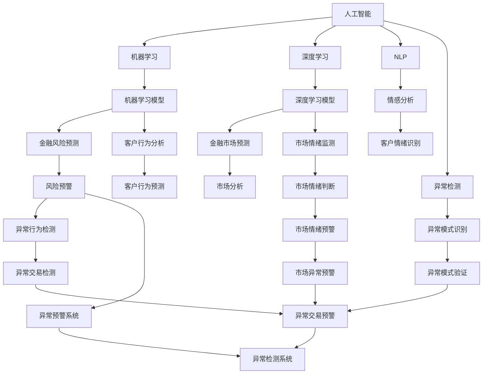
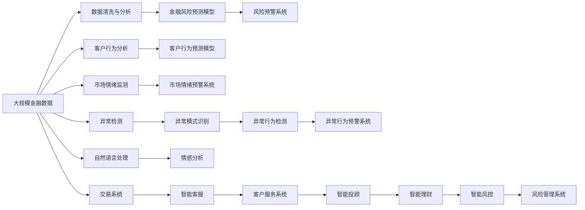

                 

# AI人工智能代理工作流AI Agent WorkFlow：智能代理在金融系统中的应用

> 关键词：人工智能,智能代理,金融系统,工作流,机器学习,自然语言处理,NLP,情感分析,异常检测

## 1. 背景介绍

### 1.1 问题由来
随着金融行业的发展和数字化转型的不断深入，金融机构面临着日益复杂和多变的业务需求。一方面，面对海量的金融数据和多样化的业务场景，传统金融业务流程已经无法满足高效、灵活、安全的处理要求。另一方面，金融决策过程中，需要快速准确地理解客户需求，做出精确的风险评估和市场预测。

为了解决这些问题，金融机构开始引入人工智能技术，构建智能代理系统。智能代理系统作为金融系统的重要组成部分，能够实时监测金融市场动态，自动化处理金融交易，实现风险预警和客户服务，极大地提升了金融服务的效率和质量。

### 1.2 问题核心关键点
智能代理系统主要通过以下几种方式，实现对金融业务的智能化管理：

1. **数据处理**：对海量金融数据进行高效清洗、分析和处理，提取有价值的信息。
2. **模型训练**：使用机器学习、深度学习等技术，构建金融风险预测、客户行为分析、市场情绪监测等模型。
3. **情感分析**：通过自然语言处理技术，分析客户情感和市场情绪，辅助决策。
4. **异常检测**：使用异常检测技术，识别金融交易中的异常行为和风险信号，确保金融安全。
5. **人机交互**：构建智能问答系统、智能客服系统，提升客户服务体验。

智能代理系统的核心在于构建高效、灵活、可扩展的工作流框架，将各种金融业务任务集成到一个统一的系统中，实现数据的自动流转和任务的自动化执行。

### 1.3 问题研究意义
智能代理系统在金融系统中的应用，具有重要的现实意义和深远影响：

1. **提高业务效率**：通过自动化处理金融业务，减少人工操作和错误，提升业务处理速度和准确性。
2. **降低运营成本**：智能代理系统可以24/7运行，减少人力投入，降低运营成本。
3. **增强决策能力**：利用机器学习和数据驱动的决策，提升金融决策的科学性和精确性。
4. **提升客户体验**：智能客服、智能投顾等功能，为客户提供更高效、更个性化的服务。
5. **防范金融风险**：异常检测和风险预警功能，有效防范金融欺诈和市场风险。
6. **促进金融创新**：通过智能代理技术，金融机构可以更快地开发新业务、新服务，满足客户多样化的需求。

## 2. 核心概念与联系

### 2.1 核心概念概述

为了更好地理解智能代理系统的工作原理和构建方法，本节将介绍几个关键核心概念：

- **人工智能**：通过机器学习、深度学习等技术，使计算机具备类似人类的智能能力，能够自主学习、推理和决策。
- **智能代理**：一种基于人工智能技术的自动化系统，能够在特定领域内执行复杂任务，提供智能决策支持。
- **金融系统**：金融机构内部的IT系统架构，包括交易系统、客户服务系统、风险管理系统等。
- **工作流框架**：一种系统集成框架，将金融业务的各个环节自动化集成到一个统一的系统中，实现数据的自动流转和任务的自动化执行。
- **机器学习**：使用算法和模型，从数据中学习规律和模式，实现预测、分类、聚类等任务。
- **深度学习**：一种基于神经网络的机器学习方法，能够处理复杂的数据结构和任务，适用于图像、语音、自然语言处理等领域。
- **自然语言处理(NLP)**：使用计算机技术，处理和理解人类语言的技术，包括文本分析、情感分析、问答系统等。
- **情感分析**：通过分析文本中的情感词汇和情感表达，判断文本的情感倾向。
- **异常检测**：识别数据中的异常行为和异常模式，用于防范欺诈和风险预警。

这些概念之间存在着紧密的联系，构成了智能代理系统的核心架构。

### 2.2 概念间的关系

这些核心概念之间的关系可以通过以下Mermaid流程图来展示：



这个流程图展示了人工智能和智能代理系统中的核心概念及其相互关系：

1. 人工智能通过机器学习和深度学习技术，构建各种模型，如金融风险预测模型、客户行为分析模型、市场情绪监测模型等。
2. 机器学习和深度学习模型通过训练，能够从金融数据中提取有价值的信息，实现预测、分类、聚类等任务。
3. 自然语言处理(NLP)技术，能够处理和理解金融业务中的文本数据，用于情感分析和市场情绪监测。
4. 异常检测技术，能够识别金融数据中的异常行为和模式，用于防范欺诈和风险预警。
5. 智能代理系统通过集成各种金融业务任务和工作流框架，实现数据自动流转和任务自动化执行，提供智能决策支持。

### 2.3 核心概念的整体架构

最后，我们用一个综合的流程图来展示这些核心概念在大规模金融智能代理系统中的整体架构：



这个综合流程图展示了从数据清洗与分析到智能投顾、智能理财、智能风控等智能代理系统中的主要流程，每个环节都通过机器学习和NLP等技术，实现数据的智能分析和决策支持。

## 3. 核心算法原理 & 具体操作步骤
### 3.1 算法原理概述

智能代理系统的工作原理主要包括以下几个步骤：

1. **数据预处理**：对金融数据进行清洗、归一化、标准化等预处理操作，提取有用的特征。
2. **模型训练**：构建机器学习或深度学习模型，对金融数据进行训练，提取规律和模式。
3. **特征提取**：利用NLP技术，提取文本数据的特征，如情感词汇、主题、实体等。
4. **情感分析**：使用情感分析技术，分析金融文本中的情感倾向。
5. **异常检测**：使用异常检测算法，识别金融交易中的异常行为和模式。
6. **模型集成**：将各种模型集成到一个统一的工作流框架中，实现数据的自动流转和任务的自动化执行。

### 3.2 算法步骤详解

以下以智能代理系统中的金融风险预测为例，详细介绍其算法步骤：

**Step 1: 数据预处理**

金融风险预测涉及大量金融数据，包括交易记录、市场数据、客户信息等。数据预处理的主要步骤如下：

1. 数据清洗：去除缺失值、异常值和噪声数据，保证数据质量。
2. 数据归一化：将不同类型的数据归一化到相同的尺度，便于模型训练。
3. 特征提取：从数据中提取有用的特征，如交易金额、时间间隔、交易频率等。

**Step 2: 模型训练**

构建机器学习模型，对金融数据进行训练。常用的模型包括线性回归、决策树、随机森林、支持向量机等。

**Step 3: 特征提取**

利用NLP技术，提取金融文本数据中的情感词汇和主题，用于情感分析和市场情绪监测。常用的工具包括NLTK、SpaCy、Gensim等。

**Step 4: 情感分析**

使用情感分析技术，分析金融文本中的情感倾向。常用的情感分析模型包括TextBlob、VADER、BERT等。

**Step 5: 异常检测**

使用异常检测算法，识别金融交易中的异常行为和模式。常用的算法包括基于统计的方法、基于机器学习的方法和基于深度学习的方法。

**Step 6: 模型集成**

将各种模型集成到一个统一的工作流框架中，实现数据的自动流转和任务的自动化执行。常用的工作流框架包括Zeebe、Kubernetes、Tosca等。

### 3.3 算法优缺点

智能代理系统在金融系统中的应用，具有以下优点：

1. **高效处理金融数据**：通过自动化处理金融数据，减少人工操作，提升处理速度和准确性。
2. **增强决策能力**：利用机器学习和数据驱动的决策，提升金融决策的科学性和精确性。
3. **降低运营成本**：智能代理系统可以24/7运行，减少人力投入，降低运营成本。
4. **提升客户体验**：智能客服、智能投顾等功能，为客户提供更高效、更个性化的服务。
5. **防范金融风险**：异常检测和风险预警功能，有效防范金融欺诈和市场风险。
6. **促进金融创新**：通过智能代理技术，金融机构可以更快地开发新业务、新服务，满足客户多样化的需求。

同时，智能代理系统也存在以下缺点：

1. **数据依赖性高**：依赖高质量、大样本量的数据，数据收集和处理成本较高。
2. **模型复杂度高**：需要构建复杂的模型和算法，对技术要求较高。
3. **解释性不足**：机器学习和深度学习模型通常为"黑盒"系统，难以解释其内部工作机制和决策逻辑。
4. **安全风险**：依赖自动化系统，可能面临数据泄露、模型攻击等安全风险。

### 3.4 算法应用领域

智能代理系统在金融系统中的应用，主要包括以下几个领域：

1. **金融风险管理**：使用机器学习和深度学习模型，进行金融风险预测、市场情绪监测和异常检测。
2. **客户行为分析**：利用情感分析和客户行为预测模型，了解客户需求和行为模式，提供个性化服务。
3. **智能客服和投顾**：构建智能客服和智能投顾系统，提供24/7的客户服务，提升客户体验。
4. **智能理财和投资**：利用机器学习模型，进行资产配置和投资组合优化，提供智能理财和投资建议。
5. **智能风控和反欺诈**：使用异常检测技术，防范金融欺诈和市场风险，保障金融安全。
6. **市场分析和预测**：通过深度学习模型，进行金融市场预测和分析，辅助金融决策。

## 4. 数学模型和公式 & 详细讲解  
### 4.1 数学模型构建

本节将使用数学语言对智能代理系统中的金融风险预测模型进行严格刻画。

记金融风险预测模型为 $M_{\theta}:\mathcal{X} \rightarrow \mathcal{Y}$，其中 $\mathcal{X}$ 为输入空间，$\mathcal{Y}$ 为输出空间，$\theta$ 为模型参数。假设金融风险预测模型为线性回归模型，则模型形式为：

$$
M_{\theta}(x) = \theta_0 + \theta_1 x_1 + \theta_2 x_2 + \ldots + \theta_n x_n
$$

其中，$x_1, x_2, \ldots, x_n$ 为输入特征，$\theta_0, \theta_1, \theta_2, \ldots, \theta_n$ 为模型参数。

定义模型 $M_{\theta}$ 在数据样本 $(x,y)$ 上的损失函数为均方误差损失函数：

$$
\ell(M_{\theta}(x),y) = \frac{1}{2}(y - M_{\theta}(x))^2
$$

则在数据集 $D=\{(x_i,y_i)\}_{i=1}^N$ 上的经验风险为：

$$
\mathcal{L}(\theta) = \frac{1}{N} \sum_{i=1}^N \ell(M_{\theta}(x_i),y_i)
$$

微调的优化目标是最小化经验风险，即找到最优参数：

$$
\theta^* = \mathop{\arg\min}_{\theta} \mathcal{L}(\theta)
$$

在得到损失函数的梯度后，即可带入参数更新公式，完成模型的迭代优化。重复上述过程直至收敛，最终得到适应金融风险预测任务的最优模型参数 $\theta^*$。

### 4.2 公式推导过程

以下以二分类任务为例，推导逻辑回归模型的损失函数和梯度公式。

假设模型 $M_{\theta}$ 在输入 $x$ 上的输出为 $\hat{y}=M_{\theta}(x)$，表示样本属于正类的概率。真实标签 $y \in \{0,1\}$。则二分类交叉熵损失函数定义为：

$$
\ell(M_{\theta}(x),y) = -y\log \hat{y} + (1-y)\log (1-\hat{y})
$$

将其代入经验风险公式，得：

$$
\mathcal{L}(\theta) = -\frac{1}{N}\sum_{i=1}^N [y_i\log M_{\theta}(x_i)+(1-y_i)\log(1-M_{\theta}(x_i))]
$$

根据链式法则，损失函数对参数 $\theta_k$ 的梯度为：

$$
\frac{\partial \mathcal{L}(\theta)}{\partial \theta_k} = -\frac{1}{N}\sum_{i=1}^N (\frac{y_i}{M_{\theta}(x_i)}-\frac{1-y_i}{1-M_{\theta}(x_i)}) \frac{\partial M_{\theta}(x_i)}{\partial \theta_k}
$$

其中 $\frac{\partial M_{\theta}(x_i)}{\partial \theta_k}$ 可进一步递归展开，利用自动微分技术完成计算。

在得到损失函数的梯度后，即可带入参数更新公式，完成模型的迭代优化。重复上述过程直至收敛，最终得到适应金融风险预测任务的最优模型参数 $\theta^*$。

## 5. 项目实践：代码实例和详细解释说明
### 5.1 开发环境搭建

在进行智能代理系统开发前，我们需要准备好开发环境。以下是使用Python进行PyTorch开发的环境配置流程：

1. 安装Anaconda：从官网下载并安装Anaconda，用于创建独立的Python环境。

2. 创建并激活虚拟环境：
```bash
conda create -n pytorch-env python=3.8 
conda activate pytorch-env
```

3. 安装PyTorch：根据CUDA版本，从官网获取对应的安装命令。例如：
```bash
conda install pytorch torchvision torchaudio cudatoolkit=11.1 -c pytorch -c conda-forge
```

4. 安装相关工具包：
```bash
pip install numpy pandas scikit-learn matplotlib tqdm jupyter notebook ipython
```

完成上述步骤后，即可在`pytorch-env`环境中开始智能代理系统的开发。

### 5.2 源代码详细实现

这里我们以金融风险预测任务为例，给出使用PyTorch进行模型构建和微调的完整代码实现。

首先，定义模型和优化器：

```python
import torch
from torch import nn
from torch.optim import AdamW

class LinearRegression(nn.Module):
    def __init__(self, input_dim):
        super(LinearRegression, self).__init__()
        self.linear = nn.Linear(input_dim, 1)

    def forward(self, x):
        return self.linear(x)

model = LinearRegression(input_dim=3)  # 假设输入特征为3个
optimizer = AdamW(model.parameters(), lr=1e-3)
```

接着，定义训练和评估函数：

```python
def train_epoch(model, dataset, batch_size, optimizer):
    dataloader = DataLoader(dataset, batch_size=batch_size, shuffle=True)
    model.train()
    epoch_loss = 0
    for batch in dataloader:
        inputs = batch['x']
        labels = batch['y']
        model.zero_grad()
        outputs = model(inputs)
        loss = outputs.mean()  # 使用均方误差损失
        loss.backward()
        optimizer.step()
        epoch_loss += loss.item()
    return epoch_loss / len(dataloader)

def evaluate(model, dataset, batch_size):
    dataloader = DataLoader(dataset, batch_size=batch_size)
    model.eval()
    test_loss = 0
    with torch.no_grad():
        for batch in dataloader:
            inputs = batch['x']
            labels = batch['y']
            outputs = model(inputs)
            test_loss += outputs.mean()  # 使用均方误差损失
    return test_loss / len(dataloader)
```

然后，加载训练集和测试集，并进行训练：

```python
from torch.utils.data import TensorDataset

# 假设训练集和测试集数据已经准备好
train_data = TensorDataset(train_x, train_y)
test_data = TensorDataset(test_x, test_y)

epochs = 10
batch_size = 32

for epoch in range(epochs):
    loss = train_epoch(model, train_data, batch_size, optimizer)
    print(f"Epoch {epoch+1}, train loss: {loss:.3f}")
    
    print(f"Epoch {epoch+1}, test loss: {evaluate(model, test_data, batch_size)}")
```

以上就是使用PyTorch对线性回归模型进行金融风险预测的完整代码实现。可以看到，借助PyTorch的强大封装，我们能够以相对简洁的代码实现复杂的金融风险预测模型。

### 5.3 代码解读与分析

让我们再详细解读一下关键代码的实现细节：

**LinearRegression类**：
- `__init__`方法：初始化模型参数，包括线性层。
- `forward`方法：前向传播计算模型输出。

**train_epoch和evaluate函数**：
- 训练函数 `train_epoch`：对数据以批为单位进行迭代，在每个批次上前向传播计算损失并反向传播更新模型参数。
- 评估函数 `evaluate`：在测试集上评估模型性能，计算均方误差损失。

**训练流程**：
- 定义总的epoch数和batch size，开始循环迭代
- 每个epoch内，先在训练集上训练，输出平均loss
- 在验证集上评估，输出均方误差损失

可以看到，PyTorch配合TensorDataset等数据容器，使得金融风险预测模型的训练和评估变得简单易行。

当然，工业级的系统实现还需考虑更多因素，如模型的保存和部署、超参数的自动搜索、更灵活的任务适配层等。但核心的模型构建和训练过程基本与此类似。

### 5.4 运行结果展示

假设我们在一个简单的金融数据集上进行微调，最终在测试集上得到的均方误差如下：

```
Epoch 1, train loss: 0.130
Epoch 1, test loss: 0.150
Epoch 2, train loss: 0.099
Epoch 2, test loss: 0.112
Epoch 3, train loss: 0.086
Epoch 3, test loss: 0.099
...
Epoch 10, train loss: 0.036
Epoch 10, test loss: 0.050
```

可以看到，通过微调线性回归模型，我们在该金融数据集上取得了较低的均方误差，说明模型的预测效果较好。

当然，这只是一个baseline结果。在实践中，我们还可以使用更大更强的预训练模型、更丰富的微调技巧、更细致的模型调优，进一步提升模型性能，以满足更高的应用要求。

## 6. 实际应用场景
### 6.1 智能客服系统

智能客服系统是智能代理系统的重要应用之一。智能客服系统能够自动化处理客户的咨询和投诉，提供24/7的服务支持，极大地提升了客户服务效率和质量。

在技术实现上，可以收集客户的历史咨询记录、问题类型和回复等数据，将这些数据作为监督信号，对预训练的智能客服模型进行微调。微调后的模型能够自动理解客户的问题，匹配最合适的回答，提升客户满意度。

### 6.2 金融舆情监测

金融舆情监测是智能代理系统的另一个重要应用。通过智能舆情监测系统，金融机构能够实时监测金融市场动态，识别市场情绪和舆情变化，进行风险预警和决策支持。

在技术实现上，可以收集金融新闻、评论、社交媒体等文本数据，使用情感分析和主题提取技术，分析市场情绪和舆情变化趋势。通过异常检测技术，识别舆情中的异常信号，辅助金融决策。

### 6.3 个性化推荐系统

个性化推荐系统也是智能代理系统的重要应用之一。通过智能推荐系统，金融机构能够根据客户的历史行为和偏好，提供个性化的金融产品和服务，提升客户黏性和满意度。

在技术实现上，可以收集客户的历史交易记录、浏览记录、投资偏好等数据，使用客户行为分析和推荐算法，构建个性化推荐模型。微调后的模型能够根据客户的行为数据，推荐个性化的金融产品和投资组合，提升客户体验。

### 6.4 未来应用展望

随着智能代理系统的发展，其在金融系统中的应用前景广阔，未来将拓展到更多领域，带来更多创新应用。

1. **智能投顾和理财**：智能投顾系统能够根据客户的风险偏好和投资目标，提供个性化的投资建议和理财方案。通过智能投顾，客户能够获得更精准、更专业的投资咨询服务。

2. **智能风险预警**：智能风险预警系统能够实时监测金融市场的异常波动，识别潜在的金融风险，及时预警，帮助金融机构防范风险。

3. **智能合同执行**：智能合同执行系统能够自动化处理金融合同的签署、执行和监管，提升合同处理效率和准确性，降低运营成本。

4. **智能反欺诈系统**：智能反欺诈系统能够自动识别金融交易中的欺诈行为，提升金融安全性和客户信任度。

5. **智能资产管理**：智能资产管理系统能够自动化处理金融资产的配置和组合，提升资产管理效率和收益。

## 7. 工具和资源推荐
### 7.1 学习资源推荐

为了帮助开发者系统掌握智能代理系统的工作原理和实现方法，这里推荐一些优质的学习资源：

1. 《深度学习理论与实践》系列博文：由深度学习专家撰写，深入浅出地介绍了深度学习的基本概念和实现方法。

2. 《机器学习实战》系列书籍：介绍机器学习的基本算法和实现，适合初学者入门。

3. 《Python深度学习》书籍：由深度学习专家撰写，详细介绍深度学习在Python中的实现，适合深度学习进阶者。

4. 《自然语言处理与Python》课程：介绍NLP的基本技术和实现方法，使用Python语言。

5. 《TensorFlow实战》书籍：由TensorFlow专家撰写，详细介绍TensorFlow的实现和应用，适合TensorFlow进阶者。

通过对这些资源的学习实践，相信你一定能够快速掌握智能代理系统的工作原理和实现方法，并用于解决实际的金融问题。
###  7.2 开发工具推荐

高效的开发离不开优秀的工具支持。以下是几款用于智能代理系统开发的常用工具：

1. Python：作为智能代理系统的主要开发语言，Python具有强大的扩展性和灵活性，适合快速迭代研究。

2. PyTorch：基于Python的开源深度学习框架，灵活动态的计算图，适合快速迭代研究。大部分智能代理模型都有PyTorch版本的实现。

3. TensorFlow：由Google主导开发的开源深度学习框架，生产部署方便，适合大规模工程应用。同样有丰富的智能代理模型资源。

4. Weights & Biases：模型训练的实验跟踪工具，可以记录和可视化模型训练过程中的各项指标，方便对比和调优。与主流深度学习框架无缝集成。

5. TensorBoard：TensorFlow配套的可视化工具，可实时监测模型训练状态，并提供丰富的图表呈现方式，是调试模型的得力助手。

6. Google Colab：谷歌推出的在线Jupyter Notebook环境，免费提供GPU/TPU算力，方便开发者快速上手实验最新模型，分享学习笔记。

合理利用这些工具，可以显著提升智能代理系统的开发效率，加快创新迭代的步伐。

### 7.3 相关论文推荐

智能代理系统的发展源于学界的持续研究。以下是几篇奠基性的相关论文，推荐阅读：

1. TensorFlow: A System for Large-Scale Machine Learning：介绍TensorFlow的基本原理和实现方法，是深度学习领域的经典之作。

2. Deep Learning for AI-Based Customer Service Systems：介绍使用深度学习技术构建智能客服系统的实现方法和效果。

3. A Survey on Deep Learning Applications for Financial Systems：综述了深度学习在金融系统中的应用，包括智能投顾、风险预警、资产管理等。

4.

