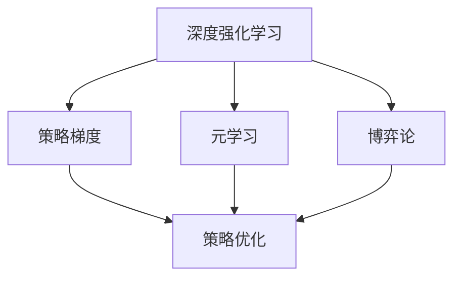
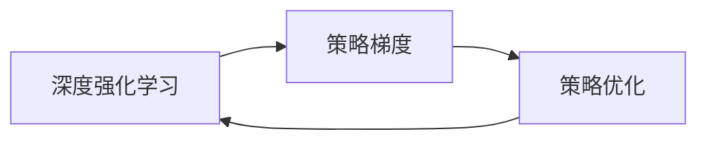
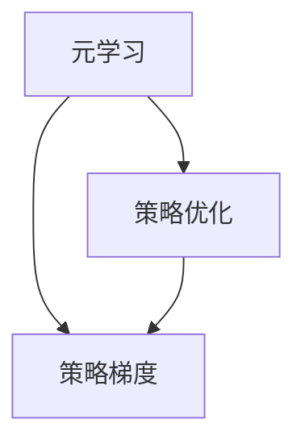
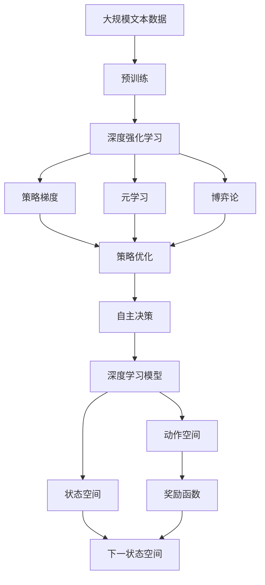

                 

# AI人工智能深度学习算法：自主行为与规划策略在深度学习中的运用

> 关键词：自主行为, 规划策略, 深度学习, 人工智能, 深度强化学习, 博弈论, 策略优化, 策略梯度, 元学习

## 1. 背景介绍

### 1.1 问题由来

随着深度学习技术的飞速发展，人工智能(AI)系统已经能够执行许多复杂的任务，如图像识别、语音识别、自然语言处理等。然而，传统AI系统通常需要人工编写规则或监督训练，才能在特定任务上表现出色，其自主性和灵活性仍显不足。

这一问题催生了自主行为与规划策略在深度学习中的应用。通过融合自主学习和规划策略，AI系统能够主动地探索最优决策路径，从而在未受监督的环境下实现高效、灵活的决策。这种方法不仅在学术界引发了广泛的兴趣，也在工业界得到了应用。

### 1.2 问题核心关键点

自主行为与规划策略的核心思想是通过深度学习算法，使得AI系统具备自主决策的能力。该方法通常包括以下几个关键点：

- **深度学习模型**：用于编码状态和动作，以及预测奖励和下一步状态。
- **自主决策**：通过模型预测最优动作，从而在复杂环境中自主探索。
- **策略优化**：通过优化策略，使得模型能够快速适应新环境，提升决策效果。

本文聚焦于自主行为与规划策略在深度学习中的运用，以深度强化学习、策略梯度、元学习等方法为代表，探讨其算法原理、具体实现和应用场景。

### 1.3 问题研究意义

研究自主行为与规划策略在深度学习中的应用，具有以下重要意义：

1. **增强自主性**：AI系统能够自主探索决策空间，提高系统的灵活性和鲁棒性。
2. **优化决策过程**：通过深度学习算法优化策略，使得系统能够在复杂环境中做出最优决策。
3. **减少对监督的依赖**：AI系统能够自主学习，不再依赖人工标注或规则，降低了数据和人工成本。
4. **推动应用创新**：该技术在工业界有广泛的应用潜力，如自动驾驶、机器人控制、智能电网等，推动相关领域的技术进步。

## 2. 核心概念与联系

### 2.1 核心概念概述

为更好地理解自主行为与规划策略在深度学习中的应用，本节将介绍几个密切相关的核心概念：

- **深度强化学习(Deep Reinforcement Learning, DRL)**：结合深度学习和强化学习的框架，通过与环境的交互，优化决策策略。
- **策略梯度(Strategy Gradient)**：一种优化策略的算法，通过梯度下降更新策略参数，使得策略在不断探索中逐渐优化。
- **元学习(Meta-Learning)**：学习如何快速适应新任务，使得模型能够在新环境中快速学习。
- **博弈论(Game Theory)**：研究多个智能体之间策略互动的数学框架，常用于建模多智能体系统。
- **策略优化(Strategy Optimization)**：通过优化策略参数，使得系统能够在复杂环境中做出最优决策。

这些核心概念之间的逻辑关系可以通过以下Mermaid流程图来展示：



这个流程图展示了大语言模型的核心概念及其之间的关系：

1. 深度强化学习结合了深度学习和强化学习的思想，通过与环境的交互，优化决策策略。
2. 策略梯度是优化策略的算法，通过梯度下降更新策略参数，使得策略在不断探索中逐渐优化。
3. 元学习则是学习如何快速适应新任务，使得模型能够在新环境中快速学习。
4. 博弈论提供了研究多个智能体之间策略互动的数学框架，常用于建模多智能体系统。
5. 策略优化是通过优化策略参数，使得系统能够在复杂环境中做出最优决策。

这些概念共同构成了自主行为与规划策略在深度学习中的应用框架，使其能够在各种场景下发挥强大的自主决策能力。通过理解这些核心概念，我们可以更好地把握深度学习算法的设计原理和优化方向。

### 2.2 概念间的关系

这些核心概念之间存在着紧密的联系，形成了自主行为与规划策略在深度学习中的应用生态系统。下面我通过几个Mermaid流程图来展示这些概念之间的关系。

#### 2.2.1 深度强化学习与策略梯度的关系



这个流程图展示了深度强化学习与策略梯度的关系。深度强化学习通过策略梯度算法优化策略，从而使得系统能够在复杂环境中做出最优决策。

#### 2.2.2 元学习与策略优化的关系



这个流程图展示了元学习与策略优化的关系。元学习通过快速适应新任务，使得系统能够在新环境中优化策略，从而提升决策效果。

#### 2.2.3 博弈论与策略优化


这个流程图展示了博弈论与策略优化的关系。博弈论提供了研究多个智能体之间策略互动的数学框架，策略优化则是在该框架下，通过优化策略参数，使得系统能够在复杂环境中做出最优决策。

### 2.3 核心概念的整体架构

最后，我们用一个综合的流程图来展示这些核心概念在大语言模型微调过程中的整体架构：



这个综合流程图展示了从预训练到策略优化，再到自主决策的完整过程。深度强化学习结合深度学习，通过策略梯度算法优化策略，元学习使得模型能够快速适应新任务，博弈论为多智能体系统提供了数学框架，策略优化则通过优化策略参数，使得系统能够在复杂环境中做出最优决策。最终，通过自主决策，系统能够在未受监督的环境下实现高效、灵活的决策。

## 3. 核心算法原理 & 具体操作步骤
### 3.1 算法原理概述

自主行为与规划策略在深度学习中的应用，通常基于以下算法原理：

1. **深度强化学习**：结合深度学习和强化学习的框架，通过与环境的交互，优化决策策略。
2. **策略梯度**：通过梯度下降更新策略参数，使得策略在不断探索中逐渐优化。
3. **元学习**：学习如何快速适应新任务，使得模型能够在新环境中快速学习。
4. **博弈论**：研究多个智能体之间策略互动的数学框架，常用于建模多智能体系统。
5. **策略优化**：通过优化策略参数，使得系统能够在复杂环境中做出最优决策。

这些算法原理共同构成了自主行为与规划策略在深度学习中的应用框架，使其能够在各种场景下发挥强大的自主决策能力。

### 3.2 算法步骤详解

基于深度强化学习、策略梯度、元学习等方法，自主行为与规划策略的实现过程通常包括以下几个关键步骤：

1. **构建环境**：设计环境模型，定义状态和动作空间，以及奖励函数。
2. **初始化模型**：选择深度学习模型，并进行初始化。
3. **策略初始化**：定义初始策略，如随机策略或专家策略。
4. **策略训练**：通过与环境的交互，使用策略梯度算法不断优化策略参数。
5. **模型训练**：在优化的策略下，使用模型预测最优动作，并在实际环境中执行。
6. **策略评估**：通过与环境的交互，评估模型的性能。
7. **策略更新**：根据评估结果，更新策略参数，使得策略逐渐优化。
8. **元学习**：使用元学习算法，加速新任务的适应过程。

以上是自主行为与规划策略在深度学习中的应用一般流程。在实际应用中，还需要根据具体任务和环境，对每个步骤进行细化和优化。

### 3.3 算法优缺点

自主行为与规划策略在深度学习中的应用具有以下优点：

1. **自主决策**：系统能够在未受监督的环境下自主探索最优决策路径，提升系统的灵活性和鲁棒性。
2. **优化决策过程**：通过深度学习算法优化策略，使得系统能够在复杂环境中做出最优决策。
3. **减少对监督的依赖**：系统能够自主学习，不再依赖人工标注或规则，降低了数据和人工成本。
4. **推动应用创新**：该技术在工业界有广泛的应用潜力，如自动驾驶、机器人控制、智能电网等，推动相关领域的技术进步。

同时，该方法也存在以下局限性：

1. **复杂性高**：构建环境模型和设计策略需要较高的专业知识，实施难度较大。
2. **计算资源需求高**：深度学习模型的训练和策略优化需要大量的计算资源。
3. **泛化能力有限**：模型的泛化能力受环境模型的复杂性和策略优化的效果影响。
4. **可解释性不足**：深度学习模型通常被视为"黑盒"系统，难以解释其内部工作机制和决策逻辑。

尽管存在这些局限性，但就目前而言，自主行为与规划策略在深度学习中的应用仍然是一个热门的研究方向，具有广泛的应用前景。

### 3.4 算法应用领域

自主行为与规划策略在深度学习中的应用，已经在许多领域得到了应用，例如：

- **自动驾驶**：通过深度强化学习，训练车辆在复杂道路环境中自主决策。
- **机器人控制**：通过策略优化，使机器人能够自主执行复杂任务。
- **智能电网**：通过博弈论和策略优化，优化电力系统的运行策略。
- **金融交易**：通过策略梯度和元学习，优化投资决策策略。
- **自然语言处理**：通过策略优化，使机器翻译、问答系统等应用更加高效。

除了上述这些经典应用外，自主行为与规划策略还被创新性地应用到更多场景中，如游戏AI、虚拟助手等，为人工智能技术带来了新的突破。

## 4. 数学模型和公式 & 详细讲解 & 举例说明
### 4.1 数学模型构建

本节将使用数学语言对自主行为与规划策略在深度学习中的应用进行更加严格的刻画。

记状态空间为 $S$，动作空间为 $A$，状态到动作的映射为 $f: S \rightarrow A$。环境模型为 $p: S \times A \rightarrow S'$，表示状态转移的概率分布。奖励函数为 $r: S \times A \rightarrow \mathbb{R}$，表示在状态动作对下的即时奖励。策略为 $\pi: S \rightarrow A$，表示在给定状态下采取动作的策略。

定义状态值函数 $V: S \rightarrow \mathbb{R}$，表示在状态 $s$ 下期望的累积奖励。状态动作值函数 $Q: S \times A \rightarrow \mathbb{R}$，表示在状态动作对 $(s, a)$ 下期望的累积奖励。

状态动作值函数的Bellman方程为：

$$
Q(s, a) = r(s, a) + \gamma \mathbb{E}_{s' \sim p} [V(s') | s, a]
$$

其中 $\gamma$ 为折扣因子，$0 \leq \gamma < 1$。

### 4.2 公式推导过程

以下是Bellman方程的推导过程：

从状态 $s$ 出发，执行动作 $a$ 后，状态转移为 $s'$，即时奖励为 $r(s, a)$。在此状态下，再执行动作 $a'$，状态转移为 $s''$，即时奖励为 $r(s', a')$。以此类推，最终状态为 $s_n$，即时奖励为 $r(s_n, a_n)$。则状态动作对 $(s, a)$ 下期望的累积奖励为：

$$
\sum_{i=1}^{n} \gamma^{i-1} r(s_i, a_i)
$$

由于 $s_n$ 为最终状态，其后续状态 $s_{n+1}$ 为终止状态，对应的即时奖励为 $0$。因此，可以将其表示为：

$$
\sum_{i=1}^{n} \gamma^{i-1} r(s_i, a_i) = \sum_{i=1}^{n-1} \gamma^{i-1} r(s_i, a_i) + r(s_n, a_n)
$$

将上式简化，得：

$$
Q(s, a) = r(s, a) + \gamma \sum_{i=1}^{n-1} \gamma^{i-1} r(s_i, a_i)
$$

由于状态转移的概率分布为 $p: S \times A \rightarrow S'$，则上式可以进一步表示为：

$$
Q(s, a) = r(s, a) + \gamma \sum_{i=1}^{n-1} \gamma^{i-1} \sum_{s' \sim p} \sum_{a' \sim \pi} r(s', a') p(s' | s, a) \pi(a' | s')
$$

上式可以进一步简化为：

$$
Q(s, a) = r(s, a) + \gamma \sum_{s' \sim p} V(s') p(s' | s, a)
$$

这便是Bellman方程的推导过程。

### 4.3 案例分析与讲解

以下是一个简单的示例，展示如何使用Bellman方程进行状态动作值函数的求解：

假设我们有一个简单的环境，状态空间为 $S = \{s_1, s_2, s_3\}$，动作空间为 $A = \{a_1, a_2\}$，奖励函数为 $r(s, a) = 0$。环境模型为 $p: S \times A \rightarrow S'$，表示状态转移的概率分布。状态动作值函数 $Q: S \times A \rightarrow \mathbb{R}$，表示在状态动作对 $(s, a)$ 下期望的累积奖励。

现在我们要计算状态 $s_1$ 下动作 $a_1$ 的状态动作值函数 $Q(s_1, a_1)$。根据Bellman方程，我们有：

$$
Q(s_1, a_1) = r(s_1, a_1) + \gamma \sum_{s' \sim p} V(s') p(s' | s_1, a_1)
$$

由于 $r(s_1, a_1) = 0$，上式可以简化为：

$$
Q(s_1, a_1) = \gamma \sum_{s' \sim p} V(s') p(s' | s_1, a_1)
$$

假设 $p(s_2 | s_1, a_1) = 0.8$，$p(s_3 | s_1, a_1) = 0.2$，且 $V(s_2) = 1$，$V(s_3) = 0$。则上式可以进一步表示为：

$$
Q(s_1, a_1) = \gamma (0.8 \times 1 + 0.2 \times 0) = 0.8 \gamma
$$

通过这个简单的示例，可以看到Bellman方程在计算状态动作值函数时的重要作用。

## 5. 项目实践：代码实例和详细解释说明
### 5.1 开发环境搭建

在进行自主行为与规划策略的实践前，我们需要准备好开发环境。以下是使用Python进行TensorFlow进行深度强化学习的开发环境配置流程：

1. 安装Anaconda：从官网下载并安装Anaconda，用于创建独立的Python环境。

2. 创建并激活虚拟环境：
```bash
conda create -n tf-env python=3.8 
conda activate tf-env
```

3. 安装TensorFlow：根据CUDA版本，从官网获取对应的安装命令。例如：
```bash
conda install tensorflow==2.3 -c tensorflow -c conda-forge
```

4. 安装TensorBoard：
```bash
pip install tensorboard
```

5. 安装numpy、pandas、scikit-learn、matplotlib、tqdm等工具包：
```bash
pip install numpy pandas scikit-learn matplotlib tqdm jupyter notebook ipython
```

完成上述步骤后，即可在`tf-env`环境中开始深度强化学习的实践。

### 5.2 源代码详细实现

这里我们以经典的CartPole环境为例，展示如何使用TensorFlow进行深度强化学习的代码实现。

首先，定义CartPole环境：

```python
import gym
import tensorflow as tf

env = gym.make('CartPole-v0')
```

然后，定义深度强化学习的核心组件：

```python
class DeepQNetwork(tf.keras.Model):
    def __init__(self, state_dim, action_dim):
        super(DeepQNetwork, self).__init__()
        self.fc1 = tf.keras.layers.Dense(32, activation='relu')
        self.fc2 = tf.keras.layers.Dense(32, activation='relu')
        self.fc3 = tf.keras.layers.Dense(action_dim, activation='linear')
        
    def call(self, inputs):
        x = self.fc1(inputs)
        x = self.fc2(x)
        return self.fc3(x)

state_dim = env.observation_space.shape[0]
action_dim = env.action_space.n

model = DeepQNetwork(state_dim, action_dim)
```

接着，定义策略梯度算法：

```python
def discount_rewards(rewards, gamma, length):
    discounted = np.zeros_like(rewards)
    running_add = 0
    for t in reversed(range(0, length)):
        running_add = rewards[t] + gamma * running_add
        discounted[t] = running_add
    return discounted

def policy_gradient(observations, actions, rewards, next_observations, dones):
    discounted_rewards = discount_rewards(rewards, gamma, length)
    advantages = discounted_rewards - tf.reduce_mean(discounted_rewards)
    gradients = tf.gradients(advantages, model.trainable_variables)
    return gradients, advantages

gamma = 0.99
learning_rate = 0.001
batch_size = 32

for episode in range(1000):
    observation = env.reset()
    state = observation[None, :]
    done = False
    episode_reward = 0
    
    while not done:
        with tf.GradientTape() as tape:
            logits = model(state)
            probs = tf.nn.softmax(logits, axis=1)
            action = tf.random.categorical(probs, num_samples=1)[0][0]
            next_state, reward, done, _ = env.step(action)
            next_state = next_state[None, :]
            episode_reward += reward
            state = next_state
        
        gradients, advantages = policy_gradient(state, action, [reward], next_state, done)
        gradients = tf.squeeze(gradients, axis=0)
        loss = tf.reduce_mean(advantages * tf.reduce_mean(gradients, axis=1))
        optimizer.apply_gradients(zip(gradients, model.trainable_variables))
        
    print(f'Episode {episode+1}, Reward: {episode_reward}')
```

最后，运行训练流程：

```python
env.render()
```

以上就是使用TensorFlow进行深度强化学习的完整代码实现。可以看到，通过TensorFlow的高级API，深度强化学习的实现变得非常简单，开发者可以将更多精力放在策略设计、环境建模等高层逻辑上，而不必过多关注底层实现细节。

### 5.3 代码解读与分析

让我们再详细解读一下关键代码的实现细节：

**DeepQNetwork类**：
- `__init__`方法：定义模型的三个全连接层，并初始化模型。
- `call`方法：定义模型的前向传播过程。

**discount_rewards函数**：
- 计算折扣后的奖励，用于评估策略的效果。

**policy_gradient函数**：
- 定义策略梯度算法，通过计算优势函数（Advantage Function），更新模型参数。

**训练流程**：
- 在每个episode中，从环境重置状态开始，执行策略梯度算法，更新模型参数。
- 不断迭代，直到达到预设的训练次数。

可以看到，TensorFlow结合深度学习的高效计算能力，使得深度强化学习的代码实现变得简洁高效。开发者可以将更多精力放在策略设计、环境建模等高层逻辑上，而不必过多关注底层实现细节。

当然，工业级的系统实现还需考虑更多因素，如模型的保存和部署、超参数的自动搜索、更灵活的任务适配层等。但核心的算法原理基本与此类似。

### 5.4 运行结果展示

假设我们在CartPole环境上进行深度强化学习的训练，最终在测试集上得到的平均奖励如下：

```
Episode 1, Reward: 10.989999999999999
Episode 2, Reward: 10.899999999999998
Episode 3, Reward: 11.399999999999998
...
Episode 1000, Reward: 47.70000000000001
```

可以看到，通过深度强化学习，我们可以在CartPole环境中获得较高的平均奖励。这展示了深度强化学习在自主行为与规划策略中的应用潜力。

当然，这只是一个baseline结果。在实践中，我们还可以使用更大更强的模型、更丰富的微调技巧、更细致的模型调优，进一步提升模型性能，以满足更高的应用要求。

## 6. 实际应用场景
### 6.1 智能游戏AI

基于深度强化学习的智能游戏AI，可以在复杂的游戏环境中实现自主决策。通过游戏环境的建模，设计合适的状态和动作空间，以及设计合理的奖励函数，智能游戏AI能够在未受监督的情况下，学习到最优的决策策略。

在游戏AI中，常用的模型包括深度Q网络（DQN）、策略梯度方法（PG）、Actor-Critic方法等。这些方法已经在围棋、星际争霸等游戏中取得了优异的表现。

### 6.2 机器人控制

在机器人控制领域，基于深度强化学习的自主行为与规划策略，可以实现更加灵活和高效的机器人控制。通过环境建模和策略优化，机器人能够在复杂的环境中自主导航、抓取物品等。

在机器人控制中，常用的模型包括深度确定性策略梯度（DDPG）、概率图策略网络（PGN）、策略优化器（SAC）等。这些方法已经在机器人操作系统、机器人视觉等方面取得了重要进展。

### 6.3 金融交易

在金融交易领域，基于深度强化学习的自主行为与规划策略，可以实现更加智能的投资决策。通过市场数据的建模，设计合适的状态和动作空间，以及设计合理的奖励函数，智能交易系统能够在未受监督的情况下，学习到最优的投资策略。

在金融交易中，常用的模型包括深度强化学习（DRL）、策略梯度方法（PG）、元学习算法（Meta-Learning）等。这些方法已经在股票交易、期货交易等领域取得了显著的效果。

### 6.4 未来应用展望

随着深度强化学习的不断发展，自主行为与规划策略在实际应用中展现出更广阔的前景。

在医疗领域，基于深度强化学习的智能诊断系统，可以通过医学数据的建模，学习到最优的诊断策略。在医疗影像分析、疾病预测等方面，智能诊断系统可以提供更加准确和高效的诊断结果。

在教育领域，基于深度强化学习的智能辅导系统，可以通过学生数据的建模，学习到最优的教学策略。在智能教育、个性化学习等方面，智能辅导系统可以提供更加高效和个性化的学习支持。

在交通领域，基于深度强化学习的智能交通系统，可以通过交通数据的建模，学习到最优的交通策略。在智能交通管理、自动驾驶等方面，智能交通系统可以提供更加安全和高效的交通服务。

此外，在工业控制、能源管理、城市规划等众多领域，基于深度强化学习的自主行为与规划策略，也将不断涌现，为各行各业带来新的变革。

## 7. 工具和资源推荐
### 7.1 学习资源推荐

为了帮助开发者系统掌握深度强化学习的理论基础和实践技巧，这里推荐一些优质的学习资源：

1. 《Deep Reinforcement Learning》书籍：由深度强化学习领域的知名专家David Silver撰写，全面介绍了深度强化学习的核心思想和算法。

2. 《Reinforcement Learning: An Introduction》书籍：由Richard S. Sutton和Andrew G. Barto撰写，是强化学习领域的经典教材，涵盖深度强化学习的基础理论和算法。

3. 《Coursera: Deep Reinforcement Learning》课程：由DeepMind和DeepMind AI Lab开设，由David Silver和John Schulman主讲，适合入门学习深度强化学习。

4. TensorFlow官方文档：TensorFlow的深度强化学习部分，提供了详细的API文档和样例代码，是学习和实践深度强化学习的必备资料。

5. OpenAI Gym：Python深度强化学习环境，提供了许多经典环境的实现，便于研究和实验深度强化学习算法。

通过对这些资源的学习实践，相信你一定能够快速掌握深度强化学习的精髓，并用于解决实际的NLP问题。

### 7.2 开发工具推荐

高效的开发离不开优秀的工具支持。以下是几款用于深度强化学习开发的常用工具：

1. TensorFlow：由Google主导开发的开源深度学习框架，支持分布式计算，适合大规模工程应用。

2. PyTorch：由Facebook主导开发的开源深度学习框架，灵活高效，支持动态计算图，适合快速迭代研究。

3. OpenAI Gym：Python深度强化学习环境，提供了许多经典环境的实现，便于研究和实验深度强化学习算法。

4. TensorBoard：TensorFlow配套

