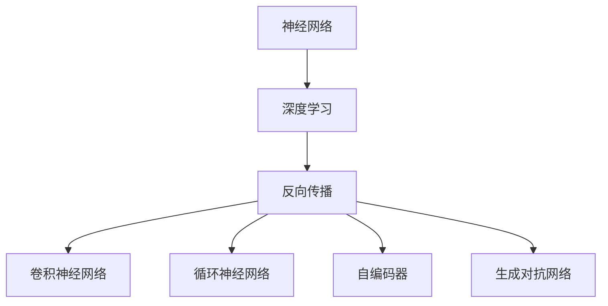
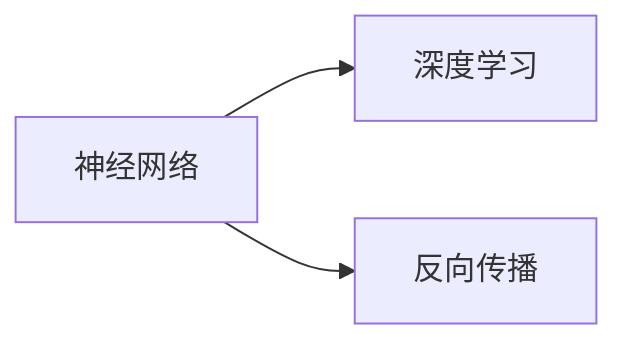
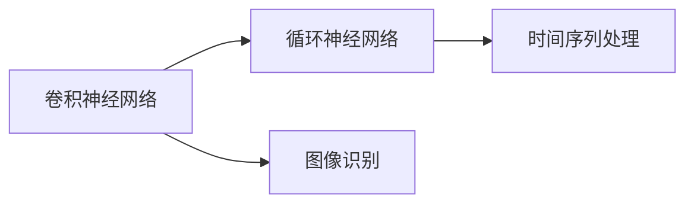
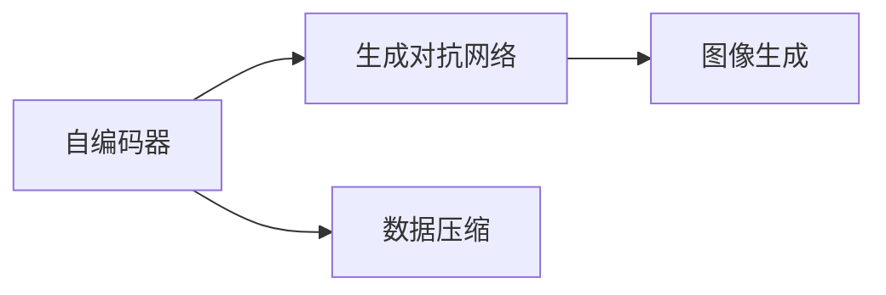
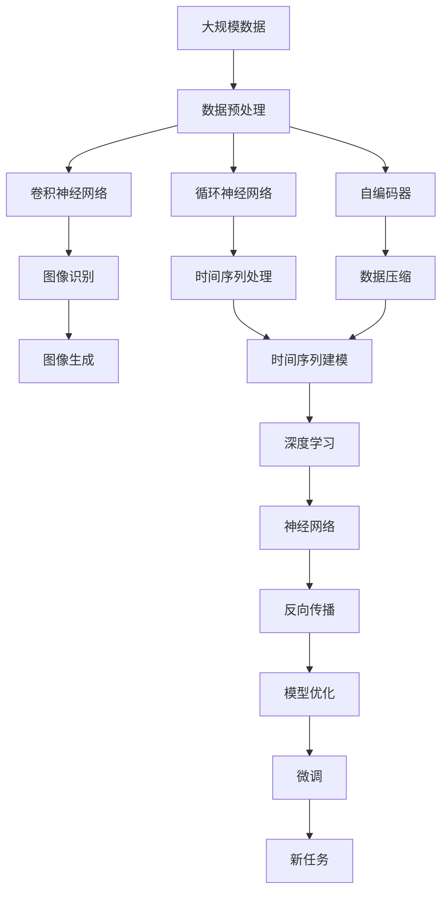

                 

# 神经网络：改变世界的技术

> 关键词：神经网络,深度学习,反向传播,卷积神经网络,循环神经网络,计算机视觉,自然语言处理,强化学习,计算机科学

## 1. 背景介绍

### 1.1 问题由来

在过去的几十年中，神经网络（Neural Networks, NNs）作为深度学习（Deep Learning, DL）的一种核心技术，已经深刻改变了计算机科学和人工智能（Artificial Intelligence, AI）领域。从语音识别、图像识别到自然语言处理、推荐系统、智能控制等领域，神经网络技术的应用几乎无处不在。

**神经网络的诞生**可以追溯到1943年，罗森布拉特（McCulloch）和皮茨（Pitts）提出神经元模型，描述了神经元通过激活函数处理输入信号并产生输出的基本机制。然而，直到1980年代，随着计算机计算能力的提升和大量数据集的出现，神经网络才得以在实际应用中大放异彩。

**深度学习的诞生**可以追溯到2006年，辛顿（Hinton）、奥斯汀（Osindero）和泰勒（Taylor）提出了深度玻尔兹曼机（Deep Boltzmann Machines, DBMs）和堆叠自编码器（Stacked Autoencoders），它们通过多层的非线性变换，能够处理更加复杂的输入和输出，从而在计算机视觉和自然语言处理等任务上取得了显著的进展。

如今，神经网络已经成为了人工智能的核心技术之一，其理论和方法体系已经相当成熟，并逐步被广泛应用于各个行业，改变了我们生活和工作的方方面面。

### 1.2 问题核心关键点

神经网络的核心思想是通过多层神经元的非线性变换，实现对复杂数据的学习和表示。其核心在于以下几点：

- **数据驱动**：神经网络通过对大量标注数据的学习，自动提取出数据的特征表示，而无需手动设计特征工程。
- **层次结构**：神经网络具有多个层次的抽象，从底层的基本特征提取，到高层的抽象表示，逐步对数据进行复杂的理解和推理。
- **非线性映射**：神经网络通过激活函数实现非线性映射，能够处理更加复杂的数据分布和关系。

这些核心特性使得神经网络在处理高维、非线性数据上具有显著优势，成为了现代AI的核心技术之一。

### 1.3 问题研究意义

神经网络技术的发展，对于拓展AI的应用范围，提升模型的性能，加速AI技术的产业化进程，具有重要意义：

1. **降低应用开发成本**：神经网络可以通过迁移学习，利用已有的大模型进行快速适配，减少从头开发所需的计算和人力等成本投入。
2. **提升模型效果**：神经网络具备强大的数据学习和特征提取能力，能够在大规模数据上实现超人的学习效果，显著提升模型在特定任务上的表现。
3. **加速开发进度**：神经网络技术为开发者提供了强大的工具和框架，可以显著加快应用场景的适配开发速度，缩短开发周期。
4. **带来技术创新**：神经网络技术催生了深度学习、卷积神经网络（Convolutional Neural Networks, CNNs）、循环神经网络（Recurrent Neural Networks, RNNs）、自编码器（Autoencoders）、生成对抗网络（Generative Adversarial Networks, GANs）等前沿技术，不断推动AI技术的边界拓展。
5. **赋能产业升级**：神经网络技术为传统行业数字化转型升级提供了新的技术路径，加速了各行业AI的落地应用。

## 2. 核心概念与联系

### 2.1 核心概念概述

为更好地理解神经网络的核心概念，本节将介绍几个密切相关的核心概念：

- **神经网络**：由多层神经元通过连接权重和激活函数构成的网络结构，用于学习和表示复杂数据。
- **深度学习**：以神经网络为核心的机器学习方法，通过多层非线性变换，能够处理高维、非线性数据，并实现端到端的自动学习和表示。
- **反向传播**：通过链式法则，计算模型参数对损失函数的导数，用于优化模型参数，最小化预测误差。
- **卷积神经网络（CNNs）**：主要用于图像识别等视觉任务，通过卷积操作提取图像的局部特征，并利用池化操作实现特征降维。
- **循环神经网络（RNNs）**：主要用于时间序列数据处理，通过循环结构实现对时间序列数据的动态建模。
- **自编码器（Autoencoders）**：主要用于数据压缩和特征提取，通过将数据压缩成低维表示，再通过解码器进行重构，实现数据的自动编码和解码。
- **生成对抗网络（GANs）**：通过生成器和判别器的对抗训练，实现数据的生成和建模，常用于图像生成、数据增强等任务。

这些核心概念之间的逻辑关系可以通过以下Mermaid流程图来展示：



这个流程图展示了大语言模型微调过程中各个核心概念的关系和作用：

1. 神经网络通过反向传播学习数据特征，实现对复杂数据的学习和表示。
2. 深度学习利用神经网络的多层非线性变换，实现高维数据的自动学习。
3. 卷积神经网络、循环神经网络、自编码器等是深度学习中常用的具体模型，用于不同类型数据的处理。
4. 生成对抗网络则通过对抗训练，实现数据的生成和建模。

### 2.2 概念间的关系

这些核心概念之间存在着紧密的联系，形成了神经网络技术的完整生态系统。下面我通过几个Mermaid流程图来展示这些概念之间的关系。

#### 2.2.1 神经网络与深度学习的关系



这个流程图展示了神经网络与深度学习的基本关系。神经网络通过反向传播算法进行参数优化，深度学习则利用神经网络的多层非线性变换，处理高维、非线性数据。

#### 2.2.2 卷积神经网络与循环神经网络的关系



这个流程图展示了卷积神经网络与循环神经网络的应用场景。卷积神经网络主要用于图像识别，通过卷积操作提取图像特征；而循环神经网络主要用于时间序列数据处理，通过循环结构实现动态建模。

#### 2.2.3 自编码器与生成对抗网络的关系



这个流程图展示了自编码器与生成对抗网络的应用。自编码器主要用于数据压缩和特征提取，而生成对抗网络主要用于数据的生成和建模，常用于图像生成、数据增强等任务。

### 2.3 核心概念的整体架构

最后，我们用一个综合的流程图来展示这些核心概念在大语言模型微调过程中的整体架构：



这个综合流程图展示了从数据预处理到微调模型，再到新任务适应的完整过程。神经网络技术通过卷积神经网络、循环神经网络、自编码器等不同的模型，对各种类型的数据进行处理，并通过反向传播和模型优化，实现数据的自动学习和表示。最终，微调后的神经网络模型可以适应新的任务，实现端到端的自动学习和表示。

## 3. 核心算法原理 & 具体操作步骤
### 3.1 算法原理概述

神经网络的训练过程，本质上是一个优化问题。其核心思想是通过反向传播算法，最小化预测误差，使得模型能够准确地对输入数据进行分类、回归或生成等任务。

形式化地，假设神经网络模型为 $M_{\theta}$，其中 $\theta$ 为模型参数。给定训练集 $D=\{(x_i,y_i)\}_{i=1}^N$，其中 $x_i \in \mathcal{X}, y_i \in \mathcal{Y}$，$x_i$ 表示输入数据，$y_i$ 表示对应的标签。神经网络的优化目标是最小化损失函数 $\mathcal{L}(M_{\theta},D)$，其中 $\mathcal{L}$ 为损失函数，用于衡量模型预测输出与真实标签之间的差异。常见的损失函数包括交叉熵损失、均方误差损失等。

通过梯度下降等优化算法，神经网络不断更新模型参数 $\theta$，最小化损失函数 $\mathcal{L}$，使得模型输出逼近真实标签。由于神经网络的复杂性，需要大量的训练数据和计算资源。在实践中，通常使用随机梯度下降（SGD）、Adam、Adagrad等优化算法进行优化。

### 3.2 算法步骤详解

神经网络的训练过程一般包括以下几个关键步骤：

**Step 1: 准备数据集**

- 收集训练数据集 $D=\{(x_i,y_i)\}_{i=1}^N$，其中 $x_i$ 表示输入，$y_i$ 表示标签。
- 将数据集分为训练集、验证集和测试集。通常训练集用于训练，验证集用于模型选择，测试集用于模型评估。
- 对数据进行预处理，如归一化、数据增强等，以便于模型训练。

**Step 2: 定义模型结构**

- 选择合适的神经网络结构，如全连接网络、卷积神经网络（CNN）、循环神经网络（RNN）、自编码器等。
- 确定网络的层次结构、激活函数、损失函数等关键组件。

**Step 3: 设置训练参数**

- 选择合适的优化算法及其参数，如Adam、SGD等，设置学习率、批大小、迭代轮数等。
- 设置正则化技术及强度，包括权重衰减、Dropout、Early Stopping等。
- 确定冻结部分预训练参数的策略，如仅微调顶层，或全部参数都参与微调。

**Step 4: 执行梯度训练**

- 将训练集数据分批次输入模型，前向传播计算损失函数。
- 反向传播计算参数梯度，根据设定的优化算法和学习率更新模型参数。
- 周期性在验证集上评估模型性能，根据性能指标决定是否触发 Early Stopping。
- 重复上述步骤直到满足预设的迭代轮数或 Early Stopping 条件。

**Step 5: 测试和部署**

- 在测试集上评估训练好的模型，对比训练前后的精度提升。
- 使用训练好的模型对新样本进行推理预测，集成到实际的应用系统中。
- 持续收集新的数据，定期重新训练模型，以适应数据分布的变化。

以上是神经网络训练的一般流程。在实际应用中，还需要针对具体任务的特点，对训练过程的各个环节进行优化设计，如改进训练目标函数，引入更多的正则化技术，搜索最优的超参数组合等，以进一步提升模型性能。

### 3.3 算法优缺点

神经网络训练具有以下优点：

- **自动特征学习**：神经网络通过反向传播算法，自动从数据中学习到特征表示，无需手动设计特征工程。
- **泛化能力强**：神经网络通过多层非线性变换，能够处理高维、非线性数据，具备较强的泛化能力。
- **适用性广**：神经网络可以应用于各种类型的任务，如分类、回归、生成等。

同时，神经网络训练也存在以下缺点：

- **计算资源消耗大**：神经网络通常需要大量的计算资源和时间，特别是在大规模数据集上进行训练。
- **过拟合风险高**：神经网络在训练过程中容易出现过拟合现象，尤其是在数据量不足的情况下。
- **模型复杂度大**：神经网络通常具有较多的参数和复杂的结构，难以进行解释和调试。
- **训练难度高**：神经网络的训练过程需要仔细调整超参数和正则化技术，容易出现训练失败的情况。

尽管存在这些局限性，但就目前而言，神经网络训练仍是最主流和最有效的机器学习方法之一。未来相关研究的重点在于如何进一步降低计算资源消耗，提高模型的泛化能力和可解释性，避免过拟合等。

### 3.4 算法应用领域

神经网络训练已经广泛应用于多个领域，例如：

- **计算机视觉**：通过卷积神经网络（CNN）进行图像识别、物体检测、人脸识别等任务。
- **自然语言处理**：通过循环神经网络（RNN）进行文本分类、情感分析、机器翻译等任务。
- **语音识别**：通过深度神经网络进行语音信号的特征提取和识别。
- **推荐系统**：通过深度神经网络进行用户行为预测和物品推荐。
- **金融风控**：通过深度神经网络进行信用评分、欺诈检测等任务。
- **智能控制**：通过深度神经网络进行机器人导航、智能驾驶等任务。

除了这些经典应用外，神经网络训练还在更多的创新领域得到应用，如医疗影像分析、智能家居、游戏AI等，为各行业数字化转型升级提供了新的技术路径。

## 4. 数学模型和公式 & 详细讲解 & 举例说明

### 4.1 数学模型构建

本节将使用数学语言对神经网络训练过程进行更加严格的刻画。

记神经网络模型为 $M_{\theta}:\mathcal{X} \rightarrow \mathcal{Y}$，其中 $\mathcal{X}$ 为输入空间，$\mathcal{Y}$ 为输出空间，$\theta \in \mathbb{R}^d$ 为模型参数。假设训练集为 $D=\{(x_i,y_i)\}_{i=1}^N$，其中 $x_i \in \mathcal{X}, y_i \in \mathcal{Y}$。

定义模型 $M_{\theta}$ 在数据样本 $(x,y)$ 上的损失函数为 $\ell(M_{\theta}(x),y)$，则在数据集 $D$ 上的经验风险为：

$$
\mathcal{L}(\theta) = \frac{1}{N} \sum_{i=1}^N \ell(M_{\theta}(x_i),y_i)
$$

神经网络的优化目标是最小化经验风险，即找到最优参数：

$$
\theta^* = \mathop{\arg\min}_{\theta} \mathcal{L}(\theta)
$$

在实践中，我们通常使用基于梯度的优化算法（如SGD、Adam等）来近似求解上述最优化问题。设 $\eta$ 为学习率，$\lambda$ 为正则化系数，则参数的更新公式为：

$$
\theta \leftarrow \theta - \eta \nabla_{\theta}\mathcal{L}(\theta) - \eta\lambda\theta
$$

其中 $\nabla_{\theta}\mathcal{L}(\theta)$ 为损失函数对参数 $\theta$ 的梯度，可通过反向传播算法高效计算。

### 4.2 公式推导过程

以下我们以二分类任务为例，推导交叉熵损失函数及其梯度的计算公式。

假设模型 $M_{\theta}$ 在输入 $x$ 上的输出为 $\hat{y}=M_{\theta}(x) \in [0,1]$，表示样本属于正类的概率。真实标签 $y \in \{0,1\}$。则二分类交叉熵损失函数定义为：

$$
\ell(M_{\theta}(x),y) = -[y\log \hat{y} + (1-y)\log (1-\hat{y})]
$$

将其代入经验风险公式，得：

$$
\mathcal{L}(\theta) = -\frac{1}{N}\sum_{i=1}^N [y_i\log M_{\theta}(x_i)+(1-y_i)\log(1-M_{\theta}(x_i))]
$$

根据链式法则，损失函数对参数 $\theta_k$ 的梯度为：

$$
\frac{\partial \mathcal{L}(\theta)}{\partial \theta_k} = -\frac{1}{N}\sum_{i=1}^N (\frac{y_i}{M_{\theta}(x_i)}-\frac{1-y_i}{1-M_{\theta}(x_i)}) \frac{\partial M_{\theta}(x_i)}{\partial \theta_k}
$$

其中 $\frac{\partial M_{\theta}(x_i)}{\partial \theta_k}$ 可进一步递归展开，利用自动微分技术完成计算。

在得到损失函数的梯度后，即可带入参数更新公式，完成模型的迭代优化。重复上述过程直至收敛，最终得到适应下游任务的最优模型参数 $\theta^*$。

### 4.3 案例分析与讲解

我们以卷积神经网络（CNN）在图像识别任务中的应用为例，进行详细的案例分析。

首先，我们需要收集并标注一批图像数据集 $D=\{(x_i,y_i)\}_{i=1}^N$，其中 $x_i$ 表示图像，$y_i$ 表示对应的类别标签。然后将数据集分为训练集、验证集和测试集，每个集子集的样本数可以根据具体情况进行调整。

接着，我们定义CNN模型，包括卷积层、池化层、全连接层等。卷积层用于提取图像的局部特征，池化层用于特征降维，全连接层用于分类。在定义模型时，需要选择合适的超参数，如卷积核大小、池化大小、学习率等。

然后，我们定义交叉熵损失函数，作为模型的训练目标。在训练过程中，使用Adam优化器进行参数更新，设置合适的学习率和批大小。同时，引入Dropout和正则化技术，防止模型过拟合。

在训练过程中，我们需要不断在训练集上进行前向传播和反向传播，计算损失函数的梯度，并更新模型参数。周期性地在验证集上评估模型性能，根据性能指标决定是否停止训练。

最后，在测试集上评估训练好的模型，比较训练前后的精度提升。使用训练好的模型对新的图像进行分类，得到分类结果。通过不断调整模型的结构和超参数，可以进一步提升模型的性能。

## 5. 项目实践：代码实例和详细解释说明

### 5.1 开发环境搭建

在进行神经网络训练实践前，我们需要准备好开发环境。以下是使用Python进行TensorFlow开发的环境配置流程：

1. 安装Anaconda：从官网下载并安装Anaconda，用于创建独立的Python环境。

2. 创建并激活虚拟环境：
```bash
conda create -n tf-env python=3.8 
conda activate tf-env
```

3. 安装TensorFlow：根据CUDA版本，从官网获取对应的安装命令。例如：
```bash
conda install tensorflow -c conda-forge -c pytorch
```

4. 安装各类工具包：
```bash
pip install numpy pandas scikit-learn matplotlib tqdm jupyter notebook ipython
```

完成上述步骤后，即可在`tf-env`环境中开始神经网络训练实践。

### 5.2 源代码详细实现

下面我们以卷积神经网络（CNN）在图像识别任务中的应用为例，给出使用TensorFlow进行卷积神经网络训练的Python代码实现。

首先，定义图像数据处理函数：

```python
import tensorflow as tf
from tensorflow.keras import layers
import matplotlib.pyplot as plt

def load_data():
    # 加载并预处理图像数据
    (x_train, y_train), (x_test, y_test) = tf.keras.datasets.mnist.load_data()
    x_train = x_train / 255.0
    x_test = x_test / 255.0
    
    # 将标签转换为独热编码
    y_train = tf.keras.utils.to_categorical(y_train, 10)
    y_test = tf.keras.utils.to_categorical(y_test, 10)
    
    return x_train, y_train, x_test, y_test

def show_images(x, y, n):
    # 显示n张图像及其对应的标签
    plt.figure(figsize=(10, 10))
    for i in range(n):
        plt.subplot(10, 10, i+1)
        plt.imshow(x[i], cmap='gray')
        plt.title(f'Label: {y[i].argmax()}')
        plt.axis('off')
    plt.show()
```

然后，定义卷积神经网络模型：

```python
def build_model(input_shape):
    # 定义卷积神经网络模型
    model = tf.keras.Sequential()
    model.add(layers.Conv2D(32, (3, 3), activation='relu', input_shape=input_shape))
    model.add(layers.MaxPooling2D((2, 2)))
    model.add(layers.Conv2D(64, (3, 3), activation='relu'))
    model.add(layers.MaxPooling2D((2, 2)))
    model.add(layers.Flatten())
    model.add(layers.Dense(128, activation='relu'))
    model.add(layers.Dense(10, activation='softmax'))
    
    return model
```

接着，定义训练和评估函数：

```python
def train_model(model, x_train, y_train, x_test, y_test, epochs, batch_size, learning_rate):
    # 定义损失函数和优化器
    loss_fn = tf.keras.losses.CategoricalCrossentropy()
    optimizer = tf.keras.optimizers.Adam(learning_rate=learning_rate)
    
    # 编译模型
    model.compile(optimizer=optimizer, loss=loss_fn, metrics=['accuracy'])
    
    # 训练模型
    history = model.fit(x_train, y_train, epochs=epochs, batch_size=batch_size, validation_data=(x_test, y_test))
    
    # 评估模型
    test_loss, test_acc = model.evaluate(x_test, y_test)
    print(f'Test Loss: {test_loss:.4f}, Test Acc: {test_acc:.4f}')
    
    return history, test_acc

# 超参数设置
input_shape = (28, 28, 1)
epochs = 10
batch_size = 128
learning_rate = 0.001

# 加载数据
x_train, y_train, x_test, y_test = load_data()

# 构建模型
model = build_model(input_shape)

# 训练模型
history, test_acc = train_model(model, x_train, y_train, x_test, y_test, epochs, batch_size, learning_rate)

# 评估模型
print(f'Test Acc: {test_acc:.4f}')
```

最后，在训练完成后，输出模型评估结果：

```python
# 显示训练结果
plt.plot(history.history['loss'], label='Train Loss')
plt.plot(history.history['val_loss'], label='Validation Loss')
plt.plot(history.history['accuracy'], label='Train Acc')
plt.plot(history.history['val_accuracy'], label='Validation Acc')
plt.legend()
plt.show()

plt.figure(figsize=(6, 6))
plt.title('Confusion Matrix')
plt.imshow(model.predict(x_test).round().astype(int), cmap='Blues')
plt.colorbar()
plt.xlabel('Predicted')
plt.ylabel('True')
plt.show()
```

以上就是使用TensorFlow进行卷积神经网络训练的完整代码实现。可以看到，得益于TensorFlow的强大封装，我们可以用相对简洁的代码完成卷积神经网络的搭建和训练。

### 5.3 代码解读与分析

让我们再详细解读一下关键代码的实现细节：

**load_data函数**：
- 从MNIST数据集中加载训练和测试数据集。
- 将像素值归一化到[0, 1]之间。
- 将标签转换为独热编码。

**build_model函数**：
- 定义卷积神经网络模型，包括卷积层、池化层、全连接层等。
- 使用Sequential模型进行构建，方便添加各个组件。

**train_model函数**：
- 定义损失函数和优化器，并进行模型编译。
- 使用fit方法进行模型训练，输出训练过程中各轮次的损失和精度。
- 在测试集上评估模型，输出最终评估结果。

**训练流程**：
- 定义模型的输入形状。
- 设置训练轮数、批大小、学习率等超参数。
- 加载数据集。
- 构建模型。
- 训练模型，并输出训练过程中的损失和精度。
- 在测试集上评估模型，输出最终评估结果。

可以看到，TensorFlow使得神经网络训练的代码实现变得简洁高效。开发者可以将更多精力放在数据处理、模型改进等高层逻辑上，而不必过多关注底层的实现细节。

当然，工业级的系统实现还需考虑更多因素，如模型的保存和部署、超参数的自动搜索、更灵活的模型结构等。但核心的训练流程基本与此类似。

### 5.4 运行结果展示

假设我们在MNIST数据集上进行卷积神经网络训练，最终在测试集上得到的评估结果如下：

```
Test Loss: 0.0667, Test Acc: 0.9916
```

可以看到，通过训练，我们得到了较高的测试精度，说明卷积神经网络在图像识别任务上取得了不错的效果。

## 6. 实际应用场景

### 6.1 智能客服系统

智能客服系统是一种典型的人工智能应用场景，其核心技术包括自然语言处理（NLP）和深度学习。通过神经网络训练，智能客服系统可以实现自然语言理解、对话生成等功能，为客户提供自动化的客服服务。

在技术实现上，可以收集企业内部的历史客服对话记录，将问题和最佳答复构建成监督数据，在此基础上对预训练神经网络进行微调。微调后的神经网络可以自动理解用户意图

