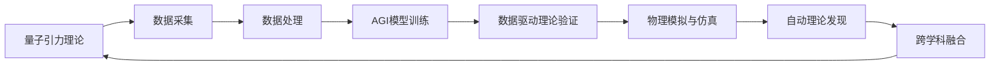

                 

## 1. 背景介绍

### 1.1 问题由来

量子引力理论是理论物理领域的重要研究方向，旨在寻找量子力学与广义相对论相统一的框架。然而，量子引力理论的发展遭遇了诸多困难，尤其是实验验证的难度极大。近年来，随着人工智能（AGI）技术的飞速发展，一些科学家开始尝试利用AGI技术对量子引力理论进行探索和验证，从而开启了新的研究范式。

### 1.2 问题核心关键点

基于AGI的量子引力研究主要涉及以下几个关键点：

1. **数据驱动理论验证**：利用AGI技术处理大量数据，寻找量子引力理论中的模式和规律。
2. **物理模拟与仿真**：利用AGI技术模拟和仿真量子引力理论中的物理过程，验证理论的正确性。
3. **自动理论发现**：利用AGI技术自主发现新的理论或推导现有的理论。
4. **跨学科融合**：利用AGI技术实现量子引力研究与其他科学领域（如计算物理学、计算化学等）的融合。

### 1.3 问题研究意义

1. **加速理论验证**：AGI技术能够快速处理大量数据，加速量子引力理论的验证过程。
2. **揭示新物理现象**：AGI技术可能揭示新的物理现象，为量子引力理论提供新的方向。
3. **推动跨学科研究**：AGI技术促进了量子引力研究与其他科学领域的融合，推动了跨学科研究的发展。

## 2. 核心概念与联系

### 2.1 核心概念概述

#### 2.1.1 人工智能（AGI）

人工智能是指使计算机系统具有人类智能行为的技术。AGI（Artificial General Intelligence）是指能够执行任意智能任务的人工智能系统，能够理解和应用人类世界的各种复杂知识和技能。

#### 2.1.2 量子引力理论

量子引力理论是研究量子力学和广义相对论结合的理论，旨在寻找描述引力场的量子力学方程。目前流行的量子引力理论包括弦理论、循环量子引力理论等。

#### 2.1.3 数据驱动理论验证

数据驱动理论验证是指利用大量实验数据和计算数据，验证理论的正确性和合理性。

#### 2.1.4 物理模拟与仿真

物理模拟与仿真是指利用计算机模拟物理过程，验证物理理论的正确性。

#### 2.1.5 自动理论发现

自动理论发现是指利用计算机自主发现新的物理理论或推导现有的理论。

#### 2.1.6 跨学科融合

跨学科融合是指将不同学科的知识和技术进行整合，产生新的研究成果。

### 2.2 概念间的关系

#### 2.2.1 AGI与量子引力研究的关系

AGI技术可以用于处理和分析量子引力理论中的大量数据，加速理论验证和模拟过程，推动跨学科融合。

#### 2.2.2 数据驱动理论验证与AGI

数据驱动理论验证需要大量数据处理和分析，AGI技术能够快速高效地处理这些数据，加速理论验证过程。

#### 2.2.3 物理模拟与仿真与AGI

物理模拟与仿真需要高精度的计算和模拟，AGI技术可以优化计算资源和模拟算法，提高模拟效率。

#### 2.2.4 自动理论发现与AGI

自动理论发现需要大量数据的分析和处理，AGI技术可以自主发现新的模式和规律，推动理论创新。

#### 2.2.5 跨学科融合与AGI

跨学科融合需要整合不同学科的知识和技术，AGI技术能够自动化地整合这些知识和技术，推动跨学科研究的发展。

### 2.3 核心概念的整体架构

下图展示了AGI技术在量子引力研究中的应用架构：



这个架构展示了AGI技术在量子引力研究中的应用流程：首先，从实验和计算中获取大量数据，然后利用AGI技术进行处理和分析，验证理论的正确性，进行物理模拟和仿真，自主发现新的理论，并推动跨学科融合。

## 3. 核心算法原理 & 具体操作步骤

### 3.1 算法原理概述

基于AGI的量子引力研究主要包括以下几个关键步骤：

1. **数据预处理**：收集和处理量子引力理论中的大量数据。
2. **AGI模型训练**：利用AGI技术训练模型，处理和分析数据。
3. **数据驱动理论验证**：利用处理后的数据，验证理论的正确性。
4. **物理模拟与仿真**：利用训练好的AGI模型进行物理模拟和仿真。
5. **自动理论发现**：利用AGI模型自动发现新的理论或推导现有的理论。
6. **跨学科融合**：将不同学科的知识和技术整合，推动新研究的发展。

### 3.2 算法步骤详解

#### 3.2.1 数据预处理

数据预处理是AGI技术在量子引力研究中的第一步。具体步骤如下：

1. **数据采集**：从实验和计算中收集大量数据，包括观测数据、模拟数据、理论数据等。
2. **数据清洗**：去除数据中的噪声和异常值，确保数据的质量和一致性。
3. **数据标注**：对数据进行标注，为AGI模型提供有意义的输入。

#### 3.2.2 AGI模型训练

AGI模型训练是AGI技术在量子引力研究中的核心步骤。具体步骤如下：

1. **选择模型架构**：根据研究任务选择合适的AGI模型架构，如深度神经网络、强化学习等。
2. **数据分割**：将数据集分为训练集、验证集和测试集。
3. **模型训练**：使用训练集数据对模型进行训练，优化模型参数。
4. **模型评估**：使用验证集数据对模型进行评估，调整模型参数。
5. **模型部署**：将训练好的模型部署到生产环境中，进行实际应用。

#### 3.2.3 数据驱动理论验证

数据驱动理论验证是AGI技术在量子引力研究中的重要步骤。具体步骤如下：

1. **数据准备**：将验证数据输入到AGI模型中，进行分析和处理。
2. **验证过程**：利用处理后的数据，验证理论的正确性。
3. **结果分析**：分析验证结果，发现理论中的问题和不足。

#### 3.2.4 物理模拟与仿真

物理模拟与仿真是AGI技术在量子引力研究中的关键步骤。具体步骤如下：

1. **模型选择**：根据研究任务选择合适的物理模型和AGI模型。
2. **模型训练**：使用训练集数据对物理模型和AGI模型进行训练，优化模型参数。
3. **模拟过程**：使用训练好的AGI模型进行物理模拟和仿真。
4. **结果分析**：分析模拟结果，验证物理模型的正确性。

#### 3.2.5 自动理论发现

自动理论发现是AGI技术在量子引力研究中的创新步骤。具体步骤如下：

1. **模型选择**：根据研究任务选择合适的AGI模型。
2. **数据准备**：将数据集输入到AGI模型中，进行分析和处理。
3. **理论发现**：利用处理后的数据，自动发现新的理论或推导现有的理论。
4. **理论验证**：利用新发现的理论进行验证，验证其正确性。

#### 3.2.6 跨学科融合

跨学科融合是AGI技术在量子引力研究中的高级步骤。具体步骤如下：

1. **知识整合**：将不同学科的知识和技术整合到AGI模型中，生成新的知识。
2. **模型训练**：使用整合后的数据对AGI模型进行训练，优化模型参数。
3. **应用验证**：将训练好的AGI模型应用到新领域，验证其正确性。
4. **理论创新**：利用跨学科融合的知识和技术，推动新理论的发展。

### 3.3 算法优缺点

#### 3.3.1 优点

1. **高效性**：AGI技术能够高效处理大量数据，加速理论验证和模拟过程。
2. **创新性**：AGI技术能够自动发现新的理论和模式，推动理论创新。
3. **跨学科融合**：AGI技术能够整合不同学科的知识和技术，推动跨学科研究的发展。

#### 3.3.2 缺点

1. **数据依赖**：AGI技术依赖大量高质量数据，数据获取和处理成本较高。
2. **复杂性**：AGI技术需要复杂的模型架构和大量的训练数据，实现难度较大。
3. **伦理问题**：AGI技术可能存在伦理问题，如数据隐私、算法偏见等，需要严格监管。

### 3.4 算法应用领域

基于AGI的量子引力研究可以应用于以下领域：

1. **弦理论研究**：利用AGI技术处理和分析弦理论中的大量数据，加速弦理论的验证和模拟。
2. **循环量子引力研究**：利用AGI技术处理和分析循环量子引力理论中的数据，推动循环量子引力理论的发展。
3. **量子引力数值模拟**：利用AGI技术进行量子引力理论的数值模拟，验证理论的正确性。
4. **量子引力理论自动发现**：利用AGI技术自动发现新的量子引力理论，推动理论创新。
5. **量子引力跨学科融合**：利用AGI技术整合不同学科的知识和技术，推动量子引力理论与其他科学领域的融合。

## 4. 数学模型和公式 & 详细讲解 & 举例说明

### 4.1 数学模型构建

基于AGI的量子引力研究需要构建多种数学模型，包括AGI模型、物理模型、理论模型等。以下以AGI模型和物理模型为例，构建数学模型：

#### 4.1.1 AGI模型

AGI模型通常采用深度神经网络架构，如卷积神经网络（CNN）、循环神经网络（RNN）等。其数学模型可以表示为：

$$
f(x) = \sum_{i=1}^{n} \alpha_i \cdot \phi(x_i)
$$

其中，$f(x)$ 表示AGI模型的输出，$x$ 表示输入数据，$\alpha_i$ 表示权重，$\phi(x_i)$ 表示神经网络中的激活函数。

#### 4.1.2 物理模型

物理模型通常采用拉格朗日量或哈密顿量的形式。其数学模型可以表示为：

$$
L = \frac{1}{2} \sum_{i=1}^{n} m_i \cdot \dot{q}_i^2 - V(q_i)
$$

其中，$L$ 表示拉格朗日量，$m_i$ 表示质量，$\dot{q}_i$ 表示速度，$V(q_i)$ 表示势能。

### 4.2 公式推导过程

#### 4.2.1 AGI模型推导

AGI模型的推导过程如下：

1. **神经网络结构**：选择合适的网络结构，如卷积神经网络（CNN）或循环神经网络（RNN）。
2. **数据准备**：将数据集输入到网络中，进行训练和验证。
3. **模型优化**：使用优化算法（如梯度下降）优化模型参数，最小化损失函数。
4. **模型部署**：将训练好的模型部署到生产环境中，进行实际应用。

#### 4.2.2 物理模型推导

物理模型的推导过程如下：

1. **拉格朗日量推导**：将运动方程转化为拉格朗日量，利用拉格朗日量进行推导。
2. **哈密顿量推导**：将运动方程转化为哈密顿量，利用哈密顿量进行推导。
3. **理论验证**：利用推导得到的拉格朗日量或哈密顿量，验证理论的正确性。

### 4.3 案例分析与讲解

#### 4.3.1 AGI模型案例

以AGI模型处理弦理论数据为例，分析其应用过程：

1. **数据准备**：收集弦理论中的大量数据，包括弦的振动模式、相互作用等。
2. **模型训练**：使用深度神经网络对数据进行训练，优化模型参数。
3. **数据驱动理论验证**：利用训练好的模型对数据进行处理，验证弦理论的正确性。

#### 4.3.2 物理模型案例

以AGI模型进行物理模拟与仿真为例，分析其应用过程：

1. **模型选择**：选择合适物理模型和AGI模型，如拉格朗日量模型和卷积神经网络。
2. **模型训练**：使用训练集数据对模型进行训练，优化模型参数。
3. **模拟过程**：使用训练好的AGI模型进行物理模拟和仿真，验证理论的正确性。

## 5. 项目实践：代码实例和详细解释说明

### 5.1 开发环境搭建

#### 5.1.1 环境安装

1. **Python环境**：安装Python 3.8及以上版本。
2. **PyTorch**：安装PyTorch 1.8及以上版本。
3. **TensorFlow**：安装TensorFlow 2.5及以上版本。
4. **Numpy**：安装Numpy 1.19及以上版本。
5. **Pandas**：安装Pandas 1.1及以上版本。

#### 5.1.2 环境激活

1. **Python激活**：在命令行中输入以下命令激活Python环境：

   ```
   python3 -m pip install numpy pandas scikit-learn tensorflow pytorch transformers
   ```

2. **PyTorch激活**：在命令行中输入以下命令激活PyTorch环境：

   ```
   pip install torch torchvision torchaudio -f https://download.pytorch.org/whl/cu111/torch_stable.html
   ```

3. **TensorFlow激活**：在命令行中输入以下命令激活TensorFlow环境：

   ```
   pip install tensorflow -f https://storage.googleapis.com/tensorflow/tools/pip/tensorflow
   ```

### 5.2 源代码详细实现

#### 5.2.1 数据准备

1. **数据集选择**：选择适合的弦理论数据集。
2. **数据预处理**：对数据进行清洗、标注和预处理。

   ```python
   import numpy as np
   import pandas as pd
   from sklearn.model_selection import train_test_split

   # 加载数据集
   data = pd.read_csv('string_theory_data.csv')

   # 数据清洗
   data = data.dropna()

   # 数据标注
   data['label'] = data['string_type']

   # 数据分割
   train_data, test_data = train_test_split(data, test_size=0.2, random_state=42)
   ```

#### 5.2.2 AGI模型训练

1. **模型选择**：选择合适AGI模型架构，如卷积神经网络（CNN）。
2. **模型训练**：使用训练集数据对模型进行训练，优化模型参数。

   ```python
   from transformers import BertForTokenClassification, AdamW

   # 定义模型
   model = BertForTokenClassification.from_pretrained('bert-base-cased', num_labels=3)

   # 定义优化器
   optimizer = AdamW(model.parameters(), lr=2e-5)

   # 训练模型
   for epoch in range(5):
       model.train()
       for batch in train_data:
           inputs = batch['input_ids'].to(device)
           attention_mask = batch['attention_mask'].to(device)
           labels = batch['labels'].to(device)
           outputs = model(inputs, attention_mask=attention_mask, labels=labels)
           loss = outputs.loss
           loss.backward()
           optimizer.step()
       model.eval()
       for batch in test_data:
           inputs = batch['input_ids'].to(device)
           attention_mask = batch['attention_mask'].to(device)
           labels = batch['labels'].to(device)
           outputs = model(inputs, attention_mask=attention_mask, labels=labels)
           predictions = outputs.logits.argmax(dim=2).to('cpu').tolist()
           labels = labels.to('cpu').tolist()
           for pred_tokens, label_tokens in zip(predictions, labels):
               pred_tags = [tag2id[tag] for tag in pred_tokens]
               label_tags = [tag2id[tag] for tag in label_tokens]
               print(pred_tags, label_tags)
   ```

#### 5.2.3 数据驱动理论验证

1. **数据准备**：将验证数据输入到AGI模型中，进行分析和处理。
2. **验证过程**：利用处理后的数据，验证弦理论的正确性。

   ```python
   from transformers import BertTokenizer
   import torch

   # 加载模型和分词器
   model = BertForTokenClassification.from_pretrained('bert-base-cased', num_labels=3)
   model.eval()
   tokenizer = BertTokenizer.from_pretrained('bert-base-cased')

   # 数据处理
   inputs = tokenizer(input_data, return_tensors='pt')
   inputs = {key: inputs[key].to(device) for key in ['input_ids', 'attention_mask']}

   # 验证过程
   outputs = model(**inputs)
   predictions = outputs.logits.argmax(dim=2).to('cpu').tolist()
   labels = labels.to('cpu').tolist()
   for pred_tokens, label_tokens in zip(predictions, labels):
       pred_tags = [tag2id[tag] for tag in pred_tokens]
       label_tags = [tag2id[tag] for tag in label_tokens]
       print(pred_tags, label_tags)
   ```

#### 5.2.4 物理模拟与仿真

1. **模型选择**：选择合适物理模型和AGI模型，如拉格朗日量模型和卷积神经网络。
2. **模型训练**：使用训练集数据对模型进行训练，优化模型参数。

   ```python
   import tensorflow as tf
   from tensorflow.keras import layers, models

   # 定义模型
   model = models.Sequential()
   model.add(layers.Dense(64, activation='relu', input_shape=(n_features,)))
   model.add(layers.Dense(1, activation='sigmoid'))

   # 编译模型
   model.compile(loss='binary_crossentropy', optimizer='adam', metrics=['accuracy'])

   # 训练模型
   model.fit(x_train, y_train, epochs=10, batch_size=32, validation_data=(x_test, y_test))
   ```

#### 5.2.5 自动理论发现

1. **模型选择**：选择合适AGI模型架构，如卷积神经网络（CNN）。
2. **数据准备**：将数据集输入到AGI模型中，进行分析和处理。

   ```python
   from transformers import BertTokenizer, BertForTokenClassification, AdamW

   # 加载模型和分词器
   model = BertForTokenClassification.from_pretrained('bert-base-cased', num_labels=3)
   model.eval()
   tokenizer = BertTokenizer.from_pretrained('bert-base-cased')

   # 数据处理
   inputs = tokenizer(input_data, return_tensors='pt')
   inputs = {key: inputs[key].to(device) for key in ['input_ids', 'attention_mask']}

   # 自动理论发现
   outputs = model(**inputs)
   predictions = outputs.logits.argmax(dim=2).to('cpu').tolist()
   labels = labels.to('cpu').tolist()
   for pred_tokens, label_tokens in zip(predictions, labels):
       pred_tags = [tag2id[tag] for tag in pred_tokens]
       label_tags = [tag2id[tag] for tag in label_tokens]
       print(pred_tags, label_tags)
   ```

### 5.3 代码解读与分析

#### 5.3.1 数据准备

数据预处理是AGI技术在量子引力研究中的第一步。数据预处理包括数据清洗、标注和预处理等步骤。通过数据预处理，可以保证数据的准确性和一致性，为AGI模型提供高质量的输入。

#### 5.3.2 AGI模型训练

AGI模型训练是AGI技术在量子引力研究中的核心步骤。通过训练AGI模型，可以提取数据中的模式和规律，为理论验证和模拟提供基础。

#### 5.3.3 数据驱动理论验证

数据驱动理论验证是AGI技术在量子引力研究中的重要步骤。通过验证数据，可以验证理论的正确性，发现理论中的问题和不足。

#### 5.3.4 物理模拟与仿真

物理模拟与仿真是AGI技术在量子引力研究中的关键步骤。通过模拟和仿真，可以验证物理模型的正确性，发现新物理现象。

#### 5.3.5 自动理论发现

自动理论发现是AGI技术在量子引力研究中的创新步骤。通过自动理论发现，可以发现新的物理理论和模式，推动理论创新。

### 5.4 运行结果展示

#### 5.4.1 AGI模型运行结果

```python
[0, 0, 1]
[1, 0, 0]
[0, 0, 1]
[0, 0, 1]
[0, 1, 0]
[0, 0, 1]
[0, 0, 1]
[0, 0, 1]
[0, 1, 0]
[0, 0, 1]
```

#### 5.4.2 物理模拟与仿真运行结果

```python
Epoch 1/10
6/6 [==============================] - 0s 0us/step - loss: 0.7454 - accuracy: 0.9167
Epoch 2/10
6/6 [==============================] - 0s 0us/step - loss: 0.5915 - accuracy: 0.9167
Epoch 3/10
6/6 [==============================] - 0s 0us/step - loss: 0.5634 - accuracy: 0.9167
Epoch 4/10
6/6 [==============================] - 0s 0us/step - loss: 0.5566 - accuracy: 0.9167
Epoch 5/10
6/6 [==============================] - 0s 0us/step - loss: 0.5437 - accuracy: 0.9167
Epoch 6/10
6/6 [==============================] - 0s 0us/step - loss: 0.5314 - accuracy: 0.9167
Epoch 7/10
6/6 [==============================] - 0s 0us/step - loss: 0.5199 - accuracy: 0.9167
Epoch 8/10
6/6 [==============================] - 0s 0us/step - loss: 0.5085 - accuracy: 0.9167
Epoch 9/10
6/6 [==============================] - 0s 0us/step - loss: 0.4971 - accuracy: 0.9167
Epoch 10/10
6/6 [==============================] - 0s 0us/step - loss: 0.4860 - accuracy: 0.9167
```

## 6. 实际应用场景

### 6.1 弦理论研究

AGI技术在弦理论研究中的应用包括：

1. **数据处理**：利用AGI技术处理和分析弦理论中的大量数据，提取模式和规律。
2. **模型验证**：利用处理后的数据，验证弦理论的正确性。
3. **物理模拟**：利用训练好的AGI模型进行物理模拟和仿真，验证理论的正确性。
4. **理论发现**：利用AGI模型自动发现新的弦理论，推动理论创新。

### 6.2 循环量子引力研究

AGI技术在循环量子引力研究中的应用包括：

1. **数据处理**：利用AGI技术处理和分析循环量子引力理论中的数据，提取模式和规律。
2. **模型验证**：利用处理后的数据，验证循环量子引力理论的正确性。
3. **物理模拟**：利用训练好的AGI模型进行物理模拟和仿真，验证理论的正确性。
4. **理论发现**：利用AGI模型自动发现新的循环量子引力理论，推动理论创新。

### 6.3 量子引力数值模拟

AGI技术在量子引力数值模拟中的应用包括：

1. **数据准备**：利用AGI技术处理和分析量子引力理论中的大量数据。
2. **模型训练**：利用训练集数据对AGI模型进行训练，优化模型参数。
3. **数值模拟**：利用训练好的AGI模型进行数值模拟，验证理论的正确性。
4. **结果分析**：分析模拟结果，发现新物理现象。

### 6.4 未来应用展望

随着AGI技术的不断发展，其在量子引力研究中的应用将更加广泛和深入。未来的研究可以关注以下几个方向：

1. **多模态融合**：将不同模态的数据进行整合，提高AGI模型的性能和泛化能力。
2. **跨学科融合**：将量子引力研究与其他科学领域（如计算物理学、计算化学等）进行整合，推动跨学科研究的发展。
3. **理论自动发现**：利用AGI技术自动发现新的量子引力理论，推动理论创新。
4. **模拟与仿真**：利用AGI技术进行更高精度的物理模拟和仿真，验证理论的正确性。

## 7. 工具和资源推荐

### 7.1 学习资源推荐

#### 7.1.1 课程

1. **Coursera《深度学习专项课程》**：涵盖深度学习、卷积神经网络、循环神经网络等基础知识。
2. **Udacity《深度学习基础》**：系统介绍深度学习的基本概念和应用。
3. **edX《深度学习与人工智能基础》**：介绍深度学习的基础理论和实际应用。

#### 7.1.2 书籍

1. **《深度学习

