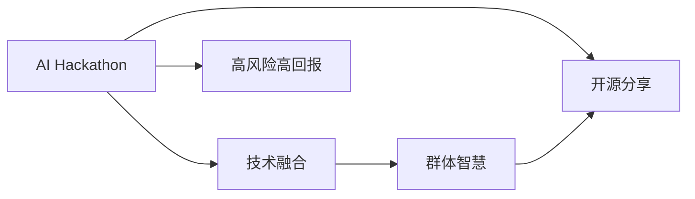

                 

# AI hackathon的影响与未来

## 1. 背景介绍

### 1.1 问题由来

AI Hackathon（AI黑客松）作为新兴的行业创新活动，自2018年起开始在全球科技圈引起广泛关注。这一活动通常由科技公司或创业孵化器组织，邀请顶尖技术专家、科研机构、高校学生、科技爱好者等参与，以解决实际问题为目标，在限定时间内通过协作创新，产出各种前沿AI应用方案。其成功案例包括AlphaGo、图像识别突破、医疗影像诊断、自然语言处理等，对推动人工智能领域的前沿研究与应用产生了重要影响。

### 1.2 问题核心关键点

AI Hackathon的核心在于促进跨学科创新。参与者需整合计算机视觉、自然语言处理、深度学习、强化学习等多种技术，面对现实挑战，提出解决方案。同时，Hackathon提供了一个高自由度的平台，让不同背景和领域的专业人才相互碰撞，催生出创新的算法、模型、应用及技术路径。

此外，Hackathon具有以下特点：
- 时间紧迫，任务明确：限定在几天至几周内解决问题。
- 跨领域协作，群体智慧：融合不同领域知识，发挥团队力量。
- 开源分享，开放交流：鼓励创新成果的共享与交流。
- 高风险高回报：对参与者技术挑战巨大，但带来的创新潜力也巨大。

### 1.3 问题研究意义

AI Hackathon对于加速AI技术的应用创新、促进科研交流、培养AI人才、提升市场活力具有重要意义：

1. **加速技术创新**：解决真实世界问题，快速迭代出前沿AI解决方案。
2. **促进科研交流**：打破学科界限，激发跨领域合作，加速技术融合。
3. **培养AI人才**：吸引和锻炼优秀AI人才，提高专业技能和团队协作能力。
4. **提升市场活力**：帮助企业快速获取AI前沿技术，加速商业落地。

## 2. 核心概念与联系

### 2.1 核心概念概述

为更好地理解AI Hackathon的影响和未来，本节将介绍几个关键概念：

- AI Hackathon：即AI黑客松，由科技公司或孵化器组织的技术创新活动，通过限定时间、跨领域协作解决实际问题。
- 技术融合：通过Hackathon促进不同技术（如计算机视觉、自然语言处理、深度学习、强化学习等）的整合与创新。
- 群体智慧：通过团队合作，发挥集体智慧，快速产出创新成果。
- 开源分享：鼓励创新成果的公开分享，加速技术传播与普及。
- 高风险高回报：Hackathon要求在限定时间内创新突破，带来巨大技术价值和应用潜力。

这些概念之间存在着紧密的联系，共同构成了AI Hackathon的基本框架：

1. **时间限制**：推动快速响应与创新。
2. **跨领域协作**：激发多元思维和技术融合。
3. **群体智慧**：优化资源配置和思路碰撞。
4. **开源分享**：促进知识传播和创新扩散。
5. **高风险高回报**：鼓励大胆尝试和创新突破。

### 2.2 概念间的关系

通过Mermaid流程图展示这些概念之间的关系：



这个流程图展示了AI Hackathon的基本运作流程：

1. **技术融合**：AI Hackathon的核心目标，通过整合不同技术，解决实际问题。
2. **群体智慧**：充分利用团队资源，发挥集体智慧，提高创新效率。
3. **开源分享**：鼓励创新成果的共享与交流，加速技术普及。
4. **高风险高回报**：参与者在限定时间内实现技术突破，带来巨大的社会和经济价值。

## 3. 核心算法原理 & 具体操作步骤
### 3.1 算法原理概述

AI Hackathon的本质是利用技术融合和群体智慧，在限定时间内实现技术突破。其核心算法原理基于问题驱动和团队协作，采用跨领域知识整合与创新。

具体而言，参与者需将现实问题转化为算法、模型或应用创新。以下步骤概述了从问题定义到解决方案实现的算法原理：

1. **问题定义**：明确具体问题及其所需解决的目标。
2. **数据准备**：收集、清洗、标注数据集，准备输入数据。
3. **模型选择**：根据问题特点选择合适的算法、模型或技术框架。
4. **协作创新**：不同领域专家协作，整合技术资源，进行算法设计和模型训练。
5. **成果展示**：通过原型展示、技术报告等形式，展示创新成果。
6. **开源分享**：将创新成果公开发布，促进技术传播和应用。

### 3.2 算法步骤详解

AI Hackathon的详细步骤包括：

**Step 1: 问题定义**
- 明确问题的范围和目标。
- 进行初步调研，收集背景资料。

**Step 2: 数据准备**
- 收集数据集并进行预处理，确保数据质量。
- 标注数据集，定义模型所需输入输出。

**Step 3: 团队组建**
- 根据问题特点，组建跨领域团队，包括数据科学家、算法工程师、设计师等。
- 分配角色，明确各成员职责。

**Step 4: 模型选择与设计**
- 确定最适合的算法、模型或技术框架。
- 设计算法流程和模型结构，制定开发计划。

**Step 5: 数据建模与训练**
- 进行特征工程，提取关键特征。
- 训练模型，进行参数调优，优化模型性能。

**Step 6: 原型实现与验证**
- 开发数据处理、模型训练与推理的代码。
- 在限定时间内实现产品原型，并进行测试验证。

**Step 7: 成果展示与开源分享**
- 准备技术报告、演示视频、用户手册等成果展示材料。
- 提交开源代码，供他人复制、改进和应用。

### 3.3 算法优缺点

AI Hackathon具备以下优点：
1. **快速响应与迭代**：时间限制催生出高效的创新过程。
2. **跨领域协作**：促进多元思维与技术融合，激发创新潜力。
3. **群体智慧**：充分利用团队资源，提升创新效率。
4. **开源分享**：加速技术普及和应用，提高社会经济效益。

但同时，也存在以下缺点：
1. **高风险高压力**：时间紧张、任务繁重，压力大。
2. **协作难度大**：不同领域背景的专家协调难度大，影响团队效率。
3. **质量难以保证**：时间紧迫可能影响成果质量，需后期迭代完善。
4. **资源依赖性强**：依赖高质量数据和强大计算资源。

### 3.4 算法应用领域

AI Hackathon广泛应用于以下领域：

- **医疗健康**：如医学影像诊断、病历分析、智能诊疗等。
- **智能制造**：如工业缺陷检测、质量控制、供应链优化等。
- **智能交通**：如自动驾驶、智能导航、交通流量分析等。
- **智能金融**：如信用评估、风险预警、量化交易等。
- **智能安防**：如视频监控、入侵检测、异常行为分析等。

此外，AI Hackathon在教育、农业、环保、智慧城市等多个领域也有广泛应用，推动技术创新和社会进步。

## 4. 数学模型和公式 & 详细讲解 & 举例说明

### 4.1 数学模型构建

为更精确地描述AI Hackathon的算法原理，本节构建数学模型并给出公式推导过程。

假设问题为 $P$，数据集为 $D$，算法框架为 $F$，模型为 $M$，时间限制为 $T$。目标是在时间 $T$ 内，找到最优的算法 $F$ 和模型 $M$，使得模型在 $D$ 上的表现最佳。

形式化定义如下：
$$
\min_{F, M} \mathcal{L}(M, D) \quad \text{subject to} \quad T
$$

其中 $\mathcal{L}$ 为模型在数据集 $D$ 上的损失函数。

### 4.2 公式推导过程

以图像识别为例，对公式进行推导：

**Step 1: 问题定义**
假设目标是从图像中识别出物体类别，数据集为 $D=\{(x_i, y_i)\}_{i=1}^N$，其中 $x_i$ 为图像数据，$y_i$ 为类别标签。

**Step 2: 数据准备**
收集大量标注好的图像数据，并进行预处理。

**Step 3: 模型选择与设计**
选择卷积神经网络 (CNN) 作为基本框架，并设计多层次的特征提取器。

**Step 4: 数据建模与训练**
使用 $M$ 进行特征提取和分类，最小化损失函数 $\mathcal{L}=\frac{1}{N}\sum_{i=1}^N\ell(y_i, M(x_i))$。

**Step 5: 原型实现与验证**
开发原型系统，进行测试验证，确保模型性能符合预期。

**Step 6: 成果展示与开源分享**
编写技术报告和代码，供他人学习与改进。

### 4.3 案例分析与讲解

以AlphaGo为例，分析其成功案例：

1. **问题定义**：通过计算机程序战胜人类围棋高手。
2. **数据准备**：收集人类围棋棋谱和游戏数据。
3. **模型选择**：深度神经网络结合蒙特卡罗树搜索。
4. **协作创新**：不同领域的专家如围棋手、工程师、心理学家等协作。
5. **数据建模与训练**：构建神经网络，通过大量游戏数据训练模型。
6. **原型实现与验证**：开发AlphaGo系统，并通过与人类高手对弈验证效果。
7. **成果展示与开源分享**：公开发布AlphaGo的代码和研究成果。

AlphaGo的成功在于其高效的算法融合与群体智慧，通过不同领域专家的合作，实现技术突破。

## 5. 项目实践：代码实例和详细解释说明

### 5.1 开发环境搭建

参与AI Hackathon时，首先需要搭建开发环境。以下是一个典型的开发环境配置步骤：

1. **安装编程环境**：如Python 3.8、Anaconda等，确保开发工具的稳定性。
2. **安装深度学习框架**：如TensorFlow、PyTorch等，提供高效的计算能力。
3. **安装数据处理工具**：如Pandas、NumPy等，简化数据预处理流程。
4. **安装开源项目**：如TensorFlow、PyTorch、scikit-learn等，提供丰富的算法和模型库。
5. **环境部署**：确保所有工具在团队内可用，便于协作开发。

### 5.2 源代码详细实现

以图像分类为例，演示Hackathon中常用的数据处理和模型训练步骤：

**Step 1: 数据准备**

```python
import pandas as pd
from PIL import Image
import numpy as np

# 加载数据集
data = pd.read_csv('data.csv')
data.head()
```

**Step 2: 数据预处理**

```python
def load_image(image_path):
    image = Image.open(image_path)
    image = image.resize((224, 224))
    image = np.array(image)
    image = image / 255.0
    image = np.expand_dims(image, axis=0)
    return image

# 加载数据集并预处理
X = []
y = []
for i in range(len(data)):
    image_path = data.iloc[i]['image_path']
    label = data.iloc[i]['label']
    X.append(load_image(image_path))
    y.append(label)
X = np.vstack(X)
y = np.array(y)
X = X / 255.0
```

**Step 3: 模型选择与设计**

```python
from keras.applications.resnet50 import ResNet50
from keras.layers import Dense, Flatten, Dropout

# 定义模型结构
model = ResNet50(weights='imagenet', include_top=False)
x = Flatten()(model.output)
x = Dropout(0.5)(x)
x = Dense(1024, activation='relu')(x)
output = Dense(10, activation='softmax')(x)
model = Model(inputs=model.input, outputs=output)
```

**Step 4: 数据建模与训练**

```python
from keras.preprocessing.image import ImageDataGenerator
from keras.callbacks import EarlyStopping

# 数据增强
datagen = ImageDataGenerator(rescale=1./255, shear_range=0.2, zoom_range=0.2, horizontal_flip=True)
datagen.fit(X)

# 编译模型
model.compile(optimizer='adam', loss='categorical_crossentropy', metrics=['accuracy'])

# 定义early stopping回调
early_stopping = EarlyStopping(monitor='val_loss', patience=10)

# 训练模型
model.fit_generator(datagen.flow(X, y, batch_size=32), epochs=100, validation_data=(X, y), callbacks=[early_stopping])
```

**Step 5: 原型实现与验证**

```python
from keras.models import Model
from keras.layers import Dense, Flatten, Dropout
from keras.preprocessing.image import ImageDataGenerator
from keras.callbacks import EarlyStopping
from keras.applications.resnet50 import ResNet50

# 定义模型结构
model = ResNet50(weights='imagenet', include_top=False)
x = Flatten()(model.output)
x = Dropout(0.5)(x)
x = Dense(1024, activation='relu')(x)
output = Dense(10, activation='softmax')(x)
model = Model(inputs=model.input, outputs=output)

# 数据增强
datagen = ImageDataGenerator(rescale=1./255, shear_range=0.2, zoom_range=0.2, horizontal_flip=True)
datagen.fit(X)

# 编译模型
model.compile(optimizer='adam', loss='categorical_crossentropy', metrics=['accuracy'])

# 定义early stopping回调
early_stopping = EarlyStopping(monitor='val_loss', patience=10)

# 训练模型
model.fit_generator(datagen.flow(X, y, batch_size=32), epochs=100, validation_data=(X, y), callbacks=[early_stopping])
```

**Step 6: 成果展示与开源分享**

将训练好的模型保存为H5文件，并公开分享：

```python
model.save('my_model.h5')
```

### 5.3 代码解读与分析

**数据准备模块**：

- 使用Pandas读取CSV文件，提取图片路径和类别标签。
- 使用PIL库加载和预处理图片，并将其转换为numpy数组。
- 标准化像素值，并进行通道扩展，确保输入格式符合模型要求。

**模型选择与设计模块**：

- 使用Keras的ResNet50模型作为基础框架，去除顶层的分类层。
- 添加Flatten、Dropout和Dense层，进行特征提取和分类。
- 定义自定义模型，并编译配置优化器、损失函数和评估指标。

**数据建模与训练模块**：

- 使用ImageDataGenerator进行数据增强，增强模型泛化能力。
- 编译模型并设置EarlyStopping回调，避免过拟合。
- 使用fit_generator进行模型训练，批量处理数据并动态生成数据。

**原型实现与验证模块**：

- 保存训练好的模型，便于后续部署和验证。
- 在限制时间内完成原型开发，并进行测试验证，确保模型性能。

## 6. 实际应用场景

### 6.1 智能医疗

AI Hackathon在智能医疗领域有着广泛的应用，如医学影像诊断、病历分析、智能诊疗等。

**案例分析**：
- **医学影像诊断**：利用Hackathon技术，开发医学影像自动诊断系统，自动识别X光、CT、MRI等影像，提高诊断效率和准确性。
- **病历分析**：通过分析电子病历数据，辅助医生进行疾病预测和个性化诊疗。
- **智能诊疗**：结合语音识别和自然语言处理技术，实现智能问诊和辅助诊断，提升医疗服务质量。

**应用前景**：
- 在医疗资源有限的情况下，提高诊断效率和准确性，减轻医生负担。
- 通过个性化诊疗，提高治疗效果和患者满意度。
- 实时监测和预警疾病趋势，增强公共卫生管理能力。

### 6.2 智能制造

在智能制造领域，AI Hackathon可以应用于工业缺陷检测、质量控制、供应链优化等。

**案例分析**：
- **工业缺陷检测**：利用图像识别技术，自动检测生产线上的产品缺陷，提高生产效率和产品质量。
- **质量控制**：通过数据分析和机器学习，实时监控生产流程，预测和预防质量问题。
- **供应链优化**：利用数据挖掘和优化算法，优化供应链管理，提高物流效率和库存管理。

**应用前景**：
- 降低生产成本，提高产品质量，增强企业竞争力。
- 提高生产效率，缩短生产周期，满足市场需求。
- 优化供应链管理，降低物流成本，提升客户满意度。

### 6.3 智能交通

智能交通领域应用包括自动驾驶、智能导航、交通流量分析等。

**案例分析**：
- **自动驾驶**：结合计算机视觉和深度学习技术，开发自动驾驶系统，实现无人驾驶。
- **智能导航**：通过分析交通数据，提供实时路况信息和智能导航建议。
- **交通流量分析**：利用图像识别技术，实时监测交通流量，优化交通管理。

**应用前景**：
- 提高交通安全，减少交通事故，保障公众安全。
- 优化交通流量，减少交通拥堵，提高出行效率。
- 实时监测和预警交通异常，提高交通管理水平。

### 6.4 智能金融

在智能金融领域，AI Hackathon可以应用于信用评估、风险预警、量化交易等。

**案例分析**：
- **信用评估**：利用机器学习技术，预测借款人的信用风险，优化信贷管理。
- **风险预警**：通过数据分析，实时监控市场风险，提前预警金融危机。
- **量化交易**：结合市场数据分析和交易算法，优化交易策略，提高投资回报率。

**应用前景**：
- 提高金融机构的信用评估效率和准确性，降低坏账率。
- 实时监控市场风险，提高金融系统的稳定性。
- 优化投资策略，提高投资回报率，增强金融机构竞争力。

## 7. 工具和资源推荐

### 7.1 学习资源推荐

为了帮助开发者系统掌握AI Hackathon的理论基础和实践技巧，这里推荐一些优质的学习资源：

1. **《机器学习实战》**：由Peter Harrington撰写，提供丰富的机器学习实践案例，帮助读者理解Hackathon的算法原理。
2. **Coursera《深度学习专项课程》**：由深度学习领域的顶尖专家Andrew Ng主讲的在线课程，涵盖深度学习的基本概念和技术细节。
3. **Kaggle平台**：提供大量的数据集和竞赛题目，帮助开发者实践机器学习算法，提升实战能力。
4. **GitHub开源项目**：包含众多开源AI项目，提供丰富的代码和文档资源，供开发者学习和复用。
5. **ArXiv论文预印本**：人工智能领域最新研究成果的发布平台，提供前沿的学术论文和技术报告。

通过对这些资源的学习实践，相信你一定能够快速掌握AI Hackathon的技术精髓，并用于解决实际的AI问题。

### 7.2 开发工具推荐

高效的开发离不开优秀的工具支持。以下是几款用于AI Hackathon开发的常用工具：

1. **PyTorch**：基于Python的开源深度学习框架，灵活高效，支持各种深度学习算法和模型。
2. **TensorFlow**：由Google主导开发的开源深度学习框架，生产部署方便，适用于大规模工程应用。
3. **Keras**：高层神经网络API，提供简洁高效的接口，便于快速构建和调试模型。
4. **Jupyter Notebook**：交互式编程环境，支持代码、数据和文档的可视化，便于协作开发。
5. **Github**：代码管理和版本控制平台，提供协作开发和版本跟踪功能。

合理利用这些工具，可以显著提升AI Hackathon的开发效率，加快创新迭代的步伐。

### 7.3 相关论文推荐

AI Hackathon的技术不断发展，以下是几篇奠基性的相关论文，推荐阅读：

1. **《AlphaGo Zero: Mastering the Game of Go without Human Knowledge》**：DeepMind公司开发的AlphaGo Zero，通过自我对弈训练，不依赖人类数据，达到围棋顶尖水平。
2. **《ImageNet Classification with Deep Convolutional Neural Networks》**：AlexNet论文，提出深度卷积神经网络，开创计算机视觉领域的先河。
3. **《Playing Atari with Deep Reinforcement Learning》**：OpenAI开发的DQN算法，通过深度强化学习，实现自监督学习，在多种游戏中取得突破。
4. **《Mastering the Game of Go without Human Knowledge》**：AlphaGo论文，提出深度卷积神经网络和蒙特卡罗树搜索，在围棋领域取得巨大成功。
5. **《End-to-End Learning for Scene Understanding》**：Google开发的End-to-End场景理解系统，通过深度神经网络，实现场景检测和理解。

这些论文代表了大规模AI Hackathon的最新进展，通过学习这些前沿成果，可以帮助研究者把握学科前进方向，激发更多的创新灵感。

除上述资源外，还有一些值得关注的前沿资源，帮助开发者紧跟AI Hackathon技术的最新进展，例如：

1. **arXiv论文预印本**：人工智能领域最新研究成果的发布平台，包括大量尚未发表的前沿工作，学习前沿技术的必读资源。
2. **AI领域顶级会议直播**：如NIPS、ICML、ACL、ICLR等人工智能领域顶会现场或在线直播，能够聆听到大佬们的前沿分享，开拓视野。
3. **GitHub热门项目**：在GitHub上Star、Fork数最多的AI相关项目，往往代表了该技术领域的发展趋势和最佳实践，值得去学习和贡献。
4. **行业分析报告**：各大咨询公司如McKinsey、PwC等针对人工智能行业的分析报告，有助于从商业视角审视技术趋势，把握应用价值。

总之，对于AI Hackathon的技术学习与实践，需要开发者保持开放的心态和持续学习的意愿。多关注前沿资讯，多动手实践，多思考总结，必将收获满满的成长收益。

## 8. 总结：未来发展趋势与挑战

### 8.1 总结

本文对AI Hackathon的影响与未来进行了全面系统的介绍。首先阐述了AI Hackathon的基本原理和核心算法，详细讲解了基于时间限制和跨领域协作的创新过程。其次，通过案例分析，展示了AI Hackathon在多个领域的广泛应用。最后，推荐了相关的学习资源、开发工具和学术论文，帮助开发者系统掌握AI Hackathon的技术精髓。

通过本文的系统梳理，可以看到，AI Hackathon作为一种新兴的创新模式，已经在多个领域产生了显著影响，推动了人工智能技术的应用和普及。未来，随着技术的不断进步和应用的深入，AI Hackathon必将在更广阔的领域发挥重要作用，推动人工智能技术的进一步发展。

### 8.2 未来发展趋势

展望未来，AI Hackathon将在以下几个方向继续发展：

1. **技术融合趋势加强**：跨领域技术融合成为主流，不同技术（如计算机视觉、自然语言处理、深度学习、强化学习等）的整合与创新将更加广泛。
2. **群体智慧进一步挖掘**：充分利用团队资源，提升创新效率，促进知识共享和技术传播。
3. **开源分享成为常态**：鼓励创新成果的公开分享，加速技术普及和应用。
4. **高风险高回报机制完善**：优化Hackathon的组织和激励机制，鼓励大胆尝试和创新突破。
5. **应用领域不断拓展**：在医疗、智能制造、智能交通、智能金融等多个领域继续扩展，推动技术创新和社会进步。

### 8.3 面临的挑战

尽管AI Hackathon取得了显著成效，但在发展过程中仍面临诸多挑战：

1. **数据依赖性强**：高质量数据的获取和标注成本高，成为制约技术创新的瓶颈。
2. **技术复杂度高**：不同领域专家协作难度大，影响团队效率。
3. **成果质量不稳定**：时间紧迫可能导致成果质量不稳定，需后期迭代完善。
4. **资源消耗大**：大规模计算资源的需求，带来经济成本和能耗问题。
5. **道德和伦理问题**：AI应用中可能存在偏见和歧视，需要考虑道德和伦理问题。

### 8.4 研究展望

面对这些挑战，未来的研究需要在以下几个方面寻求新的突破：

1. **无监督和半监督学习**：摆脱对大规模标注数据的依赖，利用自监督学习、主动学习等无监督和半监督范式，最大限度利用非结构化数据，实现更加灵活高效的创新。
2. **参数高效和计算高效**：开发更加参数高效的微调方法，在固定大部分预训练参数的情况下，只更新极少量的任务相关参数。同时优化微调模型的计算图，减少前向传播和反向传播的资源消耗，实现更加轻量级、实时性的部署。
3. **因果分析和博弈论**：引入因果分析和博弈论思想，增强创新模型的稳定性和鲁棒性。
4. **跨模态融合**：将符号化的先验知识，如知识图谱、逻辑规则等，与神经网络模型进行巧妙融合，增强模型的整合能力。
5. **伦理和道德约束**：在模型训练目标中引入伦理导向的评估指标，过滤和惩罚有偏见、有害的输出倾向，确保AI应用的公平性和安全性。

这些研究方向的探索，必将引领AI Hackathon技术迈向更高的台阶，为构建安全、可靠、可解释、可控的智能系统铺平道路。面向未来，AI Hackathon技术还需要与其他人工智能技术进行更深入的融合，如知识表示、因果推理、强化学习等，多路径协同

