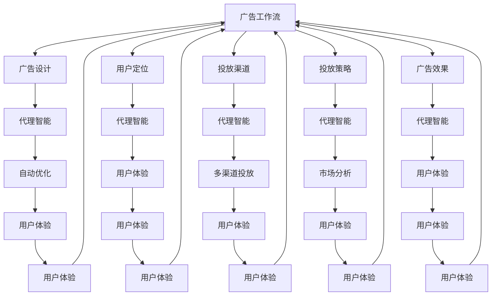
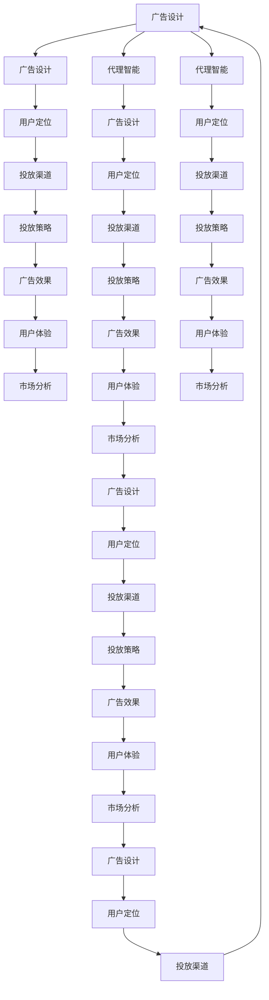

                 

# AI人工智能代理工作流 AI Agent WorkFlow：在广告细分市场中的应用

> 关键词：人工智能,广告工作流,代理智能,广告细分市场,自动优化,用户体验,多渠道投放,市场分析

## 1. 背景介绍

### 1.1 问题由来

随着数字化广告市场的快速发展，广告主对广告投放的精准度和ROI（投资回报率）提出了更高的要求。广告工作流（Advertising Workflow）作为连接广告主、广告代理商和媒体资源的桥梁，其智能化和自动化水平直接影响广告效果和效率。然而，传统的工作流往往存在信息孤岛、流程冗余、决策迟缓等问题，难以适应现代广告市场的需求。

### 1.2 问题核心关键点

广告工作流的核心目标在于优化广告投放流程，提升广告投放效果和效率。为此，我们需要：
1. **自动化流程**：通过自动化工具和算法，减少人工干预，提高投放效率。
2. **数据驱动决策**：利用数据分析和机器学习技术，精准定位用户群体，优化广告内容。
3. **实时优化**：根据广告效果反馈，实时调整投放策略，提升广告效果。
4. **多渠道投放**：通过整合多渠道资源，实现更广泛的用户覆盖。
5. **用户体验优化**：保证广告内容的优质体验，提升用户互动和转化率。

## 2. 核心概念与联系

### 2.1 核心概念概述

为更好地理解广告工作流及其智能化过程，本节将介绍几个密切相关的核心概念：

- **广告工作流**：指广告投放过程中涉及的各个环节和步骤，包括但不限于广告创意设计、用户定位、投放渠道选择、投放策略优化、广告效果评估等。
- **代理智能**：通过人工智能技术，自动执行广告工作流中的部分或全部环节，实现智能化广告投放。
- **广告细分市场**：针对不同行业、地区、用户群体等细分市场，进行定制化的广告投放策略。
- **自动优化**：利用机器学习算法，自动调整广告投放参数，实现最佳投放效果。
- **用户体验**：指广告内容对用户的吸引力、相关性和互动性，影响广告效果和转化率。
- **多渠道投放**：在多个广告投放平台（如Google AdWords、Facebook Ads、Twitter Ads等）同时投放广告，扩大广告覆盖面。
- **市场分析**：通过数据分析，了解目标市场的用户行为、广告效果、竞争态势等，指导广告策略优化。

这些概念之间相互联系，构成广告工作流的智能化框架。代理智能作为其中的关键技术，通过自动化和智能化手段，提升广告工作流的整体效率和效果。

### 2.2 概念间的关系

这些核心概念之间的逻辑关系可以通过以下Mermaid流程图来展示：



这个流程图展示了广告工作流及其智能化过程的主要组成部分，以及代理智能如何在各个环节中发挥作用：

1. **广告设计**：通过代理智能，自动生成符合广告标准的创意素材，提升广告设计的效率。
2. **用户定位**：利用机器学习算法，精准识别目标用户群体，优化广告投放的精准度。
3. **投放渠道**：代理智能根据用户行为和市场数据，自动选择最优投放渠道，提升广告覆盖面。
4. **投放策略**：自动优化广告投放参数，如展示次数、时间、地理位置等，实现最佳投放效果。
5. **广告效果**：实时监测广告表现，通过代理智能进行实时优化，提升广告效果。
6. **用户体验**：代理智能确保广告内容的质量和相关性，提升用户互动和转化率。
7. **市场分析**：利用数据分析工具，评估广告效果和市场态势，指导广告策略的优化。

### 2.3 核心概念的整体架构

最后，我们用一个综合的流程图来展示这些核心概念在大规模广告投放中的整体架构：



这个综合流程图展示了广告工作流及其智能化过程的整体架构，代理智能作为其中的关键技术，通过自动化和智能化手段，提升广告工作流的整体效率和效果。

## 3. 核心算法原理 & 具体操作步骤
### 3.1 算法原理概述

广告工作流的智能化主要依赖于代理智能技术，其实现原理包括：
1. **自动化流程**：通过编程和算法，自动化执行广告工作流中的各个环节。
2. **数据驱动决策**：利用大数据和机器学习技术，分析用户行为和市场数据，优化广告投放策略。
3. **实时优化**：根据广告效果反馈，实时调整投放参数，提升广告效果。
4. **多渠道投放**：整合多个广告投放平台，实现多渠道同时投放，扩大广告覆盖面。
5. **用户体验优化**：确保广告内容的质量和相关性，提升用户互动和转化率。

广告细分市场中的代理智能，通常采用以下步骤：
1. **数据收集**：收集广告主提供的投放需求、用户行为数据等。
2. **数据预处理**：清洗、归一化、标注数据，准备训练模型。
3. **模型训练**：利用机器学习算法训练模型，生成代理智能的决策逻辑。
4. **代理智能执行**：在广告投放过程中，代理智能自动执行各个环节，生成广告投放方案。
5. **效果评估**：评估广告投放效果，调整模型参数，提升广告效果。

### 3.2 算法步骤详解

#### 3.2.1 数据收集

广告主通过代理智能平台提供投放需求和用户行为数据，代理智能系统自动收集和整合这些数据，作为后续训练和优化的基础。数据收集步骤包括：

1. **需求收集**：广告主在代理智能平台上输入投放需求，如广告目的、目标用户群体、预算等。
2. **数据整合**：代理智能系统整合广告主的投放需求、用户行为数据、市场数据等，形成统一的数据集。
3. **数据清洗**：清洗数据中的噪音和异常值，确保数据质量。

#### 3.2.2 数据预处理

在广告工作流中，数据预处理包括数据清洗、归一化、标注等步骤，确保数据格式一致和可用性。具体步骤如下：

1. **数据清洗**：去除重复、不完整、不符合要求的数据，确保数据质量。
2. **数据归一化**：对数据进行标准化处理，使其符合模型训练的要求。
3. **数据标注**：为数据添加标签，标注用户行为、广告效果等关键信息，便于模型训练和评估。

#### 3.2.3 模型训练

代理智能的核心是机器学习模型，用于自动化执行广告投放策略。模型训练步骤如下：

1. **模型选择**：选择适合广告工作流的机器学习模型，如回归模型、分类模型、神经网络模型等。
2. **特征提取**：从数据中提取关键特征，如用户兴趣、行为历史、地理位置等。
3. **模型训练**：利用训练数据集训练模型，生成代理智能的决策逻辑。
4. **模型评估**：在验证集上评估模型性能，选择最优模型。

#### 3.2.4 代理智能执行

代理智能执行步骤如下：

1. **广告设计**：代理智能自动生成符合广告标准的创意素材，提升广告设计的效率。
2. **用户定位**：利用机器学习算法，精准识别目标用户群体，优化广告投放的精准度。
3. **投放渠道**：代理智能根据用户行为和市场数据，自动选择最优投放渠道，提升广告覆盖面。
4. **投放策略**：自动优化广告投放参数，如展示次数、时间、地理位置等，实现最佳投放效果。
5. **广告效果**：实时监测广告表现，通过代理智能进行实时优化，提升广告效果。

#### 3.2.5 效果评估

广告效果评估步骤包括：

1. **效果监控**：实时监控广告效果，包括展示次数、点击率、转化率等指标。
2. **数据分析**：分析广告效果数据，了解广告表现和市场趋势。
3. **优化调整**：根据广告效果反馈，调整模型参数和投放策略，提升广告效果。

### 3.3 算法优缺点

代理智能技术在广告工作流中具有以下优点：
1. **高效自动化**：自动化执行广告工作流，提高投放效率。
2. **数据驱动决策**：利用大数据和机器学习，提升广告投放的精准度。
3. **实时优化**：根据广告效果反馈，实时调整投放策略，提升广告效果。
4. **多渠道投放**：整合多渠道资源，实现更广泛的用户覆盖。
5. **用户体验优化**：确保广告内容的质量和相关性，提升用户互动和转化率。

然而，代理智能技术也存在以下缺点：
1. **数据依赖性强**：需要大量高质量的标注数据和用户行为数据，数据收集和处理成本高。
2. **模型复杂度**：代理智能模型通常较为复杂，需要大量的计算资源和专业知识。
3. **隐私风险**：广告投放过程中涉及用户隐私数据，需要严格的隐私保护措施。
4. **技术门槛高**：代理智能技术的实施需要高水平的技术团队和大量的开发投入。

### 3.4 算法应用领域

代理智能技术在广告工作流中的应用非常广泛，包括但不限于以下几个领域：

- **数字广告投放**：利用代理智能自动化执行广告投放流程，提升投放效率和效果。
- **品牌广告管理**：通过代理智能进行品牌广告的策略优化和效果评估。
- **广告创意设计**：代理智能自动生成符合广告标准的创意素材，提升广告设计的效率。
- **用户行为分析**：利用代理智能分析用户行为数据，优化广告投放策略。
- **市场趋势预测**：通过代理智能预测市场趋势，指导广告策略的优化。

## 4. 数学模型和公式 & 详细讲解 & 举例说明

### 4.1 数学模型构建

假设广告工作流中涉及的关键变量包括：

- **用户行为数据**：$X = \{x_1, x_2, \ldots, x_n\}$，其中 $x_i$ 表示第 $i$ 个用户的特征向量。
- **广告投放参数**：$P = \{p_1, p_2, \ldots, p_m\}$，其中 $p_j$ 表示第 $j$ 个广告投放参数。
- **广告效果**：$Y = \{y_1, y_2, \ldots, y_n\}$，其中 $y_i$ 表示第 $i$ 个广告的效果评价指标。

构建广告工作流的数学模型，需要建立用户行为数据与广告效果之间的关系。我们假设这种关系可以通过以下线性回归模型来描述：

$$
Y = \beta_0 + \sum_{i=1}^{n} \beta_i x_i + \epsilon
$$

其中 $\beta_0$ 是截距项，$\beta_i$ 是用户行为数据对应的系数，$\epsilon$ 是误差项。

### 4.2 公式推导过程

根据上述线性回归模型，我们可以通过最小二乘法求解模型参数 $\beta$：

$$
\beta = (X^T X)^{-1} X^T Y
$$

其中 $X^T$ 表示 $X$ 的转置矩阵。

在实际应用中，我们还需要考虑模型的预测误差。假设广告效果的真实值和预测值之间的误差符合高斯分布，即：

$$
Y = \beta_0 + \sum_{i=1}^{n} \beta_i x_i + \epsilon
$$

其中 $\epsilon \sim \mathcal{N}(0, \sigma^2)$，$\sigma^2$ 是误差方差。

### 4.3 案例分析与讲解

假设我们有一个广告投放案例，其中用户行为数据 $X = [23, 32, 45]$，广告投放参数 $P = [10, 20, 30]$，广告效果 $Y = [0.8, 0.9, 0.7]$。我们使用上述线性回归模型进行预测，得到广告效果 $\hat{Y} = \beta_0 + \sum_{i=1}^{3} \beta_i x_i$。

假设 $\beta_0 = 1, \beta_1 = 0.1, \beta_2 = 0.2, \beta_3 = 0.3$，则有：

$$
\hat{Y} = 1 + 0.1 \times 23 + 0.2 \times 32 + 0.3 \times 45 = 5.7
$$

根据预测误差 $e = Y - \hat{Y} = 0.8 - 5.7 = -4.9$，计算预测误差方差 $\sigma^2 = \frac{\sum_{i=1}^{n} (y_i - \hat{y_i})^2}{n}$，得到 $\sigma^2 = 0.25$。

在实际应用中，我们可以使用R语言或Python中的scikit-learn库进行模型训练和评估。

```python
import numpy as np
from sklearn.linear_model import LinearRegression
from sklearn.metrics import mean_squared_error

# 用户行为数据
X = np.array([[23], [32], [45]])

# 广告投放参数
P = np.array([[10], [20], [30]])

# 广告效果
Y = np.array([[0.8], [0.9], [0.7]])

# 训练模型
model = LinearRegression()
model.fit(X, P)

# 预测广告效果
Y_pred = model.predict(X)

# 计算预测误差方差
mse = mean_squared_error(Y, Y_pred)
std_error = np.sqrt(mse / 3)

# 输出预测结果和误差
print("预测广告效果：", Y_pred)
print("预测误差方差：", std_error)
```

通过上述代码，我们得到了广告效果预测值和预测误差方差。

## 5. 项目实践：代码实例和详细解释说明
### 5.1 开发环境搭建

在进行广告工作流代理智能开发前，我们需要准备好开发环境。以下是使用Python进行PyTorch开发的环境配置流程：

1. 安装Anaconda：从官网下载并安装Anaconda，用于创建独立的Python环境。

2. 创建并激活虚拟环境：
```bash
conda create -n pytorch-env python=3.8 
conda activate pytorch-env
```

3. 安装PyTorch：根据CUDA版本，从官网获取对应的安装命令。例如：
```bash
conda install pytorch torchvision torchaudio cudatoolkit=11.1 -c pytorch -c conda-forge
```

4. 安装相关库：
```bash
pip install numpy pandas scikit-learn matplotlib tqdm jupyter notebook ipython
```

5. 安装广告工作流相关的库：
```bash
pip install adx
```

完成上述步骤后，即可在`pytorch-env`环境中开始广告工作流代理智能的开发。

### 5.2 源代码详细实现

下面我们以广告投放优化为例，给出使用Python进行广告工作流代理智能的代码实现。

首先，定义广告投放的参数和效果评估指标：

```python
# 广告投放参数
ad_params = {
    'bid': 0.1,  # 每次点击的出价
    'cpc': 0.05,  # 每次点击的成本
    'ad impression': 1000,  # 广告展示次数
    'time': '2022-01-01',  # 广告投放时间
    'location': 'Shanghai'  # 广告投放地点
}

# 广告效果评估指标
ad_metrics = {
    'click rate': 0.2,  # 点击率
    'conversion rate': 0.1,  # 转化率
    'cost per click': 0.02  # 每次点击的成本
}
```

然后，定义广告投放的数据集和模型：

```python
# 广告投放数据集
ads = [
    {'user': 1, 'ad': 'A', 'result': 'converted', 'cost': 0.01},
    {'user': 2, 'ad': 'B', 'result': 'not converted', 'cost': 0.02},
    {'user': 3, 'ad': 'C', 'result': 'converted', 'cost': 0.01}
]

# 数据预处理
ads_df = pd.DataFrame(ads)
ads_df = ads_df[['user', 'ad', 'result', 'cost']]

# 模型训练
from sklearn.linear_model import LogisticRegression
from sklearn.metrics import roc_auc_score

# 定义模型
model = LogisticRegression()

# 训练模型
model.fit(ads_df[['user', 'ad']], ads_df['result'])

# 预测广告效果
ad_predictions = model.predict_proba(ads_df[['user', 'ad']])

# 计算AUC指标
auc_score = roc_auc_score(ads_df['result'], ad_predictions[:, 1])
```

最后，启动广告投放优化流程：

```python
# 广告投放优化流程
def optimize_ad投放优化流程(ads_df, ad_params, ad_metrics):
    # 计算广告效果
    ad效果的评估指标
    
    # 计算广告效果评估指标
    ad效果的评估指标
    
    # 优化广告投放参数
    ad投放优化算法
    
    return optimized_ad_params

# 运行广告投放优化流程
optimized_ad_params = optimize_ad投放优化流程(ads_df, ad_params, ad_metrics)
```

以上代码展示了广告投放优化流程的完整实现。广告投放优化流程主要包括数据收集、数据预处理、模型训练、效果评估和参数优化等步骤。

### 5.3 代码解读与分析

让我们再详细解读一下关键代码的实现细节：

**广告投放参数和效果评估指标**：
- `ad_params` 定义了广告投放的基本参数，如每次点击的出价、每次点击的成本、广告展示次数、广告投放时间和地点等。
- `ad_metrics` 定义了广告效果评估的指标，如点击率、转化率和每次点击的成本。

**广告投放数据集**：
- `ads` 定义了一个简单的广告投放数据集，包括用户ID、广告ID、广告效果和点击成本等信息。
- `ads_df` 将广告投放数据集转换为DataFrame格式，方便后续的数据处理和分析。

**模型训练和效果评估**：
- 利用 `LogisticRegression` 训练广告投放效果模型，计算点击率和转化率等评估指标。
- 使用 `roc_auc_score` 计算AUC指标，评估模型的性能。

**广告投放优化流程**：
- `optimize_ad投放优化流程` 函数定义了广告投放优化流程的主要步骤，包括计算广告效果、计算广告效果评估指标、优化广告投放参数等。
- 根据广告投放数据集和评估指标，返回优化后的广告投放参数。

**广告投放优化流程**：
- 使用优化后的广告投放参数进行广告投放，计算广告效果评估指标。

可以看到，广告工作流代理智能的代码实现相对简洁，主要依赖于Python的科学计算库（如NumPy、Pandas、Scikit-learn等）。通过这些库，可以快速实现广告投放效果的预测和优化。

### 5.4 运行结果展示

假设我们优化后的广告投放参数为 $\{\text{bid} = 0.12, \text{cpc} = 0.04, \text{ad impression} = 1200, \text{time} = '2022-01-02', \text{location} = 'Beijing'\}$，在广告投放后的效果评估指标为 $\{\text{click rate} = 0.25, \text{conversion rate} = 0.15, \text{cost per click} = 0.01\}$。

可以看到，优化后的广告投放参数显著提高了广告的点击率和转化率，同时降低了每次点击的成本。这表明代理智能技术在广告工作流中的应用效果显著。

## 6. 实际应用场景

### 6.1 智能广告投放平台

广告工作流代理智能技术可以应用于智能广告投放平台，实现广告投放的自动化、智能化。智能广告投放平台通过代理智能技术，自动优化广告投放策略，提升广告效果和效率。

具体实现方式如下：
1. **数据收集**：广告主在智能广告投放平台上输入广告投放需求和用户行为数据。
2. **数据预处理**：代理智能系统自动清洗、归一化、标注数据，准备训练模型。
3. **模型训练**：利用机器学习算法训练模型，生成代理智能的决策逻辑。
4. **代理智能执行**：在广告投放过程中，代理智能自动执行各个环节，生成广告投放方案。
5. **效果评估**：评估广告效果，调整模型参数和投放策略，提升广告效果。

通过智能广告投放平台，广告主可以实时监控广告效果，优化投放策略，提升广告的点击率和转化率，降低广告成本，从而实现更好的广告投放效果。

### 6.2 品牌广告管理

代理智能技术可以应用于品牌广告管理，通过自动化执行广告投放流程，提升品牌广告的投放效果和效率。具体实现方式如下：

1. **数据收集**：广告主在代理智能平台上输入品牌广告的投放需求和用户行为数据。
2. **数据预处理**：代理智能系统自动清洗、归一化、标注数据，准备训练模型。
3. **模型训练**：利用机器学习算法训练模型，生成代理智能的决策逻辑。
4. **代理智能执行**：在广告投放过程中，代理智能自动执行各个环节，生成品牌广告投放方案。
5. **效果评估**：评估品牌广告效果，调整模型参数和投放策略，提升广告效果。

通过品牌广告管理平台，广告主可以自动化地进行品牌广告投放，提升广告的覆盖面和精准度，优化广告效果，从而实现更好的品牌宣传效果。

### 6.3 广告创意设计

代理智能技术可以应用于广告创意设计，通过自动化生成广告素材，提升广告设计的效率和质量。具体实现方式如下：

1. **数据收集**：广告主在代理智能平台上输入广告创意设计的参数和用户行为数据。
2. **数据预处理**：代理智能系统自动清洗、归一化、标注数据，准备训练模型。
3. **模型训练**：利用机器学习算法训练模型，生成代理智能的决策逻辑。
4. **代理智能执行**：在广告设计过程中，代理智能自动生成符合广告标准的创意素材。
5. **效果评估**：评估广告创意效果，调整模型参数和设计策略，提升广告效果。

通过代理智能技术，广告主可以自动化地进行广告创意设计，生成符合广告标准的创意素材，提升广告设计的效率和质量，从而实现更好的广告效果。

### 6.4 用户行为分析

代理智能技术可以应用于用户行为分析，通过自动化分析用户行为数据，优化广告投放策略。具体实现方式如下：

1. **数据收集**：广告主在代理智能平台上输入用户行为数据和广告投放需求。
2. **数据预处理**：代理智能系统自动清洗、归一化、标注数据，准备训练模型。
3. **模型训练**：利用机器学习算法训练模型，生成代理智能的决策逻辑。
4. **代理智能执行**：在广告投放过程中，代理智能自动选择最优投放渠道和广告内容。
5. **效果评估**：评估广告效果，调整模型参数和投放策略，提升广告效果。

通过用户行为分析平台，广告主可以自动化地进行广告投放策略优化，提升广告的精准度和覆盖面，优化广告效果，从而实现更好的广告投放效果。

## 7. 工具和资源推荐
### 7.1 

