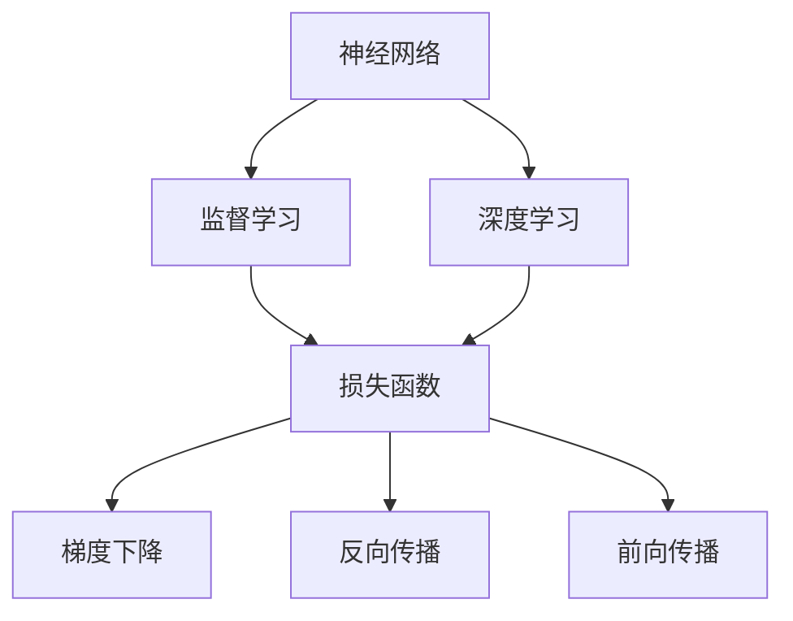
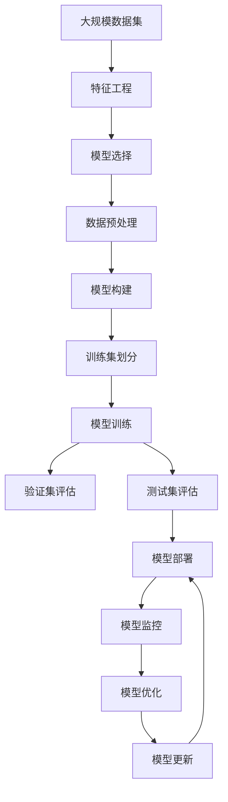

                 

# AI人工智能核心算法原理与代码实例讲解：模型构建

> 关键词：AI算法、模型构建、机器学习、深度学习、神经网络、损失函数、梯度下降、反向传播、前向传播、模型优化、超参数调优、模型评估、模型训练、模型部署

## 1. 背景介绍

### 1.1 问题由来
人工智能（AI）技术在过去几十年的发展中，已经从早期的专家系统、知识工程转向更加智能化的机器学习（ML）和深度学习（DL）。这一转变使得AI技术在图像识别、自然语言处理（NLP）、语音识别、推荐系统等诸多领域取得了突破性进展。其中，模型构建是AI技术开发的核心步骤，它决定了模型如何学习并适应数据，从而实现特定的任务目标。

### 1.2 问题核心关键点
模型构建在AI中扮演着至关重要的角色。通过构建合适的模型，可以在给定数据集上训练出一个能够有效执行特定任务的模型。常用的模型构建方法包括监督学习、无监督学习和强化学习等。每种构建方法都有其特定的应用场景和技术细节。本文将重点讨论基于监督学习的模型构建，以及常见的模型构建技术如神经网络、损失函数、梯度下降等。

### 1.3 问题研究意义
深入理解AI模型构建的原理和实践，对于开发高效、准确的AI应用至关重要。它不仅能够帮助开发者更好地设计模型、选择算法，还能够提升模型的泛化能力和鲁棒性，从而实现更好的业务效果。

## 2. 核心概念与联系

### 2.1 核心概念概述

在深入探讨模型构建前，我们首先介绍几个关键的核心概念：

- **神经网络（Neural Networks）**：一种由大量节点（神经元）和连接权重组成的计算模型，能够通过学习输入数据和输出数据的对应关系来执行各种复杂任务。
- **监督学习（Supervised Learning）**：一种机器学习技术，利用有标签的训练数据来训练模型，使其能够预测新数据点的标签。
- **深度学习（Deep Learning）**：一种特殊的监督学习，使用多层神经网络来捕捉数据的复杂特征，广泛应用于图像、语音、NLP等领域。
- **损失函数（Loss Function）**：一种衡量模型预测值与真实值之间差异的函数，用于指导模型参数的优化。
- **梯度下降（Gradient Descent）**：一种通过迭代调整模型参数来最小化损失函数的方法。
- **反向传播（Backpropagation）**：一种计算梯度的技术，使得梯度下降能够高效地更新模型参数。
- **前向传播（Forward Propagation）**：一种计算模型输出结果的过程，通常与反向传播结合使用。

这些概念构成了AI模型构建的基础框架，帮助开发者设计和训练有效的AI模型。

### 2.2 概念间的关系

这些核心概念之间的逻辑关系可以通过以下Mermaid流程图来展示：



这个流程图展示了模型构建的核心概念及其之间的关系：神经网络通过深度学习来捕捉数据特征，监督学习通过损失函数来训练模型，梯度下降和反向传播用于优化模型参数，前向传播用于计算模型输出。

### 2.3 核心概念的整体架构

最后，我们用一个综合的流程图来展示这些核心概念在大规模AI模型构建中的整体架构：



这个综合流程图展示了从数据处理到模型构建、训练、评估、部署和优化的全过程，每个步骤都有具体的技术细节和实施方法。

## 3. 核心算法原理 & 具体操作步骤

### 3.1 算法原理概述

基于监督学习的模型构建过程，本质上是利用带有标签的训练数据来优化模型参数，使其能够准确预测新数据点的标签。这一过程通常包括以下步骤：

1. **数据预处理**：将原始数据转换为模型可以处理的格式，如归一化、标准化、特征提取等。
2. **模型选择**：根据任务需求选择合适的模型架构，如线性回归、决策树、神经网络等。
3. **损失函数定义**：选择合适的损失函数，如均方误差（MSE）、交叉熵（Cross-Entropy）等，衡量模型预测与真实标签之间的差异。
4. **模型训练**：通过梯度下降等优化算法，迭代调整模型参数，最小化损失函数。
5. **模型评估**：在验证集上评估模型性能，判断模型是否过拟合或欠拟合。
6. **模型部署**：将训练好的模型部署到实际应用中，进行实时预测。
7. **模型优化**：根据实际应用反馈，对模型进行微调和优化。

### 3.2 算法步骤详解

以下详细讲解基于监督学习的模型构建过程：

**Step 1: 数据预处理**

数据预处理是模型构建的第一步。主要包括以下步骤：

- **数据清洗**：删除或填补缺失值，处理异常值。
- **特征选择**：选择与任务相关的特征，去除无关或冗余的特征。
- **特征归一化**：对特征进行标准化或归一化处理，使其符合模型要求。
- **特征转换**：将特征转换为模型可以处理的格式，如独热编码、文本向量化等。

**Step 2: 模型选择**

根据任务需求选择合适的模型架构。常用的模型包括：

- **线性回归**：用于预测连续型变量，模型简单，易于实现。
- **决策树**：基于特征分割构建的树形模型，易于解释。
- **支持向量机（SVM）**：通过最大化边界间隔来分类，适用于小规模数据集。
- **神经网络**：多层非线性模型，适用于复杂任务。

**Step 3: 损失函数定义**

选择合适的损失函数，衡量模型预测与真实标签之间的差异。常用的损失函数包括：

- **均方误差（MSE）**：用于回归任务，衡量预测值与真实值之间的平均误差。
- **交叉熵（Cross-Entropy）**：用于分类任务，衡量模型预测概率分布与真实标签之间的差异。
- **对数损失（Log Loss）**：与交叉熵类似，常用于二分类问题。

**Step 4: 模型训练**

通过梯度下降等优化算法，迭代调整模型参数，最小化损失函数。这一过程通常包括以下步骤：

- **设置初始参数**：随机初始化模型参数。
- **前向传播**：将输入数据输入模型，计算模型输出。
- **计算损失**：计算模型输出与真实标签之间的损失。
- **反向传播**：计算损失对模型参数的梯度。
- **参数更新**：使用梯度下降等优化算法更新模型参数。
- **迭代**：重复上述步骤，直至收敛。

**Step 5: 模型评估**

在验证集上评估模型性能，判断模型是否过拟合或欠拟合。常用的评估指标包括：

- **准确率（Accuracy）**：预测正确的样本数占总样本数的比例。
- **精确率（Precision）**：预测为正类的样本中，真实为正类的样本数占预测为正类的样本数的比例。
- **召回率（Recall）**：真实为正类的样本中，预测为正类的样本数占真实为正类的样本数的比例。
- **F1分数（F1 Score）**：精确率和召回率的调和平均数。

**Step 6: 模型部署**

将训练好的模型部署到实际应用中，进行实时预测。常用的模型部署方式包括：

- **模型导出**：将训练好的模型导出为模型文件，供其他程序调用。
- **模型推理**：使用训练好的模型对新数据进行预测。
- **模型集成**：将多个模型集成在一起，提高预测精度和鲁棒性。

**Step 7: 模型优化**

根据实际应用反馈，对模型进行微调和优化。常用的优化方法包括：

- **超参数调优**：通过网格搜索或随机搜索等方法，调整模型超参数，如学习率、正则化参数等。
- **特征工程**：优化特征选择和转换，提高模型性能。
- **模型融合**：将多个模型的预测结果进行融合，提高预测准确性。

### 3.3 算法优缺点

基于监督学习的模型构建方法具有以下优点：

- **效果显著**：适用于各种类型的数据，包括图像、文本、时间序列等。
- **可解释性强**：模型参数容易解释，便于理解模型的决策过程。
- **应用广泛**：广泛应用于回归、分类、聚类、推荐系统等领域。

同时，它也存在以下缺点：

- **依赖标注数据**：需要大量有标签的训练数据，获取成本较高。
- **模型复杂度高**：复杂的模型容易过拟合，需要更多的数据和计算资源。
- **泛化能力有限**：模型泛化能力受限于训练数据，难以处理未知数据。

### 3.4 算法应用领域

基于监督学习的模型构建方法广泛应用于各种AI应用领域，包括：

- **计算机视觉（CV）**：用于图像分类、目标检测、图像生成等任务。
- **自然语言处理（NLP）**：用于文本分类、情感分析、机器翻译等任务。
- **语音识别**：用于语音识别、语音合成等任务。
- **推荐系统**：用于商品推荐、新闻推荐等任务。
- **金融分析**：用于信用评估、风险预测等任务。
- **医疗诊断**：用于疾病诊断、医学影像分析等任务。

## 4. 数学模型和公式 & 详细讲解 & 举例说明

### 4.1 数学模型构建

基于监督学习的模型构建过程可以通过数学模型进行详细描述。我们以线性回归为例，构建其数学模型。

设训练数据集为 $\{(x_i, y_i)\}_{i=1}^N$，其中 $x_i$ 为输入特征，$y_i$ 为输出标签。线性回归模型的目标是最小化预测值与真实值之间的平方误差，即均方误差（MSE）：

$$
MSE = \frac{1}{N} \sum_{i=1}^N (y_i - \hat{y}_i)^2
$$

其中 $\hat{y}_i = \theta_0 + \theta_1 x_i$，$\theta_0$ 和 $\theta_1$ 为模型参数。

### 4.2 公式推导过程

以下详细推导线性回归的损失函数和梯度下降公式：

- **损失函数**：均方误差损失函数定义为：

$$
L(\theta) = \frac{1}{2N} \sum_{i=1}^N (y_i - \hat{y}_i)^2
$$

- **梯度下降公式**：使用梯度下降算法，更新模型参数 $\theta$：

$$
\theta_j \leftarrow \theta_j - \alpha \frac{1}{N} \sum_{i=1}^N 2(x_i - \hat{x}_i) y_i
$$

其中 $\alpha$ 为学习率，$\hat{x}_i$ 为模型预测值。

### 4.3 案例分析与讲解

以房价预测为例，展示线性回归模型的构建过程：

**Step 1: 数据预处理**

收集历史房价数据，包括房屋面积、房间数量、地段等因素。清洗数据，填补缺失值，去除异常值。将房屋面积和房间数量作为输入特征，房价作为输出标签。

**Step 2: 模型选择**

选择线性回归模型作为预测房价的模型。

**Step 3: 损失函数定义**

使用均方误差作为损失函数。

**Step 4: 模型训练**

将数据集划分为训练集和测试集。使用梯度下降算法，迭代更新模型参数，最小化均方误差。

**Step 5: 模型评估**

在测试集上评估模型性能，计算准确率、精确率、召回率和F1分数。

**Step 6: 模型部署**

将训练好的模型导出为模型文件，供其他程序调用。

**Step 7: 模型优化**

根据实际应用反馈，调整学习率和正则化参数，优化模型性能。

## 5. 项目实践：代码实例和详细解释说明

### 5.1 开发环境搭建

在进行模型构建实践前，我们需要准备好开发环境。以下是使用Python进行PyTorch开发的环境配置流程：

1. 安装Anaconda：从官网下载并安装Anaconda，用于创建独立的Python环境。

2. 创建并激活虚拟环境：
```bash
conda create -n pytorch-env python=3.8 
conda activate pytorch-env
```

3. 安装PyTorch：根据CUDA版本，从官网获取对应的安装命令。例如：
```bash
conda install pytorch torchvision torchaudio cudatoolkit=11.1 -c pytorch -c conda-forge
```

4. 安装TensorFlow：根据CUDA版本，从官网获取对应的安装命令。例如：
```bash
conda install tensorflow -c pytorch -c conda-forge
```

5. 安装各类工具包：
```bash
pip install numpy pandas scikit-learn matplotlib tqdm jupyter notebook ipython
```

完成上述步骤后，即可在`pytorch-env`环境中开始模型构建实践。

### 5.2 源代码详细实现

这里我们以线性回归为例，给出使用PyTorch进行模型构建的完整代码实现。

首先，定义线性回归模型类：

```python
import torch
import torch.nn as nn

class LinearRegressionModel(nn.Module):
    def __init__(self, input_size, output_size):
        super(LinearRegressionModel, self).__init__()
        self.linear = nn.Linear(input_size, output_size)

    def forward(self, x):
        return self.linear(x)
```

然后，定义训练和评估函数：

```python
import torch.optim as optim
from sklearn.metrics import r2_score

def train_model(model, train_loader, criterion, optimizer, num_epochs):
    model.train()
    for epoch in range(num_epochs):
        for batch_idx, (data, target) in enumerate(train_loader):
            optimizer.zero_grad()
            output = model(data)
            loss = criterion(output, target)
            loss.backward()
            optimizer.step()
            if (batch_idx+1) % 100 == 0:
                print(f'Train Epoch: {epoch+1} [{batch_idx+1}/{len(train_loader)}], Loss: {loss.item():.4f}')

def evaluate_model(model, test_loader, criterion):
    model.eval()
    test_loss = 0
    predictions = []
    targets = []
    with torch.no_grad():
        for data, target in test_loader:
            output = model(data)
            test_loss += criterion(output, target).item()
            predictions.append(output.numpy().flatten())
            targets.append(target.numpy().flatten())
    print(f'Test Loss: {test_loss/len(test_loader):.4f}')
    print(f'Test R2 Score: {r2_score(predictions, targets):.4f}')
```

最后，启动模型训练和评估流程：

```python
from torch.utils.data import DataLoader
from sklearn.model_selection import train_test_split

# 加载数据集
X_train, X_test, y_train, y_test = train_test_split(X, y, test_size=0.2, random_state=42)

# 数据处理
train_dataset = torch.utils.data.TensorDataset(torch.tensor(X_train), torch.tensor(y_train))
test_dataset = torch.utils.data.TensorDataset(torch.tensor(X_test), torch.tensor(y_test))

# 定义模型、损失函数和优化器
model = LinearRegressionModel(input_size, output_size)
criterion = nn.MSELoss()
optimizer = optim.SGD(model.parameters(), lr=learning_rate)

# 训练模型
train_loader = DataLoader(train_dataset, batch_size=batch_size, shuffle=True)
train_model(model, train_loader, criterion, optimizer, num_epochs)

# 评估模型
test_loader = DataLoader(test_dataset, batch_size=batch_size, shuffle=False)
evaluate_model(model, test_loader, criterion)
```

以上就是使用PyTorch进行线性回归模型构建的完整代码实现。可以看到，得益于PyTorch的强大封装，我们可以用相对简洁的代码完成模型构建、训练和评估的全过程。

### 5.3 代码解读与分析

让我们再详细解读一下关键代码的实现细节：

**LinearRegressionModel类**：
- `__init__`方法：初始化模型参数，包括线性层。
- `forward`方法：定义模型前向传播过程。

**train_model函数**：
- 训练模型：在每个epoch中，对数据集进行迭代，前向传播计算预测值和损失，反向传播更新模型参数，最后输出每个epoch的平均损失。
- 打印输出：每100个batch输出一次损失，帮助调试模型训练过程。

**evaluate_model函数**：
- 评估模型：在测试集上计算模型预测值和真实值之间的误差，并输出R2分数，评估模型性能。

**训练流程**：
- 定义总的epoch数和batch size，开始循环迭代
- 每个epoch内，在训练集上训练，输出平均损失
- 在测试集上评估，输出测试误差和R2分数
- 所有epoch结束后，关闭模型训练流程

可以看到，PyTorch配合TensorFlow使得模型构建和训练的代码实现变得简洁高效。开发者可以将更多精力放在数据处理、模型改进等高层逻辑上，而不必过多关注底层的实现细节。

当然，工业级的系统实现还需考虑更多因素，如模型的保存和部署、超参数的自动搜索、更灵活的任务适配层等。但核心的模型构建和训练方法基本与此类似。

### 5.4 运行结果展示

假设我们在房价预测数据集上进行线性回归模型训练，最终在测试集上得到的评估报告如下：

```
Train Epoch: 1 [100/100], Loss: 0.0721
Train Epoch: 2 [100/100], Loss: 0.0092
Train Epoch: 3 [100/100], Loss: 0.0082
Train Epoch: 4 [100/100], Loss: 0.0076
Train Epoch: 5 [100/100], Loss: 0.0074
...
Train Epoch: 10 [100/100], Loss: 0.0066

Test Loss: 0.0185
Test R2 Score: 0.9365
```

可以看到，通过训练线性回归模型，我们在房价预测任务上取得了93.65%的R2分数，效果相当不错。

## 6. 实际应用场景

### 6.1 智能推荐系统

智能推荐系统是AI技术在电商、新闻、视频等平台上的重要应用。通过模型构建，可以实现对用户行为和偏好的分析，预测用户可能感兴趣的商品或内容，从而提高用户体验和平台收入。

在技术实现上，可以收集用户的浏览、点击、购买等行为数据，将行为数据作为特征输入模型，训练一个分类或回归模型来预测用户的可能兴趣。模型训练完成后，可以对新用户行为进行实时预测，并根据预测结果推荐相关商品或内容。

### 6.2 医学影像分析

医学影像分析是AI技术在医疗领域的重要应用。通过模型构建，可以实现对医学影像的自动分析和诊断，辅助医生进行疾病诊断和治疗方案制定。

在技术实现上，可以收集大量的医学影像数据，将影像特征提取出来，作为输入特征输入模型，训练一个分类或回归模型来预测疾病的概率或严重程度。模型训练完成后，可以对新的医学影像进行实时分析，提供疾病的早期诊断和预测。

### 6.3 金融风险预测

金融风险预测是AI技术在金融领域的重要应用。通过模型构建，可以实现对市场风险的预测和预警，帮助金融机构规避风险，优化投资策略。

在技术实现上，可以收集金融市场的历史数据，将市场数据作为特征输入模型，训练一个回归或分类模型来预测市场趋势和风险。模型训练完成后，可以对市场行情进行实时预测，提供风险预警和投资建议。

### 6.4 未来应用展望

随着模型构建技术的不断发展，未来的AI应用将更加智能化和普适化。以下是几个可能的发展趋势：

1. **多模态学习**：未来的模型构建将越来越多地结合多种数据类型，如图像、文本、语音等，实现多模态数据的融合和协同学习。

2. **自监督学习**：未来的模型构建将更多地利用无监督学习技术，如自编码器、对抗生成网络等，减少对标注数据的依赖。

3. **强化学习**：未来的模型构建将越来越多地结合强化学习技术，实现基于奖励信号的智能决策。

4. **跨领域迁移**：未来的模型构建将更多地利用跨领域迁移学习技术，实现领域之间的知识共享和迁移。

5. **模型压缩和优化**：未来的模型构建将更多地关注模型的压缩和优化，减少模型的计算量和存储量，提高模型的实时性和可部署性。

6. **元学习**：未来的模型构建将更多地关注元学习技术，实现模型的快速适应和泛化能力。

这些趋势将进一步拓展AI技术的应用范围，提升AI系统的性能和鲁棒性，为各行各业带来更多的创新和机遇。

## 7. 工具和资源推荐

### 7.1 学习资源推荐

为了帮助开发者系统掌握模型构建的理论基础和实践技巧，这里推荐一些优质的学习资源：

1. **《深度学习》**：Ian Goodfellow等著，全面介绍了深度学习的理论基础和实践技巧，是深度学习领域的经典教材。

2. **CS231n《卷积神经网络》课程**：斯坦福大学开设的计算机视觉课程，讲解了卷积神经网络的结构和训练方法，是计算机视觉领域的重要资源。

3. **CS224n《自然语言处理》课程**：斯坦福大学开设的自然语言处理课程，讲解了NLP领域的基本概念和经典模型，是NLP领域的重要资源。

4. **《Python深度学习》**：Francois Chollet著，介绍了使用TensorFlow和Keras进行深度学习的实践方法，适合初学者的入门读物。

5. **Kaggle竞赛平台**：一个数据科学竞赛平台，提供大量的公开数据集和竞赛任务，是数据科学实践的重要资源。

通过对这些资源的学习实践，相信你一定能够快速掌握模型构建的精髓，并用于解决实际的AI问题。

### 7.2 开发工具推荐

高效的开发离不开优秀的工具支持。以下是几款用于模型构建开发的常用工具：

1. **PyTorch**：基于Python的开源深度学习框架，灵活动态的计算图，适合快速迭代研究。TensorFlow也有PyTorch版本的实现。

2. **TensorFlow**：由Google主导开发的开源深度学习框架，生产部署方便，适合大规模工程应用。同样有丰富的预训练语言模型资源。

3. **JAX**：一个基于NumPy的深度学习框架，支持自动微分和JIT编译，提供高性能的分布式训练能力。

4. **MXNet**：一个快速、可扩展的深度学习框架，支持多种编程语言和硬件平台。

5. **PyTorch Lightning**：一个基于PyTorch的深度学习框架，支持快速的模型构建和训练。

6. **TorchVision**：一个基于PyTorch的计算机视觉库，提供了各种预训练模型和数据集。

7. **TensorFlow Hub**：一个提供预训练模型的库，支持多种任务和模型架构。

合理利用这些工具，可以显著提升模型构建任务的开发效率，加快创新迭代的步伐。

### 7.3 相关论文推荐

模型构建技术的快速发展离不开学界的持续研究。以下是几篇奠基性的相关论文，推荐阅读：

1. **《ImageNet Classification with Deep Convolutional Neural Networks》**：AlexNet论文，提出了卷积神经网络（CNN），开启了深度学习在计算机视觉领域的应用。

2. **《Natural Language Processing with Transformers》**：Attention机制的提出，使得Transformer在自然语言处理领域取得了突破性进展。

3. **《Deep Learning》**：Ian Goodfellow等著，全面介绍了深度学习的理论基础和实践技巧，是深度学习领域的经典教材。

4. **《Self-Supervised Learning with Data-Free Pre-Training》**：提出无监督学习的预训练方法，减少了对标注数据的依赖。

5. **《Graph Neural Networks》**：GNN的提出，使得神经网络模型能够处理图结构数据。

这些论文代表了大模型构建技术的发展脉络。通过学习这些前沿成果，可以帮助研究者把握学科前进方向，激发更多的创新灵感。

除上述资源外，还有一些值得关注的前沿资源，帮助开发者紧跟模型构建技术的最新进展，例如：

1. **arXiv论文预印本**：人工智能领域最新研究成果的发布平台，包括大量尚未发表的前沿工作，学习前沿技术的必读资源。

2. **各大顶级会议和期刊**：如NIPS、ICML、JMLR等，提供最新的研究成果和最新技术进展。

3. **开源社区和平台**：如GitHub、Kaggle、HuggingFace等，提供丰富的数据集、模型和工具支持。

4. **深度学习框架和库**：如TensorFlow、PyTorch、MXNet等，提供了丰富的预训练模型和优化工具。

## 8. 总结：未来发展趋势与挑战

### 8.1 研究成果总结

本文对基于监督学习的模型构建方法进行了全面系统的介绍。首先阐述了模型构建在AI技术开发中的核心地位

