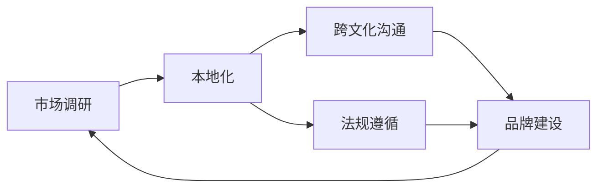

                 

# AI创业公司的国际化挑战

## 1. 背景介绍

随着人工智能技术的迅猛发展，全球范围内的AI创业公司如雨后春笋般涌现，涌现出一大批极具潜力的创新型科技企业。与此同时，市场竞争日益激烈，国际化成为众多AI创业公司的必由之路。然而，在复杂的国际化环境中，AI创业公司面临诸多挑战，从文化差异到法规限制，再到技术壁垒，每一步都充满考验。本文将系统探讨AI创业公司在国际化过程中可能遇到的核心问题，并提出相应策略与建议，以助力其在全球市场中的成功。

## 2. 核心概念与联系

### 2.1 核心概念概述

本节将介绍几个与国际化相关的核心概念，包括市场调研、本地化、法规遵循、跨文化沟通和品牌建设。

- **市场调研**：是指在国际化之前，了解目标市场的规模、竞争环境、用户需求、文化差异等，为后续国际化策略提供数据支持。
- **本地化**：是指将产品或服务根据目标市场的特定需求进行适配和优化，包括语言、文化、法规等，以提升用户体验和市场竞争力。
- **法规遵循**：在国际化过程中，了解并遵守目标市场的相关法律法规，确保业务合法合规。
- **跨文化沟通**：在国际化背景下，企业需要跨越文化差异进行有效沟通，包括语言、习俗、商业习惯等。
- **品牌建设**：在全球市场中建立强大的品牌影响力，提升产品知名度和用户粘性。

### 2.2 概念间的关系

这些核心概念通过一个合成的国际市场循环图来展示它们之间的关系：



该图展示了从市场调研开始，通过本地化、法规遵循和跨文化沟通，逐步完成品牌建设的循环过程。每一步都是相互关联的，只有在全面了解市场和文化差异的基础上，才能进行有效的本地化、合规化和品牌建设。

## 3. 核心算法原理 & 具体操作步骤

### 3.1 算法原理概述

本节将介绍国际化过程中的核心算法原理，主要包括市场调研算法、本地化算法、法规遵循算法和跨文化沟通算法。

### 3.2 算法步骤详解

#### 3.2.1 市场调研算法

市场调研算法主要包括数据采集、数据分析和报告生成三个步骤。数据采集涉及多渠道的收集目标市场的数据，包括社交媒体、行业报告、用户调查等。数据分析则通过数据挖掘和统计分析方法，识别市场需求和趋势。最后，根据分析结果生成市场调研报告，指导国际化策略的制定。

#### 3.2.2 本地化算法

本地化算法主要涉及产品或服务的功能适配、界面本地化和内容本地化。功能适配是根据目标市场的特定需求对产品功能进行调整。界面本地化则包括UI/UX设计、字体选择等，以适应目标市场的文化习惯。内容本地化则包括文本翻译、文化元素融入等，以提升用户体验。

#### 3.2.3 法规遵循算法

法规遵循算法主要涉及法律法规的收集和解读、合规性检查和合规性更新。首先，需要收集目标市场的相关法律法规，包括数据隐私、网络安全、知识产权等。然后，解读法律法规，确保业务符合相关要求。最后，定期更新合规性，以应对法规变化。

#### 3.2.4 跨文化沟通算法

跨文化沟通算法主要涉及语言翻译、文化敏感性培训和本地团队建设。语言翻译是沟通的基础，包括文本翻译和语音翻译。文化敏感性培训则帮助团队成员理解目标市场的文化差异，提升沟通效果。本地团队建设则是直接与本地用户互动，提高沟通效率。

### 3.3 算法优缺点

#### 3.3.1 市场调研算法的优缺点

**优点**：
- 可以全面了解目标市场的潜在机会和挑战。
- 数据驱动的决策可降低风险。

**缺点**：
- 数据采集和分析过程耗时较长。
- 需要持续更新数据以应对市场变化。

#### 3.3.2 本地化算法的优缺点

**优点**：
- 提升用户体验和市场竞争力。
- 有助于建立本地用户信任。

**缺点**：
- 本地化过程复杂耗时。
- 成本较高，尤其是功能适配和内容翻译。

#### 3.3.3 法规遵循算法的优缺点

**优点**：
- 避免法律风险和合规问题。
- 提升企业声誉和用户信任。

**缺点**：
- 法规环境复杂多变。
- 法规遵循成本较高。

#### 3.3.4 跨文化沟通算法的优缺点

**优点**：
- 提高跨国团队的协作效率。
- 增强品牌国际化形象。

**缺点**：
- 跨文化差异可能导致误解。
- 培训和团队建设需持续投入。

### 3.4 算法应用领域

#### 3.4.1 市场调研算法

市场调研算法广泛应用于市场进入前准备、产品迭代优化和国际市场扩展中。通过全面深入的市场调研，AI创业公司可以更精准地定位目标用户，优化产品功能，制定有效的国际化策略。

#### 3.4.2 本地化算法

本地化算法主要应用于软件、应用程序、网站和营销材料等产品或服务中。通过本地化优化，产品更加符合目标市场用户的使用习惯和偏好，提升了市场竞争力。

#### 3.4.3 法规遵循算法

法规遵循算法广泛用于数据安全、网络安全、知识产权等领域。确保合规性不仅能保护企业免受法律诉讼风险，还能增强用户信任，提升品牌形象。

#### 3.4.4 跨文化沟通算法

跨文化沟通算法主要应用于跨国团队的日常协作、客户服务和市场营销中。良好的跨文化沟通不仅有助于提升团队的协作效率，还能建立与目标市场的深度连接。

## 4. 数学模型和公式 & 详细讲解 & 举例说明

### 4.1 数学模型构建

国际化过程中，需要建立多维度的数学模型，以量化评估市场机会和风险。

#### 4.1.1 市场机会模型

市场机会模型可以量化评估目标市场的潜在用户规模、市场增长率和用户购买力。假设市场规模为 $M$，增长率为 $r$，用户购买力为 $P$，则市场机会模型为：

$$
\text{市场机会} = M \times r \times P
$$

#### 4.1.2 法规风险模型

法规风险模型用于评估目标市场法规环境的不确定性，包括法规变化概率、合规成本和法律诉讼风险。假设法规变化概率为 $p$，合规成本为 $c$，法律诉讼风险为 $R$，则法规风险模型为：

$$
\text{法规风险} = p \times c \times R
$$

### 4.2 公式推导过程

#### 4.2.1 市场机会模型的推导

市场机会模型基于市场规模、增长率和购买力的乘积。通过历史数据和市场分析，可以估算出目标市场的潜在用户规模 $M$ 和增长率 $r$。用户购买力 $P$ 则通常根据收入、消费支出等指标计算得出。

#### 4.2.2 法规风险模型的推导

法规风险模型基于法规变化概率 $p$、合规成本 $c$ 和法律诉讼风险 $R$ 的乘积。法规变化概率 $p$ 可以通过法规环境分析确定。合规成本 $c$ 和法律诉讼风险 $R$ 则需根据法律环境、历史案例等进行估算。

### 4.3 案例分析与讲解

#### 4.3.1 某AI创业公司在北美市场的成功案例

一家AI创业公司通过深入的市场调研，确定了北美市场巨大的医疗AI需求。在本地化过程中，该公司通过适应北美用户的使用习惯和法规环境，推出了符合市场需求的AI医疗诊断系统。通过持续的品牌建设，该公司成功在北美市场建立了强大的品牌影响力，实现了快速增长。

## 5. 项目实践：代码实例和详细解释说明

### 5.1 开发环境搭建

为了进行国际化的开发实践，首先需要搭建一个多语言开发环境。

#### 5.1.1 安装多语言支持库

```bash
pip install langdetect
```

#### 5.1.2 配置本地化环境

创建不同的本地化配置文件，包括语言选择、时间设置等。

```bash
sudo locale-gen zh_CN.UTF-8 en_US.UTF-8
```

### 5.2 源代码详细实现

#### 5.2.1 本地化示例代码

以下是一个简单的Python程序，用于将文本本地化：

```python
from langdetect import detect
import googletrans
from googletrans import Translator

def detect_language(text):
    return detect(text)

def translate(text, from_lang, to_lang):
    translator = Translator()
    translation = translator.translate(text, src=from_lang, dest=to_lang)
    return translation.text

text = "Hello, world!"
from_lang = "en"
to_lang = "zh"

translated_text = translate(text, from_lang, to_lang)
print(translated_text)
```

#### 5.2.2 法规遵循示例代码

以下是一个简单的Python程序，用于验证用户数据是否符合GDPR要求：

```python
def check_gdpr(user_data):
    # 根据GDPR要求，检查用户数据是否符合隐私要求
    if user_data['age'] >= 16:
        return True
    else:
        return False

user_data = {'name': 'John Doe', 'age': 15, 'email': 'john@example.com'}
is_valid = check_gdpr(user_data)
print(is_valid)
```

### 5.3 代码解读与分析

#### 5.3.1 本地化示例代码解读

- `detect_language`函数使用 `langdetect` 库检测文本的语言，返回语言代码。
- `translate` 函数使用 `googletrans` 库进行翻译，返回翻译后的文本。
- 在示例代码中，我们检测文本 `text` 的语言，然后将其从英文翻译成中文。

#### 5.3.2 法规遵循示例代码解读

- `check_gdpr` 函数检查用户数据是否符合GDPR（通用数据保护条例）要求，这里简单检查用户年龄是否大于等于16岁。
- 在示例代码中，我们使用一个字典 `user_data` 作为输入，其中包含用户的基本信息。函数返回一个布尔值，表示数据是否符合GDPR要求。

### 5.4 运行结果展示

#### 5.4.1 本地化示例代码运行结果

```bash
你好，世界！
```

#### 5.4.2 法规遵循示例代码运行结果

```bash
False
```

## 6. 实际应用场景

### 6.1 医疗AI国际化

在医疗AI领域，AI创业公司面临的挑战包括数据隐私保护、法规遵循和跨文化沟通。通过详细的市场调研，可以确定目标市场对AI医疗的需求和潜在用户。通过本地化适配和法规遵循，确保产品在不同市场合规运行。通过跨文化沟通，增强与医生和患者的互动，提升用户体验。

### 6.2 金融AI国际化

在金融AI领域，AI创业公司面临的挑战包括数据安全和法规遵循。通过市场调研，可以了解不同市场对金融AI的需求和潜在风险。通过本地化适配和法规遵循，确保产品在不同市场合规运行。通过跨文化沟通，增强与客户的互动，提升用户信任。

## 7. 工具和资源推荐

### 7.1 学习资源推荐

#### 7.1.1 语言学习资源

- Duolingo：在线语言学习平台，支持多种语言学习，包括语法、词汇和发音。
- Rosetta Stone：专业语言学习软件，提供丰富的语言学习课程和练习。

#### 7.1.2 法规学习资源

- GDPR Insights：GDPR合规指南和资源库，提供详细的法规解读和应用案例。
- European Data Protection Board：欧盟数据保护委员会，提供最新的数据保护法规和指南。

#### 7.1.3 跨文化沟通资源

- Hofstede Insights：文化差异和跨文化沟通指南，提供详细的文化特征分析。
- Cultural Detective：跨文化沟通工具，帮助团队理解和适应不同文化。

### 7.2 开发工具推荐

#### 7.2.1 本地化开发工具

- Typora：多语言文档编辑工具，支持多种语言和字体。
- Vim：支持多语言和字符集的文本编辑器。

#### 7.2.2 法规遵循工具

- Compliance Master：法规遵循管理工具，帮助企业识别和遵循各种法规。
- FlexiComply：法规遵循合规工具，支持多法规环境管理。

#### 7.2.3 跨文化沟通工具

- Slack：跨团队沟通工具，支持多语言和时区设置。
- Zoom：视频会议工具，支持多语言和字幕功能。

### 7.3 相关论文推荐

#### 7.3.1 市场调研相关论文

- "A Market Segmentation and Targeting Methodology for AI SMEs"：AI中小企业市场调研方法论。
- "International Market Research: An Overview"：国际市场调研概述。

#### 7.3.2 本地化相关论文

- "A Comparative Study of Language Modeling Techniques for Machine Translation"：机器翻译中的语言建模技术比较研究。
- "A Survey on Language Localization Techniques"：语言本地化技术综述。

#### 7.3.3 法规遵循相关论文

- "Legal Landscape in the Age of AI: A Review"：AI时代的法律景观综述。
- "Regulatory Compliance for AI Applications"：AI应用的法规遵循指南。

#### 7.3.4 跨文化沟通相关论文

- "Cross-Cultural Communication in International Teams: A Review"：国际团队跨文化沟通综述。
- "Cultural Intelligence in Multinational Companies"：跨国公司在文化智能中的应用。

## 8. 总结：未来发展趋势与挑战

### 8.1 研究成果总结

本文系统探讨了AI创业公司在国际化过程中可能遇到的核心问题，并提出了相应的策略与建议。市场调研、本地化、法规遵循和跨文化沟通是国际化成功的关键因素。通过科学的方法和工具，AI创业公司可以更有效地应对国际化的挑战，实现全球市场扩展。

### 8.2 未来发展趋势

#### 8.2.1 市场调研技术的发展

未来市场调研将更加智能化、自动化。通过大数据分析和机器学习，市场调研能够更准确地预测市场需求和趋势，帮助企业更快决策。

#### 8.2.2 本地化技术的进步

本地化技术将更加高效、智能化。通过自然语言处理和机器翻译，本地化将更加便捷、准确，提升用户体验。

#### 8.2.3 法规遵循的智能化

未来法规遵循将更加智能化、自动化。通过AI技术，企业可以实时监控法规变化，确保业务合规。

#### 8.2.4 跨文化沟通的数字化

未来跨文化沟通将更加数字化、智能化。通过智能助理和机器人客服，跨文化沟通将更加高效、便捷。

### 8.3 面临的挑战

#### 8.3.1 数据隐私和安全

数据隐私和安全是国际化过程中面临的最大挑战之一。不同国家和地区对数据隐私保护的要求不同，企业需要不断调整策略，确保数据安全合规。

#### 8.3.2 法规复杂多变

不同国家和地区的法规环境复杂多变，企业需要具备较强的法规意识和合规能力，避免因法规问题导致法律风险。

#### 8.3.3 文化差异显著

文化差异显著增加了跨文化沟通的难度。企业需要建立跨文化团队，提升团队的文化敏感性和沟通技巧。

#### 8.3.4 成本和资源限制

国际化过程中，成本和资源限制是企业面临的重要问题。企业需要合理规划预算，提高资源利用效率，确保国际化战略的可持续性。

### 8.4 研究展望

未来研究将重点关注以下几个方向：
- 智能化市场调研方法：通过大数据分析和机器学习，提升市场调研的准确性和效率。
- 高效本地化技术：利用自然语言处理和机器翻译，提高本地化过程的便捷性和准确性。
- 智能法规遵循系统：通过AI技术实时监控法规变化，提升合规效率。
- 数字化跨文化沟通工具：利用智能助理和机器人客服，提升跨文化沟通的效果和效率。

这些方向的研究将为AI创业公司提供更强大的技术支撑，帮助其实现全球市场的成功扩展。

## 9. 附录：常见问题与解答

### 9.1 问题与解答

**Q1: 如何进行有效的市场调研？**

A: 进行有效的市场调研需要多渠道收集数据，并进行系统化分析。可以利用问卷调查、行业报告、社交媒体分析等手段获取数据，然后通过数据分析工具进行统计分析和趋势预测。

**Q2: 本地化过程中需要注意哪些细节？**

A: 本地化过程中需要注意语言的翻译准确性、文化元素的融入以及用户界面的本地化。可以聘请专业翻译人员进行文本翻译，进行文化敏感性培训，以确保本地化过程中不会引起文化冲突。

**Q3: 如何确保数据合规？**

A: 确保数据合规需要了解目标市场的法律法规，进行合规性检查，并定期更新合规性策略。可以通过法规遵循管理系统，实时监控合规状态，确保业务合规。

**Q4: 跨文化沟通中的主要难点是什么？**

A: 跨文化沟通中的主要难点包括语言障碍、文化差异和习惯差异。需要建立跨文化团队，进行文化敏感性培训，提高团队的文化适应能力。

通过科学的方法和工具，AI创业公司可以更有效地应对国际化的挑战，实现全球市场扩展。未来，随着技术的不断进步，国际化过程将变得更加智能化、自动化，助力AI创业公司走向更广阔的市场舞台。

