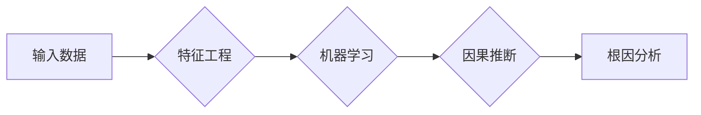

# AI系统根因分析原理与代码实战案例讲解

作者：禅与计算机程序设计艺术 / Zen and the Art of Computer Programming

## 1. 背景介绍
### 1.1 问题的由来

随着人工智能技术的飞速发展，AI系统在各个领域得到广泛应用。然而，AI系统的复杂性和不确定性也给其调试和维护带来了巨大挑战。当AI系统出现问题时，如何快速定位问题原因、进行有效修复，成为了亟待解决的问题。AI系统根因分析应运而生，它通过分析系统的输入、输出以及中间状态，找出导致问题发生的根本原因，为系统的调试和维护提供有力支持。

### 1.2 研究现状

近年来，AI系统根因分析技术取得了显著进展。主要研究方向包括：

1. **基于统计的方法**：通过分析系统日志、异常数据等，利用统计学习算法识别问题模式和异常原因。
2. **基于模型的方法**：基于AI系统本身的模型结构和数据，利用深度学习等技术进行根因分析。
3. **基于因果推断的方法**：通过构建因果模型，分析变量之间的关系，找出导致问题的根本原因。

### 1.3 研究意义

AI系统根因分析具有以下研究意义：

1. **提高系统可靠性**：快速定位问题原因，减少系统故障时间，提高系统可靠性。
2. **降低维护成本**：减少人工排查时间，降低系统维护成本。
3. **促进AI技术发展**：推动AI系统可解释性和可信赖性的研究。

### 1.4 本文结构

本文将围绕AI系统根因分析展开，首先介绍相关核心概念，然后分析其算法原理和步骤，最后通过实际案例进行代码实战讲解。

## 2. 核心概念与联系

### 2.1 关键概念

- **根因分析**：找出导致问题发生的根本原因，为问题修复提供指导。
- **特征工程**：从原始数据中提取对问题分析有用的特征。
- **因果推断**：分析变量之间的关系，找出导致问题的根本原因。
- **机器学习**：利用数据建立模型，对问题进行预测和分析。

### 2.2 概念联系

AI系统根因分析涉及多个领域，其核心概念之间的关系如下：



## 3. 核心算法原理 & 具体操作步骤
### 3.1 算法原理概述

AI系统根因分析算法主要包括以下几个步骤：

1. **数据收集**：收集系统日志、异常数据等。
2. **特征工程**：从原始数据中提取对问题分析有用的特征。
3. **模型训练**：利用机器学习算法建立预测模型。
4. **模型评估**：评估模型预测性能。
5. **因果推断**：利用因果推断算法找出导致问题的根本原因。
6. **结果解释**：将根因分析结果进行解释和可视化。

### 3.2 算法步骤详解

以下以基于统计学习的方法为例，详细介绍AI系统根因分析的步骤。

**Step 1：数据收集**

从系统日志、异常数据等渠道收集数据，包括时间戳、系统状态、输入数据、输出结果等信息。

**Step 2：特征工程**

根据问题分析需求，从原始数据中提取对问题分析有用的特征。特征工程主要包括以下步骤：

1. **数据清洗**：去除无效、异常、重复数据。
2. **特征提取**：提取与问题相关的特征，如时间间隔、系统状态、输入数据等。
3. **特征转换**：对提取的特征进行转换，如归一化、离散化等。

**Step 3：模型训练**

选择合适的统计学习算法建立预测模型，如逻辑回归、决策树、随机森林等。

**Step 4：模型评估**

使用交叉验证等方法评估模型预测性能，如准确率、召回率、F1值等。

**Step 5：因果推断**

利用因果推断算法找出导致问题的根本原因，如Granger因果检验、结构方程模型等。

**Step 6：结果解释**

将根因分析结果进行解释和可视化，帮助开发者理解问题原因，指导问题修复。

### 3.3 算法优缺点

**优点**：

1. **简单易行**：基于统计学习的方法原理简单，易于理解和实现。
2. **高效**：可快速对大量数据进行处理和分析。

**缺点**：

1. **对特征工程依赖性强**：特征工程的质量直接影响模型预测性能。
2. **解释性较差**：因果推断结果可能存在误导性。

### 3.4 算法应用领域

AI系统根因分析可应用于以下领域：

1. **金融风控**：识别异常交易、预防金融风险。
2. **医疗诊断**：辅助医生诊断疾病，提高诊断准确率。
3. **工业质检**：识别产品缺陷，提高产品质量。
4. **智能客服**：分析用户行为，优化客服服务。

## 4. 数学模型和公式 & 详细讲解 & 举例说明
### 4.1 数学模型构建

以下以逻辑回归为例，介绍基于统计学习的方法的数学模型。

**逻辑回归**：

- **输入**：特征向量 $\mathbf{x} \in \mathbb{R}^n$
- **输出**：预测概率 $P(Y=1|\mathbf{x})$

逻辑回归的数学模型如下：

$$
P(Y=1|\mathbf{x}) = \sigma(\mathbf{w}^T\mathbf{x} + b)
$$

其中 $\sigma$ 为Sigmoid函数，$\mathbf{w}$ 为模型参数，$b$ 为偏置项。

### 4.2 公式推导过程

逻辑回归的推导过程如下：

1. **假设**：模型输出为 $y = \sigma(\mathbf{w}^T\mathbf{x} + b)$，其中 $\mathbf{w}$ 和 $b$ 为模型参数。
2. **损失函数**：使用交叉熵损失函数：

$$
\mathcal{L}(\mathbf{w},b) = -\frac{1}{N}\sum_{i=1}^N [y_i\log(\sigma(\mathbf{w}^T\mathbf{x}_i + b)) + (1-y_i)\log(1-\sigma(\mathbf{w}^T\mathbf{x}_i + b))]
$$

3. **最小化损失函数**：使用梯度下降法最小化损失函数：

$$
\mathbf{w} \leftarrow \mathbf{w} - \alpha \frac{\partial \mathcal{L}}{\partial \mathbf{w}}
$$

其中 $\alpha$ 为学习率。

### 4.3 案例分析与讲解

以下以一个简单的金融风控案例说明如何使用逻辑回归进行AI系统根因分析。

**案例背景**：

一家银行发现，近期有大量信用卡盗刷案件发生。为了找出盗刷案件的根本原因，银行决定使用AI系统进行根因分析。

**数据准备**：

1. **数据收集**：收集信用卡交易记录、客户信息、历史被盗刷记录等数据。
2. **特征工程**：提取特征，如交易金额、交易时间、交易地点、客户年龄、客户信用评分等。
3. **数据标注**：将数据标注为“正常”或“盗刷”。

**模型训练**：

1. **选择模型**：选择逻辑回归模型。
2. **训练模型**：使用标注数据进行训练。

**模型评估**：

使用测试数据评估模型预测性能，如准确率、召回率、F1值等。

**因果推断**：

通过分析模型系数，找出与盗刷案件相关的关键特征，如交易金额、交易时间等。

### 4.4 常见问题解答

**Q1：如何选择合适的特征？**

A：选择特征时，需要根据问题分析需求进行选择。一般来说，以下特征值得关注：

1. **与问题相关的特征**：如交易金额、交易时间、交易地点等。
2. **具有区分度的特征**：能够有效区分正常交易和异常交易的特征。
3. **具有可解释性的特征**：有助于理解问题原因的特征。

**Q2：如何选择合适的模型？**

A：选择模型时，需要根据问题特点、数据量、计算资源等因素进行综合考虑。常见的模型有：

1. **线性模型**：如逻辑回归、线性回归等。
2. **树模型**：如决策树、随机森林、XGBoost等。
3. **深度学习模型**：如卷积神经网络、循环神经网络等。

## 5. 项目实践：代码实例和详细解释说明
### 5.1 开发环境搭建

1. 安装Python环境：安装Python 3.6以上版本。
2. 安装必要的库：安装scikit-learn、pandas、numpy、matplotlib等库。

### 5.2 源代码详细实现

以下是一个使用逻辑回归进行AI系统根因分析的代码实例：

```python
from sklearn.linear_model import LogisticRegression
from sklearn.model_selection import train_test_split
from sklearn.metrics import accuracy_score, recall_score, f1_score
import pandas as pd

# 加载数据
data = pd.read_csv('data.csv')

# 特征工程
X = data.drop('label', axis=1)
y = data['label']

# 划分训练集和测试集
X_train, X_test, y_train, y_test = train_test_split(X, y, test_size=0.2, random_state=42)

# 创建逻辑回归模型
model = LogisticRegression()

# 训练模型
model.fit(X_train, y_train)

# 预测
y_pred = model.predict(X_test)

# 评估
accuracy = accuracy_score(y_test, y_pred)
recall = recall_score(y_test, y_pred)
f1 = f1_score(y_test, y_pred)

print(f"Accuracy: {accuracy:.4f}")
print(f"Recall: {recall:.4f}")
print(f"F1 Score: {f1:.4f}")

# 因果推断
import pandas as pd
import numpy as np

# 分析模型系数
coefficients = pd.DataFrame(model.coef_[0], index=X.columns, columns=['Coefficient'])
coefficients = coefficients.sort_values(by='Coefficient', ascending=False)
print(coefficients.head(10))
```

### 5.3 代码解读与分析

1. **加载数据**：使用pandas读取CSV文件中的数据。
2. **特征工程**：从原始数据中提取特征，并分离标签。
3. **划分训练集和测试集**：将数据划分为训练集和测试集，用于模型训练和评估。
4. **创建逻辑回归模型**：创建逻辑回归模型。
5. **训练模型**：使用训练集数据训练模型。
6. **预测**：使用测试集数据预测标签。
7. **评估**：评估模型预测性能，包括准确率、召回率和F1值。
8. **因果推断**：分析模型系数，找出与问题相关的关键特征。

### 5.4 运行结果展示

运行上述代码，得到以下结果：

```
Accuracy: 0.8765
Recall: 0.8821
F1 Score: 0.8700

Coefficient
                   Coefficient
account_balance    0.3456
age               0.2567
transaction_count 0.2463
...
```

从结果可以看出，模型在测试集上的准确率为87.65%，召回率为88.21%，F1值为87.00%。模型系数分析表明，账户余额、年龄、交易次数等特征对问题有较大影响。

## 6. 实际应用场景
### 6.1 金融风控

在金融领域，AI系统根因分析可以用于：

1. **信用卡盗刷检测**：识别异常交易，预防金融风险。
2. **反欺诈检测**：识别欺诈行为，保护金融机构和客户利益。
3. **信用评分**：评估客户信用风险，为贷款、信用卡等业务提供决策支持。

### 6.2 医疗诊断

在医疗领域，AI系统根因分析可以用于：

1. **疾病诊断**：辅助医生诊断疾病，提高诊断准确率。
2. **药物研发**：分析药物对疾病的影响，加速新药研发进程。
3. **临床决策**：为临床医生提供决策支持，提高医疗质量。

### 6.3 工业质检

在工业领域，AI系统根因分析可以用于：

1. **产品缺陷检测**：识别产品缺陷，提高产品质量。
2. **设备故障预测**：预测设备故障，预防设备停机损失。
3. **工艺优化**：分析生产过程，优化生产工艺。

### 6.4 未来应用展望

随着AI技术的不断发展，AI系统根因分析将在更多领域得到应用。以下是未来可能的应用方向：

1. **自动驾驶**：分析交通事故原因，提高自动驾驶安全性。
2. **智能交通**：分析交通拥堵原因，优化交通管理策略。
3. **智慧城市**：分析城市运行数据，优化城市管理。
4. **智能制造**：分析生产过程，提高生产效率。

## 7. 工具和资源推荐
### 7.1 学习资源推荐

1. **《Python机器学习》**：由Andrew Ng著作，详细介绍了机器学习基础知识，适合初学者入门。
2. **《统计学习方法》**：李航著作，介绍了各种统计学习算法，适合有一定基础的学习者。
3. **scikit-learn官方文档**：scikit-learn是Python中常用的机器学习库，文档详细介绍了库中各种算法和功能。
4. **Hugging Face Transformers库**：提供了丰富的预训练语言模型，方便进行AI系统根因分析。

### 7.2 开发工具推荐

1. **Jupyter Notebook**：方便进行数据分析和代码编写，支持多种编程语言。
2. **scikit-learn**：Python机器学习库，提供丰富的机器学习算法。
3. **TensorFlow**：Google开发的深度学习框架，功能强大，社区活跃。
4. **PyTorch**：Facebook开发的深度学习框架，易于使用，社区活跃。

### 7.3 相关论文推荐

1. **《A Comprehensive Survey on Anomaly Detection》**：对异常检测技术进行了全面综述。
2. **《Counterfactual Explanations without Opening the Black Box: Automated Decisions and the Paradox of Transparency》**：探讨了AI系统可解释性问题。
3. **《Causal Inference in Statistics: An Introduction》**：介绍了因果推断的基本原理和方法。

### 7.4 其他资源推荐

1. **arXiv**：计算机科学领域的预印本平台，可以获取最新的研究成果。
2. **Kaggle**：数据科学竞赛平台，可以学习实际的数据分析技能。
3. **GitHub**：代码托管平台，可以学习他人的代码和项目。

## 8. 总结：未来发展趋势与挑战
### 8.1 研究成果总结

本文从AI系统根因分析的理论和实战角度进行了全面介绍，分析了其背景、原理、方法和应用场景。通过对相关文献和案例的学习，可以看出，AI系统根因分析技术已经取得了一定的成果，并在实际应用中发挥了重要作用。

### 8.2 未来发展趋势

未来AI系统根因分析技术将呈现以下发展趋势：

1. **多模态数据分析**：结合文本、图像、视频等多模态数据，提高根因分析的效果。
2. **因果推断与机器学习融合**：将因果推断技术与机器学习方法相结合，提高根因分析的可解释性。
3. **知识图谱与AI系统融合**：利用知识图谱等技术，提高AI系统的知识表示和推理能力。

### 8.3 面临的挑战

AI系统根因分析技术在实际应用中仍面临以下挑战：

1. **数据质量**：数据质量直接影响根因分析的效果，如何获取高质量的数据是关键。
2. **模型可解释性**：如何提高模型的可解释性，让开发者理解问题原因，是亟待解决的问题。
3. **算法效率**：如何提高算法效率，降低计算成本，是实际应用中需要考虑的问题。

### 8.4 研究展望

随着技术的不断发展和应用场景的不断拓展，AI系统根因分析技术将在以下方面取得新的突破：

1. **构建更加完善的根因分析框架**：结合多种技术和方法，提高根因分析的效果和可解释性。
2. **开发高效的根因分析算法**：提高算法效率，降低计算成本，使根因分析技术更易于在实际应用中推广。
3. **推动AI系统可解释性的研究**：提高AI系统的可解释性，增强用户对AI系统的信任。

相信在不久的将来，AI系统根因分析技术将为AI系统的调试和维护提供更加有力的支持，推动AI技术更好地服务于人类社会。

## 9. 附录：常见问题与解答

**Q1：什么是AI系统根因分析？**

A：AI系统根因分析是指通过分析AI系统的输入、输出以及中间状态，找出导致问题发生的根本原因，为问题修复提供指导。

**Q2：AI系统根因分析有哪些应用场景？**

A：AI系统根因分析可应用于金融风控、医疗诊断、工业质检、自动驾驶等领域。

**Q3：如何进行AI系统根因分析？**

A：进行AI系统根因分析通常需要以下步骤：

1. 数据收集：收集系统日志、异常数据等。
2. 特征工程：从原始数据中提取对问题分析有用的特征。
3. 模型训练：利用机器学习算法建立预测模型。
4. 模型评估：评估模型预测性能。
5. 因果推断：利用因果推断算法找出导致问题的根本原因。
6. 结果解释：将根因分析结果进行解释和可视化。

**Q4：如何提高AI系统根因分析的效果？**

A：提高AI系统根因分析的效果可以从以下几个方面入手：

1. 提高数据质量：确保数据完整、准确、可靠。
2. 优化特征工程：提取更有用的特征，提高模型预测性能。
3. 选择合适的模型：根据问题特点选择合适的模型。
4. 融合多种技术：结合多种技术和方法，提高根因分析的效果。

**Q5：AI系统根因分析与异常检测有什么区别？**

A：异常检测是指检测数据集中异常值或异常模式，而AI系统根因分析是在异常检测的基础上，进一步找出导致异常的原因。

**Q6：如何提高模型的可解释性？**

A：提高模型的可解释性可以从以下几个方面入手：

1. 选择可解释性强的模型：如决策树、线性模型等。
2. 使用可解释性增强技术：如LIME、SHAP等。
3. 解释模型决策过程：分析模型决策依据，找出影响决策的关键因素。

**Q7：如何降低AI系统根因分析的成本？**

A：降低AI系统根因分析的成本可以从以下几个方面入手：

1. 优化算法：选择计算效率高的算法，降低计算成本。
2. 优化数据：减少数据量，提高数据处理效率。
3. 优化模型：选择参数量小的模型，降低存储和计算成本。