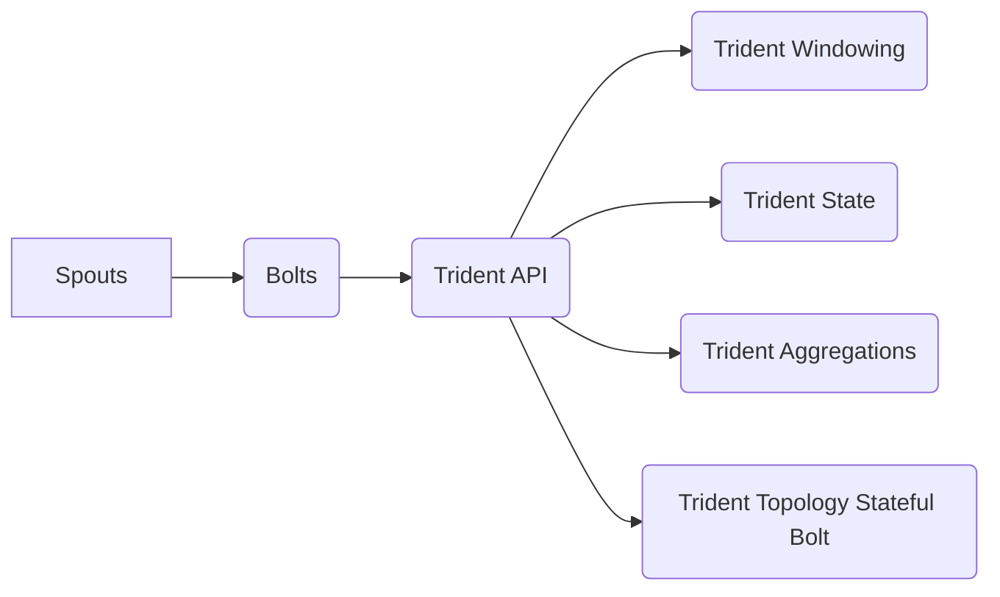

# Storm Trident原理与代码实例讲解

作者：禅与计算机程序设计艺术 / Zen and the Art of Computer Programming

## 1. 背景介绍

### 1.1 问题的由来

随着大数据时代的到来，实时数据处理的需求日益增长。Apache Storm作为一个高性能、可靠的分布式实时计算系统，已经成为业界处理实时数据流的首选框架。然而，传统的Storm拓扑结构在处理复杂实时计算任务时，存在着扩展性差、容错性不足、复杂度高等问题。

为了解决这些问题，Apache Storm社区推出了Storm Trident，它是一种可扩展的分布式实时处理框架，扩展了Storm的基本功能，使得Storm能够高效、可靠地处理大规模的实时数据流。Trident提供了一种更高级别的抽象，允许用户以声明式的方式定义实时数据处理的逻辑，从而降低系统复杂性，提高开发效率。

### 1.2 研究现状

Storm Trident自发布以来，已经经过多个版本的迭代，功能不断完善，性能得到显著提升。目前，Trident已成为Apache Storm社区的重要组成部分，并在金融、电商、物联网等领域得到广泛应用。

### 1.3 研究意义

Storm Trident的研究和开发具有重要意义：

1. 降低实时数据处理系统的开发门槛，使得更多开发者能够利用Storm框架构建高性能的实时应用。
2. 提高实时数据处理的可靠性和扩展性，满足大规模数据流计算的需求。
3. 促进Storm框架在更多领域的应用，推动实时数据处理技术的发展。

### 1.4 本文结构

本文将系统地介绍Storm Trident的原理、应用和实践，包括以下内容：

- 2. 核心概念与联系
- 3. 核心算法原理 & 具体操作步骤
- 4. 数学模型和公式 & 详细讲解 & 举例说明
- 5. 项目实践：代码实例和详细解释说明
- 6. 实际应用场景
- 7. 工具和资源推荐
- 8. 总结：未来发展趋势与挑战

## 2. 核心概念与联系

为了更好地理解Storm Trident，本节将介绍几个核心概念及其相互关系。

### 2.1 Trident API

Trident API是Storm提供的高级接口，用于定义实时数据处理逻辑。它提供了以下几种组件：

1. **Trident Topology**：定义了实时数据处理的整体结构，包括Spouts、Bolts、Streams等组件。
2. **Spouts**：数据源组件，负责从数据源读取数据，并输出为Bolts处理。
3. **Bolts**：数据处理组件，负责对数据进行处理和分析。
4. **Streams**：数据流组件，用于定义Spouts与Bolts之间的数据传输关系。
5. **State**：状态组件，用于存储Bolts的状态信息，支持持久化和容错。
6. **Trident Stateful Bolt**：包含状态的Bolts，用于在Bolts中存储和更新状态信息。

### 2.2 Trident Windowing

Trident Windowing是Trident提供的窗口机制，用于对数据流进行时间或计数窗口划分，以便进行聚合、滑动窗口等操作。

### 2.3 Trident State

Trident State是Trident提供的状态管理机制，用于存储Bolts的状态信息，支持持久化和容错。Trident支持以下几种状态存储方式：

1. **MemoryState**：将状态存储在内存中，适合小规模状态。
2. **KafkaState**：将状态存储在Kafka消息队列中，适合大规模状态。
3. **RedisState**：将状态存储在Redis缓存中，适合大规模状态。

### 2.4 Trident Aggregations

Trident Aggregations是Trident提供的聚合机制，用于对窗口内的数据进行聚合操作，如求和、求平均、计数等。

### 2.5 Trident Topology Stateful Bolt

Trident Topology Stateful Bolt是包含状态的Bolts，用于在Bolts中存储和更新状态信息。它支持以下几种状态更新方式：

1. **Map State**：以键值对形式存储状态信息。
2. **List State**：以列表形式存储状态信息。
3. **Count State**：以计数器形式存储状态信息。

以上概念之间的关系可以用以下Mermaid流程图表示：



可以看出，Spouts和Bolts是Trident Topology的组成部分，它们通过Trident API进行连接和配置。Trident API提供了Windowing、State、Aggregations等高级功能，以支持更复杂的实时数据处理需求。Stateful Bolt则利用State机制存储和更新状态信息，实现更丰富的数据处理逻辑。

## 3. 核心算法原理 & 具体操作步骤

### 3.1 算法原理概述

Trident的算法原理可以概括为以下几步：

1. **数据读取**：Spouts从数据源读取数据，并将其输出为Bolts处理。
2. **数据传输**：Bolts通过Streams接收来自Spouts的数据，并进行处理。
3. **数据聚合**：Bolts对数据进行聚合操作，如求和、求平均等。
4. **状态存储**：Bolts将状态信息存储在State中，支持持久化和容错。
5. **数据输出**：Bolts将处理后的数据输出到下游系统。

### 3.2 算法步骤详解

以下详细说明Trident算法的各个步骤：

**Step 1：初始化拓扑**

创建Trident Topology对象，配置Spouts、Bolts、Streams等组件。

```java
TridentTopology topology = new TridentTopology();
```

**Step 2：定义Spouts**

定义数据源Spouts，用于从数据源读取数据。

```java
SpoutSpec spoutSpec = TridentTopology.mkSpoutSpec(MySpout.class, spoutConfig);
```

**Step 3：定义Bolts**

定义数据处理Bolts，用于对数据进行处理和分析。

```java
BoltExecutor boltExecutor = TridentTopology.mkBoltExecutor(MyBolt.class, boltConfig);
```

**Step 4：定义Streams**

定义Streams，用于连接Spouts和Bolts。

```java
topology.newStream("my_spout", spoutSpec).each(new Fields("my_field"), boltExecutor, new Fields("output_field"));
```

**Step 5：定义窗口和状态**

定义窗口和状态，用于对数据进行聚合和持久化。

```java
StateFactory factory = new MemoryStateFactory();
StateSpec stateSpec = new StateSpec("my_state", factory);

topology.newStream("my_stream", boltExecutor).statefulParallelism(2, stateSpec)
    .window(TumblingWindow.builder().size(10).duration(1000).build(), new CountStateFactory(), new Fields("state_field"));
```

**Step 6：启动拓扑**

启动拓扑，开始处理数据。

```java
LocalCluster cluster = new LocalCluster();
cluster.submitTopology("my_topology", new Config(), topology.build());
cluster.shutdown();
```

### 3.3 算法优缺点

**优点**：

1. **可扩展性**：Trident支持水平扩展，可以处理大规模数据流。
2. **容错性**：Trident支持持久化状态，保证在故障情况下数据不会丢失。
3. **灵活性**：Trident提供多种窗口和状态机制，支持复杂的数据处理逻辑。
4. **高可靠性**：Trident采用消息队列机制，保证数据处理的可靠性。

**缺点**：

1. **学习曲线**：Trident相对于传统的Storm API来说，学习曲线较陡峭，需要一定的时间来熟悉。
2. **性能开销**：Trident的状态持久化机制可能会增加一定的性能开销。

### 3.4 算法应用领域

Trident在以下领域得到广泛应用：

1. **实时日志分析**：对服务器日志、网络日志等实时数据进行分析，监控系统运行状态。
2. **实时推荐系统**：根据用户实时行为数据，为用户推荐感兴趣的商品或内容。
3. **实时欺诈检测**：对交易数据进行实时分析，检测欺诈行为。
4. **实时监控**：对生产系统进行实时监控，及时发现和处理异常情况。

## 4. 数学模型和公式 & 详细讲解 & 举例说明

### 4.1 数学模型构建

Trident的数学模型可以概括为以下几部分：

1. **数据流模型**：描述数据在系统中的流动过程。
2. **窗口模型**：描述数据的窗口划分方式。
3. **状态模型**：描述状态信息的存储和更新方式。
4. **聚合模型**：描述数据的聚合操作。

以下分别对这几种模型进行详细讲解：

**数据流模型**：

数据流模型可以表示为：

$$
\text{Data Stream} = \{d_1, d_2, \dots, d_n\}
$$

其中，$d_i$ 表示数据流中的第 $i$ 个数据项。

**窗口模型**：

窗口模型可以表示为：

$$
\text{Window} = \{d_i, \dots, d_j\}
$$

其中，$d_i, \dots, d_j$ 表示窗口内的数据项。

**状态模型**：

状态模型可以表示为：

$$
\text{State} = \{s_1, \dots, s_k\}
$$

其中，$s_i$ 表示状态信息中的第 $i$ 个元素。

**聚合模型**：

聚合模型可以表示为：

$$
\text{Aggregation} = \sum_{i=1}^k s_i
$$

其中，$s_i$ 表示状态信息中的第 $i$ 个元素，$\sum$ 表示对状态信息进行求和操作。

### 4.2 公式推导过程

以下以窗口内的平均值为例，介绍聚合模型的推导过程。

**Step 1：定义窗口内的数据项**：

设窗口内的数据项为 $d_1, \dots, d_n$。

**Step 2：计算窗口内的总和**：

$$
\text{Sum} = d_1 + \dots + d_n
$$

**Step 3：计算窗口内的平均值**：

$$
\text{Average} = \frac{\text{Sum}}{n}
$$

### 4.3 案例分析与讲解

以下以实时日志分析为例，介绍如何使用Trident进行数据流处理。

**案例描述**：

假设我们要对服务器日志进行实时分析，统计每个小时的错误日志数量。

**解决方案**：

1. 定义数据源Spout，读取服务器日志文件。
2. 定义Bolt，对日志进行解析，提取时间信息。
3. 定义窗口，将数据按照小时进行划分。
4. 定义聚合Bolt，计算每个窗口内的错误日志数量。

**代码示例**：

```java
// 定义Spout
SpoutSpec spoutSpec = TridentTopology.mkSpoutSpec(LogSpout.class, spoutConfig);

// 定义Bolt，解析日志
BoltExecutor logParseBoltExecutor = TridentTopology.mkBoltExecutor(LogParseBolt.class, boltConfig);

// 定义窗口，按照小时划分
SlidingWindowSpec windowSpec = new SlidingWindowSpec(new TimeWindow(1, TimeUnit.HOURS));

// 定义聚合Bolt，计算错误日志数量
AggregatorSpec errorCountAggSpec = new CountAggregatorSpec();

// 连接组件
topology.newStream("my_spout", spoutSpec)
    .parallelismHint(4)
    .each(new Fields("log"), logParseBoltExecutor, new Fields("timestamp", "log_level"))
    .window(windowSpec)
    .each(new Fields("timestamp", "log_level"), errorCountAggSpec, new Fields("error_count"));

// 启动拓扑
LocalCluster cluster = new LocalCluster();
cluster.submitTopology("log_analysis_topology", new Config(), topology.build());
cluster.shutdown();
```

### 4.4 常见问题解答

**Q1：什么是窗口？**

A：窗口是数据流中的一个子集，用于进行数据聚合等操作。Trident支持多种窗口类型，如滑动窗口、固定窗口、计数窗口等。

**Q2：什么是状态？**

A：状态是Bolts在执行过程中需要持久化存储的数据。Trident支持多种状态存储方式，如内存状态、Kafka状态、Redis状态等。

**Q3：如何进行聚合操作？**

A：Trident提供多种聚合操作，如求和、求平均、计数等。用户可以根据需求选择合适的聚合操作。

## 5. 项目实践：代码实例和详细解释说明

### 5.1 开发环境搭建

在进行Trident项目开发前，需要搭建以下开发环境：

1. 安装Java环境：从官网下载并安装Java开发环境。
2. 安装Apache Storm：从官网下载并安装Apache Storm，并配置环境变量。
3. 安装IDE：安装Eclipse或IntelliJ IDEA等Java集成开发环境。

### 5.2 源代码详细实现

以下以实时日志分析为例，给出使用Trident进行数据流处理的Java代码实现。

```java
import backtype.storm.Config
import backtype.storm.LocalCluster
import backtype.storm.LocalDRPC
import backtype.stormTopology.TopologyBuilder
import backtype.storm.tuple.Fields
import storm.trident.Stream
import storm.trident.TridentTopology
import storm.trident.operation.BaseFunction
import storm.trident.operation.FunctionCall
import storm.trident.operation.TridentCollector
import storm.trident.state.memory.MemoryMapState
import storm.trident.tuple.TridentTuple

public class LogAnalysisToplogy {

    public static void main(String[] args) throws InterruptedException {
        TopologyBuilder builder = new TopologyBuilder();

        // 定义Spout，读取日志文件
        builder.setSpout("log_spout", new LogSpout(), 1);

        // 定义Bolt，解析日志
        builder.setBolt("log_parse_bolt", new LogParseBolt(), 1)
            .shuffleGrouping("log_spout");

        // 定义窗口，按照小时划分
        builder.setBolt("hourly_window_bolt", new HourlyWindowBolt(), 1)
            .fieldsGrouping("log_parse_bolt", new Fields("timestamp"));

        // 定义聚合Bolt，计算错误日志数量
        builder.setBolt("error_count_bolt", new ErrorCountBolt(), 1)
            .fieldsGrouping("hourly_window_bolt", new Fields("error_count"));

        // 启动拓扑
        LocalCluster cluster = new LocalCluster();
        cluster.submitTopology("log_analysis_topology", new Config(), builder.createTopology());
        Thread.sleep(1000 * 60 * 60); // 运行1小时
        cluster.shutdown();
    }

    // 日志Spout
    public static class LogSpout extends Spout_Base {

        @Override
        public void open(Map<String, Object> conf, TopologyContext context, SpoutOutputCollector collector) {
            // 读取日志文件，生成Tuple
        }

        @Override
        public void nextTuple() {
            // 发送Tuple
        }

        @Override
        public void declareOutputFields(OutputFieldsDeclarer declarer) {
            declarer.declare(new Fields("timestamp", "log_level", "message"));
        }

        @Override
        public Map<String, Object> getComponentConfiguration() {
            return null;
        }
    }

    // 日志解析Bolt
    public static class LogParseBolt extends BaseFunction {

        @Override
        public void execute(TridentTuple tuple, TridentCollector collector) {
            // 解析日志，提取时间信息、日志级别和消息内容
            String timestamp = tuple.getString(0);
            String logLevel = tuple.getString(1);
            String message = tuple.getString(2);
            collector.emit(new Values(timestamp, logLevel, message));
        }
    }

    // 窗口Bolt
    public static class HourlyWindowBolt extends BaseFunction {

        @Override
        public void execute(TridentTuple tuple, TridentCollector collector) {
            // 提取时间信息，划分窗口
            String timestamp = tuple.getString(0);
            long currentTime = System.currentTimeMillis();
            long windowStart = currentTime - TimeUnit.HOURS.toMillis(1);
            if (timestamp.compareTo(windowStart) >= 0) {
                collector.emit(new Values(timestamp));
            }
        }
    }

    // 聚合Bolt
    public static class ErrorCountBolt extends BaseFunction {

        private StateMap<String, Count> errorCountState;

        @Override
        public void prepare(Map<String, Object> conf, TopologyContext context, StateFactory stateFactory) {
            errorCountState = context.getState("error_count_state");
        }

        @Override
        public void execute(TridentTuple tuple, TridentCollector collector) {
            // 提取时间信息和错误日志数量
            String timestamp = tuple.getString(0);
            int errorCount = tuple.getInteger(1);

            // 更新状态信息
            Count count = errorCountState.get(timestamp);
            if (count == null) {
                count = new Count();
            }
            count.count += errorCount;
            errorCountState.update(timestamp, count);

            // 发送结果
            collector.emit(new Values(timestamp, count.count));
        }
    }

    // 状态信息
    public static class Count {
        public int count = 0;
    }
}
```

### 5.3 代码解读与分析

以上代码实现了实时日志分析的功能，主要包含以下部分：

1. **LogSpout**：从日志文件读取数据，生成Tuple发送到下一个Bolt。
2. **LogParseBolt**：解析日志，提取时间信息、日志级别和消息内容。
3. **HourlyWindowBolt**：根据时间信息划分窗口，将数据发送到下一个Bolt。
4. **ErrorCountBolt**：计算每个窗口内的错误日志数量，并将结果发送到下游系统。

通过以上代码，我们可以看到Trident在构建实时数据处理系统方面的强大能力。它提供了丰富的组件和机制，方便开发者构建复杂的数据处理逻辑。

### 5.4 运行结果展示

启动以上代码，运行一段时间后，可以查看输出结果，了解每个小时的错误日志数量。

## 6. 实际应用场景

### 6.1 实时推荐系统

实时推荐系统可以利用Trident实时分析用户行为数据，为用户推荐感兴趣的商品或内容。例如，可以根据用户浏览、搜索、购买等行为数据，实时推荐商品或新闻。

### 6.2 实时监控

实时监控可以利用Trident对生产系统进行实时监控，及时发现和处理异常情况。例如，可以监控服务器日志、网络流量等数据，及时发现故障并进行处理。

### 6.3 实时欺诈检测

实时欺诈检测可以利用Trident对交易数据进行实时分析，检测欺诈行为。例如，可以根据交易金额、交易时间、交易地点等数据，实时检测并拦截可疑交易。

### 6.4 实时舆情分析

实时舆情分析可以利用Trident对社交媒体数据进行分析，了解公众对某个事件或品牌的看法。例如，可以分析微博、论坛等社交媒体数据，了解公众对某个产品的评价。

### 6.5 实时天气预报

实时天气预报可以利用Trident对气象数据进行实时分析，生成实时天气预报。例如，可以根据卫星云图、雷达回波等数据，实时生成天气预报。

## 7. 工具和资源推荐

### 7.1 学习资源推荐

为了帮助开发者掌握Storm Trident的技术，以下推荐一些学习资源：

1. Apache Storm官网：Apache Storm官网提供了详细的文档、教程和示例代码，是学习Storm和Trident的官方指南。
2. 《Storm in Action》一书：介绍了Apache Storm和Trident的基本概念、原理和实战案例，适合初学者入门。
3. 《Real-Time Big Data with Apache Storm》一书：深入探讨了Apache Storm和Trident的架构、原理和应用，适合有一定基础的开发者学习。
4. Storm社区论坛：Apache Storm社区论坛是一个活跃的社区，可以在这里找到许多关于Storm和Trident的问答、教程和案例。

### 7.2 开发工具推荐

以下推荐一些开发Storm和Trident的项目管理、调试和监控工具：

1. Eclipse：Java集成开发环境，提供代码编辑、调试和项目管理功能。
2. IntelliJ IDEA：Java集成开发环境，提供代码编辑、调试、项目管理等功能，支持多种插件。
3. Maven：Java项目管理工具，可以方便地管理项目依赖、构建和部署。
4. Storm UI：Apache Storm提供的管理界面，可以实时监控Storm集群的状态和性能。
5. Logstash：日志收集和聚合工具，可以方便地将日志数据传输到Storm进行处理。

### 7.3 相关论文推荐

以下推荐一些与Storm和Trident相关的论文：

1. "Storm: Real-Time Computation for a Data-Driven Web"：介绍了Apache Storm的架构和设计。
2. "Trident: A Scalable and Flexible Stream Processing System"：介绍了Apache Storm的Trident组件。
3. "Scalable and Fault-Tolerant Stream Processing with Storm"：详细分析了Apache Storm的容错机制。
4. "Livy: An Extensible, Scalable, and Robust Open Source Big Data Interactive Analytics Engine"：介绍了Apache Livy，可以方便地在Apache Storm中执行SQL查询。

### 7.4 其他资源推荐

以下推荐一些其他与Storm和Trident相关的资源：

1. Apache Storm和Trident官方文档：提供了详细的文档、教程和示例代码，是学习Storm和Trident的重要参考。
2. Storm社区论坛：Apache Storm社区论坛是一个活跃的社区，可以在这里找到许多关于Storm和Trident的问答、教程和案例。
3. Storm和Trident的GitHub仓库：Apache Storm和Trident的GitHub仓库提供了源代码、测试代码和示例代码，可以方便地了解Storm和Trident的实现细节。

## 8. 总结：未来发展趋势与挑战

### 8.1 研究成果总结

本文对Storm Trident的原理、应用和实践进行了全面介绍。从核心概念与联系，到核心算法原理和具体操作步骤，再到数学模型和公式、代码实例和实际应用场景，本文力求为读者提供一个全面、深入的Storm Trident学习指南。

### 8.2 未来发展趋势

随着大数据和实时数据处理技术的不断发展，Storm Trident将呈现以下发展趋势：

1. **性能优化**：不断优化Trident的性能，提高系统吞吐量和实时性。
2. **易用性提升**：简化Trident的API，降低开发门槛，让更多开发者能够使用Trident。
3. **生态系统扩展**：丰富Trident的组件库，支持更多数据源、数据处理和分析功能。
4. **与其他技术的融合**：与其他大数据技术（如Spark、Flink等）进行融合，构建更加完整的大数据生态系统。

### 8.3 面临的挑战

尽管Storm Trident在实时数据处理领域取得了显著的成果，但仍然面临着以下挑战：

1. **性能瓶颈**：随着数据流规模的扩大，Trident的性能可能成为瓶颈。
2. **资源消耗**：Trident的状态持久化机制可能会增加一定的资源消耗。
3. **学习成本**：相对于传统的Storm API，Trident的学习曲线较陡峭。

### 8.4 研究展望

为了应对上述挑战，未来的研究可以从以下方向进行探索：

1. **优化性能**：探索更加高效的算法和系统架构，提高Trident的性能。
2. **降低资源消耗**：优化状态持久化机制，降低资源消耗。
3. **降低学习成本**：简化Trident的API，降低开发门槛。
4. **与其他技术的融合**：与其他大数据技术进行融合，构建更加完整的大数据生态系统。

通过不断优化和改进，相信Storm Trident将在实时数据处理领域发挥更大的作用，为构建更加智能、高效的数据处理系统贡献力量。

## 9. 附录：常见问题与解答

**Q1：什么是Storm Trident？**

A：Storm Trident是Apache Storm的一个组件，用于构建可扩展的分布式实时处理系统。它提供了一种高级别的抽象，使得Storm能够高效、可靠地处理大规模的实时数据流。

**Q2：什么是Spout和Bolt？**

A：Spout是数据源组件，负责从数据源读取数据，并输出为Bolts处理。Bolt是数据处理组件，负责对数据进行处理和分析。

**Q3：什么是Stream？**

A：Stream是数据流组件，用于定义Spouts与Bolts之间的数据传输关系。

**Q4：什么是窗口和状态？**

A：窗口是数据流中的一个子集，用于进行数据聚合等操作。状态是Bolts在执行过程中需要持久化存储的数据。

**Q5：什么是聚合操作？**

A：聚合操作是对窗口内的数据进行汇总、计算等操作，如求和、求平均、计数等。

**Q6：如何进行窗口划分？**

A：Trident提供多种窗口类型，如滑动窗口、固定窗口、计数窗口等。用户可以根据需求选择合适的窗口类型。

**Q7：如何进行状态持久化？**

A：Trident支持多种状态存储方式，如内存状态、Kafka状态、Redis状态等。用户可以根据需求选择合适的存储方式。

**Q8：如何进行聚合操作？**

A：Trident提供多种聚合操作，如求和、求平均、计数等。用户可以根据需求选择合适的聚合操作。

**Q9：如何进行容错处理？**

A：Trident支持状态持久化机制，保证在故障情况下数据不会丢失。

**Q10：如何进行性能优化？**

A：可以通过以下方法进行性能优化：
1. 调整并行度，提高系统吞吐量。
2. 优化状态持久化机制，降低资源消耗。
3. 优化Bolt代码，提高数据处理效率。

通过以上常见问题与解答，希望能够帮助读者更好地理解Storm Trident的原理和应用。