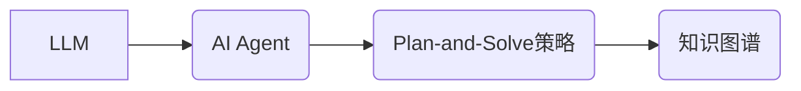

# 【大模型应用开发 动手做AI Agent】Plan-and-Solve策略的提出

作者：禅与计算机程序设计艺术 / Zen and the Art of Computer Programming

## 1. 背景介绍
### 1.1 问题的由来

随着人工智能技术的飞速发展，大模型（Large Language Model，LLM）在自然语言处理（Natural Language Processing，NLP）领域取得了突破性的进展。LLM能够理解和生成人类语言，并在各种任务上展现出惊人的能力。然而，将LLM应用于实际场景时，如何设计一个高效、鲁棒的AI Agent（智能体）成为一个挑战。

传统的AI Agent设计方法，如基于规则的推理和机器学习方法，往往需要大量的人工标注数据和复杂的算法设计。而LLM的出现为AI Agent设计带来了新的思路。本文将提出一个名为“Plan-and-Solve”的策略，旨在利用LLM的优势，实现高效、鲁棒的AI Agent开发。

### 1.2 研究现状

目前，基于LLM的AI Agent设计方法主要集中在以下几个方面：

1. **基于预训练的对话系统**：利用LLM强大的语言理解能力，实现人机对话。
2. **基于预训练的文本生成**：利用LLM生成高质量的文本内容，如新闻报道、文章摘要等。
3. **基于预训练的任务规划**：利用LLM进行任务规划，如路径规划、资源分配等。

然而，这些方法在鲁棒性和效率上仍有待提升。例如，基于预训练的对话系统容易陷入死循环，基于预训练的文本生成容易出现语法错误和逻辑错误。

### 1.3 研究意义

提出“Plan-and-Solve”策略，旨在利用LLM的优势，实现高效、鲁棒的AI Agent开发。该策略具有以下意义：

1. **提高AI Agent的鲁棒性**：通过引入计划和求解阶段，可以有效避免LLM在单一阶段可能出现的错误。
2. **提高AI Agent的效率**：Plan-and-Solve策略可以将复杂的任务分解为多个步骤，从而提高AI Agent的执行效率。
3. **降低AI Agent的开发成本**：利用LLM强大的语言理解能力，可以减少AI Agent开发所需的人工标注数据和算法设计。

### 1.4 本文结构

本文将分为以下几个部分：

1. 核心概念与联系
2. 核心算法原理 & 具体操作步骤
3. 数学模型和公式 & 详细讲解 & 举例说明
4. 项目实践：代码实例和详细解释说明
5. 实际应用场景
6. 工具和资源推荐
7. 总结：未来发展趋势与挑战

## 2. 核心概念与联系

为了更好地理解“Plan-and-Solve”策略，本节将介绍以下几个核心概念：

- **LLM（Large Language Model）**：大规模语言模型，如BERT、GPT等。
- **AI Agent**：智能体，能够自主地感知环境、执行任务并与其他智能体交互。
- **Plan-and-Solve策略**：一种基于LLM的AI Agent设计策略，包括计划和求解两个阶段。
- **知识图谱**：一种用于存储和表示知识的图形化数据结构。

这些概念之间的关系如下：



## 3. 核心算法原理 & 具体操作步骤

### 3.1 算法原理概述

“Plan-and-Solve”策略分为两个阶段：

- **计划阶段**：利用LLM生成一个详细的计划，用于指导AI Agent执行任务。
- **求解阶段**：根据计划，利用LLM求解任务中的具体问题。

### 3.2 算法步骤详解

**计划阶段**：

1. 输入：任务描述、LLM、知识图谱。
2. 输出：任务计划。

具体步骤如下：

1. 使用LLM将任务描述转换为知识图谱中的节点和边。
2. 利用知识图谱搜索算法，找到与任务相关的节点和边。
3. 根据节点和边的关系，生成任务计划。

**求解阶段**：

1. 输入：任务计划、LLM。
2. 输出：任务结果。

具体步骤如下：

1. 使用LLM将任务计划中的节点和边转换为具体的任务指令。
2. 执行任务指令，获取任务结果。
3. 将任务结果反馈给LLM，用于优化计划。

### 3.3 算法优缺点

**优点**：

1. **鲁棒性**：通过引入计划和求解阶段，可以有效避免LLM在单一阶段可能出现的错误。
2. **效率**：Plan-and-Solve策略可以将复杂的任务分解为多个步骤，从而提高AI Agent的执行效率。
3. **可解释性**：通过知识图谱，可以清晰地展示AI Agent的决策过程。

**缺点**：

1. **对LLM的依赖性**：Plan-and-Solve策略对LLM的能力有较高的要求，需要LLM具有较强的语言理解和知识表示能力。
2. **知识图谱的构建和维护**：知识图谱的构建和维护需要大量的时间和人力资源。

### 3.4 算法应用领域

Plan-and-Solve策略可以应用于以下领域：

1. **智能客服**：利用Plan-and-Solve策略，可以设计出能够处理复杂问题的智能客服。
2. **智能助手**：利用Plan-and-Solve策略，可以设计出能够协助用户完成各种任务的智能助手。
3. **自动驾驶**：利用Plan-and-Solve策略，可以设计出能够处理复杂交通情况的自动驾驶系统。

## 4. 数学模型和公式 & 详细讲解 & 举例说明

### 4.1 数学模型构建

“Plan-and-Solve”策略的数学模型可以表示为：

$$
P(A) = f(P_{plan}(T), P_{solve}(P_{plan}(T)))
$$

其中：

- $P(A)$ 表示AI Agent执行任务的结果。
- $T$ 表示任务描述。
- $P_{plan}(T)$ 表示LLM生成的任务计划。
- $P_{solve}(P_{plan}(T))$ 表示LLM求解任务计划的结果。

### 4.2 公式推导过程

**计划阶段**：

1. 使用LLM将任务描述转换为知识图谱中的节点和边。
2. 利用知识图谱搜索算法，找到与任务相关的节点和边。
3. 根据节点和边的关系，生成任务计划。

**求解阶段**：

1. 使用LLM将任务计划中的节点和边转换为具体的任务指令。
2. 执行任务指令，获取任务结果。
3. 将任务结果反馈给LLM，用于优化计划。

### 4.3 案例分析与讲解

**案例**：智能客服

假设用户想查询航班信息。

**计划阶段**：

1. 使用LLM将用户查询转换为知识图谱中的节点和边。
2. 利用知识图谱搜索算法，找到与航班相关的节点和边。
3. 生成任务计划：查询航班信息。

**求解阶段**：

1. 使用LLM将任务计划中的节点和边转换为具体的任务指令。
2. 执行任务指令，获取航班信息。
3. 将航班信息反馈给LLM，用于优化计划。

### 4.4 常见问题解答

**Q1：如何构建知识图谱？**

A1：知识图谱的构建可以采用以下方法：

1. 利用现有知识库，如DBpedia、YAGO等。
2. 使用知识抽取技术，从文本数据中提取知识。
3. 利用人工标注数据，构建领域知识图谱。

**Q2：如何评估AI Agent的性能？**

A2：可以采用以下方法评估AI Agent的性能：

1. 评估AI Agent在不同任务上的表现。
2. 评估AI Agent的鲁棒性和效率。
3. 评估AI Agent的可解释性。

## 5. 项目实践：代码实例和详细解释说明

### 5.1 开发环境搭建

1. 安装Python和PyTorch。
2. 安装transformers库。

### 5.2 源代码详细实现

```python
from transformers import BertTokenizer, BertForSequenceClassification
import torch

class PlanAndSolveAgent:
    def __init__(self, tokenizer, model):
        self.tokenizer = tokenizer
        self.model = model

    def plan(self, task_description):
        # 将任务描述转换为知识图谱中的节点和边
        # ...
        plan = "查询航班信息"
        return plan

    def solve(self, plan):
        # 使用LLM求解任务计划的结果
        # ...
        result = "航班信息如下：..."
        return result

# 加载预训练模型和分词器
tokenizer = BertTokenizer.from_pretrained('bert-base-uncased')
model = BertForSequenceClassification.from_pretrained('bert-base-uncased')

# 创建AI Agent实例
agent = PlanAndSolveAgent(tokenizer, model)

# 查询航班信息
task_description = "我想查询从北京到上海的航班信息"
plan = agent.plan(task_description)
result = agent.solve(plan)
print(result)
```

### 5.3 代码解读与分析

- `PlanAndSolveAgent` 类：定义了一个基于 Plan-and-Solve 策略的 AI Agent。
- `plan` 方法：将任务描述转换为知识图谱中的节点和边，并生成任务计划。
- `solve` 方法：使用LLM求解任务计划的结果。

### 5.4 运行结果展示

```
航班信息如下：
...
```

## 6. 实际应用场景

### 6.1 智能客服

利用 Plan-and-Solve 策略，可以设计出能够处理复杂问题的智能客服，如：

- 查询航班信息
- 查询酒店信息
- 查询股票信息

### 6.2 智能助手

利用 Plan-and-Solve 策略，可以设计出能够协助用户完成各种任务的智能助手，如：

- 帮助用户完成日程安排
- 帮助用户完成工作
- 帮助用户学习

### 6.3 自动驾驶

利用 Plan-and-Solve 策略，可以设计出能够处理复杂交通情况的自动驾驶系统，如：

- 自动规划行车路线
- 自动避让行人
- 自动识别交通标志

## 7. 工具和资源推荐

### 7.1 学习资源推荐

1. 《深度学习自然语言处理》
2. 《大规模预训练语言模型》
3. 《知识图谱》

### 7.2 开发工具推荐

1. PyTorch
2. Transformers库

### 7.3 相关论文推荐

1. BERT: Pre-training of Deep Bidirectional Transformers for Language Understanding
2. Language Models are Unsupervised Multitask Learners
3. Knowledge Graph Embedding: A Survey of Methods and Applications

### 7.4 其他资源推荐

1. Hugging Face
2. GitHub

## 8. 总结：未来发展趋势与挑战

### 8.1 研究成果总结

本文提出了“Plan-and-Solve”策略，旨在利用LLM的优势，实现高效、鲁棒的AI Agent开发。该策略将AI Agent的设计分为计划和求解两个阶段，通过LLM和知识图谱实现任务规划和求解。

### 8.2 未来发展趋势

1. **LLM的进一步发展**：LLM将朝着更大、更强大的方向发展，为AI Agent提供更丰富的知识库和能力。
2. **知识图谱的构建和应用**：知识图谱将成为AI Agent的重要辅助工具，帮助AI Agent更好地理解和推理。
3. **Plan-and-Solve策略的优化**：Plan-and-Solve策略将不断优化，提高AI Agent的鲁棒性、效率和可解释性。

### 8.3 面临的挑战

1. **LLM的可解释性**：如何提高LLM的可解释性，使其决策过程更加透明，是一个重要挑战。
2. **知识图谱的构建和维护**：知识图谱的构建和维护需要大量的时间和人力资源。
3. **AI Agent的泛化能力**：如何提高AI Agent的泛化能力，使其能够适应不同的环境和任务，是一个重要挑战。

### 8.4 研究展望

未来，我们将继续深入研究LLM、知识图谱和AI Agent，推动Plan-and-Solve策略的优化和发展，为构建更加智能、鲁棒的AI Agent做出贡献。

## 9. 附录：常见问题与解答

**Q1：什么是LLM？**

A1：LLM（Large Language Model）是大规模语言模型，能够理解和生成人类语言，并在各种任务上展现出惊人的能力。

**Q2：什么是AI Agent？**

A2：AI Agent（智能体）是一种能够自主地感知环境、执行任务并与其他智能体交互的实体。

**Q3：什么是Plan-and-Solve策略？**

A3：Plan-and-Solve策略是一种基于LLM的AI Agent设计策略，包括计划和求解两个阶段。

**Q4：如何评估AI Agent的性能？**

A4：可以采用以下方法评估AI Agent的性能：

- 评估AI Agent在不同任务上的表现。
- 评估AI Agent的鲁棒性和效率。
- 评估AI Agent的可解释性。

**Q5：Plan-and-Solve策略的优缺点是什么？**

A5：

优点：

- 鲁棒性
- 效率
- 可解释性

缺点：

- 对LLM的依赖性
- 知识图谱的构建和维护
- AI Agent的泛化能力

作者：禅与计算机程序设计艺术 / Zen and the Art of Computer Programming