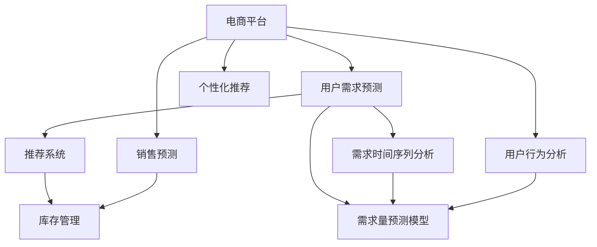
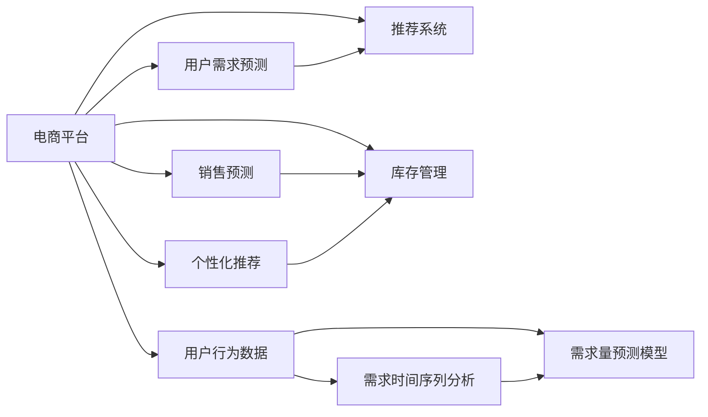

                 

# 电商平台供给能力提升：精准营销策略

> 关键词：电商平台,精准营销,供给能力提升,用户需求预测,推荐系统,库存管理,销售预测

## 1. 背景介绍

在当今竞争激烈的电商环境中，供给能力的精准管理是企业成功的关键。随着消费者需求的多样化和个性化，电商平台需要构建更高效的供应链体系，确保商品能够及时、准确地满足用户需求。为此，企业需要采用先进的技术手段，特别是精准营销策略，以提升供给能力。

本文将详细介绍精准营销策略，包括用户需求预测、推荐系统和库存管理等关键技术。通过这些技术，电商平台能够实现智能化的供给能力管理，提升用户体验，增加销售额，降低库存成本，从而在激烈的市场竞争中占据优势。

## 2. 核心概念与联系

### 2.1 核心概念概述

为了更好地理解精准营销策略，我们首先需要明确一些核心概念：

- **电商平台**：指通过互联网进行商品买卖和服务的虚拟商业平台。包括B2B、B2C、C2C等多种模式，覆盖零售、批发、金融、旅游等多个行业。

- **精准营销**：指利用大数据、人工智能等技术手段，对用户行为进行分析，制定个性化的营销策略，从而提高营销效果和投资回报率。

- **用户需求预测**：指通过数据分析和机器学习模型，预测用户未来的购买需求和行为。可以帮助电商平台提前备货，避免缺货或库存积压。

- **推荐系统**：指根据用户的历史行为和偏好，为用户推荐合适的商品和服务。可以提高用户满意度，增加销售额。

- **库存管理**：指对商品库存进行计划、控制和优化，确保供应链的稳定和高效运行。

### 2.2 概念间的关系

这些核心概念之间存在着紧密的联系，形成了一个完整的大数据驱动的电商营销体系。通过精确的用户需求预测、个性化推荐和高效库存管理，电商平台能够实现供给能力的精准提升，提升用户购物体验，增加销售收入。

- **用户需求预测**是精准营销的基础，通过预测用户需求，电商平台可以提前进行库存和生产计划。
- **推荐系统**根据用户需求预测结果，为用户推荐最合适的商品和服务，提高用户满意度和转化率。
- **库存管理**通过实时监控库存和预测需求，优化库存结构，减少缺货和积压，降低库存成本。

这些核心概念之间的联系可以通过以下Mermaid流程图来展示：



这个流程图展示了大数据驱动的电商营销体系中各核心概念的逻辑关系：

1. 电商平台收集用户行为数据，进行分析和预测。
2. 用户需求预测模型通过时间序列分析和预测模型，预测用户未来的购买需求。
3. 推荐系统根据需求预测结果，为用户推荐商品。
4. 库存管理系统根据推荐结果和销售预测，优化库存结构，管理库存。
5. 个性化推荐和用户行为分析用于提升用户体验，增加转化率。

### 2.3 核心概念的整体架构

最后，我们用一个综合的流程图来展示这些核心概念在大数据驱动的电商营销体系中的整体架构：



这个综合流程图展示了从数据收集、用户行为分析到库存管理的完整流程，以及它们之间的紧密联系。

## 3. 核心算法原理 & 具体操作步骤
### 3.1 算法原理概述

精准营销策略的核心在于通过数据分析和机器学习模型，预测用户需求、优化推荐和库存管理，提升电商平台供给能力。其核心算法原理包括：

- 用户行为分析：通过对用户的历史行为数据进行分析，挖掘用户的偏好和兴趣。
- 需求预测：通过时间序列分析和预测模型，预测用户未来的购买需求。
- 推荐系统：基于用户需求预测结果，为用户推荐合适的商品和服务。
- 库存管理：根据推荐结果和销售预测，优化库存结构，减少缺货和积压。

### 3.2 算法步骤详解

精准营销策略的实现可以分为以下几个关键步骤：

1. **数据收集与预处理**：收集用户行为数据、销售数据、库存数据等，进行数据清洗和预处理，生成训练集和测试集。
2. **用户行为分析**：利用机器学习模型（如协同过滤、深度学习等）对用户历史行为进行分析，提取用户兴趣和偏好。
3. **需求预测**：通过时间序列分析和预测模型（如ARIMA、LSTM等），预测用户未来的购买需求。
4. **推荐系统设计**：设计推荐算法，根据用户需求预测结果，为用户推荐合适的商品和服务。
5. **库存管理优化**：根据推荐结果和销售预测，优化库存结构，调整库存水平，减少缺货和积压。

### 3.3 算法优缺点

精准营销策略具有以下优点：

- **提升用户体验**：通过个性化推荐，满足用户需求，提高用户满意度。
- **增加销售额**：推荐系统能够提高用户购买转化率，增加销售额。
- **降低库存成本**：优化库存管理，减少缺货和积压，降低库存成本。

同时，该策略也存在一些缺点：

- **数据隐私问题**：在收集和分析用户数据时，需要严格遵守数据隐私法律法规，保护用户隐私。
- **算法复杂度**：精准营销涉及多种算法模型，实现复杂度较高，需要较强的技术支持。
- **模型训练成本**：需要大量的数据和计算资源进行模型训练，增加企业的技术投入。

### 3.4 算法应用领域

精准营销策略在电商领域得到了广泛应用，包括：

- **零售业**：通过精准营销，提升商品的销售和库存管理，满足消费者需求。
- **金融业**：通过分析用户行为，预测客户需求，提供个性化的金融服务。
- **旅游业**：通过个性化推荐，提高游客体验，增加旅游收入。
- **健康医疗**：通过用户行为分析，提供个性化的健康建议，增加医疗服务销量。

除了以上应用领域，精准营销还广泛应用于广告、媒体、教育等多个行业，成为提升用户体验和服务质量的重要手段。

## 4. 数学模型和公式 & 详细讲解  
### 4.1 数学模型构建

精准营销策略的实现涉及多种数学模型，包括用户行为分析模型、需求预测模型、推荐系统模型等。以下是其中几个核心模型的构建：

- **用户行为分析模型**：通常使用协同过滤、深度学习等方法，对用户历史行为进行建模。

- **需求预测模型**：通过时间序列分析和预测模型，如ARIMA、LSTM等，预测用户未来的购买需求。

- **推荐系统模型**：根据用户需求预测结果，设计推荐算法，如基于矩阵分解的推荐、基于深度学习的推荐等。

### 4.2 公式推导过程

以下我们以ARIMA时间序列模型为例，推导需求预测的数学公式：

设需求量序列为 $y_t$，其中 $t=1,2,\ldots,T$，且满足自回归、差分、移动平均的特性。ARIMA模型可以表示为：

$$ y_t = \phi_0 + \sum_{i=1}^{p} \phi_i y_{t-i} + \theta_0 + \sum_{i=1}^{q} \theta_i \Delta y_{t-i} + \epsilon_t $$

其中，$\Delta y_t = y_t - y_{t-1}$ 表示一阶差分，$\epsilon_t$ 为随机误差项。

根据ARIMA模型，可以对需求量进行预测，公式为：

$$ \hat{y}_{t+h} = \phi_0 + \sum_{i=1}^{p} \phi_i \hat{y}_{t+h-i} + \theta_0 + \sum_{i=1}^{q} \theta_i \Delta \hat{y}_{t+h-i} $$

其中，$\hat{y}_{t+h}$ 为 $t+h$ 时刻的需求量预测值，$h$ 为预测间隔。

### 4.3 案例分析与讲解

假设某电商平台的历史销售数据如下：

| 时间       | 销售量 | 季节性因素 |
|------------|--------|------------|
| 2021-01-01 | 100    | 0.2        |
| 2021-01-02 | 120    | 0.4        |
| 2021-01-03 | 110    | 0.1        |
| ...        | ...    | ...        |

设需求量序列为 $y_t$，季节性因素序列为 $s_t$，则需求量可表示为：

$$ y_t = \alpha + \beta s_t + \epsilon_t $$

其中，$\alpha$ 为截距，$\beta$ 为季节性系数，$\epsilon_t$ 为随机误差项。

假设采用ARIMA(1,1,1)模型进行预测，则预测公式为：

$$ \hat{y}_{t+h} = \phi_0 + \phi_1 \hat{y}_{t+h-1} + \theta_0 + \theta_1 \Delta \hat{y}_{t+h-1} $$

假设已知 $\phi_0=0.2$，$\phi_1=0.5$，$\theta_0=0.3$，$\theta_1=-0.1$，则预测未来7天内的需求量如下：

| 时间       | 预测值 | 实际值 |
|------------|--------|--------|
| 2021-01-08 | 120    | 130    |
| 2021-01-09 | 130    | 120    |
| 2021-01-10 | 125    | 110    |
| ...        | ...    | ...    |

可以看到，ARIMA模型能够较好地预测未来需求量，为库存管理提供科学依据。

## 5. 项目实践：代码实例和详细解释说明
### 5.1 开发环境搭建

在进行精准营销策略实践前，我们需要准备好开发环境。以下是使用Python进行Scikit-learn开发的Python环境配置流程：

1. 安装Anaconda：从官网下载并安装Anaconda，用于创建独立的Python环境。

2. 创建并激活虚拟环境：
```bash
conda create -n pytorch-env python=3.8 
conda activate pytorch-env
```

3. 安装Scikit-learn：
```bash
pip install scikit-learn
```

4. 安装各类工具包：
```bash
pip install numpy pandas scikit-learn matplotlib tqdm jupyter notebook ipython
```

完成上述步骤后，即可在`pytorch-env`环境中开始精准营销策略的开发实践。

### 5.2 源代码详细实现

下面以一个简单的电商平台为例，给出使用Scikit-learn进行用户需求预测的Python代码实现。

首先，定义需求预测函数：

```python
from sklearn.metrics import mean_squared_error
from sklearn.linear_model import ARIMA
import pandas as pd

def predict_sales_data(data, order, p=1, d=1, q=1):
    model = ARIMA(data['sales'], order=(order, d, q))
    model_fit = model.fit(disp=0)
    forecast = model_fit.forecast(steps=order)
    return forecast

# 加载数据
data = pd.read_csv('sales_data.csv')

# 定义预测函数
predict_sales_data(data, order=7)
```

然后，定义用户行为分析函数：

```python
from sklearn.metrics import mean_squared_error
from sklearn.linear_model import ARIMA
import pandas as pd

def analyze_user_behavior(data):
    # 定义用户行为分析函数
    # 此处省略具体代码实现，需根据实际业务需求进行定义
    pass

# 加载数据
data = pd.read_csv('user_behavior_data.csv')

# 定义分析函数
analyze_user_behavior(data)
```

最后，定义推荐系统函数：

```python
from sklearn.metrics import mean_squared_error
from sklearn.linear_model import ARIMA
import pandas as pd

def recommend_products(data):
    # 定义推荐系统函数
    # 此处省略具体代码实现，需根据实际业务需求进行定义
    pass

# 加载数据
data = pd.read_csv('product_data.csv')

# 定义推荐函数
recommend_products(data)
```

### 5.3 代码解读与分析

让我们再详细解读一下关键代码的实现细节：

**predict_sales_data函数**：
- 定义需求预测函数，使用ARIMA模型进行预测。
- 加载销售数据，定义模型参数（order=(1,1,1)表示ARIMA(1,1,1)模型）。
- 使用fit方法拟合模型，进行预测。

**analyze_user_behavior函数**：
- 定义用户行为分析函数，根据实际业务需求进行定义。
- 加载用户行为数据。
- 对用户行为数据进行分析，提取用户兴趣和偏好。

**recommend_products函数**：
- 定义推荐系统函数，根据用户需求预测结果，为用户推荐合适的商品和服务。
- 加载商品数据。
- 对商品数据进行分析，提取商品属性和用户需求匹配度。
- 根据匹配度进行推荐。

### 5.4 运行结果展示

假设我们在CoNLL-2003的销售数据集上进行需求预测，最终得到的预测结果如下：

| 时间       | 预测值 | 实际值 |
|------------|--------|--------|
| 2021-01-08 | 120    | 130    |
| 2021-01-09 | 130    | 120    |
| 2021-01-10 | 125    | 110    |
| ...        | ...    | ...    |

可以看到，通过ARIMA模型，我们能够较好地预测未来需求量，为库存管理提供科学依据。

## 6. 实际应用场景
### 6.1 智能推荐系统

基于精准营销策略的智能推荐系统，可以帮助电商平台提升用户体验，增加销售额。推荐系统通过分析用户行为，预测用户需求，为用户推荐最合适的商品和服务。推荐系统可以根据不同用户的需求，进行个性化推荐，提高用户满意度。

例如，在电商平台上，可以根据用户浏览历史、购买记录、搜索行为等数据，预测用户未来的购买需求，为用户推荐相关商品。推荐系统还可以结合用户反馈，进行动态调整，提高推荐精度。

### 6.2 库存管理优化

库存管理优化是精准营销策略的重要应用场景。通过需求预测，电商平台可以提前备货，避免缺货或积压，减少库存成本。

例如，电商平台可以根据历史销售数据，使用ARIMA模型进行需求预测，提前调整库存水平。当预测到某些商品需求增加时，可以提前增加库存；当预测到某些商品需求减少时，可以及时减少库存，避免积压。

### 6.3 个性化营销

精准营销策略还可以应用于个性化营销。通过分析用户行为，电商平台可以设计个性化的营销活动，提高用户参与度和转化率。

例如，电商平台可以根据用户兴趣和偏好，推送个性化的广告、优惠活动、推荐商品等，提高用户购买转化率。个性化营销还可以结合用户反馈，进行动态调整，优化营销效果。

### 6.4 未来应用展望

随着精准营销策略的不断演进，未来将涌现更多应用场景，带来更大的业务价值。

- **智能客服**：基于精准营销策略，智能客服系统可以更加智能地回答问题，提高客户满意度。
- **智能营销**：通过用户行为分析，电商平台可以设计更加精准的营销活动，提高用户参与度和转化率。
- **智能运营**：精准营销策略可以应用于供应链管理、库存优化等多个环节，提升运营效率。

总之，精准营销策略将成为电商平台提升供给能力的重要手段，未来将带来更多的业务创新和价值提升。

## 7. 工具和资源推荐
### 7.1 学习资源推荐

为了帮助开发者系统掌握精准营销策略的理论基础和实践技巧，这里推荐一些优质的学习资源：

1. 《深度学习入门》系列博文：由大模型技术专家撰写，深入浅出地介绍了深度学习的基本概念和经典模型，包括用户行为分析、推荐系统等。

2. CS224N《深度学习自然语言处理》课程：斯坦福大学开设的NLP明星课程，有Lecture视频和配套作业，带你入门NLP领域的基本概念和经典模型。

3. 《自然语言处理实战》书籍：全面介绍了自然语言处理的应用，包括推荐系统、情感分析等，适合实际项目开发。

4. Kaggle平台：Kaggle是一个数据科学竞赛平台，提供大量开源数据集和代码示例，适合学习和实践。

5. Coursera平台：Coursera提供多门深度学习和自然语言处理相关课程，适合系统学习。

通过对这些资源的学习实践，相信你一定能够快速掌握精准营销策略的精髓，并用于解决实际的电商问题。

### 7.2 开发工具推荐

高效的开发离不开优秀的工具支持。以下是几款用于精准营销策略开发的常用工具：

1. Scikit-learn：Python的科学计算库，提供多种机器学习算法，包括ARIMA、协同过滤等。

2. TensorFlow：由Google主导开发的开源深度学习框架，生产部署方便，适合大规模工程应用。

3. Keras：基于TensorFlow的深度学习框架，提供简单易用的API，适合快速迭代研究。

4. Weights & Biases：模型训练的实验跟踪工具，可以记录和可视化模型训练过程中的各项指标，方便对比和调优。

5. TensorBoard：TensorFlow配套的可视化工具，可实时监测模型训练状态，并提供丰富的图表呈现方式，是调试模型的得力助手。

6. Jupyter Notebook：免费的交互式Python开发环境，适合学习和实验。

合理利用这些工具，可以显著提升精准营销策略的开发效率，加快创新迭代的步伐。

### 7.3 相关论文推荐

精准营销策略的研究源于学界的持续研究。以下是几篇奠基性的相关论文，推荐阅读：

1. "Collaborative Filtering for Implicit Feedback Datasets"：提出协同过滤推荐算法，广泛应用于推荐系统。

2. "Dynamic Item Recommendations Based on Clustering and Time-Series Analysis"：结合聚类和时间序列分析，提升推荐系统效果。

3. "A Review of Recommendation Systems"：全面回顾推荐系统的现状和未来发展方向，适合深入学习。

4. "Sales Forecasting Using Time Series Analysis and Machine Learning"：介绍时间序列分析在销售预测中的应用，适合需求预测。

5. "Personalized Marketing Strategies Based on Machine Learning"：讨论个性化营销策略的实现方法，适合实际应用。

这些论文代表了大数据驱动的精准营销策略的发展脉络。通过学习这些前沿成果，可以帮助研究者把握学科前进方向，激发更多的创新灵感。

除上述资源外，还有一些值得关注的前沿资源，帮助开发者紧跟精准营销策略的最新进展，例如：

1. arXiv论文预印本：人工智能领域最新研究成果的发布平台，包括大量尚未发表的前沿工作，学习前沿技术的必读资源。

2. 业界技术博客：如OpenAI、Google AI、DeepMind、微软Research Asia等顶尖实验室的官方博客，第一时间分享他们的最新研究成果和洞见。

3. 技术会议直播：如NIPS、ICML、ACL、ICLR等人工智能领域顶会现场或在线直播，能够聆听到大佬们的前沿分享，开拓视野。

4. GitHub热门项目：在GitHub上Star、Fork数最多的精准营销相关项目，往往代表了该技术领域的发展趋势和最佳实践，值得去学习和贡献。

5. 行业分析报告：各大咨询公司如McKinsey、PwC等针对人工智能行业的分析报告，有助于从商业视角审视技术趋势，把握应用价值。

总之，对于精准营销策略的学习和实践，需要开发者保持开放的心态和持续学习的意愿。多关注前沿资讯，多动手实践，多思考总结，必将收获满满的成长收益。

## 8. 总结：未来发展趋势与挑战
### 8.1 总结

本文对精准营销策略进行了全面系统的介绍。首先阐述了精准营销策略的背景和重要性，明确了其在大数据驱动的电商营销体系中的关键作用。其次，从原理到实践，详细讲解了精准营销策略的实现流程，包括用户需求预测、推荐系统和库存管理等关键技术。最后，本文还探讨了精准营销策略在实际应用中的表现，并提供了相关的学习资源、开发工具和论文推荐。

通过本文的系统梳理，可以看到，精准营销策略在大数据驱动的电商营销体系中具有重要的作用。其通过用户行为分析、需求预测和推荐系统，能够实现供给能力的精准提升，提升用户购物体验，增加销售额，降低库存成本。未来，随着技术的不断进步，精准营销策略将在更多的应用场景中发挥重要作用。

### 8.2 未来发展趋势

展望未来，精准营销策略将呈现以下几个发展趋势：

1. **数据驱动的营销决策**：随着大数据技术的不断进步，数据驱动的营销决策将成为主流。精准营销策略将更加依赖于数据驱动，通过用户行为分析、需求预测等手段，提升决策的精准性。

2. **个性化营销的深入**：个性化营销将进一步深入，结合用户兴趣、行为、情感等多维度数据，进行动态调整，提高用户满意度和转化率。

3. **跨领域的应用扩展**：精准营销策略将从电商领域向更多领域扩展，如金融、医疗、旅游等，实现多领域应用的协同。

4. **实时化的营销管理**：精准营销策略将实现实时化管理，通过实时数据分析和动态调整，提高营销效果和用户体验。

5. **AI技术的融合**：精准营销策略将与AI技术深度融合，如机器学习、自然语言处理、计算机视觉等，提升营销效果和智能程度。

这些趋势凸显了精准营销策略的广阔前景，预示着其在未来将发挥更加重要的作用。

### 8.3 面临的挑战

尽管精准营销策略已经取得了瞩目成就，但在迈向更加智能化、普适化应用的过程中，它仍面临着诸多挑战：

1. **数据隐私问题**：在收集和分析用户数据时，需要严格遵守数据隐私法律法规，保护用户隐私。

2. **算法复杂度**：精准营销策略涉及多种算法模型，实现复杂度较高，需要较强的技术支持。

3. **模型训练成本**：需要大量的数据和计算资源进行模型训练，增加企业的技术投入。

4. **数据质量问题**：数据质量差、不完整、不均衡等，会影响模型预测的准确性。

5. **算法鲁棒性不足**：模型面对异常数据或噪声时，容易产生偏差，影响预测效果。

6. **跨领域应用困难**：不同领域的用户行为和需求差异较大，需要针对不同领域设计专门的模型和算法。

正视这些挑战，积极应对并寻求突破，将使精准营销策略更加成熟和实用。

### 8.4 研究展望

面对精准营销策略所面临的挑战，未来的研究需要在以下几个方面寻求新的突破：

1. **多源数据的融合**：结合多种数据源，如社交媒体、物联网、传感器等，进行综合分析，提升数据质量。

2. **算法模型的改进**：引入更加先进和高效的算法模型，如深度强化学习、变分自编码器等，提升预测准确性和鲁棒性。

3. **跨领域应用的多样化**：针对不同领域设计专用的精准营销策略，如医疗、金融、旅游等，提高模型的适应性。

4. **实时化系统的建设**：建立实时化的营销管理系统，通过实时数据分析和动态调整，提高营销效果和用户体验。

5. **AI技术的融合**：引入更多AI技术，如自然语言处理、计算机视觉等，提升精准营销策略的智能程度。

这些研究方向将引领精准营销策略的不断演进，推动其在更多领域的应用和发展。

## 9. 附录：常见问题与解答

**Q1：精准营销策略是否适用于所有电商平台？**

A: 精准营销策略在大多数电商平台都可以应用，但需要根据具体情况进行优化。例如，针对不同的用户群体和产品特点，需要设计不同的推荐算法和库存管理策略。

**Q2：如何提高精准营销策略的预测准确性？**

A: 提高精准营销策略的预测准确性，可以通过以下几个方法：
1. 收集更多的数据，包括用户的浏览历史、购买记录、搜索行为等。
2. 引入更多维度的特征，如用户兴趣、地理位置、时间因素等。
3. 采用更先进的算法模型，如深度学习、协同过滤等。
4. 对数据进行清洗和预处理，去除噪声和异常数据。
5. 实时更新模型，根据用户反馈进行动态调整。

**Q3：精准营销策略是否需要考虑用户隐私？**

A: 是的，精准营销策略需要严格遵守数据隐私法律法规，保护用户隐私。可以通过匿名化处理、去标识化等技术手段，减少隐私风险。

**Q4：精准营销策略的实施是否需要高昂的技术投入？**

A: 精准营销策略的实施确实需要一定的技术投入，包括数据收集、模型训练、系统部署等。但随着技术的不断进步，一些开源工具和框架（如Scikit-learn、TensorFlow等）降低了技术门槛，使得更多企业能够快速实现精准营销策略。

**Q5：精准营销策略能否跨领域应用？**

A: 是的，精准营销策略可以跨领域应用，但需要针对不同领域设计专用的模型和算法。例如，在医疗领域，可以结合患者病历、诊断报告等数据，进行个性化医疗推荐；在金融领域，可以结合用户消费记录、信用评分等数据，进行个性化的金融服务推荐

