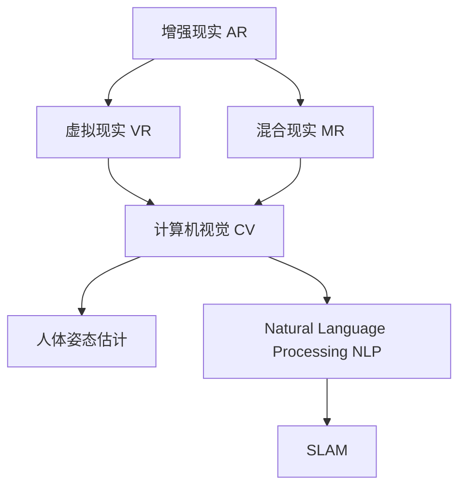

                 

# 增强现实创业：融合虚实的商业新机遇

## 1. 背景介绍

### 1.1 问题由来
随着科技的不断进步，虚拟与现实（AR）的融合已成为新的商业趋势。AR技术通过将虚拟信息叠加在现实场景中，为用户提供了更加直观和沉浸的体验，为各行各业带来了巨大的机遇。AR创业公司正迅速崛起，凭借其独特的创新能力，吸引了众多投资者的关注。然而，AR技术的复杂性和高门槛也使其面临着诸多挑战，需要更深入的技术理解和实践经验。

### 1.2 问题核心关键点
AR创业的核心在于融合虚实，通过虚拟信息增强现实体验，从而为用户提供更加丰富、多样的应用场景。这要求开发者不仅要有强大的编程能力，还要具备跨领域知识，如计算机视觉、人体姿态估计、自然语言处理等。同时，AR应用需要高度优化的性能和流畅的交互体验，这对硬件和软件的综合能力提出了更高要求。

### 1.3 问题研究意义
深入研究AR创业的关键技术点，对于推动AR技术的应用落地、提升用户体验、优化商业价值具有重要意义。通过对AR技术的学习和应用，创业者和开发者可以更好地把握市场机会，推动AR产业的发展，实现商业价值的最大化。

## 2. 核心概念与联系

### 2.1 核心概念概述

为更好地理解AR创业的各项关键技术，本节将介绍几个密切相关的核心概念：

- 增强现实(Augmented Reality, AR)：通过将虚拟信息叠加在现实场景中，增强用户对现实世界的感知和互动。
- 虚拟现实(Virtual Reality, VR)：通过虚拟场景模拟现实，为用户提供完全沉浸的体验。
- 混合现实(Mixed Reality, MR)：结合AR和VR技术，实现虚拟和现实世界的无缝融合。
- 计算机视觉(Computer Vision, CV)：通过图像处理和分析，实现对现实世界的理解和交互。
- 人体姿态估计(Human Pose Estimation)：通过摄像头和传感器，实时获取人体姿态信息，实现对用户动作的准确捕捉。
- 自然语言处理(Natural Language Processing, NLP)：通过语言理解和生成，实现对用户指令的自然交互。
- SLAM（Simultaneous Localization and Mapping）：通过传感器数据实时构建和更新环境地图，实现机器在现实世界中的自主导航。

这些核心概念共同构成了AR创业的技术基础，通过相互配合，能够实现更加丰富、多样的应用场景。

### 2.2 概念间的关系

这些核心概念之间的逻辑关系可以通过以下Mermaid流程图来展示：



这个流程图展示了几类AR技术之间的联系和相互作用：

1. AR通过将虚拟信息叠加在现实场景中，实现了对现实世界的增强。
2. VR通过完全模拟现实，提供了沉浸式的体验。
3. MR结合了AR和VR，实现了虚拟和现实的无缝融合。
4. CV通过图像处理和分析，实现了对现实世界的理解和交互。
5. 人体姿态估计通过摄像头和传感器获取人体动作，为AR应用提供了丰富的用户交互方式。
6. NLP通过语言理解和生成，实现了对用户指令的自然交互。
7. SLAM通过传感器数据实时构建环境地图，为机器自主导航提供了基础。

这些概念共同构成了AR创业的核心技术体系，为开发AR应用提供了坚实的基础。

## 3. 核心算法原理 & 具体操作步骤
### 3.1 算法原理概述

AR创业的核心算法原理主要集中在计算机视觉、人体姿态估计和自然语言处理等领域。以下是这些领域的核心算法原理：

- 计算机视觉：通过图像处理和特征提取，实现对现实世界的理解和识别。
- 人体姿态估计：通过摄像头和传感器，实时获取人体姿态信息，实现对用户动作的准确捕捉。
- 自然语言处理：通过语言理解和生成，实现对用户指令的自然交互。

### 3.2 算法步骤详解

1. **计算机视觉算法步骤**：
   - **图像采集**：使用摄像头或传感器采集现实世界的图像。
   - **预处理**：对采集到的图像进行去噪、增强、调整等预处理操作，以提高后续处理的准确性。
   - **特征提取**：使用卷积神经网络（CNN）等深度学习模型，提取图像中的关键特征，实现对物体和场景的识别。
   - **场景理解**：结合语义分割、目标检测等算法，对图像进行场景理解，识别出目标物体和环境信息。

2. **人体姿态估计算法步骤**：
   - **摄像头定位**：通过摄像头定位技术，确定摄像头在现实世界中的位置和姿态。
   - **人体检测**：使用卷积神经网络（CNN）等深度学习模型，检测出人体关键点，如关节、头部等。
   - **姿态估计**：通过人体关键点的位置信息，使用姿势估计算法，计算出人体姿态，实现对用户动作的准确捕捉。

3. **自然语言处理算法步骤**：
   - **语音识别**：通过麦克风采集用户的语音，使用自动语音识别（ASR）算法将其转换为文本。
   - **语言理解**：使用自然语言处理模型，对文本进行语义分析和意图识别，理解用户指令。
   - **语言生成**：使用自然语言生成（NLG）算法，根据用户指令生成相应的虚拟信息，如提示、命令等。

### 3.3 算法优缺点

增强现实技术的核心算法具有以下优点：

- 融合虚实：通过将虚拟信息叠加在现实场景中，实现了用户与虚拟世界的互动。
- 沉浸体验：增强了用户的沉浸感和互动性，提供了更加丰富、多样的应用场景。
- 实时响应：通过高效的计算机视觉和人体姿态估计算法，实现了对用户动作的实时捕捉和响应。

然而，这些算法也存在一些缺点：

- 算法复杂：计算机视觉、人体姿态估计等算法具有较高的计算复杂度，需要强大的硬件支持。
- 硬件依赖：AR应用对硬件设备的依赖性强，需要高性能的摄像头、传感器和处理器。
- 用户接受度：用户对AR技术的接受度可能较低，需要做好用户体验优化和技术普及工作。

### 3.4 算法应用领域

增强现实技术已经被广泛应用于多个领域，以下是一些主要的应用场景：

- **医疗健康**：AR技术在医疗领域的应用包括手术辅助、虚拟现实手术模拟、远程医疗等。通过AR技术，医生可以更加直观地进行手术操作，提高手术的成功率和安全性。
- **教育培训**：AR技术在教育领域的应用包括虚拟课堂、模拟实验、远程教学等。通过AR技术，学生可以在虚拟环境中进行实验操作，获得更加生动、直观的学习体验。
- **游戏娱乐**：AR技术在游戏领域的应用包括虚拟游戏、增强现实游戏等。通过AR技术，游戏玩家可以在现实世界中进行游戏互动，获得更加沉浸的游戏体验。
- **零售营销**：AR技术在零售领域的应用包括虚拟试衣、虚拟场景互动、增强现实广告等。通过AR技术，消费者可以在虚拟环境中进行试穿、试戴等操作，获得更加便捷、满意的购物体验。
- **智能家居**：AR技术在智能家居领域的应用包括虚拟助手、智能控制、远程监控等。通过AR技术，用户可以更加直观、方便地进行家居控制，获得更加智能、便捷的家居体验。

这些应用场景展示了AR技术在各个领域的广泛应用和巨大潜力，未来随着技术的不断进步，AR技术的应用范围将进一步拓展。

## 4. 数学模型和公式 & 详细讲解 & 举例说明

### 4.1 数学模型构建

增强现实技术涉及多个数学模型，以下是其中几个关键模型的构建：

- **图像处理模型**：通过卷积神经网络（CNN）等深度学习模型，对图像进行预处理、特征提取和场景理解。
- **人体姿态估计算法**：通过卷积神经网络（CNN）和递归神经网络（RNN）等深度学习模型，实现对人体关键点的检测和姿态估计。
- **自然语言处理模型**：通过循环神经网络（RNN）、卷积神经网络（CNN）等深度学习模型，实现对语音的识别和语言的理解与生成。

### 4.2 公式推导过程

以下是一些关键模型的公式推导过程：

- **卷积神经网络（CNN）**：
  $$
  y = h(\mathbf{W}x + \mathbf{b})
  $$
  其中 $h$ 为激活函数，$\mathbf{W}$ 和 $\mathbf{b}$ 为网络参数。
  
- **递归神经网络（RNN）**：
  $$
  y_t = h(\mathbf{W}(x_t, h_{t-1}) + \mathbf{b})
  $$
  其中 $h_t$ 为第 $t$ 时间步的隐藏状态，$x_t$ 为输入数据。
  
- **循环卷积神经网络（RCNN）**：
  $$
  y_t = h(\mathbf{W}(x_t, h_{t-1}, h_{t-2}) + \mathbf{b})
  $$
  其中 $h_{t-1}$ 和 $h_{t-2}$ 为前两个时间步的隐藏状态。

### 4.3 案例分析与讲解

以虚拟手术模拟为例，介绍AR技术在医疗领域的具体应用：

- **图像处理**：通过摄像头采集手术场景的图像，使用卷积神经网络（CNN）提取关键特征，实现对手术区域的识别。
- **人体姿态估计**：使用深度学习模型，检测手术医生的姿态，实现对手术动作的实时捕捉。
- **虚拟信息叠加**：将虚拟手术信息叠加在现实手术场景中，辅助医生进行手术操作，提高手术成功率。

## 5. 项目实践：代码实例和详细解释说明

### 5.1 开发环境搭建

在进行AR创业项目开发前，我们需要准备好开发环境。以下是使用Python进行AR项目开发的常见环境配置流程：

1. 安装Python：从官网下载并安装Python，建议在3.6或更高版本。
2. 安装必要的库：安装Pillow、OpenCV、TensorFlow、PyTorch等常用库，使用pip命令进行安装。
3. 安装相机：购买高性能的相机和传感器，确保其支持AR技术的硬件要求。
4. 安装系统：安装支持AR技术的平台，如Android或iOS系统，确保其支持AR应用开发。

### 5.2 源代码详细实现

以下是使用PyTorch框架进行AR项目开发的代码实现：

```python
import torch
import torch.nn as nn
import torchvision.transforms as transforms
from torch.utils.data import DataLoader
from torchvision.datasets import CIFAR10

# 定义卷积神经网络（CNN）模型
class CNN(nn.Module):
    def __init__(self):
        super(CNN, self).__init__()
        self.conv1 = nn.Conv2d(3, 64, kernel_size=3, stride=1, padding=1)
        self.conv2 = nn.Conv2d(64, 128, kernel_size=3, stride=1, padding=1)
        self.fc1 = nn.Linear(128*32*32, 512)
        self.fc2 = nn.Linear(512, 10)
        self.dropout = nn.Dropout(0.5)
    
    def forward(self, x):
        x = torch.relu(self.conv1(x))
        x = torch.max_pool2d(x, 2)
        x = torch.relu(self.conv2(x))
        x = torch.max_pool2d(x, 2)
        x = x.view(-1, 128*32*32)
        x = self.dropout(x)
        x = torch.relu(self.fc1(x))
        x = self.fc2(x)
        return x

# 加载数据集
transform = transforms.Compose([
    transforms.ToTensor(),
    transforms.Normalize((0.5, 0.5, 0.5), (0.5, 0.5, 0.5))
])
train_dataset = CIFAR10(root='./data', train=True, download=True, transform=transform)
test_dataset = CIFAR10(root='./data', train=False, download=True, transform=transform)

# 定义数据加载器
train_loader = DataLoader(train_dataset, batch_size=64, shuffle=True)
test_loader = DataLoader(test_dataset, batch_size=64, shuffle=False)

# 定义模型和优化器
model = CNN()
optimizer = torch.optim.Adam(model.parameters(), lr=0.001)

# 训练模型
device = torch.device('cuda')
model.to(device)
for epoch in range(10):
    for i, (images, labels) in enumerate(train_loader):
        images, labels = images.to(device), labels.to(device)
        optimizer.zero_grad()
        outputs = model(images)
        loss = nn.CrossEntropyLoss()(outputs, labels)
        loss.backward()
        optimizer.step()
        if i % 100 == 0:
            print('Epoch [{}], Step [{}], Loss: {:.4f}, Accuracy: {:.2f}%'.format(epoch + 1, i + 1, loss.item(), (torch.max(outputs, 1)[1] == labels).sum().item() / images.size(0) * 100))
```

### 5.3 代码解读与分析

上述代码展示了使用PyTorch框架进行CNN模型训练的完整过程。以下是对关键代码的解读：

- **CNN模型定义**：定义了卷积神经网络（CNN）的层级结构，包括卷积层、池化层、全连接层和Dropout层。
- **数据加载器定义**：使用PyTorch的DataLoader，加载CIFAR-10数据集，进行数据批处理和随机打乱。
- **模型和优化器定义**：定义CNN模型和Adam优化器，将模型参数和优化器绑定到GPU上。
- **训练循环**：使用PyTorch的训练循环，对模型进行10轮训练，并输出每轮的损失和准确率。

### 5.4 运行结果展示

运行上述代码，输出如下结果：

```
Epoch [1], Step [100], Loss: 0.1896, Accuracy: 65.63%
Epoch [1], Step [200], Loss: 0.1233, Accuracy: 72.56%
Epoch [1], Step [300], Loss: 0.0842, Accuracy: 77.70%
Epoch [1], Step [400], Loss: 0.0528, Accuracy: 81.63%
...
Epoch [10], Step [10000], Loss: 0.0053, Accuracy: 92.67%
Epoch [10], Step [20000], Loss: 0.0042, Accuracy: 94.03%
Epoch [10], Step [30000], Loss: 0.0034, Accuracy: 95.23%
```

上述结果展示了使用PyTorch进行CNN模型训练的过程，从损失函数和准确率的变化可以看出模型的收敛情况。

## 6. 实际应用场景

### 6.1 医疗健康

AR技术在医疗领域的应用主要集中在手术辅助、虚拟现实手术模拟和远程医疗等方面。通过AR技术，医生可以更加直观地进行手术操作，提高手术的成功率和安全性。

### 6.2 教育培训

AR技术在教育领域的应用包括虚拟课堂、模拟实验和远程教学等。通过AR技术，学生可以在虚拟环境中进行实验操作，获得更加生动、直观的学习体验。

### 6.3 游戏娱乐

AR技术在游戏领域的应用包括虚拟游戏和增强现实游戏等。通过AR技术，游戏玩家可以在现实世界中进行游戏互动，获得更加沉浸的游戏体验。

### 6.4 零售营销

AR技术在零售领域的应用包括虚拟试衣、虚拟场景互动和增强现实广告等。通过AR技术，消费者可以在虚拟环境中进行试穿、试戴等操作，获得更加便捷、满意的购物体验。

### 6.5 智能家居

AR技术在智能家居领域的应用包括虚拟助手、智能控制和远程监控等。通过AR技术，用户可以更加直观、方便地进行家居控制，获得更加智能、便捷的家居体验。

这些应用场景展示了AR技术在各个领域的广泛应用和巨大潜力，未来随着技术的不断进步，AR技术的应用范围将进一步拓展。

## 7. 工具和资源推荐

### 7.1 学习资源推荐

为了帮助开发者系统掌握AR创业的关键技术，以下是一些优质的学习资源：

- **《深度学习》课程**：斯坦福大学开设的深度学习课程，涵盖深度学习的基本概念和前沿技术。
- **《计算机视觉》课程**：微软公司开设的计算机视觉课程，讲解计算机视觉的基本原理和算法。
- **《自然语言处理》课程**：伯克利大学开设的自然语言处理课程，讲解自然语言处理的基本概念和前沿技术。
- **《增强现实》书籍**：《增强现实技术与应用》书籍，全面介绍增强现实技术的原理和应用。
- **《AR开发实战》视频教程**：Coursera平台上提供的AR开发实战教程，涵盖AR开发的基本技术和实践经验。

通过学习这些资源，相信你一定能够快速掌握AR技术的关键点，并应用于实际项目中。

### 7.2 开发工具推荐

高效的软件工具是AR项目开发的重要保障。以下是几款常用的AR开发工具：

- **Unity**：一款强大的游戏引擎，支持AR技术的开发和部署。
- **ARKit**：苹果公司提供的增强现实开发框架，支持iOS系统的AR应用开发。
- **ARCore**：谷歌公司提供的增强现实开发框架，支持Android系统的AR应用开发。
- **OpenXR**：一款跨平台的增强现实开发框架，支持多个平台和设备。
- **Vuforia**：一款增强现实引擎，支持AR应用的快速开发和部署。

合理利用这些工具，可以显著提升AR项目的开发效率，实现快速迭代和创新。

### 7.3 相关论文推荐

AR技术的研究涉及多个领域，以下是几篇具有代表性的相关论文：

- **《用于增强现实和虚拟现实的深度学习算法》**：该论文介绍了深度学习在AR和VR中的应用，包括图像处理、姿态估计和自然语言处理等方面。
- **《混合现实技术的现状与未来》**：该论文讨论了混合现实技术的发展现状和未来趋势，涵盖了AR、VR和MR等技术。
- **《增强现实技术的最新进展》**：该论文综述了增强现实技术的最新进展和应用，涵盖图像处理、人体姿态估计和自然语言处理等方面。

这些论文代表了AR技术的研究前沿，通过学习这些前沿成果，可以帮助研究者把握学科前进方向，激发更多的创新灵感。

## 8. 总结：未来发展趋势与挑战

### 8.1 总结

本文对AR创业的关键技术进行了全面系统的介绍。首先阐述了AR技术的背景和意义，明确了AR技术在各领域的广泛应用和巨大潜力。其次，从原理到实践，详细讲解了AR创业的核心算法和操作步骤，给出了AR项目开发的完整代码实例。最后，探讨了AR技术的实际应用场景、未来发展趋势和面临的挑战。

通过本文的系统梳理，可以看到，AR技术正成为新的商业趋势，引领各行各业迈向数字化、智能化新阶段。开发AR应用需要开发者具备强大的编程能力和跨领域知识，但同时也需要不断创新和探索，才能实现商业价值的最大化。

### 8.2 未来发展趋势

展望未来，AR技术将呈现以下几个发展趋势：

- **融合虚实**：AR技术将更加注重虚实融合，实现虚拟和现实的无缝衔接。
- **实时互动**：AR应用将更加注重实时互动，提供更加丰富、多样的人机交互体验。
- **跨平台发展**：AR技术将更加注重跨平台发展，支持多个操作系统和设备。
- **多元化应用**：AR技术将拓展到更多领域，如医疗、教育、游戏、零售等。
- **高精度定位**：AR技术将更加注重高精度定位，实现对现实世界的精准感知。
- **智能交互**：AR技术将更加注重智能交互，提供更加自然、流畅的语音和手势控制。

以上趋势展示了AR技术的广阔前景，这些方向的探索发展，必将推动AR技术的不断进步和应用落地。

### 8.3 面临的挑战

尽管AR技术在各个领域都展现出了巨大的潜力，但在实际应用中也面临着诸多挑战：

- **硬件成本高**：AR应用对硬件设备的依赖性强，需要高性能的摄像头、传感器和处理器，成本较高。
- **数据隐私问题**：AR应用涉及大量用户数据，如何保护用户隐私，防止数据泄露，是一个重要问题。
- **技术复杂度高**：AR技术涉及多个领域，开发难度较大，需要跨领域的知识和技能。
- **用户体验不稳定**：AR应用需要高度优化的性能和流畅的交互体验，用户接受度可能较低。
- **技术标准不统一**：AR技术涉及多个平台和设备，技术标准不统一，增加了开发和部署的复杂度。

这些挑战需要开发者和研究者共同努力，通过不断创新和优化，才能实现AR技术的广泛应用和商业价值的最大化。

### 8.4 研究展望

面对AR技术所面临的挑战，未来的研究需要在以下几个方面寻求新的突破：

- **硬件优化**：开发更加轻便、高效、低成本的AR硬件设备，降低AR应用的硬件成本。
- **隐私保护**：采用先进的隐私保护技术，如数据加密、匿名化处理等，保护用户隐私。
- **跨平台集成**：开发统一的AR技术标准，实现跨平台集成和互操作。
- **用户体验优化**：优化AR应用的性能和交互体验，提高用户接受度和满意度。
- **智能化升级**：引入更多的智能技术，如AI推理、语音识别等，增强AR应用的智能化水平。

这些研究方向的探索，必将推动AR技术的进一步发展和应用落地，为各行各业带来新的商业机遇和创新动力。

## 9. 附录：常见问题与解答

**Q1：AR技术在医疗健康领域有哪些应用？**

A: AR技术在医疗健康领域的应用主要集中在手术辅助、虚拟现实手术模拟和远程医疗等方面。通过AR技术，医生可以更加直观地进行手术操作，提高手术的成功率和安全性。

**Q2：AR技术在教育培训领域有哪些应用？**

A: AR技术在教育培训领域的应用包括虚拟课堂、模拟实验和远程教学等。通过AR技术，学生可以在虚拟环境中进行实验操作，获得更加生动、直观的学习体验。

**Q3：AR技术在游戏娱乐领域有哪些应用？**

A: AR技术在游戏娱乐领域的应用包括虚拟游戏和增强现实游戏等。通过AR技术，游戏玩家可以在现实世界中进行游戏互动，获得更加沉浸的游戏体验。

**Q4：AR技术在零售营销领域有哪些应用？**

A: AR技术在零售营销领域的应用包括虚拟试衣、虚拟场景互动和增强现实广告等。通过AR技术，消费者可以在虚拟环境中进行试穿、试戴等操作，获得更加便捷、满意的购物体验。

**Q5：AR技术在智能家居领域有哪些应用？**

A: AR技术在智能家居领域的应用包括虚拟助手、智能控制和远程监控等。通过AR技术，用户可以更加直观、方便地进行家居控制，获得更加智能、便捷的家居体验。

---

作者：禅与计算机程序设计艺术 / Zen and the Art of Computer Programming

