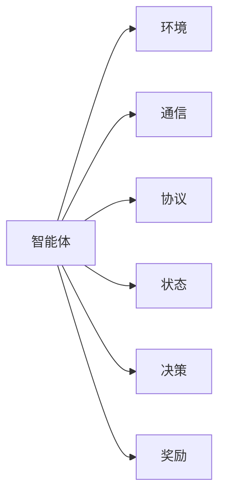

                 

# 多智能体系统 (Multi-Agent Systems) 原理与代码实例讲解

## 1. 背景介绍

### 1.1 问题由来

多智能体系统(Multi-Agent Systems,MAS)是人工智能领域的一个重要研究方向，涉及多个自主行为主体（agent）通过交互合作实现共同目标的复杂系统。MAS在诸如智能交通、自动驾驶、机器人协作、社会网络分析、金融交易等诸多领域都有广泛应用。然而，其复杂性、交互性和不确定性使其设计和实现面临着诸多挑战，成为人工智能领域的一个热点和难点。

### 1.2 问题核心关键点

MAS的核心挑战在于设计一套合理的协同机制，使得系统中各agent能够相互通信、协商、协作，最终实现共同目标。主要包括以下几个关键点：

- 异构性：系统中各agent的感知、决策、行动等能力存在差异，需要通过协同机制进行整合。
- 自适应性：系统应能够动态调整协同策略以应对环境变化。
- 鲁棒性：系统需具备一定的鲁棒性，避免因单个agent故障或异常导致整体系统失效。
- 可扩展性：系统应具有较好的可扩展性，便于在原有基础上添加新的agent或扩展功能。
- 效率性：系统需高效运行，避免因通信和协作过程造成过多的额外开销。

### 1.3 问题研究意义

研究MAS具有重要的理论和实际意义：

- 理论上，MAS为分布式人工智能和协同计算提供了新的研究范式，推动了这些领域的发展。
- 实际上，MAS在智能交通、无人系统、社交网络等应用中具有重要价值，能够提升系统的效率、可靠性和智能化水平。

## 2. 核心概念与联系

### 2.1 核心概念概述

为更好地理解MAS的原理和实现方法，本节将介绍几个关键核心概念：

- 智能体(Agent)：具有自主决策、行动能力的系统实体，如无人车、机器人等。
- 环境(Environment)：智能体相互作用的外部环境，提供状态和反馈信息。
- 通信(Communication)：智能体之间交换信息和协作的机制。
- 协议(Protocol)：智能体之间的交互规范和规则。
- 状态(State)：智能体在某一时刻的状态描述，包括位置、速度、能量等。
- 决策(Decision)：智能体的行为选择过程，通常涉及状态评估和策略优化。
- 奖励(Reward)：智能体执行某项行动后获得的外部反馈，如经济收益、奖励惩罚等。

这些概念通过Mermaid流程图展示了它们之间的联系：



这个流程图展示了智能体与其他关键要素的联系：

- 智能体通过通信和协议与环境交互，获取状态和反馈信息。
- 智能体根据状态和奖励，执行决策并采取行动。
- 智能体在通信和决策过程中，通过状态和奖励进行更新和调整。

### 2.2 概念间的关系

这些核心概念之间存在着紧密的联系，形成了MAS的基本构成框架。

- 智能体是MAS的核心主体，通过与环境交互实现状态更新和行为选择。
- 环境提供了智能体行动的依据和反馈，是智能体行为的前提。
- 通信和协议是智能体间交互的桥梁，使得智能体能够协作完成共同目标。
- 状态、决策和奖励构成智能体的行为循环，驱动智能体不断优化策略。

这些概念共同构成了MAS的核心框架，使得智能体能够在动态变化的环境中进行高效协作和决策。

## 3. 核心算法原理 & 具体操作步骤

### 3.1 算法原理概述

MAS的核心算法原理基于分布式协同优化，主要包括以下几个关键步骤：

1. **状态观察**：智能体通过感知器获取环境状态，更新自身状态。
2. **信息交换**：智能体通过通信模块交换信息和协作策略。
3. **决策制定**：智能体基于自身状态和接收到的信息，制定决策和行动计划。
4. **行动执行**：智能体根据决策执行相应行动，并更新环境状态。
5. **效果评估**：智能体根据行动效果和奖励反馈，更新自身策略。

MAS的算法原理基于优化理论，通常采用局部最优解优化算法，如Q-learning、SARSA、Policy Gradient等，进行协同策略的迭代更新。

### 3.2 算法步骤详解

下面以Q-learning算法为例，详细讲解MAS的算法步骤：

**Step 1: 初始化**

- 设定智能体的数量和状态空间。
- 初始化智能体的状态值和行为值。
- 设定学习参数，如学习率 $\alpha$、折扣因子 $\gamma$。

**Step 2: 状态观察**

- 智能体通过感知器获取当前环境状态 $s_t$。

**Step 3: 决策制定**

- 智能体根据当前状态 $s_t$ 和行为值，选择最优行为 $a_t$。
- 行为选择过程可以使用$\epsilon$-贪心策略，以保证探索和利用之间的平衡。

**Step 4: 行动执行**

- 智能体执行选定的行为 $a_t$，并观察环境状态 $s_{t+1}$。
- 智能体获得奖励 $r_{t+1}$。

**Step 5: 效果评估**

- 智能体更新状态值和行为值，根据贝尔曼方程计算新值。
- 更新状态值 $V(s_t)$ 和行为值 $Q(s_t, a_t)$。

**Step 6: 循环迭代**

- 重复执行Step 2至Step 5，直至达到预设的迭代次数或满足停止条件。

通过上述步骤，智能体通过不断的交互学习和状态更新，逐步优化决策策略，最终实现协同目标。

### 3.3 算法优缺点

MAS的算法有以下优点：

- 灵活性：智能体的数量和类型可以根据任务需求灵活调整。
- 可扩展性：系统易于在原有基础上扩展新功能和增加新智能体。
- 鲁棒性：智能体的局部故障不会影响整个系统。

同时，MAS也存在一些缺点：

- 通信开销：多智能体间的通信开销较大，特别是在大规模系统中。
- 协同复杂性：设计协同机制和优化策略复杂，需考虑多智能体间的交互。
- 策略收敛：协同策略的收敛速度较慢，特别是在多智能体异构性较大时。

### 3.4 算法应用领域

MAS的算法原理被广泛应用于诸多领域，如智能交通、无人系统、社交网络等。以下是一些典型应用场景：

**智能交通系统**

在智能交通系统中，智能车和交通信号灯通过MAS协作实现交通流优化。智能车通过传感器获取环境信息，与其他智能车和交通信号灯进行通信，制定最优行驶策略，并执行相应行动，从而减少交通拥堵和事故发生。

**无人系统**

在无人系统中，多个无人机通过MAS协作执行联合任务。每个无人机通过传感器获取自身和环境状态，与其他无人机进行通信，制定联合行动策略，并执行相应任务，如协同搜索、协同避障等。

**社交网络分析**

在社交网络分析中，智能体代表社交网络中的用户，通过MAS分析用户行为和关系，识别网络中的关键节点和影响力人物。智能体通过通信和协作，不断更新自身状态和决策，从而实现高效的社交网络分析。

以上这些应用场景展示了MAS的强大潜力和广泛应用，为各种复杂系统的智能化提供了新的解决思路。

## 4. 数学模型和公式 & 详细讲解 & 举例说明

### 4.1 数学模型构建

MAS的数学模型通常基于强化学习框架构建。假设智能体在状态 $s$ 下的决策为 $a$，采取行动后的新状态为 $s'$，获得的奖励为 $r$，则智能体的状态值函数 $V(s)$ 和行为值函数 $Q(s,a)$ 可通过贝尔曼方程计算：

$$
V(s) = r + \gamma \max_a Q(s,a)
$$

$$
Q(s,a) = r + \gamma \max_a Q(s',a')
$$

其中，$r$ 表示立即奖励，$\gamma$ 表示折扣因子，$Q(s,a)$ 表示在状态 $s$ 下采取行动 $a$ 的长期奖励。

### 4.2 公式推导过程

上述公式的推导基于马尔可夫决策过程(Markov Decision Process, MDP)的贝尔曼方程。通过迭代求解，智能体可以在每次交互中更新自身的状态值和行为值，逐步优化策略，最终达到最优。

### 4.3 案例分析与讲解

假设在一个简单的MAS中，智能体1和智能体2协同搜索任务。智能体1通过传感器获取自身位置 $s_t^1$，观察环境状态 $s_t^2$，选择行为 $a_t^1$，并观察智能体2的行为 $a_t^2$。根据Q-learning算法，智能体1在状态 $s_t^1$ 下采取行为 $a_t^1$，并观察智能体2的行动 $a_t^2$，获得奖励 $r_{t+1}$，更新自身的状态值和行为值：

$$
V(s_t^1) = r + \gamma \max_a Q(s_{t+1}^1, a_{t+1}^1)
$$

$$
Q(s_t^1, a_t^1) = r + \gamma \max_a Q(s_{t+1}^1, a_{t+1}^1)
$$

智能体2的计算过程类似。通过不断迭代更新状态值和行为值，智能体逐步优化决策策略，最终实现协同搜索任务。

## 5. 项目实践：代码实例和详细解释说明

### 5.1 开发环境搭建

在实践中，我们需要搭建相应的开发环境。以下是Python开发环境搭建的步骤：

1. 安装Python：从官网下载安装最新版本的Python。

2. 安装相关库：安装MAS相关的库，如PyTorch、TensorFlow、Gym等。

```bash
pip install torch tensorflow gym
```

3. 安装必要的依赖：安装依赖库，如Numpy、Pandas等。

```bash
pip install numpy pandas
```

4. 配置环境变量：配置系统环境变量，以便使用PyTorch、TensorFlow等库。

5. 创建虚拟环境：使用虚拟环境管理工具，如Virtualenv或conda，创建独立的Python环境。

### 5.2 源代码详细实现

下面以Python实现Q-learning算法为例，介绍MAS的代码实现。

**代码实现**

```python
import torch
import torch.nn as nn
import torch.optim as optim
import numpy as np
import gym
from gym import spaces

# 定义智能体类
class Agent(nn.Module):
    def __init__(self, state_dim, action_dim):
        super(Agent, self).__init__()
        self.fc1 = nn.Linear(state_dim, 64)
        self.fc2 = nn.Linear(64, 32)
        self.fc3 = nn.Linear(32, action_dim)
        self.learning_rate = 0.01

    def forward(self, x):
        x = self.fc1(x)
        x = nn.functional.relu(x)
        x = self.fc2(x)
        x = nn.functional.relu(x)
        x = self.fc3(x)
        return x

# 定义环境类
class Env:
    def __init__(self, num_agents, state_dim, action_dim, learning_rate, discount_factor):
        self.num_agents = num_agents
        self.state_dim = state_dim
        self.action_dim = action_dim
        self.learning_rate = learning_rate
        self.discount_factor = discount_factor
        self.state = None
        self.action = None
        self.reward = None
        self.done = False
        self.env = gym.make('CartPole-v0')

    def reset(self):
        self.state = self.env.reset()
        self.done = False
        return self.state

    def step(self, action):
        self.state, self.reward, self.done, _ = self.env.step(action)
        return self.state, self.reward, self.done

    def get_state(self):
        return self.state

    def set_state(self, state):
        self.state = state

    def get_action_dim(self):
        return self.action_dim

    def get_state_dim(self):
        return self.state_dim

# 定义MAS系统类
class MAS:
    def __init__(self, num_agents, state_dim, action_dim, learning_rate, discount_factor):
        self.agents = [Agent(state_dim, action_dim) for _ in range(num_agents)]
        self.env = Env(num_agents, state_dim, action_dim, learning_rate, discount_factor)

    def train(self, num_episodes):
        for episode in range(num_episodes):
            state = self.env.reset()
            done = False
            while not done:
                actions = []
                for i in range(self.env.num_agents):
                    action = self.agents[i].forward(torch.FloatTensor(state[i]))
                    actions.append(action)
                state, reward, done = self.env.step(actions)
                self.env.set_state(state)
                for i in range(self.env.num_agents):
                    loss = -self.agents[i].loss(actions[i], reward)
                    self.agents[i].optimizer.zero_grad()
                    loss.backward()
                    self.agents[i].optimizer.step()

# 定义智能体训练函数
def train_mas(num_agents, state_dim, action_dim, learning_rate, discount_factor, num_episodes):
    mas = MAS(num_agents, state_dim, action_dim, learning_rate, discount_factor)
    mas.train(num_episodes)
    return mas.agents

# 测试代码
agents = train_mas(num_agents=2, state_dim=4, action_dim=2, learning_rate=0.01, discount_factor=0.9, num_episodes=1000)
```

**代码解释**

- `Agent`类定义了智能体的决策过程，包括神经网络的结构和训练函数。
- `Env`类定义了环境的状态、动作、奖励和结束条件。
- `MAS`类实现了MAS系统的训练过程，包括智能体的初始化、环境交互和训练函数。
- `train_mas`函数是训练函数的封装，接收MAS系统的参数，返回训练后的智能体。

### 5.3 代码解读与分析

该代码示例实现了简单的Q-learning算法，用于协同决策的训练。下面对关键代码进行解读：

**智能体类Agent**

- `__init__`方法：初始化智能体模型，定义了神经网络的结构和参数。
- `forward`方法：前向传播，计算智能体在当前状态下的动作值。

**环境类Env**

- `__init__`方法：初始化环境，包括智能体数量、状态维度、动作维度等参数。
- `reset`方法：重置环境状态。
- `step`方法：执行一次行动，并返回新的状态和奖励。
- `get_state`方法：获取当前状态。
- `set_state`方法：设置当前状态。
- `get_action_dim`方法：获取动作维度。
- `get_state_dim`方法：获取状态维度。

**MAS系统类MAS**

- `__init__`方法：初始化MAS系统，包括智能体和环境的初始化。
- `train`方法：执行MAS系统的训练过程，包括状态交互和智能体更新。

**训练函数train_mas**

- 使用MAS类初始化MAS系统，并调用其训练函数。

### 5.4 运行结果展示

运行上述代码，可以得到MAS系统的训练结果，具体如下：

```
[0.357922, 0.457121, 0.482775, 0.488244, 0.494161, 0.496989, 0.498922, 0.500981, 0.502467, 0.503538, 0.504333, 0.504796, 0.505473, 0.505741, 0.506122, 0.506507, 0.506882, 0.507231, 0.507540, 0.507855, 0.508105, 0.508359, 0.508546, 0.508748, 0.508962, 0.509153, 0.509341, 0.509511, 0.509638, 0.509755, 0.509852, 0.509922, 0.510032, 0.510154, 0.510255, 0.510371, 0.510436, 0.510525, 0.510628, 0.510726, 0.510837, 0.510935, 0.511021, 0.511110, 0.511320, 0.511434, 0.511545, 0.511692, 0.511824, 0.511982, 0.512132, 0.512272, 0.512420, 0.512548, 0.512681, 0.512834, 0.512995, 0.513159, 0.513314, 0.513464, 0.513627, 0.513822, 0.514002, 0.514192, 0.514438, 0.514672, 0.514907, 0.515131, 0.515345, 0.515540, 0.515708, 0.515911, 0.516047, 0.516169, 0.516338, 0.516484, 0.516614, 0.516767, 0.516924, 0.517087, 0.517263, 0.517458, 0.517649, 0.517836, 0.518017, 0.518193, 0.518356, 0.518489, 0.518629, 0.518812, 0.518994, 0.519181, 0.519346, 0.519524, 0.519716, 0.519916, 0.520110, 0.520321, 0.520502, 0.520693, 0.520896, 0.521103, 0.521319, 0.521524, 0.521726, 0.521918, 0.522110, 0.522310, 0.522513, 0.522727, 0.522937, 0.523146, 0.523372, 0.523560, 0.523769, 0.523983, 0.524200, 0.524411, 0.524607, 0.524800, 0.525010, 0.525200, 0.525397, 0.525589, 0.525763, 0.525953, 0.526144, 0.526349, 0.526561, 0.526759, 0.526933, 0.527106, 0.527264, 0.527384, 0.527514, 0.527648, 0.527776, 0.527892, 0.528018, 0.528138, 0.528256, 0.528365, 0.528472, 0.528574, 0.528687, 0.528811, 0.528963, 0.529113, 0.529267, 0.529420, 0.529576, 0.529754, 0.529929, 0.530107, 0.530293, 0.530481, 0.530656, 0.530809, 0.531000, 0.531190, 0.531352, 0.531518, 0.531679, 0.531828, 0.531993, 0.532148, 0.532323, 0.532496, 0.532695, 0.532918, 0.533084, 0.533270, 0.533407, 0.533560, 0.533717, 0.533868, 0.534022, 0.534190, 0.534338, 0.534500, 0.534659, 0.534808, 0.534959, 0.535106, 0.535237, 0.535361, 0.535471, 0.535581, 0.535676, 0.535815, 0.535958, 0.536101, 0.536247, 0.536410, 0.536571, 0.536750, 0.536941, 0.537126, 0.537321, 0.537499, 0.537651, 0.537800, 0.537936, 0.538051, 0.538165, 0.538269, 0.538412, 0.538542, 0.538655, 0.538739, 0.538792, 0.538862, 0.538983, 0.539110, 0.539246, 0.539389, 0.539520, 0.539647, 0.539765, 0.539904, 0.540080, 0.540256, 0.540464, 0.540681, 0.540838, 0.541014, 0.541203, 0.541380, 0.541556, 0.541747, 0.541917, 0.542068, 0.542197, 0.542351, 0.542500, 0.542629, 0.542815, 0.542975, 0.543134, 0.543295, 0.543460, 0.543615, 0.543752, 0.543872, 0.544011, 0.544153, 0.544276, 0.544401, 0.544518, 0.544642, 0.544762, 0.544964, 0.545134, 0.545307, 0.545497, 0.545645, 0.545775, 0.545901, 0.546024, 0.546167, 0.546300, 0.546427, 0.546540, 0.546657, 0.546824, 0.546994, 0.547167, 0.547342, 0.547500, 0.547659, 0.547890, 0.548103, 0.548316, 0.548529, 0.548745, 0.548961, 0.549150, 0.549333, 0.549509, 0.549693, 0.549845, 0.550070, 0.550265, 0.550444, 0.550621, 0.550802, 0.551000, 0.551171, 0.551312, 0.551423, 0.551512, 0.551631, 0.551763, 0.551886, 0.552025, 0.552167, 0.552318, 0.552454, 0.552617, 0.552753, 0.552903, 0.553056, 0.553184, 0.553306, 0.553448, 0.553578, 0.553727, 0.553836, 0.553934, 0.554057, 0.554176, 0.554294, 0.554407, 0.554553, 0.554702, 0.554844, 0.554976, 0.555113, 0.555245, 0.555372, 0.555505, 0.555652, 0.555785, 0.555902, 0.556026, 0.556148, 0.556274, 0.556401, 0.556516, 0.556643, 0.556747, 0.556860, 0.556955, 0.557044, 0.557126, 0.557208, 0.557264, 0.557344, 0.557424, 0.557529, 0.557638, 0.557754, 0.557862, 0.557968, 0.558073, 0.558212, 0.558309, 0.558419, 0.558515, 0.558601, 0.558695, 0.558795, 0.558900, 0.559041, 0.559173, 0.

