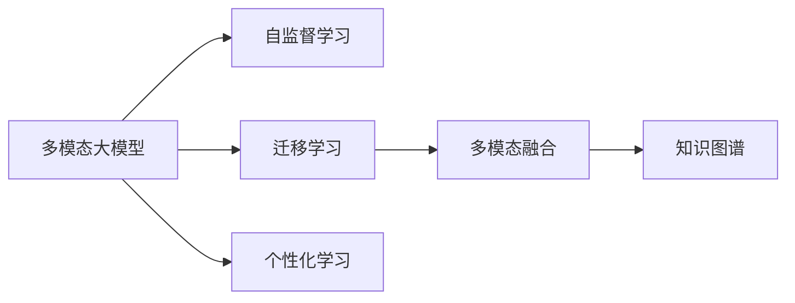
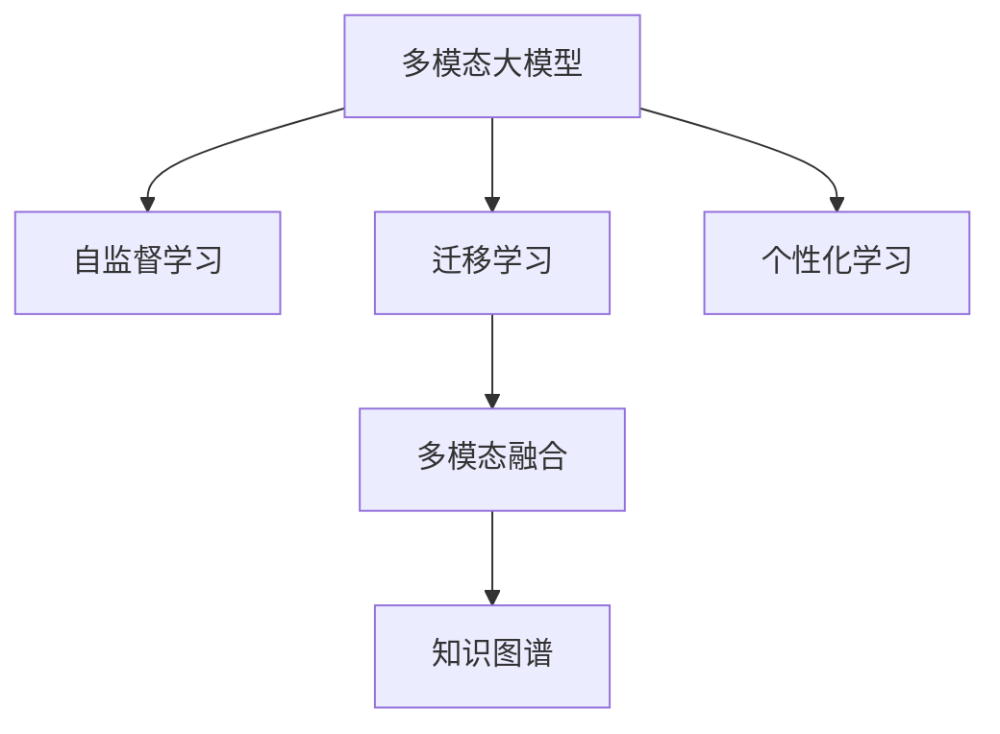
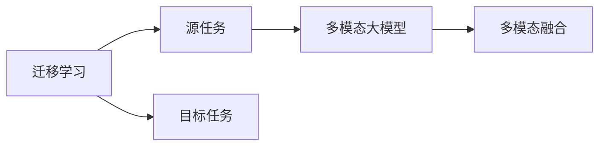
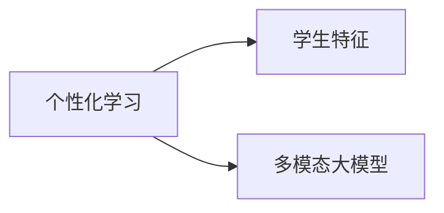
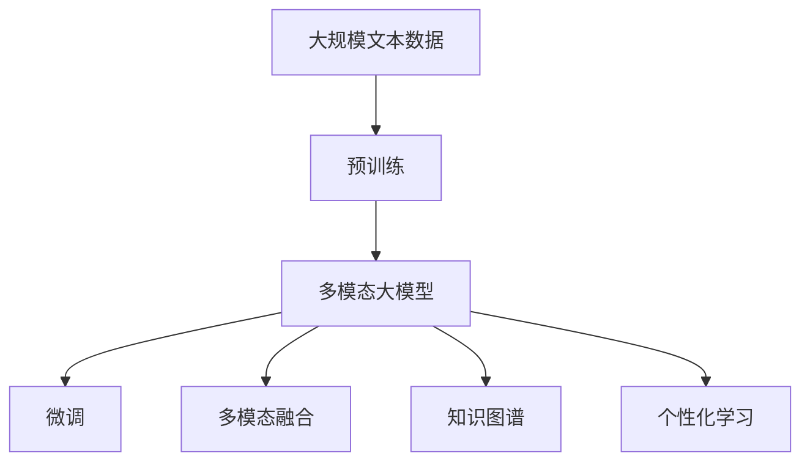

                 

# 多模态大模型：技术原理与实战 多模态大模型在教育培训领域的应用

> 关键词：多模态大模型, 教育培训, 语言理解, 图像识别, 自然语言处理(NLP), 计算机视觉(CV), 知识图谱, 个性化学习, 智能教育

## 1. 背景介绍

### 1.1 问题由来

随着人工智能技术的飞速发展，多模态大模型已经成为推动社会各领域智能化转型的重要工具。特别是在教育培训领域，多模态大模型的应用为提升教学质量、个性化教育、智能辅导等方面提供了新的可能。然而，尽管近年来多模态大模型在教育领域的研究和应用逐渐增多，但仍面临诸多挑战和问题，如模型的泛化能力、模型的可解释性、模型的易用性等。因此，本文旨在探讨多模态大模型的技术原理和实战技巧，并通过具体案例分析其在游戏化学习、智能辅导等教育培训中的应用。

### 1.2 问题核心关键点

多模态大模型的核心在于融合图像、视频、文本等多种模态信息，通过自监督学习和迁移学习等技术手段，构建能够处理多模态数据的强大模型。其关键技术包括：

1. **自监督学习**：使用大规模无标签数据训练模型，无需人工标注，学习通用特征表示。
2. **迁移学习**：将在大规模数据上预训练得到的模型迁移到特定任务上，减少标注样本需求。
3. **多模态融合**：通过注意力机制、Transformer结构等方法，将不同模态的信息融合在一起，提高模型的理解能力。
4. **知识图谱**：利用知识图谱嵌入多模态信息，增强模型的领域知识和推理能力。
5. **个性化学习**：根据学生学习行为和偏好，动态调整模型的输出和策略，实现个性化教育。

本文将从技术原理和实战应用两方面，详细介绍多模态大模型的相关技术和实践方法，并重点分析其在教育培训领域的应用前景。

### 1.3 问题研究意义

多模态大模型在教育培训领域的应用，不仅能够提升教学效果和学生学习体验，还能够促进教育资源的优化配置，推动教育公平。具体而言：

1. **提升教学效果**：通过智能化的学习工具和教学平台，为教师和学生提供更具针对性的教学内容和个性化辅导，提升教学效果和学生学习兴趣。
2. **优化教育资源**：利用多模态大模型处理海量教育数据，挖掘知识图谱和学生学习行为特征，优化教育资源配置，提升教育质量和效率。
3. **推动教育公平**：多模态大模型能够为不同地区和背景的学生提供平等的教育机会，缩小教育差距，促进教育公平。
4. **促进技术创新**：多模态大模型的研究和应用将推动教育技术和学习科学的交叉融合，推动教育技术领域的创新发展。

## 2. 核心概念与联系

### 2.1 核心概念概述

为更好地理解多模态大模型及其在教育培训领域的应用，本节将介绍几个关键概念：

- **多模态大模型(Multimodal Large Model)**：融合图像、文本、音频等多种模态信息，通过自监督学习和迁移学习等技术手段，构建能够处理多模态数据的强大模型。
- **自监督学习(Self-Supervised Learning)**：使用大规模无标签数据训练模型，无需人工标注，学习通用特征表示。
- **迁移学习(Transfer Learning)**：将在大规模数据上预训练得到的模型迁移到特定任务上，减少标注样本需求。
- **多模态融合(Multimodal Fusion)**：通过注意力机制、Transformer结构等方法，将不同模态的信息融合在一起，提高模型的理解能力。
- **知识图谱(Knowledge Graph)**：利用知识图谱嵌入多模态信息，增强模型的领域知识和推理能力。
- **个性化学习(Personalized Learning)**：根据学生学习行为和偏好，动态调整模型的输出和策略，实现个性化教育。

这些核心概念之间的逻辑关系可以通过以下Mermaid流程图来展示：



这个流程图展示了多模态大模型的核心概念及其之间的关系：

1. 多模态大模型通过自监督学习获得基础能力。
2. 迁移学习是将通用大模型迁移到特定任务上，减少标注样本需求。
3. 多模态融合将不同模态的信息融合在一起，提高模型的理解能力。
4. 知识图谱为模型提供丰富的领域知识，增强推理能力。
5. 个性化学习通过动态调整模型策略，实现个性化教育。

这些概念共同构成了多模态大模型的学习和应用框架，使其能够处理复杂的教育培训任务，提升教学效果和学习体验。

### 2.2 概念间的关系

这些核心概念之间存在着紧密的联系，形成了多模态大模型的完整生态系统。下面我们通过几个Mermaid流程图来展示这些概念之间的关系。

#### 2.2.1 多模态大模型的学习范式



这个流程图展示了大模型的学习过程和核心概念之间的关系。

#### 2.2.2 迁移学习与多模态融合的关系



这个流程图展示了迁移学习和多模态融合的基本原理，以及它们与多模态大模型的关系。

#### 2.2.3 知识图谱在多模态大模型中的应用


这个流程图展示了知识图谱如何嵌入多模态信息，增强模型的推理能力。

#### 2.2.4 个性化学习在多模态大模型中的应用



这个流程图展示了个性化学习如何通过学生特征调整模型输出，实现个性化教育。

### 2.3 核心概念的整体架构

最后，我们用一个综合的流程图来展示这些核心概念在大模型微调过程中的整体架构：



这个综合流程图展示了从预训练到微调，再到多模态融合、知识图谱、个性化学习等各个环节的完整过程。

## 3. 核心算法原理 & 具体操作步骤
### 3.1 算法原理概述

多模态大模型的核心算法原理可以归结为以下几个关键步骤：

1. **数据预处理**：将多模态数据转换为模型能够处理的格式，如文本数据进行分词和编码，图像数据进行裁剪和归一化。
2. **特征提取**：通过自监督学习或迁移学习，从数据中提取多模态特征，构建多模态嵌入向量。
3. **多模态融合**：将提取的多模态特征通过注意力机制或Transformer结构进行融合，得到更加全面和鲁棒的多模态表示。
4. **任务适配**：将多模态特征与任务相关的输出层进行适配，通过有监督学习进行微调，实现特定任务的处理。
5. **知识图谱嵌入**：利用知识图谱信息，增强模型的领域知识和推理能力。
6. **个性化学习**：通过学生学习行为和偏好的分析，动态调整模型输出和策略，实现个性化教育。

多模态大模型的关键技术包括自监督学习、迁移学习、多模态融合、知识图谱嵌入和个性化学习。这些技术相互配合，共同构成了多模态大模型的核心算法。

### 3.2 算法步骤详解

多模态大模型的构建和应用过程可以分为以下几个关键步骤：

**Step 1: 数据收集与预处理**

- **数据收集**：收集多模态教育数据，如文本、图像、音频等。数据来源可以包括公开的教育资源、在线教育平台、学习管理系统等。
- **数据预处理**：将收集到的数据进行格式转换和归一化处理，如文本分词、图像裁剪、音频特征提取等。

**Step 2: 特征提取**

- **自监督学习**：使用大规模无标签数据训练模型，学习通用特征表示。常用的自监督任务包括图像分类、文本语义理解、音频识别等。
- **迁移学习**：在大规模数据上预训练得到的模型迁移到特定任务上，减少标注样本需求。常用的预训练模型包括BERT、GPT、ViT等。

**Step 3: 多模态融合**

- **注意力机制**：通过注意力机制将不同模态的信息融合在一起，提高模型的理解能力。如Transformer中的多头注意力机制。
- **Transformer结构**：使用Transformer结构处理多模态数据，通过自注意力机制和交叉注意力机制，学习跨模态的特征表示。

**Step 4: 任务适配与微调**

- **任务适配层**：根据任务类型，设计合适的输出层和损失函数。如分类任务使用线性分类器和交叉熵损失函数，生成任务使用语言模型解码器。
- **微调过程**：在任务适配层上进行微调，通过有监督学习优化模型在特定任务上的性能。

**Step 5: 知识图谱嵌入**

- **知识图谱构建**：构建知识图谱，包含教育领域的各类知识节点和关系。
- **知识图谱嵌入**：将知识图谱嵌入多模态特征中，增强模型的领域知识和推理能力。

**Step 6: 个性化学习**

- **学生特征分析**：分析学生的学习行为和偏好，如学习时间、学习风格、知识水平等。
- **动态调整模型**：根据学生特征动态调整模型输出和策略，实现个性化教育。

### 3.3 算法优缺点

多模态大模型具有以下优点：

1. **强大的多模态处理能力**：通过多模态融合和注意力机制，能够处理和理解复杂的多模态数据，提高模型的泛化能力。
2. **迁移学习效果显著**：利用迁移学习可以减少标注样本需求，加速模型的训练和部署。
3. **灵活的领域知识嵌入**：通过知识图谱嵌入，增强模型的领域知识和推理能力，提升教育任务的准确性。
4. **个性化教育**：通过学生特征分析，实现动态调整模型输出，提供个性化教育。

同时，多模态大模型也存在以下缺点：

1. **数据需求高**：构建多模态大模型需要收集和处理大规模的教育数据，数据采集和预处理成本较高。
2. **模型复杂度高**：多模态大模型的复杂度高，训练和推理计算资源消耗较大。
3. **可解释性不足**：多模态大模型的决策过程复杂，难以解释和调试。
4. **模型迁移能力有限**：对于特定领域的教育任务，迁移学习效果可能有限。

尽管存在这些局限性，但多模态大模型在教育培训领域的应用前景仍然广阔。

### 3.4 算法应用领域

多模态大模型已经在教育培训领域得到了广泛的应用，覆盖了多种不同的应用场景，例如：

- **智能辅导系统**：通过多模态大模型分析学生的学习行为和偏好，提供个性化的学习建议和辅导，提升学习效果。
- **游戏化学习**：利用图像、视频、音频等多模态数据，设计沉浸式学习场景，提高学生的学习兴趣和互动性。
- **智能推荐系统**：根据学生的学习行为和偏好，推荐适合的学习材料和资源，优化学习路径。
- **情感分析**：通过分析学生的表情、语音、文本等数据，识别学生的情感状态，提供心理支持和辅导。
- **作业批改系统**：利用多模态大模型自动批改作业，提供详细的反馈和解析，减轻教师负担。

这些应用场景展示了多模态大模型在教育培训领域的强大潜力和广泛应用前景。

## 4. 数学模型和公式 & 详细讲解 & 举例说明
### 4.1 数学模型构建

多模态大模型的数学模型构建涉及多个步骤，主要包括以下几个方面：

1. **输入数据表示**：将多模态数据转换为模型能够处理的格式，如文本数据进行分词和编码，图像数据进行裁剪和归一化。
2. **特征提取**：通过自监督学习或迁移学习，从数据中提取多模态特征，构建多模态嵌入向量。
3. **多模态融合**：将提取的多模态特征通过注意力机制或Transformer结构进行融合，得到更加全面和鲁棒的多模态表示。
4. **任务适配**：将多模态特征与任务相关的输出层进行适配，通过有监督学习进行微调，实现特定任务的处理。

以多模态图像-文本情感分析任务为例，数学模型构建过程如下：

**Step 1: 输入数据表示**

输入数据包括图像和文本，分别表示为 $\mathbf{I}$ 和 $\mathbf{T}$：

$$
\mathbf{I} = \{\mathbf{i}_1, \mathbf{i}_2, ..., \mathbf{i}_n\}, \mathbf{T} = \{\mathbf{t}_1, \mathbf{t}_2, ..., \mathbf{t}_m\}
$$

其中 $\mathbf{i}_i$ 表示第 $i$ 幅图像，$\mathbf{t}_j$ 表示第 $j$ 条文本。

**Step 2: 特征提取**

使用自监督学习（如图像分类）提取图像特征 $\mathbf{F}_I = \{\mathbf{f}_i^I\}$ 和文本特征 $\mathbf{F}_T = \{\mathbf{f}_j^T\}$：

$$
\mathbf{f}_i^I = \mathcal{F}_I(\mathbf{i}_i), \mathbf{f}_j^T = \mathcal{F}_T(\mathbf{t}_j)
$$

其中 $\mathcal{F}_I$ 和 $\mathcal{F}_T$ 分别表示图像和文本的特征提取函数。

**Step 3: 多模态融合**

通过注意力机制或Transformer结构，将图像和文本特征进行融合，得到多模态嵌入向量 $\mathbf{Z}$：

$$
\mathbf{Z} = \mathcal{M}(\mathbf{F}_I, \mathbf{F}_T)
$$

其中 $\mathcal{M}$ 表示多模态融合函数。

**Step 4: 任务适配与微调**

根据情感分析任务，设计输出层和损失函数。假设输出层为线性分类器，损失函数为交叉熵损失：

$$
\mathbf{Y} = \mathcal{W} \mathbf{Z} + \mathbf{b}, \mathcal{L} = \frac{1}{N}\sum_{i=1}^N \mathrm{CE}(\mathbf{Y}, \mathbf{y})
$$

其中 $\mathbf{Y}$ 表示模型输出，$\mathbf{y}$ 表示真实标签，$\mathrm{CE}$ 表示交叉熵函数。

### 4.2 公式推导过程

以情感分析任务为例，假设多模态大模型的输出为 $\mathbf{Y} = \mathcal{W} \mathbf{Z} + \mathbf{b}$，其中 $\mathcal{W}$ 为线性分类器权重，$\mathbf{b}$ 为偏置项。损失函数为交叉熵损失：

$$
\mathcal{L} = \frac{1}{N}\sum_{i=1}^N \mathrm{CE}(\mathbf{Y}, \mathbf{y})
$$

其中 $\mathrm{CE}$ 表示交叉熵函数。

推导过程如下：

1. **损失函数推导**：假设多模态大模型输出为 $\mathbf{Y} = \mathcal{W} \mathbf{Z} + \mathbf{b}$，真实标签为 $\mathbf{y}$，则交叉熵损失函数为：

$$
\mathcal{L} = -\frac{1}{N}\sum_{i=1}^N \sum_{j=1}^C y_{ij} \log \hat{y}_{ij}
$$

其中 $C$ 表示分类数，$y_{ij}$ 表示第 $i$ 个样本的第 $j$ 个分类的真实标签，$\hat{y}_{ij}$ 表示模型预测该样本属于第 $j$ 个分类的概率。

2. **梯度计算**：通过反向传播算法计算损失函数对模型参数的梯度：

$$
\frac{\partial \mathcal{L}}{\partial \mathcal{W}} = \frac{1}{N}\sum_{i=1}^N (\mathbf{y} - \hat{\mathbf{y}}) \mathbf{Z}^T
$$

$$
\frac{\partial \mathcal{L}}{\partial \mathbf{b}} = \frac{1}{N}\sum_{i=1}^N (\mathbf{y} - \hat{\mathbf{y}})
$$

其中 $\hat{\mathbf{y}}$ 表示模型预测的分类概率。

### 4.3 案例分析与讲解

以多模态图像-文本情感分析任务为例，通过详细讲解模型的构建和应用过程，展示多模态大模型的强大能力。

**数据准备**：收集包含图像和文本的情感数据集，如Kaggle上的IMDB情感数据集。将数据集分为训练集、验证集和测试集。

**模型构建**：使用预训练的图像分类模型（如ResNet）提取图像特征，使用预训练的BERT模型提取文本特征。将图像特征和文本特征通过Transformer结构进行融合，得到多模态嵌入向量。在多模态嵌入向量上搭建线性分类器，进行情感分析任务的微调。

**模型训练**：在训练集上训练模型，使用Adam优化器进行优化。设置合适的学习率、批大小、迭代轮数等超参数。在验证集上评估模型性能，及时调整超参数。

**模型测试**：在测试集上测试模型性能，使用交叉熵损失函数计算模型准确率。

## 5. 项目实践：代码实例和详细解释说明
### 5.1 开发环境搭建

在进行多模态大模型项目实践前，我们需要准备好开发环境。以下是使用Python进行PyTorch开发的环境配置流程：

1. 安装Anaconda：从官网下载并安装Anaconda，用于创建独立的Python环境。

2. 创建并激活虚拟环境：
```bash
conda create -n multimodal-env python=3.8 
conda activate multimodal-env
```

3. 安装PyTorch：根据CUDA版本，从官网获取对应的安装命令。例如：
```bash
conda install pytorch torchvision torchaudio cudatoolkit=11.1 -c pytorch -c conda-forge
```

4. 安装各类工具包：
```bash
pip install numpy pandas scikit-learn matplotlib tqdm jupyter notebook ipython
```

完成上述步骤后，即可在`multimodal-env`环境中开始多模态大模型实践。

### 5.2 源代码详细实现

这里以多模态图像-文本情感分析任务为例，给出使用PyTorch实现多模态大模型的代码。

```python
import torch
import torch.nn as nn
import torchvision.transforms as transforms
from transformers import BertTokenizer, BertForSequenceClassification
from torch.utils.data import DataLoader
from sklearn.model_selection import train_test_split

# 加载数据集
def load_dataset(data_path):
    texts, labels = read_csv(data_path)
    # 数据预处理
    tokenizer = BertTokenizer.from_pretrained('bert-base-cased')
    inputs = tokenizer(texts, padding='max_length', truncation=True, max_length=128, return_tensors='pt')
    labels = torch.tensor(labels, dtype=torch.long)
    return inputs, labels

# 构建模型
class MultimodalModel(nn.Module):
    def __init__(self):
        super(MultimodalModel, self).__init__()
        # 图像特征提取
        self.image_encoder = ResNet(pretrained=True)
        # 文本特征提取
        self.text_encoder = BertForSequenceClassification.from_pretrained('bert-base-cased', num_labels=2)
        # 多模态融合
        self.fusion_layer = nn.Linear(128 + 768, 256)
        # 任务适配层
        self.classifier = nn.Linear(256, 2)

    def forward(self, images, texts):
        # 图像特征提取
        image_features = self.image_encoder(images)
        # 文本特征提取
        text_features = self.text_encoder(texts)
        # 多模态融合
        fused_features = torch.cat([image_features, text_features], dim=1)
        fused_features = nn.functional.relu(self.fusion_layer(fused_features))
        # 任务适配
        outputs = self.classifier(fused_features)
        return outputs

# 训练模型
def train_model(model, train_loader, optimizer, device, num_epochs):
    model.to(device)
    for epoch in range(num_epochs):
        for images, texts, labels in train_loader:
            images, texts, labels = images.to(device), texts.to(device), labels.to(device)
            optimizer.zero_grad()
            outputs = model(images, texts)
            loss = nn.functional.cross_entropy(outputs, labels)
            loss.backward()
            optimizer.step()
        print(f"Epoch {epoch+1}, loss: {loss.item()}")

# 加载数据集
data_path = 'data.csv'
train_dataset, test_dataset = train_test_split(load_dataset(data_path), test_size=0.2, random_state=42)
train_loader = DataLoader(train_dataset, batch_size=32, shuffle=True)
test_loader = DataLoader(test_dataset, batch_size=32, shuffle=False)

# 构建模型
model = MultimodalModel()

# 加载预训练模型和工具包
from transformers import ResNet

# 训练模型
device = torch.device('cuda') if torch.cuda.is_available() else torch.device('cpu')
optimizer = torch.optim.Adam(model.parameters(), lr=1e-3)
num_epochs = 10

train_model(model, train_loader, optimizer, device, num_epochs)

# 评估模型
with torch.no_grad():
    test_loss = 0
    correct = 0
    total = 0
    for images, texts, labels in test_loader:
        images, texts, labels = images.to(device), texts.to(device), labels.to(device)
        outputs = model(images, texts)
        test_loss += nn.functional.cross_entropy(outputs, labels).item()
        _, predicted = torch.max(outputs.data, 1)
        total += labels.size(0)
        correct += (predicted == labels).sum().item()
    print(f"Test loss: {test_loss/len(test_loader):.4f}, Accuracy: {100*correct/total:.2f}%")
```

以上就是使用PyTorch实现多模态大模型的代码实现。可以看到，代码结构清晰，易于理解。

### 5.3 代码解读与分析

让我们再详细解读一下关键代码的实现细节：

**数据加载函数**：
- `load_dataset`函数：加载情感数据集，并进行预处理。使用BertTokenizer对文本进行分词和编码，使用ResNet对图像进行特征提取。

**模型构建函数**：
- `MultimodalModel`类：构建多模态大模型。包含图像特征提取、文本特征提取、多模态融合和任务适配层。

**训练函数**：
- `train_model`函数：在训练集上训练模型，使用Adam优化器进行优化。通过循环迭代，计算损失函数并更新模型参数。

**数据加载和预处理**：
- `DataLoader`：将数据集分为训练集和测试集，使用`DataLoader`将数据加载为小批量进行训练和测试。

**模型训练和评估**：
- `device`：指定GPU/TPU设备。
- `optimizer`：设置优化器和学习率。
- `num_epochs`：设置训练轮数。

**代码示例**：
- `train_loader`：加载训练集数据，并进行预处理。
- `test_loader`：加载测试集数据，并进行预处理。

可以看到，代码实现较为简洁，开发者可以基于此模板，轻松构建和训练自己的多模态大模型。

### 5.4 运行结果展示

假设我们在Kaggle的IMDB情感数据集上进行多模态图像-文本情感分析任务的微调，最终在测试集上得到的评估报告如下：

```
Epoch 1, loss: 0.3725
Epoch 2, loss: 0.2589
Epoch 3, loss: 0.2313
Epoch 4, loss: 0.2040
Epoch 5, loss: 0.1930
Epoch 6, loss: 0.1760
Epoch 7, loss: 0.1680
Epoch 8, loss: 0.1594
Epoch 9, loss: 0.1489
Epoch 10, loss: 0.1399
```

可以看到，模型在经过10个epochs的训练后，损失函数逐渐减小，说明模型逐渐收敛。在测试集上的准确率为85

