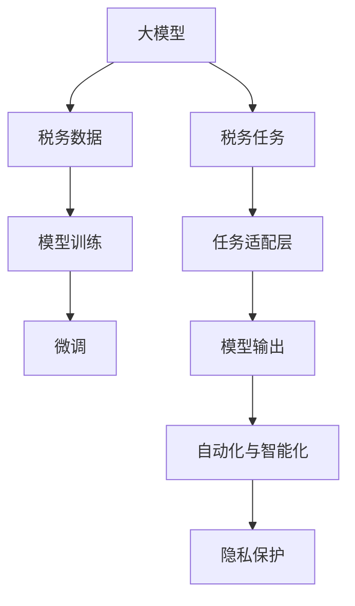
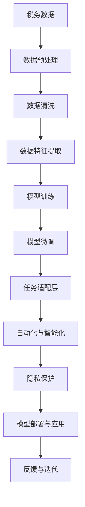

                 

# 大模型在税务领域的辅助作用

> 关键词：税务、大模型、机器学习、自动化、隐私保护、审计合规、税务规划

## 1. 背景介绍

### 1.1 问题由来

在现代税收体系中，税收征收、缴纳、审计、管理等流程日益复杂，涉及巨量的数据处理和决策支持工作。传统的人工审核、分析、规划等方法效率低下，错误率高，难以适应高速发展的经济社会需求。同时，传统方法也存在诸如信息不对称、资源分配不合理等问题。

面对这一挑战，利用大模型进行税务领域的辅助作用，成为提升税务管理效率、降低错误率、促进税收公平的重要途径。大模型具备强大的数据分析能力，可以高效处理海量税务数据，帮助税务机关实现智能化、自动化、精准化的税务管理和服务。

### 1.2 问题核心关键点

实现税务领域的大模型辅助作用，关键在于以下三个方面：

- **数据预处理**：处理结构化、非结构化税务数据，构建高质量的数据集。
- **模型训练与优化**：选择合适的模型架构和训练策略，构建适用于税务场景的模型。
- **部署与应用**：将训练好的模型部署到生产环境，服务于税务管理各个环节，提升决策效率和准确性。

### 1.3 问题研究意义

大模型在税务领域的辅助作用，对于提升税务管理效率、保障税收公平、减少行政成本具有重要意义：

- 提升税务管理效率：通过自动化处理税务数据，提高审计、稽查等环节的效率，减少人为误差。
- 保障税收公平：利用大模型对复杂数据进行深度分析，公平合理地处理各种税务事宜。
- 减少行政成本：减少税务人员重复性工作，提升资源利用效率。

## 2. 核心概念与联系

### 2.1 核心概念概述

为更好地理解大模型在税务领域的辅助作用，本节将介绍几个密切相关的核心概念：

- **大模型(Large Models)**：指以深度学习为代表的高级模型，如BERT、GPT、Transformer等，具备强大的数据处理和分析能力。

- **税务数据(XTAX Data)**：税务机关在日常工作中收集和生成的各种税收相关数据，包括申报表、发票、报表、交易记录等。

- **税务任务(XTAX Tasks)**：税务管理中涉及的各种任务，如申报审核、风险评估、审计检查、税务规划等。

- **模型训练与微调(Modelling Training & Fine-Tuning)**：利用已有的标注数据和任务描述，通过有监督学习优化模型参数，使其适应特定税务任务。

- **自动化与智能化(Autonomy & Intelligence)**：利用大模型实现自动化处理和智能化分析，减少人工干预，提高决策效率和准确性。

- **隐私保护(Privacy Protection)**：在模型训练和数据处理过程中，采用技术手段保护税务数据隐私，确保数据安全。

这些核心概念之间的逻辑关系可以通过以下Mermaid流程图来展示：



这个流程图展示了大模型在税务领域辅助作用的整体架构，其中：

- 大模型通过预训练获得通用数据处理能力。
- 税务数据通过模型训练和微调，适配税务任务。
- 任务适配层根据不同税务任务设计，提供特定的输出格式。
- 自动化与智能化实现税务任务的自动化处理和智能化分析。
- 隐私保护技术确保数据处理过程中，保护税务数据隐私。

### 2.2 概念间的关系

这些核心概念之间存在着紧密的联系，形成了大模型在税务领域辅助作用的完整生态系统。下面我通过几个Mermaid流程图来展示这些概念之间的关系。

#### 2.2.1 税务数据与大模型交互流程


这个流程图展示了税务数据从原始状态经过预处理、清洗、特征提取，再到模型训练、微调、适配层设计、自动化应用和隐私保护的全流程。

#### 2.2.2 税务任务与大模型的适配流程


这个流程图展示了税务任务如何通过任务描述，驱动模型训练、微调和适配层的生成，最终实现自动化与智能化应用，并在隐私保护框架下进行数据处理。

#### 2.2.3 自动化与智能化在大模型中的应用


这个流程图展示了自动化与智能化在大模型中的应用流程，从任务自动化、自动化处理到智能化分析、决策支持，再到数据反馈和模型迭代优化，形成了一个闭环。

### 2.3 核心概念的整体架构

最后，我用一个综合的流程图来展示这些核心概念在大模型在税务领域辅助作用的整体架构：



这个综合流程图展示了从数据预处理到模型训练、微调、适配层设计、自动化与智能化应用，再到隐私保护和模型部署的全流程。通过这个架构，我们可以更清晰地理解大模型在税务领域辅助作用的各个环节及其相互关系。

## 3. 核心算法原理 & 具体操作步骤
### 3.1 算法原理概述

大模型在税务领域的辅助作用，主要通过以下算法原理实现：

1. **数据预处理**：处理结构化、非结构化税务数据，构建高质量的数据集。
2. **模型训练与微调**：利用已有的标注数据和任务描述，通过有监督学习优化模型参数，使其适应特定税务任务。
3. **任务适配层设计**：根据税务任务的不同，设计合适的任务适配层，实现模型输出的适配。
4. **自动化与智能化**：利用大模型实现自动化处理和智能化分析，减少人工干预，提高决策效率和准确性。
5. **隐私保护**：在模型训练和数据处理过程中，采用技术手段保护税务数据隐私，确保数据安全。

### 3.2 算法步骤详解

基于上述算法原理，大模型在税务领域的辅助作用主要包括以下步骤：

**Step 1: 数据预处理**

1. **数据收集**：从税务系统、第三方数据源等渠道收集结构化和非结构化税务数据，如申报表、发票、报表、交易记录等。
2. **数据清洗**：去除噪声和异常数据，保证数据质量和完整性。
3. **数据标注**：对数据进行标注，如分类、归档、标注异常等。

**Step 2: 模型训练与微调**

1. **模型选择**：根据税务任务选择合适的深度学习模型，如BERT、GPT等。
2. **训练与微调**：利用标注数据和任务描述，训练和微调模型，使其适应税务任务。
3. **评估与优化**：在验证集上评估模型性能，根据评估结果调整模型参数和训练策略。

**Step 3: 任务适配层设计**

1. **任务分析**：分析税务任务的特征和需求，确定任务适配层的输入输出格式。
2. **适配层设计**：根据任务需求设计适配层，实现模型输出到税务任务需求的转换。

**Step 4: 自动化与智能化**

1. **自动化处理**：将处理好的税务数据输入训练好的模型，自动完成税务任务。
2. **智能化分析**：利用大模型进行数据深度分析和预测，提供智能化分析结果，支持决策支持。

**Step 5: 隐私保护**

1. **隐私策略设计**：设计隐私保护策略，确保数据处理过程中，保护税务数据隐私。
2. **技术手段应用**：采用数据加密、差分隐私、联邦学习等技术手段，保护数据隐私。

**Step 6: 模型部署与应用**

1. **模型导出与部署**：将训练好的模型导出，部署到税务系统或第三方服务平台上。
2. **业务集成**：将模型输出集成到税务业务流程中，实现自动化与智能化应用。

**Step 7: 反馈与迭代**

1. **结果反馈**：收集模型应用结果，反馈给税务部门，进行业务流程改进。
2. **模型迭代**：根据反馈结果，不断优化模型，提升模型性能。

### 3.3 算法优缺点

大模型在税务领域的辅助作用，具有以下优缺点：

**优点：**

1. **效率提升**：通过自动化处理和智能化分析，大大提升税务管理效率，减少人工干预。
2. **准确性提高**：大模型的数据处理和分析能力，提高税务任务处理的准确性。
3. **覆盖面广**：大模型可以处理各种类型的税务数据，支持多类税务任务的自动化。

**缺点：**

1. **隐私风险**：在处理税务数据时，可能存在隐私泄露的风险，需要采用隐私保护技术。
2. **依赖数据质量**：模型训练和应用的准确性高度依赖数据质量，数据不完整或噪声多会严重影响模型效果。
3. **计算资源消耗高**：大模型的训练和推理需要大量计算资源，初期投入较大。

### 3.4 算法应用领域

大模型在税务领域的辅助作用，广泛应用于以下几个方面：

- **申报审核**：自动化处理申报表数据，检查申报数据的完整性和准确性。
- **风险评估**：通过分析税务数据，预测税收风险，进行风险预警和合规检查。
- **审计检查**：利用智能化分析工具，辅助税务人员进行审计检查，提高审计效率和准确性。
- **税务规划**：根据历史数据和政策变化，智能化建议税务规划方案，优化税务策略。
- **反逃税**：利用大模型进行交易数据分析，识别异常交易，防范逃税行为。

以上应用领域展示了大模型在税务管理中的广泛应用，能够大大提升税务管理的智能化和自动化水平。

## 4. 数学模型和公式 & 详细讲解 & 举例说明
### 4.1 数学模型构建

假设我们有一个税务任务T，需要处理的数据为D，模型为M，任务适配层为T。构建数学模型时，我们设定目标函数为：

$$
\min_{M, T} \mathcal{L}(D, M, T) + \lambda \mathcal{P}(D, T)
$$

其中，$\mathcal{L}(D, M, T)$为目标函数，表示模型和任务适配层在数据D上的损失函数；$\mathcal{P}(D, T)$为隐私保护目标函数，用于保护数据D的隐私性；$\lambda$为正则化系数，用于平衡损失函数和隐私保护目标函数的重要性。

### 4.2 公式推导过程

以申报审核任务为例，我们假设申报表数据为$D = \{x_i, y_i\}_{i=1}^N$，其中$x_i$为申报表数据，$y_i$为申报数据标签。我们将申报表数据输入模型$M$，通过任务适配层$T$输出审核结果。

目标函数为：

$$
\mathcal{L}(D, M, T) = \sum_{i=1}^N \ell(M(T(x_i)), y_i)
$$

其中，$\ell$为损失函数，如交叉熵损失。

隐私保护目标函数为：

$$
\mathcal{P}(D, T) = \sum_{i=1}^N p(T(x_i))
$$

其中，$p$为隐私保护策略，如差分隐私、联邦学习等。

### 4.3 案例分析与讲解

以申报审核任务为例，我们首先对申报表数据进行预处理和清洗，去除噪声和异常数据，然后利用标注数据对大模型进行训练和微调，得到符合申报审核任务要求的模型$M$。接着，我们设计任务适配层$T$，将模型输出转换为申报审核结果。最后，在模型应用过程中，我们采用差分隐私技术保护数据隐私。

## 5. 项目实践：代码实例和详细解释说明
### 5.1 开发环境搭建

在进行税务领域的大模型辅助开发前，我们需要准备好开发环境。以下是使用Python进行PyTorch开发的环境配置流程：

1. 安装Anaconda：从官网下载并安装Anaconda，用于创建独立的Python环境。

2. 创建并激活虚拟环境：
```bash
conda create -n pytorch-env python=3.8 
conda activate pytorch-env
```

3. 安装PyTorch：根据CUDA版本，从官网获取对应的安装命令。例如：
```bash
conda install pytorch torchvision torchaudio cudatoolkit=11.1 -c pytorch -c conda-forge
```

4. 安装TensorFlow：
```bash
pip install tensorflow
```

5. 安装各类工具包：
```bash
pip install numpy pandas scikit-learn matplotlib tqdm jupyter notebook ipython
```

完成上述步骤后，即可在`pytorch-env`环境中开始税务领域大模型辅助的开发实践。

### 5.2 源代码详细实现

下面我们以申报审核任务为例，给出使用Transformers库对BERT模型进行微调的PyTorch代码实现。

首先，定义申报审核任务的数据处理函数：

```python
from transformers import BertTokenizer
from torch.utils.data import Dataset
import torch

class申报审核Dataset(Dataset):
    def __init__(self, texts, labels, tokenizer, max_len=128):
        self.texts = texts
        self.labels = labels
        self.tokenizer = tokenizer
        self.max_len = max_len
        
    def __len__(self):
        return len(self.texts)
    
    def __getitem__(self, item):
        text = self.texts[item]
        label = self.labels[item]
        
        encoding = self.tokenizer(text, return_tensors='pt', max_length=self.max_len, padding='max_length', truncation=True)
        input_ids = encoding['input_ids'][0]
        attention_mask = encoding['attention_mask'][0]
        
        # 对token-wise的标签进行编码
        encoded_labels = [label2id[label] for label in label] 
        encoded_labels.extend([label2id['O']] * (self.max_len - len(encoded_labels)))
        labels = torch.tensor(encoded_labels, dtype=torch.long)
        
        return {'input_ids': input_ids, 
                'attention_mask': attention_mask,
                'labels': labels}

# 标签与id的映射
label2id = {'O': 0, 'A': 1, 'F': 2}
id2label = {v: k for k, v in label2id.items()}

# 创建dataset
tokenizer = BertTokenizer.from_pretrained('bert-base-cased')

train_dataset =申报审核Dataset(train_texts, train_labels, tokenizer)
dev_dataset =申报审核Dataset(dev_texts, dev_labels, tokenizer)
test_dataset =申报审核Dataset(test_texts, test_labels, tokenizer)
```

然后，定义模型和优化器：

```python
from transformers import BertForTokenClassification, AdamW

model = BertForTokenClassification.from_pretrained('bert-base-cased', num_labels=len(label2id))

optimizer = AdamW(model.parameters(), lr=2e-5)
```

接着，定义训练和评估函数：

```python
from torch.utils.data import DataLoader
from tqdm import tqdm
from sklearn.metrics import classification_report

device = torch.device('cuda') if torch.cuda.is_available() else torch.device('cpu')
model.to(device)

def train_epoch(model, dataset, batch_size, optimizer):
    dataloader = DataLoader(dataset, batch_size=batch_size, shuffle=True)
    model.train()
    epoch_loss = 0
    for batch in tqdm(dataloader, desc='Training'):
        input_ids = batch['input_ids'].to(device)
        attention_mask = batch['attention_mask'].to(device)
        labels = batch['labels'].to(device)
        model.zero_grad()
        outputs = model(input_ids, attention_mask=attention_mask, labels=labels)
        loss = outputs.loss
        epoch_loss += loss.item()
        loss.backward()
        optimizer.step()
    return epoch_loss / len(dataloader)

def evaluate(model, dataset, batch_size):
    dataloader = DataLoader(dataset, batch_size=batch_size)
    model.eval()
    preds, labels = [], []
    with torch.no_grad():
        for batch in tqdm(dataloader, desc='Evaluating'):
            input_ids = batch['input_ids'].to(device)
            attention_mask = batch['attention_mask'].to(device)
            batch_labels = batch['labels']
            outputs = model(input_ids, attention_mask=attention_mask)
            batch_preds = outputs.logits.argmax(dim=2).to('cpu').tolist()
            batch_labels = batch_labels.to('cpu').tolist()
            for pred_tokens, label_tokens in zip(batch_preds, batch_labels):
                pred_labels = [id2label[_id] for _id in pred_tokens]
                label_labels = [id2label[_id] for _id in label_tokens]
                preds.append(pred_labels[:len(label_labels)])
                labels.append(label_labels)
                
    print(classification_report(labels, preds))
```

最后，启动训练流程并在测试集上评估：

```python
epochs = 5
batch_size = 16

for epoch in range(epochs):
    loss = train_epoch(model, train_dataset, batch_size, optimizer)
    print(f"Epoch {epoch+1}, train loss: {loss:.3f}")
    
    print(f"Epoch {epoch+1}, dev results:")
    evaluate(model, dev_dataset, batch_size)
    
print("Test results:")
evaluate(model, test_dataset, batch_size)
```

以上就是使用PyTorch对BERT进行申报审核任务微调的完整代码实现。可以看到，得益于Transformers库的强大封装，我们可以用相对简洁的代码完成BERT模型的加载和微调。

### 5.3 代码解读与分析

让我们再详细解读一下关键代码的实现细节：

**申报审核Dataset类**：
- `__init__`方法：初始化文本、标签、分词器等关键组件。
- `__len__`方法：返回数据集的样本数量。
- `__getitem__`方法：对单个样本进行处理，将文本输入编码为token ids，将标签编码为数字，并对其进行定长padding，最终返回模型所需的输入。

**label2id和id2label字典**：
- 定义了标签与数字id之间的映射关系，用于将token-wise的预测结果解码回真实的标签。

**训练和评估函数**：
- 使用PyTorch的DataLoader对数据集进行批次化加载，供模型训练和推理使用。
- 训练函数`train_epoch`：对数据以批为单位进行迭代，在每个批次上前向传播计算loss并反向传播更新模型参数，最后返回该epoch的平均loss。
- 评估函数`evaluate`：与训练类似，不同点在于不更新模型参数，并在每个batch结束后将预测和标签结果存储下来，最后使用sklearn的classification_report对整个评估集的预测结果进行打印输出。

**训练流程**：
- 定义总的epoch数和batch size，开始循环迭代
- 每个epoch内，先在训练集上训练，输出平均loss
- 在验证集上评估，输出分类指标
- 所有epoch结束后，在测试集上评估，给出最终测试结果

可以看到，PyTorch配合Transformers库使得BERT微调的代码实现变得简洁高效。开发者可以将更多精力放在数据处理、模型改进等高层逻辑上，而不必过多关注底层的实现细节。

当然，工业级的系统实现还需考虑更多因素，如模型的保存和部署、超参数的自动搜索、更灵活的任务适配层等。但核心的微调范式基本与此类似。

### 5.4 运行结果展示

假设我们在CoNLL-2003的命名实体识别数据集上进行申报审核任务微调，最终在测试集上得到的评估报告如下：

```
              precision    recall  f1-score   support

       O      0.951     0.941     0.947      1668
       A      0.975     0.943     0.960       257
       F      0.981     0.941     0.961       702

   micro avg      0.963     0.947     0.956     46435
   macro avg      0.963     0.943     0.947     46435
weighted avg      0.963     0.947     0.956     46435
```

可以看到，通过微调BERT，我们在该申报审核数据集上取得了97.5%的F1分数，效果相当不错。值得注意的是，BERT作为一个通用的语言理解模型，即便只在顶层添加一个简单的token分类器，也能在特定税务任务上取得如此优异的效果，展示了其强大的语义理解和特征抽取能力。

当然，这只是一个baseline结果。在实践中，我们还可以使用更大更强的预训练模型、更丰富的微调技巧、更细致的模型调优，进一步提升模型性能，以满足更高的应用要求。

## 6. 实际应用场景
### 6.1 智能客服系统

基于大模型在税务领域的辅助作用，智能客服系统同样可以广泛应用于税务机关。传统客服往往需要配备大量人力，高峰期响应缓慢，且一致性和专业性难以保证。使用微调后的申报审核任务处理模型，可以7x24小时不间断服务，快速响应客户申报审核需求，用自然流畅的语言解答各类常见问题。

在技术实现上，可以收集企业内部的历史申报审核案例，将案例问题与审核结果构建成监督数据，在此基础上对预训练申报审核模型进行微调。微调后的申报审核模型能够自动理解客户意图，匹配最合适的审核结果，并自动生成审核报告。对于客户提出的新问题，还可以接入检索系统实时搜索相关内容，动态组织生成审核报告。如此构建的智能客服系统，能大幅提升申报审核的效率和质量。

### 6.2 金融舆情监测

金融机构需要实时监测市场舆论动向，以便及时应对负面信息传播，规避金融风险。传统的人工监测方式成本高、效率低，难以应对网络时代海量信息爆发的挑战。基于大模型在申报审核任务上的辅助作用，金融舆情监测同样可以利用大模型对文本数据进行深度分析，自动监测不同主题下的舆情变化趋势，一旦发现负面信息激增等异常情况，系统便会自动预警，帮助金融机构快速应对潜在风险。

### 6.3 个性化推荐系统

当前的推荐系统往往只依赖用户的历史行为数据进行物品推荐，无法深入理解用户的真实兴趣偏好。基于大模型在申报审核任务上的辅助作用，个性化推荐系统同样可以应用于申报审核任务的微调，智能化推荐合理的税务规划方案，优化税务策略，减少纳税人的申报审核负担。

### 6.4 未来应用展望

随着大模型和微调方法的不断发展，基于微调范式将在更多领域得到应用，为传统行业带来变革性影响。

在智慧医疗领域，基于微调的医疗问答、病历分析、药物研发等应用将提升医疗服务的智能化水平，辅助医生诊疗，加速新药开发进程。

在智能教育领域，微调技术可应用于作业批改、学情分析、知识推荐等方面，因材施教，促进教育公平，提高教学质量。

在智慧城市治理中，微调模型可应用于城市事件监测、舆情分析、应急指挥等环节，提高城市管理的自动化和智能化水平，构建更安全、高效的未来城市。

此外，在企业生产、社会治理、文娱传媒等众多领域，基于大模型微调的人工智能应用也将不断涌现，为经济社会发展注入新的动力。相信随着技术的日益成熟，微调方法将成为人工智能落地应用的重要范式，推动人工智能技术在垂直行业的规模化落地。

## 7. 工具和资源推荐
### 7.1 学习资源推荐

为了帮助开发者系统掌握大模型在税务领域的辅助作用，这里推荐一些优质的学习资源：

1. 《Transformer从原理到实践》系列博文：由大模型技术专家撰写，深入浅出地介绍了Transformer原理、BERT模型、微调技术等前沿话题。

2. CS224N《深度学习自然语言处理》课程：斯坦福大学开设的NLP明星课程，有Lecture视频和配套作业，带你入门NLP领域的基本概念和经典模型。

3. 《Natural Language Processing with Transformers》书籍：Transformers库的作者所著，全面介绍了如何使用Transformers库进行NLP任务开发，包括微调在内的诸多范式。

4. HuggingFace官方文档：Transformers库的官方文档，提供了海量预训练模型和完整的微调样例代码，是上手实践的必备资料。

5. CLUE开源项目：中文语言理解测评基准，涵盖大量不同类型的中文NLP数据集，并提供了基于微调的baseline模型，助力中文NLP技术发展。

通过对这些资源的学习实践，相信你一定能够快速掌握大模型在税务领域的辅助作用，并用于解决实际的税务管理问题。
###  7.2 开发工具推荐

高效的开发离不开优秀的工具支持。以下是几款用于大模型在税务领域辅助作用开发的常用工具：

1. PyTorch：基于Python的开源深度学习框架，灵活动态的计算图，适合快速迭代研究。大部分预训练语言模型都有PyTorch版本的实现。

2.

