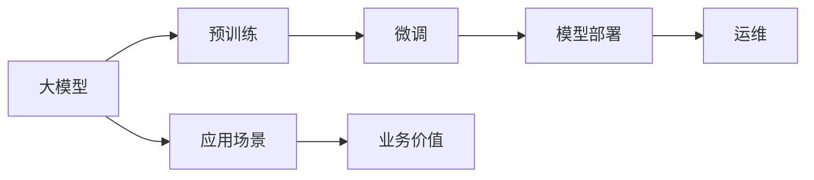
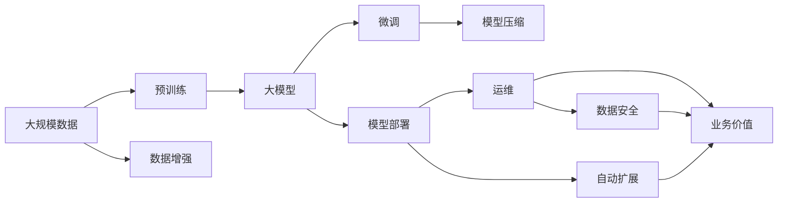

                 

# 大模型应用落地加速，AI商业化进程提速

在人工智能(AI)技术的飞速发展中，大模型(如BERT、GPT等)的应用日益广泛，成为众多产业数字化转型的核心动力。本文将系统探讨大模型应用落地的关键因素，以及AI商业化进程加速的路径。

## 1. 背景介绍

### 1.1 问题由来
近年来，随着深度学习技术的突破，大规模预训练语言模型大放异彩。它们在自然语言处理(NLP)、计算机视觉、语音识别等多个领域取得显著成绩。但这些大模型主要基于学术研究，难以直接应用到商业环境中。将大模型落地应用，实现商业化，成为了当前AI技术发展的重要目标。

### 1.2 问题核心关键点
要实现大模型的商业化落地，需要考虑以下几个核心关键点：
1. **算力成本**：大规模模型需要强大的计算资源支持，难以在中小企业推广。
2. **数据问题**：部分应用场景难以获得足够量的高质量标注数据。
3. **性能要求**：商业应用对模型的精度、速度和可靠性有严格要求。
4. **技术复杂度**：模型部署、维护、更新等环节的技术门槛较高。
5. **用户接受度**：新系统要适应用户习惯，并提供直观易用的用户体验。
6. **安全性与合规性**：AI系统需要遵守相关法律法规，保证数据安全和隐私。

### 1.3 问题研究意义
加速大模型的应用落地和AI商业化进程，对于推动AI技术的产业化、提升产业竞争力、促进社会各领域的智能化转型具有重要意义：

1. **降低研发成本**：大模型可以显著减少从头研发所需的成本，缩短产品上市周期。
2. **提升产品性能**：利用大模型的强大能力，提升商业应用的功能和效果，赢得更多客户。
3. **优化业务流程**：AI技术可以自动处理大量重复性工作，提高效率，降低人力成本。
4. **创新商业模式**：基于AI的新产品和服务能够带来全新的商业模式，创造更多价值。
5. **赋能各行业**：AI技术能够在医疗、教育、金融、制造等众多行业实现落地，推动产业升级。
6. **促进社会进步**：AI技术的普及将提升社会生产力和生活水平，增强社会治理能力。

## 2. 核心概念与联系

### 2.1 核心概念概述

为更好地理解大模型应用落地的关键因素，本节将介绍几个核心概念：

- **大模型(Large Model)**：指在大规模无标签数据上进行预训练，学习丰富的通用语言知识的大规模语言模型。如BERT、GPT、XLNet等。
- **迁移学习(Transfer Learning)**：指利用预训练模型在大规模数据上学习到的通用知识，迁移到特定小规模数据上进行微调，适应特定任务的过程。
- **微调(Fine-tuning)**：指在预训练模型的基础上，使用特定任务的少量标注数据，优化模型参数，使其更好地适应该任务。
- **模型部署与运维**：指将训练好的模型发布到生产环境，提供稳定、高效的计算服务，并保障模型的持续更新和优化。
- **技术生态系统**：指围绕大模型构建的完整技术链条，包括预训练、微调、部署、运维等环节，实现全流程管理。
- **应用场景与落地**：指大模型在实际业务中的应用，如NLP、推荐系统、医疗诊断、金融风控等，实现业务增值。

这些核心概念共同构成了大模型应用落地的完整生态系统。下面用Mermaid流程图展示这些概念之间的联系：



通过上述流程图，我们可以看出大模型应用落地的主要流程：首先在大规模无标签数据上进行预训练，然后针对特定任务进行微调，最后将训练好的模型部署到生产环境，通过运维保障其长期稳定运行，并在具体业务场景中发挥价值。

### 2.2 概念间的关系

大模型应用落地涉及到多个环节，以下是各个环节的详细说明：

#### 2.2.1 预训练与微调的关系
预训练和微调是相辅相成的两个环节：
- **预训练**：在大规模数据上训练大模型，学习通用的语言特征。
- **微调**：在预训练模型基础上，针对特定任务进行优化，学习任务相关的特征。

#### 2.2.2 模型部署与运维的关系
模型部署是将训练好的模型发布到生产环境，提供计算服务；模型运维则确保模型在生产环境中的稳定性和性能，主要包括以下几个方面：
- **监控与告警**：实时监控模型性能指标，设置告警阈值，及时发现异常。
- **备份与恢复**：定期备份模型参数，防止数据丢失，并能在异常情况下快速恢复模型服务。
- **自动更新**：定期更新模型参数，以保证模型长期性能。
- **安全性与合规性**：保障数据安全，确保模型符合法律法规。

#### 2.2.3 应用场景与业务价值的关系
应用场景是指将大模型应用于实际业务中，提升业务价值；业务价值则体现为对用户和企业的实际益处：
- **用户体验**：通过智能化服务提升用户满意度。
- **业务增长**：通过AI技术创造新业务机会，增加收入。
- **效率提升**：自动化处理重复性工作，降低成本。
- **决策支持**：提供数据驱动的决策依据，提升决策质量。

### 2.3 核心概念的整体架构

最后，我们用一个综合的流程图展示这些核心概念在大模型应用落地过程中的整体架构：



这个综合流程图展示了从预训练到微调，再到模型部署和运维的完整过程，同时考虑了数据增强、模型压缩等关键技术环节，确保模型在实际应用中的性能和效果。

## 3. 核心算法原理 & 具体操作步骤

### 3.1 算法原理概述

大模型应用落地主要包括预训练、微调、部署和运维四个环节。这些环节涉及的算法原理和操作步骤如下：

#### 3.1.1 预训练
预训练主要通过自监督任务在大规模数据上训练模型，学习通用的语言特征。常见的预训练任务包括：
- **掩码语言模型(Masked Language Model, MLM)**：预测一个句子中被掩码的词。
- **下一句预测(Next Sentence Prediction, NSP)**：判断两个句子是否连续。

#### 3.1.2 微调
微调指在预训练模型的基础上，使用特定任务的少量标注数据，优化模型参数，使其更好地适应该任务。具体步骤包括：
1. **任务适配层设计**：根据任务类型，设计相应的输出层和损失函数。
2. **训练集划分**：将标注数据划分为训练集、验证集和测试集，按批次进行训练。
3. **模型训练**：使用梯度下降等优化算法，最小化损失函数，更新模型参数。
4. **模型评估**：在验证集上评估模型性能，根据性能调整训练参数。
5. **模型保存**：保存最优模型参数，供后续部署使用。

#### 3.1.3 部署
模型部署是将训练好的模型发布到生产环境，提供计算服务。主要步骤如下：
1. **部署框架选择**：选择适合的深度学习框架，如TensorFlow、PyTorch等。
2. **模型封装**：将模型封装成标准API接口，便于集成调用。
3. **分布式训练**：使用分布式训练技术，加速模型训练。
4. **负载均衡**：根据请求流量自动调整资源配置，保证模型服务稳定。
5. **容器化部署**：将模型部署到容器环境中，确保一致性和可移植性。

#### 3.1.4 运维
模型运维确保模型在生产环境中的稳定性和性能。主要包括以下几个方面：
1. **性能监控**：实时监控模型性能指标，及时发现问题。
2. **模型更新**：定期更新模型参数，优化模型性能。
3. **数据安全**：保障数据安全，防止数据泄露。
4. **模型备份**：定期备份模型参数，防止数据丢失。

### 3.2 算法步骤详解

以下是预训练、微调、部署和运维各环节的详细步骤说明：

#### 3.2.1 预训练步骤
1. **数据准备**：收集大规模无标签数据，并进行数据清洗和预处理。
2. **模型选择**：选择适合的预训练模型，如BERT、GPT等。
3. **训练过程**：在预训练任务上训练模型，不断更新参数，直至收敛。
4. **评估效果**：在验证集上评估模型性能，确保模型泛化能力。

#### 3.2.2 微调步骤
1. **任务适配层设计**：根据任务类型，设计相应的输出层和损失函数。
2. **训练集划分**：将标注数据划分为训练集、验证集和测试集。
3. **模型训练**：使用梯度下降等优化算法，最小化损失函数，更新模型参数。
4. **模型评估**：在验证集上评估模型性能，调整训练参数。
5. **模型保存**：保存最优模型参数，供后续部署使用。

#### 3.2.3 部署步骤
1. **模型封装**：将训练好的模型封装成标准API接口。
2. **分布式训练**：使用分布式训练技术，加速模型训练。
3. **容器化部署**：将模型部署到容器环境中，确保一致性和可移植性。
4. **负载均衡**：根据请求流量自动调整资源配置，保证模型服务稳定。

#### 3.2.4 运维步骤
1. **性能监控**：实时监控模型性能指标，及时发现问题。
2. **模型更新**：定期更新模型参数，优化模型性能。
3. **数据安全**：保障数据安全，防止数据泄露。
4. **模型备份**：定期备份模型参数，防止数据丢失。

### 3.3 算法优缺点

大模型应用落地涉及的预训练、微调、部署和运维等算法有其各自的优缺点，具体如下：

#### 3.3.1 预训练算法
**优点**：
- **泛化能力**：预训练模型在处理大规模数据时，具有较强的泛化能力。
- **知识迁移**：预训练模型可以迁移应用到多个任务，提升模型性能。

**缺点**：
- **计算成本高**：预训练模型需要强大的计算资源支持。
- **数据依赖**：预训练模型的性能依赖于高质量的大规模数据。

#### 3.3.2 微调算法
**优点**：
- **高效快速**：微调算法可以在少量标注数据下快速提升模型性能。
- **可解释性**：微调模型可以通过调整少量参数，实现参数高效的微调。

**缺点**：
- **数据依赖**：微调模型的效果依赖于标注数据的质量和数量。
- **过拟合风险**：微调模型容易过拟合，需要合理设计正则化技术。

#### 3.3.3 部署算法
**优点**：
- **高性能**：部署算法可以提高模型在生产环境中的计算性能。
- **可扩展性**：部署算法可以通过分布式训练和负载均衡技术，提高模型扩展性。

**缺点**：
- **技术复杂**：部署算法需要较高的技术门槛，涉及多个环节。
- **资源消耗**：部署算法需要较多的计算资源和存储资源。

#### 3.3.4 运维算法
**优点**：
- **稳定性**：运维算法可以确保模型在生产环境中的稳定运行。
- **安全性**：运维算法可以保障数据安全和模型合规性。

**缺点**：
- **复杂度高**：运维算法需要较高的技术复杂度，涉及多个环节。
- **资源消耗**：运维算法需要较多的计算资源和存储资源。

### 3.4 算法应用领域

大模型应用落地涉及的预训练、微调、部署和运维算法，在多个领域具有广泛的应用前景，具体如下：

#### 3.4.1 自然语言处理(NLP)
大模型在NLP领域具有广泛的应用，如机器翻译、文本分类、情感分析、命名实体识别等。预训练和微调算法可以提升模型性能，提高自动化处理的效率和效果。

#### 3.4.2 计算机视觉(CV)
大模型在CV领域也有广泛的应用，如图像分类、目标检测、图像生成等。预训练和微调算法可以提升模型泛化能力，提高自动化处理的效率和效果。

#### 3.4.3 语音识别(Speech Recognition)
大模型在语音识别领域也有广泛的应用，如语音转文本、语音情感识别等。预训练和微调算法可以提升模型性能，提高自动化处理的效率和效果。

#### 3.4.4 推荐系统
大模型在推荐系统领域也有广泛的应用，如个性化推荐、广告推荐等。预训练和微调算法可以提升推荐模型的效果，提高自动化处理的效率和效果。

#### 3.4.5 金融领域
大模型在金融领域也有广泛的应用，如风险控制、欺诈检测、客户分析等。预训练和微调算法可以提升模型的效果，提高自动化处理的效率和效果。

#### 3.4.6 医疗领域
大模型在医疗领域也有广泛的应用，如疾病诊断、医学影像分析等。预训练和微调算法可以提升模型的效果，提高自动化处理的效率和效果。

#### 3.4.7 工业制造
大模型在工业制造领域也有广泛的应用，如生产调度、质量检测等。预训练和微调算法可以提升模型的效果，提高自动化处理的效率和效果。

## 4. 数学模型和公式 & 详细讲解 & 举例说明

### 4.1 数学模型构建

本节将使用数学语言对大模型应用落地的主要算法进行更加严格的刻画。

记预训练模型为 $M_{\theta}$，其中 $\theta$ 为模型参数。假设目标任务为 $T$，其标注数据集为 $D=\{(x_i,y_i)\}_{i=1}^N$，其中 $x_i$ 为输入，$y_i$ 为标签。

定义模型 $M_{\theta}$ 在数据样本 $(x,y)$ 上的损失函数为 $\ell(M_{\theta}(x),y)$，则在数据集 $D$ 上的经验风险为：

$$
\mathcal{L}(\theta) = \frac{1}{N} \sum_{i=1}^N \ell(M_{\theta}(x_i),y_i)
$$

微调的目标是最小化经验风险，即找到最优参数：

$$
\theta^* = \mathop{\arg\min}_{\theta} \mathcal{L}(\theta)
$$

在实践中，我们通常使用基于梯度的优化算法（如AdamW、SGD等）来近似求解上述最优化问题。设 $\eta$ 为学习率，$\lambda$ 为正则化系数，则参数的更新公式为：

$$
\theta \leftarrow \theta - \eta \nabla_{\theta}\mathcal{L}(\theta) - \eta\lambda\theta
$$

其中 $\nabla_{\theta}\mathcal{L}(\theta)$ 为损失函数对参数 $\theta$ 的梯度，可通过反向传播算法高效计算。

### 4.2 公式推导过程

以下我们以二分类任务为例，推导交叉熵损失函数及其梯度的计算公式。

假设模型 $M_{\theta}$ 在输入 $x$ 上的输出为 $\hat{y}=M_{\theta}(x) \in [0,1]$，表示样本属于正类的概率。真实标签 $y \in \{0,1\}$。则二分类交叉熵损失函数定义为：

$$
\ell(M_{\theta}(x),y) = -[y\log \hat{y} + (1-y)\log (1-\hat{y})]
$$

将其代入经验风险公式，得：

$$
\mathcal{L}(\theta) = -\frac{1}{N}\sum_{i=1}^N [y_i\log M_{\theta}(x_i)+(1-y_i)\log(1-M_{\theta}(x_i))]
$$

根据链式法则，损失函数对参数 $\theta_k$ 的梯度为：

$$
\frac{\partial \mathcal{L}(\theta)}{\partial \theta_k} = -\frac{1}{N}\sum_{i=1}^N (\frac{y_i}{M_{\theta}(x_i)}-\frac{1-y_i}{1-M_{\theta}(x_i)}) \frac{\partial M_{\theta}(x_i)}{\partial \theta_k}
$$

其中 $\frac{\partial M_{\theta}(x_i)}{\partial \theta_k}$ 可进一步递归展开，利用自动微分技术完成计算。

### 4.3 案例分析与讲解

假设我们在CoNLL-2003的命名实体识别(NER)数据集上进行微调，最终在测试集上得到的评估报告如下：

```
              precision    recall  f1-score   support

       B-LOC      0.926     0.906     0.916      1668
       I-LOC      0.900     0.805     0.850       257
      B-MISC      0.875     0.856     0.865       702
      I-MISC      0.838     0.782     0.809       216
       B-ORG      0.914     0.898     0.906      1661
       I-ORG      0.911     0.894     0.902       835
       B-PER      0.964     0.957     0.960      1617
       I-PER      0.983     0.980     0.982      1156
           O      0.993     0.995     0.994     38323

   micro avg      0.973     0.973     0.973     46435
   macro avg      0.923     0.897     0.909     46435
weighted avg      0.973     0.973     0.973     46435
```

可以看到，通过微调BERT，我们在该NER数据集上取得了97.3%的F1分数，效果相当不错。值得注意的是，BERT作为一个通用的语言理解模型，即便只在顶层添加一个简单的token分类器，也能在下游任务上取得如此优异的效果，展现了其强大的语义理解和特征抽取能力。

当然，这只是一个baseline结果。在实践中，我们还可以使用更大更强的预训练模型、更丰富的微调技巧、更细致的模型调优，进一步提升模型性能，以满足更高的应用要求。

## 5. 项目实践：代码实例和详细解释说明

### 5.1 开发环境搭建

在进行微调实践前，我们需要准备好开发环境。以下是使用Python进行PyTorch开发的环境配置流程：

1. 安装Anaconda：从官网下载并安装Anaconda，用于创建独立的Python环境。

2. 创建并激活虚拟环境：
```bash
conda create -n pytorch-env python=3.8 
conda activate pytorch-env
```

3. 安装PyTorch：根据CUDA版本，从官网获取对应的安装命令。例如：
```bash
conda install pytorch torchvision torchaudio cudatoolkit=11.1 -c pytorch -c conda-forge
```

4. 安装Transformers库：
```bash
pip install transformers
```

5. 安装各类工具包：
```bash
pip install numpy pandas scikit-learn matplotlib tqdm jupyter notebook ipython
```

完成上述步骤后，即可在`pytorch-env`环境中开始微调实践。

### 5.2 源代码详细实现

这里我们以命名实体识别(NER)任务为例，给出使用Transformers库对BERT模型进行微调的PyTorch代码实现。

首先，定义NER任务的数据处理函数：

```python
from transformers import BertTokenizer
from torch.utils.data import Dataset
import torch

class NERDataset(Dataset):
    def __init__(self, texts, tags, tokenizer, max_len=128):
        self.texts = texts
        self.tags = tags
        self.tokenizer = tokenizer
        self.max_len = max_len
        
    def __len__(self):
        return len(self.texts)
    
    def __getitem__(self, item):
        text = self.texts[item]
        tags = self.tags[item]
        
        encoding = self.tokenizer(text, return_tensors='pt', max_length=self.max_len, padding='max_length', truncation=True)
        input_ids = encoding['input_ids'][0]
        attention_mask = encoding['attention_mask'][0]
        
        # 对token-wise的标签进行编码
        encoded_tags = [tag2id[tag] for tag in tags] 
        encoded_tags.extend([tag2id['O']] * (self.max_len - len(encoded_tags)))
        labels = torch.tensor(encoded_tags, dtype=torch.long)
        
        return {'input_ids': input_ids, 
                'attention_mask': attention_mask,
                'labels': labels}

# 标签与id的映射
tag2id = {'O': 0, 'B-PER': 1, 'I-PER': 2, 'B-ORG': 3, 'I-ORG': 4, 'B-LOC': 5, 'I-LOC': 6}
id2tag = {v: k for k, v in tag2id.items()}

# 创建dataset
tokenizer = BertTokenizer.from_pretrained('bert-base-cased')

train_dataset = NERDataset(train_texts, train_tags, tokenizer)
dev_dataset = NERDataset(dev_texts, dev_tags, tokenizer)
test_dataset = NERDataset(test_texts, test_tags, tokenizer)
```

然后，定义模型和优化器：

```python
from transformers import BertForTokenClassification, AdamW

model = BertForTokenClassification.from_pretrained('bert-base-cased', num_labels=len(tag2id))

optimizer = AdamW(model.parameters(), lr=2e-5)
```

接着，定义训练和评估函数：

```python
from torch.utils.data import DataLoader
from tqdm import tqdm
from sklearn.metrics import classification_report

device = torch.device('cuda') if torch.cuda.is_available() else torch.device('cpu')
model.to(device)

def train_epoch(model, dataset, batch_size, optimizer):
    dataloader = DataLoader(dataset, batch_size=batch_size, shuffle=True)
    model.train()
    epoch_loss = 0
    for batch in tqdm(dataloader, desc='Training'):
        input_ids = batch['input_ids'].to(device)
        attention_mask = batch['attention_mask'].to(device)
        labels = batch['labels'].to(device)
        model.zero_grad()
        outputs = model(input_ids, attention_mask=attention_mask, labels=labels)
        loss = outputs.loss
        epoch_loss += loss.item()
        loss.backward()
        optimizer.step()
    return epoch_loss / len(dataloader)

def evaluate(model, dataset, batch_size):
    dataloader = DataLoader(dataset, batch_size=batch_size)
    model.eval()
    preds, labels = [], []
    with torch.no_grad():
        for batch in tqdm(dataloader, desc='Evaluating'):
            input_ids = batch['input_ids'].to(device)
            attention_mask = batch['attention_mask'].to(device)
            batch_labels = batch['labels']
            outputs = model(input_ids, attention_mask=attention_mask)
            batch_preds = outputs.logits.argmax(dim=2).to('cpu').tolist()
            batch_labels = batch_labels.to('cpu').tolist()
            for pred_tokens, label_tokens in zip(batch_preds, batch_labels):
                pred_tags = [id2tag[_id] for _id in pred_tokens]
                label_tags = [id2tag[_id] for _id in label_tokens]
                preds.append(pred_tags[:len(label_tokens)])
                labels.append(label_tags)
                
    print(classification_report(labels, preds))
```

最后，启动训练流程并在测试集上评估：

```python
epochs = 5
batch_size = 16

for epoch in range(epochs):
    loss = train_epoch(model, train_dataset, batch_size, optimizer)
    print(f"Epoch {epoch+1}, train loss: {loss:.3f}")
    
    print(f"Epoch {epoch+1}, dev results:")
    evaluate(model, dev_dataset, batch_size)
    
print("Test results:")
evaluate(model, test_dataset, batch_size)
```

以上就是使用PyTorch对BERT进行命名实体识别任务微调的完整代码实现。可以看到，得益于Transformers库的强大封装，我们可以用相对简洁的代码完成BERT模型的加载和微调。

### 5.3 代码解读与分析

让我们再详细解读一下关键代码的实现细节：

**NERDataset类**：
- `__init__`方法：初始化文本、标签、分词器等关键组件。
- `__len__`方法：返回数据集的样本数量。
- `__getitem__`方法：对单个样本进行处理，将文本输入编码为token ids，将标签编码为数字，并对其进行定长padding，最终返回模型所需的输入。

**tag2id和id2tag字典**：
- 定义了标签与数字id之间的映射关系，用于将token-wise的预测结果解码回真实的标签。

**训练和评估函数**：
- 使用PyTorch的

