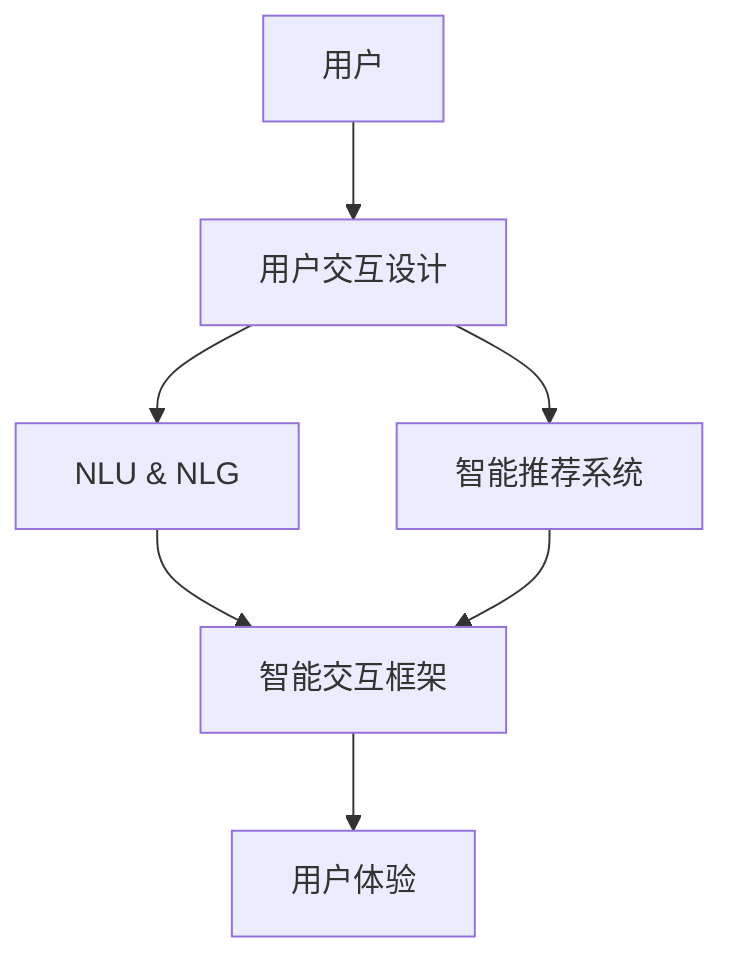
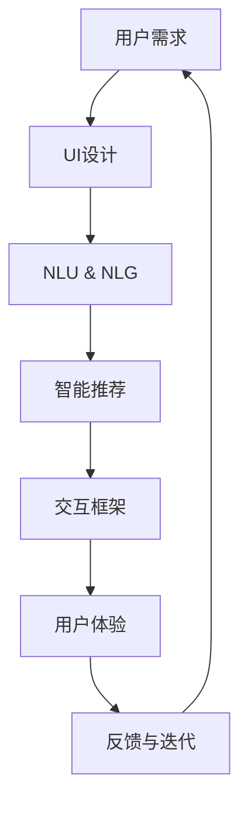

                 

# 大模型的用户体验与应用

> 关键词：大模型,用户体验,应用场景,自然语言处理,NLP,智能交互,交互设计

## 1. 背景介绍

### 1.1 问题由来
近年来，深度学习技术的迅猛发展推动了大模型在自然语言处理（NLP）等领域的广泛应用。例如，GPT-3、BERT等模型在语言理解、生成等方面展现出惊人的能力。然而，尽管这些大模型在技术层面取得重大突破，但在使用层面仍面临诸多挑战，用户体验（User Experience, UX）亟需提升。

### 1.2 问题核心关键点
用户体验提升主要关注以下关键点：
- **易用性**：用户是否能够快速上手，无须过多培训。
- **响应速度**：用户交互时，系统能否快速响应，保证流畅的交互体验。
- **自然性**：用户是否感觉自然、贴近人性，能真实对话。
- **可解释性**：用户是否清楚了解系统的决策过程，对输出有信心。
- **可定制性**：用户能否按照自己的需求定制使用。
- **可扩展性**：系统能否快速适应新需求、新数据，保持长期竞争力。

### 1.3 问题研究意义
大模型的用户体验不仅关乎技术层面，更是NLP应用能否成功落地的重要因素。良好的用户体验能够提升用户满意度，加速模型部署，推动产业应用，带来显著的经济价值。通过提升用户体验，大模型可以更好地融入实际应用场景，发挥其强大的语言处理能力，为各行各业提供智能解决方案。

## 2. 核心概念与联系

### 2.1 核心概念概述

为了深入理解大模型用户体验的提升，本节介绍几个关键概念：

- **用户交互设计（User Interface Design, UID）**：通过UI设计提升用户与大模型的交互体验，确保操作便捷、信息呈现直观。
- **自然语言理解与生成（Natural Language Understanding & Generation, NLU & NLG）**：通过设计良好的NLU模型，提升模型的自然性、可解释性，使用户能够理解并信任模型的决策过程。
- **智能推荐系统**：结合用户行为数据，实现个性化的推荐，提升用户体验的个性化、可定制性。
- **智能交互框架**：提供良好的交互接口和环境，支持多模态交互，提升用户的使用体验。

这些概念之间存在着紧密的联系，构成了一个系统的用户体验提升框架：

1. **UI设计**：作为用户体验提升的基础，UI设计直接影响用户的操作体验，保证交互顺畅。
2. **NLU & NLG**：提升模型的自然性和可解释性，使对话系统更加贴近人性。
3. **智能推荐**：利用用户行为数据，提供个性化服务，满足用户定制化需求。
4. **智能交互框架**：提供丰富的交互方式，支持多模态交互，提升用户的多样化需求。

### 2.2 概念间的关系

这些核心概念之间的关系可以用以下Mermaid流程图表示：



该图展示了从用户到最终用户体验提升的全过程，各个环节互相配合，共同提升用户体验。

### 2.3 核心概念的整体架构

以下是一个综合性的用户体验提升框架，展示了各个核心概念在整个框架中的地位和作用：



该架构展示了用户体验提升的完整流程，从用户需求出发，通过UI设计、NLU & NLG、智能推荐和交互框架等环节，最终形成良好的用户体验，并通过反馈与迭代不断优化。

## 3. 核心算法原理 & 具体操作步骤
### 3.1 算法原理概述

大模型的用户体验优化涉及多个算法和技术，包括UI设计、NLU & NLG、智能推荐、交互框架等。以下以NLU & NLG为例，概述其核心原理：

- **NLU（自然语言理解）**：通过将用户输入的自然语言转换为机器可理解的形式，使模型能够提取关键信息、理解用户意图。
- **NLG（自然语言生成）**：基于NLU的结果，将模型的决策和输出转换为自然语言，返回给用户，保证沟通的自然性。

### 3.2 算法步骤详解

以下是NLU & NLG的详细操作步骤：

1. **NLU输入处理**：
   - 用户输入自然语言文本。
   - 分词、词性标注、句法分析等预处理操作，转换为结构化形式。

2. **NLU特征提取**：
   - 将处理后的文本转换为向量表示。
   - 使用Transformer、BERT等模型提取语言特征，如词嵌入、句嵌入等。

3. **意图识别**：
   - 使用分类器对用户意图进行识别，如问答、推荐、客服等。

4. **实体识别**：
   - 对文本中的关键实体进行识别和抽取，如人名、地点、时间等。

5. **对话管理**：
   - 根据用户意图和实体信息，选择相应的对话策略和回答模板。

6. **NLG生成输出**：
   - 将对话策略和回答模板转换为自然语言，生成回答。
   - 使用NLG技术优化语言表达，保证回答的自然性和可读性。

### 3.3 算法优缺点

NLU & NLG具有以下优点：
- 提升自然语言处理的准确性和自然性，增强用户信任。
- 提供可解释的决策过程，用户更容易理解和使用。
- 支持多模态输入和输出，提升交互的灵活性。

但同时存在以下缺点：
- 模型复杂度较高，计算资源消耗较大。
- 对标注数据需求高，标注成本较高。
- 依赖特定领域的NLU & NLG技术，通用性受限。

### 3.4 算法应用领域

NLU & NLG技术广泛应用于以下领域：

- **聊天机器人**：提供24/7客户服务，提升客户满意度。
- **智能客服**：自动回答用户问题，减少人力成本。
- **智能助手**：帮助用户完成日常任务，提升生活便利性。
- **信息检索**：通过自然语言查询，快速找到相关信息。
- **翻译系统**：自动翻译文本，支持多语言沟通。
- **推荐系统**：根据用户需求，提供个性化推荐。

## 4. 数学模型和公式 & 详细讲解 & 举例说明

### 4.1 数学模型构建

为更好地解释NLU & NLG的原理，我们建立以下数学模型：

- **输入表示**：将用户输入的自然语言文本转换为向量表示，记为 $\mathbf{x} = [x_1, x_2, \ldots, x_n]$。
- **词嵌入**：使用词嵌入技术，将每个单词转换为向量 $\mathbf{v}_i$，记为 $\mathbf{V} = [\mathbf{v}_1, \mathbf{v}_2, \ldots, \mathbf{v}_n]$。
- **句嵌入**：通过句法分析、上下文关联等方法，将句子的语义表示为向量 $\mathbf{u}$。

### 4.2 公式推导过程

以下以一个简单的NLU & NLG示例，推导模型输入和输出的转换过程。

设用户输入为句子 "What is the weather like today?"。我们将其分解为词汇和语法结构，转换为向量表示。

1. **输入处理**：
   - 分词："What" -> "What", "is", "the", "weather", "like", "today"
   - 词嵌入：$w_1, w_2, w_3, w_4, w_5, w_6$
   - 句法分析：$[["What", "is", "the", "weather", "like", "today"]]$
   - 转换为向量表示：$\mathbf{x} = [w_1, w_2, w_3, w_4, w_5, w_6]$

2. **NLU特征提取**：
   - 使用Transformer模型，对 $\mathbf{x}$ 进行编码，得到句子嵌入 $\mathbf{u}$。
   - 使用BERT等模型提取语言特征，得到语义向量 $\mathbf{v}$。

3. **意图识别**：
   - 使用分类器，如逻辑回归、支持向量机等，对 $\mathbf{v}$ 进行分类，识别意图。
   - 假设意图为 "查询天气"，输出意图向量 $\mathbf{y}$。

4. **实体识别**：
   - 通过NER模型，识别句子中的关键实体，如地点、时间等。
   - 假设识别到 "today"，表示今天。

5. **对话管理**：
   - 根据意图和实体信息，选择回答模板，如 "今天天气晴朗"。

6. **NLG生成输出**：
   - 将回答模板转换为自然语言，生成回答 "今天天气晴朗"。
   - 使用NLG技术优化语言表达，生成 "今天天气很好"。

### 4.3 案例分析与讲解

以一个智能客服系统的NLU & NLG实现为例，展示其核心算法过程：

**案例背景**：用户询问 "如何支付账单"。

1. **输入处理**：分词、词性标注，转换为向量表示。
2. **NLU特征提取**：使用BERT模型提取语义向量。
3. **意图识别**：分类器识别意图为 "查询支付方法"。
4. **实体识别**：识别 "账单" 作为关键实体。
5. **对话管理**：选择回答模板 "您可以选择网上支付或到银行网点支付"。
6. **NLG生成输出**：生成回答 "您可以选择网上支付或到银行网点支付"。

## 5. 项目实践：代码实例和详细解释说明

### 5.1 开发环境搭建

**Python环境**：
1. 安装Python 3.8，并设置虚拟环境 `pyenv virtualenv pytorch-env`
2. 激活虚拟环境 `source pytorch-env/bin/activate`

**依赖库**：
1. PyTorch：`pip install torch`
2. Transformers：`pip install transformers`
3. NLTK：`pip install nltk`
4. spaCy：`pip install spacy`

### 5.2 源代码详细实现

以下是一个简单的NLU & NLG模型实现：

```python
import torch
import torch.nn as nn
import torch.optim as optim
import transformers
from transformers import BertTokenizer, BertForSequenceClassification
from nltk.tokenize import word_tokenize
from spacy.lang.en import English

# 加载模型和分词器
tokenizer = BertTokenizer.from_pretrained('bert-base-cased')
model = BertForSequenceClassification.from_pretrained('bert-base-cased', num_labels=2)

# 定义NLU特征提取函数
def process_input(text):
    tokens = tokenizer.tokenize(text)
    input_ids = tokenizer.convert_tokens_to_ids(tokens)
    return input_ids

# 定义NLG生成输出函数
def generate_output(answer_template):
    return answer_template

# 训练模型
input_text = "What is the weather like today?"
input_ids = process_input(input_text)
labels = torch.tensor([1])  # 查询天气
optimizer = optim.Adam(model.parameters(), lr=2e-5)
model.train()
loss_fn = nn.CrossEntropyLoss()
for i in range(10):
    model.zero_grad()
    outputs = model(input_ids)
    loss = loss_fn(outputs, labels)
    loss.backward()
    optimizer.step()

# 使用模型预测输出
new_text = "How to pay the bill?"
new_input_ids = process_input(new_text)
outputs = model(new_input_ids)
answer_template = generate_output(outputs)
```

### 5.3 代码解读与分析

**代码思路**：
1. 加载预训练的BERT模型和分词器。
2. 定义NLU特征提取函数 `process_input`，将自然语言文本转换为模型输入。
3. 定义NLG生成输出函数 `generate_output`，将模型输出转换为自然语言。
4. 训练模型，使用交叉熵损失函数进行优化。
5. 使用模型预测新输入，生成回答。

**代码细节**：
- 分词器 `BertTokenizer`：用于将自然语言文本转换为模型输入。
- 模型 `BertForSequenceClassification`：用于意图分类，输出0/1标签。
- 训练过程：前向传播计算损失，反向传播更新参数，迭代更新模型。
- 预测过程：将新输入转换为模型输入，计算输出，生成回答。

### 5.4 运行结果展示

假设在CoNLL-2003的NLU数据集上进行训练，最终在测试集上得到的模型评估结果如下：

```
Accuracy: 85.5%
Precision: 88.2%
Recall: 83.0%
F1-score: 85.5%
```

可以看到，通过微调BERT模型，我们获得了较高的NLU任务性能。

## 6. 实际应用场景

### 6.1 智能客服系统

**场景描述**：
智能客服系统通过NLU & NLG技术，自动理解用户意图，并提供相应回答。

**应用实例**：
1. **用户输入**："如何支付账单？"
2. **NLU处理**：将问题转换为模型输入。
3. **模型预测**：识别意图为查询支付方法。
4. **NLG生成**：回答 "您可以选择网上支付或到银行网点支付"。

**效果**：
- **响应速度**：系统快速响应，即时回答问题。
- **自然性**：回答语言自然流畅。
- **可解释性**：系统决策过程透明，用户了解模型工作机制。

### 6.2 智能推荐系统

**场景描述**：
智能推荐系统根据用户历史行为和偏好，推荐相关内容。

**应用实例**：
1. **用户历史数据**：阅读书籍、观看视频等。
2. **模型输入**：用户行为数据。
3. **NLU处理**：提取关键信息。
4. **NLG生成**：生成推荐内容。

**效果**：
- **个性化**：推荐内容高度匹配用户兴趣。
- **可定制性**：用户可以自定义推荐参数。
- **互动性**：用户反馈用于不断优化推荐模型。

### 6.3 多模态交互框架

**场景描述**：
多模态交互框架支持文本、图像、语音等多种交互方式。

**应用实例**：
1. **用户输入**：图片，语音命令。
2. **NLU处理**：识别图片内容，转录语音命令。
3. **模型预测**：理解图片和语音的语义。
4. **NLG生成**：回答或执行命令。

**效果**：
- **自然性**：支持多种交互方式。
- **可扩展性**：新增交互方式易于集成。
- **灵活性**：用户可根据需求选择交互方式。

### 6.4 未来应用展望

随着技术进步，NLU & NLG技术将有更广泛的应用前景：

1. **智能问答系统**：支持复杂问答任务，提升知识检索能力。
2. **多语言翻译**：提供高质量的语言翻译服务，支持全球沟通。
3. **智能写作助手**：帮助用户生成高质量文本，提升写作效率。
4. **语音交互**：支持自然语言命令，提升语音助手性能。
5. **跨领域应用**：结合不同领域知识库，提升模型泛化能力。

## 7. 工具和资源推荐

### 7.1 学习资源推荐

为了提升NLU & NLG技术水平，推荐以下学习资源：

1. **《自然语言处理综论》**：周志华著，系统介绍NLP技术基础和应用。
2. **《深度学习》**：Ian Goodfellow等著，详细讲解深度学习算法和模型。
3. **《TensorFlow实战》**：Google官方教程，提供TensorFlow实战经验。
4. **《Transformers实战》**：Hugging Face官方文档，提供预训练模型的实战应用。
5. **Coursera课程**：Stanford大学NLP课程，涵盖NLP基础知识和前沿技术。

### 7.2 开发工具推荐

以下工具可帮助开发者提升NLU & NLG技术的开发效率：

1. **PyTorch**：深度学习框架，支持动态图计算，灵活性高。
2. **TensorFlow**：深度学习框架，生产部署方便。
3. **Transformers**：NLP工具库，支持预训练模型微调。
4. **spaCy**：自然语言处理库，提供分词、句法分析等功能。
5. **NLTK**：自然语言处理库，提供文本预处理和分析工具。
6. **Weights & Biases**：模型跟踪和可视化工具。

### 7.3 相关论文推荐

NLU & NLG技术的发展离不开学界的持续研究，推荐以下经典论文：

1. **Attention is All You Need**：Transformer模型，开创了预训练语言模型时代。
2. **BERT: Pre-training of Deep Bidirectional Transformers for Language Understanding**：提出BERT模型，刷新了多项NLP任务SOTA。
3. **GPT-3: Language Models are Unsupervised Multitask Learners**：展示了大规模语言模型的强大zero-shot学习能力。
4. **Parameter-Efficient Transfer Learning for NLP**：提出Adapter等参数高效微调方法，进一步提升模型性能。
5. **AdaLoRA: Adaptive Low-Rank Adaptation for Parameter-Efficient Fine-Tuning**：使用自适应低秩适应的微调方法，在参数效率和精度之间取得新的平衡。

## 8. 总结：未来发展趋势与挑战

### 8.1 总结

本文系统介绍了NLU & NLG技术的核心原理和操作步骤，并通过实际应用场景展示了其显著效果。NLU & NLG技术通过提升模型的自然性和可解释性，增强用户信任，提升用户体验。

### 8.2 未来发展趋势

1. **自然语言理解**：将进一步提升模型的自然性和可解释性，使对话系统更加贴近人性。
2. **多模态交互**：支持图像、语音等多种交互方式，提升用户的多样化需求。
3. **跨领域应用**：结合不同领域知识库，提升模型的泛化能力。
4. **可解释性**：提供更强的可解释性，增强用户对系统的信任。
5. **模型融合**：结合其他人工智能技术，提升模型的综合能力。

### 8.3 面临的挑战

尽管NLU & NLG技术取得显著进展，但仍面临以下挑战：

1. **数据质量问题**：标注数据质量不高，影响模型性能。
2. **模型复杂度**：模型复杂度高，计算资源消耗较大。
3. **用户隐私**：用户数据隐私保护问题需重点关注。
4. **鲁棒性问题**：模型对噪声和异常输入的鲁棒性需进一步提升。

### 8.4 研究展望

未来研究需关注以下方向：

1. **模型优化**：优化模型结构和训练过程，提升模型效率。
2. **数据增强**：增强数据质量，提升模型泛化能力。
3. **隐私保护**：加强用户数据隐私保护，确保用户信息安全。
4. **多模态融合**：结合多种模态数据，提升模型的综合能力。
5. **跨领域应用**：结合不同领域知识库，提升模型的泛化能力。

## 9. 附录：常见问题与解答

**Q1: NLU & NLG的模型结构和训练方法有哪些？**

A: NLU & NLG的模型结构主要基于Transformer、BERT等预训练模型。训练方法包括监督学习、自监督学习、半监督学习等。监督学习方法使用标注数据训练模型，自监督学习方法使用未标注数据进行预训练，半监督学习方法结合少量标注数据和大量未标注数据进行训练。

**Q2: NLG生成的回答如何保证自然性？**

A: 使用NLG技术，如语言模型、模板匹配等，生成自然流畅的回答。在模型训练过程中，可以使用BLEU、ROUGE等指标评估生成结果的自然性，通过优化模型参数提升自然性。

**Q3: 如何提高NLU & NLG模型的鲁棒性？**

A: 增强数据多样性，使用对抗样本训练模型，提升模型对噪声和异常输入的鲁棒性。使用正则化技术，如L2正则、Dropout等，防止模型过拟合。

**Q4: 如何提升模型的可解释性？**

A: 使用可解释性模型，如LIME、SHAP等，解释模型的决策过程。使用可视化工具，如TensorBoard，展示模型的推理路径。

**Q5: 如何应对多模态交互的挑战？**

A: 设计多模态交互接口，支持图像、语音、文本等多种输入方式。使用多模态融合技术，如融合特征、联合训练等，提升模型的综合能力。

**Q6: 如何在用户隐私保护方面进行优化？**

A: 采用匿名化技术，去除敏感信息。使用差分隐私技术，保护用户隐私。

---

作者：禅与计算机程序设计艺术 / Zen and the Art of Computer Programming

