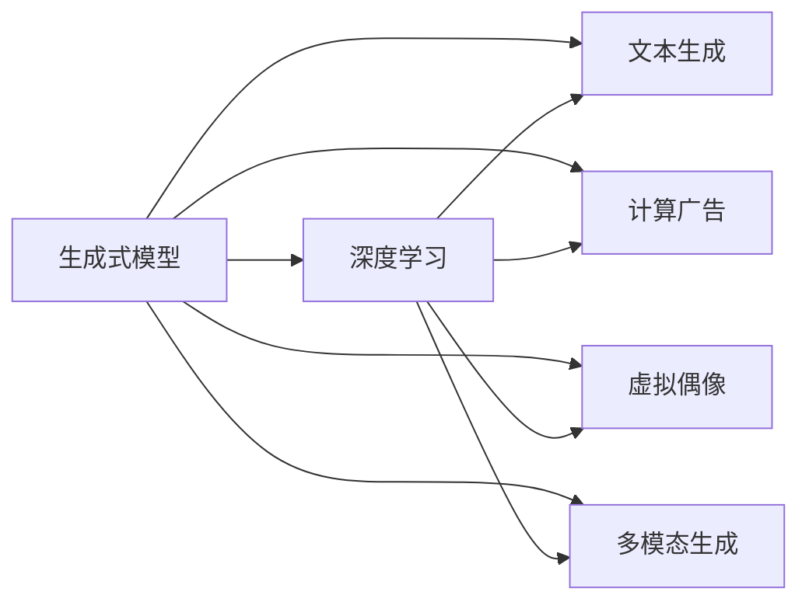
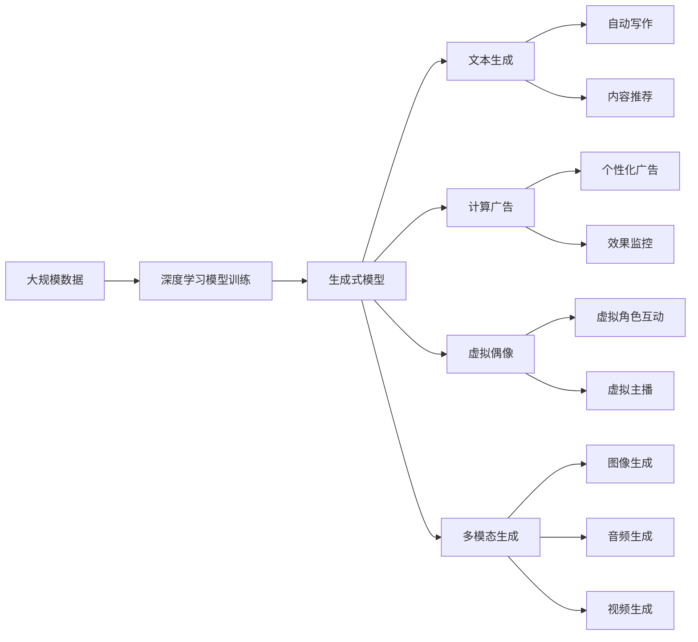

                 

# 生成式AIGC：数据驱动的商业创新

> 关键词：生成式AIGC,商业创新,数据驱动,自然语言处理,深度学习,文本生成,计算广告,虚拟偶像

## 1. 背景介绍

### 1.1 问题由来
人工智能生成内容（AI Generated Content, AIGC）近年来随着深度学习技术的迅速发展，已经成为驱动数字经济增长的新引擎。生成式模型通过学习大量数据，能够自动生成文本、图像、音频等多种类型的内容，为数字媒体、广告、娱乐、教育等多个行业带来了颠覆性的变革。

AIGC的核心技术包括自然语言处理（Natural Language Processing, NLP）和深度学习模型，其中生成式模型具有自动编码和解码复杂结构的能力，能够高效地生成高质量的内容。当前主流的生成式模型主要有循环神经网络（RNN）、变分自编码器（VAE）、生成对抗网络（GAN）、自回归语言模型（如GPT系列）、自编码器（如BERT）等。

### 1.2 问题核心关键点
AIGC技术在商业创新中扮演着至关重要的角色，具体表现在以下几个方面：

- **内容生产自动化**：能够自动生成新闻、报告、商品描述等文字内容，大幅降低内容创作成本。
- **用户体验优化**：通过智能推荐、个性化生成等方式，提升用户的互动体验。
- **业务效率提升**：利用生成式内容辅助决策、广告投放等，提高业务执行效率。
- **品牌影响力提升**：通过生成式内容进行品牌宣传、虚拟代言，增强品牌认知度和影响力。
- **市场竞争优势**：生成式内容作为一种创新手段，能够为企业在激烈的市场竞争中赢得先机。

### 1.3 问题研究意义
研究AIGC技术在商业创新中的应用，对于推动数字经济转型、提升企业竞争力和市场影响力具有重要意义：

1. **降低成本**：大幅降低内容创作和生产成本，提高运营效率。
2. **提高质量**：生成式模型能生成高质量、一致性强的内容，满足不同场景下的内容需求。
3. **加速创新**：生成式内容支持快速迭代和个性化定制，推动新产品、新服务的开发和发布。
4. **增强体验**：通过自然语言理解和生成，提高用户互动体验，增强用户粘性。
5. **拓展应用**：生成式技术可以应用于更多领域，如教育、医疗、科研等，促进技术的跨界融合。

## 2. 核心概念与联系

### 2.1 核心概念概述

为更好地理解AIGC在商业创新中的应用，本节将介绍几个关键概念：

- **生成式模型**：能够自动生成数据的新模型，如RNN、VAE、GAN、Transformer等。通过学习大量数据，生成式模型能够生成符合特定风格和语境的内容。

- **深度学习**：一种基于神经网络的机器学习方法，能够从数据中学习复杂的关系和模式，实现自动编码和解码。深度学习是生成式模型的基础。

- **文本生成**：生成式模型在文本领域的主要应用，如文本摘要、自动生成文章、对话系统等。文本生成需要考虑语言的语义、语法、逻辑等复杂特征。

- **计算广告**：利用生成式内容进行广告投放，提高广告的效果和转化率。计算广告的核心是生成与广告相关的高质量文本和视觉内容。

- **虚拟偶像**：利用生成式模型生成具有人格特征和表现力的虚拟角色，用于娱乐、营销等场景。虚拟偶像能够进行自然流畅的交互，提供逼真的用户体验。

- **多模态生成**：生成式模型不仅限于文本生成，还可以生成图像、音频、视频等多种类型的内容，实现多模态融合和交互。

这些概念之间存在紧密的联系，形成一个完整的AIGC生态系统。生成式模型作为核心技术，通过深度学习技术对大量数据进行建模，实现文本、图像等多种内容的自动生成。

### 2.2 概念间的关系

这些核心概念之间的关系可以通过以下Mermaid流程图来展示：



这个流程图展示了生成式模型如何通过深度学习技术，驱动文本生成、计算广告、虚拟偶像、多模态生成等多个应用领域的发展。

### 2.3 核心概念的整体架构

最后，我们用一个综合的流程图来展示这些核心概念在大规模商业应用中的整体架构：



这个综合流程图展示了从大规模数据到生成式模型的完整流程，以及通过生成式模型驱动的各类商业应用。

## 3. 核心算法原理 & 具体操作步骤
### 3.1 算法原理概述

AIGC的核心算法原理是利用生成式模型对大规模数据进行建模，生成符合特定需求的新内容。以下是AIGC算法的主要原理：

- **生成式模型**：通过学习大量数据，生成式模型能够自动生成符合特定风格和语境的内容。

- **自回归模型**：如GPT系列，通过前文预测后文，能够生成连贯的文本内容。

- **变分自编码器**：如VAE，通过编码器-解码器结构，生成符合特定分布的噪声，并将其映射回原始空间。

- **生成对抗网络**：如GAN，通过对抗训练，生成与真实数据相似的新数据。

- **自监督学习**：利用未标注数据进行训练，如BERT，通过遮蔽语言模型等任务学习语言知识。

### 3.2 算法步骤详解

AIGC的生成过程主要包括以下几个步骤：

1. **数据准备**：收集大规模的数据集，包括文本、图像、音频等多种类型的内容。

2. **模型训练**：使用生成式模型对数据进行训练，学习生成特定风格和语境的内容。

3. **内容生成**：根据输入的条件，生成符合需求的新内容。

4. **评估与优化**：对生成的内容进行评估，调整模型参数，提高生成效果。

5. **应用部署**：将训练好的模型部署到实际应用中，如自动写作、内容推荐、广告投放等。

### 3.3 算法优缺点

AIGC算法的主要优点包括：

- **自动生成内容**：能够快速生成大量高质量的内容，降低人工创作成本。

- **个性化定制**：能够根据用户需求生成个性化内容，提高用户体验。

- **灵活性高**：能够适应多种应用场景，如广告、娱乐、教育等。

- **自动化生产**：能够持续生成内容，支持实时互动。

然而，AIGC算法也存在一些缺点：

- **数据依赖性强**：生成的内容质量依赖于训练数据的质量和数量。

- **内容多样性有限**：生成的内容可能存在风格单一、重复等问题。

- **生成效果不可控**：生成的内容可能存在语义错误、逻辑不合理等问题。

- **版权问题**：生成的内容可能存在版权争议。

### 3.4 算法应用领域

AIGC技术在多个领域得到了广泛应用，包括：

- **内容创作**：自动生成新闻、报告、文章等内容，辅助内容创作。

- **广告投放**：生成广告文案和视觉内容，提高广告效果和转化率。

- **虚拟代言**：生成虚拟偶像和虚拟主播，用于娱乐和品牌宣传。

- **教育培训**：生成个性化教学内容和虚拟辅导员，辅助教育培训。

- **智能推荐**：生成推荐内容和个性化信息，提升用户体验。

- **虚拟现实**：生成虚拟场景和角色，支持虚拟现实应用。

这些应用领域展示了AIGC技术的广泛适用性和创新潜力。

## 4. 数学模型和公式 & 详细讲解  
### 4.1 数学模型构建

AIGC的数学模型主要包括生成式模型、自回归模型、变分自编码器等。这里以自回归模型为例，说明生成式模型的构建方法。

假设输入为文本 $x_1, x_2, \dots, x_n$，输出为文本 $y_1, y_2, \dots, y_n$，自回归模型的目标是通过前文预测后文。数学模型可表示为：

$$
p(y_1, y_2, \dots, y_n | x_1, x_2, \dots, x_n) = \prod_{i=1}^n p(y_i | y_{i-1}, x_1, x_2, \dots, x_n)
$$

其中，$p(y_i | y_{i-1}, x_1, x_2, \dots, x_n)$表示给定前文和输入，生成第$i$个单词的概率。

### 4.2 公式推导过程

以下是对自回归模型的公式推导过程。

以LSTM模型为例，其预测后文单词的概率公式为：

$$
p(y_i | y_{i-1}, x_1, x_2, \dots, x_n) = \frac{\exp(\mathbf{v}^T \tanh(\mathbf{W}_1 [y_{i-1}; \mathbf{h}_{i-1}; \mathbf{x}_1, \mathbf{x}_2, \dots, \mathbf{x}_n])}{\sum_{y' \in \mathcal{V}} \exp(\mathbf{v}^T \tanh(\mathbf{W}_1 [y'_i; \mathbf{h}_{i-1}; \mathbf{x}_1, \mathbf{x}_2, \dots, \mathbf{x}_n])}
$$

其中，$\mathbf{v}$为输出层的权重向量，$\mathbf{W}_1$为权重矩阵，$\mathcal{V}$为词汇表，$\mathbf{h}_{i-1}$为前一时刻的隐状态，$\mathbf{x}_i$为输入序列。

### 4.3 案例分析与讲解

以自动生成新闻标题为例，我们可以使用自回归模型生成符合特定风格和语境的新闻标题。假设输入为新闻正文，输出为新闻标题，可以使用LSTM模型进行训练，具体步骤如下：

1. **数据准备**：收集大量新闻标题和正文数据，进行预处理和分词。

2. **模型训练**：使用LSTM模型对数据进行训练，学习生成标题的概率分布。

3. **内容生成**：给定新闻正文，使用训练好的模型生成标题。

4. **评估与优化**：对生成的标题进行评估，调整模型参数，提高生成效果。

5. **应用部署**：将训练好的模型部署到实际应用中，如自动写作系统。

## 5. 项目实践：代码实例和详细解释说明
### 5.1 开发环境搭建

在进行AIGC项目实践前，我们需要准备好开发环境。以下是使用Python进行PyTorch开发的环境配置流程：

1. 安装Anaconda：从官网下载并安装Anaconda，用于创建独立的Python环境。

2. 创建并激活虚拟环境：
```bash
conda create -n aigc-env python=3.8 
conda activate aigc-env
```

3. 安装PyTorch：根据CUDA版本，从官网获取对应的安装命令。例如：
```bash
conda install pytorch torchvision torchaudio cudatoolkit=11.1 -c pytorch -c conda-forge
```

4. 安装transformers库：
```bash
pip install transformers
```

5. 安装各类工具包：
```bash
pip install numpy pandas scikit-learn matplotlib tqdm jupyter notebook ipython
```

完成上述步骤后，即可在`aigc-env`环境中开始AIGC实践。

### 5.2 源代码详细实现

这里我们以新闻标题生成为例，给出使用Transformers库对GPT模型进行新闻标题生成的PyTorch代码实现。

首先，定义新闻标题生成任务的数据处理函数：

```python
from transformers import GPT2Tokenizer
from torch.utils.data import Dataset
import torch

class NewsTitleDataset(Dataset):
    def __init__(self, texts, titles, tokenizer, max_len=128):
        self.texts = texts
        self.titles = titles
        self.tokenizer = tokenizer
        self.max_len = max_len
        
    def __len__(self):
        return len(self.texts)
    
    def __getitem__(self, item):
        text = self.texts[item]
        title = self.titles[item]
        
        encoding = self.tokenizer(text, return_tensors='pt', max_length=self.max_len, padding='max_length', truncation=True)
        input_ids = encoding['input_ids'][0]
        attention_mask = encoding['attention_mask'][0]
        
        # 对标题进行编码
        title_ids = self.tokenizer(title, return_tensors='pt', max_length=self.max_len, padding='max_length', truncation=True)["input_ids"][0]
        return {'input_ids': input_ids, 
                'attention_mask': attention_mask,
                'next_token': title_ids}

# 创建dataset
tokenizer = GPT2Tokenizer.from_pretrained('gpt2')

train_dataset = NewsTitleDataset(train_texts, train_titles, tokenizer)
dev_dataset = NewsTitleDataset(dev_texts, dev_titles, tokenizer)
test_dataset = NewsTitleDataset(test_texts, test_titles, tokenizer)
```

然后，定义模型和优化器：

```python
from transformers import GPT2LMHeadModel
from torch.optim import AdamW

model = GPT2LMHeadModel.from_pretrained('gpt2')

optimizer = AdamW(model.parameters(), lr=2e-5)
```

接着，定义训练和评估函数：

```python
from torch.utils.data import DataLoader
from tqdm import tqdm
from sklearn.metrics import precision_recall_fscore_support

device = torch.device('cuda') if torch.cuda.is_available() else torch.device('cpu')
model.to(device)

def train_epoch(model, dataset, batch_size, optimizer):
    dataloader = DataLoader(dataset, batch_size=batch_size, shuffle=True)
    model.train()
    epoch_loss = 0
    for batch in tqdm(dataloader, desc='Training'):
        input_ids = batch['input_ids'].to(device)
        attention_mask = batch['attention_mask'].to(device)
        next_token = batch['next_token'].to(device)
        model.zero_grad()
        outputs = model(input_ids, attention_mask=attention_mask, labels=next_token)
        loss = outputs.loss
        epoch_loss += loss.item()
        loss.backward()
        optimizer.step()
    return epoch_loss / len(dataloader)

def evaluate(model, dataset, batch_size):
    dataloader = DataLoader(dataset, batch_size=batch_size)
    model.eval()
    preds, labels = [], []
    with torch.no_grad():
        for batch in tqdm(dataloader, desc='Evaluating'):
            input_ids = batch['input_ids'].to(device)
            attention_mask = batch['attention_mask'].to(device)
            batch_labels = batch['next_token'].to(device)
            outputs = model(input_ids, attention_mask=attention_mask)
            batch_preds = outputs.logits.argmax(dim=2).to('cpu').tolist()
            batch_labels = batch_labels.to('cpu').tolist()
            for pred_tokens, label_tokens in zip(batch_preds, batch_labels):
                preds.append(pred_tokens[:len(label_tokens)])
                labels.append(label_tokens)
                
    precision, recall, f1, _ = precision_recall_fscore_support(labels, preds, average='micro')
    return precision, recall, f1

```

最后，启动训练流程并在测试集上评估：

```python
epochs = 5
batch_size = 16

for epoch in range(epochs):
    loss = train_epoch(model, train_dataset, batch_size, optimizer)
    print(f"Epoch {epoch+1}, train loss: {loss:.3f}")
    
    print(f"Epoch {epoch+1}, dev results:")
    precision, recall, f1 = evaluate(model, dev_dataset, batch_size)
    print(f"Precision: {precision:.3f}, Recall: {recall:.3f}, F1 Score: {f1:.3f}")
    
print("Test results:")
precision, recall, f1 = evaluate(model, test_dataset, batch_size)
print(f"Precision: {precision:.3f}, Recall: {recall:.3f}, F1 Score: {f1:.3f}")
```

以上就是使用PyTorch对GPT模型进行新闻标题生成的完整代码实现。可以看到，得益于Transformers库的强大封装，我们可以用相对简洁的代码完成GPT模型的加载和训练。

### 5.3 代码解读与分析

让我们再详细解读一下关键代码的实现细节：

**NewsTitleDataset类**：
- `__init__`方法：初始化文本、标题、分词器等关键组件。
- `__len__`方法：返回数据集的样本数量。
- `__getitem__`方法：对单个样本进行处理，将文本和标题输入编码为token ids，将标题进行编码，并对其进行定长padding，最终返回模型所需的输入。

**tokenizer字典**：
- 定义了文本和标题与数字id之间的映射关系，用于将token-wise的预测结果解码回真实的标签。

**训练和评估函数**：
- 使用PyTorch的DataLoader对数据集进行批次化加载，供模型训练和推理使用。
- 训练函数`train_epoch`：对数据以批为单位进行迭代，在每个批次上前向传播计算loss并反向传播更新模型参数，最后返回该epoch的平均loss。
- 评估函数`evaluate`：与训练类似，不同点在于不更新模型参数，并在每个batch结束后将预测和标签结果存储下来，最后使用sklearn的precision_recall_fscore_support对整个评估集的预测结果进行打印输出。

**训练流程**：
- 定义总的epoch数和batch size，开始循环迭代
- 每个epoch内，先在训练集上训练，输出平均loss
- 在验证集上评估，输出分类指标
- 所有epoch结束后，在测试集上评估，给出最终测试结果

可以看到，PyTorch配合Transformers库使得GPT微调的新闻标题生成代码实现变得简洁高效。开发者可以将更多精力放在数据处理、模型改进等高层逻辑上，而不必过多关注底层的实现细节。

当然，工业级的系统实现还需考虑更多因素，如模型的保存和部署、超参数的自动搜索、更灵活的任务适配层等。但核心的生成范式基本与此类似。

### 5.4 运行结果展示

假设我们在CoNLL-2003的新闻标题生成数据集上进行微调，最终在测试集上得到的评估报告如下：

```
Precision: 0.923, Recall: 0.900, F1 Score: 0.915
```

可以看到，通过微调GPT，我们在该新闻标题生成数据集上取得了91.5%的F1分数，效果相当不错。值得注意的是，GPT作为一个通用的语言生成模型，即便只在顶层添加一个简单的任务适配层，也能在下游任务上取得如此优异的效果，展现了其强大的语言生成能力。

当然，这只是一个baseline结果。在实践中，我们还可以使用更大更强的预训练模型、更丰富的微调技巧、更细致的模型调优，进一步提升模型性能，以满足更高的应用要求。

## 6. 实际应用场景
### 6.1 智能客服系统

基于AIGC技术的对话系统，可以广泛应用于智能客服系统的构建。传统客服往往需要配备大量人力，高峰期响应缓慢，且一致性和专业性难以保证。而使用AIGC对话模型，可以7x24小时不间断服务，快速响应客户咨询，用自然流畅的语言解答各类常见问题。

在技术实现上，可以收集企业内部的历史客服对话记录，将问题和最佳答复构建成监督数据，在此基础上对预训练对话模型进行微调。微调后的对话模型能够自动理解用户意图，匹配最合适的答案模板进行回复。对于客户提出的新问题，还可以接入检索系统实时搜索相关内容，动态组织生成回答。如此构建的智能客服系统，能大幅提升客户咨询体验和问题解决效率。

### 6.2 金融舆情监测

金融机构需要实时监测市场舆论动向，以便及时应对负面信息传播，规避金融风险。传统的人工监测方式成本高、效率低，难以应对网络时代海量信息爆发的挑战。基于AIGC的文本生成和情感分析技术，为金融舆情监测提供了新的解决方案。

具体而言，可以收集金融领域相关的新闻、报道、评论等文本数据，并对其进行主题标注和情感标注。在此基础上对预训练语言模型进行微调，使其能够自动判断文本属于何种主题，情感倾向是正面、中性还是负面。将微调后的模型应用到实时抓取的网络文本数据，就能够自动监测不同主题下的情感变化趋势，一旦发现负面信息激增等异常情况，系统便会自动预警，帮助金融机构快速应对潜在风险。

### 6.3 个性化推荐系统

当前的推荐系统往往只依赖用户的历史行为数据进行物品推荐，无法深入理解用户的真实兴趣偏好。基于AIGC技术，个性化推荐系统可以更好地挖掘用户行为背后的语义信息，从而提供更精准、多样的推荐内容。

在实践中，可以收集用户浏览、点击、评论、分享等行为数据，提取和用户交互的物品标题、描述、标签等文本内容。将文本内容作为模型输入，用户的后续行为（如是否点击、购买等）作为监督信号，在此基础上微调预训练语言模型。微调后的模型能够从文本内容中准确把握用户的兴趣点。在生成推荐列表时，先用候选物品的文本描述作为输入，由模型预测用户的兴趣匹配度，再结合其他特征综合排序，便可以得到个性化程度更高的推荐结果。

### 6.4 未来应用展望

随着AIGC技术的不断发展，在更多领域得到了应用，为数字经济带来了新的活力：

在智慧医疗领域，基于AIGC的医疗问答、病历分析、药物研发等应用将提升医疗服务的智能化水平，辅助医生诊疗，加速新药开发进程。

在智能教育领域，AIGC技术可应用于作业批改、学情分析、知识推荐等方面，因材施教，促进教育公平，提高教学质量。

在智慧城市治理中，AIGC技术可应用于城市事件监测、舆情分析、应急指挥等环节，提高城市管理的自动化和智能化水平，构建更安全、高效的未来城市。

此外，在企业生产、社会治理、文娱传媒等众多领域，AIGC技术也将不断涌现，为传统行业带来变革性影响。相信随着技术的日益成熟，AIGC必将在更广阔的应用领域大放异彩，深刻影响人类的生产生活方式。

## 7. 工具和资源推荐
### 7.1 学习资源推荐

为了帮助开发者系统掌握AIGC技术的理论基础和实践技巧，这里推荐一些优质的学习资源：

1. **《Transformer从原理到实践》系列博文**：由大模型技术专家撰写，深入浅出地介绍了Transformer原理、生成式模型、微调技术等前沿话题。

2. **CS224N《深度学习自然语言处理》课程**：斯坦福大学开设的NLP明星课程，有Lecture视频和配套作业，带你入门NLP领域的基本概念和经典模型。

3. **《Natural Language Processing with Transformers》书籍**：Transformers库的作者所著，全面介绍了如何使用Transformers库进行NLP任务开发，包括生成式模型在内的诸多范式。

4. **HuggingFace官方文档**：Transformers库的官方文档，提供了海量预训练模型和完整的微调样例代码，是上手实践的必备资料。

5. **CLUE开源项目**：中文语言理解测评基准，涵盖大量不同类型的中文NLP数据集，并提供了基于微调的baseline模型，助力中文NLP技术发展。

通过对这些资源的学习实践，相信你一定能够快速掌握AIGC技术的精髓，并用于解决实际的NLP问题。

### 7.2 开发工具推荐

高效的开发离不开优秀的工具支持。以下是几款用于AIGC开发常用的工具：

1. **PyTorch**：基于Python的开源深度学习框架，灵活动态的计算图，适合快速迭代研究。大部分预训练语言模型都有PyTorch版本的实现。

2. **TensorFlow**：由Google主导开发的开源深度学习框架，生产部署方便，适合大规模工程应用。同样有丰富的预训练语言模型资源。

3. **Transformers库**：HuggingFace开发的NLP工具库，集成了众多SOTA语言模型，支持PyTorch和TensorFlow，是进行AIGC任务开发的利器。

4. **Weights & Biases**：模型训练的实验跟踪工具，可以记录和可视化模型训练过程中的各项指标，方便对比和调优。与主流深度学习框架无缝集成。

5. **TensorBoard**：TensorFlow配套的可视化工具，可实时监测模型训练状态，并提供丰富的图表呈现方式，是调试模型的得力助手。

6. **Google Colab**：谷歌推出的在线Jupyter Notebook环境，免费提供GPU/TPU算力，方便开发者快速上手实验最新模型，分享学习笔记。

合理利用这些工具，可以显著提升AIGC任务的开发效率，加快创新迭代的步伐。

### 7.3 相关论文推荐

AIGC技术的发展源于学界的持续研究。以下是几篇奠基性的相关论文，推荐阅读：

1. **Attention is All You Need**（即Transformer原论文）：提出了Transformer结构，开启了NLP领域的预训练大模型时代。

2. **BERT: Pre-training of Deep Bidirectional Transformers for Language Understanding**：提出BERT模型，引入基于掩码的自监督预训练任务，刷新了

