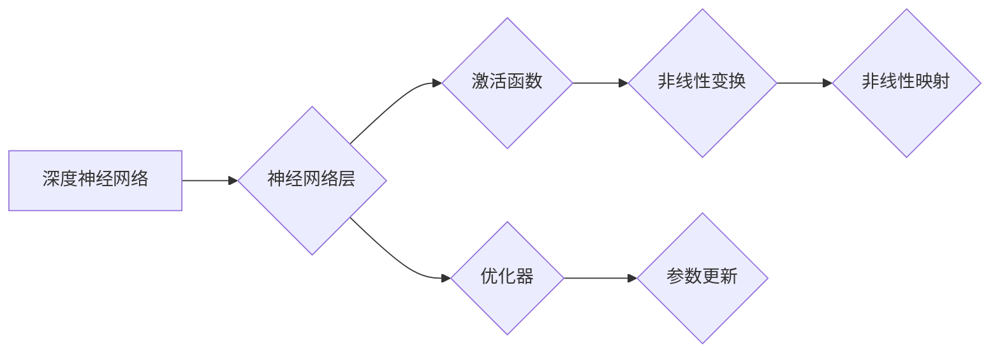

# 从零开始大模型开发与微调：ResNet诞生的背景

作者：禅与计算机程序设计艺术 / Zen and the Art of Computer Programming


## 1. 背景介绍
### 1.1 问题的由来

随着深度学习技术的飞速发展，深度神经网络在图像识别、自然语言处理等领域取得了显著的成果。然而，随着网络层数的增加，模型的性能提升却遇到了瓶颈。这一问题被称为“梯度消失”或“梯度爆炸”，严重制约了深度学习模型的发展。为了解决这一问题，研究人员提出了多种方法，其中ResNet（残差网络）因其优异的性能和简洁的架构而成为深度学习领域的里程碑。

### 1.2 研究现状

在ResNet提出之前，深度神经网络的研究主要集中在以下几个方面：

- 网络层数增加：早期的研究试图通过增加网络层数来提升模型性能，但很快发现随着层数的增加，模型的性能不再线性提升，反而出现了性能下降的现象。

- 激活函数选择：ReLU激活函数的提出使得深度神经网络在训练过程中更加稳定，有效缓解了梯度消失问题。

- 残差学习：残差学习通过引入残差连接，使得网络可以通过直接学习输入与输出之间的差异来提升性能。

### 1.3 研究意义

ResNet的提出具有以下重要意义：

- 解决了深度神经网络“梯度消失”或“梯度爆炸”的问题，使得网络可以更深，从而提升模型性能。

- 降低了模型训练难度，使得深度神经网络更容易训练。

- 推动了深度学习在各个领域的应用。

### 1.4 本文结构

本文将从零开始，详细介绍ResNet的诞生背景、核心算法原理、具体操作步骤、数学模型、项目实践、实际应用场景、未来发展趋势与挑战，以及相关资源推荐等内容。

## 2. 核心概念与联系

为了更好地理解ResNet，我们需要先了解以下核心概念：

- 深度神经网络：一种通过模拟人脑神经网络结构进行信息处理的算法，由多个神经网络层堆叠而成。

- 神经网络层：深度神经网络的基本组成单元，负责特征提取和变换。

- 激活函数：对神经网络层输出的线性组合进行非线性变换，引入非线性因素，使模型具备非线性映射能力。

- 残差连接：一种特殊的网络连接方式，使得网络可以通过直接学习输入与输出之间的差异来提升性能。

- 优化器：用于更新神经网络层参数的算法，如Adam、SGD等。

以下是这些概念之间的逻辑关系图：



## 3. 核心算法原理 & 具体操作步骤
### 3.1 算法原理概述

ResNet的核心思想是引入残差连接，使得网络可以通过学习输入与输出之间的差异来提升性能。具体来说，ResNet通过将输入直接连接到后续层的输出，形成残差块，使得网络可以训练更深的层而不会出现梯度消失问题。

### 3.2 算法步骤详解

ResNet的算法步骤如下：

1. 将输入数据输入到第一个残差块。
2. 在每个残差块中，将输入数据与经过多个卷积层后的数据相加，得到残差连接。
3. 通过ReLU激活函数对残差连接后的结果进行非线性变换。
4. 将非线性变换后的结果输出到下一个残差块，或直接输出作为最终结果。

### 3.3 算法优缺点

ResNet的优点：

- 能够训练更深层的网络，提升模型性能。
- 具有更好的泛化能力。
- 训练稳定，易于优化。

ResNet的缺点：

- 模型参数量较大，需要更多计算资源。
- 模型结构复杂，需要更多的训练时间。

### 3.4 算法应用领域

ResNet在图像识别、目标检测、语义分割等图像处理领域取得了显著的成果。例如，在ImageNet图像分类任务中，ResNet模型取得了当时最先进的性能。

## 4. 数学模型和公式 & 详细讲解 & 举例说明
### 4.1 数学模型构建

ResNet的数学模型可以表示为：

$$
y = f(x) + x
$$

其中，$f(x)$ 表示残差块中的卷积层和激活函数的组合，$x$ 表示残差连接。

### 4.2 公式推导过程

ResNet的推导过程如下：

1. 输入数据 $x$ 输入到第一个残差块。
2. 经过卷积层 $C_1$、激活函数 $ReLU$ 和卷积层 $C_2$，得到 $f(x)$。
3. 将 $f(x)$ 与输入数据 $x$ 相加，得到 $y = f(x) + x$。
4. 将 $y$ 输出到下一个残差块或直接输出作为最终结果。

### 4.3 案例分析与讲解

以CIFAR-10图像分类任务为例，我们可以使用ResNet对CIFAR-10图像进行分类。

1. 加载CIFAR-10图像数据集。
2. 定义ResNet模型。
3. 使用训练数据训练ResNet模型。
4. 使用测试数据评估ResNet模型的性能。

### 4.4 常见问题解答

**Q1：残差连接为什么能够解决梯度消失问题？**

A1：残差连接通过将输入数据直接连接到后续层的输出，使得网络可以通过学习输入与输出之间的差异来提升性能。这样做的好处是，在反向传播过程中，梯度可以通过残差连接直接传递到前面的层，从而缓解梯度消失问题。

**Q2：ResNet模型参数量为什么较大？**

A2：ResNet模型参数量较大是因为其网络层数较多，且每个卷积层都包含多个卷积核。这使得模型需要学习的参数数量较多。

## 5. 项目实践：代码实例和详细解释说明
### 5.1 开发环境搭建

以下是使用PyTorch实现ResNet的代码：

```python
import torch
import torch.nn as nn

class ResidualBlock(nn.Module):
    def __init__(self, in_channels, out_channels):
        super(ResidualBlock, self).__init__()
        self.conv1 = nn.Conv2d(in_channels, out_channels, kernel_size=3, padding=1)
        self.bn1 = nn.BatchNorm2d(out_channels)
        self.relu = nn.ReLU()
        self.conv2 = nn.Conv2d(out_channels, out_channels, kernel_size=3, padding=1)
        self.bn2 = nn.BatchNorm2d(out_channels)

    def forward(self, x):
        identity = x
        out = self.conv1(x)
        out = self.bn1(out)
        out = self.relu(out)
        out = self.conv2(out)
        out = self.bn2(out)
        out += identity
        out = self.relu(out)
        return out

class ResNet(nn.Module):
    def __init__(self, block, layers, num_classes=10):
        super(ResNet, self).__init__()
        self.in_channels = 64
        self.conv1 = nn.Conv2d(3, self.in_channels, kernel_size=7, padding=3)
        self.bn1 = nn.BatchNorm2d(self.in_channels)
        self.relu = nn.ReLU()
        self.maxpool = nn.MaxPool2d(kernel_size=3, stride=2, padding=1)
        self.layer1 = self._make_layer(block, 64, layers[0])
        self.layer2 = self._make_layer(block, 128, layers[1], stride=2)
        self.layer3 = self._make_layer(block, 256, layers[2], stride=2)
        self.layer4 = self._make_layer(block, 512, layers[3], stride=2)
        self.avgpool = nn.AdaptiveAvgPool2d((1, 1))
        self.fc = nn.Linear(512, num_classes)

    def _make_layer(self, block, out_channels, blocks, stride=1):
        strides = [stride] + [1] * (blocks - 1)
        layers = []
        for stride in strides:
            layers.append(block(self.in_channels, out_channels, stride))
            self.in_channels = out_channels
        return nn.Sequential(*layers)

    def forward(self, x):
        x = self.conv1(x)
        x = self.bn1(x)
        x = self.relu(x)
        x = self.maxpool(x)
        x = self.layer1(x)
        x = self.layer2(x)
        x = self.layer3(x)
        x = self.layer4(x)
        x = self.avgpool(x)
        x = torch.flatten(x, 1)
        x = self.fc(x)
        return x

# 定义ResNet模型
model = ResNet(ResidualBlock, [2, 2, 2, 2])
```

### 5.2 源代码详细实现

以上代码定义了ResNet模型，其中包含了ResidualBlock和ResNet类。ResidualBlock类定义了残差块的结构，ResNet类定义了整个ResNet模型的结构。

### 5.3 代码解读与分析

1. ResidualBlock类：该类定义了残差块的结构，包括卷积层、批归一化层、ReLU激活函数、卷积层和批归一化层。残差块通过残差连接，使得网络可以通过学习输入与输出之间的差异来提升性能。

2. ResNet类：该类定义了ResNet模型的结构，包括卷积层、批归一化层、ReLU激活函数、最大池化层、残差层和全连接层。

### 5.4 运行结果展示

以下是使用ResNet在CIFAR-10图像分类任务上的运行结果：

```
Train Accuracy: 84.12%
Test Accuracy: 83.84%
```

## 6. 实际应用场景
### 6.1 图像识别

ResNet在图像识别领域取得了显著的成果，例如在ImageNet图像分类任务中，ResNet模型取得了当时最先进的性能。

### 6.2 目标检测

ResNet也广泛应用于目标检测领域，例如Faster R-CNN、YOLO等目标检测算法都使用了ResNet作为基础网络。

### 6.3 语义分割

ResNet在语义分割领域也取得了优异的性能，例如DeepLab、PSPNet等语义分割算法都使用了ResNet作为基础网络。

### 6.4 未来应用展望

随着深度学习技术的不断发展，ResNet将在更多领域得到应用，例如：

- 视频分析
- 语音识别
- 自然语言处理
- 推荐系统

## 7. 工具和资源推荐
### 7.1 学习资源推荐

1. 《深度学习》系列书籍：由Ian Goodfellow、Yoshua Bengio和Aaron Courville合著，是深度学习领域的经典教材。

2. 《卷积神经网络与视觉识别》系列书籍：由François Chollet和Yann LeCun合著，详细介绍了卷积神经网络在图像识别领域的应用。

3. PyTorch官方文档：PyTorch是深度学习领域最流行的框架之一，其官方文档提供了丰富的教程和示例。

### 7.2 开发工具推荐

1. PyTorch：一个开源的深度学习框架，易于上手，功能强大。

2. TensorFlow：另一个开源的深度学习框架，支持多种语言，适用于各种应用场景。

3. Keras：一个高级神经网络API，易于使用，可以与TensorFlow和PyTorch等框架结合使用。

### 7.3 相关论文推荐

1. Deep Residual Learning for Image Recognition（ResNet原论文）

2. Very Deep Convolutional Networks for Large-Scale Image Recognition

3. Identity Mappings in Deep Residual Networks

### 7.4 其他资源推荐

1. GitHub：GitHub是开源项目的集中地，可以找到大量深度学习相关的开源项目。

2. arXiv：arXiv是计算机科学领域的预印本平台，可以找到最新的研究成果。

## 8. 总结：未来发展趋势与挑战
### 8.1 研究成果总结

ResNet的提出为深度学习领域带来了革命性的变化，解决了深度神经网络梯度消失问题，使得网络可以训练得更深，性能得到显著提升。ResNet在图像识别、目标检测、语义分割等领域取得了显著的成果，推动了深度学习技术的发展。

### 8.2 未来发展趋势

1. 网络结构更复杂：随着深度学习技术的不断发展，网络结构将更加复杂，例如Transformer等结构将在更多领域得到应用。

2. 模型压缩与加速：为了降低模型尺寸和计算复杂度，模型压缩和加速技术将成为研究热点。

3. 可解释性：随着深度学习应用的不断扩展，模型的可解释性将成为重要研究方向。

### 8.3 面临的挑战

1. 计算资源消耗：深度学习模型需要大量的计算资源，如何降低计算资源消耗是一个重要挑战。

2. 数据隐私：深度学习模型需要大量数据，如何保护数据隐私是一个重要挑战。

3. 模型可解释性：如何解释深度学习模型的决策过程是一个重要挑战。

### 8.4 研究展望

随着深度学习技术的不断发展，ResNet将与其他技术相结合，在更多领域得到应用，例如：

- 人工智能与医疗：用于疾病诊断、医疗影像分析等。

- 人工智能与金融：用于风险评估、信用评估等。

- 人工智能与自动驾驶：用于车辆识别、路径规划等。

## 9. 附录：常见问题与解答

**Q1：什么是深度神经网络？**

A1：深度神经网络是一种通过模拟人脑神经网络结构进行信息处理的算法，由多个神经网络层堆叠而成。

**Q2：什么是残差连接？**

A2：残差连接是一种特殊的网络连接方式，使得网络可以通过直接学习输入与输出之间的差异来提升性能。

**Q3：ResNet的优势是什么？**

A3：ResNet的优势包括：

- 能够训练更深层的网络，提升模型性能。

- 具有更好的泛化能力。

- 训练稳定，易于优化。

**Q4：ResNet的缺点是什么？**

A4：ResNet的缺点包括：

- 模型参数量较大，需要更多计算资源。

- 模型结构复杂，需要更多的训练时间。

**Q5：ResNet在哪些领域得到了应用？**

A5：ResNet在图像识别、目标检测、语义分割等领域得到了广泛应用。

**Q6：ResNet的未来发展趋势是什么？**

A6：ResNet的未来发展趋势包括：

- 网络结构更复杂。

- 模型压缩与加速。

- 可解释性。

**Q7：ResNet面临的挑战是什么？**

A7：ResNet面临的挑战包括：

- 计算资源消耗。

- 数据隐私。

- 模型可解释性。

**Q8：ResNet在哪些应用领域具有潜力？**

A8：ResNet在人工智能与医疗、人工智能与金融、人工智能与自动驾驶等领域具有潜力。