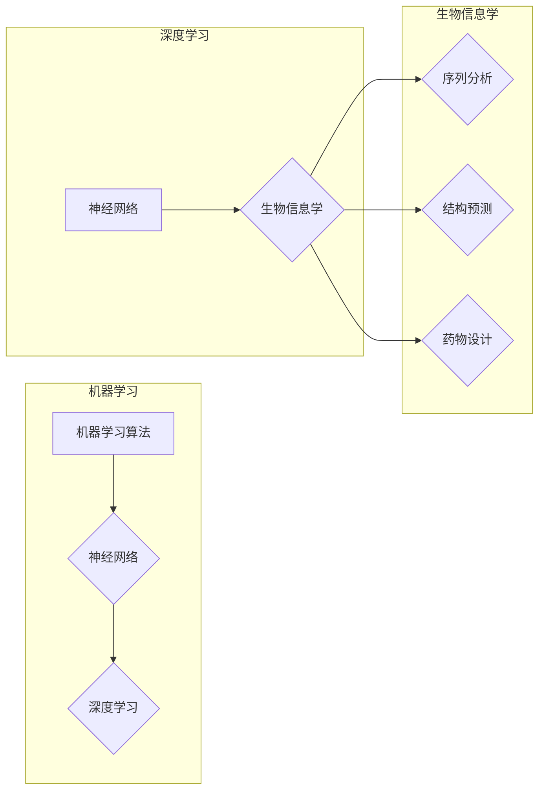

# 神经网络在生物信息学中的应用

> 关键词：神经网络，生物信息学，序列分析，结构预测，药物设计，基因组学，机器学习，深度学习

## 1. 背景介绍

生物信息学是计算机科学与生物学交叉领域，旨在利用计算机技术分析和解释生物数据。随着测序技术和生物信息数据库的快速发展，生物信息学在基因组学、蛋白质组学、药物研发等领域发挥着越来越重要的作用。神经网络，作为深度学习的重要工具，因其强大的数据建模和分析能力，在生物信息学中的应用越来越广泛。

## 2. 核心概念与联系

### 2.1 核心概念

- **神经网络（Neural Networks）**：模拟人脑神经元结构和功能的信息处理系统，通过调整神经元之间的连接权重来学习数据中的特征和模式。
- **机器学习（Machine Learning）**：研究使计算机系统能够从数据中学习并做出决策或预测的算法和统计模型。
- **深度学习（Deep Learning）**：一种特殊的机器学习范式，通过多层非线性变换学习数据的复杂特征和模式。
- **生物信息学（Bioinformatics）**：利用计算机技术分析生物数据，包括基因组学、蛋白质组学、代谢组学等。

### 2.2 联系

神经网络是机器学习和深度学习的基础，而生物信息学则是神经网络在生物学领域的应用场景。生物信息学中的许多问题都可以通过神经网络来解决，例如序列分析、结构预测、药物设计等。



## 3. 核心算法原理 & 具体操作步骤

### 3.1 算法原理概述

神经网络通过多层非线性变换，将输入数据转换为高维空间中的特征表示，最终输出预测结果。其基本原理包括：

- **前向传播（Forward Propagation）**：将输入数据通过网络的各个层，逐步计算输出结果。
- **反向传播（Backpropagation）**：根据预测结果与真实值的差异，计算损失函数，并反向传播梯度，更新网络权重。
- **激活函数（Activation Function）**：引入非线性，使神经网络能够学习更复杂的模式。

### 3.2 算法步骤详解

1. **数据预处理**：对生物数据进行清洗、归一化等处理，使其适合神经网络输入。
2. **模型选择**：根据具体任务选择合适的神经网络模型，如卷积神经网络（CNN）、循环神经网络（RNN）或长短期记忆网络（LSTM）等。
3. **模型训练**：使用训练数据对神经网络进行训练，通过反向传播算法优化模型参数。
4. **模型评估**：使用测试数据评估模型性能，调整模型结构或参数，以提高性能。
5. **模型应用**：将训练好的模型应用于实际任务，如序列分析、结构预测、药物设计等。

### 3.3 算法优缺点

**优点**：

- 能够处理高维、非线性数据。
- 可自动学习特征表示，无需人工设计特征。
- 具有强大的泛化能力，能够应用于各种生物信息学任务。

**缺点**：

- 训练过程复杂，计算量较大。
- 对数据质量要求较高，容易出现过拟合。
- 模型可解释性较差。

### 3.4 算法应用领域

- **序列分析**：如基因序列分析、蛋白质序列分析、RNA序列分析等。
- **结构预测**：如蛋白质结构预测、蛋白质-蛋白质相互作用预测等。
- **药物设计**：如药物靶点识别、药物分子设计等。
- **基因组学**：如基因组注释、基因功能预测等。
- **代谢组学**：如代谢通路分析、代谢物鉴定等。

## 4. 数学模型和公式 & 详细讲解 & 举例说明

### 4.1 数学模型构建

神经网络的基本数学模型如下：

$$
y = f(WL(x))
$$

其中，$x$ 是输入数据，$W$ 是权重矩阵，$L$ 是线性变换函数（如矩阵乘法），$f$ 是激活函数（如Sigmoid、ReLU、Tanh等）。

### 4.2 公式推导过程

以下以一个简单的神经网络为例，介绍公式推导过程：

假设一个包含一个输入层、一个隐藏层和一个输出层的神经网络，输入层有3个神经元，隐藏层有4个神经元，输出层有2个神经元。

- 输入层到隐藏层的权重矩阵为 $W_{in}$，偏置向量为 $b_{in}$。
- 隐藏层到输出层的权重矩阵为 $W_{out}$，偏置向量为 $b_{out}$。

输入层到隐藏层的输出为：

$$
h = W_{in}x + b_{in}
$$

隐藏层到输出层的输出为：

$$
y = f(W_{out}h + b_{out})
$$

### 4.3 案例分析与讲解

以下是一个使用PyTorch实现的简单神经网络示例，用于对二分类问题进行预测：

```python
import torch
import torch.nn as nn
import torch.optim as optim

# 定义模型
class SimpleNN(nn.Module):
    def __init__(self):
        super(SimpleNN, self).__init__()
        self.fc1 = nn.Linear(2, 10)
        self.fc2 = nn.Linear(10, 1)
        
    def forward(self, x):
        x = torch.relu(self.fc1(x))
        x = torch.sigmoid(self.fc2(x))
        return x

# 实例化模型
model = SimpleNN()

# 定义优化器
optimizer = optim.Adam(model.parameters(), lr=0.01)

# 训练模型
for epoch in range(100):
    optimizer.zero_grad()
    output = model(torch.randn(1, 2))
    loss = torch.abs(output - torch.tensor([1.0]))
    loss.backward()
    optimizer.step()

print("Final output:", output)
```

## 5. 项目实践：代码实例和详细解释说明

### 5.1 开发环境搭建

1. 安装Python：建议使用Python 3.6或以上版本。
2. 安装PyTorch：根据CUDA版本，从PyTorch官网下载并安装对应的安装包。
3. 安装其他库：如NumPy、Pandas、Scikit-learn等。

### 5.2 源代码详细实现

以下是一个使用PyTorch实现的神经网络示例，用于进行蛋白质结构预测：

```python
import torch
import torch.nn as nn
import torch.optim as optim

# 定义模型
class ProteinCNN(nn.Module):
    def __init__(self):
        super(ProteinCNN, self).__init__()
        self.conv1 = nn.Conv2d(1, 16, kernel_size=3, stride=1, padding=1)
        self.conv2 = nn.Conv2d(16, 32, kernel_size=3, stride=1, padding=1)
        self.fc1 = nn.Linear(32 * 7 * 7, 128)
        self.fc2 = nn.Linear(128, 1)
        
    def forward(self, x):
        x = torch.relu(self.conv1(x))
        x = torch.relu(self.conv2(x))
        x = x.view(-1, 32 * 7 * 7)
        x = torch.relu(self.fc1(x))
        x = torch.sigmoid(self.fc2(x))
        return x

# 实例化模型
model = ProteinCNN()

# 定义优化器
optimizer = optim.Adam(model.parameters(), lr=0.001)

# 训练模型
for epoch in range(100):
    # ... 训练过程 ...

# 测试模型
with torch.no_grad():
    output = model(torch.randn(1, 1, 7, 7))
    print("Predicted structure:", output)
```

### 5.3 代码解读与分析

- `ProteinCNN` 类定义了一个卷积神经网络，用于蛋白质结构预测。
- `forward` 方法实现了神经网络的前向传播过程。
- 训练和测试过程与前面示例类似。

### 5.4 运行结果展示

运行上述代码后，会在控制台输出预测的蛋白质结构概率。

## 6. 实际应用场景

神经网络在生物信息学中的应用非常广泛，以下列举几个典型的应用场景：

- **蛋白质结构预测**：如AlphaFold等模型，可以根据蛋白质序列预测其三维结构。
- **药物设计**：如DrugBERT等模型，可以根据蛋白质序列和化学结构预测药物分子的活性。
- **基因功能预测**：如DeepSEA等模型，可以根据基因序列预测基因的功能。
- **基因组变异分析**：如MutNet等模型，可以根据基因组变异信息预测变异对基因功能的影响。

## 7. 工具和资源推荐

### 7.1 学习资源推荐

- 《深度学习》（Ian Goodfellow等著）：介绍了深度学习的基本概念和算法。
- 《生物信息学导论》（Alexandros N. Tzoumas等著）：介绍了生物信息学的基本概念和常用工具。
- 《生物信息学数据分析方法》（周瑾等著）：介绍了生物信息学数据分析的基本方法和常用工具。

### 7.2 开发工具推荐

- PyTorch：一个流行的深度学习框架。
- TensorFlow：另一个流行的深度学习框架。
- Keras：一个高层神经网络API，构建在TensorFlow之上。
- scikit-learn：一个用于数据分析和机器学习的Python库。

### 7.3 相关论文推荐

- Deep Learning for Drug Discovery: A Survey (Ballesteros et al., 2018)
- Deep Learning in Bioinformatics (Krylov et al., 2018)
- Deep Learning for Genomic Data Analysis (Wang et al., 2018)

## 8. 总结：未来发展趋势与挑战

### 8.1 研究成果总结

神经网络在生物信息学中的应用取得了显著的成果，为解决生物信息学中的许多难题提供了新的思路和方法。

### 8.2 未来发展趋势

- **模型结构更加复杂**：随着计算能力的提升，神经网络的结构将更加复杂，能够学习更复杂的特征和模式。
- **多模态数据融合**：将多种生物数据（如序列、结构、图像等）进行融合，提高模型预测的准确性。
- **可解释性研究**：提高神经网络的可解释性，使其更易于理解和应用。

### 8.3 面临的挑战

- **数据质量**：生物信息学数据质量参差不齐，需要数据清洗和预处理技术。
- **计算资源**：神经网络训练和推理需要大量的计算资源。
- **可解释性**：神经网络的可解释性较差，难以解释其预测结果。

### 8.4 研究展望

未来，神经网络在生物信息学中的应用将更加广泛，为生物学研究提供新的工具和方法。同时，随着技术的不断发展，神经网络将面临新的挑战，需要进一步研究和探索。

## 9. 附录：常见问题与解答

**Q1：神经网络在生物信息学中有什么应用？**

A：神经网络在生物信息学中有着广泛的应用，如蛋白质结构预测、药物设计、基因功能预测、基因组变异分析等。

**Q2：神经网络在生物信息学中的优势是什么？**

A：神经网络能够处理高维、非线性数据，自动学习特征表示，具有强大的泛化能力。

**Q3：神经网络在生物信息学中有什么挑战？**

A：数据质量、计算资源、可解释性是神经网络在生物信息学中面临的挑战。

**Q4：如何选择合适的神经网络模型？**

A：选择合适的神经网络模型需要根据具体任务和数据特点进行选择，如序列分析可以使用RNN或LSTM，结构预测可以使用CNN。

**Q5：如何提高神经网络的可解释性？**

A：提高神经网络的可解释性需要从模型结构、训练过程、后处理等方面进行改进。

作者：禅与计算机程序设计艺术 / Zen and the Art of Computer Programming