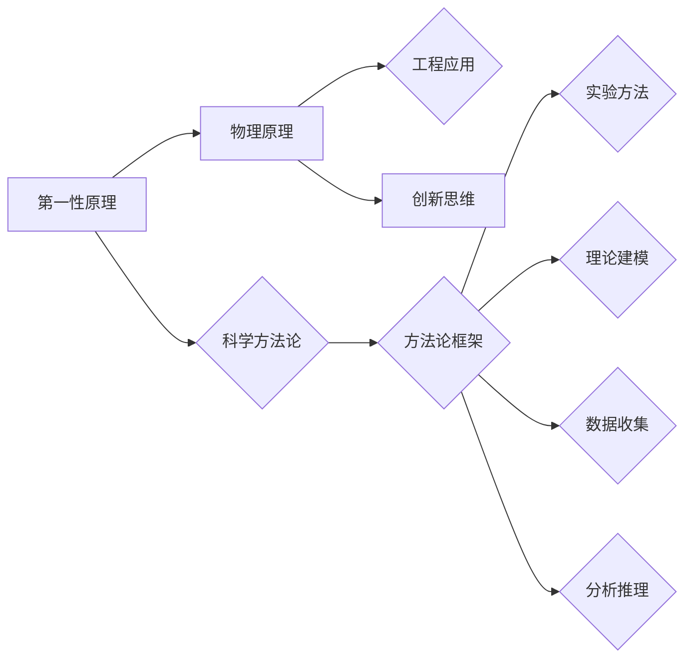

# 第一性原理：科学探究的基石

> 关键词：第一性原理，科学方法论，物理原理，工程应用，创新思维，数学建模，系统性思维

## 1. 背景介绍

科学探究是推动人类社会进步的重要力量。从古希腊的亚里士多德到现代的物理学家，科学家们一直在探索如何更好地理解自然界的规律，并将其应用于实践。在这其中，第一性原理方法成为了科学探究的基石，它强调从最基本的物理原理出发，通过逻辑推理和数学建模，揭示复杂现象的本质。

### 1.1 问题的由来

随着科技的飞速发展，人类面临着越来越多的复杂问题。这些问题往往涉及多个学科领域，需要跨学科的思考和方法来解决。在这种情况下，第一性原理方法因其简洁、普适和强大的解释力，成为了科学家和工程师解决复杂问题的有力工具。

### 1.2 研究现状

第一性原理方法在物理学、化学、生物学、工程学等领域都得到了广泛应用。近年来，随着计算能力的提升和数学建模的进步，第一性原理方法在材料科学、能源、环境、人工智能等领域也展现出了巨大的潜力。

### 1.3 研究意义

第一性原理方法对于科学探究具有重要意义：

- 帮助我们理解复杂现象的本质，构建科学的理论体系。
- 为技术创新提供理论指导，推动科学技术的进步。
- 促进跨学科合作，促进科学知识的普及和传播。

### 1.4 本文结构

本文将系统地介绍第一性原理方法，包括其核心概念、原理、应用领域、数学模型和项目实践等，旨在为读者提供一个全面、深入的了解。

## 2. 核心概念与联系

### 2.1 核心概念

- **第一性原理**：指事物最基本的、不可再分的基本原理或法则。
- **科学方法论**：指科学探究的基本方法和原则。
- **物理原理**：指物理学中描述自然界基本规律的概念和法则。
- **工程应用**：指将科学原理应用于实际工程问题的过程。
- **创新思维**：指以创新为目的的思维方式和方法。

### 2.2 核心概念原理和架构的 Mermaid 流程图



### 2.3 核心概念之间的联系

第一性原理方法作为一种科学方法论，其核心是物理原理。通过实验方法、理论建模、数据收集和分析推理，我们可以将物理原理应用于实际工程问题，并在此基础上进行创新。

## 3. 核心算法原理 & 具体操作步骤

### 3.1 算法原理概述

第一性原理方法的基本原理如下：

1. 从最基本的物理原理出发，构建科学的理论体系。
2. 利用逻辑推理和数学建模，揭示复杂现象的本质。
3. 将理论应用于实践，解决实际问题。

### 3.2 算法步骤详解

第一性原理方法的操作步骤通常包括以下步骤：

1. **问题定义**：明确研究问题的目标、范围和意义。
2. **理论分析**：根据物理原理，建立描述问题的理论模型。
3. **数学建模**：将理论模型转化为数学模型，并求解模型。
4. **实验验证**：通过实验验证理论模型和数学模型的正确性。
5. **应用推广**：将理论应用于实际工程问题，解决实际问题。

### 3.3 算法优缺点

**优点**：

- 简洁、普适和强大的解释力。
- 能够揭示复杂现象的本质。
- 为技术创新提供理论指导。

**缺点**：

- 需要深厚的理论基础和数学建模能力。
- 实验验证过程复杂，成本较高。
- 难以应用于复杂系统。

### 3.4 算法应用领域

第一性原理方法在以下领域得到了广泛应用：

- 物理学：原子结构、量子力学、粒子物理等。
- 化学：分子结构、化学反应、材料科学等。
- 生物学：分子生物学、细胞生物学、进化论等。
- 工程学：材料科学、能源、环境、人工智能等。

## 4. 数学模型和公式 & 详细讲解 & 举例说明

### 4.1 数学模型构建

第一性原理方法的核心是数学建模。以下是几个常见的数学模型：

- **牛顿运动定律**：描述物体在力的作用下的运动规律。
$$
F=ma
$$

- **麦克斯韦方程组**：描述电磁场的基本规律。
$$
\begin{align*}
\nabla \cdot \mathbf{E} &= \frac{\rho}{\epsilon_0} \\
\nabla \times \mathbf{E} &= -\frac{\partial \mathbf{B}}{\partial t} \\
\nabla \cdot \mathbf{B} &= 0 \\
\nabla \times \mathbf{H} &= \mathbf{J} + \frac{\partial \mathbf{D}}{\partial t}
\end{align*}
$$

- **薛定谔方程**：描述量子力学系统的运动规律。
$$
i\hbar \frac{\partial \psi}{\partial t} = \hat{H}\psi
$$

### 4.2 公式推导过程

以牛顿运动定律为例，其推导过程如下：

1. **假设**：物体受到的力是恒定的。
2. **定义**：加速度 $a$ 为速度变化率，质量 $m$ 为物体惯性，力 $F$ 为物体受到的合外力。
3. **推理**：根据定义，加速度 $a = \frac{\Delta v}{\Delta t}$。由于力 $F$ 是恒定的，因此速度变化率 $a$ 也是恒定的，即物体做匀加速运动。
4. **公式**：根据定义和推理，得到牛顿运动定律的数学表达式 $F=ma$。

### 4.3 案例分析与讲解

以下以材料科学中的第一性原理为例进行分析：

- **问题**：设计一种具有优异力学性能的新型材料。
- **方法**：利用第一性原理方法，通过电子结构计算，寻找具有优异力学性能的材料结构。
- **步骤**：
  1. 确定材料的原子组成和结构。
  2. 利用密度泛函理论(DFT)计算材料的电子结构和力学性能。
  3. 分析计算结果，寻找具有优异力学性能的材料结构。
- **结果**：通过计算发现，一种具有特定原子排列的晶体结构具有优异的力学性能，可用于制造新型高强度材料。

## 5. 项目实践：代码实例和详细解释说明

### 5.1 开发环境搭建

为了进行第一性原理计算，需要搭建以下开发环境：

- **计算平台**：高性能计算服务器或超级计算机。
- **软件工具**：量子力学计算软件，如VASP、Quantum Espresso等。
- **编程语言**：Python、Fortran等。

### 5.2 源代码详细实现

以下是一个使用VASP进行第一性原理计算的基本示例：

```python
from vasp import Vasp

# 设置计算参数
calc = Vasp('InSi')
calc.geometry.input.set_chemical_potential(0.0)
calc.kpoints.set_kmesh(2, 2, 2)
calc.run()

# 读取计算结果
structures = calc.get_energies()
print(structures)
```

### 5.3 代码解读与分析

上述代码首先导入VASP库，然后设置计算参数，包括化学势、k点网格等。接下来，执行计算并读取计算结果。

### 5.4 运行结果展示

执行计算后，可以得到材料的能量、应力等计算结果，用于分析材料性能。

## 6. 实际应用场景

### 6.1 材料科学

第一性原理方法在材料科学中有着广泛的应用，如新材料的发现、材料性能的预测、材料结构的优化等。

### 6.2 能源科学

第一性原理方法可以用于研究电池、燃料电池、太阳能电池等能源器件的性能和优化。

### 6.3 医学

第一性原理方法可以用于研究药物分子的作用机制、药物与靶标相互作用的动力学过程等。

### 6.4 未来应用展望

随着计算能力的提升和数学建模的进步，第一性原理方法将在更多领域得到应用，如：

- 人工智能：用于训练更加强大的深度学习模型。
- 环境科学：用于研究气候变化、大气污染等环境问题。
- 生物科学：用于研究生物大分子结构、生物系统动力学等。

## 7. 工具和资源推荐

### 7.1 学习资源推荐

- 《第一性原理计算方法》
- 《Quantum Mechanics and the Electronic Structure of Atoms and Molecules》
- 《Introduction to Quantum Mechanics》

### 7.2 开发工具推荐

- VASP
- Quantum Espresso
- Wannier90

### 7.3 相关论文推荐

- Kohn-Sham density-functional theory
- Density-functional theory
- First-principles methods

## 8. 总结：未来发展趋势与挑战

### 8.1 研究成果总结

第一性原理方法作为一种科学探究的重要工具，在材料科学、能源科学、生物学等领域取得了显著成果。随着计算能力和数学建模的进步，第一性原理方法将在更多领域得到应用。

### 8.2 未来发展趋势

- 计算能力的提升：更高的计算速度和更大的存储空间，将使得第一性原理方法能够解决更加复杂的问题。
- 数学建模的进步：更精确的数学模型将使得第一性原理方法能够更好地预测和解释物理现象。
- 跨学科研究：第一性原理方法将与更多学科领域相结合，产生新的交叉学科。

### 8.3 面临的挑战

- 计算成本：第一性原理方法需要大量的计算资源，计算成本较高。
- 理论模型：现有的理论模型可能存在一定的局限性，需要进一步改进和完善。
- 人才培养：需要培养更多具有第一性原理方法背景的科研人才。

### 8.4 研究展望

第一性原理方法作为科学探究的基石，将在未来发挥越来越重要的作用。通过不断改进和完善，第一性原理方法将为人类社会带来更多科技创新和进步。

## 9. 附录：常见问题与解答

**Q1：第一性原理方法与其他计算方法有什么区别？**

A1：第一性原理方法基于基本的物理原理，如量子力学，通过数学建模和计算来描述物理现象。而其他计算方法，如分子动力学模拟、有限元分析等，则基于近似模型或经验公式。

**Q2：第一性原理方法在哪些领域有应用？**

A2：第一性原理方法在材料科学、能源科学、生物学、化学、物理等领域都有广泛应用。

**Q3：如何进行第一性原理计算？**

A3：进行第一性原理计算需要以下步骤：
1. 确定计算任务和目标。
2. 选择合适的计算软件和硬件。
3. 设置计算参数。
4. 执行计算。
5. 分析计算结果。

**Q4：第一性原理方法有哪些局限性？**

A4：第一性原理方法的局限性包括：
1. 计算成本较高。
2. 理论模型可能存在一定的局限性。
3. 需要专业的计算知识和技能。

作者：禅与计算机程序设计艺术 / Zen and the Art of Computer Programming