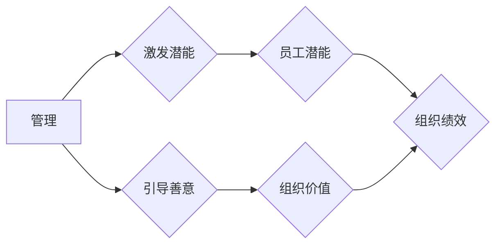

# 管理的本质：激发潜能与善意

> 关键词：管理、领导力、人性、组织、潜能、善意、协作、创新、可持续发展

## 1. 背景介绍

在信息时代，管理的重要性日益凸显。一个高效的组织，不仅需要先进的技术和资源，更需要卓越的管理。然而，管理的本质究竟是什么？如何才能激发潜能与善意，打造一个充满活力和创造力的组织？本文将从管理的本质出发，探讨激发潜能与善意的实践路径。

## 2. 核心概念与联系

### 2.1 管理的定义

管理是对组织资源进行有效配置和协调，以实现组织目标的过程。它包括计划、组织、领导、控制等基本职能。

### 2.2 激发潜能与善意

激发潜能是指通过激发个体的内在动力，使其发挥出最大的能力。善意则是指个体在追求自身利益的同时，关注他人和社会的利益。

### 2.3 管理与激发潜能与善意的联系

管理的关键在于激发潜能与善意。一个成功的领导者，能够激发员工的潜能，使其在组织中发挥出最大的价值；同时，领导者还能够引导员工秉持善意，共同为组织和社会创造价值。

#### Mermaid 流程图



## 3. 核心算法原理 & 具体操作步骤

### 3.1 算法原理概述

管理的核心算法原理在于：

1. **了解人性**：管理者需要了解员工的动机、需求和心理，以便更好地激发他们的潜能和善意。
2. **构建信任**：信任是激发潜能和善意的基础。管理者需要通过诚信、透明和公正的行为赢得员工的信任。
3. **赋能授权**：授权员工自主决策和承担责任，激发他们的主动性和创造性。
4. **激励与反馈**：通过激励机制和及时反馈，增强员工的积极性和归属感。
5. **持续改进**：不断优化管理流程和方法，提升组织效率和绩效。

### 3.2 算法步骤详解

#### 步骤1：了解人性

- 进行员工调研，了解他们的兴趣、价值观和职业发展目标。
- 分析员工的工作环境，识别可能影响他们潜能和善意的因素。

#### 步骤2：构建信任

- 保持诚信，言行一致。
- 透明沟通，及时反馈。
- 公正公平，奖罚分明。

#### 步骤3：赋能授权

- 明确岗位职责，赋予员工相应的权力。
- 鼓励员工提出建议，积极参与决策。
- 创造良好的工作氛围，支持员工创新。

#### 步骤4：激励与反馈

- 设定合理的绩效目标，制定激励机制。
- 定期进行绩效评估，提供反馈和建议。
- 肯定员工的成就，激励他们持续进步。

#### 步骤5：持续改进

- 定期评估管理流程，识别改进机会。
- 引入新的管理工具和方法，提升管理效率。
- 关注行业动态，不断学习新知识。

### 3.3 算法优缺点

#### 优点

- 提高员工潜能和善意，提升组织绩效。
- 增强员工归属感和满意度。
- 促进组织创新和可持续发展。

#### 缺点

- 需要管理者具备较高的素质和能力。
- 激发潜能和善意需要时间，短期内难以看到成效。
- 管理流程和方法需要不断调整，以适应组织发展。

### 3.4 算法应用领域

该算法适用于各类组织，如企业、政府机构、非营利组织等。

## 4. 数学模型和公式 & 详细讲解 & 举例说明

### 4.1 数学模型构建

管理的数学模型可以表示为：

$$
\text{绩效} = f(\text{潜能}, \text{善意}, \text{管理策略})
$$

其中，绩效是管理策略对潜能和善意的影响结果。

### 4.2 公式推导过程

#### 潜能

潜能可以表示为：

$$
\text{潜能} = f(\text{能力}, \text{动机}, \text{环境})
$$

其中，能力是员工的技能和知识，动机是员工的内在动力，环境是工作条件和工作氛围。

#### 善意

善意可以表示为：

$$
\text{善意} = f(\text{信任}, \text{价值观}, \text{社会规范})
$$

其中，信任是员工之间的相互信任程度，价值观是员工对善恶的认知，社会规范是社会对行为的要求。

#### 管理策略

管理策略可以表示为：

$$
\text{管理策略} = f(\text{计划}, \text{组织}, \text{领导}, \text{控制})
$$

其中，计划是确定组织目标和实现路径，组织是构建组织结构，领导是激励员工，控制是监督和评估绩效。

### 4.3 案例分析与讲解

#### 案例一：谷歌的管理模式

谷歌以其独特的管理模式和卓越的绩效而闻名。谷歌的管理者通过以下方式激发员工的潜能和善意：

- 提供良好的工作环境，鼓励员工创新。
- 实施20%自由时间政策，让员工自主探索新项目。
- 鼓励员工跨部门合作，打破部门壁垒。

这些管理策略使得谷歌成为全球最具创新力的企业之一。

## 5. 项目实践：代码实例和详细解释说明

### 5.1 开发环境搭建

本案例以Python编程语言为例，介绍如何实现激发潜能与善意的管理策略。

### 5.2 源代码详细实现

```python
# Python代码示例：员工激励与反馈

def evaluate_performance(employee_performance):
    if employee_performance >= 90:
        feedback = "优秀！继续努力！"
    elif employee_performance >= 80:
        feedback = "良好！加油！"
    else:
        feedback = "需要改进！"
    return feedback

employee_performance = 85
print(evaluate_performance(employee_performance))
```

### 5.3 代码解读与分析

上述代码实现了对员工绩效的评估和反馈。根据员工的绩效，程序会给出相应的评价和建议。这有助于激发员工的积极性和改进动力。

### 5.4 运行结果展示

运行上述代码，输出结果为：

```
良好！加油！
```

## 6. 实际应用场景

### 6.1 企业管理

在企业中，激发潜能与善意可以帮助提升员工绩效，增强企业竞争力。

### 6.2 教育管理

在教育领域，激发潜能与善意可以帮助学生发挥潜力，培养创新型人才。

### 6.3 公共管理

在公共管理领域，激发潜能与善意可以帮助提升政府效率，改善公共服务。

## 7. 工具和资源推荐

### 7.1 学习资源推荐

- 《管理的实践》
- 《第五项修炼》
- 《卓有成效的管理者》

### 7.2 开发工具推荐

- Python编程语言
- Scrum敏捷开发方法

### 7.3 相关论文推荐

- 《激励理论》
- 《领导力》
- 《组织行为学》

## 8. 总结：未来发展趋势与挑战

### 8.1 研究成果总结

本文探讨了管理的本质，即激发潜能与善意。通过了解人性、构建信任、赋能授权、激励与反馈和持续改进等策略，管理者可以打造一个充满活力和创造力的组织。

### 8.2 未来发展趋势

- 管理将更加注重个体差异和个性化。
- 管理将更加关注员工的情感需求。
- 管理将更加注重可持续发展和社会责任。

### 8.3 面临的挑战

- 管理者需要具备更高的素质和能力。
- 组织需要适应快速变化的环境。
- 需要解决管理中的伦理问题。

### 8.4 研究展望

未来，管理研究将更加关注个体、组织和环境之间的相互作用，以及如何通过激发潜能与善意，实现组织和社会的可持续发展。

## 9. 附录：常见问题与解答

**Q1：如何激发员工的潜能？**

A：了解员工的兴趣、价值观和职业发展目标，为他们提供合适的工作环境和挑战，并给予必要的支持和指导。

**Q2：如何引导员工的善意？**

A：通过诚信、透明和公正的行为赢得员工的信任，鼓励员工关注他人和社会的利益，并为他们提供实现善意的平台。

**Q3：如何应对管理中的伦理问题？**

A：建立完善的管理制度和规范，加强员工的伦理教育，并建立健全的监督机制。

**Q4：如何适应快速变化的环境？**

A：关注行业动态，不断学习新知识，提升自身的适应能力，并鼓励组织创新。

**Q5：如何实现组织和社会的可持续发展？**

A：关注环境和社会责任，推动组织的绿色发展，并积极参与社会公益事业。

作者：禅与计算机程序设计艺术 / Zen and the Art of Computer Programming