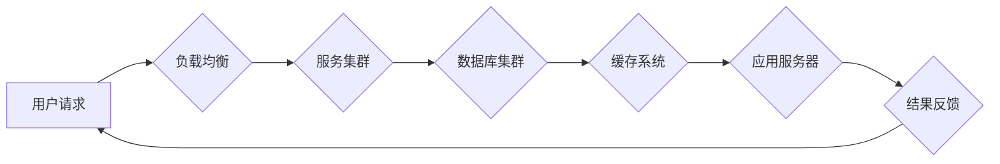

# 系统设计中的“三高”解决方案解析

> 关键词：系统设计，高性能，高可用，高并发，架构优化，负载均衡，缓存，数据库优化，服务拆分

## 1. 背景介绍

在互联网时代，随着用户量的爆炸式增长和业务需求的不断变化，系统设计面临着巨大的挑战。如何构建一个既能满足大规模用户访问，又能保证稳定性和高效性的系统，成为了系统架构师们关注的焦点。本文将深入解析系统设计中的“三高”解决方案，即高性能（High Performance）、高可用（High Availability）和高并发（High Concurrency），并探讨如何在实际项目中实现这些目标。

## 2. 核心概念与联系

### 2.1 核心概念原理

#### 高性能（High Performance）
高性能是指系统在执行任务时的速度和效率。它包括以下几个方面：

- **CPU利用率**：系统的CPU利用率反映了其计算资源的有效利用程度。
- **内存使用率**：内存使用率反映了系统对内存资源的需求。
- **I/O效率**：I/O效率反映了系统进行数据读写操作的效率。
- **响应时间**：响应时间是用户发起请求到系统响应的时间。

#### 高可用（High Availability）
高可用是指系统在面临各种故障情况下，能够保持持续运行的能力。它包括以下几个方面：

- **故障转移**：在主节点故障时，能够快速切换到备份节点，保证服务的连续性。
- **冗余设计**：通过硬件、网络、数据等多方面的冗余设计，提高系统的可靠性。
- **自动恢复**：系统能够自动检测和恢复故障，减少人工干预。

#### 高并发（High Concurrency）
高并发是指系统同时处理大量请求的能力。它包括以下几个方面：

- **并发连接数**：系统能够同时处理的并发连接数量。
- **并发处理能力**：系统能够同时处理请求的数量。
- **并发优化**：通过优化系统架构和代码，提高系统的并发处理能力。

### 2.2 架构的 Mermaid 流程图



在这个流程图中，用户请求首先经过负载均衡器，然后分发到服务集群，服务集群访问数据库集群和缓存系统，应用服务器处理请求并返回结果，最后将结果反馈给用户。

## 3. 核心算法原理 & 具体操作步骤

### 3.1 算法原理概述

系统设计中的“三高”解决方案主要涉及以下算法原理：

- **负载均衡**：通过将请求分发到不同的服务器或节点，实现负载均衡。
- **缓存**：通过将热点数据存储在缓存中，减少对数据库的访问，提高系统性能。
- **数据库优化**：通过优化数据库索引、查询语句等，提高数据库的访问效率。
- **服务拆分**：将大型服务拆分成多个小型服务，降低系统复杂度，提高可维护性。

### 3.2 算法步骤详解

#### 负载均衡

1. **选择负载均衡器**：选择合适的负载均衡器，如Nginx、LVS等。
2. **配置负载均衡策略**：根据业务需求，选择合适的负载均衡策略，如轮询、最少连接、IP哈希等。
3. **部署负载均衡器**：将负载均衡器部署到合适的位置，如公网入口、内部网络等。

#### 缓存

1. **选择缓存系统**：选择合适的缓存系统，如Redis、Memcached等。
2. **设计缓存策略**：根据业务需求，设计合理的缓存策略，如LRU、LFU等。
3. **部署缓存系统**：将缓存系统部署到合适的位置，如服务器节点、数据中心等。

#### 数据库优化

1. **设计合理的数据库结构**：根据业务需求，设计合理的数据库表结构、索引等。
2. **优化查询语句**：使用索引、避免全表扫描等手段，优化查询语句。
3. **监控数据库性能**：定期监控数据库性能，及时发现并解决性能瓶颈。

#### 服务拆分

1. **识别业务模块**：识别业务中的独立模块，如用户模块、订单模块等。
2. **设计服务接口**：定义服务接口，确保服务之间的解耦。
3. **部署服务**：将服务部署到不同的服务器或节点上。

### 3.3 算法优缺点

#### 负载均衡

**优点**：

- 提高系统并发处理能力。
- 延长服务器使用寿命。
- 提高系统可用性。

**缺点**：

- 复杂度较高，需要配置和维护。
- 可能存在单点故障。

#### 缓存

**优点**：

- 提高系统性能。
- 减轻数据库压力。

**缺点**：

- 数据一致性保证困难。
- 需要定期清理缓存。

#### 数据库优化

**优点**：

- 提高数据库访问效率。

**缺点**：

- 需要深入了解数据库原理。
- 优化效果有限。

#### 服务拆分

**优点**：

- 提高系统可维护性。
- 提高系统可扩展性。

**缺点**：

- 增加系统复杂度。
- 需要维护多个服务。

### 3.4 算法应用领域

以上算法原理在以下领域得到广泛应用：

- **Web应用**：如电商平台、社交平台等。
- **移动应用**：如手游、移动办公等。
- **物联网应用**：如智能家居、车联网等。

## 4. 数学模型和公式 & 详细讲解 & 举例说明

### 4.1 数学模型构建

以下是一个简单的数学模型，用于计算系统的并发处理能力：

$$
P = \frac{C}{T}
$$

其中，$P$ 表示系统的并发处理能力，$C$ 表示系统的计算资源，$T$ 表示处理一个请求所需的时间。

### 4.2 公式推导过程

假设系统的CPU、内存、I/O等资源均为单一资源，且这些资源的使用是相互独立的。则系统的并发处理能力取决于最慢的资源。设最慢资源的使用时间为 $T$，则系统的并发处理能力为 $\frac{1}{T}$。

### 4.3 案例分析与讲解

以下是一个使用Python代码实现负载均衡的案例：

```python
from flask import Flask, request, jsonify

app = Flask(__name__)

# 定义服务列表
services = [
    'http://service1.com',
    'http://service2.com',
    'http://service3.com',
]

# 轮询算法
def round_robin():
    index = 0
    while True:
        yield services[index]
        index = (index + 1) % len(services)

@app.route('/service', methods=['GET'])
def service():
    service_url = next(round_robin())
    response = requests.get(service_url + request.url)
    return response.text

if __name__ == '__main__':
    app.run()
```

在这个案例中，我们使用Python的Flask框架搭建了一个简单的Web服务，并实现了轮询算法进行负载均衡。客户端发起请求时，服务会根据轮询算法选择一个服务进行调用，并将结果返回给客户端。

## 5. 项目实践：代码实例和详细解释说明

### 5.1 开发环境搭建

为了方便演示，我们将使用以下技术栈：

- Python 3.8
- Flask
- requests

### 5.2 源代码详细实现

```python
# ... (上文中的Python代码)
```

### 5.3 代码解读与分析

在上文中，我们使用Flask框架搭建了一个简单的Web服务，并实现了轮询算法进行负载均衡。代码中的 `round_robin` 函数使用生成器实现了轮询算法，每次调用 `next(round_robin())` 会返回下一个服务的URL。在 `/service` 路由中，我们根据轮询算法选择一个服务进行调用，并将结果返回给客户端。

### 5.4 运行结果展示

运行上述代码，启动Flask服务。使用浏览器或Postman工具访问 `http://localhost:5000/service`，可以看到服务会根据轮询算法选择一个服务进行调用，并返回相应的结果。

## 6. 实际应用场景

### 6.1 高性能电商系统

在电商系统中，高性能是至关重要的。通过以下措施，可以提高电商系统的高性能：

- 使用高性能数据库，如MySQL、Oracle等。
- 使用缓存系统，如Redis、Memcached等，减少数据库访问。
- 使用分布式文件存储系统，如HDFS、Ceph等，提高文件存储性能。
- 优化服务器配置，如增加CPU、内存等。

### 6.2 高可用金融系统

在金融系统中，高可用是保障系统稳定运行的关键。以下措施可以提高金融系统的高可用：

- 使用集群技术，如MySQL集群、Redis集群等，实现故障转移。
- 使用分布式存储系统，如HDFS、Ceph等，提高数据可靠性。
- 使用负载均衡技术，如Nginx、LVS等，提高系统并发处理能力。
- 定期进行系统备份，确保数据安全。

### 6.3 高并发社交平台

在社交平台中，高并发是应对大量用户访问的关键。以下措施可以提高社交平台的高并发：

- 使用缓存系统，如Redis、Memcached等，减少数据库访问。
- 使用分布式数据库，如Mongodb、Cassandra等，提高数据库并发处理能力。
- 使用负载均衡技术，如Nginx、LVS等，提高系统并发处理能力。
- 使用CDN技术，提高内容分发速度。

## 7. 工具和资源推荐

### 7.1 学习资源推荐

- 《大型网站技术架构》
- 《深入理解计算机系统》
- 《计算机性能艺术》

### 7.2 开发工具推荐

- Python：编程语言
- Flask：Web框架
- Nginx：负载均衡器
- Redis：缓存系统

### 7.3 相关论文推荐

- 《大规模分布式存储系统：原理与实现》
- 《云计算架构师指南》
- 《分布式系统原理与范型》

## 8. 总结：未来发展趋势与挑战

### 8.1 研究成果总结

本文深入解析了系统设计中的“三高”解决方案，包括高性能、高可用和高并发。通过负载均衡、缓存、数据库优化、服务拆分等手段，可以构建一个高性能、高可用和高并发的系统。同时，本文也介绍了相关工具和资源，为系统设计提供了参考。

### 8.2 未来发展趋势

随着云计算、大数据、人工智能等技术的不断发展，系统设计将面临以下发展趋势：

- 云原生架构：基于容器和微服务架构的云原生系统将越来越流行。
- 服务网格：服务网格技术将简化服务间通信，提高系统可扩展性和可维护性。
- 自动化运维：自动化运维工具将提高系统运维效率，降低人力成本。
- AI赋能：人工智能技术将赋能系统设计，提高系统智能化水平。

### 8.3 面临的挑战

系统设计在未来的发展中将面临以下挑战：

- 系统复杂性：随着系统规模的扩大，系统复杂性将不断增加，需要新的架构设计方法。
- 安全性：随着网络攻击手段的不断升级，系统安全性将成为越来越重要的挑战。
- 可扩展性：如何保证系统在用户量激增时仍然能够稳定运行，是一个重要的挑战。

### 8.4 研究展望

未来，系统设计需要关注以下研究方向：

- 构建更加简单、可维护的系统架构。
- 提高系统的安全性和可靠性。
- 提高系统的可扩展性和可伸缩性。
- 利用人工智能技术赋能系统设计。

## 9. 附录：常见问题与解答

**Q1：什么是负载均衡？**

A：负载均衡是指将请求分发到不同的服务器或节点，实现请求的均衡处理，提高系统的并发处理能力和可用性。

**Q2：什么是缓存？**

A：缓存是指将热点数据存储在内存中，减少对数据库的访问，提高系统性能。

**Q3：什么是数据库优化？**

A：数据库优化是指通过优化数据库索引、查询语句等手段，提高数据库的访问效率。

**Q4：什么是服务拆分？**

A：服务拆分是指将大型服务拆分成多个小型服务，降低系统复杂度，提高可维护性。

**Q5：如何提高系统的高可用性？**

A：提高系统的高可用性可以通过以下措施实现：

- 使用集群技术，如MySQL集群、Redis集群等，实现故障转移。
- 使用分布式存储系统，如HDFS、Ceph等，提高数据可靠性。
- 使用负载均衡技术，如Nginx、LVS等，提高系统并发处理能力。
- 定期进行系统备份，确保数据安全。

**Q6：如何提高系统的高并发性？**

A：提高系统的高并发性可以通过以下措施实现：

- 使用缓存系统，如Redis、Memcached等，减少数据库访问。
- 使用分布式数据库，如Mongodb、Cassandra等，提高数据库并发处理能力。
- 使用负载均衡技术，如Nginx、LVS等，提高系统并发处理能力。
- 使用CDN技术，提高内容分发速度。

作者：禅与计算机程序设计艺术 / Zen and the Art of Computer Programming