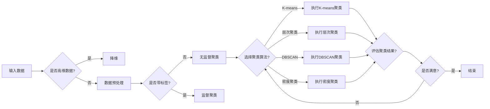

# 聚类分析原理与代码实例讲解

> 关键词：聚类分析，K-means，层次聚类，DBSCAN，密度聚类，高维数据，数据可视化

## 1. 背景介绍

聚类分析是一种无监督学习技术，它将数据集划分为若干个组或簇，使得同一簇内的数据点彼此相似，而不同簇之间的数据点彼此不同。聚类分析广泛应用于数据挖掘、机器学习、模式识别等领域，用于发现数据中的隐含结构、分类未知标签的数据以及探索数据之间的关系。

### 1.1 问题的由来

聚类分析起源于统计学领域，最早可以追溯到20世纪50年代。随着计算机技术的飞速发展，聚类分析算法不断进步，应用范围也日益广泛。在现实世界中，许多问题都可以通过聚类分析来解决，例如：

- 市场细分：将消费者根据购买行为和偏好进行分组，以便更好地进行市场定位。
- 客户细分：根据客户的购买历史和消费习惯，将客户划分为不同的群体。
- 数据挖掘：从大量数据中识别出具有相似性的数据点，发现数据中的潜在模式。

### 1.2 研究现状

目前，聚类分析已经发展出多种算法，包括K-means、层次聚类、DBSCAN、密度聚类等。每种算法都有其特定的应用场景和优缺点。随着大数据时代的到来，聚类分析的研究和应用也面临新的挑战，如高维数据、噪声数据、异常值等。

### 1.3 研究意义

聚类分析在数据挖掘和机器学习领域具有重要的意义：

- 发现数据中的隐藏结构，帮助用户更好地理解数据。
- 为后续的数据分析和机器学习任务提供基础。
- 在某些情况下，聚类分析可以替代分类和回归任务。

## 2. 核心概念与联系

聚类分析的核心概念包括：

- **数据点**：聚类分析的对象，通常表示为一个多维向量。
- **簇**：一组彼此相似的数据点集合。
- **相似度**：衡量两个数据点之间相似性的度量，常用的相似度度量包括欧氏距离、曼哈顿距离等。
- **距离度量**：衡量数据点之间距离的函数，常用的距离度量包括欧氏距离、曼哈顿距离、余弦相似度等。

以下是一个聚类分析流程的Mermaid流程图：



## 3. 核心算法原理 & 具体操作步骤

### 3.1 算法原理概述

聚类分析算法可以分为以下几类：

- **基于距离的聚类**：通过计算数据点之间的距离来划分簇，常用的算法包括K-means、层次聚类等。
- **基于密度的聚类**：根据数据点周围的密度来划分簇，常用的算法包括DBSCAN等。
- **基于模型的聚类**：将数据点视为概率模型，通过模型拟合来划分簇，常用的算法包括高斯混合模型等。

### 3.2 算法步骤详解

以下是K-means聚类算法的步骤：

1. 选择k个初始中心点。
2. 将每个数据点分配到最近的中心点，形成k个簇。
3. 重新计算每个簇的中心点。
4. 重复步骤2和3，直到中心点不再变化或达到预设的迭代次数。

### 3.3 算法优缺点

K-means算法的优点：

- 算法简单，易于实现。
- 运算速度快，适合大规模数据集。
- 适用于球形簇。

K-means算法的缺点：

- 对初始中心点的选择敏感。
- 不适用于非球形簇。
- 无法处理噪声数据。

### 3.4 算法应用领域

K-means算法适用于以下场景：

- 数据点分布较为均匀。
- 簇形状较为球形。
- 需要快速聚类。

## 4. 数学模型和公式 & 详细讲解 & 举例说明

### 4.1 数学模型构建

K-means聚类算法的数学模型如下：

$$
\text{minimize}\quad \sum_{i=1}^k \sum_{x \in S_i} d(x,c_i)
$$

其中，$d(x,c_i)$ 表示数据点x到中心点c_i的距离，$S_i$ 表示第i个簇的数据点集合。

### 4.2 公式推导过程

K-means聚类算法的目标是最小化所有数据点到其所在簇中心的距离之和。我们可以通过迭代优化每个数据点的簇分配，以及簇中心的计算，来最小化这个目标函数。

### 4.3 案例分析与讲解

假设我们有一组二维数据点，如下所示：

```
(1, 2)
(2, 1)
(3, 2)
(4, 3)
(5, 4)
(6, 5)
(7, 6)
(8, 7)
```

我们可以使用K-means算法将其聚类为两个簇：

- 簇1：{(1, 2), (2, 1), (3, 2)}
- 簇2：{(4, 3), (5, 4), (6, 5), (7, 6), (8, 7)}

首先，我们随机选择两个数据点作为初始中心点：

- c1 = (1, 2)
- c2 = (5, 4)

然后，根据距离计算将数据点分配到最近的中心点：

```
(1, 2) -> c1
(2, 1) -> c1
(3, 2) -> c1
(4, 3) -> c2
(5, 4) -> c2
(6, 5) -> c2
(7, 6) -> c2
(8, 7) -> c2
```

接着，重新计算每个簇的中心点：

- c1 = (2, 1.5)
- c2 = (5, 4.5)

重复以上步骤，直到中心点不再变化：

```
c1 = (1.5, 1.5)
c2 = (5.5, 4.5)
```

最终，数据点被聚成两个簇，簇中心分别为(1.5, 1.5)和(5.5, 4.5)。

## 5. 项目实践：代码实例和详细解释说明

### 5.1 开发环境搭建

为了进行聚类分析，我们需要安装以下Python库：

- NumPy：用于数学运算和数据处理。
- Matplotlib：用于数据可视化。
- Scikit-learn：用于机器学习算法的实现。

```bash
pip install numpy matplotlib scikit-learn
```

### 5.2 源代码详细实现

以下是一个使用Scikit-learn库实现K-means聚类的示例代码：

```python
import numpy as np
import matplotlib.pyplot as plt
from sklearn.cluster import KMeans

# 生成示例数据
data = np.array([[1, 2], [1, 4], [1, 0],
                 [10, 2], [10, 4], [10, 0]])

# 创建KMeans聚类对象，设置聚类数量为2
kmeans = KMeans(n_clusters=2, random_state=0).fit(data)

# 获取聚类标签
labels = kmeans.labels_

# 绘制结果
plt.scatter(data[:, 0], data[:, 1], c=labels)
plt.scatter(kmeans.cluster_centers_[:, 0], kmeans.cluster_centers_[:, 1], s=300, c='red', marker='x')
plt.show()
```

### 5.3 代码解读与分析

这段代码首先导入必要的库，然后生成一个示例数据集，接着创建一个KMeans聚类对象，并设置聚类数量为2。使用`fit`方法对数据进行聚类，得到聚类标签。最后，使用Matplotlib绘制聚类结果。

### 5.4 运行结果展示

运行上述代码，将得到一个散点图，其中红色“x”标记表示聚类中心点。

## 6. 实际应用场景

聚类分析在许多实际应用场景中都有广泛的应用，以下是一些例子：

- **市场细分**：通过聚类分析，将消费者根据购买行为和偏好划分为不同的群体，以便更好地进行市场定位和营销。
- **客户细分**：根据客户的购买历史和消费习惯，将客户划分为不同的群体，以便更好地进行客户关系管理和个性化推荐。
- **图像处理**：通过聚类分析，将图像中的像素点划分为不同的区域，以便进行图像分割和目标检测。
- **生物信息学**：通过聚类分析，将基因表达数据划分为不同的簇，以便发现基因之间的相互作用和疾病相关基因。

## 7. 工具和资源推荐

### 7.1 学习资源推荐

- 《Python数据科学手册》
- 《机器学习实战》
- Scikit-learn官方文档

### 7.2 开发工具推荐

- NumPy
- Matplotlib
- Scikit-learn

### 7.3 相关论文推荐

- K-means算法：MacQueen, J. B. (1967). Some methods for classification and analysis of multivariate data. In Proceedings of the 5th Berkeley symposium on mathematical statistics and probability (pp. 281-297).
- DBSCAN算法：Ester, M., Kriegel, H. P., Sander, J., & Xu, X. (1996). A density-based algorithm for discovering clusters in large spatial databases with noise. In Proceedings of the 2nd international conference on knowledge discovery and data mining (pp. 163-174).

## 8. 总结：未来发展趋势与挑战

### 8.1 研究成果总结

聚类分析作为一种无监督学习技术，在数据挖掘和机器学习领域取得了丰硕的成果。随着算法的不断发展和应用场景的不断扩展，聚类分析在数据科学和人工智能领域的地位日益重要。

### 8.2 未来发展趋势

未来聚类分析的发展趋势包括：

- 算法复杂度的降低，以便在资源受限的环境中进行聚类分析。
- 跨模态聚类，将不同类型的数据（如图像、文本、音频）进行聚类分析。
- 聚类算法的自动选择和评估，以提高聚类分析的效率和准确性。

### 8.3 面临的挑战

聚类分析面临的挑战包括：

- 高维数据的处理，如何有效地降维，以便进行聚类分析。
- 异常值的处理，如何识别和处理异常值，以保证聚类结果的准确性。
- 聚类算法的选择，如何选择合适的聚类算法，以满足不同的应用需求。

### 8.4 研究展望

未来，聚类分析的研究将主要集中在以下几个方面：

- 算法创新，开发更有效、更鲁棒的聚类算法。
- 跨模态聚类，将不同类型的数据进行聚类分析。
- 可解释性，提高聚类分析的可解释性，以便更好地理解聚类结果。
- 与其他机器学习技术的结合，将聚类分析与其他机器学习技术相结合，以提高数据分析和预测的准确性。

## 9. 附录：常见问题与解答

**Q1：聚类分析有什么应用场景？**

A：聚类分析可以应用于各种场景，例如市场细分、客户细分、图像处理、生物信息学等。

**Q2：K-means聚类算法有什么优缺点？**

A：K-means聚类算法的优点是简单、快速，适合大规模数据集；缺点是对初始中心点的选择敏感，不适用于非球形簇。

**Q3：如何处理高维数据？**

A：可以使用主成分分析（PCA）等方法对高维数据进行降维，以便进行聚类分析。

**Q4：如何处理异常值？**

A：可以使用聚类算法的异常值检测功能，或者使用数据预处理方法（如数据清洗）来处理异常值。

**Q5：如何选择合适的聚类算法？**

A：选择合适的聚类算法需要考虑数据的特点和应用需求。例如，对于数据量较大且分布均匀的场景，可以选择K-means聚类算法；对于非球形簇和噪声数据，可以选择DBSCAN聚类算法。

作者：禅与计算机程序设计艺术 / Zen and the Art of Computer Programming