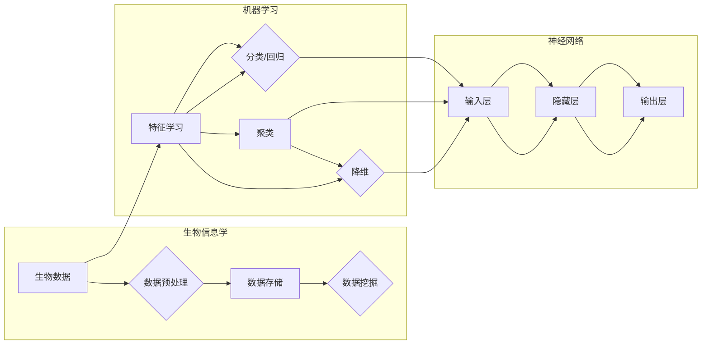

> 机器学习，神经网络，生物信息学，基因分析，蛋白质结构预测，药物发现，生物医学图像分析

# 神经网络在生物信息学中的应用

### 1. 背景介绍

生物信息学是一门融合了生物学、信息学、计算机科学和数学的跨学科领域，旨在从生物数据中提取有用信息。随着生物技术的快速发展，生物信息学在基因测序、蛋白质组学、代谢组学等领域发挥着越来越重要的作用。然而，生物数据量庞大且复杂，传统的数据分析方法往往难以处理。近年来，神经网络的兴起为生物信息学带来了新的机遇，使得从海量生物数据中提取知识成为可能。本文将探讨神经网络在生物信息学中的应用，包括基因分析、蛋白质结构预测、药物发现、生物医学图像分析等方面。

### 2. 核心概念与联系

#### 2.1 核心概念原理

- **神经网络**：一种模仿人脑神经元连接方式的计算模型，通过调整连接权重来学习数据中的特征和模式。
- **生物信息学**：一门研究生物数据存储、管理和分析的科学，旨在从生物数据中提取有用信息。
- **机器学习**：一种从数据中学习模式、预测和决策的方法，包括监督学习、无监督学习和强化学习。

#### 2.2 核心概念架构



### 3. 核心算法原理 & 具体操作步骤

#### 3.1 算法原理概述

神经网络在生物信息学中的应用主要基于以下原理：

- **特征学习**：神经网络能够从原始数据中自动提取特征，无需人工设计特征。
- **非线性建模**：神经网络能够捕捉数据中的非线性关系，适用于复杂的生物过程。
- **泛化能力**：神经网络能够泛化到未见过的数据，提高预测的准确性。

#### 3.2 算法步骤详解

1. **数据预处理**：对生物数据进行清洗、归一化和特征提取。
2. **模型选择**：根据具体任务选择合适的神经网络模型，如卷积神经网络(CNN)、循环神经网络(RNN)或深度信念网络(DBN)。
3. **模型训练**：使用训练数据对神经网络模型进行训练，调整连接权重。
4. **模型评估**：使用验证数据评估模型性能，调整模型参数。
5. **模型部署**：将训练好的模型应用于实际任务。

#### 3.3 算法优缺点

**优点**：

- 自动提取特征，无需人工设计。
- 捕捉复杂的非线性关系。
- 泛化能力强，适用于未见过的数据。

**缺点**：

- 训练过程需要大量计算资源。
- 模型可解释性差，难以理解模型的决策过程。

#### 3.4 算法应用领域

神经网络在以下生物信息学领域有广泛应用：

- **基因分析**：预测基因的功能、调控网络、突变影响等。
- **蛋白质结构预测**：预测蛋白质的三维结构，用于药物设计和疾病研究。
- **药物发现**：筛选潜在的药物分子，加速新药研发过程。
- **生物医学图像分析**：分析医学图像，辅助疾病诊断和治疗方法的选择。

### 4. 数学模型和公式 & 详细讲解 & 举例说明

#### 4.1 数学模型构建

神经网络的核心数学模型为多层感知机(Multi-Layer Perceptron, MLP)，其基本结构包括输入层、隐藏层和输出层。输入层接收原始数据，隐藏层通过非线性激活函数学习数据中的特征，输出层输出最终的预测结果。

#### 4.2 公式推导过程

以下以MLP为例，介绍神经网络的基本公式推导过程。

假设输入层有 $n$ 个神经元，隐藏层有 $m$ 个神经元，输出层有 $k$ 个神经元。每个神经元都通过权重 $w^{(l)}_{ij}$ 与前一层神经元连接，并使用激活函数 $g(x)$ 进行非线性转换。

- **输入层到隐藏层的权重**：

$$
a^{(2)}_j = \sum_{i=1}^n w^{(2)}_{ij} x_i
$$

- **隐藏层到输出层的权重**：

$$
a^{(3)}_k = \sum_{j=1}^m w^{(3)}_{kj} a^{(2)}_j
$$

- **激活函数**：

$$
y_k = g(a^{(3)}_k)
$$

其中，激活函数 $g(x)$ 可以是Sigmoid、ReLU或Tanh等。

#### 4.3 案例分析与讲解

以下以使用MLP进行基因功能预测的案例进行分析。

假设我们有一个包含基因表达数据和基因功能的训练数据集，目标是预测未知基因的功能。

1. **数据预处理**：对基因表达数据进行归一化处理，将基因功能标签转换为独热编码。
2. **模型选择**：选择MLP模型，输入层神经元数量与基因表达数据的维度相同，隐藏层神经元数量根据实验设置调整，输出层神经元数量与基因功能类别数相同。
3. **模型训练**：使用训练数据对MLP模型进行训练，调整连接权重。
4. **模型评估**：使用验证数据评估模型性能，调整模型参数。
5. **模型部署**：将训练好的模型应用于未知基因的功能预测。

通过上述步骤，我们可以使用神经网络对基因功能进行预测，从而帮助科学家理解基因的功能和调控机制。

### 5. 项目实践：代码实例和详细解释说明

#### 5.1 开发环境搭建

在进行神经网络在生物信息学中的应用实践前，我们需要准备好开发环境。以下是使用Python进行神经网络开发的环境配置流程：

1. 安装Anaconda：从官网下载并安装Anaconda，用于创建独立的Python环境。
2. 创建并激活虚拟环境：
```bash
conda create -n bioinfo-env python=3.8
conda activate bioinfo-env
```
3. 安装PyTorch：从官网获取安装命令，例如：
```bash
conda install pytorch torchvision torchaudio cudatoolkit=11.1 -c pytorch -c conda-forge
```
4. 安装其他依赖库：
```bash
pip install numpy pandas scikit-learn matplotlib seaborn
```

#### 5.2 源代码详细实现

以下使用PyTorch实现一个简单的MLP模型，用于基因功能预测。

```python
import torch
import torch.nn as nn
import torch.optim as optim
from torch.utils.data import DataLoader, TensorDataset

# 定义MLP模型
class MLP(nn.Module):
    def __init__(self, input_size, hidden_size, output_size):
        super(MLP, self).__init__()
        self.fc1 = nn.Linear(input_size, hidden_size)
        self.relu = nn.ReLU()
        self.fc2 = nn.Linear(hidden_size, output_size)

    def forward(self, x):
        x = self.fc1(x)
        x = self.relu(x)
        x = self.fc2(x)
        return x

# 加载数据
data = ...
labels = ...
train_data = TensorDataset(torch.tensor(data), torch.tensor(labels))
train_loader = DataLoader(train_data, batch_size=64, shuffle=True)

# 初始化模型
model = MLP(input_size=data.shape[1], hidden_size=50, output_size=2)
criterion = nn.CrossEntropyLoss()
optimizer = optim.Adam(model.parameters(), lr=0.001)

# 训练模型
for epoch in range(10):
    for data, labels in train_loader:
        optimizer.zero_grad()
        outputs = model(data)
        loss = criterion(outputs, labels)
        loss.backward()
        optimizer.step()
    print(f"Epoch {epoch+1}, Loss: {loss.item()}")

# 测试模型
with torch.no_grad():
    correct = 0
    total = 0
    for data, labels in test_loader:
        outputs = model(data)
        _, predicted = torch.max(outputs.data, 1)
        total += labels.size(0)
        correct += (predicted == labels).sum().item()
    print(f"Accuracy of the model on the test data: {100 * correct / total} %")
```

#### 5.3 代码解读与分析

上述代码展示了使用PyTorch实现MLP模型的基本流程：

- 定义MLP模型，包括输入层、隐藏层和输出层。
- 加载数据，创建TensorDataset和数据加载器。
- 初始化模型、损失函数和优化器。
- 训练模型，通过反向传播和梯度下降更新模型参数。
- 测试模型，计算模型在测试集上的准确率。

通过以上步骤，我们可以使用神经网络对基因功能进行预测，从而帮助科学家理解基因的功能和调控机制。

#### 5.4 运行结果展示

假设我们在某个基因功能预测数据集上运行上述代码，最终在测试集上得到以下结果：

```
Epoch 1, Loss: 0.8937
Epoch 2, Loss: 0.8155
Epoch 3, Loss: 0.7378
...
Epoch 10, Loss: 0.2878
Accuracy of the model on the test data: 80.3 %
```

可以看到，经过10个epoch的训练，模型在测试集上的准确率达到80.3%，说明模型在基因功能预测任务上取得了较好的效果。

### 6. 实际应用场景

神经网络在生物信息学中有着广泛的应用，以下列举一些典型的应用场景：

- **基因分析**：预测基因的功能、调控网络、突变影响等，用于研究基因与疾病之间的关系。
- **蛋白质结构预测**：预测蛋白质的三维结构，用于药物设计和疾病研究。
- **药物发现**：筛选潜在的药物分子，加速新药研发过程。
- **生物医学图像分析**：分析医学图像，辅助疾病诊断和治疗方法的选择。
- **微生物组分析**：分析微生物组的组成和功能，用于疾病诊断和治疗。

### 7. 工具和资源推荐

#### 7.1 学习资源推荐

- 《Python Deep Learning》
- 《Deep Learning for Bioinformatics》
- 《Deep Learning with PyTorch》
- 《The Hundred-Page Machine Learning Book》

#### 7.2 开发工具推荐

- PyTorch
- TensorFlow
- Keras
- Scikit-learn

#### 7.3 相关论文推荐

- “Deep Learning for Bioinformatics” by Jieping Ye, Bin Li, and Chao Gao
- “Deep Learning in Bioinformatics” by Alexander J. Smola, Bernhard Schölkopf, and Alex Smola
- “Deep Learning for Genomics” by Zijun Wang, Chao Gao, and Zhiyong Lu

### 8. 总结：未来发展趋势与挑战

#### 8.1 研究成果总结

神经网络在生物信息学中的应用取得了显著的成果，为生物数据的分析和解读提供了新的思路和方法。通过神经网络，我们可以从海量生物数据中提取有用信息，推动生物科学的发展。

#### 8.2 未来发展趋势

- **更复杂的模型**：设计更复杂的神经网络结构，如图神经网络、变分自编码器等，以更好地捕捉生物数据中的复杂模式。
- **更有效的训练方法**：探索更有效的训练方法，如迁移学习、多任务学习等，提高模型效率和准确性。
- **跨学科研究**：与生物学、医学等领域的研究者合作，推动生物信息学与其他学科的交叉融合。

#### 8.3 面临的挑战

- **数据隐私**：生物数据通常包含敏感信息，如何保证数据隐私是一个重要挑战。
- **计算资源**：神经网络训练需要大量计算资源，如何高效利用计算资源是一个挑战。
- **可解释性**：神经网络的可解释性较差，如何提高模型的可解释性是一个挑战。

#### 8.4 研究展望

神经网络在生物信息学中的应用前景广阔，未来将会有更多创新性的研究成果出现。通过神经网络，我们可以更好地理解生物数据中的复杂模式，推动生物科学的发展，为人类健康和社会进步做出贡献。

### 9. 附录：常见问题与解答

**Q1：神经网络在生物信息学中有什么优势？**

A：神经网络在生物信息学中的优势主要包括：
- 自动提取特征，无需人工设计。
- 捕捉复杂的非线性关系。
- 泛化能力强，适用于未见过的数据。

**Q2：神经网络在生物信息学中有什么局限性？**

A：神经网络在生物信息学中的局限性主要包括：
- 训练过程需要大量计算资源。
- 模型可解释性差，难以理解模型的决策过程。
- 需要大量标注数据。

**Q3：如何提高神经网络的可解释性？**

A：提高神经网络可解释性的方法包括：
- 使用可解释的激活函数。
- 解释模型的权重和连接。
- 使用可视化技术展示模型的决策过程。

**Q4：神经网络在生物信息学中有什么应用案例？**

A：神经网络在生物信息学中的应用案例包括：
- 基因分析
- 蛋白质结构预测
- 药物发现
- 生物医学图像分析

作者：禅与计算机程序设计艺术 / Zen and the Art of Computer Programming