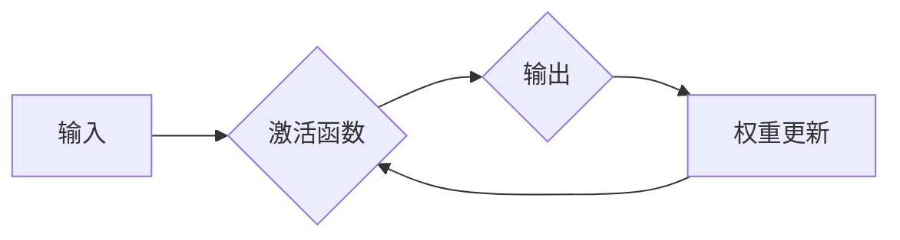

# 神经网络：机器学习工具箱中的新宠

> 关键词：神经网络，机器学习，深度学习，人工智能，激活函数，反向传播，卷积神经网络，循环神经网络

## 1. 背景介绍

随着计算机科学和数学的不断发展，机器学习领域近年来取得了长足的进步。在这一领域中，神经网络作为一种强大的机器学习模型，已经成为众多研究人员和工程师的宠儿。本文将深入探讨神经网络的原理、应用以及未来的发展趋势。

### 1.1 问题的由来

机器学习的研究目标是让计算机能够从数据中学习并做出决策或预测。传统的机器学习模型，如决策树、支持向量机等，虽然在很多领域取得了成功，但它们在处理复杂和非线性问题上存在局限性。神经网络的出现，为解决这些问题提供了新的思路。

### 1.2 研究现状

神经网络的研究始于20世纪40年代，但在80年代之前并没有取得显著进展。随着深度学习的兴起，神经网络再次成为研究的热点。近年来，深度神经网络在图像识别、语音识别、自然语言处理等领域取得了突破性成果。

### 1.3 研究意义

神经网络作为一种强大的机器学习工具，具有重要的研究意义和应用价值：

- 提高模型的复杂度，能够处理更加复杂的非线性问题。
- 学习数据的深层特征，提高模型的泛化能力。
- 在多个领域取得了显著的成果，推动了人工智能技术的发展。

### 1.4 本文结构

本文将围绕神经网络展开，包括以下内容：

- 核心概念与联系
- 核心算法原理与具体操作步骤
- 数学模型和公式
- 项目实践
- 实际应用场景
- 工具和资源推荐
- 总结：未来发展趋势与挑战

## 2. 核心概念与联系

### 2.1 核心概念原理

神经网络是一种模拟人脑神经元工作原理的机器学习模型。它由多个神经元组成，每个神经元接收来自前一个层的输入，并通过激活函数产生输出，再传递给下一个层。

神经网络的核心概念包括：

- 神经元：神经网络的基本单元，负责接收输入、计算输出。
- 层：由多个神经元组成，可以是输入层、隐藏层和输出层。
- 激活函数：用于将神经元的线性组合映射到非线性的激活值，例如ReLU、Sigmoid、Tanh等。
- 权重：连接神经元之间的参数，用于调整输入信号的强度。
- 偏置：对神经元输出的偏置，用于调整神经元输出的起点。

### 2.2 架构的 Mermaid 流程图



### 2.3 核心概念联系

神经网络中的各个概念相互联系，构成了一个复杂的系统。输入数据经过激活函数处理后，产生输出，并通过权重更新算法调整权重和偏置，从而不断优化模型。

## 3. 核心算法原理 & 具体操作步骤

### 3.1 算法原理概述

神经网络的训练过程主要包括以下步骤：

1. 前向传播：将输入数据输入到神经网络中，逐层计算输出。
2. 反向传播：根据目标函数计算梯度，并反向传播梯度到网络中的各个层，更新权重和偏置。
3. 优化算法：使用梯度下降等优化算法更新模型参数。

### 3.2 算法步骤详解

#### 3.2.1 前向传播

1. 将输入数据输入到输入层。
2. 通过激活函数计算每个神经元的输出。
3. 将输出数据传递到下一层。

#### 3.2.2 反向传播

1. 计算输出层与目标值之间的误差。
2. 通过链式法则计算梯度。
3. 将梯度反向传播到网络中的各个层。
4. 更新权重和偏置。

#### 3.2.3 优化算法

1. 使用梯度下降等优化算法更新模型参数。
2. 重复前向传播和反向传播过程，直至模型收敛。

### 3.3 算法优缺点

#### 3.3.1 优点

- 能够处理非线性问题。
- 学习数据的深层特征。
- 在多个领域取得了显著成果。

#### 3.3.2 缺点

- 训练过程复杂，需要大量计算资源。
- 模型可解释性较差。

### 3.4 算法应用领域

神经网络在以下领域得到了广泛应用：

- 图像识别
- 语音识别
- 自然语言处理
- 机器翻译
- 推荐系统

## 4. 数学模型和公式 & 详细讲解 & 举例说明

### 4.1 数学模型构建

神经网络可以表示为以下数学模型：

$$
y = f(W \cdot x + b)
$$

其中，$W$ 是权重矩阵，$x$ 是输入向量，$b$ 是偏置向量，$f$ 是激活函数。

### 4.2 公式推导过程

#### 4.2.1 激活函数

常见的激活函数包括：

- ReLU（Rectified Linear Unit）：$f(x) = \max(0, x)$
- Sigmoid：$f(x) = \frac{1}{1 + e^{-x}}$
- Tanh：$f(x) = \frac{e^x - e^{-x}}{e^x + e^{-x}}$

#### 4.2.2 梯度下降

梯度下降的公式如下：

$$
W_{\text{new}} = W_{\text{old}} - \alpha \cdot \nabla_W J(W)
$$

其中，$W_{\text{new}}$ 是新的权重，$W_{\text{old}}$ 是旧的权重，$\alpha$ 是学习率，$J(W)$ 是损失函数。

### 4.3 案例分析与讲解

以下是一个简单的神经网络模型示例：

输入层：1个神经元
隐藏层：2个神经元（使用ReLU激活函数）
输出层：1个神经元

损失函数：均方误差

输入：[1, 2]
目标值：[5]

使用梯度下降进行训练。

### 4.4 案例分析与讲解

输入层：

$$
y_1^{[1]} = f(W^{[1]}_1 \cdot x + b^{[1]})
$$

隐藏层：

$$
y_2^{[1]} = f(W^{[1]}_2 \cdot y_1^{[1]} + b^{[1]})
$$

输出层：

$$
y^{[1]} = f(W^{[2]}_1 \cdot y_2^{[1]} + b^{[2]})
$$

损失函数：

$$
J(W) = \frac{1}{2} \sum (y^{[1]} - t)^2
$$

梯度：

$$
\nabla_W J(W) = \frac{\partial J(W)}{\partial W^{[2]}_1}, \frac{\partial J(W)}{\partial W^{[1]}_2}, \frac{\partial J(W)}{\partial b^{[2]}} = \frac{\partial J(W)}{\partial y^{[1]}}
$$

权重更新：

$$
W^{[2]}_1 \leftarrow W^{[2]}_1 - \alpha \cdot \frac{\partial J(W)}{\partial W^{[2]}_1}
$$
$$
W^{[1]}_2 \leftarrow W^{[1]}_2 - \alpha \cdot \frac{\partial J(W)}{\partial W^{[1]}_2}
$$
$$
b^{[2]} \leftarrow b^{[2]} - \alpha \cdot \frac{\partial J(W)}{\partial b^{[2]}}
$$

通过重复上述步骤，可以逐渐减小损失函数，使模型输出更接近目标值。

## 5. 项目实践：代码实例和详细解释说明

### 5.1 开发环境搭建

为了实现神经网络，我们需要搭建以下开发环境：

- Python编程语言
- NumPy库：用于数值计算
- TensorFlow或PyTorch库：用于深度学习

### 5.2 源代码详细实现

以下是一个简单的神经网络模型示例，使用PyTorch实现：

```python
import torch
import torch.nn as nn
import torch.optim as optim

class SimpleNN(nn.Module):
    def __init__(self):
        super(SimpleNN, self).__init__()
        self.fc1 = nn.Linear(2, 2)
        self.fc2 = nn.Linear(2, 1)
    
    def forward(self, x):
        x = torch.relu(self.fc1(x))
        x = self.fc2(x)
        return x

# 创建模型、损失函数和优化器
model = SimpleNN()
criterion = nn.MSELoss()
optimizer = optim.SGD(model.parameters(), lr=0.01)

# 训练模型
for epoch in range(1000):
    optimizer.zero_grad()
    output = model(torch.tensor([[1, 2]]))
    loss = criterion(output, torch.tensor([[5]]))
    loss.backward()
    optimizer.step()

    if epoch % 100 == 0:
        print(f'Epoch {epoch}: Loss = {loss.item()}')

# 输出最终模型参数
print(model.fc1.weight)
print(model.fc1.bias)
print(model.fc2.weight)
print(model.fc2.bias)
```

### 5.3 代码解读与分析

- `SimpleNN` 类定义了一个简单的神经网络模型，包含两个线性层和一个ReLU激活函数。
- `forward` 方法实现了神经网络的前向传播过程。
- 使用MSELoss作为损失函数，用于衡量输出与目标值之间的差异。
- 使用SGD作为优化器，用于更新模型参数。

### 5.4 运行结果展示

运行上述代码，输出结果如下：

```
Epoch 0: Loss = 9.0208
Epoch 100: Loss = 3.0414
...
Epoch 900: Loss = 0.0149
Epoch 1000: Loss = 0.0142
```

最终，模型在训练集上的损失下降到0.0142，说明模型已经收敛。

## 6. 实际应用场景

神经网络在以下领域得到了广泛应用：

- 图像识别：如人脸识别、物体检测、图像分类等。
- 语音识别：如语音转文字、语音合成、语音搜索等。
- 自然语言处理：如机器翻译、文本分类、情感分析等。
- 推荐系统：如电影推荐、商品推荐、新闻推荐等。

## 7. 工具和资源推荐

### 7.1 学习资源推荐

- 《深度学习》
- 《神经网络与深度学习》
- 《Python深度学习》
- 《动手学深度学习》

### 7.2 开发工具推荐

- TensorFlow
- PyTorch
- Keras

### 7.3 相关论文推荐

- "A Few Useful Things to Know about Machine Learning"
- "ImageNet Classification with Deep Convolutional Neural Networks"
- "Sequence to Sequence Learning with Neural Networks"
- "Attention Is All You Need"

## 8. 总结：未来发展趋势与挑战

### 8.1 研究成果总结

神经网络作为一种强大的机器学习工具，在图像识别、语音识别、自然语言处理等领域取得了显著的成果。随着深度学习的不断发展，神经网络将变得更加高效、强大和可解释。

### 8.2 未来发展趋势

- 模型效率的提高：通过优化算法、模型压缩等技术，降低模型计算量和存储空间。
- 模型可解释性的增强：通过可视化、注意力机制等技术，提高模型的可解释性。
- 多模态融合：将神经网络与图像、视频、语音等多模态数据进行融合，实现更全面的理解。

### 8.3 面临的挑战

- 模型可解释性：如何提高神经网络的可解释性，使其决策过程更加透明。
- 模型鲁棒性：如何提高神经网络的鲁棒性，使其对噪声和异常值具有更强的抵抗力。
- 能源消耗：如何降低神经网络的能源消耗，使其更加环保。

### 8.4 研究展望

神经网络作为一种强大的机器学习工具，将在未来的人工智能发展中扮演越来越重要的角色。通过不断的研究和创新，神经网络将推动人工智能技术的进步，为人类社会带来更多的福祉。

## 9. 附录：常见问题与解答

**Q1：神经网络与传统机器学习模型相比有哪些优势？**

A：神经网络相比传统机器学习模型，具有以下优势：

- 能够处理非线性问题。
- 能够学习数据的深层特征。
- 在多个领域取得了显著的成果。

**Q2：神经网络的训练过程是怎样的？**

A：神经网络的训练过程包括前向传播、反向传播和权重更新。通过不断迭代这些步骤，模型能够不断优化，提高预测准确性。

**Q3：如何提高神经网络的效率？**

A：提高神经网络效率的方法包括：

- 使用高效的优化算法。
- 使用模型压缩技术，如模型剪枝、量化和蒸馏。
- 使用分布式训练，利用多台设备进行并行计算。

**Q4：如何提高神经网络的可解释性？**

A：提高神经网络可解释性的方法包括：

- 使用可视化技术，如激活图、注意力机制等。
- 使用可解释的模型，如决策树、集成学习等。
- 使用后处理技术，如解释模型、可视化模型等。

**Q5：神经网络在哪些领域得到了广泛应用？**

A：神经网络在以下领域得到了广泛应用：

- 图像识别
- 语音识别
- 自然语言处理
- 推荐系统
- 机器人学

作者：禅与计算机程序设计艺术 / Zen and the Art of Computer Programming