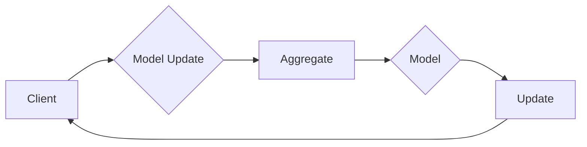

# 联邦学习在金融行业的实践与前景

> 关键词：联邦学习，金融行业，数据隐私，模型训练，分布式计算，协同学习，安全多方计算

## 1. 背景介绍

随着大数据时代的到来，金融行业积累了海量的客户数据，这些数据中蕴含着宝贵的洞察和商机。然而，数据隐私保护的要求日益严格，传统集中式数据处理模式面临着巨大的挑战。联邦学习（Federal Learning）作为一种新兴的机器学习技术，能够实现在保护数据隐私的同时，进行模型训练和推理，因此受到了金融行业的广泛关注。

### 1.1 问题的由来

金融行业的数据通常具有以下特点：

- **数据敏感度高**：金融数据涉及客户隐私、交易信息等敏感内容，对数据安全和隐私保护的要求极为严格。
- **数据多样性**：金融数据来源广泛，包括交易数据、社交数据、公开数据等，数据格式和结构多样。
- **数据量巨大**：金融行业积累了庞大的数据资源，对计算资源和存储空间的需求巨大。
- **模型复杂度高**：金融模型往往需要处理复杂的非线性关系，对算法和计算能力要求高。

传统的集中式数据处理模式，如将数据上传至云端进行训练，虽然可以充分利用云资源，但存在以下风险：

- **数据泄露风险**：数据在传输和存储过程中可能被窃取或篡改，导致客户信息泄露。
- **数据主权问题**：数据存储在第三方平台，可能涉及数据主权和合规性问题。
- **计算资源依赖**：对云服务的依赖性增强，增加了成本和风险。

联邦学习作为一种分布式机器学习技术，能够有效解决上述问题。

### 1.2 研究现状

联邦学习通过在客户端进行模型训练，而将训练数据留在本地，从而保护数据隐私。目前，联邦学习已经在金融行业得到了初步的应用，包括风险评估、欺诈检测、客户画像、个性化推荐等。

### 1.3 研究意义

联邦学习在金融行业的应用具有重要的意义：

- **保护数据隐私**：在保护数据隐私的同时，实现模型训练和推理，满足合规要求。
- **降低成本**：避免数据迁移和存储成本，降低基础设施投入。
- **提高效率**：分布式训练模式，提高模型训练效率。
- **增强数据安全**：减少数据泄露风险，增强数据安全保障。

### 1.4 本文结构

本文将围绕联邦学习在金融行业的应用展开，具体内容如下：

- 第2部分，介绍联邦学习的核心概念与联系。
- 第3部分，阐述联邦学习的核心算法原理和具体操作步骤。
- 第4部分，讲解联邦学习的数学模型和公式。
- 第5部分，提供联邦学习的项目实践实例。
- 第6部分，探讨联邦学习在金融行业的实际应用场景。
- 第7部分，推荐联邦学习的工具和资源。
- 第8部分，总结联邦学习的未来发展趋势与挑战。
- 第9部分，提供常见问题与解答。

## 2. 核心概念与联系

### 2.1 联邦学习

联邦学习是一种分布式机器学习技术，它允许多个参与者在本地设备上训练模型，同时保持数据本地化。在联邦学习过程中，参与者只需上传模型更新而不是原始数据，从而保护了数据隐私。

### 2.2 Mermaid 流程图



### 2.3 核心概念与联系

- **Client（客户端）**：负责本地模型训练，上传模型更新。
- **Model（模型）**：用于机器学习的算法模型。
- **Model Update（模型更新）**：客户端上传的模型参数更新。
- **Aggregate（聚合）**：将多个客户端的模型更新聚合为全局模型。
- **Update（更新）**：更新本地模型。

## 3. 核心算法原理 & 具体操作步骤

### 3.1 算法原理概述

联邦学习的基本原理是将机器学习模型的训练过程分布在多个客户端上，每个客户端只处理本地数据，并将模型更新发送到中心服务器进行聚合。通过这种方式，可以在不泄露原始数据的情况下，实现对模型的训练。

### 3.2 算法步骤详解

1. **初始化**：在中心服务器上初始化全局模型，并将其分发到所有客户端。
2. **本地训练**：每个客户端使用本地数据对模型进行训练，并生成模型更新。
3. **模型更新上传**：客户端将模型更新上传到中心服务器。
4. **模型聚合**：中心服务器将接收到的模型更新进行聚合，生成全局模型更新。
5. **模型更新分发**：中心服务器将全局模型更新分发给所有客户端。
6. **重复步骤2-5**：重复步骤2-5，直到满足停止条件。

### 3.3 算法优缺点

#### 优点：

- **数据隐私保护**：不需要将原始数据上传到服务器，保护了数据隐私。
- **分布式计算**：提高了计算效率，降低了单点故障风险。
- **减少数据传输**：减少了数据传输量，降低了传输成本。

#### 缺点：

- **通信开销**：模型更新上传和下载数据需要消耗网络资源。
- **同步问题**：需要解决不同客户端训练进度不一致的问题。
- **模型质量**：由于数据分布的不同，可能会导致模型质量下降。

### 3.4 算法应用领域

联邦学习在金融行业的应用领域包括：

- **欺诈检测**：通过分析交易数据，识别异常交易行为。
- **信用评分**：根据客户历史数据，评估客户的信用风险。
- **风险评估**：对市场风险进行预测和评估。
- **个性化推荐**：根据客户行为，提供个性化的金融产品和服务。

## 4. 数学模型和公式 & 详细讲解 & 举例说明

### 4.1 数学模型构建

联邦学习的数学模型可以表示为：

$$
\theta_{t+1} = \theta_{t} + \alpha \sum_{i=1}^{N} \phi(x_i, y_i)
$$

其中，$\theta_{t}$ 表示全局模型参数，$\theta_{t+1}$ 表示更新后的全局模型参数，$N$ 表示客户端数量，$\phi(x_i, y_i)$ 表示客户端 $i$ 的模型更新。

### 4.2 公式推导过程

公式推导过程如下：

- 设客户端 $i$ 的本地模型参数为 $\theta_i$，则本地模型更新为 $\phi(x_i, y_i) = \theta_i - \theta_i^{\prime}$，其中 $\theta_i^{\prime}$ 表示更新后的本地模型参数。
- 客户端 $i$ 将模型更新 $\phi(x_i, y_i)$ 上传到中心服务器。
- 中心服务器将所有客户端的模型更新进行聚合，得到全局模型更新 $\theta_{t+1}$。

### 4.3 案例分析与讲解

以下是一个简单的联邦学习案例：

- **数据集**：假设有两个客户端，分别拥有数据集 $X_1$ 和 $X_2$，标签分别为 $Y_1$ 和 $Y_2$。
- **模型**：使用线性回归模型。
- **训练过程**：每个客户端分别使用本地数据训练模型，然后将模型更新上传到中心服务器进行聚合。

## 5. 项目实践：代码实例和详细解释说明

### 5.1 开发环境搭建

为了进行联邦学习项目实践，需要搭建以下开发环境：

- **Python**：用于编写代码。
- **TensorFlow**：用于构建和训练模型。
- **Flask**：用于构建API接口。

### 5.2 源代码详细实现

以下是一个简单的联邦学习代码示例：

```python
# 导入必要的库
import tensorflow as tf
from tensorflow.keras import layers
from flask import Flask, request, jsonify

# 构建线性回归模型
def build_model():
    model = tf.keras.Sequential([
        layers.Dense(1, input_shape=(1,))
    ])
    return model

# 训练模型
def train_model(model, x, y):
    model.compile(optimizer='adam', loss='mse')
    model.fit(x, y, epochs=10)
    return model

# 聚合模型
def aggregate_models(models):
    weights = [model.trainable_variables for model in models]
    aggregated_weights = []
    for i in range(len(weights[0])):
        total_weight = tf.reduce_sum([weight[i] for weight in weights], axis=0)
        aggregated_weights.append(total_weight / len(weights))
    return aggregated_weights

# Flask API
app = Flask(__name__)

@app.route('/train', methods=['POST'])
def train():
    data = request.get_json()
    x = data['x']
    y = data['y']
    model = build_model()
    trained_model = train_model(model, x, y)
    return jsonify({'model': trained_model})

@app.route('/aggregate', methods=['POST'])
def aggregate():
    models = request.get_json()
    aggregated_weights = aggregate_models(models)
    return jsonify({'aggregated_weights': aggregated_weights})

if __name__ == '__main__':
    app.run()
```

### 5.3 代码解读与分析

- `build_model` 函数用于构建线性回归模型。
- `train_model` 函数用于训练模型。
- `aggregate_models` 函数用于聚合多个模型。
- Flask API 用于处理训练和聚合请求。

### 5.4 运行结果展示

当客户端提交训练数据时，API将返回训练后的模型。当客户端提交多个模型时，API将返回聚合后的模型参数。

## 6. 实际应用场景

### 6.1 欺诈检测

联邦学习可以用于在多个银行或金融机构之间共享欺诈检测模型，而无需共享原始交易数据。这样可以在保护数据隐私的同时，提高欺诈检测的准确率。

### 6.2 信用评分

联邦学习可以用于构建基于多源数据的信用评分模型，而无需共享敏感的客户信息。这样可以在保护客户隐私的同时，提高信用评分的准确性和可靠性。

### 6.3 风险评估

联邦学习可以用于在多个金融机构之间共享风险评估模型，从而提高风险评估的准确性和全面性。

## 7. 工具和资源推荐

### 7.1 学习资源推荐

- 《联邦学习：原理与实践》
- 《TensorFlow Federated：使用联邦学习构建智能系统》
- 《Python机器学习》

### 7.2 开发工具推荐

- TensorFlow Federated (TFF)
- PySyft
- TensorFlow Federated Core

### 7.3 相关论文推荐

- "Federated Learning: Concept and Applications"
- "TensorFlow Federated: Decentralized ML with High-Performance Computing"
- "Federated Learning for Personalized Medicine"

## 8. 总结：未来发展趋势与挑战

### 8.1 研究成果总结

联邦学习在金融行业的应用取得了显著的成果，为数据隐私保护和模型训练提供了新的解决方案。

### 8.2 未来发展趋势

未来，联邦学习在金融行业的应用将呈现以下发展趋势：

- **更高效的联邦学习算法**：提高模型训练和聚合的效率。
- **更安全的联邦学习协议**：提高数据安全和隐私保护水平。
- **跨平台联邦学习**：支持更多平台和设备，实现更广泛的部署。

### 8.3 面临的挑战

联邦学习在金融行业的应用也面临着以下挑战：

- **模型质量**：如何在保护隐私的同时，保证模型质量。
- **计算效率**：提高联邦学习算法的计算效率。
- **数据质量**：保证参与联邦学习的客户端数据质量。

### 8.4 研究展望

未来，联邦学习在金融行业的应用将不断深入，为金融行业带来更多的创新和变革。

## 9. 附录：常见问题与解答

**Q1：联邦学习与传统机器学习有什么区别？**

A：联邦学习与传统机器学习的主要区别在于，联邦学习在保护数据隐私的同时进行模型训练，而传统机器学习需要将数据上传到服务器进行训练。

**Q2：联邦学习的安全性如何保证？**

A：联邦学习通过加密、差分隐私等技术，保证数据在传输和存储过程中的安全性。

**Q3：联邦学习是否会影响模型性能？**

A：联邦学习可能会对模型性能产生一定影响，但通过优化算法和协议，可以最大限度地减少这种影响。

**Q4：联邦学习适用于哪些金融场景？**

A：联邦学习适用于需要保护数据隐私的金融场景，如欺诈检测、信用评分、风险评估等。

**Q5：联邦学习的未来发展趋势是什么？**

A：联邦学习的未来发展趋势包括更高效的算法、更安全的协议、跨平台部署等。

作者：禅与计算机程序设计艺术 / Zen and the Art of Computer Programming