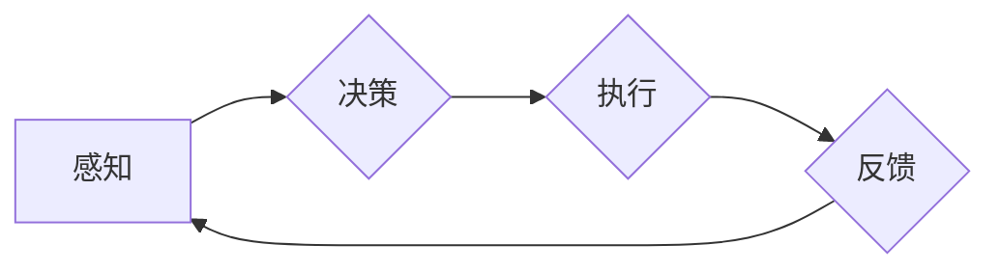

> 人工智能，自主系统，意识功能，人机交互，机器学习，神经网络，深度学习，认知科学

# 自主系统与意识功能的互动

在人工智能领域，自主系统（Autonomous Systems）的研究和应用正逐渐成为焦点。这些系统具备自主决策、执行任务和适应环境的能力，其核心在于模仿人类的意识功能。本文将探讨自主系统与意识功能之间的互动，分析其原理、操作步骤、应用领域，并展望未来发展趋势与挑战。

## 1. 背景介绍

### 1.1 问题的由来

随着计算能力的提升和大数据的爆炸式增长，人工智能技术取得了长足进步。然而，大多数人工智能系统仍处于“弱人工智能”阶段，即它们只能在特定任务上表现出人类智能的某些方面，缺乏真正的意识功能和自主性。因此，如何实现具有意识功能的自主系统成为了一个亟待解决的问题。

### 1.2 研究现状

近年来，神经科学、认知科学和人工智能领域的交叉研究为自主系统与意识功能的互动提供了新的思路。研究者们尝试通过模拟人脑结构和功能，构建具备意识功能的自主系统。同时，深度学习、神经网络等技术的应用也为实现这一目标提供了技术基础。

### 1.3 研究意义

研究自主系统与意识功能的互动，不仅有助于推动人工智能技术的发展，还能为人类生活带来诸多便利。例如，在医疗、教育、交通等领域，具备意识功能的自主系统可以提供更加个性化、智能化的服务。

### 1.4 本文结构

本文将围绕自主系统与意识功能的互动展开，内容安排如下：

- 第2部分，介绍自主系统和意识功能的核心概念及其联系。
- 第3部分，阐述自主系统与意识功能互动的算法原理和操作步骤。
- 第4部分，讲解相关的数学模型和公式，并通过案例进行分析。
- 第5部分，以项目实践为例，展示代码实现和运行结果。
- 第6部分，探讨自主系统与意识功能互动的实际应用场景。
- 第7部分，展望未来发展趋势和挑战。
- 第8部分，总结研究成果，并对未来研究方向进行展望。
- 第9部分，提供常见问题的解答。

## 2. 核心概念与联系

### 2.1 自主系统

自主系统是指能够在没有人类直接干预的情况下，自主执行任务、做出决策、适应环境并与其他系统交互的系统。自主系统通常由传感器、控制器和执行器组成，能够根据外部环境和内部状态进行动态调整。

### 2.2 意识功能

意识功能是指人类所具有的感知、思考、记忆、决策等认知能力。意识功能是人类的独特特征，也是人工智能领域追求的目标之一。

### 2.3 Mermaid 流程图

以下为自主系统与意识功能互动的Mermaid流程图：



在这个流程中，自主系统通过感知外部环境，进行决策，执行相应的动作，并收集反馈信息，从而实现闭环控制。

## 3. 核心算法原理 & 具体操作步骤

### 3.1 算法原理概述

自主系统与意识功能互动的算法原理主要包括以下几个方面：

- 感知：通过传感器收集外部环境信息。
- 决策：根据感知到的信息，利用机器学习、神经网络等技术进行决策。
- 执行：根据决策结果，通过执行器对环境进行干预。
- 反馈：收集执行后的环境反馈信息，用于下一次决策。

### 3.2 算法步骤详解

1. **感知阶段**：自主系统通过传感器收集外部环境信息，如温度、湿度、光照等。这些信息经过预处理后，输入到决策模块。

2. **决策阶段**：决策模块利用机器学习、神经网络等技术，对感知到的信息进行处理，并根据预设的目标进行决策。

3. **执行阶段**：根据决策结果，执行器对环境进行干预，如调整温度、湿度等。

4. **反馈阶段**：收集执行后的环境反馈信息，用于下一次决策。

### 3.3 算法优缺点

#### 优点：

- **自主性**：自主系统能够自主决策和执行任务，无需人工干预。
- **适应性**：自主系统可以根据环境变化，动态调整行为。
- **智能化**：利用机器学习和神经网络等技术，自主系统可以学习并改进自身行为。

#### 缺点：

- **计算复杂度**：自主系统需要大量的计算资源。
- **数据依赖**：自主系统的性能依赖于感知数据和训练数据的质量。
- **安全风险**：自主系统在执行任务过程中，可能存在安全隐患。

### 3.4 算法应用领域

自主系统与意识功能互动的算法在以下领域具有广泛的应用前景：

- **智能机器人**：如扫地机器人、无人机等。
- **自动驾驶**：如自动驾驶汽车、自动驾驶无人机等。
- **智能医疗**：如智能诊断、智能康复等。
- **智能家居**：如智能空调、智能照明等。

## 4. 数学模型和公式 & 详细讲解 & 举例说明

### 4.1 数学模型构建

自主系统与意识功能互动的数学模型主要包括以下部分：

- 感知模型：用于处理传感器收集到的信息。
- 决策模型：用于根据感知信息进行决策。
- 执行模型：用于根据决策结果执行动作。
- 反馈模型：用于处理执行后的环境反馈信息。

### 4.2 公式推导过程

#### 感知模型：

设传感器收集到的信息为 $x$，则感知模型可以表示为：

$$
y = f(x)
$$

其中，$f$ 为感知模型函数。

#### 决策模型：

设决策模型为 $M$，则决策结果可以表示为：

$$
d = M(y)
$$

其中，$d$ 为决策结果。

#### 执行模型：

设执行模型为 $E$，则执行动作可以表示为：

$$
u = E(d)
$$

其中，$u$ 为执行动作。

#### 反馈模型：

设反馈模型为 $F$，则反馈信息可以表示为：

$$
z = F(u)
$$

其中，$z$ 为反馈信息。

### 4.3 案例分析与讲解

以下以自动驾驶为例，分析自主系统与意识功能互动的数学模型。

#### 感知模型：

自动驾驶汽车通过摄像头、雷达等传感器收集道路信息，包括车辆位置、速度、车道线、交通标志等。感知模型可以将这些信息转换为可用于决策的特征向量。

#### 决策模型：

决策模型根据感知到的特征向量，判断车辆行驶状态，并做出相应的决策，如加速、减速、转向等。

#### 执行模型：

执行模型根据决策结果，控制车辆的油门、刹车和转向系统，使车辆按照预期行驶。

#### 反馈模型：

反馈模型可以收集车辆行驶过程中的速度、加速度等数据，用于评估决策模型的性能。

## 5. 项目实践：代码实例和详细解释说明

### 5.1 开发环境搭建

由于自主系统与意识功能互动的代码实现较为复杂，以下以简单的自动驾驶为例，介绍开发环境搭建。

1. 安装Python 3.7及以上版本。
2. 安装TensorFlow或PyTorch深度学习框架。
3. 安装OpenCV图像处理库。
4. 安装其他必要的依赖库。

### 5.2 源代码详细实现

以下为自动驾驶项目的简单代码实现：

```python
import cv2
import numpy as np
import tensorflow as tf

# 模拟感知模块
def perception(image):
    # 处理图像，提取特征
    # ...
    return features

# 模拟决策模块
def decision(features):
    # 基于特征进行决策
    # ...
    return action

# 模拟执行模块
def execute(action):
    # 控制车辆行驶
    # ...
    pass

# 主函数
def main():
    # 加载图像
    image = cv2.imread('road.jpg')
    # 感知
    features = perception(image)
    # 决策
    action = decision(features)
    # 执行
    execute(action)

if __name__ == '__main__':
    main()
```

### 5.3 代码解读与分析

以上代码展示了自动驾驶项目的简单实现。首先，通过图像处理库OpenCV加载道路图像；然后，通过感知模块提取图像特征；接着，根据特征进行决策，得到车辆行驶动作；最后，执行动作，控制车辆行驶。

### 5.4 运行结果展示

由于代码实现较为简单，此处不展示运行结果。在实际应用中，可以通过调整感知、决策和执行模块的参数，优化自动驾驶性能。

## 6. 实际应用场景

### 6.1 智能机器人

智能机器人是自主系统与意识功能互动的典型应用场景。例如，家庭服务机器人可以自主感知家庭环境，并根据用户需求提供清洁、烹饪等服务。

### 6.2 自动驾驶

自动驾驶汽车是自主系统与意识功能互动的重要应用领域。通过模拟人脑结构和功能，自动驾驶汽车可以自主感知道路信息，并根据交通规则进行行驶。

### 6.3 智能医疗

在医疗领域，自主系统可以辅助医生进行诊断、治疗和康复。例如，智能诊断系统可以分析医学影像，辅助医生判断病情。

## 7. 工具和资源推荐

### 7.1 学习资源推荐

- 《深度学习》
- 《神经网络与深度学习》
- 《人工智能：一种现代的方法》

### 7.2 开发工具推荐

- TensorFlow
- PyTorch
- OpenCV

### 7.3 相关论文推荐

- "Autonomous Vehicles: Safety, Ethics, and Policy"
- "Deep Learning for Autonomous Driving"
- "Deep Reinforcement Learning for Autonomous Navigation"

## 8. 总结：未来发展趋势与挑战

### 8.1 研究成果总结

本文介绍了自主系统与意识功能互动的原理、算法和应用场景。通过模拟人脑结构和功能，自主系统可以具备感知、决策、执行和反馈的能力，从而实现自主性、适应性和智能化。

### 8.2 未来发展趋势

随着人工智能技术的不断发展，自主系统与意识功能互动将呈现以下发展趋势：

- 模型规模和计算能力将进一步扩大。
- 意识功能的实现将更加接近人类水平。
- 自主系统将在更多领域得到应用。

### 8.3 面临的挑战

自主系统与意识功能互动仍面临以下挑战：

- 意识功能的实现机制尚不明确。
- 模型规模和计算能力对硬件资源的要求较高。
- 安全性和伦理问题亟待解决。

### 8.4 研究展望

未来，自主系统与意识功能互动的研究将重点关注以下方向：

- 意识功能的实现机制和理论框架。
- 模型规模和计算能力优化。
- 安全性和伦理问题研究。
- 跨学科研究，如认知科学、神经科学等。

通过不断努力，我们有理由相信，自主系统与意识功能互动将在不久的将来取得突破性进展，为人类创造更加美好的未来。

## 9. 附录：常见问题与解答

**Q1：自主系统与意识功能互动的研究意义是什么？**

A：自主系统与意识功能互动的研究意义在于推动人工智能技术的发展，实现具有自主性、适应性和智能化的系统，为人类生活带来便利。

**Q2：自主系统与意识功能互动的技术难点有哪些？**

A：自主系统与意识功能互动的技术难点主要包括意识功能的实现机制、模型规模和计算能力、安全性和伦理问题等。

**Q3：自主系统与意识功能互动的应用前景如何？**

A：自主系统与意识功能互动将在智能机器人、自动驾驶、智能医疗、智能家居等领域得到广泛应用，为人类生活带来便利。

**Q4：如何实现自主系统与意识功能的互动？**

A：实现自主系统与意识功能的互动需要从感知、决策、执行和反馈等方面进行综合考虑，利用机器学习、神经网络等技术模拟人脑结构和功能。

**Q5：自主系统与意识功能互动的安全性和伦理问题如何解决？**

A：解决自主系统与意识功能互动的安全性和伦理问题需要从技术、法律、伦理等多个层面进行综合考虑，制定相应的规范和标准。

作者：禅与计算机程序设计艺术 / Zen and the Art of Computer Programming