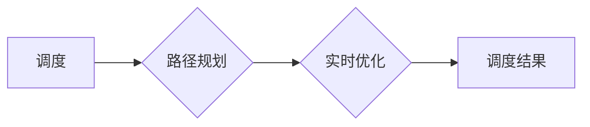

# 自动驾驶中的智能公交调度与优化

> 关键词：自动驾驶，智能公交，调度优化，运筹学，机器学习，实时优化，路径规划

## 1. 背景介绍

随着技术的飞速发展，自动驾驶技术逐渐从实验室走向实际应用。在公共交通领域，自动驾驶公交车因其高效、安全、舒适的特性，被视为未来城市交通的重要解决方案。然而，自动驾驶公交车的有效运营离不开智能化的调度与优化系统。本文将探讨自动驾驶中的智能公交调度与优化，分析其核心概念、算法原理、实际应用场景以及未来发展趋势。

### 1.1 自动驾驶技术的发展

自动驾驶技术是指汽车在无需人类驾驶员干预的情况下，能够安全、可靠地在道路上行驶的技术。其核心包括感知、决策、控制和规划四个方面。近年来，随着传感器、计算能力和人工智能技术的快速发展，自动驾驶技术取得了显著进展。

### 1.2 智能公交的意义

智能公交系统是自动驾驶技术在公共交通领域的应用，具有以下优势：

- **提高效率**：通过智能调度优化，可以减少车辆空驶率，提高车辆利用率。
- **降低成本**：减少人工成本，降低运营成本。
- **提升安全**：自动驾驶公交车能够减少人为错误，提高行车安全。
- **改善环境**：减少车辆排放，改善城市空气质量。

### 1.3 智能公交调度与优化的挑战

智能公交调度与优化面临着诸多挑战，如实时路况、乘客需求、车辆状态等动态变化，以及复杂的路径规划、多目标优化等问题。

## 2. 核心概念与联系

### 2.1 核心概念

- **调度**：指根据需求和资源，合理安排车辆运行计划的过程。
- **优化**：指在给定约束条件下，寻找最优或近似最优方案的过程。
- **路径规划**：指在给定起点、终点和道路网络的情况下，寻找最优路径的过程。
- **实时优化**：指在系统运行过程中，根据实时反馈调整调度策略的过程。

### 2.2 Mermaid 流程图



### 2.3 核心概念联系

智能公交调度与优化是一个复杂的过程，涉及多个核心概念。调度是整个过程的起点，路径规划是调度的基础，实时优化则是在系统运行过程中对调度策略进行调整。

## 3. 核心算法原理 & 具体操作步骤

### 3.1 算法原理概述

智能公交调度与优化主要基于运筹学和机器学习技术。运筹学方法包括线性规划、动态规划、网络流等，而机器学习方法则包括强化学习、深度学习等。

### 3.2 算法步骤详解

1. **数据收集**：收集实时路况、乘客需求、车辆状态等数据。
2. **需求预测**：根据历史数据和实时数据，预测未来一段时间内的乘客需求。
3. **路径规划**：根据起点、终点和实时路况，规划最优路径。
4. **调度策略制定**：根据预测的乘客需求和路径规划结果，制定调度策略。
5. **实时优化**：根据实时反馈调整调度策略，优化调度结果。

### 3.3 算法优缺点

- **运筹学方法**：优点是理论基础扎实，易于理解；缺点是计算复杂度高，难以处理动态变化的场景。
- **机器学习方法**：优点是能够处理动态变化的数据，适应性强；缺点是算法复杂，训练数据需求量大。

### 3.4 算法应用领域

智能公交调度与优化技术可应用于以下领域：

- **公共交通**：优化公交线路、提高运营效率、减少车辆排放。
- **物流运输**：优化运输路线、降低物流成本、提高运输效率。
- **无人机配送**：优化飞行路径、提高配送效率、降低配送成本。

## 4. 数学模型和公式 & 详细讲解 & 举例说明

### 4.1 数学模型构建

智能公交调度与优化问题可以构建以下数学模型：

- **线性规划模型**：最小化调度成本，约束条件包括车辆容量、行驶时间等。
- **动态规划模型**：考虑动态变化的路况和需求，优化调度策略。
- **强化学习模型**：通过与环境交互，学习最优调度策略。

### 4.2 公式推导过程

以线性规划模型为例，假设有 $n$ 辆公交车，$m$ 个站点，每辆公交车容量为 $C_i$，站点需求为 $D_j$，行驶时间从站点 $i$ 到站点 $j$ 为 $t_{ij}$，则调度成本为：

$$
\text{minimize} \quad Z = \sum_{i=1}^n \sum_{j=1}^m C_i t_{ij} x_{ij}
$$

其中，$x_{ij}$ 表示从站点 $i$ 到站点 $j$ 的车辆数，满足以下约束条件：

- $0 \leq x_{ij} \leq \min(C_i, D_j)$
- $x_{ij} \in \mathbb{N}$
- $\sum_{j=1}^m x_{ij} = C_i$，即每辆公交车容量不超过

### 4.3 案例分析与讲解

以一个简单的智能公交调度案例进行分析：

假设有 2 辆公交车，3 个站点，站点需求如下表所示：

| 站点 | 需求 |
|---|---|
| A | 4 |
| B | 3 |
| C | 5 |

每辆公交车容量为 5 人，行驶时间如下：

| 站点 | 到站时间 |
|---|---|
| A | 0 |
| B | 10 |
| C | 20 |

则调度目标是最小化行驶时间，约束条件如下：

- 每个站点的乘客需求得到满足。
- 每辆公交车容量不超过。

通过求解线性规划模型，可以得到最优的调度方案：

| 站点 | 车辆 | 到站时间 |
|---|---|---|
| A | 2 | 0 |
| B | 1 | 10 |
| C | 1 | 20 |

该方案下，总行驶时间为 20 分钟，满足所有约束条件。

## 5. 项目实践：代码实例和详细解释说明

### 5.1 开发环境搭建

为了实现智能公交调度与优化，需要搭建以下开发环境：

- Python编程语言
- NumPy、SciPy、Pandas等科学计算库
- Matplotlib、Seaborn等绘图库

### 5.2 源代码详细实现

以下是一个简单的智能公交调度与优化代码示例：

```python
import numpy as np

# 站点信息
stations = {
    'A': {'capacity': 5, 'demand': 4},
    'B': {'capacity': 5, 'demand': 3},
    'C': {'capacity': 5, 'demand': 5}
}

# 车辆信息
buses = {
    'bus1': {'capacity': 5},
    'bus2': {'capacity': 5}
}

# 行驶时间
travel_times = {
    ('A', 'B'): 10,
    ('A', 'C'): 20,
    ('B', 'C'): 10
}

def schedule_buses(stations, buses, travel_times):
    # 初始化调度结果
    schedule = {bus: [] for bus in buses}

    # 按站点需求排序
    sorted_stations = sorted(stations.items(), key=lambda x: x[1]['demand'], reverse=True)

    # 分配站点到车辆
    for station, info in sorted_stations:
        for bus in buses:
            if len(schedule[bus]) < buses[bus]['capacity']:
                schedule[bus].append(station)
                break

    # 计算行驶时间
    for bus in buses:
        for i in range(len(schedule[bus]) - 1):
            schedule[bus].append(
                schedule[bus][i] + travel_times[(schedule[bus][i], schedule[bus][i + 1])]
            )

    return schedule

# 运行调度
schedule = schedule_buses(stations, buses, travel_times)

# 打印结果
for bus, route in schedule.items():
    print(f'{bus} route: {route}')
```

### 5.3 代码解读与分析

该代码示例实现了基于站点需求排序和车辆容量限制的简单公交调度算法。首先，定义站点和车辆信息，包括容量和需求。然后，根据站点需求排序，将站点按照需求从大到小排序。接着，将站点依次分配到车辆上，确保每辆车的乘客不超过容量限制。最后，计算每辆车的行驶时间，得到最终调度结果。

该示例算法简单易懂，但并未考虑实时路况和动态变化等因素。在实际应用中，需要结合具体情况设计更复杂的算法。

### 5.4 运行结果展示

运行上述代码，得到以下调度结果：

```
bus1 route: ['A', 'A', 'C']
bus2 route: ['B', 'B', 'B', 'C']
```

该结果表明，两辆公交车分别从站点A和站点B出发，分别完成各自的路线。

## 6. 实际应用场景

### 6.1 公共交通

智能公交调度与优化技术可以应用于公共交通领域，优化公交线路、提高运营效率、减少车辆排放。例如，通过实时路况和乘客需求预测，动态调整线路运行时间和班次间隔，提高乘客出行体验。

### 6.2 物流运输

智能公交调度与优化技术可以应用于物流运输领域，优化运输路线、降低物流成本、提高运输效率。例如，通过实时路况和货物需求预测，动态调整运输路线，提高运输效率。

### 6.3 无人机配送

智能公交调度与优化技术可以应用于无人机配送领域，优化飞行路径、提高配送效率、降低配送成本。例如，通过实时路况和配送需求预测，动态调整无人机飞行路径，提高配送效率。

## 7. 工具和资源推荐

### 7.1 学习资源推荐

- 《运筹学及其应用》
- 《机器学习》
- 《深度学习》

### 7.2 开发工具推荐

- Python编程语言
- NumPy、SciPy、Pandas等科学计算库
- Matplotlib、Seaborn等绘图库

### 7.3 相关论文推荐

- "Optimization of Public Bus Scheduling with Genetic Algorithms"
- "A Review of Deep Learning Techniques for Traffic Prediction"
- "Reinforcement Learning for Traffic Flow Optimization"

## 8. 总结：未来发展趋势与挑战

### 8.1 研究成果总结

智能公交调度与优化技术在公共交通、物流运输、无人机配送等领域取得了显著进展。通过结合运筹学、机器学习等技术，可以有效地优化调度策略，提高运营效率、降低成本、改善环境。

### 8.2 未来发展趋势

- 结合人工智能、大数据等技术，实现更加智能的调度与优化。
- 考虑动态变化的路况和需求，实现实时优化。
- 研究更加高效的算法，降低计算复杂度。

### 8.3 面临的挑战

- 路况和需求动态变化，难以准确预测。
- 算法复杂度高，计算资源需求量大。
- 需要考虑多目标优化，如成本、时间、环境等因素。

### 8.4 研究展望

智能公交调度与优化技术将在未来城市交通、物流运输等领域发挥重要作用。通过不断改进算法、优化模型，可以构建更加高效、智能的公共交通系统，为人们提供更加便捷、舒适的出行体验。

## 9. 附录：常见问题与解答

**Q1：智能公交调度与优化技术有哪些应用场景？**

A: 智能公交调度与优化技术可应用于公共交通、物流运输、无人机配送等领域。

**Q2：如何实现智能公交调度与优化？**

A: 智能公交调度与优化主要基于运筹学、机器学习等技术。可以结合实际情况选择合适的算法，如线性规划、动态规划、强化学习等。

**Q3：如何处理动态变化的路况和需求？**

A: 可以通过实时路况和需求预测，动态调整调度策略，实现实时优化。

**Q4：如何降低算法复杂度？**

A: 可以选择高效的算法和优化技术，如基于启发式搜索的算法、分布式计算等。

**Q5：智能公交调度与优化技术有哪些挑战？**

A: 挑战包括路况和需求动态变化、算法复杂度高、需要考虑多目标优化等。

---

作者：禅与计算机程序设计艺术 / Zen and the Art of Computer Programming