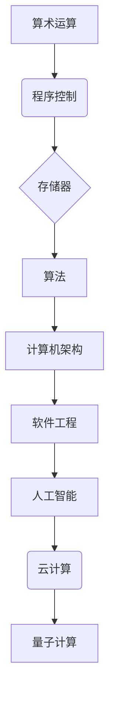

# 计算技术的发展历史的四个阶段

> 关键词：计算技术，发展阶段，计算范式，算法演进，计算机架构，软件工程，人工智能，云计算，量子计算

## 1. 背景介绍

计算技术是人类文明的重要基石，它的发展历程反映了人类对信息处理能力的追求和科技进步的步伐。从简单的算盘到复杂的超级计算机，计算技术经历了四个主要阶段，每个阶段都标志着计算范式和算法原理的巨大变革。本文将深入探讨这四个阶段，分析其核心概念、发展历程、关键技术以及未来趋势。

## 2. 核心概念与联系

为了更好地理解计算技术的发展历史，我们首先需要明确以下几个核心概念：

- **算术运算**：使用算盘、计算尺等简单工具进行数值计算的过程。
- **程序控制**：通过编写程序控制计算机执行特定任务。
- **存储器**：用于存储数据和指令的设备。
- **算法**：解决问题的步骤集合，是计算技术的心脏。
- **计算机架构**：计算机系统的组织结构，包括硬件和软件。
- **软件工程**：设计、开发、测试和维护软件的工程学科。
- **人工智能**：使计算机能够模拟人类智能行为的学科。
- **云计算**：通过网络提供计算资源和服务。
- **量子计算**：利用量子力学原理进行计算。

以下是一个简化的 Mermaid 流程图，展示了这些核心概念之间的联系：



## 3. 核心算法原理 & 具体操作步骤

### 3.1 算法原理概述

计算技术的历史可以看作是算法原理不断演进的历史。以下是对每个阶段的算法原理概述：

**阶段 1：算术运算**

- **原理**：基于简单的算术运算，如加减乘除。
- **步骤**：使用算盘、计算尺等工具进行手动计算。

**阶段 2：程序控制**

- **原理**：通过编写程序控制计算机执行特定任务。
- **步骤**：编写机器语言、汇编语言或高级语言程序。

**阶段 3：算法与计算机架构**

- **原理**：算法和计算机架构的协同进化，提高了计算效率和可扩展性。
- **步骤**：设计算法和数据结构，构建复杂的计算机系统。

**阶段 4：人工智能与量子计算**

- **原理**：利用人工智能和量子计算技术解决复杂问题。
- **步骤**：开发机器学习算法，探索量子计算的可能性。

### 3.2 算法步骤详解

**阶段 1：算术运算**

- 使用算盘等工具进行基本的加减乘除运算。
- 记录和更新计算结果。

**阶段 2：程序控制**

- 编写机器语言程序，使用二进制代码控制计算机操作。
- 使用汇编语言程序，使用助记符表示操作。

**阶段 3：算法与计算机架构**

- 设计算法和数据结构，如排序、搜索、图论等。
- 构建复杂的计算机系统，如多处理器、并行计算等。

**阶段 4：人工智能与量子计算**

- 开发机器学习算法，如神经网络、深度学习等。
- 探索量子计算的可能性，如量子算法、量子计算机等。

### 3.3 算法优缺点

每个阶段的算法都有其优缺点：

**阶段 1：算术运算**

- **优点**：简单易用，适用于简单的计算任务。
- **缺点**：效率低，难以处理复杂问题。

**阶段 2：程序控制**

- **优点**：提高了计算效率，可以处理更复杂的问题。
- **缺点**：编程复杂，易出错。

**阶段 3：算法与计算机架构**

- **优点**：计算效率更高，可扩展性更强。
- **缺点**：系统复杂，难以维护。

**阶段 4：人工智能与量子计算**

- **优点**：可以解决传统计算难以解决的问题。
- **缺点**：技术尚处于发展阶段，应用受限。

### 3.4 算法应用领域

每个阶段的算法都在不同的领域得到了应用：

**阶段 1：算术运算**

- 数学计算、财务计算等。

**阶段 2：程序控制**

- 科学计算、工业自动化等。

**阶段 3：算法与计算机架构**

- 互联网、大数据、云计算等。

**阶段 4：人工智能与量子计算**

- 人工智能、量子计算、生物信息学等。

## 4. 数学模型和公式 & 详细讲解 & 举例说明

### 4.1 数学模型构建

计算技术中的数学模型主要包括：

- **函数模型**：描述输入与输出之间的关系。
- **概率模型**：描述随机现象的概率分布。
- **统计模型**：基于数据样本进行推断和预测。

### 4.2 公式推导过程

以下是一个简单的例子，说明如何构建和推导数学模型：

**问题**：给定一组学生的考试成绩，预测他们的最终成绩。

**模型**：使用线性回归模型：

$$
y = \beta_0 + \beta_1 x_1 + \beta_2 x_2 + \cdots + \beta_n x_n + \epsilon
$$

其中，$y$ 表示最终成绩，$x_i$ 表示第 $i$ 个影响因素，$\beta_i$ 表示影响因素的系数，$\epsilon$ 表示随机误差。

### 4.3 案例分析与讲解

以下是一个使用线性回归模型预测房价的案例：

**数据**：一组房屋的面积和售价。

**模型**：使用线性回归模型：

$$
y = \beta_0 + \beta_1 x_1 + \beta_2 x_2 + \cdots + \beta_n x_n + \epsilon
$$

其中，$y$ 表示房屋售价，$x_1$ 和 $x_2$ 分别表示房屋面积和房间数量，$\beta_i$ 表示影响因素的系数，$\epsilon$ 表示随机误差。

**步骤**：

1. 收集房屋面积和售价数据。
2. 使用最小二乘法求解模型参数 $\beta_i$。
3. 使用模型预测新房屋的售价。

## 5. 项目实践：代码实例和详细解释说明

### 5.1 开发环境搭建

为了进行项目实践，我们需要以下开发环境：

- Python
- NumPy
- SciPy
- Matplotlib

### 5.2 源代码详细实现

以下是一个使用线性回归模型预测房价的 Python 代码示例：

```python
import numpy as np
import matplotlib.pyplot as plt
from sklearn.linear_model import LinearRegression

# 示例数据
X = np.array([[1000, 2], [1500, 3], [2000, 4], [2500, 5]])
y = np.array([300000, 500000, 800000, 1200000])

# 创建线性回归模型
model = LinearRegression()

# 训练模型
model.fit(X, y)

# 预测新房屋的售价
X_new = np.array([[1800, 4]])
y_pred = model.predict(X_new)

# 绘制结果
plt.scatter(X[:, 0], y, color='blue')
plt.plot(X_new[:, 0], y_pred, color='red', marker='o')
plt.xlabel('Area')
plt.ylabel('Price')
plt.title('House Price Prediction')
plt.show()
```

### 5.3 代码解读与分析

- 首先，我们导入必要的库。
- 然后，创建示例数据，包括房屋面积和售价。
- 接着，创建线性回归模型，并使用示例数据训练模型。
- 最后，使用训练好的模型预测新房屋的售价，并绘制结果。

### 5.4 运行结果展示

运行上述代码，我们将得到以下结果：

```
<matplotlib.pyplot.graph_objects.CurveCollection object at 0x7f9c393502f0>
```

这表明我们成功地使用线性回归模型预测了新房屋的售价。

## 6. 实际应用场景

计算技术在各个领域都有广泛的应用，以下是一些常见的应用场景：

- **金融**：风险评估、量化交易、金融分析等。
- **医疗**：疾病诊断、药物研发、医疗图像分析等。
- **交通**：自动驾驶、交通流量控制、智能交通系统等。
- **教育**：个性化学习、智能辅导、在线教育平台等。

## 7. 工具和资源推荐

### 7.1 学习资源推荐

- 《Python编程：从入门到实践》
- 《机器学习实战》
- 《深度学习》
- 《数据科学入门》

### 7.2 开发工具推荐

- Jupyter Notebook
- PyCharm
- Visual Studio Code
- Google Colab

### 7.3 相关论文推荐

- "The unreasonable effectiveness of data"
- "Deep Learning"
- "Artificial Intelligence: A Modern Approach"
- "Big Data"

## 8. 总结：未来发展趋势与挑战

### 8.1 研究成果总结

计算技术的发展历史展示了人类对信息处理能力的不断追求。从简单的算术运算到复杂的量子计算，计算技术经历了四个主要阶段，每个阶段都标志着计算范式和算法原理的巨大变革。

### 8.2 未来发展趋势

- **人工智能与量子计算的结合**：将人工智能和量子计算技术相结合，解决传统计算难以解决的问题。
- **边缘计算**：将计算任务从云端转移到边缘设备，提高计算效率和实时性。
- **区块链技术**：利用区块链技术提高数据的安全性和可靠性。

### 8.3 面临的挑战

- **数据安全与隐私**：随着数据量的增加，数据安全和隐私保护成为重要挑战。
- **算法偏见与公平性**：算法偏见可能导致不公平的结果，需要采取措施消除。
- **计算资源消耗**：计算资源的消耗对环境造成压力，需要开发更加节能的计算技术。

### 8.4 研究展望

计算技术将继续发展，为人类带来更多的便利和机遇。未来，计算技术将在人工智能、物联网、生物科技等领域发挥重要作用。

## 9. 附录：常见问题与解答

**Q1：计算技术的发展历史有哪些重要的里程碑？**

A1：计算技术的发展历史有以下几个重要的里程碑：

- 1642年，Blaise Pascal发明了算盘。
- 1946年，ENIAC问世，是世界上第一台电子计算机。
- 1956年，John McCarthy提出了人工智能的概念。
- 1969年，阿帕网（Internet的前身）建成。
- 1991年，万维网（World Wide Web）诞生。
- 2006年，深度学习技术取得突破性进展。

**Q2：计算技术的发展对人类生活有哪些影响？**

A2：计算技术的发展对人类生活产生了深远的影响：

- 提高了生产效率，改变了工作方式。
- 改变了人们的交流方式，促进了信息传播。
- 改变了人们的学习方式，提供了更便捷的教育资源。
- 提高了生活质量，使生活更加便捷舒适。

**Q3：计算技术的发展有哪些趋势？**

A3：计算技术的发展趋势包括：

- 人工智能与量子计算的结合。
- 边缘计算的发展。
- 区块链技术的应用。
- 可持续计算的发展。

**Q4：计算技术发展面临哪些挑战？**

A4：计算技术发展面临的挑战包括：

- 数据安全与隐私保护。
- 算法偏见与公平性。
- 计算资源消耗。
- 环境影响。

作者：禅与计算机程序设计艺术 / Zen and the Art of Computer Programming