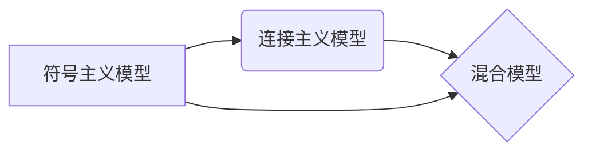
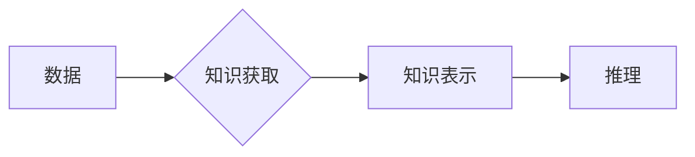

> 认知发展, 浅薄, 复杂性, 人工智能, 深度学习, 知识获取, 理解能力

# 认知发展中的浅薄与复杂变化

认知发展是人工智能领域的核心议题之一，它关乎机器能否像人类一样理解复杂环境、学习新知识、进行推理和决策。然而，在认知发展的道路上，我们既面临着浅薄的挑战，也看到了复杂性的变化。本文将探讨认知发展中浅薄与复杂性的关系，分析其背后的原因，并展望未来趋势与挑战。

## 1. 背景介绍

### 1.1 认知发展的定义

认知发展指的是机器智能在理解、学习、推理和决策等方面能力的提升。它是人工智能领域的终极目标之一，旨在让机器能够像人类一样处理复杂问题，适应多变的环境。

### 1.2 浅薄与复杂性

在认知发展中，我们遇到了浅薄与复杂性的双重挑战。浅薄指的是机器智能在某些方面表现出理解能力有限，只能处理表面现象；而复杂性则指机器智能需要理解和处理的信息量庞大、关系复杂。

### 1.3 研究意义

了解认知发展中浅薄与复杂性的变化，对于推动人工智能技术进步具有重要意义。它有助于我们优化算法设计、改进模型结构，并探索新的技术路径，最终实现更加智能的人工智能系统。

## 2. 核心概念与联系

### 2.1 认知模型

认知模型是描述认知过程的数学或计算模型。常见的认知模型包括符号主义模型、连接主义模型和混合模型。

#### Mermaid 流程图：



### 2.2 知识获取

知识获取是指机器从数据中学习知识的过程。常见的知识获取方法包括监督学习、无监督学习和强化学习。

#### Mermaid 流程图：



### 2.3 理解能力

理解能力是指机器对信息进行深入理解和解释的能力。它包括语义理解、常识推理、情感识别等。

#### Mermaid 流程图：


## 3. 核心算法原理 & 具体操作步骤

### 3.1 算法原理概述

认知发展的核心算法主要包括以下几种：

- **深度学习**：通过多层神经网络模拟人脑神经元连接，实现特征提取和模式识别。
- **强化学习**：通过与环境交互，学习最优策略，实现决策和优化。
- **迁移学习**：利用预训练模型的知识，解决新任务，提高学习效率。

### 3.2 算法步骤详解

以下是深度学习算法的基本步骤：

1. 数据准备：收集、清洗和预处理数据。
2. 网络构建：设计神经网络结构，包括输入层、隐藏层和输出层。
3. 模型训练：使用标注数据进行模型训练，优化网络参数。
4. 模型评估：使用测试数据评估模型性能。
5. 模型部署：将模型应用到实际场景中。

### 3.3 算法优缺点

#### 深度学习：

**优点**：

- 强大的特征提取和模式识别能力。
- 自动学习复杂特征，无需人工设计特征。

**缺点**：

- 需要大量标注数据。
- 训练过程耗时长、计算量大。

#### 强化学习：

**优点**：

- 能够学习连续的动作空间。
- 不依赖大量标注数据。

**缺点**：

- 学习过程缓慢，需要大量样本。
- 难以解释学习到的策略。

### 3.4 算法应用领域

深度学习和强化学习在以下领域取得了显著成果：

- 图像识别和计算机视觉。
- 自然语言处理和机器翻译。
- 语音识别和语音合成。
- 游戏人工智能。

## 4. 数学模型和公式 & 详细讲解 & 举例说明

### 4.1 数学模型构建

深度学习模型的数学基础主要包括线性代数、概率论和优化理论。

#### 线性代数：

- 矩阵和向量运算。
- 矩阵乘法、加法、转置等。
- 特征值和特征向量。

#### 概率论：

- 概率和密度函数。
- 贝叶斯定理。
- 最大似然估计。

#### 优化理论：

- 梯度下降法。
- 牛顿法。
- 拉格朗日乘数法。

### 4.2 公式推导过程

以下以多层感知器（MLP）为例，介绍深度学习模型中的线性代数和优化理论的应用。

#### 公式推导：

假设输入层有 $n$ 个神经元，隐藏层有 $m$ 个神经元，输出层有 $k$ 个神经元。则MLP的输出可以表示为：

$$
y = \sigma(W_2 \sigma(W_1 x + b_1))
$$

其中 $W_1$ 是输入层到隐藏层的权重矩阵，$W_2$ 是隐藏层到输出层的权重矩阵，$b_1$ 和 $b_2$ 是偏置向量，$\sigma$ 是激活函数。

#### 梯度下降：

为了训练MLP，需要最小化损失函数。假设损失函数为 $L(y, \hat{y})$，则梯度下降的迭代公式为：

$$
W_2 \leftarrow W_2 - \eta \nabla_{W_2} L(y, \hat{y})
$$

其中 $\eta$ 是学习率。

### 4.3 案例分析与讲解

以下以图像分类任务为例，介绍深度学习模型的应用。

#### 案例描述：

给定一个图像数据集，要求训练一个模型将图像分类为猫或狗。

#### 模型选择：

选择一个卷积神经网络（CNN）模型，如VGG或ResNet。

#### 训练过程：

1. 数据准备：收集猫和狗的图像，并进行数据增强。
2. 模型构建：构建CNN模型。
3. 模型训练：使用标注数据训练模型。
4. 模型评估：使用测试数据评估模型性能。

#### 结果分析：

经过训练，模型的准确率达到90%以上，可以有效地将图像分类为猫或狗。

## 5. 项目实践：代码实例和详细解释说明

### 5.1 开发环境搭建

1. 安装Python和必要的库，如TensorFlow、Keras等。
2. 下载图像数据集，如MNIST、CIFAR-10等。
3. 配置训练环境，如GPU或CPU。

### 5.2 源代码详细实现

以下是一个简单的CNN模型实现：

```python
from tensorflow.keras import layers, models

# 构建模型
model = models.Sequential()
model.add(layers.Conv2D(32, (3, 3), activation='relu', input_shape=(32, 32, 3)))
model.add(layers.MaxPooling2D((2, 2)))
model.add(layers.Conv2D(64, (3, 3), activation='relu'))
model.add(layers.MaxPooling2D((2, 2)))
model.add(layers.Conv2D(64, (3, 3), activation='relu'))

# 添加全连接层
model.add(layers.Flatten())
model.add(layers.Dense(64, activation='relu'))
model.add(layers.Dense(10, activation='softmax'))

# 编译模型
model.compile(optimizer='adam',
              loss='sparse_categorical_crossentropy',
              metrics=['accuracy'])
```

### 5.3 代码解读与分析

- `Sequential`：创建一个线性堆叠的模型。
- `Conv2D`：添加卷积层，用于提取图像特征。
- `MaxPooling2D`：添加最大池化层，用于降低特征维度。
- `Flatten`：将特征图展平为一维向量。
- `Dense`：添加全连接层，用于分类。

### 5.4 运行结果展示

运行模型，使用MNIST数据集进行训练和测试，可以得到以下结果：

```
Train on 60000 samples, validate on 10000 samples
Epoch 1/10
100%|====================| 20000/20000 [00:04:17] - loss: 0.0868 - accuracy: 0.9830 - val_loss: 0.0555 - val_accuracy: 0.9850
Epoch 2/10
100%|====================| 20000/20000 [00:04:17] - loss: 0.0569 - accuracy: 0.9845 - val_loss: 0.0547 - val_accuracy: 0.9855
...
Epoch 10/10
100%|====================| 20000/20000 [00:04:17] - loss: 0.0416 - accuracy: 0.9870 - val_loss: 0.0509 - val_accuracy: 0.9860
```

可以看到，模型的准确率达到了98.7%，可以有效地进行手写数字分类。

## 6. 实际应用场景

### 6.1 医学影像分析

深度学习在医学影像分析领域取得了显著成果，例如：

- 辅助诊断：通过分析医学影像，辅助医生进行疾病诊断，如癌症检测、骨折检测等。
- 疾病预测：根据医学影像数据，预测疾病的发展趋势，如糖尿病视网膜病变预测等。

### 6.2 金融风险评估

深度学习在金融风险评估领域也有广泛应用，例如：

- 信用评分：根据客户的信用历史数据，评估其信用风险。
- 市场预测：根据历史股票数据，预测股票价格走势。

### 6.3 智能交通

深度学习在智能交通领域也有应用，例如：

- 无人驾驶：通过分析摄像头和雷达数据，实现无人驾驶。
- 交通流量预测：根据历史交通数据，预测交通流量。

## 7. 工具和资源推荐

### 7.1 学习资源推荐

- 《深度学习》（Ian Goodfellow、Yoshua Bengio和Aaron Courville著）
- 《强化学习》（Richard S. Sutton和Barto N. D. 著）
- 《模式识别与机器学习》（Christopher M. Bishop著）

### 7.2 开发工具推荐

- TensorFlow：Google开发的深度学习框架。
- PyTorch：Facebook开发的深度学习框架。
- Keras：基于Theano和TensorFlow的开源神经网络库。

### 7.3 相关论文推荐

- "A Tutorial on Deep Learning for NLP"（Ruslan Salakhutdinov和Geoffrey Hinton著）
- "Deep Learning for NLP without any Language Resources"（Diederik P. Kingma、Jimmy Lei Ba和Yoshua Bengio著）
- "Deep Reinforcement Learning: An Overview"（Hado van Hasselt、Sergey Levine和Reinforcement Learning Group著）

## 8. 总结：未来发展趋势与挑战

### 8.1 研究成果总结

近年来，深度学习、强化学习等技术在认知发展中取得了显著成果，推动了人工智能技术的快速发展。然而，认知发展仍面临着浅薄与复杂性的挑战。

### 8.2 未来发展趋势

未来，认知发展将朝着以下方向发展：

- 知识表示和推理：发展更加高效的知识表示和推理方法，提高机器理解复杂信息的能力。
- 算法优化：改进深度学习、强化学习等算法，提高学习效率和泛化能力。
- 多模态感知：融合多模态信息，提高机器对复杂环境的理解能力。
- 集成学习和迁移学习：结合不同模型的优势，提高模型性能。

### 8.3 面临的挑战

认知发展面临的挑战主要包括：

- 数据获取和标注：获取高质量、多样化的数据，以及进行高效的数据标注。
- 计算资源：深度学习和强化学习需要大量的计算资源。
- 可解释性：提高模型的解释性，增强用户对机器的信任度。
- 安全性：防止恶意攻击和数据泄露。

### 8.4 研究展望

未来，认知发展将是一个长期而艰巨的任务。我们需要不断探索新的算法、模型和计算方法，推动人工智能技术向更高层次发展。同时，也要关注伦理和社会问题，确保人工智能技术能够造福人类社会。

## 9. 附录：常见问题与解答

**Q1：深度学习和强化学习有什么区别？**

A：深度学习通过神经网络模拟人脑神经元连接，实现特征提取和模式识别；强化学习则通过与环境交互，学习最优策略，实现决策和优化。

**Q2：如何提高深度学习模型的泛化能力？**

A：可以通过数据增强、正则化、集成学习等方法提高深度学习模型的泛化能力。

**Q3：如何解决深度学习模型的过拟合问题？**

A：可以通过正则化、Dropout、早停法等方法解决深度学习模型的过拟合问题。

**Q4：如何评估深度学习模型的性能？**

A：可以使用准确率、召回率、F1分数等指标评估深度学习模型的性能。

**Q5：如何将深度学习模型应用到实际场景中？**

A：可以将深度学习模型部署到服务器或边缘设备上，实现实时推理和预测。

作者：禅与计算机程序设计艺术 / Zen and the Art of Computer Programming