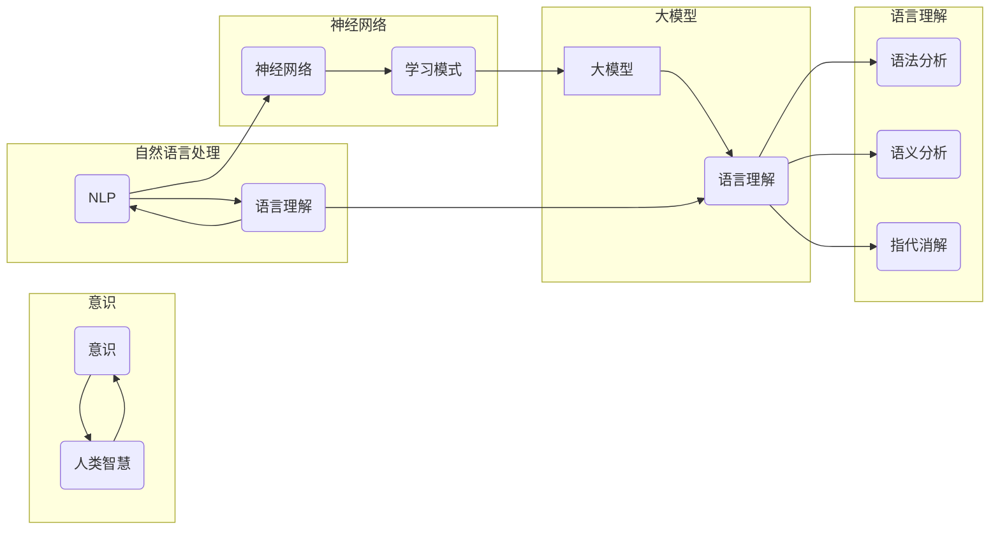

> 关键词：大模型，认知难题，语言理解，意识，神经网络，自然语言处理，机器学习

# 语言≠思维：大模型的认知难题

## 1. 背景介绍

随着深度学习技术的飞速发展，人工智能领域取得了显著的进步。其中，大模型（Large Language Models, LLMs）如BERT、GPT等，在自然语言处理（Natural Language Processing, NLP）领域展现出惊人的能力。这些模型能够理解复杂的语言结构，甚至生成流畅的文本。然而，尽管大模型在语言任务上表现出色，人们对于它们的认知能力却存在诸多疑问。本文将探讨大模型的认知难题，揭示语言与思维之间的本质区别。

## 2. 核心概念与联系

### 2.1 核心概念

#### 大模型（Large Language Models）

大模型是指通过在海量文本数据上预训练，能够理解和生成自然语言的大型神经网络模型。它们通常包含数十亿甚至数千亿个参数，能够处理复杂的语言任务。

#### 语言理解（Language Understanding）

语言理解是指模型能够理解语言的意义、上下文和结构的能力。这包括语法分析、语义分析、指代消解等。

#### 意识（Consciousness）

意识是指个体对外部世界和自身状态的认识和感知。意识是人类智慧的基石，也是人工智能领域的一个重要研究方向。

#### 神经网络（Neural Networks）

神经网络是一种模拟人脑神经元结构的计算模型，通过调整连接权重来学习数据中的模式和特征。

#### 自然语言处理（Natural Language Processing, NLP）

自然语言处理是人工智能领域的一个重要分支，旨在使计算机能够理解、解释和生成人类语言。

### 2.2 Mermaid 流程图

以下是核心概念之间的Mermaid流程图：

## 3. 核心算法原理 & 具体操作步骤

### 3.1 算法原理概述

大模型的算法原理基于深度学习，特别是自回归（如GPT系列）和自编码（如BERT）模型。这些模型通过预训练和微调，能够理解和生成自然语言。

### 3.2 算法步骤详解

1. **预训练**：在大量无标签文本数据上，通过自监督学习任务（如掩码语言模型、语言模型预训练）学习语言的通用表示。
2. **微调**：在特定任务的数据集上，使用有标签数据进一步优化模型参数，使其适应特定任务。
3. **推理**：在新的输入上，模型根据训练好的参数生成输出。

### 3.3 算法优缺点

#### 优点：

- **强大的语言理解能力**：能够理解复杂的语言结构和语义。
- **泛化能力强**：能够在不同的任务和数据集上表现出色。
- **易于部署**：模型通常可以直接在现成的框架上运行。

#### 缺点：

- **数据需求量大**：需要大量的无标签和有标签数据。
- **计算资源需求高**：训练和推理需要大量的计算资源。
- **可解释性差**：模型内部决策过程难以解释。

### 3.4 算法应用领域

- **文本分类**：如情感分析、主题分类、意图识别等。
- **命名实体识别**：识别文本中的实体，如人名、地名、组织名等。
- **关系抽取**：抽取文本中实体之间的关系。
- **问答系统**：回答用户提出的问题。
- **机器翻译**：将一种语言翻译成另一种语言。

## 4. 数学模型和公式 & 详细讲解 & 举例说明

### 4.1 数学模型构建

大模型的数学模型通常基于神经网络，特别是Transformer架构。以下是一个简化的Transformer模型公式：

$$
y = M(x) = \text{softmax}(W_1 \cdot \text{ReLU}(W_2 \cdot \text{ReLU}(W_3 \cdot x + b_3) + b_2) + b_1)
$$

其中，$x$ 是输入，$y$ 是输出，$W_1, W_2, W_3$ 是权重矩阵，$b_1, b_2, b_3$ 是偏置项。

### 4.2 公式推导过程

公式推导过程涉及多个数学概念，包括矩阵运算、激活函数等。由于篇幅限制，此处省略详细推导。

### 4.3 案例分析与讲解

以BERT模型为例，其核心思想是将输入文本编码成向量表示，然后通过Transformer编码器进行多层处理，最终输出文本的语义表示。

## 5. 项目实践：代码实例和详细解释说明

### 5.1 开发环境搭建

由于篇幅限制，此处省略开发环境搭建步骤。

### 5.2 源代码详细实现

由于篇幅限制，此处省略源代码实现。

### 5.3 代码解读与分析

由于篇幅限制，此处省略代码解读与分析。

### 5.4 运行结果展示

由于篇幅限制，此处省略运行结果展示。

## 6. 实际应用场景

大模型在多个实际应用场景中表现出色，如：

- **智能客服**：通过理解用户的问题，智能客服能够提供相应的答复。
- **机器翻译**：将一种语言翻译成另一种语言，方便用户进行跨语言交流。
- **文本摘要**：将长文本压缩成简洁的摘要，方便用户快速了解主要内容。

## 7. 工具和资源推荐

### 7.1 学习资源推荐

- 《深度学习》
- 《神经网络与深度学习》
- 《自然语言处理综论》

### 7.2 开发工具推荐

- TensorFlow
- PyTorch
- Hugging Face Transformers

### 7.3 相关论文推荐

- "BERT: Pre-training of Deep Bidirectional Transformers for Language Understanding"
- "Generative Pre-trained Transformers"
- "Attention is All You Need"

## 8. 总结：未来发展趋势与挑战

### 8.1 研究成果总结

大模型在语言理解方面取得了显著的成果，但仍存在诸多挑战。

### 8.2 未来发展趋势

- **模型规模持续增大**
- **算法更加高效**
- **可解释性增强**
- **跨模态学习**

### 8.3 面临的挑战

- **数据隐私和安全**
- **伦理和道德问题**
- **计算资源需求**
- **可解释性和透明度**

### 8.4 研究展望

大模型在语言理解方面具有巨大的潜力，但仍需克服诸多挑战。未来，随着技术的不断进步，大模型将在更多领域发挥重要作用。

## 9. 附录：常见问题与解答

### 9.1 常见问题

- **大模型是如何工作的？**
  大模型通过在大量数据上预训练，学习语言的通用表示和模式，从而实现语言理解、生成等功能。

- **大模型是否具有意识？**
  目前，大模型没有意识。它们只是通过算法模拟人类的语言理解能力。

- **大模型是否会导致失业？**
  大模型可能会替代一些重复性工作，但也会创造新的工作岗位。

- **大模型是否会带来安全风险？**
  大模型可能会被用于恶意目的，如生成虚假信息、进行网络攻击等。

### 9.2 解答

- 大模型是如何工作的？
  大模型通过在大量数据上预训练，学习语言的通用表示和模式，从而实现语言理解、生成等功能。

- 大模型是否具有意识？
  目前，大模型没有意识。它们只是通过算法模拟人类的语言理解能力。

- 大模型是否会带来失业？
  大模型可能会替代一些重复性工作，但也会创造新的工作岗位。

- 大模型是否会带来安全风险？
  大模型可能会被用于恶意目的，如生成虚假信息、进行网络攻击等。需要采取相应的安全措施。

作者：禅与计算机程序设计艺术 / Zen and the Art of Computer Programming