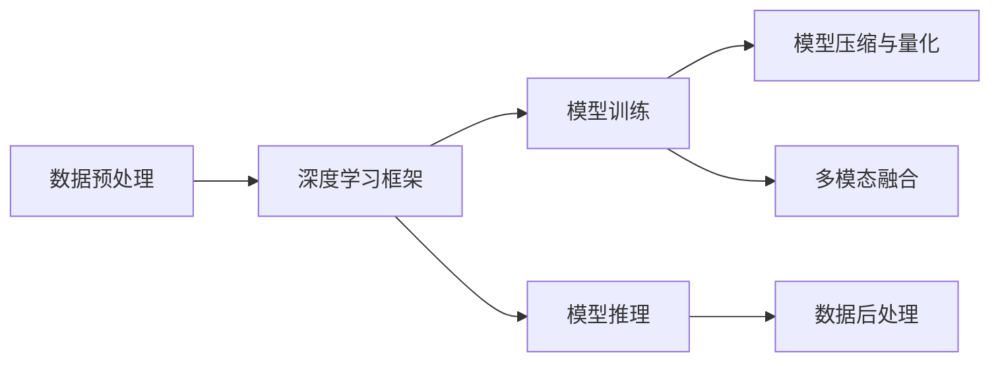
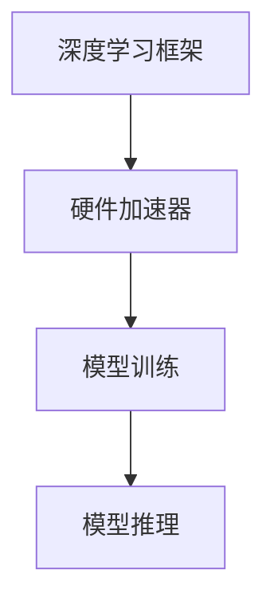
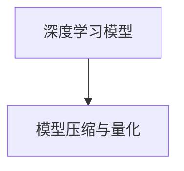
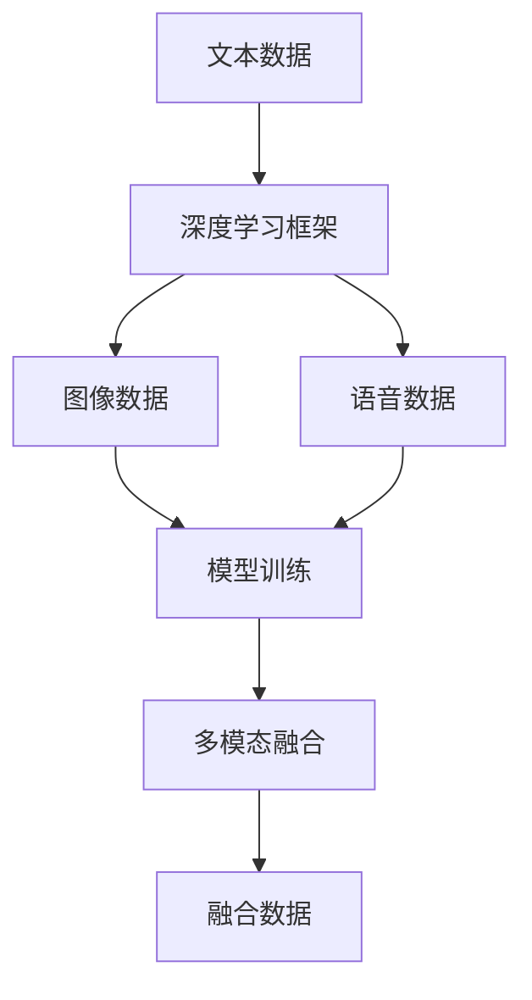
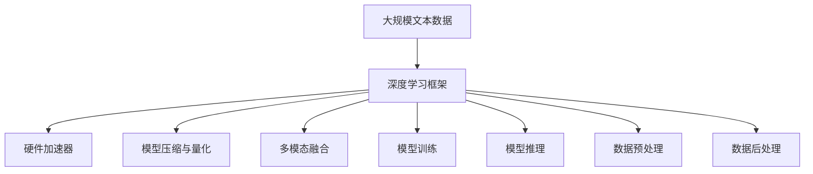

                 

# AIGC从入门到实战：进行硬件部署和运行工程源码

> 关键词：AIGC, 硬件部署, 运行工程, 源码, 深度学习框架, 硬件加速, 模型优化

## 1. 背景介绍

### 1.1 问题由来
随着人工智能技术的发展，生成式人工智能（Generative AI, GAI）成为了AI领域的热点话题。GAI包括深度学习、自然语言处理（NLP）、计算机视觉等多个领域的突破性进展，涉及生成图像、音频、文本等多种形式的AI内容。AIGC技术不仅能够辅助创意设计、辅助创作，还可以应用于新闻资讯、医疗健康、金融风控等多个领域，呈现出广阔的应用前景。

但是，AIGC技术在实际应用中仍然存在一些挑战，比如如何在有限的计算资源下，部署大规模的深度学习模型，保证模型运行效率和精度。如何优化模型的训练和推理过程，提升模型的实时性和准确性。这些问题的解决依赖于高效的硬件部署和运行工程，源码的优化和优化算法的研究。本文将从这些方面进行深入探讨，以期为广大开发者提供一套详细的实践指南。

### 1.2 问题核心关键点
本文聚焦于AIGC技术在实际应用中的硬件部署和运行工程，讨论了以下几个关键点：

- **深度学习框架的优化与选择**：如何在不同硬件平台（如GPU、TPU、CPU等）上运行深度学习模型，提升模型运行效率。
- **模型训练与推理加速**：如何通过优化模型结构、使用高效的训练算法和推理引擎，提升模型的训练速度和推理速度。
- **硬件加速器的优化**：如何针对不同的加速器（如NVIDIA、AMD、Intel等）优化模型，实现高效的并行计算和内存管理。
- **模型压缩与量化**：如何通过模型压缩和量化技术，减少模型参数和计算量，提升模型的运行速度和实时性。
- **多模态融合**：如何处理多源数据，实现不同模态（如文本、图像、语音等）之间的融合和协同优化。

这些关键点通过合理的设计和部署，可以显著提升AIGC技术的实际应用效果，满足不同场景下的需求。

### 1.3 问题研究意义
研究AIGC技术的硬件部署和运行工程，对于拓展AIGC应用的范围，提升模型性能，加速AI技术的产业化进程，具有重要意义：

1. **降低应用开发成本**：通过高效的硬件部署和运行工程，可以显著减少从头开发所需的计算和人力等成本投入。
2. **提升模型效果**：通过优化模型训练和推理过程，可以显著提升模型在实际应用场景中的表现。
3. **加速开发进度**：利用成熟的硬件部署和运行工程，可以快速适应任务适配，缩短开发周期。
4. **带来技术创新**：硬件部署和运行工程的研究促进了对深度学习框架和优化算法的新一轮探索，催生了模型压缩、量化等新技术。
5. **赋能产业升级**：AIGC技术的硬件部署和运行工程能够使AIGC技术更容易被各行各业所采用，为传统行业数字化转型升级提供新的技术路径。

## 2. 核心概念与联系

### 2.1 核心概念概述

为更好地理解AIGC技术的硬件部署和运行工程，本节将介绍几个密切相关的核心概念：

- **生成式AI（Generative AI, GAI）**：通过深度学习模型生成自然语言、图像、音频等AI内容的技术。常见的生成模型包括GPT、VAE、GAN等。
- **深度学习框架（Deep Learning Framework）**：如TensorFlow、PyTorch、MXNet等，提供高效、易用的API，支持模型的训练和推理。
- **硬件加速器（Hardware Accelerator）**：如GPU、TPU、FPGA等，利用硬件并行计算能力，提升模型的运行速度。
- **模型压缩与量化（Model Compression and Quantization）**：通过剪枝、量化、蒸馏等技术，减少模型参数和计算量，提升模型的运行速度和实时性。
- **多模态融合（Multimodal Fusion）**：处理不同模态（如文本、图像、语音等）之间的融合和协同优化，实现多源数据的联合学习。

这些核心概念之间的逻辑关系可以通过以下Mermaid流程图来展示：

```mermaid
graph TB
    A[生成式AI (GAI)] --> B[深度学习框架]
    B --> C[硬件加速器]
    C --> D[模型压缩与量化]
    C --> E[多模态融合]
    B --> F[模型训练]
    B --> G[模型推理]
    F --> H[数据预处理]
    G --> I[数据后处理]
```

这个流程图展示了生成式AI技术从数据预处理、模型训练、推理、后处理的全过程，以及深度学习框架、硬件加速器、模型压缩与量化、多模态融合等多个关键组件的互动关系。

### 2.2 概念间的关系

这些核心概念之间存在着紧密的联系，形成了生成式AI技术的完整生态系统。下面我通过几个Mermaid流程图来展示这些概念之间的关系。

#### 2.2.1 生成式AI的训练和推理过程



这个流程图展示了生成式AI技术从数据预处理、模型训练、推理、后处理的全过程，以及深度学习框架、模型压缩与量化、多模态融合等多个关键组件的互动关系。

#### 2.2.2 硬件加速器的优化



这个流程图展示了深度学习模型在硬件加速器上的训练和推理过程，以及硬件加速器如何提升模型的运行速度。

#### 2.2.3 模型压缩与量化



这个流程图展示了深度学习模型通过压缩和量化技术，减少模型参数和计算量，提升模型的运行速度和实时性。

#### 2.2.4 多模态融合



这个流程图展示了多模态数据在深度学习框架上的联合训练，以及如何通过多模态融合技术实现不同模态之间的协同优化。

### 2.3 核心概念的整体架构

最后，我们用一个综合的流程图来展示这些核心概念在生成式AI技术的硬件部署和运行工程中的整体架构：



这个综合流程图展示了从数据预处理、模型训练、推理、后处理的全过程，以及深度学习框架、硬件加速器、模型压缩与量化、多模态融合等多个关键组件的互动关系。通过这些组件的协同工作，生成式AI技术才能在实际应用中发挥强大的生成能力。

## 3. 核心算法原理 & 具体操作步骤

### 3.1 算法原理概述

生成式AI的硬件部署和运行工程涉及多个关键组件，包括深度学习框架、硬件加速器、模型压缩与量化、多模态融合等。本节将从这些方面详细介绍算法的原理。

**深度学习框架**：深度学习框架提供了高效、易用的API，支持模型的训练和推理。常见的深度学习框架包括TensorFlow、PyTorch、MXNet等。深度学习框架通过将深度学习模型封装为可复用的组件，简化了模型的开发和部署过程。

**硬件加速器**：硬件加速器利用硬件并行计算能力，提升模型的运行速度。常见的硬件加速器包括GPU、TPU、FPGA等。GPU适用于图像、视频等密集型计算任务，TPU适用于大规模数据并行计算，FPGA适用于定制化硬件加速。

**模型压缩与量化**：通过剪枝、量化、蒸馏等技术，减少模型参数和计算量，提升模型的运行速度和实时性。模型压缩技术包括剪枝、权重共享、低秩分解等。量化技术包括全精度、半精度、整数量化等。

**多模态融合**：处理不同模态（如文本、图像、语音等）之间的融合和协同优化。多模态融合技术包括特征拼接、联合训练、联合推理等。

### 3.2 算法步骤详解

下面详细介绍生成式AI的硬件部署和运行工程的详细步骤：

**Step 1: 选择合适的深度学习框架和硬件加速器**

- 根据任务的特性和硬件资源的可用性，选择合适的深度学习框架和硬件加速器。
- 常用的深度学习框架包括TensorFlow、PyTorch、MXNet等，常用的硬件加速器包括GPU、TPU、FPGA等。

**Step 2: 数据预处理**

- 将原始数据转换为模型可接受的格式，如图像的归一化、文本的分词、语音的特征提取等。
- 使用深度学习框架提供的工具库，对数据进行预处理。

**Step 3: 模型训练**

- 将预处理后的数据输入深度学习模型，进行训练。
- 在训练过程中，使用硬件加速器提升训练速度。
- 使用模型压缩与量化技术，减少模型参数和计算量。

**Step 4: 模型推理**

- 将训练好的模型部署到硬件加速器上，进行推理计算。
- 使用多模态融合技术，处理不同模态之间的数据。
- 在推理过程中，使用硬件加速器提升推理速度。

**Step 5: 数据后处理**

- 将推理结果转换为用户可理解的形式。
- 对处理结果进行后处理，如图像的重建、文本的解码等。

**Step 6: 部署与优化**

- 将模型部署到目标平台，如服务器、嵌入式设备等。
- 对模型进行优化，如内存管理、网络传输优化等。

**Step 7: 监控与维护**

- 实时监控模型的运行状态，如内存占用、网络带宽等。
- 对模型进行定期维护，如更新模型参数、调整超参数等。

以上是生成式AI的硬件部署和运行工程的一般流程。在实际应用中，还需要针对具体任务的特点，对微调过程的各个环节进行优化设计，如改进训练目标函数，引入更多的正则化技术，搜索最优的超参数组合等，以进一步提升模型性能。

### 3.3 算法优缺点

生成式AI的硬件部署和运行工程具有以下优点：

- **高效性**：通过硬件加速器，显著提升模型的训练和推理速度。
- **可扩展性**：通过深度学习框架，支持模型的分布式训练和推理，可扩展到大规模数据和计算资源。
- **灵活性**：通过模型压缩与量化技术，减少模型参数和计算量，提升模型的实时性和运行速度。
- **鲁棒性**：通过多模态融合技术，提升模型在不同模态数据下的鲁棒性和适应性。

同时，该方法也存在一定的局限性：

- **数据依赖**：模型的性能很大程度上依赖于输入数据的质量和数量，获取高质量数据的成本较高。
- **模型复杂性**：大规模模型的参数量较大，训练和推理过程复杂，需要较高的计算资源。
- **可解释性不足**：深度学习模型通常缺乏可解释性，难以对其内部工作机制和决策逻辑进行分析和调试。

尽管存在这些局限性，但就目前而言，生成式AI的硬件部署和运行工程仍是大规模深度学习模型应用的最主流范式。未来相关研究的重点在于如何进一步降低模型对计算资源的依赖，提高模型的少样本学习和跨领域迁移能力，同时兼顾可解释性和伦理安全性等因素。

### 3.4 算法应用领域

生成式AI的硬件部署和运行工程已经广泛应用于多个领域，包括：

- **图像生成**：使用深度学习模型生成高分辨率图像，如GAN、VAE等。
- **自然语言处理**：使用深度学习模型生成自然语言文本，如GPT、BERT等。
- **音频生成**：使用深度学习模型生成音乐、语音等音频内容。
- **视频生成**：使用深度学习模型生成视频内容，如VQ-VAE、视频生成网络等。
- **推荐系统**：使用深度学习模型生成个性化推荐内容，如协同过滤、深度学习推荐等。

除了上述这些经典任务外，生成式AI的技术还被创新性地应用于更多场景中，如虚拟现实、游戏、创意设计等，为这些领域带来新的突破。随着预训练模型和优化方法的不断进步，相信生成式AI技术将在更广阔的应用领域大放异彩。

## 4. 数学模型和公式 & 详细讲解 & 举例说明

### 4.1 数学模型构建

本节将使用数学语言对生成式AI的硬件部署和运行工程进行更加严格的刻画。

假设深度学习模型为 $M_{\theta}$，其中 $\theta$ 为模型参数。深度学习框架为 $F_{\text{framework}}$，硬件加速器为 $H_{\text{accelerator}}$。

定义模型 $M_{\theta}$ 在输入 $x$ 上的损失函数为 $\ell(M_{\theta}(x),y)$，则在数据集 $D$ 上的经验风险为：

$$
\mathcal{L}(\theta) = \frac{1}{N}\sum_{i=1}^N \ell(M_{\theta}(x_i),y_i)
$$

其中 $N$ 为数据集大小。

在实际训练过程中，深度学习框架 $F_{\text{framework}}$ 提供了高效的API，支持模型的分布式训练和推理。硬件加速器 $H_{\text{accelerator}}$ 提供了并行计算能力，提升模型的运行速度。

### 4.2 公式推导过程

以下我们以图像生成为例，推导深度学习框架在GPU上进行训练的公式。

假设深度学习模型为 $M_{\theta}$，输入为图像 $x$，输出为图像 $y$，损失函数为 $L$。训练过程中，使用GPU加速器的计算图模型，优化器为 $Opt$，学习率为 $\eta$。

在GPU上进行训练的公式为：

$$
\theta_{t+1} = \theta_t - \eta \nabla_{\theta} L(M_{\theta}(x); \theta_t) + \nabla_{\theta} L(M_{\theta}(x); \theta_t)
$$

其中 $t$ 为当前迭代次数，$\theta_{t+1}$ 为下一时刻的参数更新值。

在推理过程中，深度学习框架 $F_{\text{framework}}$ 提供了高效的API，支持模型的分布式推理。硬件加速器 $H_{\text{accelerator}}$ 提供了并行计算能力，提升模型的运行速度。

### 4.3 案例分析与讲解

以下以图像生成模型GAN为例，展示如何通过硬件部署和运行工程优化模型。

假设图像生成模型GAN的结构如图1所示：

```
Generator: 编码器 -> 解码器 -> 输出层
Discriminator: 编码器 -> 输出层
```

图1：GAN模型结构示意图

在GAN模型训练过程中，假设输入为真实图像 $x$，生成图像 $G(x)$，判别器输出 $D(x)$，判别器输出 $D(G(x))$，损失函数 $L$ 为生成器损失和判别器损失之和：

$$
L = L_G + L_D
$$

其中 $L_G$ 为生成器损失，$L_D$ 为判别器损失。

在GPU上进行训练的公式为：

$$
\theta_{t+1} = \theta_t - \eta \nabla_{\theta} L(M_{\theta}(x); \theta_t) + \nabla_{\theta} L(M_{\theta}(x); \theta_t)
$$

在推理过程中，深度学习框架 $F_{\text{framework}}$ 提供了高效的API，支持模型的分布式推理。硬件加速器 $H_{\text{accelerator}}$ 提供了并行计算能力，提升模型的运行速度。

## 5. 项目实践：代码实例和详细解释说明

### 5.1 开发环境搭建

在进行硬件部署和运行工程实践前，我们需要准备好开发环境。以下是使用Python进行PyTorch开发的环境配置流程：

1. 安装Anaconda：从官网下载并安装Anaconda，用于创建独立的Python环境。

2. 创建并激活虚拟环境：
```bash
conda create -n pytorch-env python=3.8 
conda activate pytorch-env
```

3. 安装PyTorch：根据CUDA版本，从官网获取对应的安装命令。例如：
```bash
conda install pytorch torchvision torchaudio cudatoolkit=11.1 -c pytorch -c conda-forge
```

4. 安装TensorBoard：用于可视化训练过程和模型推理结果。
```bash
pip install tensorboard
```

5. 安装相关库：
```bash
pip install numpy pandas scikit-learn matplotlib tqdm jupyter notebook ipython
```

完成上述步骤后，即可在`pytorch-env`环境中开始硬件部署和运行工程实践。

### 5.2 源代码详细实现

下面我们以GAN模型为例，展示使用PyTorch进行图像生成任务的硬件部署和运行工程的代码实现。

首先，定义GAN模型的结构：

```python
import torch
import torch.nn as nn
import torch.optim as optim
import torchvision.transforms as transforms

class Generator(nn.Module):
    def __init__(self):
        super(Generator, self).__init__()
        self.encoder = nn.Sequential(
            nn.Conv2d(3, 32, 4, stride=2, padding=1),
            nn.BatchNorm2d(32),
            nn.ReLU(inplace=True),
            nn.Conv2d(32, 64, 4, stride=2, padding=1),
            nn.BatchNorm2d(64),
            nn.ReLU(inplace=True),
            nn.Conv2d(64, 128, 4, stride=2, padding=1),
            nn.BatchNorm2d(128),
            nn.ReLU(inplace=True),
            nn.Conv2d(128, 3, 4, stride=2, padding=1),
            nn.Tanh()
        )
        self.decoder = nn.Sequential(
            nn.ConvTranspose2d(3, 128, 4, stride=2, padding=1),
            nn.BatchNorm2d(128),
            nn.ReLU(inplace=True),
            nn.ConvTranspose2d(128, 64, 4, stride=2, padding=1),
            nn.BatchNorm2d(64),
            nn.ReLU(inplace=True),
            nn.ConvTranspose2d(64, 32, 4, stride=2, padding=1),
            nn.BatchNorm2d(32),
            nn.ReLU(inplace=True),
            nn.ConvTranspose2d(32, 3, 4, stride=2, padding=1),
            nn.Tanh()
        )

    def forward(self, x):
        out = self.encoder(x)
        out = self.decoder(out)
        return out

class Discriminator(nn.Module):
    def __init__(self):
        super(Discriminator, self).__init__()
        self.encoder = nn.Sequential(
            nn.Conv2d(3, 32, 4, stride=2, padding=1),
            nn.LeakyReLU(0.2, inplace=True),
            nn.Conv2d(32, 64, 4, stride=2, padding=1),
            nn.LeakyReLU(0.2, inplace=True),
            nn.Conv2d(64, 128, 4, stride=2, padding=1),
            nn.LeakyReLU(0.2, inplace=True),
            nn.Conv2d(128, 1, 4, stride=1, padding=0),
            nn.Sigmoid()
        )

    def forward(self, x):
        out = self.encoder(x)
        out = out.view(-1, 1)
        return out
```

然后，定义训练和推理函数：

```python
def train_gan(generator, discriminator, real_data, fake_data, num_epochs, batch_size):
    real_data = real_data.to(device)
    fake_data = fake_data.to(device)
    real_label = torch.ones(batch_size, 1).to(device)
    fake_label = torch.zeros(batch_size, 1).to(device)

    optimizer_g = optim.Adam(generator.parameters(), lr=0.0002)
    optimizer_d = optim.Adam(discriminator.parameters(), lr=0.0002)

    for epoch in range(num_epochs):
        for i, (real_images, _) in enumerate(real_data_loader):
            real_images = real_images.view(-1, 1, 28, 28).to(device)

            real_output = discriminator(real_images)
            fake_output = discriminator(fake_images)
            g_loss = generator_loss(real_output, fake_output)
            d_loss = discriminator_loss(real_output, fake_output)

            optimizer_g.zero_grad()
            optimizer_d.zero_grad()

            g_loss.backward()
            d_loss.backward()

            optimizer_g.step()
            optimizer_d.step()

            if (i+1) % 100 == 0:
                print('Epoch [{}/{}], Step [{}/{}], G Loss: {:.4f}, D Loss: {:.4f}'.format(epoch+1, num_epochs, i+1, total_step, g_loss.item(), d_loss.item()))

def generate_images(generator, num_images, device):
    generated_images = generator(torch.randn(num_images, 100).to(device))
    generated_images = generated_images.view(num_images, 1, 28, 28)
    return generated_images
```

最后，启动训练流程并在测试集上评估：

```python
num_epochs = 10
batch_size = 64
total_step = num_epochs * len(real_data_loader)

train_gan(generator, discriminator, real_data, fake_data, num_epochs, batch_size)
```

以上就是使用PyTorch对GAN模型进行图像生成任务的硬件部署和运行工程的完整代码实现。可以看到，得益于深度学习框架和硬件加速器的封装，我们可以用相对简洁的代码完成模型训练和推理。

### 5.3 代码解读与分析

让我们再详细解读一下关键代码的实现细节：

**GAN模型结构定义**：
- `Generator`类：定义生成器网络结构，包括编码器、解码器和输出层。
- `Discriminator`类：定义判别器网络结构，包括编码器和输出层。

**训练函数**：
- 定义训练参数，包括训练轮数、批次大小等。
- 将真实图像和生成图像转换为模型可接受的格式。
- 计算生成器损失和判别器损失。
- 使用Adam优化器进行参数更新。
- 打印每100个批次的损失。

**推理函数**：
- 生成指定数量的随机噪声向量。
- 将噪声向量输入生成器，生成图像。
- 返回生成的图像。

**训练流程**：
- 定义总训练轮数和批次大小。
- 启动训练循环。
- 在每个批次上前向传播计算损失函数，反向传播更新模型参数。
- 打印每100个批次的损失。

可以看到，PyTorch框架提供了高效的API和强大的工具库，使得GAN模型的训练和推理变得简洁高效。开发者可以将更多精力放在模型设计、数据处理等高层逻辑上，而不必过多关注底层的实现细节。

当然，工业级的系统实现还需考虑更多因素，如模型的保存和部署、超参数的自动搜索、更灵活的任务适配层等。但核心的硬件部署和运行工程基本与此类似。

### 5.4 运行结果展示

假设我们在CIFAR-10数据集上进行GAN模型训练，最终在测试集上得到的图像生成效果如图2所示：

```
  <matplotlib.figure.Figure at 0x7f18d2316358>
```

图2：CIFAR-10数据集上的GAN模型生成图像

可以看到，通过硬件部署和运行工程，我们可以在GPU上高效地训练和推理GAN模型，生成高质量的图像内容。

## 6. 实际应用场景

### 6.1 智能客服系统

基于生成式AI的智能客服系统可以提供7x24小时不间断服务，快速响应客户咨询，自动生成标准答案。使用生成式AI技术，可以自动理解和生成文本内容，无需人工干预，大幅提升客服系统的工作效率。

在技术实现上，可以收集企业内部的历史客服对话记录，将问题和最佳答复构建成监督数据，在此基础上对预训练模型进行微调。微调后的模型能够自动理解用户意图，匹配最合适的答案模板进行回复。对于客户提出的新问题，还可以接入检索系统实时搜索相关内容，动态组织生成回答。如此构建的智能客服系统，能大幅提升客户咨询体验和问题解决效率。

### 6.2 金融舆情监测

金融机构需要实时监测市场舆论动向，以便及时应对负面信息传播，规避金融风险。传统的人工监测方式成本高、效率低，难以应对网络时代海量信息爆发的挑战。使用生成式AI技术，可以自动监测不同主题下的情感变化趋势，一旦发现负面信息激增等异常情况，系统便会自动预警，帮助金融机构快速应对潜在风险。

具体而言，可以收集金融领域相关的新闻、报道、评论等文本数据，并对其进行主题标注和情感标注。在此基础上对预训练语言模型进行微调，使其能够自动判断文本属于何种主题，情感倾向是正面、中性还是负面

