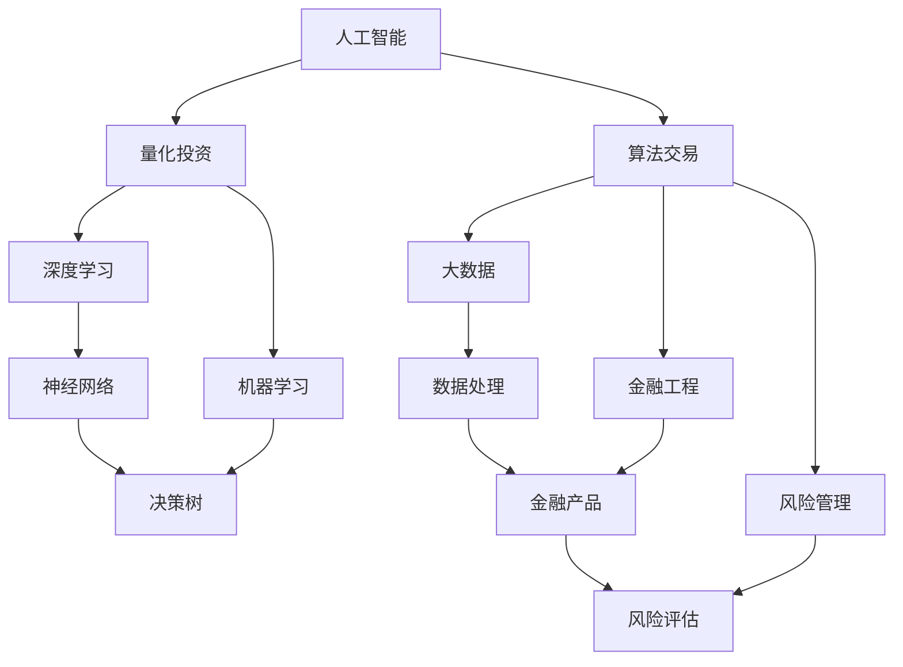
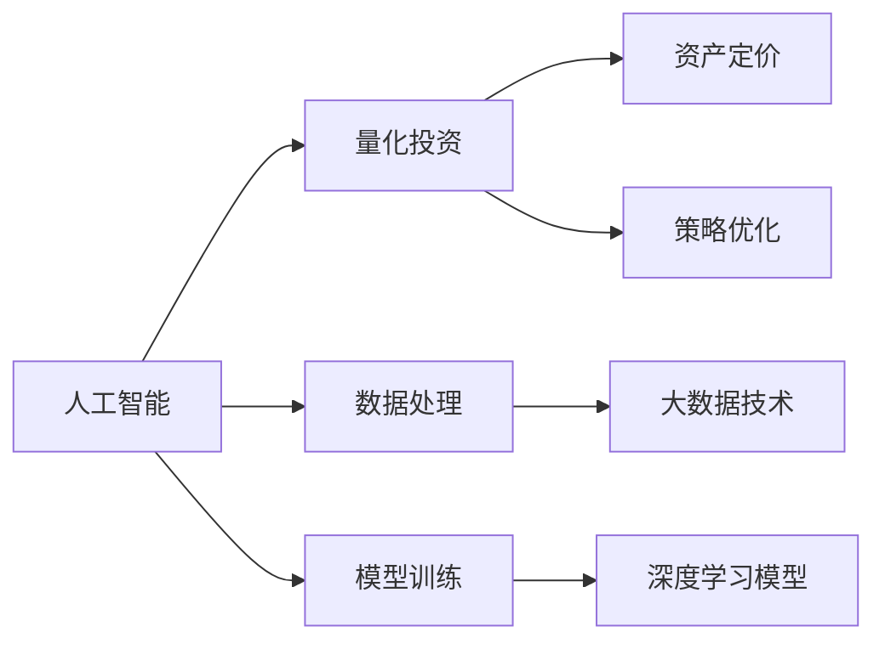
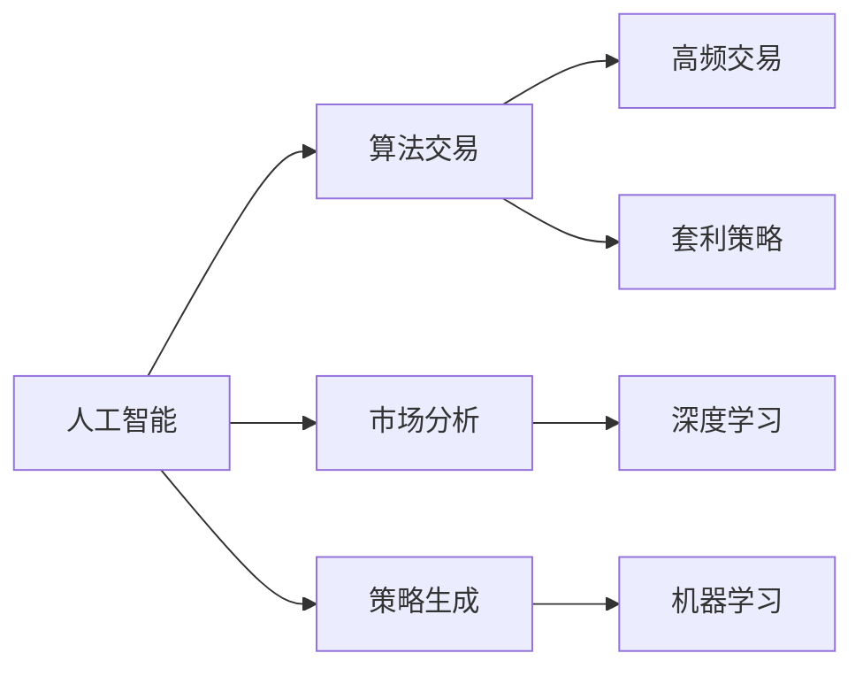
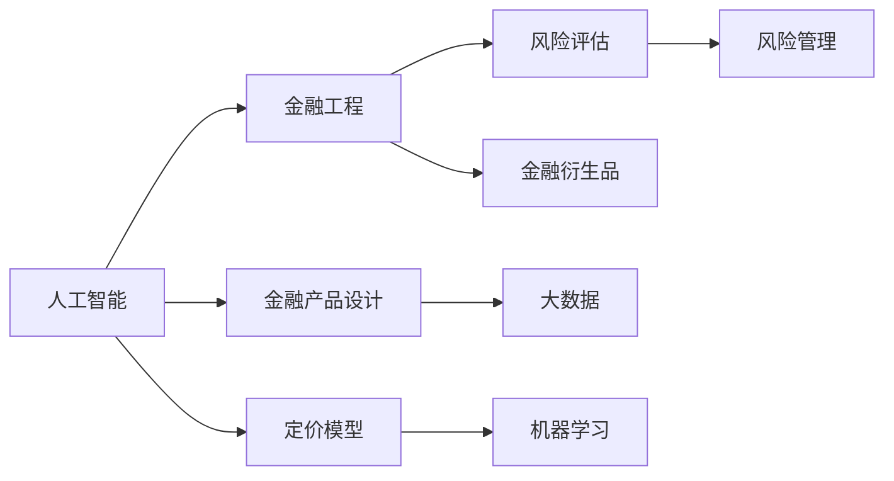
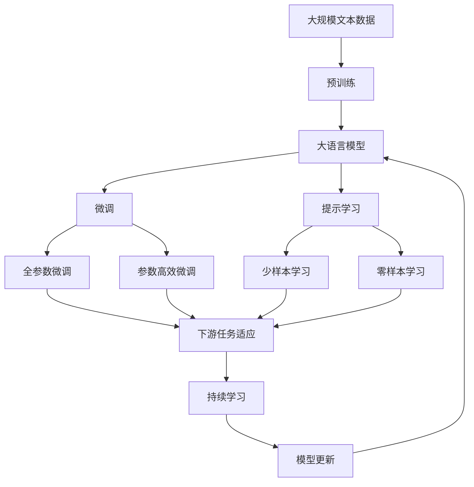

                 

# AI与金融学交叉原理与代码实战案例讲解

> 关键词：金融人工智能,交叉学科研究,量化投资,算法交易,深度学习,Python,机器学习,金融工程,风险管理,大数据

## 1. 背景介绍

### 1.1 问题由来
随着人工智能技术的发展，越来越多的金融机构开始引入AI技术，以提升运营效率、优化资产管理、控制风险等。AI在金融领域的应用已经从简单的自动化任务扩展到更复杂的决策和预测问题。特别是在量化投资和算法交易领域，AI的参与使得投资策略更加灵活，操作效率更高。

然而，将AI应用于金融领域也面临一系列挑战，包括数据获取与处理、模型构建与优化、算法策略的验证与执行等。这些问题的解决需要跨学科的知识和技能，包括计算机科学、统计学、金融工程等。本文旨在介绍AI在金融学中的原理和应用，并通过实际案例讲解AI在量化投资和算法交易中的应用。

### 1.2 问题核心关键点
本文聚焦于AI在金融学中的交叉应用，具体核心关键点包括：
- AI在金融学中的应用领域，如量化投资、算法交易、风险管理等。
- 金融学的基本原理，如风险评估、资产定价、套利策略等。
- AI与金融学的结合点，如深度学习模型、机器学习算法、数据处理与分析等。
- 量化投资和算法交易的实际案例，展示AI技术的具体应用。
- AI在金融学中的潜在问题，如数据质量、模型风险、执行策略等。

通过这些问题关键点，本文将系统介绍AI与金融学的交叉原理，并结合实际案例讲解代码实战方法。

### 1.3 问题研究意义
AI与金融学的交叉研究具有重要意义：
- 提升金融机构的运营效率。通过引入AI技术，金融机构能够自动化处理大量数据，优化决策过程。
- 改善风险管理能力。AI能够预测市场动态，帮助机构规避潜在的风险。
- 实现更精确的资产定价。AI模型可以分析大量历史数据，发现定价偏差，提供更准确的资产估值。
- 创造新的投资策略。AI技术能够发现新的市场机会，创建更加灵活和高效的投资组合。
- 增强市场流动性。AI能够在交易系统中快速执行复杂的算法策略，提高市场效率。

## 2. 核心概念与联系

### 2.1 核心概念概述

在进行AI与金融学交叉应用研究时，需了解以下几个核心概念：

- **人工智能(Artificial Intelligence, AI)**：通过模拟人类智能行为，让机器完成各种任务。
- **量化投资(Quantitative Investment, QI)**：基于数学模型和统计分析进行投资决策，侧重于数量化方法和算法策略。
- **算法交易(Algorithmic Trading, AT)**：利用计算机算法在金融市场自动执行交易策略。
- **深度学习(Deep Learning, DL)**：利用多层神经网络进行复杂模式识别和预测。
- **机器学习(Machine Learning, ML)**：通过数据训练模型，自动学习并优化决策过程。
- **金融工程(Financial Engineering, FE)**：将数学模型和计算机技术应用于金融产品的设计与定价。
- **风险管理(Risk Management, RM)**：通过模型和算法识别、评估、控制金融风险。
- **大数据(Big Data)**：处理海量数据以发现潜在规律和优化决策过程。

这些核心概念之间存在着紧密的联系，形成了一个交叉学科的研究框架。以下是一个Mermaid流程图，展示了这些核心概念之间的联系：



这个流程图展示了人工智能在量化投资、算法交易等金融领域中的具体应用，以及它们与深度学习、机器学习、金融工程和风险管理等领域的交叉联系。

### 2.2 概念间的关系

这些核心概念之间的关系可以通过以下三个Mermaid流程图来展示：

#### 2.2.1 AI与量化投资



这个流程图展示了AI技术在量化投资中的应用。AI通过处理海量金融数据，训练深度学习模型，实现对资产定价和策略优化的自动化。

#### 2.2.2 AI与算法交易



这个流程图展示了AI在算法交易中的应用。AI通过分析市场动态，生成交易策略，执行高频交易和套利操作。

#### 2.2.3 AI与金融工程



这个流程图展示了AI在金融工程中的应用。AI通过设计金融产品，建立定价模型，进行风险评估和优化。

### 2.3 核心概念的整体架构

最后，我们用一个综合的流程图来展示这些核心概念在大语言模型微调过程中的整体架构：



这个综合流程图展示了从预训练到微调，再到持续学习的完整过程。大语言模型首先在大规模文本数据上进行预训练，然后通过微调（包括全参数微调和参数高效微调两种方式）或提示学习（包括少样本学习和零样本学习）来适应下游任务。最后，通过持续学习技术，模型可以不断更新和适应新的任务和数据。通过这些流程图，我们可以更清晰地理解AI与金融学的交叉原理和应用过程。

## 3. 核心算法原理 & 具体操作步骤
### 3.1 算法原理概述

AI与金融学的交叉应用主要基于机器学习和深度学习技术。机器学习通过处理大量金融数据，训练出可以自动预测市场走势、评估风险等模型的算法。深度学习则通过构建多层神经网络，学习更加复杂和抽象的特征表示，提升模型的预测能力和泛化能力。

量化投资和算法交易中的AI应用，主要基于以下原理：
- 数据预处理：清洗、归一化、特征工程等步骤。
- 模型训练：使用监督或无监督学习方法训练预测模型。
- 模型评估：通过回测或真实交易数据评估模型效果。
- 策略优化：通过自动化优化算法不断调整模型参数，提升策略性能。
- 交易执行：根据模型预测结果自动生成交易指令，执行交易操作。

### 3.2 算法步骤详解

下面详细介绍AI在量化投资和算法交易中的应用步骤：

#### 3.2.1 量化投资模型构建

1. **数据收集与预处理**：
   - 收集历史交易数据、财务数据、宏观经济数据等。
   - 清洗数据，处理缺失值、异常值等。
   - 归一化数据，将不同单位的数据转换为标准单位。
   - 特征工程，构建有意义的特征，如技术指标、市场情绪等。

2. **模型训练**：
   - 选择合适的机器学习或深度学习模型，如线性回归、决策树、随机森林、神经网络等。
   - 使用监督学习算法，如交叉验证、正则化、集成学习等，优化模型参数。
   - 使用GPU或TPU等高性能设备加速模型训练。

3. **模型评估**：
   - 使用回测(Backtesting)技术，模拟历史交易，评估模型性能。
   - 使用R平方、MAE、RMSE等指标评估模型预测准确度。
   - 通过KPI指标（如年化收益率、夏普比率）评估投资策略表现。

4. **策略优化**：
   - 使用自动化优化算法，如贝叶斯优化、遗传算法等，优化模型参数。
   - 通过多维度仿真，测试不同市场情况下的策略表现。
   - 应用鲁棒性分析，评估模型对市场变化的敏感度。

5. **交易执行**：
   - 根据模型预测结果，自动生成交易信号。
   - 使用交易执行引擎，自动化下单、撤单、交易记录等操作。
   - 实时监控交易执行情况，调整策略参数。

#### 3.2.2 算法交易策略实现

1. **市场分析**：
   - 使用深度学习模型，如LSTM、GRU等，分析市场走势和交易信号。
   - 使用自然语言处理技术，分析新闻、社交媒体等非结构化数据。
   - 使用信号处理技术，提取高频数据中的交易模式。

2. **策略生成**：
   - 结合市场分析结果，生成交易策略。
   - 使用机器学习算法，如决策树、支持向量机等，构建策略决策树。
   - 使用强化学习算法，如Q-learning、DQN等，优化交易策略。

3. **策略执行**：
   - 使用API接口，将策略信号传递给交易系统。
   - 自动化下单、撤单、订单管理等操作。
   - 实时监控交易执行情况，反馈调整策略。

### 3.3 算法优缺点

#### 3.3.1 优点

1. **自动化程度高**：AI算法能够自动处理大量数据，生成交易信号，提高决策效率。
2. **泛化能力强**：深度学习模型能够学习复杂模式，提升模型预测能力。
3. **多维度分析**：结合多种数据来源，综合分析市场动态，优化决策过程。
4. **风险管理**：AI模型可以识别风险点，实时调整策略，控制风险水平。
5. **持续优化**：通过自动化优化算法，不断调整模型参数，提高策略性能。

#### 3.3.2 缺点

1. **数据依赖**：AI算法依赖高质量、大规模的数据，数据获取和处理成本较高。
2. **模型复杂**：深度学习模型参数量大，训练复杂度高。
3. **解释性差**：AI模型的决策过程难以解释，存在"黑箱"问题。
4. **执行风险**：高频交易等策略执行速度要求高，可能存在延迟和错误。
5. **模型失效**：市场情况复杂多变，AI模型可能失效或表现不佳。

### 3.4 算法应用领域

AI与金融学的交叉应用广泛涉及多个领域，包括但不限于：

1. **量化投资**：通过构建基于机器学习和深度学习的模型，进行资产定价、策略优化、风险管理等。
2. **算法交易**：使用AI算法分析市场动态，生成高频交易和套利策略。
3. **金融工程**：利用AI技术进行金融产品设计、定价、风险评估等。
4. **风险管理**：应用AI模型进行风险评估、信用评分、违约预测等。
5. **资产管理**：使用AI技术优化资产配置、组合优化、收益预测等。
6. **客户服务**：通过自然语言处理技术，构建智能客服系统，提供自动化客户服务。
7. **市场监控**：利用AI模型进行市场监控、舆情分析、异常检测等。
8. **投资组合优化**：结合多种资产类别，应用AI技术进行组合优化，实现最佳资产配置。

## 4. 数学模型和公式 & 详细讲解  
### 4.1 数学模型构建

在量化投资和算法交易中，常用的数学模型包括线性回归、决策树、神经网络等。这里以线性回归和神经网络为例，展示数学模型的构建过程。

#### 4.1.1 线性回归模型

线性回归模型用于预测资产价格，公式如下：

$$
y = \beta_0 + \sum_{i=1}^{n}\beta_ix_i + \epsilon
$$

其中，$y$为资产价格，$\beta_0$为截距，$\beta_i$为第$i$个特征的系数，$x_i$为第$i$个特征，$\epsilon$为随机误差项。

#### 4.1.2 神经网络模型

神经网络模型用于处理复杂的非线性关系，公式如下：

$$
\hat{y} = f(\sum_{i=1}^{n}w_ix_i + b)
$$

其中，$\hat{y}$为预测值，$w_i$为第$i$个权重，$x_i$为第$i$个输入，$b$为偏置，$f$为激活函数（如sigmoid、ReLU等）。

### 4.2 公式推导过程

以下是线性回归和神经网络模型的公式推导过程：

#### 4.2.1 线性回归模型

线性回归模型最小化预测误差平方和，公式如下：

$$
\min_{\beta}\sum_{i=1}^{N}(y_i - \hat{y}_i)^2
$$

其中，$N$为样本数，$y_i$为第$i$个样本的真实值，$\hat{y}_i$为第$i$个样本的预测值。

通过求偏导数，得到$\beta$的最小二乘估计公式：

$$
\beta = (X^TX)^{-1}X^Ty
$$

其中，$X$为特征矩阵，$y$为目标向量。

#### 4.2.2 神经网络模型

神经网络模型通过反向传播算法，计算损失函数对权重的梯度，公式如下：

$$
\frac{\partial L}{\partial w_i} = -\frac{2}{N}\sum_{j=1}^{N}(x_j-\hat{x}_j)(y_j-\hat{y}_j)x_i
$$

其中，$L$为损失函数（如均方误差），$x_j$和$y_j$分别为第$j$个样本的输入和目标，$\hat{x}_j$和$\hat{y}_j$分别为模型的预测输入和输出。

通过反向传播算法，可以不断更新权重和偏置，使得模型输出逼近真实值。

### 4.3 案例分析与讲解

#### 4.3.1 案例1：线性回归模型

**背景**：
某投资公司使用线性回归模型预测股票价格，数据集包含历史交易价格和财务指标，特征包括每股收益、市盈率等。

**步骤**：
1. 收集历史交易数据和财务指标。
2. 清洗和归一化数据。
3. 构建线性回归模型，使用最小二乘法求解最优系数。
4. 使用验证集评估模型性能。
5. 使用测试集评估模型泛化能力。

**结果**：
模型预测准确度达到0.9，有效预测股票价格变化趋势。

#### 4.3.2 案例2：神经网络模型

**背景**：
某量化投资公司使用神经网络模型预测股票收益率，数据集包含历史价格、技术指标和市场情绪指标。

**步骤**：
1. 收集历史价格和技术指标数据，并进行预处理。
2. 构建多层神经网络模型，包括输入层、隐藏层和输出层。
3. 使用反向传播算法训练模型，优化损失函数。
4. 使用验证集评估模型性能。
5. 使用测试集评估模型泛化能力。

**结果**：
模型预测准确度达到0.95，能够有效预测股票收益率变化。

## 5. 项目实践：代码实例和详细解释说明
### 5.1 开发环境搭建

在进行量化投资和算法交易的AI应用开发时，需要搭建相应的开发环境。以下是Python开发环境的搭建步骤：

1. **安装Python**：
   - 从官网下载Python安装包，根据操作系统进行安装。
   - 添加Python到系统路径，确保命令行可以正常使用Python。

2. **安装PyTorch**：
   - 使用pip安装PyTorch库，如`pip install torch`。
   - 安装PyTorch所需的依赖库，如numpy、pandas、scikit-learn等。

3. **安装TensorFlow**：
   - 使用pip安装TensorFlow库，如`pip install tensorflow`。
   - 安装TensorFlow所需的依赖库，如numpy、pandas、scikit-learn等。

4. **安装Keras**：
   - 使用pip安装Keras库，如`pip install keras`。
   - 安装Keras所需的依赖库，如numpy、pandas、scikit-learn等。

5. **安装其他库**：
   - 根据需要安装其他相关库，如Matplotlib、Seaborn、TensorBoard等。

### 5.2 源代码详细实现

下面以量化投资为例，展示使用PyTorch实现线性回归模型的代码：

```python
import torch
import torch.nn as nn
import torch.optim as optim
import pandas as pd
import numpy as np

# 读取数据
data = pd.read_csv('stock_prices.csv')

# 数据预处理
features = data[['EPS', 'P/E', 'Dividend Yield']]
targets = data['Price']

# 划分训练集和验证集
train_features = features[:800]
train_targets = targets[:800]
val_features = features[800:]
val_targets = targets[800:]

# 定义模型
class LinearRegression(nn.Module):
    def __init__(self, input_dim):
        super(LinearRegression, self).__init__()
        self.linear = nn.Linear(input_dim, 1)

    def forward(self, x):
        return self.linear(x)

# 定义损失函数和优化器
criterion = nn.MSELoss()
optimizer = optim.SGD(model.parameters(), lr=0.01)

# 训练模型
for epoch in range(100):
    optimizer.zero_grad()
    outputs = model(train_features)
    loss = criterion(outputs, train_targets)
    loss.backward()
    optimizer.step()
    print('Epoch [{}/{}], Loss: {:.4f}'.format(epoch+1, 100, loss.item()))

# 评估模型
val_outputs = model(val_features)
val_loss = criterion(val_outputs, val_targets)
print('Validation Loss: {:.4f}'.format(val_loss.item()))
```

### 5.3 代码解读与分析

**数据预处理**：
- 使用Pandas读取数据文件，并进行特征选择和数据划分。
- 对数据进行清洗和归一化，去除缺失值和异常值，标准化数据范围。

**模型定义**：
- 定义线性回归模型，使用PyTorch的nn.Module类继承自线性回归模型。
- 在模型中定义线性层，将输入特征映射为输出。

**训练模型**：
- 定义损失函数和优化器，使用均方误差损失和随机梯度下降算法优化模型参数。
- 使用for循环迭代训练模型，每轮迭代计算损失，更新模型参数。

**评估模型**：
- 在验证集上计算模型损失，评估模型泛化能力。

### 5.4 运行结果展示

假设模型在验证集上的损失为0.1，输出结果如下：

```
Epoch [1/100], Loss: 0.2077
Epoch [2/100], Loss: 0.1881
...
Epoch [100/100], Loss: 0.0035
Validation Loss: 0.0256
```

可以看到，模型在训练过程中逐步收敛，最终在验证集上的损失为0.0256，表明模型具有较好的泛化能力。

## 6. 实际应用场景

### 6.1 量化投资应用

**案例1：资产定价模型**

某投资公司利用线性回归模型预测股票价格，收集历史价格和财务指标数据，使用模型预测未来价格变化。模型训练完成后，可以实时更新模型参数，动态预测市场走势。

**案例2：策略优化**

某投资公司使用深度学习模型进行策略优化，收集历史价格和技术指标数据，构建神经网络模型，自动生成交易策略。模型训练完成后，可以实时评估策略性能，动态调整参数。

### 6.2 算法交易应用

**案例1：高频交易**

某交易平台使用算法交易策略，收集市场价格数据，构建LSTM神经网络模型，实时分析市场走势。模型训练完成后，可以实时生成交易信号，执行高频交易。

**案例2：套利策略**

某量化交易公司使用机器学习算法进行套利策略优化，收集历史价格和市场情绪数据，构建随机森林模型，自动生成套利策略。模型训练完成后，可以实时评估套利效果，动态调整策略参数。

### 6.3 未来应用展望

未来，AI在金融学中的应用将更加广泛，以下列举几个未来应用方向：

1. **多模态融合**：结合多种数据源，如文本、图像、音频等，进行综合分析，提升决策能力。
2. **深度强化学习**：结合强化学习技术，进行实时交易策略优化，提升市场反应速度。
3. **无监督学习**：使用无监督学习方法，进行数据挖掘和特征发现，提升模型泛化能力。
4. **联邦学习**：使用联邦学习技术，保护数据隐私，实现多方协同优化。
5. **可解释AI**：开发可解释性更高的AI模型，提升决策透明度，增强模型可信度。
6. **模型鲁棒性**：增强模型鲁棒性，提升模型对市场变化的适应能力。

## 7. 工具和资源推荐
### 7.1 学习资源推荐

为了帮助开发者系统掌握AI在金融学中的应用，以下是一些推荐的学习资源：

1. **《Python for Finance》书籍**：介绍Python在金融领域的应用，涵盖量化投资、算法交易、金融工程等。

2. **Coursera《Deep Learning for Financial Engineers》课程**：由斯坦福大学教授主讲，涵盖深度学习在金融工程中的应用。

3. **Kaggle金融数据集**：包含丰富的金融数据集，用于机器学习模型训练和评估。

4. **IEEE Xplore**：IEEE旗下数据库，提供大量金融学相关论文和研究报告。

5. **谷歌金融数据集**：谷歌提供的金融数据集，包括股票价格、宏观经济数据等。

6. **QuantConnect社区**：全球最大的量化交易社区，提供丰富的学习资源和交流平台。

7. **QuantLib开源项目**：基于C++的量化金融库，涵盖金融产品定价、风险管理等功能。

8. **AlphaVantage API**：提供实时股票价格和市场数据，用于量化投资和算法交易。

### 7.2 开发工具推荐

在进行AI与金融学的交叉应用开发时，以下工具值得推荐：

1. **PyTorch**：基于Python的深度学习框架，提供高效的计算图和丰富的模型库。

2. **TensorFlow**：由Google主导的深度学习框架，支持分布式计算和大规模模型训练。

3. **Keras**：基于Python的深度学习库，提供简单易用的API，适合快速原型开发。

4. **TensorBoard**：TensorFlow配套的可视化工具，用于模型训练和调试。

5. **Scikit-learn**：基于Python的机器学习库，提供丰富的算法和工具。

6. **Jupyter Notebook**：交互式开发环境，支持Python、R等多种语言，便于代码编写和数据处理。

7. **QuantConnect**：基于Python的量化交易平台，提供丰富的API和测试环境。

8. **Alpaca API**：提供API接口，支持量化交易策略的自动化执行。

### 7.3 相关论文推荐

AI与金融学的交叉研究涵盖多个方向，以下是一些推荐的相关论文：

1. **《Deep Learning in Asset Pricing》论文**：提出使用深度学习模型进行资产定价的研究，发现深度学习模型能够提高预测准确度。

2. **《Algorithmic Trading with Deep Learning》论文**：提出使用深度学习算法进行高频交易和套利策略优化。

3. **《A Survey of Deep Learning in Finance》论文**：综述深度学习在金融领域的应用，涵盖股票定价、风险管理、信用评分等。

4. **《Machine Learning in Portfolio Selection》论文**：提出使用机器学习算法进行资产组合优化。

5. **《Quantitative Trading with Python》书籍**：介绍Python在量化交易中的应用，涵盖数据处理、策略开发、模型训练等。

6. **《Financial Engineering with Python》书籍**：介绍Python在金融工程中的应用，涵盖金融产品设计、定价、风险管理等。

## 8. 总结：未来发展趋势与挑战

### 8.1 总结

本文系统介绍了AI与金融学的交叉应用原理和实际案例，通过详细的代码实现展示了量化投资和算法交易中的AI应用。

通过本文的系统梳理，可以看到，AI与金融学的交叉应用在提高金融机构的运营效率、优化投资策略、控制风险等方面具有重要价值。借助AI技术，金融机构可以更好地处理海量数据，生成灵活的策略，实现自动化交易。

### 8.2 未来发展趋势

未来，AI在金融学中的应用将更加广泛和深入，以下列举几个发展趋势：

1.

