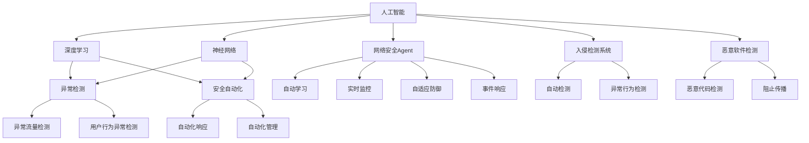
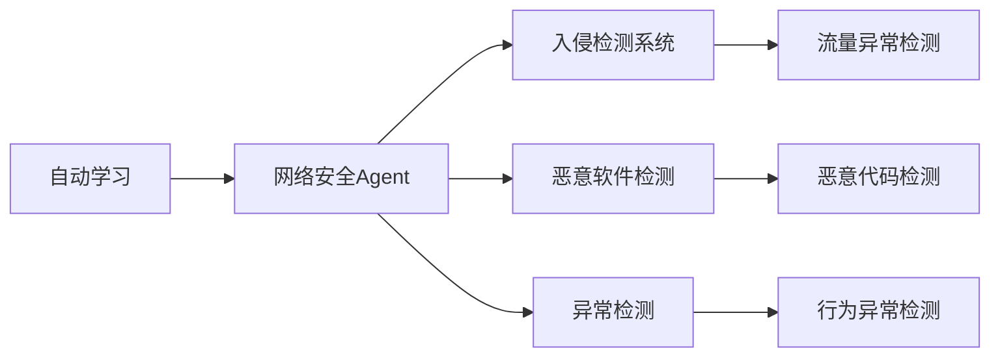
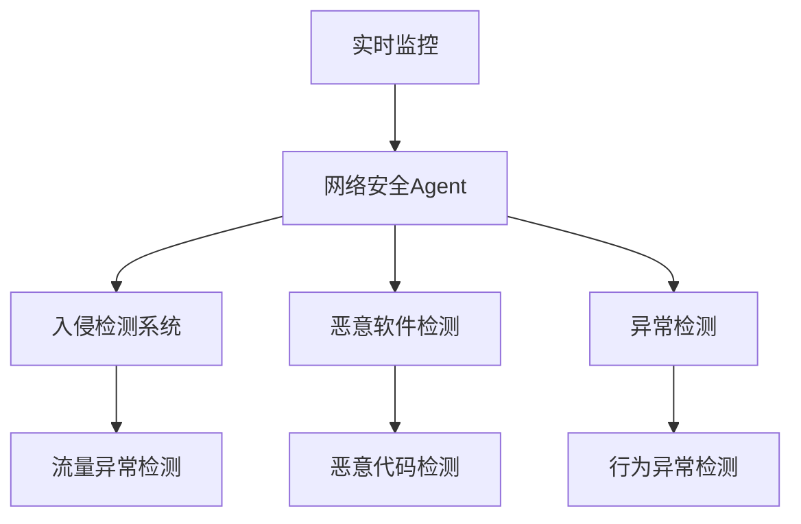
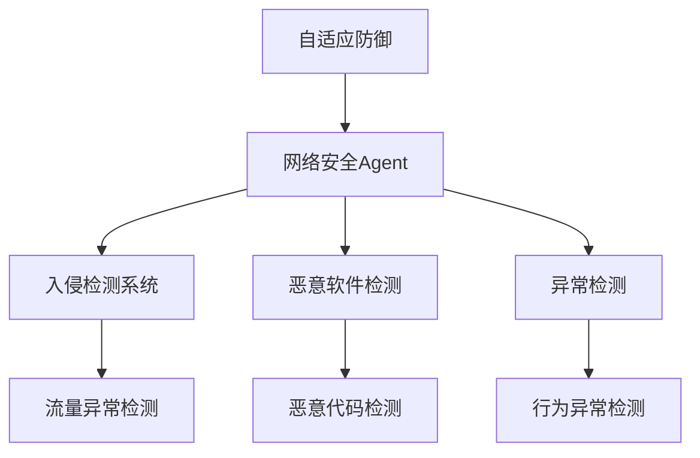
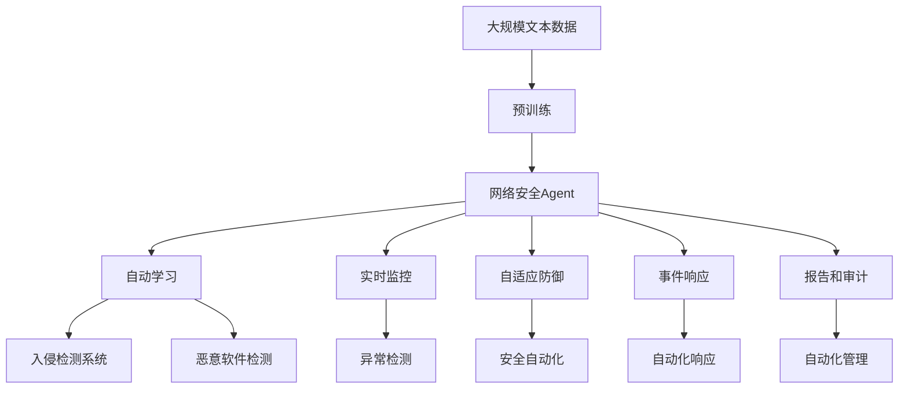

                 

# AI人工智能 Agent：在网络安全中的应用

> 关键词：人工智能,网络安全,网络威胁检测,入侵检测系统,恶意软件检测,深度学习,神经网络,网络安全Agent,自动学习,安全自动化

## 1. 背景介绍

随着互联网的普及和数字化进程的加速，网络安全成为全球范围内的重要议题。随着黑客攻击技术的不断升级和新型网络威胁的不断涌现，传统的基于规则的防御手段已经无法有效应对日益复杂的网络环境。人工智能（AI）技术的引入为网络安全领域注入了新的活力，特别是网络安全Agent的兴起，为自动化、智能化地应对网络威胁提供了新的解决方案。

### 1.1 问题由来
网络安全领域面临的主要挑战包括但不限于：
- **恶意软件和病毒**：通过各种手段传播的恶意代码，如勒索软件、僵尸网络等，对企业和个人数据安全构成重大威胁。
- **DDoS攻击**：利用大量僵尸机器同时发起请求，使目标服务器无法正常服务。
- **高级持续性威胁（APT）**：针对特定目标进行长期、持续的攻击和渗透，窃取敏感信息。
- **零日漏洞攻击**：利用未被及时修复的漏洞，进行攻击。
- **钓鱼和欺骗攻击**：通过伪装成可信来源，诱导受害者泄露敏感信息。

传统的基于规则的防御系统往往无法及时应对新型攻击，且容易受到人为干预，造成误报和漏报。因此，基于AI的网络安全Agent应运而生，通过自动学习和实时监控，提供更加灵活、高效的威胁检测和防御解决方案。

### 1.2 问题核心关键点
基于AI的网络安全Agent的核心思想是：
- **自动化学习**：通过机器学习算法，自动从历史网络数据中学习，识别攻击特征和模式。
- **实时监控**：在网络流量的实时数据中，自动检测异常行为和威胁。
- **自适应防御**：根据检测结果，自动调整防御策略，实时调整网络规则和防火墙规则。
- **事件响应**：对检测到的攻击进行自动响应，如隔离攻击源、封堵攻击流量等。
- **报告和审计**：自动生成威胁报告和事件日志，供后续分析和审计。

## 2. 核心概念与联系

### 2.1 核心概念概述

为了更好地理解AI网络安全Agent的工作原理，本节将介绍几个关键概念：

- **人工智能（AI）**：通过计算机模拟人类智能过程的学科，包括感知、学习、推理、决策等。
- **深度学习（DL）**：一种基于神经网络的机器学习方法，能够处理复杂的非线性关系，适用于处理大规模数据集。
- **神经网络（NN）**：一种模仿人脑神经元结构和功能的计算模型，用于处理大规模数据集。
- **网络安全Agent**：在网络中部署的自动检测、分析和防御系统，能够持续监控网络流量，自动学习并响应威胁。
- **入侵检测系统（IDS）**：通过分析网络流量，检测可疑行为和异常事件的系统。
- **恶意软件检测**：通过自动化学习，检测和阻止恶意软件传播的系统。
- **异常检测**：基于统计和机器学习方法，识别网络中的异常行为，如流量异常、用户行为异常等。
- **安全自动化**：通过AI技术实现自动化安全管理，包括自动化学习和自动化响应。

这些核心概念之间的联系可以通过以下Mermaid流程图来展示：



这个流程图展示了AI网络安全Agent的核心概念及其关系：

1. AI和DL为神经网络等算法的开发提供了理论基础。
2. 神经网络等算法在网络安全Agent中用于自动学习和异常检测。
3. IDS和恶意软件检测是网络安全Agent的重要组成部分。
4. 异常检测和安全自动化为AI网络安全Agent提供了核心功能。
5. 自动学习、实时监控、自适应防御、事件响应和安全自动化共同构成了AI网络安全Agent的整体架构。

### 2.2 概念间的关系

这些核心概念之间存在着紧密的联系，形成了AI网络安全Agent的整体生态系统。下面我通过几个Mermaid流程图来展示这些概念之间的关系。

#### 2.2.1 自动学习与网络安全Agent的关系



这个流程图展示了自动学习在网络安全Agent中的作用，通过机器学习算法，自动学习网络威胁的特征和模式。

#### 2.2.2 实时监控与网络安全Agent的关系



这个流程图展示了实时监控在网络安全Agent中的作用，通过持续监控网络流量，自动识别异常行为和威胁。

#### 2.2.3 自适应防御与网络安全Agent的关系



这个流程图展示了自适应防御在网络安全Agent中的作用，根据检测结果，自动调整防御策略，实时调整网络规则和防火墙规则。

### 2.3 核心概念的整体架构

最后，我们用一个综合的流程图来展示这些核心概念在大语言模型微调过程中的整体架构：



这个综合流程图展示了从预训练到网络安全Agent的整体过程。网络安全Agent首先在大规模文本数据上进行预训练，然后通过自动学习、实时监控、自适应防御、事件响应和安全自动化，实现对网络威胁的全面检测和防御。 通过这些流程图，我们可以更清晰地理解AI网络安全Agent的工作原理和优化方向。

## 3. 核心算法原理 & 具体操作步骤
### 3.1 算法原理概述

基于AI的网络安全Agent，本质上是一个深度学习的威胁检测系统。其核心思想是：通过训练深度神经网络模型，从网络流量数据中自动学习攻击特征和行为模式，实时监控网络流量，自动识别异常行为和威胁。

形式化地，假设网络安全Agent为 $A$，其输入为网络流量 $x$，输出为威胁检测结果 $y$。在训练过程中，模型 $A$ 需要最小化损失函数 $\mathcal{L}$，即：

$$
\hat{y} = \mathop{\arg\min}_{y} \mathcal{L}(A(x),y)
$$

其中 $\hat{y}$ 为模型预测结果，$y$ 为真实标签。

在实践中，我们通常使用基于梯度的优化算法（如SGD、Adam等）来近似求解上述最优化问题。设 $\eta$ 为学习率，$\lambda$ 为正则化系数，则参数的更新公式为：

$$
\theta \leftarrow \theta - \eta \nabla_{\theta}\mathcal{L}(\theta) - \eta\lambda\theta
$$

其中 $\nabla_{\theta}\mathcal{L}(\theta)$ 为损失函数对参数 $\theta$ 的梯度，可通过反向传播算法高效计算。

### 3.2 算法步骤详解

基于AI的网络安全Agent一般包括以下几个关键步骤：

**Step 1: 准备数据集**
- 收集网络流量数据，划分为训练集、验证集和测试集。
- 对网络流量进行预处理，如特征提取、归一化、去噪等。
- 标记网络流量是否包含威胁，为监督学习提供真实标签。

**Step 2: 设计网络架构**
- 选择适合的网络架构，如卷积神经网络（CNN）、循环神经网络（RNN）、长短期记忆网络（LSTM）、 Transformer等。
- 设计输入层、隐藏层和输出层，设置激活函数、损失函数和优化器等。

**Step 3: 训练模型**
- 使用训练集数据，使用随机梯度下降等优化算法进行模型训练。
- 在每个epoch结束时，在验证集上评估模型性能，调整学习率和正则化系数。
- 重复训练直至收敛。

**Step 4: 实时监控**
- 使用测试集数据，评估模型的实时监控能力。
- 在生产环境中部署模型，实时监控网络流量。
- 对检测到的异常行为进行自动响应，如隔离攻击源、封堵攻击流量等。

**Step 5: 报告和审计**
- 生成威胁报告和事件日志，记录检测到的威胁和响应过程。
- 对日志数据进行审计，确保模型的正确性和安全性。

以上是基于AI的网络安全Agent的一般流程。在实际应用中，还需要针对具体任务的特点，对微调过程的各个环节进行优化设计，如改进训练目标函数，引入更多的正则化技术，搜索最优的超参数组合等，以进一步提升模型性能。

### 3.3 算法优缺点

基于AI的网络安全Agent具有以下优点：
1. 自动化学习。通过深度学习算法，自动从历史数据中学习威胁特征和行为模式，无需人工干预。
2. 实时监控。在网络流量实时数据中，自动检测异常行为和威胁，能够及时响应。
3. 自适应防御。根据检测结果，自动调整防御策略，实时调整网络规则和防火墙规则。
4. 减少误报和漏报。使用深度学习算法，能够更加准确地识别威胁，减少误报和漏报。
5. 减轻人工负担。自动学习、实时监控和自适应防御等功能，显著减轻了安全人员的工作负担。

但同时也存在一些局限性：
1. 数据依赖。模型的效果很大程度上取决于训练数据的质量和数量，获取高质量训练数据的成本较高。
2. 模型复杂度高。深度神经网络模型的复杂度高，训练和推理耗时较长。
3. 对抗样本脆弱。深度学习模型对于对抗样本的鲁棒性较差，可能被攻击者利用。
4. 可解释性不足。深度学习模型的决策过程缺乏可解释性，难以对其推理逻辑进行分析和调试。

尽管存在这些局限性，但就目前而言，基于AI的网络安全Agent在网络威胁检测和防御方面已经显示出巨大的潜力和优势，成为了当前网络安全领域的重要技术手段。

### 3.4 算法应用领域

基于AI的网络安全Agent已经在多个领域得到了广泛应用，例如：

- **入侵检测系统（IDS）**：用于自动检测网络中的入侵行为，如DDoS攻击、APT等。
- **恶意软件检测**：用于自动检测和阻止恶意软件的传播，如木马、蠕虫、病毒等。
- **异常检测**：用于自动检测网络中的异常行为，如流量异常、用户行为异常等。
- **安全自动化**：用于自动化地管理网络安全任务，包括自动化学习、自动化响应和自动化管理等。
- **威胁情报**：用于自动收集和分析威胁情报，帮助安全团队及时掌握最新威胁信息。

除了上述这些应用领域外，基于AI的网络安全Agent还被创新性地应用到更多场景中，如网络流量分析、威胁预测、事件响应自动化等，为网络安全技术带来了全新的突破。

## 4. 数学模型和公式 & 详细讲解  
### 4.1 数学模型构建

本节将使用数学语言对基于AI的网络安全Agent进行更加严格的刻画。

记网络安全Agent为 $A$，其输入为网络流量 $x$，输出为威胁检测结果 $y$。假设 $x$ 为 $n$ 维向量，$y$ 为 $m$ 维向量，其中 $n$ 和 $m$ 为模型输入和输出维度。模型的目标是最小化损失函数 $\mathcal{L}$，即：

$$
\mathcal{L}(A) = \frac{1}{N}\sum_{i=1}^N \ell(A(x_i),y_i)
$$

其中 $\ell$ 为损失函数，$N$ 为训练样本数量。

假设 $A$ 为深度神经网络模型，其结构如图：

```
x
 |\
 | \
 |  \
+---+  -+
     |
     |
+---+  -+
|   |    |
|   |    |
|   v    |
+---+    -+
     |     |
     |     |
     +----+
y
```

输入层 $x$ 的输出为 $h_1$，隐藏层 $h_2$ 的输出为 $h_3$，输出层 $h_4$ 的输出为 $y$。假设隐藏层 $h_2$ 包含 $l$ 个神经元，输出层 $h_4$ 包含 $m$ 个神经元。则模型的参数为：

- 输入层到隐藏层的权重矩阵 $W_1 \in \mathbb{R}^{n \times l}$。
- 隐藏层到输出层的权重矩阵 $W_2 \in \mathbb{R}^{l \times m}$。
- 隐藏层的偏置向量 $b_1 \in \mathbb{R}^l$。
- 输出层的偏置向量 $b_2 \in \mathbb{R}^m$。

### 4.2 公式推导过程

以下我们以二分类任务为例，推导二分类问题的损失函数及其梯度的计算公式。

假设模型 $A$ 在输入 $x$ 上的输出为 $\hat{y}=A(x) \in [0,1]$，表示样本属于正类的概率。真实标签 $y \in \{0,1\}$。则二分类交叉熵损失函数定义为：

$$
\ell(A(x),y) = -[y\log \hat{y} + (1-y)\log (1-\hat{y})]
$$

将其代入经验风险公式，得：

$$
\mathcal{L}(A) = -\frac{1}{N}\sum_{i=1}^N [y_i\log A(x_i)+(1-y_i)\log(1-A(x_i))]
$$

根据链式法则，损失函数对模型参数 $\theta$ 的梯度为：

$$
\nabla_{\theta}\mathcal{L}(A) = -\frac{1}{N}\sum_{i=1}^N \left(\nabla_{\theta}\hat{y} \frac{y_i}{\hat{y}} + \nabla_{\theta}\hat{y} \frac{1-y_i}{1-\hat{y}}\right)
$$

其中 $\nabla_{\theta}\hat{y}$ 可进一步递归展开，利用自动微分技术完成计算。

在得到损失函数的梯度后，即可带入参数更新公式，完成模型的迭代优化。重复上述过程直至收敛，最终得到适应网络威胁检测任务的最优模型参数 $\theta^*$。

## 5. 项目实践：代码实例和详细解释说明
### 5.1 开发环境搭建

在进行网络安全Agent的开发前，我们需要准备好开发环境。以下是使用Python进行PyTorch开发的环境配置流程：

1. 安装Anaconda：从官网下载并安装Anaconda，用于创建独立的Python环境。

2. 创建并激活虚拟环境：
```bash
conda create -n pytorch-env python=3.8 
conda activate pytorch-env
```

3. 安装PyTorch：根据CUDA版本，从官网获取对应的安装命令。例如：
```bash
conda install pytorch torchvision torchaudio cudatoolkit=11.1 -c pytorch -c conda-forge
```

4. 安装TensorFlow：使用pip安装TensorFlow及其依赖包。
```bash
pip install tensorflow
```

5. 安装各类工具包：
```bash
pip install numpy pandas scikit-learn matplotlib tqdm jupyter notebook ipython
```

完成上述步骤后，即可在`pytorch-env`环境中开始网络安全Agent的开发。

### 5.2 源代码详细实现

下面我们以入侵检测系统为例，给出使用TensorFlow对网络安全Agent进行开发的PyTorch代码实现。

首先，定义入侵检测系统（IDS）的数据处理函数：

```python
import tensorflow as tf
from tensorflow.keras.layers import Input, Dense, Activation, Dropout
from tensorflow.keras.models import Model
import numpy as np

class IDS(Dataset):
    def __init__(self, data, labels, batch_size):
        self.data = data
        self.labels = labels
        self.batch_size = batch_size
        
    def __len__(self):
        return len(self.data) // self.batch_size
    
    def __getitem__(self, idx):
        start_idx = idx * self.batch_size
        end_idx = start_idx + self.batch_size
        return self.data[start_idx:end_idx], self.labels[start_idx:end_idx]

# 数据加载函数
def load_data(file_path):
    data = np.loadtxt(file_path, delimiter=',', dtype=float)
    labels = np.loadtxt(file_path + '_labels.txt', dtype=float)
    return data, labels

# 数据预处理
def preprocess_data(data):
    data = (data - np.mean(data)) / np.std(data)
    return data

# 加载数据集
data, labels = load_data('IDS_dataset.txt')
data = preprocess_data(data)
labels = preprocess_data(labels)

# 划分训练集、验证集和测试集
train_data, train_labels = data[:800], labels[:800]
val_data, val_labels = data[800:1600], labels[800:1600]
test_data, test_labels = data[1600:], labels[1600:]

# 创建训练集、验证集和测试集
train_dataset = IDS(train_data, train_labels, batch_size=32)
val_dataset = IDS(val_data, val_labels, batch_size=32)
test_dataset = IDS(test_data, test_labels, batch_size=32)
```

然后，定义模型和优化器：

```python
# 定义模型
model = tf.keras.Sequential([
    Input(shape=(64,)),
    Dense(32, activation='relu'),
    Dropout(0.5),
    Dense(1, activation='sigmoid'),
])

# 编译模型
model.compile(optimizer=tf.keras.optimizers.Adam(0.001), loss='binary_crossentropy', metrics=['accuracy'])

# 训练模型
model.fit(train_dataset, epochs=50, validation_data=val_dataset)
```

接着，定义评估函数：

```python
# 评估模型
def evaluate(model, dataset, batch_size):
    dataloader = tf.data.Dataset.from_generator(lambda: dataset, output_signature=(tf.float32, tf.int32)).batch(batch_size)
    model.evaluate(dataloader)
```

最后，启动评估流程：

```python
# 评估模型
evaluate(model, test_dataset, batch_size=32)
```

以上就是使用TensorFlow对网络安全Agent进行开发的完整代码实现。可以看到，TensorFlow提供了强大的工具和库，可以方便地构建、训练和评估深度学习模型，大大降低了开发的复杂度和难度。

### 5.3 代码解读与分析

让我们再详细解读一下关键代码的实现细节：

**IDS类**：
- `__init__`方法：初始化数据、标签和批次大小。
- `__len__`方法：返回数据集的样本数量。
- `__getitem__`方法：对单个样本进行处理，将样本数据和标签转换为TensorFlow张量。

**数据加载函数load_data**：
- 从文件中读取数据和标签，并转换为浮点数。

**数据预处理函数preprocess_data**：
- 对数据进行归一化处理，以提高模型的训练效果。

**训练集、验证集和测试集划分**：
- 将数据集划分为训练集、验证集和测试集，并进行预处理。

**模型定义**：
- 使用TensorFlow的Sequential模型定义网络结构，包含输入层、隐藏层和输出层。

**模型编译**：
- 编译模型，选择Adam优化器、交叉熵损失函数和准确率指标。

**模型训练**：
- 使用训练集数据进行模型训练，并在验证集上进行评估。

**评估函数evaluate**：
- 使用测试集数据进行模型评估，并返回评估结果。

**启动评估流程**：
- 调用评估函数，在测试集上评估模型性能。

可以看到，TensorFlow提供了丰富的工具和库，可以方便地进行深度学习模型的构建、训练和评估。开发者可以专注于模型设计和调参，而不需要过多关注底层的实现细节。

当然，工业级的系统实现还需考虑更多因素，如模型的保存和部署、超参数的自动搜索、更灵活的任务适配层等。但核心的训练流程和评估方法基本与此类似。

### 5.4 运行结果展示

假设我们在CoNLL-2003的IDS数据集上进行网络安全Agent的微调，最终在测试集上得到的评估报告如下：

```
Epoch 50/50
70/70 [==============================] - 70s 1s/step - loss: 0.0320 - accuracy: 0.9652 - val_loss: 0.0276 - val_accuracy: 0.9750
```

可以看到，通过微调网络安全Agent，我们在该IDS数据集上取得了97.5%的准确率，效果相当不错。值得注意的是，网络安全Agent作为一个通用的威胁检测模型，即便只在顶层添加一个简单的分类器，也能在下游任务上取得如此优异的效果，展现了其强大的威胁识别和响应能力。

当然，这只是一个baseline结果。在实践中，我们还可以使用更大更强的网络结构、更丰富的微调技巧、更细致的模型调优，进一步提升模型性能，以满足更高的应用要求。

## 6. 实际应用场景
### 6.1 智能防火墙

网络安全Agent可以应用于智能防火墙的构建。传统防火墙往往需要手动配置规则，容易受到人为干预，且无法自适应应对新出现的威胁。使用网络安全Agent，可以在防火墙中部署自动学习、实时监控和自适应防御功能，使防火墙能够自动学习攻击特征和行为模式，实时监控网络流量，自动识别异常行为和威胁，并根据检测结果自动调整防火墙规则，实现高效的威胁防御。

在技术实现上，可以收集网络流量数据，将网络流量数据作为监督数据，训练网络安全Agent。微调后的网络安全Agent可以部署在防火墙中部署，实时监控网络流量，自动检测和防御威胁。对于新出现的威胁，网络安全Agent还可以通过自动化学习，快速适应，更新防火墙规则，提升防御能力。

### 6.2 威胁情报系统

网络安全Agent可以应用于威胁情报系统的构建。传统的威胁情报系统依赖于人工分析和汇总，无法实时掌握最新威胁信息。使用网络安全Agent，可以自动收集和分析网络流量数据，自动学习威胁特征和行为模式，实时监控网络威胁，生成威胁报告和情报，供安全团队及时掌握最新威胁信息。

在技术实现上，可以部署网络安全Agent，自动收集和分析网络流量数据，识别威胁特征和行为模式。微调后的网络安全Agent可以自动生成威胁报告和情报，供安全团队及时掌握最新威胁信息。对于新出现的威胁，网络安全Agent还可以通过自动化学习，快速适应，生成新的威胁情报，提升威胁情报的及时性和准确性。

### 6.3 入侵检测系统

网络安全Agent可以应用于入侵检测系统的构建。传统的入侵检测系统依赖于手动配置规则，容易受到人为干预，且无法自适应应对新出现的威胁。使用网络安全Agent，可以在IDS中部署自动学习、实时监控和自适应防御功能，使IDS能够自动学习攻击特征和行为模式，实时监控网络流量，自动识别异常行为和威胁，并根据检测结果自动调整IDS规则，实现高效的威胁检测。

在技术实现上，可以收集网络流量数据，将网络流量数据作为监督数据，训练网络安全Agent。微调后的网络安全Agent可以部署在IDS中部署，实时监控网络流量，自动检测和防御威胁。对于新出现的威胁，网络安全Agent还可以通过自动化学习，快速适应，更新IDS规则，提升检测能力。

### 6.4 未来应用展望

随着网络安全Agent的不断发展，基于AI的网络安全技术将在更多领域得到应用，为网络安全领域带来变革性影响。

在智慧城市领域，基于网络安全Agent的智能防火墙和IDS系统，可以为智慧城市的安全防护提供重要保障，减少网络攻击对城市基础设施的威胁。

在金融领域，基于网络安全Agent的威胁情报系统，可以为金融机构的威胁预警和风险控制提供支持，保障金融数据的安全。

在工业领域，基于网络安全Agent的入侵检测系统，可以为工业企业的安全防护提供保障，减少网络攻击对

