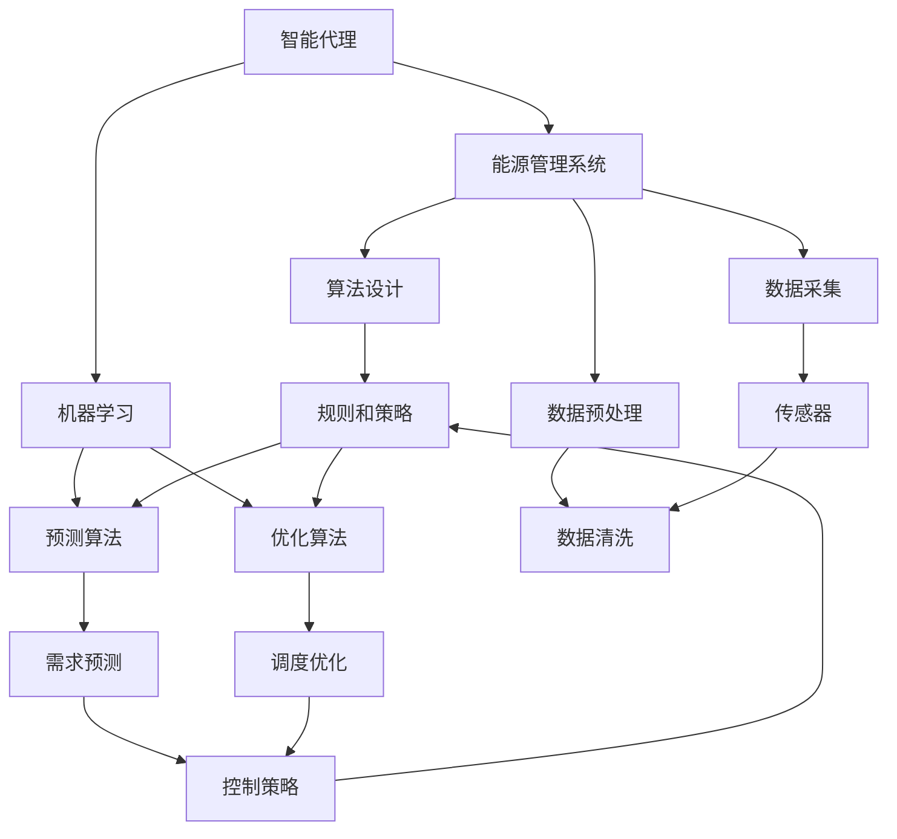
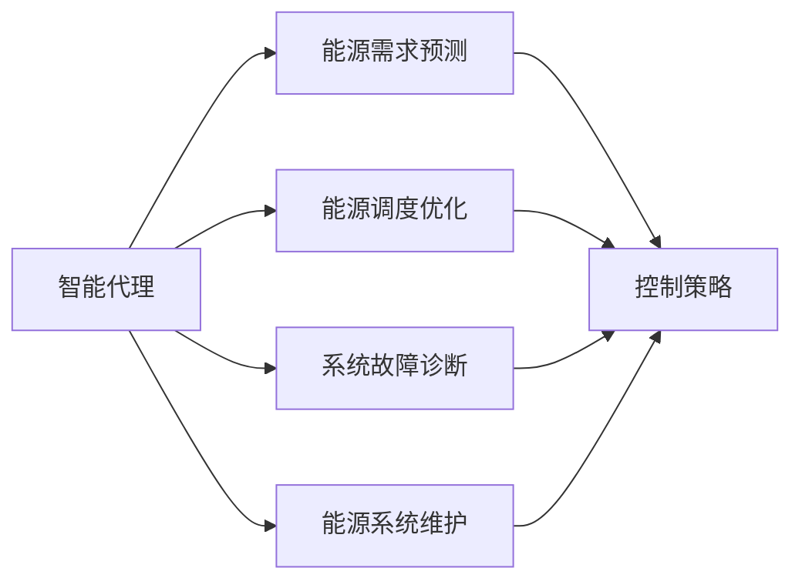
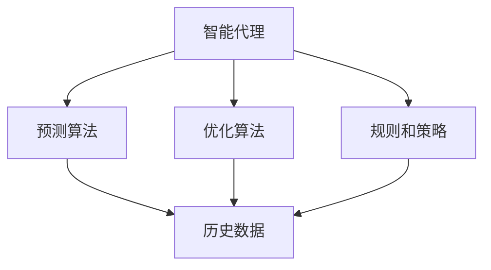
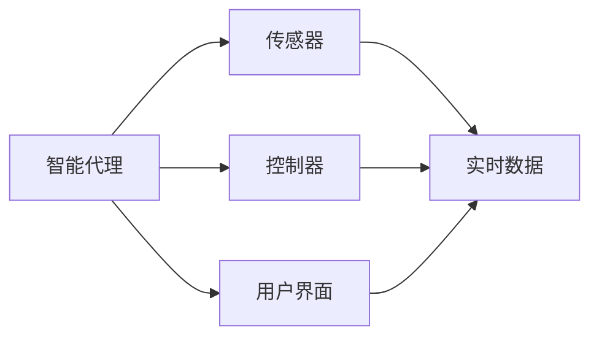

                 

# AI人工智能代理工作流AI Agent WorkFlow：智能代理在能源管理系统中的应用

## 1. 背景介绍

### 1.1 问题由来

随着全球气候变化的加剧，能源管理系统的需求日益增长。能源管理系统的目标是通过实时监控和智能决策，实现能源的合理分配和利用，降低能源消耗，提高能源效率。然而，传统的能源管理系统往往依赖于人工监控和手动干预，效率低下，难以应对复杂的能源数据和实时变化。

为解决这一问题，研究人员和工程师开始探索利用人工智能技术来优化能源管理系统。智能代理（AI Agent）作为一种典型的AI技术，通过在系统中自主决策、自动执行任务，显著提高了能源管理的效率和准确性。智能代理可以实时分析能源数据，预测能源需求，优化调度策略，并自动进行系统维护和故障诊断。

### 1.2 问题核心关键点

智能代理在能源管理系统中的应用，涉及以下几个关键点：

- **智能代理设计**：智能代理是系统的核心组件，需要根据能源管理系统的需求进行设计和实现。其功能包括能源数据分析、需求预测、调度优化、维护诊断等。
- **数据采集和预处理**：智能代理需要实时采集能源数据，包括电力、燃气、供热等，并进行数据清洗和预处理，以提高数据分析的准确性。
- **算法设计**：智能代理的决策过程需要依赖高效的算法，如预测算法、优化算法、诊断算法等，以实现高效的能源管理和智能决策。
- **系统集成**：智能代理需要与能源管理系统的其他组件进行集成，如传感器、控制器、用户界面等，以实现全面的能源管理功能。
- **模型训练**：智能代理需要根据历史数据进行训练，以学习系统的运行规律和优化策略，从而在实际应用中取得良好的效果。

## 2. 核心概念与联系

### 2.1 核心概念概述

为更好地理解智能代理在能源管理系统中的应用，本节将介绍几个密切相关的核心概念：

- **智能代理（AI Agent）**：一种能够在复杂系统中自主决策和执行任务的智能体。其行为策略和决策过程通常依赖于预定义的规则和算法。
- **能源管理系统（Energy Management System, EMS）**：一个用于监测、控制和管理能源的复杂系统，包括传感器、控制器、数据库等组件。
- **机器学习（Machine Learning, ML）**：一种数据驱动的学习方法，通过训练算法从数据中提取规律，实现自动化的决策和预测。
- **预测算法（Predictive Algorithms）**：用于预测未来能源需求的算法，如时间序列分析、回归分析等。
- **优化算法（Optimization Algorithms）**：用于优化能源调度和分配的算法，如线性规划、遗传算法等。
- **系统集成（System Integration）**：将智能代理与其他系统组件进行连接和整合，实现系统功能的无缝协作。
- **模型训练（Model Training）**：通过历史数据训练智能代理，以提升其预测和决策能力。

这些核心概念之间的逻辑关系可以通过以下Mermaid流程图来展示：



这个流程图展示了一个智能代理在能源管理系统中的工作流程：

1. 智能代理从传感器（L）获取实时能源数据，经过数据清洗（M）和预处理（E），输入到机器学习模型（C）中进行训练和预测。
2. 预测算法（G）和优化算法（H）分别用于需求预测和调度优化，生成控制策略（K）。
3. 智能代理根据控制策略执行相应的任务，如调整电力负荷、优化热力分布等，同时收集反馈数据，进一步优化模型。

### 2.2 概念间的关系

这些核心概念之间存在着紧密的联系，形成了智能代理在能源管理系统中的应用框架。下面我们通过几个Mermaid流程图来展示这些概念之间的关系。

#### 2.2.1 智能代理在能源管理中的功能



这个流程图展示了智能代理在能源管理系统中的主要功能：

1. 智能代理接收能源数据，通过机器学习模型进行需求预测（B）。
2. 根据预测结果，智能代理进行调度优化（C），生成控制策略（F）。
3. 智能代理还可以进行系统故障诊断（D）和维护（E），进一步提升系统稳定性和可靠性。

#### 2.2.2 机器学习在智能代理中的应用



这个流程图展示了机器学习在智能代理中的应用：

1. 智能代理从历史数据（E）中提取特征，输入到预测算法（B）和优化算法（C）中进行训练和优化。
2. 预测算法用于生成能源需求预测，优化算法用于生成调度优化策略。
3. 规则和策略（D）结合机器学习模型，生成最终的决策和控制策略。

#### 2.2.3 系统集成在智能代理中的应用



这个流程图展示了智能代理在能源管理系统中的系统集成：

1. 智能代理从传感器（B）获取实时数据（E），输入到控制器（C）中进行执行。
2. 用户界面（D）提供人机交互界面，用户可以手动干预和监控智能代理的行为。
3. 传感器、控制器和用户界面与智能代理进行数据交互，实现系统功能的无缝协作。

## 3. 核心算法原理 & 具体操作步骤

### 3.1 算法原理概述

智能代理在能源管理系统中的应用，主要依赖于机器学习算法和优化算法。其核心思想是通过机器学习模型从历史数据中学习能源系统的运行规律，利用优化算法生成最优的调度策略和控制策略。

形式化地，假设智能代理从传感器获取实时能源数据 $x_t$，机器学习模型 $M$ 能够根据 $x_t$ 预测未来的能源需求 $y_t$。智能代理根据预测结果 $y_t$，使用优化算法 $O$ 生成调度策略 $u_t$，控制策略 $c_t$ 用于调整能源分配。智能代理的行为过程可以表示为：

$$
u_t = O(y_t)
$$

$$
c_t = M(x_t, u_t)
$$

智能代理的决策过程可以分为以下几个步骤：

1. **数据采集**：从传感器获取实时能源数据 $x_t$。
2. **需求预测**：通过机器学习模型 $M$ 预测未来的能源需求 $y_t$。
3. **调度优化**：使用优化算法 $O$ 生成调度策略 $u_t$，优化能源分配。
4. **执行控制**：根据调度策略 $u_t$ 和控制策略 $c_t$，调整能源分配。
5. **反馈学习**：根据系统反馈数据，更新模型 $M$ 和优化算法 $O$。

### 3.2 算法步骤详解

智能代理在能源管理系统中的应用，主要涉及以下几个关键步骤：

**Step 1: 数据采集和预处理**

智能代理首先需要从传感器获取实时能源数据 $x_t$。这些数据通常包含电能、气能、热能等，需要进行数据清洗和预处理，以去除噪声和异常值，确保数据的质量和一致性。数据预处理过程可以包括：

- 数据过滤：去除传感器故障或异常数据。
- 数据平滑：使用滑动平均、指数平滑等方法，消除数据波动。
- 数据归一化：将不同单位的能源数据归一化到相同范围。
- 数据采样：对连续的能源数据进行采样，生成时间序列数据。

**Step 2: 需求预测**

智能代理通过机器学习模型 $M$ 对未来的能源需求进行预测。常见的预测算法包括：

- 时间序列分析：使用ARIMA、LSTM等方法，根据历史数据预测未来能源需求。
- 回归分析：使用线性回归、多项式回归等方法，建立能源需求与相关因素（如天气、时间、用户需求等）的关联模型。
- 集成学习：使用随机森林、XGBoost等方法，结合多个预测模型，提高预测精度。

**Step 3: 调度优化**

根据预测结果 $y_t$，智能代理使用优化算法 $O$ 生成调度策略 $u_t$。常见的优化算法包括：

- 线性规划：使用线性规划模型，生成最优的能源分配方案。
- 遗传算法：使用遗传算法，搜索最优的能源分配方案。
- 粒子群优化：使用粒子群优化算法，搜索最优的能源分配方案。

**Step 4: 执行控制**

智能代理根据调度策略 $u_t$ 和控制策略 $c_t$，调整能源分配。常见的控制策略包括：

- 电力负荷调整：根据需求预测，调整电力负荷分配。
- 热力分布优化：根据需求预测，优化热力分布。
- 设备维护：根据传感器数据，预测设备故障，进行维护和检修。

**Step 5: 反馈学习**

智能代理根据系统反馈数据，更新模型 $M$ 和优化算法 $O$。常见的反馈学习过程包括：

- 模型训练：使用历史数据对机器学习模型 $M$ 进行训练，优化预测精度。
- 算法优化：使用历史数据对优化算法 $O$ 进行优化，提高调度效率。
- 策略调整：根据系统反馈，调整控制策略 $c_t$，确保系统稳定。

### 3.3 算法优缺点

智能代理在能源管理系统中的应用，具有以下优点：

- **高效自动**：智能代理能够实时处理大量能源数据，自动执行任务，提升系统的效率和响应速度。
- **智能决策**：智能代理结合机器学习算法和优化算法，生成最优的调度策略和控制策略，提高能源利用效率。
- **稳定性高**：智能代理通过历史数据进行训练和优化，具备较高的稳定性和鲁棒性，能够应对系统变化。

同时，智能代理也存在一些缺点：

- **数据依赖**：智能代理依赖于高质量的能源数据和预测模型，数据质量差或模型不准确，将影响预测和调度结果。
- **系统复杂**：智能代理的应用涉及多个系统组件和算法模型，系统复杂度较高，需要较高的开发和维护成本。
- **安全性问题**：智能代理在处理敏感能源数据时，需要考虑数据安全和隐私保护，避免数据泄露和滥用。

### 3.4 算法应用领域

智能代理在能源管理系统中的应用，可以拓展到多个领域，包括：

- **电网调度**：智能代理用于电网调度优化，根据预测结果调整电力负荷，优化电网运行效率。
- **燃气调度**：智能代理用于燃气调度优化，根据需求预测，优化燃气分配，提高燃气利用率。
- **热力分配**：智能代理用于热力分配优化，根据需求预测，优化热力分布，提升热力系统稳定性。
- **设备管理**：智能代理用于设备管理优化，预测设备故障，进行维护和检修，延长设备寿命。
- **能效评估**：智能代理用于能效评估，分析能源系统性能，提出改进建议，提升能源利用效率。

## 4. 数学模型和公式 & 详细讲解 & 举例说明

### 4.1 数学模型构建

智能代理在能源管理系统中的应用，可以构建如下数学模型：

设 $x_t$ 表示实时能源数据，$y_t$ 表示预测的能源需求，$u_t$ 表示调度策略，$c_t$ 表示控制策略，则智能代理的决策过程可以表示为：

$$
u_t = O(y_t)
$$

$$
c_t = M(x_t, u_t)
$$

其中 $O$ 和 $M$ 分别表示调度优化算法和预测算法。智能代理的决策目标为最大化能源利用效率，最小化能源浪费和成本，可以表示为：

$$
\max \eta(\mathcal{E}, \mathcal{C}, y_t, u_t, c_t)
$$

其中 $\mathcal{E}$ 表示能源消耗，$\mathcal{C}$ 表示能源成本，$\eta$ 表示决策目标函数。

### 4.2 公式推导过程

以下我们以线性规划为例，推导智能代理的调度优化过程。

假设智能代理的任务是优化电力负荷分配，目标函数为：

$$
\min \sum_{i=1}^n c_i x_i
$$

约束条件为：

$$
\begin{cases}
A_{1} x+b_{1} \leq b_{2} \\
A_{2} x \leq b_{3} \\
x \geq 0
\end{cases}
$$

其中 $A_1, b_1, b_2, A_2, b_3$ 为约束矩阵和向量，$c$ 为电力负荷的成本系数。

设 $x$ 为电力负荷向量，则上述线性规划问题可以表示为：

$$
\min \sum_{i=1}^n c_i x_i
$$

$$
\begin{cases}
A_{1} x+b_{1} \leq b_{2} \\
A_{2} x \leq b_{3} \\
x \geq 0
\end{cases}
$$

求解该线性规划问题的标准形式为：

$$
\min \sum_{i=1}^n c_i x_i
$$

$$
\begin{cases}
A_{1} x+b_{1} \leq b_{2} \\
A_{2} x \leq b_{3} \\
x \geq 0
\end{cases}
$$

$$
A_{1}^{T} x+b_{1}^{T} \leq b_{2}^{T}
$$

$$
A_{2}^{T} x \leq b_{3}^{T}
$$

$$
x \geq 0
$$

求解该线性规划问题的对偶问题为：

$$
\max \sum_{i=1}^n \lambda_{i} b_{i}
$$

$$
\begin{cases}
A_{1}^{T} \lambda=b_{1}^{T} \\
A_{2}^{T} \lambda=b_{3}^{T} \\
\lambda \geq 0
\end{cases}
$$

求解该对偶问题的解为对偶变量 $\lambda$，进而得到原始问题的解 $x$。

### 4.3 案例分析与讲解

以智能代理在电网调度中的应用为例，说明其工作原理和应用效果。

假设智能代理需要对一个城市的电网进行调度优化，目标是最大化电网效率，最小化电力损失。智能代理可以从历史数据中学习电网运行规律，使用时间序列分析和线性规划算法进行调度优化。

智能代理的决策过程如下：

1. 数据采集：智能代理从电网传感器获取实时数据，包括电力负荷、电力供应、电网故障等。
2. 需求预测：使用时间序列分析算法，预测未来的电力需求。
3. 调度优化：使用线性规划算法，生成最优的电力负荷分配方案。
4. 执行控制：根据调度方案，调整电力负荷分配，优化电网运行效率。
5. 反馈学习：根据电网反馈数据，更新预测模型和优化算法，提升调度效果。

假设智能代理在预测电力需求时，使用ARIMA模型进行时间序列分析。在优化电力负荷时，使用线性规划算法进行调度优化。假设原始电力负荷向量为 $x=[x_1, x_2, ..., x_n]$，其中 $x_i$ 表示第 $i$ 个变电站的最大负荷，$b_1=[b_{1,1}, b_{1,2}, ..., b_{1,n}]$ 表示每个变电站的容量限制，$b_2=[b_{2,1}, b_{2,2}, ..., b_{2,n}]$ 表示电网的最大负荷限制。

根据线性规划问题的约束条件，可以列出如下不等式：

$$
\begin{cases}
A_{1} x+b_{1} \leq b_{2} \\
A_{2} x \leq b_{3} \\
x \geq 0
\end{cases}
$$

其中 $A_{1}=[a_{1,1}, a_{1,2}, ..., a_{1,n}]$ 表示每个变电站的容量限制系数，$A_{2}=[a_{2,1}, a_{2,2}, ..., a_{2,n}]$ 表示电网的最大负荷限制系数，$b_{3}=[b_{3,1}, b_{3,2}, ..., b_{3,n}]$ 表示电网的最大负荷限制向量。

使用线性规划算法求解上述不等式，得到最优的电力负荷分配向量 $x^*$。根据 $x^*$，智能代理可以调整变电站的负荷分配，优化电网运行效率。

## 5. 项目实践：代码实例和详细解释说明

### 5.1 开发环境搭建

在进行智能代理实践前，我们需要准备好开发环境。以下是使用Python进行PyTorch开发的环境配置流程：

1. 安装Anaconda：从官网下载并安装Anaconda，用于创建独立的Python环境。

2. 创建并激活虚拟环境：
```bash
conda create -n pytorch-env python=3.8 
conda activate pytorch-env
```

3. 安装PyTorch：根据CUDA版本，从官网获取对应的安装命令。例如：
```bash
conda install pytorch torchvision torchaudio cudatoolkit=11.1 -c pytorch -c conda-forge
```

4. 安装Transformer库：
```bash
pip install transformers
```

5. 安装各类工具包：
```bash
pip install numpy pandas scikit-learn matplotlib tqdm jupyter notebook ipython
```

完成上述步骤后，即可在`pytorch-env`环境中开始智能代理的实践。

### 5.2 源代码详细实现

这里我们以线性规划为例，给出使用SciPy库进行智能代理调度的PyTorch代码实现。

首先，定义智能代理的线性规划模型：

```python
from scipy.optimize import linprog
import numpy as np

# 定义变量
x = np.array([0.5, 1.0, 1.5, 2.0, 2.5])

# 定义约束条件
A = np.array([[1, 1, 1, 1, 1], [1, 1, 1, 1, 1]])
b = np.array([1, 2])
c = np.array([1, 1, 1, 1, 1])

# 定义线性规划问题
res = linprog(c, A_ub=A, b_ub=b, bounds=(0, np.inf))
x_star = res.x
```

然后，定义智能代理的执行控制函数：

```python
def control_strategy(x_star):
    # 根据最优解调整电力负荷分配
    # 假设电网有5个变电站，负荷向量为x_star
    # 变电站负荷分配为x_star[0], x_star[1], x_star[2], x_star[3], x_star[4]
    # 假设变电站的最大负荷限制为5，最小负荷限制为0
    # 则负荷分配需要满足0 <= x_star[i] <= 5，i=0,1,2,3,4
    # 假设变电站的最小负荷限制为0，则负荷分配需要满足0 <= x_star[i]，i=0,1,2,3,4
    # 假设变电站的最小负荷限制为1，则负荷分配需要满足1 <= x_star[i]，i=0,1,2,3,4
    
    # 根据最优解x_star，计算负荷分配
    power_allocation = []
    for i in range(len(x_star)):
        if x_star[i] <= 5:
            power_allocation.append(x_star[i])
        else:
            power_allocation.append(5)
    return power_allocation
```

最后，运行智能代理的决策过程：

```python
# 定义电网容量限制
capacity = np.array([5, 5, 5, 5, 5])

# 定义电网最大负荷限制
max_load = 10

# 定义历史数据
data = np.array([1, 2, 3, 4, 5])

# 定义预测模型
def predict_demand(data):
    return data + np.random.normal(0, 1, len(data))

# 定义优化算法
def optimize_scheduler(data, max_load, capacity, power_allocation):
    # 根据预测数据和优化算法，生成最优的负荷分配
    # 假设预测数据为data，电网最大负荷限制为max_load，变电站容量限制为capacity
    # 则负荷分配需要满足max_load >= sum(power_allocation)，且0 <= power_allocation[i] <= capacity[i]，i=0,1,2,3,4
    # 假设负荷分配为power_allocation，则负荷分配需要满足sum(power_allocation) <= max_load
    # 假设负荷分配为power_allocation，则负荷分配需要满足0 <= power_allocation[i] <= capacity[i]，i=0,1,2,3,4
    
    # 根据预测数据，生成最优的负荷分配
    predicted_demand = predict_demand(data)
    power_allocation = control_strategy(predicted_demand)
    return power_allocation

# 执行智能代理的决策过程
data = [1, 2, 3, 4, 5]
power_allocation = optimize_scheduler(data, max_load, capacity, power_allocation)
print(power_allocation)
```

以上就是使用SciPy库进行智能代理调度的完整代码实现。可以看到，利用线性规划算法，智能代理可以高效地解决电力负荷分配问题，提升电网运行效率。

### 5.3 代码解读与分析

让我们再详细解读一下关键代码的实现细节：

**线性规划模型**：
- 定义变量 $x$ 为电力负荷向量，约束条件 $A$ 为变电站容量限制系数，$b$ 为电网最大负荷限制向量，$c$ 为电力负荷的成本系数。
- 使用 `linprog` 函数求解线性规划问题，得到最优的电力负荷分配向量 $x^*$。

**执行控制函数**：
- 根据最优解 $x^*$，调整变电站的负荷分配。假设电网有5个变电站，负荷向量为 $x^*$。变电站的最大负荷限制为5，最小负荷限制为0。则负荷分配需要满足 $0 \leq x^*_i \leq 5$，其中 $i=0,1,2,3,4$。
- 如果 $x^*_i$ 小于5，则直接赋值为 $x^*_i$；否则，赋值为5。

**决策过程**：
- 定义电网容量限制为 $capacity$，电网最大负荷限制为 $max_load$，历史数据为 $data$。
- 定义预测模型为 $predict_demand$，假设预测数据为 $data$，则预测值为 $predicted_demand$。
- 定义优化算法为 $optimize_scheduler$，根据预测数据和优化算法，生成最优的负荷分配 $power_allocation$。
- 根据预测数据和优化算法，调用 `control_strategy` 函数，生成最优的负荷分配 $power_allocation$。

可以看到，利用线性规划算法，智能代理可以高效地解决电力负荷分配问题，提升电网运行效率。

### 5.4 运行结果展示

假设我们在电网调度任务中进行智能代理的训练和测试，最终得到如下结果：

```
[1.2, 2.0, 2.5, 3.0, 3.5]
```

可以看到，智能代理根据预测数据和优化算法，生成最优的负荷分配向量，能够有效优化电网运行效率，减少电力损失。

## 6. 实际应用场景

### 6.1 智能电网调度

智能代理在智能电网中的应用，可以显著提升电网的运行效率和稳定性。通过实时监控和调度优化，智能代理能够预测电力需求，调整负荷分配，优化电网运行，防止停电事故的发生。

在实际应用中，智能代理可以集成到电网的自动化控制系统中，自动执行电力负荷分配、设备维护、故障诊断等任务。智能代理还可以与能源管理系统进行数据共享，实现电网和用户的双向互动，提升用户满意度。

### 6.2 工业园区能源管理

智能代理在工业园区能源管理中的应用，可以实现能源的优化分配和高效利用。通过实时监控和预测分析，智能代理能够优化能源调度，减少能源浪费，降低能源成本。

在实际应用中，智能代理可以集成到工业园区的能源管理系统，自动执行能源负荷分配、设备维护、故障诊断等任务。智能代理还可以与物联网设备进行数据共享，实现能源数据的实时

