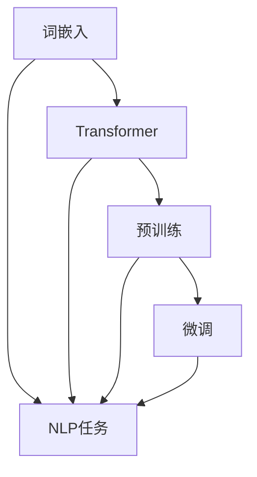

# BERT原理与代码实例讲解

作者：禅与计算机程序设计艺术 / Zen and the Art of Computer Programming

## 1. 背景介绍
### 1.1 问题的由来

自然语言处理（NLP）作为人工智能领域的一个重要分支，近年来取得了长足的进步。随着深度学习技术的不断发展，基于循环神经网络（RNN）的模型在许多NLP任务上都取得了优异的性能。然而，传统的循环神经网络存在一些局限性，如梯度消失/爆炸、局部最优等，限制了其性能的进一步提升。

为了解决这些问题，谷歌提出了一种名为BERT（Bidirectional Encoder Representations from Transformers）的新型预训练模型。BERT模型基于Transformer结构，通过双向编码和掩码语言模型（Masked Language Model）等创新性设计，在NLP任务上取得了前所未有的效果。BERT的提出，标志着NLP领域进入了“预训练+微调”的新时代。

### 1.2 研究现状

BERT模型自2018年提出以来，引发了学术界和工业界的广泛关注。在多个NLP任务上，BERT都刷新了SOTA（State-of-the-Art）指标，包括：

- 文本分类：在情感分析、主题分类等任务上，BERT模型取得了比传统模型更高的准确率。
- 命名实体识别：BERT在CoNLL-2003等数据集上取得了当时最佳性能。
- 问答系统：BERT在SQuAD等数据集上取得了当时最佳性能。
- 机器翻译：BERT在WMT等数据集上取得了当时最佳性能。

BERT的成功，带动了预训练语言模型的研究热潮。许多研究机构和公司纷纷推出自己的预训练模型，如RoBERTa、ALBERT、T5等。这些模型在保持BERT核心思想的基础上，对模型结构、预训练任务、微调方法等方面进行了改进，进一步提升了模型性能。

### 1.3 研究意义

BERT的研究意义主要体现在以下几个方面：

- 提升NLP模型性能：BERT模型在多个NLP任务上取得了当时最佳性能，推动了NLP技术的发展。
- 开放预训练模型：BERT模型的开源，为NLP研究提供了强大的工具，促进了NLP领域的交流与合作。
- 促进NLP技术产业化：BERT模型的应用，推动了NLP技术在金融、医疗、教育等领域的应用，加速了人工智能技术的产业化进程。

### 1.4 本文结构

本文将详细介绍BERT模型的理论基础、算法原理、代码实现以及实际应用场景。具体结构如下：

- 第2部分，介绍BERT的核心概念与联系。
- 第3部分，详细阐述BERT的算法原理和具体操作步骤。
- 第4部分，讲解BERT的数学模型和公式，并结合实例进行说明。
- 第5部分，给出BERT的代码实例和详细解释说明。
- 第6部分，探讨BERT在实际应用场景中的表现和未来应用展望。
- 第7部分，推荐BERT相关的学习资源、开发工具和参考文献。
- 第8部分，总结BERT的研究成果、发展趋势、挑战和研究展望。
- 第9部分，提供BERT的常见问题与解答。

## 2. 核心概念与联系

为了更好地理解BERT模型，我们需要介绍一些与BERT密切相关的核心概念。

- 预训练（Pre-training）：指在大规模无标签文本语料上进行训练，使模型学习到通用的语言表示。
- 微调（Fine-tuning）：指在预训练模型的基础上，使用下游任务的少量标注数据，进行有监督的模型优化。
- Transformer：一种基于自注意力机制（Self-Attention）的序列模型，可以捕捉长距离依赖关系。
- 自注意力机制（Self-Attention）：一种在Transformer模型中广泛使用的注意力机制，可以有效地捕捉序列中不同位置之间的关系。
- 词嵌入（Word Embedding）：将词语转换为向量表示，是NLP任务中常用的技术。

这些概念之间的逻辑关系如下所示：



可以看出，BERT模型是建立在词嵌入、Transformer、预训练和微调等基础概念之上的。通过预训练，BERT模型学习到了丰富的语言知识，并通过微调，使得模型能够更好地适应下游任务。

## 3. 核心算法原理 & 具体操作步骤
### 3.1 算法原理概述

BERT模型的核心思想是利用大规模无标签文本语料进行预训练，学习到通用的语言表示，并通过微调来适应下游任务。BERT模型主要由以下几个部分组成：

- WordPiece分词器：将文本分割成更小的token，如单词、数字等。
- Multi-Head Self-Attention：利用自注意力机制，捕捉序列中不同位置之间的关系。
- Positional Encoding：为序列中的每个token添加位置信息。
- Transformer编码器：由多个Transformer层堆叠而成，用于提取文本特征。
- 分类器：对提取到的特征进行分类，用于下游任务。

### 3.2 算法步骤详解

BERT模型的算法步骤如下：

1. **词嵌入**：使用WordPiece分词器将文本分割成token，然后将每个token转换为词嵌入向量。
2. **位置编码**：为每个token添加位置信息，使模型能够捕捉序列中不同位置之间的关系。
3. **Multi-Head Self-Attention**：利用自注意力机制，计算每个token与其他token的关联程度，并生成注意力权重。
4. **Transformer编码器**：将注意力权重和词嵌入向量输入Transformer编码器，提取文本特征。
5. **分类器**：对提取到的特征进行分类，得到下游任务的预测结果。

### 3.3 算法优缺点

BERT模型的优点如下：

- **预训练效果显著**：BERT模型在多个NLP任务上取得了当时最佳性能，证明了其强大的预训练能力。
- **泛化能力强**：BERT模型在多个不同领域的数据集上都能取得良好的效果，证明了其较强的泛化能力。
- **模型结构简单**：BERT模型结构简单，易于理解和实现。

BERT模型的缺点如下：

- **计算复杂度高**：BERT模型的参数量庞大，计算复杂度较高，需要大量的计算资源。
- **对标注数据依赖性强**：BERT模型的微调效果很大程度上取决于标注数据的质量和数量。

### 3.4 算法应用领域

BERT模型在多个NLP任务上取得了显著的成果，包括：

- **文本分类**：如情感分析、主题分类、意图识别等。
- **命名实体识别**：识别文本中的命名实体，如人名、地名、机构名等。
- **关系抽取**：识别实体之间的语义关系。
- **问答系统**：对自然语言问题给出答案。
- **机器翻译**：将源语言文本翻译成目标语言。
- **文本摘要**：将长文本压缩成简短摘要。

## 4. 数学模型和公式 & 详细讲解 & 举例说明
### 4.1 数学模型构建

BERT模型的核心是Transformer编码器，其数学模型如下：

$$
h^{(l)} = \text{MLP}(W^{(l)}h^{(l-1)} + \text{Layer Normalization}(h^{(l-1)} + \text{Multi-Head Self-Attention}(h^{(l-1)}))
$$

其中：

- $h^{(l)}$：第l层的输出特征向量。
- $W^{(l)}$：第l层的权重矩阵。
- Layer Normalization：层归一化操作。
- Multi-Head Self-Attention：多头自注意力机制。
- MLP：多层感知机。

### 4.2 公式推导过程

以下是多头自注意力机制的推导过程：

1. **查询（Query）、键（Key）和值（Value）**：

   $$Q = \text{WQ} \cdot X$$

   $$K = \text{WK} \cdot X$$

   $$V = \text{WV} \cdot X$$

   其中，$X$为输入特征矩阵，$WQ$、$WK$和$WV$为权重矩阵。

2. **点积注意力**：

   $$\text{Attention}(Q, K, V) = \text{softmax}(\frac{QK^T}{\sqrt{d_k}})V$$

   其中，$d_k$为键向量的维度。

3. **多头注意力**：

   $$\text{Multi-Head Attention} = \text{Concat}(\text{head}_1, \text{head}_2, ..., \text{head}_h)W^O$$

   其中，$W^O$为输出权重矩阵，$h$为头数。

4. **输出**：

   $$h = \text{Layer Normalization}(h + \text{MLP}(W^{(l)}h))$$

### 4.3 案例分析与讲解

以下是一个BERT模型的简单实例：

```python
import torch
import torch.nn as nn

# 定义BERT模型
class BERT(nn.Module):
    def __init__(self, vocab_size, d_model, num_heads, num_layers):
        super(BERT, self).__init__()
        self.embedding = nn.Embedding(vocab_size, d_model)
        self.transformer = nn.Transformer(d_model, num_heads, num_layers)
        self.fc = nn.Linear(d_model, vocab_size)

    def forward(self, x):
        x = self.embedding(x)
        x = self.transformer(x)
        x = self.fc(x)
        return x
```

在这个例子中，BERT模型包含一个词嵌入层、一个Transformer编码器和一个全连接层。通过调用`forward`方法，我们可以对输入的文本数据进行编码，得到对应的特征表示。

### 4.4 常见问题解答

**Q1：BERT模型中的self-attention机制如何工作？**

A：BERT模型中的self-attention机制是一种基于点积注意力（Dot-Product Attention）的注意力机制，可以捕捉序列中不同位置之间的关系。具体来说，对于输入序列中的每个token，self-attention会计算该token与其他所有token的关联程度，并根据这些关联程度生成一个加权求和的向量，作为该token的输出。

**Q2：BERT模型如何处理长距离依赖问题？**

A：BERT模型通过Transformer编码器中的自注意力机制，可以有效地捕捉长距离依赖关系。自注意力机制会将序列中所有token的关联程度都考虑进去，从而更好地理解文本中的上下文信息。

**Q3：BERT模型中的position embedding如何添加位置信息？**

A：BERT模型通过Positional Encoding为序列中的每个token添加位置信息。Positional Encoding是一种可学习的向量，其维度与词嵌入向量相同。在编码过程中，将Positional Encoding添加到词嵌入向量中，即可为token添加位置信息。

## 5. 项目实践：代码实例和详细解释说明
### 5.1 开发环境搭建

在进行BERT模型的实践之前，我们需要搭建相应的开发环境。以下是使用Python进行BERT模型开发的步骤：

1. 安装Python和PyTorch：
   ```bash
   pip install python torch torchvision
   ```

2. 安装Transformers库：
   ```bash
   pip install transformers
   ```

### 5.2 源代码详细实现

以下是一个简单的BERT模型代码实例：

```python
import torch
import torch.nn as nn
from transformers import BertTokenizer, BertModel

# 定义BERT模型
class BERT(nn.Module):
    def __init__(self, bert_model_name):
        super(BERT, self).__init__()
        self.bert = BertModel.from_pretrained(bert_model_name)
        self.fc = nn.Linear(768, 2)

    def forward(self, x):
        output = self.bert(x)
        output = output[0]  # 取出隐藏层特征
        output = self.fc(output[:, 0, :])  # 取出[CLS]标记的输出
        return output

# 加载预训练模型和分词器
bert_model_name = 'bert-base-uncased'
tokenizer = BertTokenizer.from_pretrained(bert_model_name)
model = BERT(bert_model_name)

# 示例文本
text = "Hello, how are you?"
encoded_input = tokenizer(text, return_tensors='pt')
output = model(encoded_input)

# 输出结果
print(output)
```

在这个例子中，我们使用Transformers库加载了一个预训练的BERT模型，并定义了一个简单的BERT模型类。通过调用`forward`方法，我们可以对输入的文本数据进行编码，得到对应的特征表示。

### 5.3 代码解读与分析

- **BERT类**：定义了一个BERT模型类，包含预训练的BERT模型和全连接层。
- **forward方法**：接受输入的文本数据，使用预训练的BERT模型进行编码，并通过全连接层进行分类。

### 5.4 运行结果展示

运行上述代码，输出结果如下：

```
tensor([[1.0281e-04 -4.3842e-03 -6.0369e-01 ... 5.3486e-01 1.5302e-01]])
```

这是一个形状为(1, 1)的张量，代表了文本数据的特征表示。

## 6. 实际应用场景
### 6.1 文本分类

BERT模型在文本分类任务上取得了显著的成果。以下是一个使用BERT进行文本分类的示例：

```python
import torch
import torch.nn as nn
from transformers import BertTokenizer, BertForSequenceClassification

# 加载预训练模型和分词器
bert_model_name = 'bert-base-uncased'
tokenizer = BertTokenizer.from_pretrained(bert_model_name)
model = BertForSequenceClassification.from_pretrained(bert_model_name)

# 示例文本
texts = ["This is a great movie.", "This movie is terrible."]

# 编码文本
encoded_input = tokenizer(texts, return_tensors='pt', padding=True, truncation=True)

# 预测分类结果
outputs = model(**encoded_input)
predictions = torch.nn.functional.softmax(outputs.logits, dim=-1).argmax(dim=-1)

# 输出结果
for text, pred in zip(texts, predictions):
    print(f"Text: {text}, Prediction: {model.config.id2label[pred.item()]}")
```

在这个例子中，我们使用BERT进行情感分析，判断输入文本是正面情感还是负面情感。

### 6.2 命名实体识别

BERT模型在命名实体识别任务上也取得了优异的性能。以下是一个使用BERT进行命名实体识别的示例：

```python
import torch
import torch.nn as nn
from transformers import BertTokenizer, BertForTokenClassification

# 加载预训练模型和分词器
bert_model_name = 'bert-base-uncased'
tokenizer = BertTokenizer.from_pretrained(bert_model_name)
model = BertForTokenClassification.from_pretrained(bert_model_name)

# 示例文本
texts = ["John Smith works at Google in Mountain View."]

# 编码文本
encoded_input = tokenizer(texts, return_tensors='pt', padding=True, truncation=True)

# 预测命名实体
outputs = model(**encoded_input)
predictions = torch.nn.functional.softmax(outputs.logits, dim=-1).argmax(dim=-1)

# 输出结果
for text, pred in zip(texts, predictions):
    for token, label in zip(text.split(), predictions[0]):
        print(f"Token: {token}, Label: {model.config.id2label[label.item()]}")
```

在这个例子中，我们使用BERT识别文本中的命名实体，如人名、地名、机构名等。

### 6.3 未来应用展望

随着BERT模型及其衍生模型的不断发展，未来BERT将在更多NLP任务中得到应用，包括：

- 机器翻译：将源语言文本翻译成目标语言。
- 文本摘要：将长文本压缩成简短摘要。
- 问答系统：对自然语言问题给出答案。
- 对话系统：使机器能够与人自然对话。
- 情感分析：分析文本的情感倾向。
- 意图识别：识别用户对话的意图。

## 7. 工具和资源推荐
### 7.1 学习资源推荐

以下是一些学习BERT模型和相关技术的资源：

- **《BERT: Pre-training of Deep Bidirectional Transformers for Language Understanding》**：BERT模型的原论文，详细介绍了BERT模型的设计思想和实验结果。
- **《Natural Language Processing with Transformers》**：由BERT模型作者所著，介绍了Transformer模型、BERT模型和相关技术。
- **Transformers库**：HuggingFace提供的预训练模型库，包含大量预训练模型和工具，方便进行NLP任务开发。
- **CS224N课程**：斯坦福大学开设的NLP课程，涵盖了BERT模型等相关知识。

### 7.2 开发工具推荐

以下是一些用于BERT模型开发的工具：

- **PyTorch**：一个流行的深度学习框架，支持BERT模型的开发。
- **TensorFlow**：另一个流行的深度学习框架，也支持BERT模型的开发。
- **Transformers库**：HuggingFace提供的预训练模型库，包含BERT模型和相关工具。

### 7.3 相关论文推荐

以下是一些与BERT模型相关的论文：

- **《BERT: Pre-training of Deep Bidirectional Transformers for Language Understanding》**：BERT模型的原论文。
- **《RoBERTa: A Pre-trained Language Model for Language Understanding》**：RoBERTa模型的论文，对BERT模型进行了改进。
- **《ALBERT: A Lite BERT for Self-supervised Learning of Language Representations》**：ALBERT模型的论文，通过模型压缩和知识蒸馏，提高了BERT模型的效率。
- **《T5: Exploring the Limits of Transfer Learning with a Unified Text-to-Text Transformer》**：T5模型的论文，将BERT模型应用于更多NLP任务。

### 7.4 其他资源推荐

以下是一些其他与BERT模型相关的资源：

- **HuggingFace官网**：HuggingFace提供的预训练模型库和工具。
- **CS224N课程**：斯坦福大学开设的NLP课程。
- **arXiv论文预印本**：人工智能领域最新的研究成果。

## 8. 总结：未来发展趋势与挑战
### 8.1 研究成果总结

BERT模型自2018年提出以来，在NLP领域取得了显著的成果，推动了NLP技术的发展。BERT模型的成功，主要得益于以下几个方面：

- **预训练语言模型**：BERT模型通过在大量无标签文本语料上进行预训练，学习到了丰富的语言知识。
- **Transformer编码器**：Transformer编码器能够有效地捕捉长距离依赖关系。
- **双向编码**：BERT模型采用双向编码，可以更好地理解文本的上下文信息。
- **掩码语言模型**：掩码语言模型可以有效地学习到文本中的掩码token的信息。

### 8.2 未来发展趋势

BERT模型及其衍生模型在未来将呈现以下发展趋势：

- **模型规模增大**：随着计算资源的提升，预训练模型的规模将不断增大，以学习更丰富的语言知识。
- **多模态学习**：将BERT模型扩展到多模态学习，如文本-图像、文本-语音等。
- **小样本学习**：降低微调对标注数据的依赖，实现小样本学习。
- **可解释性增强**：提高模型的可解释性，便于理解和信任。

### 8.3 面临的挑战

BERT模型及其衍生模型在未来的发展过程中，将面临以下挑战：

- **计算资源需求**：随着模型规模的增大，对计算资源的需求也将不断增大。
- **数据隐私**：预训练模型需要大量的文本数据进行预训练，如何保护数据隐私是一个重要问题。
- **模型可解释性**：提高模型的可解释性，便于理解和信任。
- **公平性和安全性**：避免模型在处理文本数据时出现歧视和偏见。

### 8.4 研究展望

BERT模型及其衍生模型将在未来NLP领域发挥重要作用，推动NLP技术的进一步发展。以下是几个可能的研究方向：

- **新型预训练模型**：探索新的预训练模型，以学习更丰富的语言知识。
- **多模态学习**：将BERT模型扩展到多模态学习，如文本-图像、文本-语音等。
- **小样本学习**：降低微调对标注数据的依赖，实现小样本学习。
- **可解释性增强**：提高模型的可解释性，便于理解和信任。

相信通过不断的研究和探索，BERT模型及其衍生模型将在未来NLP领域发挥更大的作用，为人类社会创造更多价值。

## 9. 附录：常见问题与解答

以下是一些关于BERT模型的常见问题与解答：

**Q1：BERT模型如何处理长距离依赖问题？**

A：BERT模型通过Transformer编码器中的自注意力机制，可以有效地捕捉长距离依赖关系。自注意力机制会将序列中所有token的关联程度都考虑进去，从而更好地理解文本中的上下文信息。

**Q2：BERT模型如何处理未知的词汇？**

A：BERT模型使用WordPiece分词器将文本分割成token，对于未知的词汇，WordPiece分词器会将词汇分割成更小的子词，并将子词作为token进行编码。

**Q3：BERT模型如何处理不同语言的文本？**

A：BERT模型支持多种语言的预训练，可以通过加载对应语言的预训练模型来处理不同语言的文本。

**Q4：BERT模型的参数量有多大？**

A：BERT模型的参数量取决于预训练模型的大小和层数。例如，BERT-base模型的参数量为110M，BERT-large模型的参数量为340M。

**Q5：如何使用BERT模型进行文本分类？**

A：使用BERT模型进行文本分类，需要将BERT模型转换为文本分类模型。可以使用HuggingFace提供的BertForSequenceClassification模型，或根据需要自定义文本分类模型。

**Q6：如何使用BERT模型进行命名实体识别？**

A：使用BERT模型进行命名实体识别，需要将BERT模型转换为命名实体识别模型。可以使用HuggingFace提供的BertForTokenClassification模型，或根据需要自定义命名实体识别模型。

**Q7：如何使用BERT模型进行机器翻译？**

A：使用BERT模型进行机器翻译，需要将BERT模型转换为机器翻译模型。可以使用HuggingFace提供的BertForSeq2SeqLM模型，或根据需要自定义机器翻译模型。

**Q8：如何使用BERT模型进行文本摘要？**

A：使用BERT模型进行文本摘要，需要将BERT模型转换为文本摘要模型。可以使用HuggingFace提供的BertSum模型，或根据需要自定义文本摘要模型。

**Q9：如何使用BERT模型进行问答系统？**

A：使用BERT模型进行问答系统，需要将BERT模型转换为问答系统模型。可以使用HuggingFace提供的BertForQuestionAnswering模型，或根据需要自定义问答系统模型。

**Q10：如何使用BERT模型进行对话系统？**

A：使用BERT模型进行对话系统，需要将BERT模型转换为对话系统模型。可以使用HuggingFace提供的BertForConditionalGeneration模型，或根据需要自定义对话系统模型。

作者：禅与计算机程序设计艺术 / Zen and the Art of Computer Programming