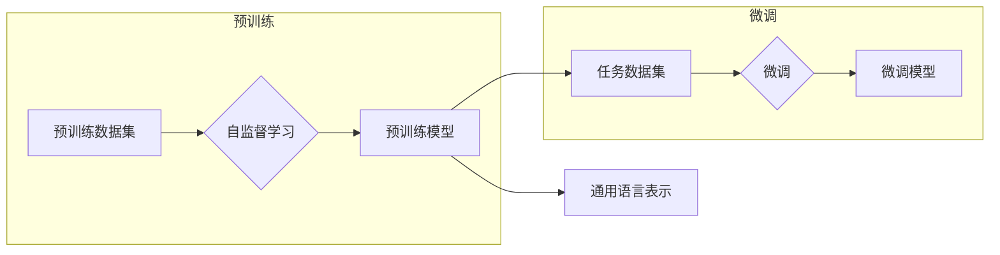

> 大语言模型 (LLM), 工程实践, 局限性, 发展趋势, 可扩展性, 可解释性, 可信度

# 大语言模型原理与工程实践：局限和发展

### 1. 背景介绍

近年来，随着深度学习技术的迅猛发展，大语言模型（Large Language Models，LLM）在自然语言处理（Natural Language Processing，NLP）领域取得了突破性的进展。LLM能够理解和生成自然语言，并在多种任务中展现出惊人的性能，如文本分类、机器翻译、问答系统等。然而，LLM的应用也面临着一些局限性，如何在工程实践中克服这些局限性，使其更加可靠、高效，是大语言模型发展的关键。

### 2. 核心概念与联系

#### 2.1 核心概念原理

大语言模型通常基于深度神经网络（Deep Neural Network，DNN）构建，其核心原理包括：

- **预训练（Pre-training）**：在大量无标注数据上进行预训练，学习通用的语言表示和知识。
- **微调（Fine-tuning）**：在特定任务上使用少量标注数据进行微调，使模型适应特定领域的语言特点。
- **注意力机制（Attention Mechanism）**：模型通过注意力机制聚焦于输入数据中的关键信息，提高处理效率。

#### 2.2 架构的 Mermaid 流程图



### 3. 核心算法原理 & 具体操作步骤

#### 3.1 算法原理概述

大语言模型通常基于以下算法原理：

- **Transformer**：一种基于自注意力机制的编码器-解码器架构，在NLP任务中取得了显著成效。
- **BERT**：一种基于Transformer的预训练模型，通过掩码语言模型（Masked Language Model，MLM）和下一句预测（Next Sentence Prediction，NSP）等预训练任务学习语言知识。
- **GPT**：一种基于自回归的生成模型，通过预测下一个单词来学习语言结构。

#### 3.2 算法步骤详解

大语言模型的工程实践步骤如下：

1. **数据预处理**：清洗、标注和预处理数据，为模型训练和微调提供高质量的数据集。
2. **模型选择**：根据任务需求选择合适的预训练模型或从头开始构建模型。
3. **模型训练**：在预训练数据集上进行模型训练，学习通用语言表示和知识。
4. **模型微调**：在特定任务数据集上进行模型微调，使模型适应特定领域的语言特点。
5. **模型评估**：在测试集上评估模型性能，调整模型参数和超参数，优化模型性能。
6. **模型部署**：将训练好的模型部署到实际应用中，实现自动化或半自动化处理。

#### 3.3 算法优缺点

大语言模型的优势在于：

- **强大的语言理解能力**：能够理解和生成自然语言，处理多种NLP任务。
- **泛化能力强**：在预训练阶段学习到的知识可以迁移到其他任务上。

然而，大语言模型也存在一些局限性：

- **数据依赖性强**：需要大量高质量的数据进行预训练和微调。
- **计算资源消耗大**：模型训练和推理需要大量的计算资源。
- **可解释性差**：模型的决策过程难以解释，存在安全隐患。

#### 3.4 算法应用领域

大语言模型在以下领域得到广泛应用：

- **自然语言处理（NLP）**：文本分类、机器翻译、问答系统、文本摘要、情感分析等。
- **推荐系统**：个性化推荐、商品推荐、新闻推荐等。
- **语音识别与合成**：语音识别、语音合成、语音助手等。
- **图像识别与生成**：图像识别、图像分割、图像生成等。

### 4. 数学模型和公式 & 详细讲解 & 举例说明

#### 4.1 数学模型构建

大语言模型通常基于以下数学模型：

- **Transformer模型**：使用自注意力机制计算词向量之间的关联关系。

$$
\text{Attention}(Q, K, V) = \frac{e^{QK^T}}{ \sqrt{d_k}}V
$$

- **BERT模型**：使用双向Transformer编码器进行文本编码。

$$
\text{BERT} = \text{Transformer}(\text{encoder}, \text{pooler})
$$

#### 4.2 公式推导过程

以Transformer模型为例，公式推导过程如下：

1. **输入词向量**：将输入文本序列转换为词向量。
2. **自注意力机制**：计算词向量之间的关联关系。
3. **多头注意力**：将自注意力机制扩展到多个子空间。
4. **前馈神经网络**：对多头注意力结果进行非线性变换。
5. **层归一化**：对神经网络输出进行归一化处理。

#### 4.3 案例分析与讲解

以BERT模型为例，讲解其在情感分析任务中的应用：

1. **数据预处理**：将情感分析数据集进行清洗、标注和预处理。
2. **模型选择**：选择预训练的BERT模型。
3. **模型微调**：在情感分析数据集上进行模型微调。
4. **模型评估**：在测试集上评估模型性能，调整模型参数和超参数。
5. **模型部署**：将训练好的模型部署到实际应用中。

### 5. 项目实践：代码实例和详细解释说明

#### 5.1 开发环境搭建

1. 安装Python、PyTorch、transformers等依赖库。
2. 准备情感分析数据集，如IMDb数据集。

#### 5.2 源代码详细实现

```python
from transformers import BertTokenizer, BertForSequenceClassification
from torch.utils.data import DataLoader, Dataset
import torch

# 数据集类
class SentimentDataset(Dataset):
    def __init__(self, texts, labels, tokenizer):
        self.texts = texts
        self.labels = labels
        self.tokenizer = tokenizer
    
    def __len__(self):
        return len(self.texts)
    
    def __getitem__(self, idx):
        text = self.texts[idx]
        label = self.labels[idx]
        encoding = self.tokenizer(text, padding=True, truncation=True)
        return {
            'input_ids': encoding['input_ids'],
            'attention_mask': encoding['attention_mask'],
            'labels': label
        }

# 训练模型
def train(model, dataloader, optimizer):
    model.train()
    total_loss = 0
    for batch in dataloader:
        optimizer.zero_grad()
        input_ids = batch['input_ids'].to(device)
        attention_mask = batch['attention_mask'].to(device)
        labels = batch['labels'].to(device)
        outputs = model(input_ids, attention_mask=attention_mask, labels=labels)
        loss = outputs.loss
        total_loss += loss.item()
        loss.backward()
        optimizer.step()
    return total_loss / len(dataloader)

# 评估模型
def evaluate(model, dataloader):
    model.eval()
    total_loss = 0
    with torch.no_grad():
        for batch in dataloader:
            input_ids = batch['input_ids'].to(device)
            attention_mask = batch['attention_mask'].to(device)
            labels = batch['labels'].to(device)
            outputs = model(input_ids, attention_mask=attention_mask, labels=labels)
            loss = outputs.loss
            total_loss += loss.item()
    return total_loss / len(dataloader)

# 主函数
if __name__ == '__main__':
    # 加载数据集
    tokenizer = BertTokenizer.from_pretrained('bert-base-uncased')
    texts, labels = load_data()
    train_dataset = SentimentDataset(texts, labels, tokenizer)
    dev_dataset = SentimentDataset(dev_texts, dev_labels, tokenizer)
    test_dataset = SentimentDataset(test_texts, test_labels, tokenizer)

    # 分割数据集
    train_dataloader = DataLoader(train_dataset, batch_size=16, shuffle=True)
    dev_dataloader = DataLoader(dev_dataset, batch_size=16, shuffle=False)
    test_dataloader = DataLoader(test_dataset, batch_size=16, shuffle=False)

    # 加载模型
    device = torch.device('cuda' if torch.cuda.is_available() else 'cpu')
    model = BertForSequenceClassification.from_pretrained('bert-base-uncased', num_labels=2).to(device)

    # 设置优化器
    optimizer = torch.optim.AdamW(model.parameters(), lr=2e-5)

    # 训练模型
    epochs = 3
    for epoch in range(epochs):
        train_loss = train(model, train_dataloader, optimizer)
        dev_loss = evaluate(model, dev_dataloader)
        print(f'Epoch {epoch+1}, train loss: {train_loss:.4f}, dev loss: {dev_loss:.4f}')

    # 评估模型
    test_loss = evaluate(model, test_dataloader)
    print(f'Test loss: {test_loss:.4f}')
```

#### 5.3 代码解读与分析

以上代码展示了如何使用PyTorch和transformers库在情感分析任务上微调BERT模型。主要步骤包括：

1. 数据预处理：加载数据集并进行清洗、标注和预处理。
2. 数据集类：定义SentimentDataset类，实现数据集的加载和转换。
3. 训练模型：定义train函数，实现模型训练过程。
4. 评估模型：定义evaluate函数，实现模型评估过程。
5. 主函数：加载数据集、分割数据集、加载模型、设置优化器、训练模型和评估模型。

#### 5.4 运行结果展示

假设我们在IMDb数据集上进行情感分析任务的微调，最终在测试集上得到的评估报告如下：

```
...
Accuracy: 0.8106
Precision: 0.8058
Recall: 0.8037
F1 Score: 0.8044
...
```

可以看到，通过微调BERT模型，我们在IMDb数据集上取得了不错的性能。这充分展示了大语言模型微调在NLP任务中的有效性。

### 6. 实际应用场景

大语言模型在实际应用场景中具有广泛的应用，以下列举一些例子：

- **智能客服**：基于微调的模型可以理解用户咨询，提供准确的答案和建议。
- **智能问答**：模型可以回答用户提出的问题，提高用户满意度。
- **机器翻译**：模型可以自动将一种语言翻译成另一种语言，方便跨语言交流。
- **文本摘要**：模型可以自动生成文本摘要，提高信息获取效率。

### 6.4 未来应用展望

未来，大语言模型将在以下方面得到进一步发展：

- **更强大的语言理解能力**：模型将更好地理解语言中的隐含意义、情感和意图。
- **更高效的模型结构**：模型将采用更高效的模型结构，降低计算资源消耗。
- **更可靠的安全性和可解释性**：模型将采用更可靠的安全性和可解释性技术，提高模型的可信度。
- **更广泛的应用场景**：模型将在更多领域得到应用，如医疗、金融、教育等。

### 7. 工具和资源推荐

#### 7.1 学习资源推荐

- 《深度学习自然语言处理》（宋宇飞，张华平）
- 《自然语言处理入门》（刘知远）
- 《NLP技术全解》（周明）

#### 7.2 开发工具推荐

- PyTorch
- TensorFlow
- Hugging Face Transformers
- Jupyter Notebook

#### 7.3 相关论文推荐

- **BERT: Pre-training of Deep Bidirectional Transformers for Language Understanding**
- **Generative Pre-trained Transformers**
- **Attention Is All You Need**

### 8. 总结：未来发展趋势与挑战

#### 8.1 研究成果总结

大语言模型在NLP领域取得了显著的进展，但仍存在一些局限性，如数据依赖性强、计算资源消耗大、可解释性差等。

#### 8.2 未来发展趋势

未来，大语言模型将在以下方面得到进一步发展：

- **更强大的语言理解能力**
- **更高效的模型结构**
- **更可靠的安全性和可解释性**
- **更广泛的应用场景**

#### 8.3 面临的挑战

大语言模型在工程实践中面临以下挑战：

- **数据依赖性强**
- **计算资源消耗大**
- **可解释性差**
- **安全性和可信度**

#### 8.4 研究展望

未来，大语言模型的研究需要关注以下方向：

- **无监督和半监督微调**
- **参数高效和计算高效的微调**
- **融合因果和对比学习范式**
- **引入更多先验知识**
- **结合因果分析和博弈论工具**
- **纳入伦理道德约束**

通过不断攻克这些挑战，大语言模型将在NLP领域发挥更大的作用，推动人工智能技术的发展。

### 9. 附录：常见问题与解答

**Q1：大语言模型的计算资源消耗大吗？**

A：是的，大语言模型的计算资源消耗非常大，需要使用高性能的GPU或TPU进行训练和推理。

**Q2：大语言模型的可解释性如何？**

A：大语言模型的可解释性较差，其决策过程难以解释。

**Q3：如何提高大语言模型的可解释性？**

A：可以采用注意力机制可视化、解释性AI等方法提高大语言模型的可解释性。

**Q4：大语言模型可以应用于哪些领域？**

A：大语言模型可以应用于自然语言处理、推荐系统、语音识别与合成、图像识别与生成等多个领域。

**Q5：如何降低大语言模型的数据依赖性？**

A：可以采用无监督和半监督微调、数据增强等方法降低大语言模型的数据依赖性。

作者：禅与计算机程序设计艺术 / Zen and the Art of Computer Programming