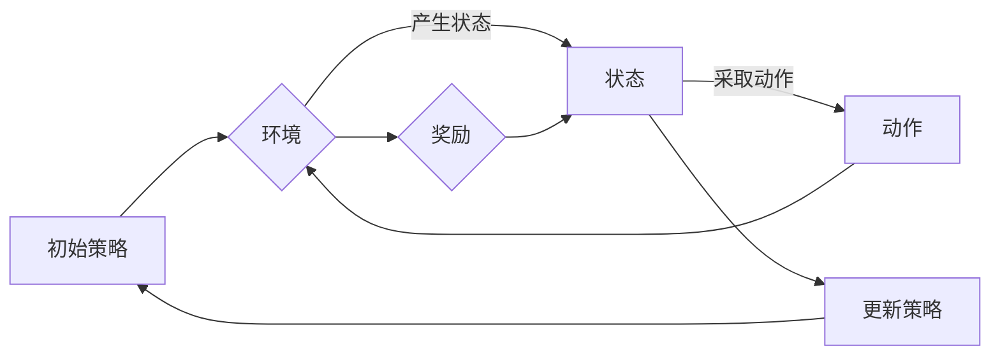

# 强化学习Reinforcement Learning中的策略梯度方法详解

> 关键词：强化学习，策略梯度，Q学习，价值函数，策略优化，Reinforcement Learning，深度学习

## 1. 背景介绍

强化学习（Reinforcement Learning，RL）是一种机器学习范式，旨在通过与环境交互来学习最优决策策略。在强化学习中，智能体（Agent）通过选择动作来与环境交互，并从环境中获取奖励。智能体的目标是通过学习，最大化其累积奖励。

策略梯度方法（Policy Gradient Methods）是强化学习中一类重要的算法，它直接优化策略函数，而不是像Q学习（Q-Learning）和价值迭代（Value Iteration）那样优化值函数。策略梯度方法在处理连续动作空间和高维状态空间时展现出强大的能力，是近年来强化学习领域的研究热点。

## 2. 核心概念与联系

### 2.1 核心概念

- **策略（Policy）**：策略定义了智能体在给定状态下采取的动作。在强化学习中，策略通常被建模为概率分布，即π(a|s)，表示在状态s下采取动作a的概率。
- **状态（State）**：状态是智能体环境的内部描述，它包含了智能体当前所处环境的所有信息。
- **动作（Action）**：动作是智能体可以采取的行动，它决定了智能体如何与环境交互。
- **奖励（Reward）**：奖励是环境对智能体采取的动作的反馈，它通常是一个实数值，用于指导智能体学习。
- **值函数（Value Function）**：值函数表示智能体在特定状态下采取特定策略所能获得的期望累积奖励。
- **策略梯度（Policy Gradient）**：策略梯度方法通过直接优化策略函数来学习最优策略。

### 2.2 Mermaid 流程图



### 2.3 核心概念联系

在策略梯度方法中，策略π(a|s)是智能体的核心，它决定了智能体如何与环境交互。智能体通过不断与环境交互，接收奖励，并根据奖励调整策略，以最大化累积奖励。

## 3. 核心算法原理 & 具体操作步骤

### 3.1 算法原理概述

策略梯度方法通过直接优化策略函数来学习最优策略。它通过估计策略梯度和最大化期望回报来更新策略参数。以下是策略梯度方法的通用公式：

$$
\theta_{t+1} = \theta_t + \alpha \nabla_{\theta_t} J(\pi(\theta_t))
$$

其中，$\theta$ 是策略参数，$J(\pi(\theta))$ 是策略的期望回报，$\alpha$ 是学习率。

### 3.2 算法步骤详解

1. **初始化策略参数**：随机初始化策略参数$\theta_0$。
2. **与环境交互**：智能体根据策略π(a|s)与环境交互，产生状态序列$S_1, S_2, ..., S_T$和动作序列$A_1, A_2, ..., A_T$。
3. **计算策略梯度**：使用反向传播算法计算策略梯度和期望回报$J(\pi(\theta_t))$。
4. **更新策略参数**：根据策略梯度和学习率$\alpha$更新策略参数$\theta_{t+1}$。
5. **重复步骤2-4**：不断与环境交互，更新策略参数，直到收敛。

### 3.3 算法优缺点

#### 优点

- **直接优化策略**：策略梯度方法直接优化策略函数，避免了值函数方法中的值函数近似问题。
- **处理连续动作空间**：策略梯度方法可以处理连续动作空间，而值函数方法通常需要将连续动作空间离散化。

#### 缺点

- **需要大量的样本**：策略梯度方法需要大量的样本来估计策略梯度，这可能会导致学习过程缓慢。
- **方差问题**：策略梯度方法容易出现方差问题，特别是在高维空间中。

### 3.4 算法应用领域

策略梯度方法在许多领域都有广泛的应用，包括：

- **机器人控制**：用于控制机器人的运动和操作。
- **游戏**：用于训练智能体在游戏中的策略，如棋类游戏、视频游戏等。
- **推荐系统**：用于优化推荐系统的策略，提高推荐质量。

## 4. 数学模型和公式 & 详细讲解 & 举例说明

### 4.1 数学模型构建

在策略梯度方法中，我们通常使用如下数学模型：

$$
J(\pi(\theta)) = \sum_{t=1}^T \gamma^{t-1} R_t
$$

其中，$R_t$ 是在时间步t收到的奖励，$\gamma$ 是折扣因子。

### 4.2 公式推导过程

策略梯度方法的公式推导基于以下两个假设：

1. 策略梯度估计公式：
$$
\nabla_{\theta} J(\pi(\theta)) \approx \frac{\partial}{\partial \theta} \sum_{t=1}^T \gamma^{t-1} R_t \approx \sum_{t=1}^T \gamma^{t-1} \nabla_{\theta} R_t
$$

2. 奖励函数的泰勒展开：
$$
R_t \approx R(s_t, a_t) + \nabla_{\theta} R(s_t, a_t)^T \Delta \theta
$$

将上述两个假设代入策略梯度估计公式中，可以得到策略梯度方法的公式。

### 4.3 案例分析与讲解

以下是一个简单的策略梯度方法案例：在一个简单的网格世界环境中，智能体需要学习走向目标位置的最优路径。

在这个案例中，智能体的策略π(a|s)定义了在状态s下采取动作a的概率。智能体在环境中移动，并从环境中获得奖励。智能体的目标是最大化累积奖励。

我们可以使用策略梯度方法来优化策略参数，以学习走向目标位置的最优路径。

## 5. 项目实践：代码实例和详细解释说明

### 5.1 开发环境搭建

为了进行策略梯度方法的实践，我们需要搭建以下开发环境：

- Python 3.x
- TensorFlow或PyTorch
- Gym（一个开源的强化学习环境）

### 5.2 源代码详细实现

以下是一个使用PyTorch实现的策略梯度方法代码实例：

```python
import torch
import torch.nn as nn
import torch.optim as optim
import gym

# 定义策略网络
class PolicyNetwork(nn.Module):
    def __init__(self, state_dim, action_dim, hidden_dim):
        super(PolicyNetwork, self).__init__()
        self.fc1 = nn.Linear(state_dim, hidden_dim)
        self.fc2 = nn.Linear(hidden_dim, hidden_dim)
        self.fc3 = nn.Linear(hidden_dim, action_dim)
        self.relu = nn.ReLU()

    def forward(self, x):
        x = self.relu(self.fc1(x))
        x = self.relu(self.fc2(x))
        return torch.softmax(self.fc3(x), dim=1)

# 初始化环境
env = gym.make('CartPole-v0')

# 初始化策略网络和优化器
state_dim = env.observation_space.shape[0]
action_dim = env.action_space.n
hidden_dim = 64
policy_net = PolicyNetwork(state_dim, action_dim, hidden_dim)
optimizer = optim.Adam(policy_net.parameters(), lr=0.01)

# 训练策略网络
def train_policy_network():
    state = env.reset()
    done = False
    total_reward = 0

    while not done:
        action = policy_net(torch.from_numpy(state).float()).argmax().item()
        next_state, reward, done, _ = env.step(action)
        total_reward += reward
        state = next_state

    return total_reward

# 训练策略网络100次
for _ in range(100):
    total_reward = train_policy_network()
    print(f"Episode {epoch+1}: Total Reward = {total_reward}")

```

### 5.3 代码解读与分析

上述代码中，我们定义了一个简单的策略网络，使用PyTorch的自动微分功能来计算策略梯度，并使用Adam优化器来优化策略网络。

### 5.4 运行结果展示

在CartPole环境中，策略梯度方法能够帮助智能体学习到走向目标位置的最优路径。

## 6. 实际应用场景

策略梯度方法在许多实际应用场景中都得到了成功的应用，以下是一些例子：

- **自动驾驶**：用于控制自动驾驶汽车在道路上的行驶。
- **机器人控制**：用于控制机器人的运动和操作。
- **游戏**：用于训练智能体在游戏中的策略，如棋类游戏、视频游戏等。
- **推荐系统**：用于优化推荐系统的策略，提高推荐质量。

## 7. 工具和资源推荐

### 7.1 学习资源推荐

- 《Reinforcement Learning: An Introduction》
- 《Reinforcement Learning: A Concise Introduction》
- 《Deep Reinforcement Learning》

### 7.2 开发工具推荐

- TensorFlow
- PyTorch
- Gym

### 7.3 相关论文推荐

- "Asynchronous Advantage Actor-Critic (A3C)"
- "Proximal Policy Optimization (PPO)"
- "Soft Actor-Critic (SAC)"

## 8. 总结：未来发展趋势与挑战

### 8.1 研究成果总结

策略梯度方法在强化学习领域取得了显著的成果，为解决复杂决策问题提供了新的思路。然而，策略梯度方法仍面临着许多挑战，如方差问题和样本效率问题。

### 8.2 未来发展趋势

未来，策略梯度方法的发展趋势可能包括：

- **提高样本效率**：通过改进采样策略和优化算法，提高策略梯度方法的样本效率。
- **降低方差**：通过设计更稳定的策略梯度估计方法，降低策略梯度方法的方差。
- **处理高维问题**：通过设计更有效的策略梯度方法，处理高维状态和动作空间。

### 8.3 面临的挑战

策略梯度方法面临的主要挑战包括：

- **样本效率**：策略梯度方法需要大量的样本来估计策略梯度。
- **方差**：策略梯度方法容易出现方差问题，特别是在高维空间中。
- **收敛性**：策略梯度方法的收敛性是一个重要的问题，需要进一步研究。

### 8.4 研究展望

未来，策略梯度方法的研究将朝着以下方向发展：

- **新的采样策略**：设计新的采样策略，提高策略梯度方法的样本效率。
- **新的优化算法**：设计新的优化算法，降低策略梯度方法的方差。
- **新的应用领域**：将策略梯度方法应用于更多的领域，如机器人控制、自动驾驶等。

## 9. 附录：常见问题与解答

**Q1：什么是策略梯度方法？**

A：策略梯度方法是强化学习中一类重要的算法，它通过直接优化策略函数来学习最优策略。

**Q2：策略梯度方法与Q学习有什么区别？**

A：策略梯度方法直接优化策略函数，而Q学习优化值函数。

**Q3：策略梯度方法适用于哪些任务？**

A：策略梯度方法适用于处理连续动作空间和高维状态空间的任务。

**Q4：如何解决策略梯度方法的方差问题？**

A：可以通过设计更稳定的策略梯度估计方法来解决策略梯度方法的方差问题。

**Q5：策略梯度方法与深度学习有什么关系？**

A：策略梯度方法通常与深度学习结合使用，使用深度神经网络来近似策略函数。

作者：禅与计算机程序设计艺术 / Zen and the Art of Computer Programming