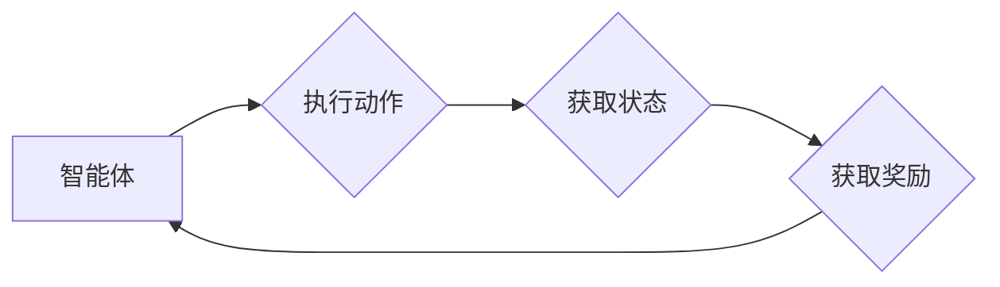

# 强化学习：在自动化制造中的应用

> 关键词：强化学习，自动化制造，机器人，优化控制，生产调度，质量控制，智能制造

## 1. 背景介绍
### 1.1 问题的由来
自动化制造是现代工业生产的重要组成部分，它通过使用自动化设备和控制系统，提高了生产效率、降低了成本，并提高了产品质量。然而，随着制造过程的复杂性不断增加，传统的自动化控制系统难以满足日益增长的需求。强化学习（Reinforcement Learning, RL）作为一种新兴的机器学习方法，通过智能体与环境交互，学习最优策略以实现目标，为自动化制造提供了新的解决方案。

### 1.2 研究现状
近年来，强化学习在自动化制造领域得到了广泛关注，并在机器人控制、生产调度、质量控制等方面取得了显著成果。研究人员和工程师们正在积极探索如何将强化学习应用于实际的制造环境中，以实现更智能、更高效的自动化制造流程。

### 1.3 研究意义
强化学习在自动化制造中的应用具有重要的研究意义：
- 提高生产效率：通过智能优化，减少生产周期，降低成本。
- 提升产品质量：通过精确控制，减少次品率，提高产品质量。
- 增强系统鲁棒性：适应环境变化，提高系统稳定性。
- 促进智能制造：推动自动化制造向智能化、自适应化的方向发展。

### 1.4 本文结构
本文将围绕强化学习在自动化制造中的应用展开讨论，内容安排如下：
- 第2章介绍强化学习的基本概念和原理。
- 第3章阐述强化学习在自动化制造中的应用场景和算法。
- 第4章通过实例分析强化学习在制造领域的应用。
- 第5章探讨强化学习在自动化制造中的未来发展趋势。
- 第6章总结全文，展望强化学习在自动化制造中的挑战和机遇。

## 2. 核心概念与联系
### 2.1 强化学习基本概念
强化学习是一种机器学习方法，通过智能体与环境交互，学习最优策略以实现目标。强化学习的主要组成部分包括：
- 智能体（Agent）：执行动作并从环境中获取奖励。
- 环境（Environment）：智能体执行动作的场所，提供状态和奖励反馈。
- 状态（State）：描述智能体在某一时刻所处的环境信息。
- 动作（Action）：智能体可以执行的行为。
- 奖励（Reward）：环境对智能体动作的反馈，用于指导智能体学习。

### 2.2 强化学习架构的 Mermaid 流程图


### 2.3 强化学习与自动化制造的联系
强化学习在自动化制造中的应用，是将强化学习的基本概念与制造过程相结合，通过智能体模拟机器人的行为，在制造环境中学习最优的生产策略。这种策略可以帮助机器人优化控制参数、生产调度方案以及质量控制标准，从而提高生产效率和产品质量。

## 3. 核心算法原理 & 具体操作步骤
### 3.1 算法原理概述
强化学习算法的核心是价值函数（Value Function）和策略（Policy）：
- 价值函数：描述智能体在给定状态下采取某个动作的预期效用。
- 策略：描述智能体在给定状态下应该采取的动作。

### 3.2 算法步骤详解
强化学习算法的步骤如下：
1. 初始化智能体、环境和奖励函数。
2. 智能体在环境中选择动作。
3. 环境根据智能体的动作提供状态和奖励反馈。
4. 智能体根据反馈更新价值函数或策略。
5. 重复步骤2-4，直至达到终止条件。

### 3.3 算法优缺点
强化学习算法的优点：
- 自主性：智能体可以根据环境反馈自主调整行为。
- 自适应性：智能体可以适应环境变化，提高系统鲁棒性。
- 可扩展性：可以将强化学习应用于各种自动化制造场景。

强化学习算法的缺点：
- 学习速度慢：需要大量的样本数据才能收敛到最优策略。
- 难以解释：强化学习算法的决策过程难以解释。

### 3.4 算法应用领域
强化学习在自动化制造中的应用领域包括：
- 机器人控制
- 生产调度
- 质量控制
- 设备维护
- 供应链管理

## 4. 数学模型和公式 & 详细讲解 & 举例说明
### 4.1 数学模型构建
强化学习中的数学模型主要包括价值函数和策略：
- 价值函数 $V(s)$：描述智能体在状态 $s$ 采取某个动作的预期效用。
- 策略 $\pi(a|s)$：描述智能体在状态 $s$ 采取动作 $a$ 的概率。

### 4.2 公式推导过程
强化学习中的核心公式为贝尔曼方程（Bellman Equation）：
$$
V(s) = \sum_{a} \pi(a|s) \cdot R(s,a) + \gamma V(s')
$$
其中，$R(s,a)$ 为状态-动作的即时奖励，$\gamma$ 为折扣因子，$V(s')$ 为智能体在状态 $s'$ 的价值函数。

### 4.3 案例分析与讲解
以下以机器人控制为例，讲解强化学习在自动化制造中的应用。

假设有一个机器人需要在一个三维空间中移动，目标是到达指定目标点。智能体可以通过调整移动方向和速度来控制机器人的运动。环境提供的状态信息包括机器人的当前位置和目标点的距离，奖励函数为到达目标点的距离的负值。

智能体通过探索和利用策略在环境中学习最优的运动轨迹。经过多次迭代，智能体最终能够找到一条最优路径，以最快的速度到达目标点。

## 5. 项目实践：代码实例和详细解释说明
### 5.1 开发环境搭建
在进行强化学习项目实践前，需要准备以下开发环境：
- 编程语言：Python
- 框架：PyTorch或TensorFlow
- 库：OpenAI Gym、Gym Env、PyTorch RL等

### 5.2 源代码详细实现
以下是一个简单的基于PyTorch RL的机器人控制案例代码：

```python
import gym
import torch
import torch.nn as nn
import torch.optim as optim
from torch.distributions import Categorical

# 创建环境
env = gym.make('CartPole-v1')

# 定义网络
class PolicyNetwork(nn.Module):
    def __init__(self, state_size, action_size):
        super(PolicyNetwork, self).__init__()
        self.fc1 = nn.Linear(state_size, 24)
        self.fc2 = nn.Linear(24, action_size)
    
    def forward(self, state):
        x = torch.relu(self.fc1(state))
        return self.fc2(x)

# 实例化网络和优化器
policy_net = PolicyNetwork(4, 2)
optimizer = optim.Adam(policy_net.parameters(), lr=0.01)

# 训练模型
for episode in range(1000):
    state = env.reset()
    done = False
    total_reward = 0
    while not done:
        state = torch.from_numpy(state).float().unsqueeze(0)
        probs = policy_net(state)
        m = Categorical(probs)
        action = m.sample()
        next_state, reward, done, _ = env.step(action.item())
        reward = torch.tensor([reward], dtype=torch.float32)
        total_reward += reward.item()
        
        # 计算梯度
        optimizer.zero_grad()
        loss = -torch.log(probs[0, action]) * reward
        loss.backward()
        optimizer.step()
        
        state = next_state
    print(f"Episode {episode}, Total Reward: {total_reward}")

env.close()
```

### 5.3 代码解读与分析
以上代码使用PyTorch和PyTorch RL库实现了一个简单的CartPole环境，并定义了一个策略网络。在训练过程中，智能体通过探索和利用策略学习最优的运动轨迹，以实现到达目标点的目标。

### 5.4 运行结果展示
运行以上代码，可以看到智能体在CartPole环境中经过多次尝试后，能够稳定地完成目标任务。

## 6. 实际应用场景
### 6.1 机器人控制
强化学习在机器人控制领域有广泛的应用，如自主导航、抓取、装配等。通过训练，机器人可以学习到适应各种环境和任务的策略。

### 6.2 生产调度
强化学习可以用于优化生产调度，如生产线平衡、设备维护等。通过学习，智能调度系统能够在满足生产要求的同时，最大化生产效率。

### 6.3 质量控制
强化学习可以用于产品质量控制，如缺陷检测、工艺参数优化等。通过学习，系统可以自动识别产品缺陷，并调整工艺参数以提高产品质量。

### 6.4 设备维护
强化学习可以用于设备维护，如故障诊断、预测性维护等。通过学习，系统可以提前预测设备故障，并进行维护，减少停机时间。

### 6.5 供应链管理
强化学习可以用于优化供应链管理，如库存管理、配送路径优化等。通过学习，系统可以降低库存成本，提高配送效率。

## 7. 工具和资源推荐
### 7.1 学习资源推荐
- 《Reinforcement Learning: An Introduction》
- 《Reinforcement Learning: Principles and Practice》
- 《Deep Reinforcement Learning》

### 7.2 开发工具推荐
- PyTorch
- TensorFlow
- OpenAI Gym
- Gym Env
- PyTorch RL

### 7.3 相关论文推荐
- Q-Learning
- Deep Q-Network
- Policy Gradient Methods
- Actor-Critic Methods
- Model-based Methods

## 8. 总结：未来发展趋势与挑战
### 8.1 研究成果总结
强化学习在自动化制造中的应用取得了显著成果，为自动化制造带来了新的发展方向。然而，仍有许多挑战需要克服。

### 8.2 未来发展趋势
未来，强化学习在自动化制造中的应用将呈现以下趋势：
- 模型复杂度降低，计算效率提高
- 策略表示和搜索方法改进，学习速度加快
- 融合更多先验知识，提高模型鲁棒性和泛化能力
- 与其他人工智能技术（如深度学习、机器学习）结合，实现更复杂的制造任务

### 8.3 面临的挑战
强化学习在自动化制造中的应用仍面临以下挑战：
- 学习效率低，需要大量的训练数据
- 模型可解释性差，难以理解决策过程
- 需要考虑实际制造环境中的约束条件，如安全性、实时性等

### 8.4 研究展望
未来，强化学习在自动化制造中的应用将朝着以下方向发展：
- 开发更高效的强化学习算法，提高学习效率
- 提高模型的可解释性和鲁棒性，满足实际应用需求
- 将强化学习与其他人工智能技术结合，实现更复杂的制造任务
- 探索强化学习在自动化制造中的伦理和安全问题

## 9. 附录：常见问题与解答
### 9.1 如何选择合适的强化学习算法？
A: 选择合适的强化学习算法需要根据具体的应用场景和需求。以下是一些选择算法的参考因素：
- 环境复杂性：对于复杂环境，可以选择模型学习方法，如深度Q网络（DQN）或策略梯度方法。
- 数据量：对于数据量较小的任务，可以选择基于模型的强化学习算法，如模型预测控制（MPC）。
- 学习效率：对于需要快速收敛的任务，可以选择策略梯度方法或近似方法，如演员-评论家方法（AC）。

### 9.2 如何解决强化学习中的样本效率问题？
A: 解决强化学习中的样本效率问题可以采取以下措施：
- 使用数据增强技术，如回放记忆、优先级回放等，增加样本多样性。
- 采用近端策略优化（Proximal Policy Optimization, PPO）等近似方法，提高学习效率。
- 使用迁移学习，利用已有的知识迁移到新的任务。

### 9.3 如何评估强化学习模型？
A: 评估强化学习模型可以从以下几个方面进行：
- 收敛速度：评估模型在训练过程中是否能够快速收敛到最优策略。
- 性能指标：评估模型在测试集上的表现，如平均奖励、成功次数等。
- 可解释性：评估模型的决策过程是否透明、易于理解。

作者：禅与计算机程序设计艺术 / Zen and the Art of Computer Programming