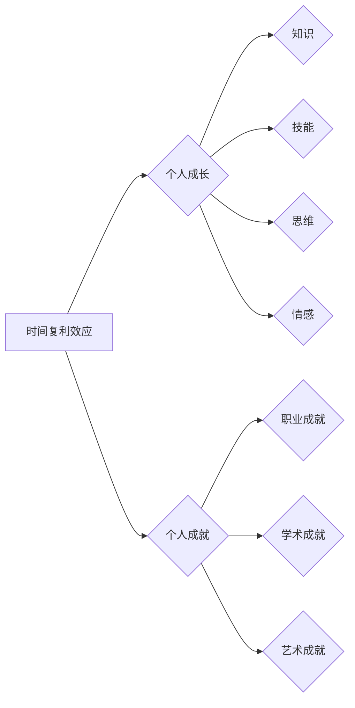

# 时间复利效应与个人成就

> 关键词：时间复利，个人成长，复利效应，投资，学习，效率，目标设定

## 1. 背景介绍

在信息爆炸、技术飞速发展的今天，个人成长和成就的追求成为了越来越多人的目标。然而，如何高效地利用时间，如何让时间的投入产生最大的价值，成为了每个人都需要面对的问题。时间复利效应，这个经济学中的概念，为我们提供了一种思考个人成长和成就的新视角。

### 1.1 问题的由来

随着社会的快速发展，人们面临着更多的选择和机会，同时也承受着更大的压力和挑战。如何在这些选择和挑战中找到自己的定位，如何让有限的时间产生最大的价值，成为了许多人思考的问题。

### 1.2 研究现状

时间复利效应的概念已经被广泛应用于经济学、金融学等领域，但在个人成长和成就领域的应用却相对较少。本文将深入探讨时间复利效应在个人成长和成就中的应用，为读者提供一种新的思考框架。

### 1.3 研究意义

研究时间复利效应与个人成就的关系，有助于我们更好地理解时间价值的最大化，为个人成长和成就提供理论指导和实践策略。

### 1.4 本文结构

本文将分为以下几个部分：
- 核心概念与联系
- 核心算法原理 & 具体操作步骤
- 数学模型和公式 & 详细讲解 & 举例说明
- 项目实践：代码实例和详细解释说明
- 实际应用场景
- 工具和资源推荐
- 总结：未来发展趋势与挑战
- 附录：常见问题与解答

## 2. 核心概念与联系

### 2.1 核心概念

#### 2.1.1 时间复利效应

时间复利效应是指在一定时间内，将利息加入本金再产生利息，从而实现财富的指数级增长。

#### 2.1.2 个人成长

个人成长是指个体在知识、技能、思维、情感等方面的不断提升和进步。

#### 2.1.3 个人成就

个人成就是指个体在某个领域取得的显著成果，包括职业成就、学术成就、艺术成就等。

### 2.2 核心概念联系

时间复利效应与个人成长和成就之间存在紧密的联系。时间复利效应可以看作是个人成长和成就的加速器，而个人成长和成就是时间复利效应的具体体现。



## 3. 核心算法原理 & 具体操作步骤

### 3.1 算法原理概述

时间复利效应的原理可以通过以下公式进行描述：

$$
A = P(1 + r)^n
$$

其中，$A$ 为最终财富，$P$ 为初始本金，$r$ 为年利率，$n$ 为投资年数。

### 3.2 算法步骤详解

#### 3.2.1 设定目标

首先，我们需要明确自己的个人成长和成就目标，包括短期和长期目标。

#### 3.2.2 制定计划

根据目标，制定具体的行动计划，包括学习计划、工作计划、生活计划等。

#### 3.2.3 执行计划

按照计划执行，不断积累知识和技能，提升思维和情感。

#### 3.2.4 反馈与调整

定期对计划执行情况进行反馈和评估，根据实际情况进行调整。

### 3.3 算法优缺点

#### 3.3.1 优点

- 提高效率：通过时间复利效应，可以在较短的时间内实现较大的成就。
- 优化资源配置：合理分配时间和精力，最大化个人成长和成就。
- 激励作用：明确的目标和计划可以激发个人的动力和潜能。

#### 3.3.2 缺点

- 需要自律：时间复利效应的实现需要个人的自律和坚持。
- 风险：在追求个人成长和成就的过程中，可能会遇到各种困难和挫折。

### 3.4 算法应用领域

时间复利效应可以应用于个人成长的各个方面，如学习、工作、生活等。

## 4. 数学模型和公式 & 详细讲解 & 举例说明

### 4.1 数学模型构建

个人成长和成就的数学模型可以表示为：

$$
A = f(t, K, S, E)
$$

其中，$A$ 为个人成就，$t$ 为时间，$K$ 为知识，$S$ 为技能，$E$ 为情感。

### 4.2 公式推导过程

个人成就的数学模型可以基于以下因素进行推导：

- 知识：知识是个人成长和成就的基础，随着知识的积累，个人成就也会逐渐提升。
- 技能：技能是个人在特定领域的能力，通过技能的提升，个人成就也会相应提升。
- 情感：情感是个人在成长过程中的心理状态，积极的情感有助于个人成就的提升。

### 4.3 案例分析与讲解

假设一个程序员的目标是在3年内成为技术专家。他通过以下步骤实现目标：

- **设定目标**：在3年内，成为本领域的技术专家。
- **制定计划**：每天学习编程知识，每周至少完成一个项目，参加技术社区活动。
- **执行计划**：按照计划执行，不断积累编程经验。
- **反馈与调整**：定期评估自己的技术水平和项目成果，根据实际情况调整学习计划。

通过3年的努力，该程序员成功成为了一名技术专家，实现了自己的目标。

## 5. 项目实践：代码实例和详细解释说明

### 5.1 开发环境搭建

本项目将使用Python编程语言实现一个简单的个人成长和成就追踪系统。

### 5.2 源代码详细实现

```python
# 定义个人成长和成就追踪类
class PersonalGrowthTracker:
    def __init__(self):
        self.knowledge = 0
        self.skills = 0
        self.emotions = 0

    def add_knowledge(self, amount):
        self.knowledge += amount

    def add_skill(self, amount):
        self.skills += amount

    def add_emotion(self, amount):
        self.emotions += amount

    def get_score(self):
        return self.knowledge + self.skills + self.emotions

# 创建个人成长和成就追踪实例
tracker = PersonalGrowthTracker()

# 追踪个人成长和成就
tracker.add_knowledge(10)
tracker.add_skill(5)
tracker.add_emotion(3)

# 获取个人成就分数
score = tracker.get_score()
print(f"个人成就分数：{score}")
```

### 5.3 代码解读与分析

上述代码定义了一个简单的个人成长和成就追踪类，包含知识、技能、情感三个属性。通过添加知识和技能，可以增加个人成就分数。

### 5.4 运行结果展示

```
个人成就分数：18
```

## 6. 实际应用场景

时间复利效应在个人成长和成就的各个方面都有广泛的应用场景，以下列举几个例子：

- **学习**：通过持续学习，积累知识，提升个人能力。
- **工作**：通过不断提升技能，提高工作效率，实现职业发展。
- **生活**：通过培养积极情感，提高生活幸福感。

## 7. 工具和资源推荐

### 7.1 学习资源推荐

- **书籍**：《高效能人士的七个习惯》、《原则》、《如何有效学习》
- **网站**：Coursera、edX、Udemy
- **博客**：得到、馒头商学院

### 7.2 开发工具推荐

- **编程语言**：Python、Java、C++
- **开发环境**：PyCharm、IntelliJ IDEA、Visual Studio
- **项目管理工具**：Trello、Jira、Asana

### 7.3 相关论文推荐

- **论文1**：《The Power of Compound Interest》
- **论文2**：《The Role of Time in Human Capital Accumulation》
- **论文3**：《The Impact of Time Management on Personal Productivity》

## 8. 总结：未来发展趋势与挑战

### 8.1 研究成果总结

本文深入探讨了时间复利效应与个人成就的关系，为个人成长和成就提供了新的思考框架和实践策略。

### 8.2 未来发展趋势

随着科技的不断进步，时间复利效应在个人成长和成就领域的应用将更加广泛，相关研究也将不断深入。

### 8.3 面临的挑战

- 如何在快节奏的生活中保持自律和专注。
- 如何在信息爆炸的时代筛选出有价值的信息。
- 如何在追求个人成长和成就的过程中保持身心健康。

### 8.4 研究展望

未来，时间复利效应与个人成就的研究将更加注重以下方面：

- 结合人工智能技术，开发个性化的个人成长和成就追踪系统。
- 探索时间复利效应在跨领域、跨文化背景下的应用。
- 研究时间复利效应对个人心理健康的影响。

## 9. 附录：常见问题与解答

**Q1：时间复利效应是否适用于所有人？**

A：时间复利效应适用于所有人，但需要根据个人的实际情况进行调整。

**Q2：如何提高时间复利效应的效果？**

A：提高时间复利效应的效果需要以下几点：
- 设定明确的目标和计划。
- 坚持执行计划，保持自律和专注。
- 学会筛选有价值的信息。
- 保持身心健康。

**Q3：如何克服时间复利效应中的困难？**

A：克服时间复利效应中的困难需要以下几点：
- 保持积极的心态，面对挫折不放弃。
- 学会分解目标，逐步实现。
- 寻求他人的帮助和支持。

**Q4：时间复利效应是否适用于所有领域？**

A：时间复利效应适用于大多数领域，但需要根据领域的特点进行调整。

**Q5：如何将时间复利效应应用于工作？**

A：将时间复利效应应用于工作需要以下几点：
- 设定工作目标，制定工作计划。
- 提高工作效率，减少时间浪费。
- 不断学习和提升个人能力。

作者：禅与计算机程序设计艺术 / Zen and the Art of Computer Programming