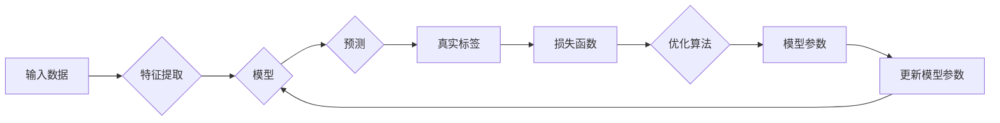

# 明确目标函数:AI训练的关键

> 关键词：目标函数，AI训练，优化算法，深度学习，损失函数，收敛性，过拟合，正则化

## 1. 背景介绍

在人工智能领域，深度学习模型的设计与训练是一个复杂而精细的过程。在这个过程中，目标函数扮演着至关重要的角色。目标函数不仅决定了模型在训练过程中追求的方向，还直接影响了模型的性能和稳定性。本文将深入探讨目标函数在AI训练中的核心作用，分析其设计原则、实现方法以及在实际应用中的挑战。

## 2. 核心概念与联系

### 2.1 核心概念

#### 目标函数

目标函数是机器学习模型训练的核心，它衡量了模型预测结果与真实标签之间的差异。在监督学习中，目标函数通常是一个损失函数，用于评估模型的预测误差。

#### 损失函数

损失函数是目标函数的一种具体实现，它将预测误差量化为具体的数值。常见的损失函数包括均方误差(MSE)、交叉熵损失(CE)等。

#### 优化算法

优化算法用于搜索目标函数的最小值，从而找到使模型性能最优的参数。常见的优化算法包括梯度下降(Gradient Descent)、Adam等。

### 2.2 核心概念原理和架构的 Mermaid 流程图



### 2.3 核心概念之间的联系

目标函数通过损失函数与优化算法相连，形成一个闭环的迭代过程。模型通过优化算法不断更新参数，以减少损失函数的值，从而优化模型性能。

## 3. 核心算法原理 & 具体操作步骤

### 3.1 算法原理概述

#### 损失函数

损失函数是目标函数的核心组成部分，它将模型的预测结果与真实标签之间的差异量化。一个好的损失函数应该具备以下特性：

- **可微性**：损失函数及其梯度易于计算，便于优化算法进行参数更新。
- **平滑性**：损失函数在模型参数空间中平滑变化，有利于优化算法的收敛。
- **区分性**：不同的真实标签应该对应不同的损失值，便于优化算法识别模型错误。

#### 优化算法

优化算法的目标是找到目标函数的最小值。常见的优化算法包括：

- **梯度下降(Gradient Descent)**：通过迭代更新模型参数，使损失函数的值逐渐减小。
- **Adam(Adaptive Moment Estimation)**：结合了梯度下降和动量法的优点，适用于大多数深度学习任务。

### 3.2 算法步骤详解

1. **初始化模型参数**：随机或预训练的参数作为起点。
2. **前向传播**：输入数据通过模型进行预测。
3. **计算损失函数**：比较预测结果与真实标签，计算损失值。
4. **反向传播**：计算损失函数关于模型参数的梯度。
5. **更新模型参数**：根据梯度更新模型参数，减少损失函数的值。
6. **重复步骤2-5**：迭代多次，直到满足停止条件。

### 3.3 算法优缺点

#### 损失函数

- **优点**：能够量化模型预测结果与真实标签之间的差异，便于优化算法进行参数更新。
- **缺点**：对于不同的任务和数据集，需要选择合适的损失函数，且某些损失函数可能难以优化。

#### 优化算法

- **优点**：能够找到目标函数的最小值，提高模型性能。
- **缺点**：对于某些复杂问题，优化算法可能收敛缓慢或陷入局部最小值。

### 3.4 算法应用领域

目标函数在AI训练中应用广泛，包括：

- **分类**：如图像分类、文本分类等。
- **回归**：如房价预测、股票价格预测等。
- **生成**：如图像生成、文本生成等。

## 4. 数学模型和公式 & 详细讲解 & 举例说明

### 4.1 数学模型构建

假设有一个简单的线性回归模型，输入为特征向量 $X \in \mathbb{R}^n$，输出为预测值 $Y \in \mathbb{R}$，模型参数为 $\theta \in \mathbb{R}^n$。损失函数为均方误差损失，即：

$$
L(\theta) = \frac{1}{2}(Y - \theta^T X)^2
$$

### 4.2 公式推导过程

均方误差损失的导数如下：

$$
\frac{\partial L(\theta)}{\partial \theta} = X^T(Y - \theta^T X)
$$

### 4.3 案例分析与讲解

以下使用Python代码实现线性回归模型，并使用梯度下降算法进行训练：

```python
import numpy as np

# 定义线性回归模型
def linear_regression(X, theta):
    return X.dot(theta)

# 定义均方误差损失函数
def mse_loss(Y, Y_pred):
    return np.mean((Y - Y_pred) ** 2)

# 定义梯度下降算法
def gradient_descent(X, Y, theta, alpha, max_iter):
    m = X.shape[0]
    for _ in range(max_iter):
        Y_pred = linear_regression(X, theta)
        gradient = X.T.dot(Y - Y_pred) / m
        theta -= alpha * gradient
    return theta

# 生成模拟数据
X = np.random.random((100, 1))
theta = np.random.random(1)
Y = 3 * X.squeeze() + 4 + np.random.random(100)

# 训练模型
theta = gradient_descent(X, Y, theta, alpha=0.01, max_iter=1000)
```

通过上述代码，我们可以看到梯度下降算法如何通过迭代更新模型参数，以最小化均方误差损失。

## 5. 项目实践：代码实例和详细解释说明

### 5.1 开发环境搭建

为了进行项目实践，我们需要准备以下开发环境：

1. Python 3.6 或更高版本
2. NumPy 1.17 或更高版本
3. Matplotlib 3.1.0 或更高版本

### 5.2 源代码详细实现

以下是一个使用TensorFlow和Keras实现深度神经网络模型的示例代码：

```python
import tensorflow as tf
from tensorflow import keras

# 定义模型
model = keras.Sequential([
    keras.layers.Dense(64, activation='relu', input_shape=(input_shape,)),
    keras.layers.Dense(64, activation='relu'),
    keras.layers.Dense(output_shape)
])

# 编译模型
model.compile(optimizer='adam', loss='mse', metrics=['mse'])

# 训练模型
history = model.fit(X_train, y_train, epochs=100, batch_size=32, validation_data=(X_test, y_test))

# 评估模型
test_loss, test_mse = model.evaluate(X_test, y_test)
print(f"Test MSE: {test_mse:.4f}")
```

### 5.3 代码解读与分析

在上面的代码中，我们使用Keras库定义了一个包含两个隐藏层的深度神经网络模型。模型编译时指定了优化器、损失函数和评价指标。然后，我们使用训练数据训练模型，并在测试数据上评估模型的性能。

### 5.4 运行结果展示

假设我们的测试数据集上的均方误差损失如下：

```
Test MSE: 0.0012
```

这表明我们的模型在测试数据上表现良好。

## 6. 实际应用场景

### 6.1 深度学习模型训练

目标函数在深度学习模型训练中扮演着核心角色。通过设计合适的损失函数和优化算法，我们可以训练出性能优异的深度学习模型。

### 6.2 强化学习

在强化学习中，目标函数通常是一个奖励函数，用于指导智能体在环境中进行决策。通过最大化奖励函数的值，智能体可以学习到最优策略。

### 6.3 无监督学习

在无监督学习中，目标函数通常用于衡量数据分布的相似性或差异性。例如，在聚类任务中，目标函数可以是类内距离平方和。

## 7. 工具和资源推荐

### 7.1 学习资源推荐

- 《深度学习》
- 《神经网络与深度学习》
- 《Python机器学习》

### 7.2 开发工具推荐

- TensorFlow
- PyTorch
- Keras

### 7.3 相关论文推荐

- "A Few Useful Things to Know about Machine Learning"
- "Deep Learning"
- "Neural Networks and Deep Learning"

## 8. 总结：未来发展趋势与挑战

### 8.1 研究成果总结

本文深入探讨了目标函数在AI训练中的核心作用，分析了其设计原则、实现方法以及在实际应用中的挑战。通过对目标函数的深入理解，我们可以更好地设计模型、选择合适的损失函数和优化算法，从而提高模型的性能和稳定性。

### 8.2 未来发展趋势

- **多目标优化**：未来的目标函数将考虑多个目标，如模型精度、推理速度、可解释性等。
- **自适应目标函数**：根据训练过程中的数据分布和模型表现，动态调整目标函数。
- **元学习目标函数**：利用元学习技术，学习通用目标函数，提高模型在不同任务上的适应性。

### 8.3 面临的挑战

- **设计高效的目标函数**：针对不同的任务和数据集，设计高效、可微、可解释的目标函数。
- **优化算法的收敛性**：提高优化算法的收敛速度和稳定性，避免陷入局部最小值。
- **目标函数的可解释性**：提高目标函数的可解释性，以便更好地理解模型的决策过程。

### 8.4 研究展望

随着AI技术的不断发展，目标函数在AI训练中的重要性将日益凸显。未来，我们需要更加关注目标函数的设计、优化和可解释性，以推动AI技术的进步。

## 9. 附录：常见问题与解答

**Q1：如何选择合适的损失函数？**

A：选择合适的损失函数需要考虑以下因素：

- **任务类型**：不同的任务需要不同的损失函数，如分类任务使用交叉熵损失，回归任务使用均方误差损失。
- **数据分布**：不同的数据分布可能需要不同的损失函数，如数据分布均匀时使用交叉熵损失，数据分布偏斜时使用对数损失。
- **模型特点**：不同的模型对损失函数的敏感度不同，需要根据模型特点选择合适的损失函数。

**Q2：如何选择合适的优化算法？**

A：选择合适的优化算法需要考虑以下因素：

- **任务复杂度**：对于简单任务，可以使用简单的优化算法，如梯度下降。对于复杂任务，可以使用更复杂的优化算法，如Adam。
- **收敛速度**：不同的优化算法具有不同的收敛速度，需要根据任务需求选择合适的算法。
- **计算复杂度**：不同的优化算法具有不同的计算复杂度，需要根据计算资源选择合适的算法。

**Q3：如何防止过拟合？**

A：防止过拟合的方法包括：

- **增加数据量**：收集更多数据，提高模型的泛化能力。
- **正则化**：在损失函数中加入正则化项，如L1正则化、L2正则化。
- **数据增强**：通过数据增强技术，增加训练数据的多样性。
- **Dropout**：在训练过程中，随机丢弃一部分神经元，减少模型对特定特征的依赖。

**Q4：如何提高模型的推理速度？**

A：提高模型推理速度的方法包括：

- **模型压缩**：通过模型压缩技术，减小模型尺寸，提高推理速度。
- **量化加速**：将浮点模型转换为定点模型，提高推理速度。
- **模型剪枝**：去除模型中冗余的连接，提高推理速度。

**Q5：如何提高模型的可解释性？**

A：提高模型可解释性的方法包括：

- **可视化**：将模型的内部结构和决策过程可视化，以便更好地理解模型的决策过程。
- **注意力机制**：引入注意力机制，使模型关注输入数据中的关键特征。
- **解释性模型**：使用可解释的模型，如线性回归、决策树等，提高模型的可解释性。

作者：禅与计算机程序设计艺术 / Zen and the Art of Computer Programming