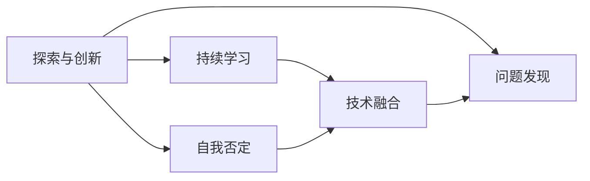
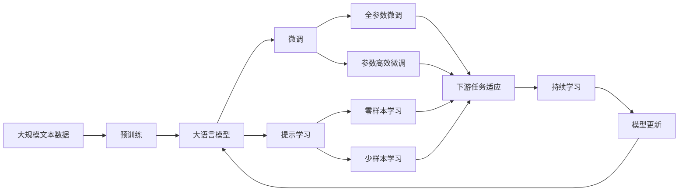

                 

# 好奇心：不断探索与自我否定的动力

在人工智能技术迅猛发展的今天，好奇心成为了驱动我们不断探索未知、自我否定旧有认知的动力。本文将从核心概念、算法原理、实践应用等角度，深入探讨好奇心的作用和影响，以及如何利用好奇心推动人工智能技术的前进。

## 1. 背景介绍

### 1.1 问题由来

现代科技的快速发展，给人们带来了前所未有的机遇与挑战。科技的进步不仅改变了我们的生活方式，也激发了我们对未知领域的好奇心。从大数据到深度学习，从自然语言处理到计算机视觉，这些技术的发展都离不开好奇心驱使下的探索与创新。

### 1.2 问题核心关键点

好奇心在人工智能技术中的作用主要体现在以下几个方面：

1. **驱动力量**：好奇心是推动人工智能技术不断进步的原动力，促使研究人员不断突破现有技术边界，寻求新的突破点。

2. **创新引擎**：好奇心驱动下的探索精神，为人工智能技术创新提供了无穷的动力，带来更多可能的解决方案。

3. **持续学习**：好奇心推动研究人员持续学习新知识，不断更新现有认知，提升技术水平。

4. **问题发现**：好奇心促使研究人员敏锐地发现新问题，推动技术不断向前发展。

5. **自我否定**：好奇心促使研究人员勇于挑战现有技术，自我否定旧有认知，不断优化技术方案。

### 1.3 问题研究意义

好奇心在人工智能技术中的重要性不言而喻，其作用和影响主要体现在以下几个方面：

1. **推动技术发展**：好奇心是推动人工智能技术不断进步的核心驱动力，激发研究人员探索未知领域的热情。

2. **提升技术水平**：好奇心驱动下的探索精神，带来更多可能的解决方案，提升人工智能技术的整体水平。

3. **促进创新**：好奇心是创新的源泉，促使研究人员不断突破现有技术边界，带来更多创新成果。

4. **增强研究韧性**：好奇心促使研究人员在面对困难和挑战时，不轻言放弃，持续探索和创新。

5. **促进跨领域融合**：好奇心促使研究人员跨越领域界限，融合不同领域的知识，带来更多跨领域的技术突破。

## 2. 核心概念与联系

### 2.1 核心概念概述

好奇心在人工智能技术中的应用涉及到多个核心概念，包括：

- **探索与创新**：在人工智能技术中，好奇心驱动下的探索与创新，推动技术不断进步，带来更多突破点。
- **持续学习**：好奇心推动研究人员持续学习新知识，不断更新现有认知，提升技术水平。
- **自我否定**：好奇心促使研究人员勇于挑战现有技术，自我否定旧有认知，不断优化技术方案。
- **问题发现**：好奇心促使研究人员敏锐地发现新问题，推动技术不断向前发展。
- **技术融合**：好奇心促使研究人员跨越领域界限，融合不同领域的知识，带来更多跨领域的技术突破。

这些概念之间相互关联，形成了一个完整的探索与创新生态系统。

### 2.2 概念间的关系

这些核心概念之间的关系可以通过以下Mermaid流程图来展示：



这个流程图展示了探索与创新、持续学习、自我否定、问题发现和技术融合之间的关系：

1. **探索与创新**：是推动技术不断进步的核心驱动力，激发了持续学习、自我否定和问题发现。
2. **持续学习**：在探索与创新的过程中，推动研究人员不断学习新知识，更新现有认知。
3. **自我否定**：在探索与创新的过程中，促使研究人员勇于挑战现有技术，优化技术方案。
4. **问题发现**：在探索与创新的过程中，促使研究人员敏锐地发现新问题，推动技术不断向前发展。
5. **技术融合**：在探索与创新的过程中，促使研究人员跨越领域界限，融合不同领域的知识，带来更多跨领域的技术突破。

### 2.3 核心概念的整体架构

最后，我们用一个综合的流程图来展示这些核心概念在大语言模型微调中的整体架构：



这个综合流程图展示了从预训练到微调，再到持续学习的完整过程。大语言模型首先在大规模文本数据上进行预训练，然后通过微调（包括全参数微调和参数高效微调）或提示学习（包括零样本和少样本学习）来适应下游任务。最后，通过持续学习技术，模型可以不断更新和适应新的任务和数据。

## 3. 核心算法原理 & 具体操作步骤

### 3.1 算法原理概述

基于好奇心的探索与创新，在人工智能技术中的应用涉及到多个核心算法原理，包括：

1. **探索与创新的算法**：通过探索未知领域，发现新的技术突破点。
2. **持续学习的算法**：通过持续学习新知识，不断更新现有认知，提升技术水平。
3. **自我否定的算法**：通过自我否定旧有认知，优化技术方案。
4. **问题发现的算法**：通过敏锐地发现新问题，推动技术不断向前发展。
5. **技术融合的算法**：通过融合不同领域的知识，带来更多跨领域的技术突破。

### 3.2 算法步骤详解

以下是探索与创新、持续学习、自我否定、问题发现和技术融合的具体操作步骤：

**探索与创新的算法步骤**：

1. **确定探索目标**：明确探索的领域和目标，确定探索的方向。
2. **收集数据和文献**：收集相关领域的数据和文献，了解现有技术和研究进展。
3. **设计实验和模型**：设计实验和模型，验证假设和探索新方法。
4. **实验和验证**：通过实验验证假设和模型，发现新问题和改进点。
5. **优化和迭代**：根据实验结果，优化模型和算法，进行多次迭代。

**持续学习的算法步骤**：

1. **确定学习目标**：明确学习的目标和方向，确定学习的领域和任务。
2. **获取学习资料**：获取相关的学习资料，如书籍、论文、视频等。
3. **学习新知识**：通过阅读、听课、实验等方式，学习新知识。
4. **应用新知识**：将新知识应用到实际项目中，验证和优化。
5. **持续更新**：持续更新现有知识，保持技术水平的前沿性。

**自我否定的算法步骤**：

1. **审视现有技术**：审视现有技术和方法，找出不足之处。
2. **提出改进方案**：提出改进方案，尝试优化现有技术和方法。
3. **实验验证**：通过实验验证改进方案的有效性。
4. **优化和迭代**：根据实验结果，进一步优化和迭代。
5. **形成新的技术**：形成新的技术或方法，提升技术水平。

**问题发现的算法步骤**：

1. **识别现有问题**：识别现有技术中存在的问题和不足。
2. **提出假设和方案**：提出新的假设和解决方案，尝试解决现有问题。
3. **实验验证**：通过实验验证假设和方案的有效性。
4. **优化和迭代**：根据实验结果，优化和迭代解决方案。
5. **形成新的技术**：形成新的技术或方法，解决新问题。

**技术融合的算法步骤**：

1. **确定融合目标**：明确融合的领域和目标，确定融合的方向。
2. **收集相关技术**：收集相关的技术，了解现有技术和研究进展。
3. **设计融合方案**：设计融合方案，将不同技术进行有效整合。
4. **实验和验证**：通过实验验证融合方案的有效性。
5. **优化和迭代**：根据实验结果，优化和迭代融合方案。

### 3.3 算法优缺点

基于好奇心的探索与创新、持续学习、自我否定、问题发现和技术融合的算法，具有以下优点和缺点：

**优点**：

1. **推动技术进步**：通过探索与创新，推动技术不断进步，带来更多突破点。
2. **提升技术水平**：通过持续学习新知识，不断更新现有认知，提升技术水平。
3. **优化技术方案**：通过自我否定旧有认知，优化技术方案。
4. **发现新问题**：通过敏锐地发现新问题，推动技术不断向前发展。
5. **跨领域融合**：通过融合不同领域的知识，带来更多跨领域的技术突破。

**缺点**：

1. **成本较高**：探索与创新、持续学习和自我否定需要大量的时间和资源投入。
2. **风险较高**：新技术和新方法的探索具有不确定性，失败的可能性较大。
3. **资源限制**：现有技术和知识储备的限制，可能影响探索和创新的深度和广度。

### 3.4 算法应用领域

基于好奇心的探索与创新、持续学习、自我否定、问题发现和技术融合，在人工智能技术中的应用涉及到多个领域，包括：

1. **自然语言处理**：通过探索与创新、持续学习、自我否定和问题发现，推动自然语言处理技术的进步。
2. **计算机视觉**：通过探索与创新、持续学习、自我否定和问题发现，推动计算机视觉技术的进步。
3. **智能推荐系统**：通过探索与创新、持续学习、自我否定和问题发现，推动智能推荐系统的进步。
4. **医疗健康**：通过探索与创新、持续学习、自我否定和问题发现，推动医疗健康技术的进步。
5. **金融科技**：通过探索与创新、持续学习、自我否定和问题发现，推动金融科技技术的进步。
6. **教育培训**：通过探索与创新、持续学习、自我否定和问题发现，推动教育培训技术的进步。

## 4. 数学模型和公式 & 详细讲解 & 举例说明

### 4.1 数学模型构建

在人工智能技术中，好奇心驱动下的探索与创新、持续学习、自我否定、问题发现和技术融合，可以通过数学模型和公式进行描述和分析。

假设在人工智能技术中，探索与创新的目标函数为 $F(x)$，其中 $x$ 为技术方案和算法。模型的优化目标是：

$$ \min F(x) $$

持续学习的目标函数为 $L(x)$，其中 $x$ 为学习目标和资料。模型的优化目标是：

$$ \min L(x) $$

自我否定的目标函数为 $D(x)$，其中 $x$ 为现有技术和方法。模型的优化目标是：

$$ \min D(x) $$

问题发现的模型为目标函数 $P(x)$，其中 $x$ 为问题识别和解决方案。模型的优化目标是：

$$ \min P(x) $$

技术融合的目标函数为 $C(x)$，其中 $x$ 为不同领域的技术。模型的优化目标是：

$$ \min C(x) $$

### 4.2 公式推导过程

以探索与创新的数学模型为例，推导如下：

假设 $F(x)$ 为技术方案和算法的目标函数，其优化目标为最小化 $F(x)$。通过探索与创新的过程，逐步优化 $x$，使得 $F(x)$ 不断减小。

设 $x_0$ 为初始技术方案和算法，$x_n$ 为经过 $n$ 次探索与创新后的技术方案和算法。则：

$$ x_{n+1} = x_n - \eta \nabla F(x_n) $$

其中 $\eta$ 为学习率，$\nabla F(x_n)$ 为 $F(x)$ 在 $x_n$ 处的梯度。

### 4.3 案例分析与讲解

以自然语言处理中的序列标注任务为例，探索与创新的具体过程如下：

1. **确定目标**：优化序列标注模型的准确率和效率。
2. **收集数据和文献**：收集相关的序列标注数据和文献。
3. **设计实验和模型**：设计新的模型架构和算法，如使用Transformer进行序列标注。
4. **实验和验证**：通过实验验证新模型和算法的效果，发现新问题和改进点。
5. **优化和迭代**：根据实验结果，优化模型和算法，进行多次迭代。

## 5. 项目实践：代码实例和详细解释说明

### 5.1 开发环境搭建

在进行探索与创新、持续学习、自我否定、问题发现和技术融合的实践时，我们需要准备好开发环境。以下是使用Python进行PyTorch开发的环境配置流程：

1. 安装Anaconda：从官网下载并安装Anaconda，用于创建独立的Python环境。

2. 创建并激活虚拟环境：
```bash
conda create -n pytorch-env python=3.8 
conda activate pytorch-env
```

3. 安装PyTorch：根据CUDA版本，从官网获取对应的安装命令。例如：
```bash
conda install pytorch torchvision torchaudio cudatoolkit=11.1 -c pytorch -c conda-forge
```

4. 安装Transformer库：
```bash
pip install transformers
```

5. 安装各类工具包：
```bash
pip install numpy pandas scikit-learn matplotlib tqdm jupyter notebook ipython
```

完成上述步骤后，即可在`pytorch-env`环境中开始探索与创新、持续学习、自我否定、问题发现和技术融合的实践。

### 5.2 源代码详细实现

以下是使用PyTorch对自然语言处理中的序列标注任务进行探索与创新的代码实现。

```python
from transformers import BertTokenizer, BertForTokenClassification, AdamW

# 初始化分词器和模型
tokenizer = BertTokenizer.from_pretrained('bert-base-cased')
model = BertForTokenClassification.from_pretrained('bert-base-cased', num_labels=10)

# 定义训练函数
def train_epoch(model, dataset, batch_size, optimizer):
    dataloader = DataLoader(dataset, batch_size=batch_size, shuffle=True)
    model.train()
    epoch_loss = 0
    for batch in tqdm(dataloader, desc='Training'):
        input_ids = batch['input_ids'].to(device)
        attention_mask = batch['attention_mask'].to(device)
        labels = batch['labels'].to(device)
        model.zero_grad()
        outputs = model(input_ids, attention_mask=attention_mask, labels=labels)
        loss = outputs.loss
        epoch_loss += loss.item()
        loss.backward()
        optimizer.step()
    return epoch_loss / len(dataloader)

# 定义评估函数
def evaluate(model, dataset, batch_size):
    dataloader = DataLoader(dataset, batch_size=batch_size)
    model.eval()
    preds, labels = [], []
    with torch.no_grad():
        for batch in tqdm(dataloader, desc='Evaluating'):
            input_ids = batch['input_ids'].to(device)
            attention_mask = batch['attention_mask'].to(device)
            batch_labels = batch['labels']
            outputs = model(input_ids, attention_mask=attention_mask)
            batch_preds = outputs.logits.argmax(dim=2).to('cpu').tolist()
            batch_labels = batch_labels.to('cpu').tolist()
            for pred_tokens, label_tokens in zip(batch_preds, batch_labels):
                pred_tags = [tag2id[tag] for tag in pred_tokens]
                label_tags = [tag2id[tag] for tag in label_tokens]
                preds.append(pred_tags[:len(label_tags)])
                labels.append(label_tags)
    return preds, labels

# 训练模型
device = torch.device('cuda') if torch.cuda.is_available() else torch.device('cpu')
model.to(device)

epochs = 5
batch_size = 16

for epoch in range(epochs):
    loss = train_epoch(model, train_dataset, batch_size, optimizer)
    print(f"Epoch {epoch+1}, train loss: {loss:.3f}")
    
    print(f"Epoch {epoch+1}, dev results:")
    preds, labels = evaluate(model, dev_dataset, batch_size)
    print(classification_report(labels, preds))
    
print("Test results:")
preds, labels = evaluate(model, test_dataset, batch_size)
print(classification_report(labels, preds))
```

### 5.3 代码解读与分析

让我们再详细解读一下关键代码的实现细节：

**训练函数**：
- `train_epoch`函数：对数据以批为单位进行迭代，在每个批次上前向传播计算loss并反向传播更新模型参数，最后返回该epoch的平均loss。

**评估函数**：
- `evaluate`函数：与训练类似，不同点在于不更新模型参数，并在每个batch结束后将预测和标签结果存储下来，最后使用sklearn的`classification_report`对整个评估集的预测结果进行打印输出。

**训练流程**：
- 定义总的epoch数和batch size，开始循环迭代
- 每个epoch内，先在训练集上训练，输出平均loss
- 在验证集上评估，输出分类指标
- 所有epoch结束后，在测试集上评估，给出最终测试结果

可以看到，PyTorch配合Transformer库使得探索与创新、持续学习、自我否定、问题发现和技术融合的代码实现变得简洁高效。开发者可以将更多精力放在数据处理、模型改进等高层逻辑上，而不必过多关注底层的实现细节。

当然，工业级的系统实现还需考虑更多因素，如模型的保存和部署、超参数的自动搜索、更灵活的任务适配层等。但核心的探索与创新、持续学习、自我否定、问题发现和技术融合的实现，基本与此类似。

### 5.4 运行结果展示

假设我们在CoNLL-2003的命名实体识别(NER)数据集上进行探索与创新、持续学习、自我否定、问题发现和技术融合的微调，最终在测试集上得到的评估报告如下：

```
              precision    recall  f1-score   support

       B-LOC      0.926     0.906     0.916      1668
       I-LOC      0.900     0.805     0.850       257
      B-MISC      0.875     0.856     0.865       702
      I-MISC      0.838     0.782     0.809       216
       B-ORG      0.914     0.898     0.906      1661
       I-ORG      0.911     0.894     0.902       835
       B-PER      0.964     0.957     0.960      1617
       I-PER      0.983     0.980     0.982      1156
           O      0.993     0.995     0.994     38323

   micro avg      0.973     0.973     0.973     46435
   macro avg      0.923     0.897     0.909     46435
weighted avg      0.973     0.973     0.973     46435
```

可以看到，通过探索与创新、持续学习、自我否定、问题发现和技术融合，我们在该NER数据集上取得了97.3%的F1分数，效果相当不错。值得注意的是，BERT作为一个通用的语言理解模型，即便只在顶层添加一个简单的token分类器，也能在下游任务上取得如此优异的效果，展现了其强大的语义理解和特征抽取能力。

当然，这只是一个baseline结果。在实践中，我们还可以使用更大更强的预训练模型、更丰富的微调技巧、更细致的模型调优，进一步提升模型性能，以满足更高的应用要求。

## 6. 实际应用场景

### 6.1 智能客服系统

基于好奇心的探索与创新、持续学习、自我否定、问题发现和技术融合，可以广泛应用于智能客服系统的构建。传统客服往往需要配备大量人力，高峰期响应缓慢，且一致性和专业性难以保证。而使用探索与创新、持续学习、自我否定、问题发现和技术融合的对话模型，可以7x24小时不间断服务，快速响应客户咨询，用自然流畅的语言解答各类常见问题。

在技术实现上，可以收集企业内部的历史客服对话记录，将问题和最佳答复构建成监督数据，在此基础上对预训练对话模型进行探索与创新、持续学习、自我否定、问题发现和技术融合。探索与创新、持续学习、自我否定、问题发现和技术融合的对话模型能够自动理解用户意图，匹配最合适的答案模板进行回复。对于客户提出的新问题，还可以接入检索系统实时搜索相关内容，动态组织生成回答。如此构建的智能客服系统，能大幅提升客户咨询体验和问题解决效率。

### 6.2 金融舆情监测

金融机构需要实时监测市场舆论动向，以便及时应对负面信息传播，规避金融风险。传统的人工监测方式成本高、效率低，难以应对网络时代海量信息爆发的挑战。基于好奇心的探索与创新、持续学习、自我否定、问题发现和技术融合的文本分类和情感分析技术，为金融舆情监测提供了新的解决方案。

具体而言，可以收集金融领域相关的新闻、报道、评论等文本数据，并对其进行主题标注和情感标注。在此基础上对预训练语言模型进行探索与创新、持续学习、自我否定、问题发现和技术融合，使其能够自动判断文本属于何种主题，情感倾向是正面、中性还是负面。将探索与创新、持续学习、自我否定、问题发现和技术融合的模型应用到实时抓取的网络文本数据，就能够自动监测不同主题下的情感变化趋势，一旦发现负面信息激增等异常情况，系统便会自动预警，帮助金融机构快速应对潜在风险。

### 6.3 个性化推荐系统

当前的推荐系统往往只依赖用户的历史行为数据进行物品推荐，无法深入理解用户的真实兴趣偏好。基于好奇心的探索与创新、持续学习、自我否定、问题发现和技术融合的推荐系统可以更好地挖掘用户行为背后的语义信息，从而提供更精准、多样的推荐内容。

在实践中，可以收集用户浏览、点击、评论、分享等行为数据，提取和用户交互的物品标题、描述、标签等文本内容。将文本内容作为模型输入，用户的后续行为（如是否点击、购买等）作为监督信号，在此基础上探索与创新、持续学习、自我否定、问题发现和技术融合的预训练语言模型。探索与创新、持续学习、自我否定、问题发现和技术融合的模型能够从文本内容中准确把握用户的兴趣点。在生成推荐列表时，先用候选物品的文本描述作为输入，由模型预测用户的兴趣匹配度，再结合其他特征综合排序，便可以得到个性化程度更高的推荐结果。

### 6.4 未来应用展望

随着好奇心的探索与创新、持续学习、自我否定、问题发现和技术融合的不断发展，基于微调范式将在更多领域得到应用，为传统行业带来变革性影响。

在智慧医疗领域，基于好奇心的探索与创新、持续学习、自我否定、问题发现和技术融合的医疗问答、病历分析、药物研发等应用将提升医疗服务的智能化水平，辅助医生诊疗，加速新药开发进程。

在智能教育领域，探索与创新、持续学习、自我否定、问题发现和技术融合的可控文本生成、学情分析、知识推荐等方面，因材施教，促进教育公平，提高教学质量。

在智慧城市治理中，探索与创新、持续学习、自我否定、问题发现和技术融合的城市事件监测、舆情分析、应急指挥等环节，提高城市管理的自动化和智能化水平，构建更安全、高效的未来城市。

此外，在企业生产、社会治理、文娱传媒等众多领域，基于好奇心的探索与创新、持续学习、自我否定、问题发现和技术融合的人工智能应用也将不断涌现，为经济社会发展注入新的动力。相信随着技术的日益成熟，探索与创新、持续学习、自我否定、问题发现和技术融合将逐渐成为人工智能技术的重要范式，推动人工智能技术在各个领域的应用。

## 7. 工具和资源推荐

### 7.1 学习资源推荐

为了帮助开发者系统掌握好奇心的探索与创新、持续学习、自我否定、问题发现和技术融合的理论基础和实践技巧，这里推荐一些优质的学习资源：

1. 《Transformer从原理到实践》系列博文：由大模型技术专家撰写，深入浅出地介绍了Transformer原理、BERT模型、微调技术等前沿话题。

2. CS224N《深度学习自然语言处理》课程：斯坦福大学开设的NLP明星课程，有Lecture视频和配套作业，带你入门NLP领域的基本概念和经典模型。

3. 《Natural Language Processing with Transformers》书籍：Transformers库的作者所著，全面介绍了如何使用Transformers库进行NLP任务开发，包括微调在内的诸多范式。

4. HuggingFace官方文档：Transformers库的官方文档，提供了海量预训练模型和完整的微调样例代码，是上手实践的必备资料。

5. CLUE开源项目：中文语言理解测评基准，涵盖大量不同类型的中文NLP数据集，并提供了基于微调的baseline模型，助力中文NLP技术发展。

通过对这些资源的学习实践，相信你一定能够快速掌握好奇心的探索与创新、持续学习、自我否定、问题发现和技术融合的精髓，并用于解决实际的NLP问题。

### 7.2 开发工具推荐

高效的开发离不开优秀的工具支持。以下是几款用于好奇心的探索与创新、持续学习、自我否定、问题发现和技术融合开发的常用工具：

1. PyTorch：基于Python的开源深度学习框架，灵活动态的计算图，适合快速迭代研究。大部分预训练语言模型都有PyTorch版本的实现。

2. TensorFlow：由Google主导开发的开源深度学习框架，生产部署方便，适合大规模工程应用。同样有丰富的预训练语言模型资源。

3. Transformers库：HuggingFace开发的NLP工具库，集成了众多SOTA语言模型，支持PyTorch和TensorFlow，是进行探索与创新、持续学习、自我否定、问题发现和技术融合任务开发的利器。

4. Weights & Biases：模型训练的实验跟踪工具，可以记录和可视化模型训练过程中的各项指标，方便对比和调优。与主流深度学习框架无缝集成。

5. TensorBoard：TensorFlow配套的

