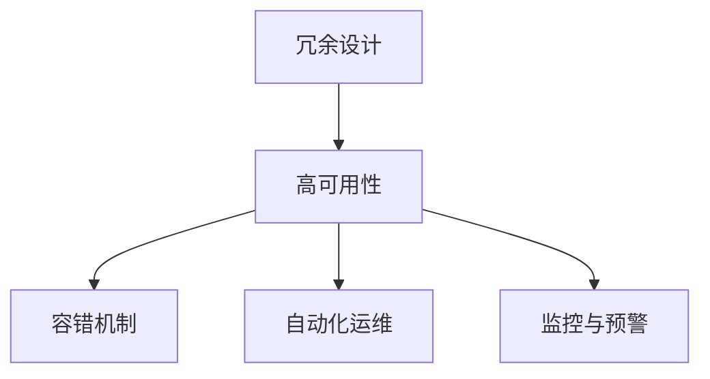
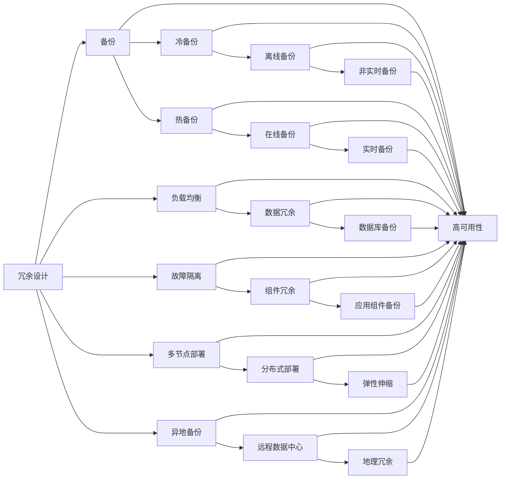
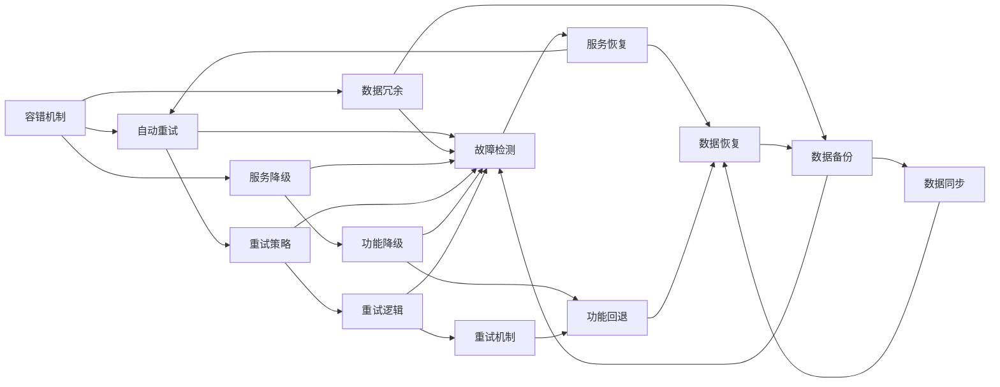
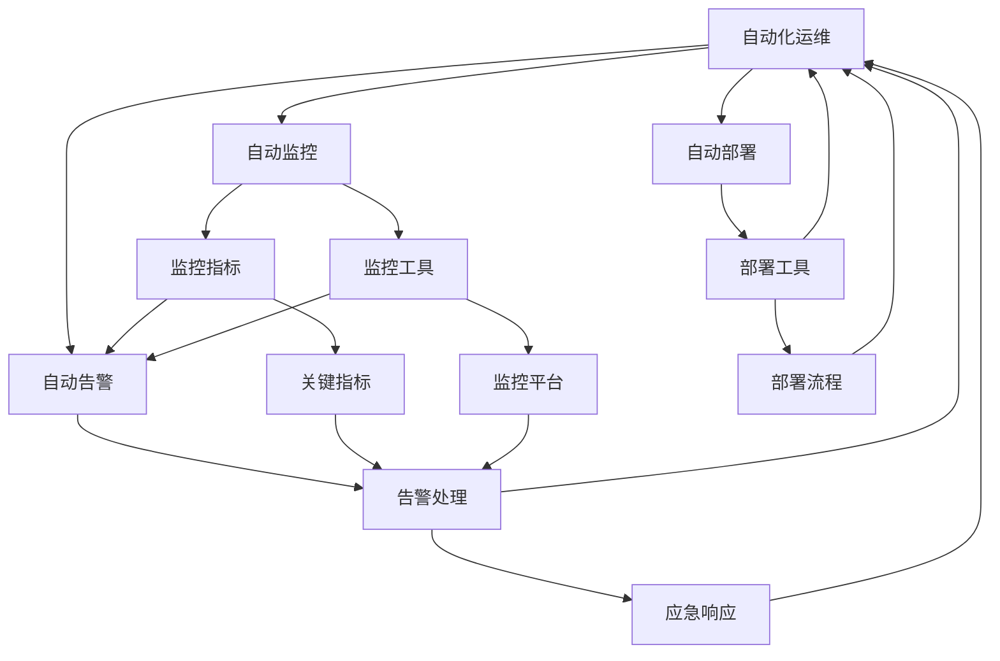
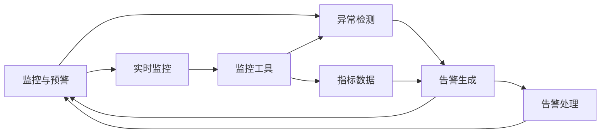
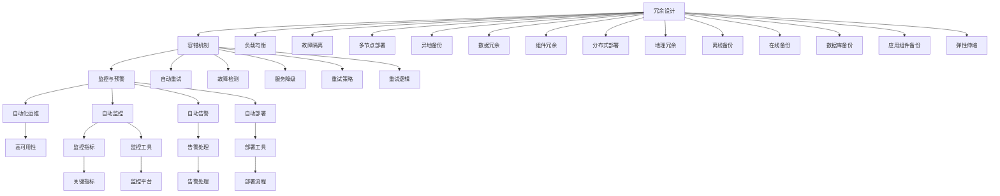

                 

# 实现99.99%正常运行时间的方法

> 关键词：
- 高可用性
- 正常运行时间
- 故障容忍
- 冗余设计
- 容错机制

## 1. 背景介绍

### 1.1 问题由来
在信息技术的发展过程中，系统的正常运行时间（uptime）一直是衡量系统可靠性的一个关键指标。正常运行时间通常表示为系统在一年内不中断运行的时间，单位为“9”，如“3个9”表示系统一年内至少有99.9%的时间处于正常运行状态。

然而，即使在拥有最先进技术的今天，任何系统都难以避免出现故障。软件故障、硬件故障、网络故障等都可能导致系统宕机。系统宕机不仅影响用户体验，还可能导致经济损失和声誉损失。

因此，如何在保证高性能的前提下，实现99.99%的正常运行时间，成为系统设计和运维中的一个重大挑战。本文将围绕这一主题展开，探讨如何通过冗余设计、容错机制、自动化运维等方法，提升系统的正常运行时间，降低宕机风险。

### 1.2 问题核心关键点
实现99.99%正常运行时间的方法涉及多个关键点，包括：
- 冗余设计：通过增加资源和系统的冗余性，确保某个部分故障时，其他部分仍能正常运行。
- 容错机制：在系统发生故障时，通过自动重试、数据备份、服务降级等手段，尽可能减少系统宕机时间。
- 自动化运维：使用自动化工具和流程，降低人工运维的错误率，提高系统的稳定性和可靠性。
- 监控与预警：通过实时监控系统状态，及早发现异常，快速响应，减少故障时间。

这些关键点相互支撑，共同构建起99.99%正常运行时间的系统架构。下面，我们将逐一详细介绍这些关键点。

## 2. 核心概念与联系

### 2.1 核心概念概述

为更好地理解实现99.99%正常运行时间的方法，我们先介绍几个核心概念：

- 高可用性：指系统在出现故障时，能够快速恢复，尽可能保证用户的服务体验不受影响。
- 正常运行时间（uptime）：系统在一年内正常运行的时间比例，通常以9的倍数表示。
- 冗余设计：通过增加系统的资源和组件，使系统在某个部分故障时，其他部分仍能正常运行。
- 容错机制：在系统发生故障时，能够自动检测并恢复，减少宕机时间。
- 自动化运维：通过自动化工具和流程，降低人工运维的错误率，提高系统的稳定性和可靠性。
- 监控与预警：通过实时监控系统状态，及早发现异常，快速响应，减少故障时间。

这些概念之间的关系可以通过以下Mermaid流程图来展示：



这个流程图展示了冗余设计、容错机制、自动化运维、监控与预警等概念之间的关系。冗余设计和高可用性是基础，容错机制、自动化运维和监控与预警是保障，通过这些手段，系统能够实现99.99%的正常运行时间。

### 2.2 概念间的关系

这些核心概念之间存在着紧密的联系，形成了实现99.99%正常运行时间的完整架构。下面我们通过几个Mermaid流程图来展示这些概念之间的关系。

#### 2.2.1 冗余设计
冗余设计是实现高可用性的基础，通过增加系统的资源和组件，确保某个部分故障时，其他部分仍能正常运行。



这个流程图展示了冗余设计的主要手段，包括备份、负载均衡、故障隔离、多节点部署、异地备份等。通过这些手段，系统能够在某个部分发生故障时，仍然保持正常运行。

#### 2.2.2 容错机制
容错机制是在系统发生故障时，能够自动检测并恢复，减少宕机时间。



这个流程图展示了容错机制的主要步骤，包括自动重试、故障检测、服务降级等。通过这些步骤，系统能够在发生故障时，快速检测并恢复，减少宕机时间。

#### 2.2.3 自动化运维
自动化运维是通过自动化工具和流程，降低人工运维的错误率，提高系统的稳定性和可靠性。



这个流程图展示了自动化运维的主要组成部分，包括自动监控、自动告警、自动部署等。通过这些自动化手段，系统能够快速响应和修复故障，提高系统的可靠性和稳定性。

#### 2.2.4 监控与预警
监控与预警是通过实时监控系统状态，及早发现异常，快速响应，减少故障时间。



这个流程图展示了监控与预警的主要步骤，包括实时监控、异常检测、告警生成等。通过这些步骤，系统能够及早发现异常，快速响应，减少故障时间。

### 2.3 核心概念的整体架构

最后，我们用一个综合的流程图来展示冗余设计、容错机制、自动化运维、监控与预警等概念在大系统中的应用：



这个综合流程图展示了冗余设计、容错机制、自动化运维、监控与预警等概念在大系统中的应用关系。通过这些概念的协同工作，系统能够实现99.99%的正常运行时间。

## 3. 核心算法原理 & 具体操作步骤

### 3.1 算法原理概述

实现99.99%正常运行时间的方法主要涉及冗余设计、容错机制、自动化运维和监控与预警。下面，我们将逐一介绍这些方法的原理和操作步骤。

#### 3.1.1 冗余设计
冗余设计的核心思想是通过增加系统的资源和组件，确保某个部分故障时，其他部分仍能正常运行。

冗余设计通常包括以下几个方面：
1. 备份：通过备份关键数据和组件，确保在某个部分故障时，其他部分仍能正常工作。
2. 负载均衡：通过将请求分散到多个节点上，防止单点故障导致整个系统宕机。
3. 故障隔离：将不同的服务或组件分开部署，防止某个组件故障影响其他组件。
4. 多节点部署：通过多个节点的协同工作，提高系统的容错能力和可靠性。
5. 异地备份：将数据备份到不同的地理位置，确保某个数据中心发生故障时，其他数据中心仍能正常运行。

#### 3.1.2 容错机制
容错机制是在系统发生故障时，能够自动检测并恢复，减少宕机时间。

容错机制通常包括以下几个方面：
1. 自动重试：在请求失败时，自动重试请求，减少因网络或服务故障导致的失败率。
2. 故障检测：通过监控系统状态，及早发现异常，防止故障进一步扩大。
3. 服务降级：在系统出现故障时，主动降低服务级别，确保关键功能正常运行。
4. 重试策略：设计合适的重试策略，避免无限循环重试导致的资源浪费。
5. 重试逻辑：在重试过程中，合理处理超时和失败的情况，提高重试效率。

#### 3.1.3 自动化运维
自动化运维是通过自动化工具和流程，降低人工运维的错误率，提高系统的稳定性和可靠性。

自动化运维通常包括以下几个方面：
1. 自动监控：通过实时监控系统状态，及早发现异常。
2. 自动告警：在系统出现异常时，自动生成告警，提醒运维人员。
3. 自动部署：通过自动化工具，实现软件和配置的快速部署和更新。
4. 部署工具：使用自动化部署工具，提高部署效率和准确性。
5. 部署流程：设计合理的部署流程，减少人为错误和操作风险。

#### 3.1.4 监控与预警
监控与预警是通过实时监控系统状态，及早发现异常，快速响应，减少故障时间。

监控与预警通常包括以下几个方面：
1. 实时监控：通过监控工具实时获取系统状态和指标数据。
2. 异常检测：通过异常检测算法，识别系统中的异常行为。
3. 告警生成：在系统出现异常时，自动生成告警。
4. 告警处理：及时处理告警信息，避免系统故障进一步扩大。

### 3.2 算法步骤详解

#### 3.2.1 冗余设计
冗余设计的主要步骤如下：
1. 备份：使用冷备份和热备份，分别将关键数据和组件备份到不同的存储介质上。
2. 负载均衡：使用负载均衡器，将请求分散到多个节点上，防止单点故障导致整个系统宕机。
3. 故障隔离：将不同的服务或组件分开部署，避免某个组件故障影响其他组件。
4. 多节点部署：将关键服务部署在多个节点上，确保某个节点故障时，其他节点仍能正常运行。
5. 异地备份：将数据备份到不同的地理位置，确保某个数据中心发生故障时，其他数据中心仍能正常运行。

#### 3.2.2 容错机制
容错机制的主要步骤如下：
1. 自动重试：在请求失败时，自动重试请求，使用重试策略合理控制重试次数和时间间隔。
2. 故障检测：通过监控系统状态和指标数据，及早发现异常。
3. 服务降级：在系统出现故障时，主动降低服务级别，确保关键功能正常运行。
4. 重试策略：设计合适的重试策略，避免无限循环重试导致的资源浪费。
5. 重试逻辑：在重试过程中，合理处理超时和失败的情况，提高重试效率。

#### 3.2.3 自动化运维
自动化运维的主要步骤如下：
1. 自动监控：使用监控工具实时获取系统状态和指标数据。
2. 自动告警：在系统出现异常时，自动生成告警，提醒运维人员。
3. 自动部署：使用自动化工具，实现软件和配置的快速部署和更新。
4. 部署工具：使用自动化部署工具，提高部署效率和准确性。
5. 部署流程：设计合理的部署流程，减少人为错误和操作风险。

#### 3.2.4 监控与预警
监控与预警的主要步骤如下：
1. 实时监控：使用监控工具实时获取系统状态和指标数据。
2. 异常检测：通过异常检测算法，识别系统中的异常行为。
3. 告警生成：在系统出现异常时，自动生成告警。
4. 告警处理：及时处理告警信息，避免系统故障进一步扩大。

### 3.3 算法优缺点

冗余设计、容错机制、自动化运维和监控与预警各自有着不同的优缺点，下面我们将逐一介绍。

#### 3.3.1 冗余设计的优缺点
冗余设计的优点包括：
1. 高可用性：通过增加资源和组件，确保某个部分故障时，其他部分仍能正常运行，提高系统的可靠性。
2. 容错能力：在某个部分发生故障时，其他部分能够正常工作，防止整个系统宕机。

冗余设计的缺点包括：
1. 成本高：冗余设计需要增加大量的资源和组件，成本较高。
2. 管理复杂：冗余设计需要复杂的部署和管理，增加了运维的难度。

#### 3.3.2 容错机制的优缺点
容错机制的优点包括：
1. 快速恢复：在系统出现故障时，能够快速恢复，减少宕机时间。
2. 自动化处理：通过自动化手段，减少人为干预，提高处理效率。

容错机制的缺点包括：
1. 复杂性高：容错机制需要设计复杂的重试策略和逻辑，增加了系统的复杂性。
2. 不可预测性：容错机制的实现依赖于故障检测和处理，但故障的发生不可预测，可能导致系统仍然无法正常运行。

#### 3.3.3 自动化运维的优缺点
自动化运维的优点包括：
1. 提高效率：通过自动化工具和流程，减少人工操作，提高运维效率。
2. 减少错误：自动化运维能够降低人为操作的错误率，提高系统的稳定性和可靠性。

自动化运维的缺点包括：
1. 初始投资高：自动化运维需要初始投资大量的工具和流程，成本较高。
2. 依赖技术：自动化运维依赖于各种技术和工具，需要较高的技术门槛。

#### 3.3.4 监控与预警的优缺点
监控与预警的优点包括：
1. 实时监控：通过实时监控系统状态，及时发现异常。
2. 快速响应：及早发现异常，快速响应，减少故障时间。

监控与预警的缺点包括：
1. 资源消耗：实时监控和异常检测需要消耗大量的计算资源。
2. 误报率高：监控与预警的实现依赖于算法和阈值设置，可能导致误报率高，影响系统稳定性。

### 3.4 算法应用领域

冗余设计、容错机制、自动化运维和监控与预警等方法在多个领域都有广泛的应用，以下是几个典型的应用场景：

#### 3.4.1 互联网服务
互联网服务是高可用性要求较高的领域，冗余设计和容错机制在互联网服务中尤为重要。例如，谷歌的Cloud Platform通过多地部署、负载均衡、自动重试等手段，实现了99.9%的正常运行时间。

#### 3.4.2 金融服务
金融服务需要实时交易和高可靠性，冗余设计和容错机制在金融服务中同样重要。例如，银行的ATM机和支付系统通过冗余设计、容错机制和自动化运维，确保系统稳定运行。

#### 3.4.3 电信服务
电信服务需要高可靠性和低延迟，冗余设计和容错机制在电信服务中必不可少。例如，移动通信网络通过多地部署、负载均衡、容错机制，保证了网络的稳定性。

#### 3.4.4 医疗服务
医疗服务需要高可靠性和数据安全，冗余设计和容错机制在医疗服务中同样重要。例如，电子病历系统通过备份、故障隔离、容错机制，确保系统可靠运行。

## 4. 数学模型和公式 & 详细讲解

### 4.1 数学模型构建

为了更好地理解冗余设计、容错机制、自动化运维和监控与预警等方法，我们将通过数学模型来对其实现机制进行详细讲解。

设系统正常运行的时间为 $T$，故障的时间为 $F$，系统的总运行时间为 $T+F$。系统的正常运行时间（uptime）为 $U$，计算公式如下：

$$U = \frac{T}{T+F}$$

### 4.2 公式推导过程

根据上述公式，系统的正常运行时间 $U$ 与故障时间 $F$ 成反比关系。为了提升 $U$，我们需要减少 $F$。

冗余设计、容错机制、自动化运维和监控与预警等方法，都是通过减少故障时间 $F$，来提升正常运行时间 $U$ 的。下面，我们将逐一介绍这些方法的数学模型和推导过程。

#### 4.2.1 冗余设计
冗余设计的关键在于增加系统的资源和组件，确保某个部分故障时，其他部分仍能正常运行。

冗余设计的数学模型如下：
1. 备份：备份数据和组件，假设备份的效率为 $E$，备份的额外时间开销为 $B$。
2. 负载均衡：通过负载均衡器，将请求分散到多个节点上，假设负载均衡的效率为 $L$，负载均衡的额外时间开销为 $G$。
3. 故障隔离：将不同的服务或组件分开部署，假设故障隔离的效率为 $I$，故障隔离的额外时间开销为 $H$。
4. 多节点部署：将关键服务部署在多个节点上，假设多节点部署的效率为 $M$，多节点部署的额外时间开销为 $N$。
5. 异地备份：将数据备份到不同的地理位置，假设异地备份的效率为 $A$，异地备份的额外时间开销为 $K$。

冗余设计的总时间开销 $C$ 为：

$$C = E \times B + L \times G + I \times H + M \times N + A \times K$$

### 4.3 案例分析与讲解

下面我们通过几个具体的案例，来分析冗余设计、容错机制、自动化运维和监控与预警等方法在实际应用中的效果。

#### 4.3.1 互联网服务的冗余设计
谷歌的Cloud Platform通过多地部署、负载均衡、自动重试等手段，实现了99.9%的正常运行时间。谷歌使用全球多个数据中心，每个数据中心部署多台服务器，每个服务器部署多个副本。在某个数据中心发生故障时，其他数据中心的服务器可以正常运行，系统仍能保持正常运行。

#### 4.3.2 金融服务的容错机制
银行的ATM机和支付系统通过冗余设计、容错机制和自动化运维，确保系统稳定运行。银行使用多地部署和负载均衡，确保系统在某个地区发生故障时，其他地区仍能正常运行。银行使用自动重试和故障检测，在系统发生故障时，能够快速恢复，减少宕机时间。银行使用自动化运维和监控与预警，实时监控系统状态，及早发现异常，快速响应，减少故障时间。

#### 4.3.3 电信服务的自动化运维
移动通信网络通过多地部署、负载均衡、容错机制，保证了网络的稳定性。移动通信网络使用多地部署和负载均衡，确保网络在某个地区发生故障时，其他地区仍能正常运行。移动通信网络使用自动重试和故障检测，在系统发生故障时，能够快速恢复，减少宕机时间。移动通信网络使用自动化运维和监控与预警，实时监控网络状态，及早发现异常，快速响应，减少故障时间。

#### 4.3.4 医疗服务的监控与预警
电子病历系统通过备份、故障隔离、容错机制，确保系统可靠运行。电子病历系统使用备份和故障隔离，确保系统在某个组件发生故障时，其他组件仍能正常运行。电子病历系统使用容错机制和监控与预警，在系统出现异常时，能够快速恢复，减少宕机时间。电子病历系统使用自动化运维和监控与预警，实时监控系统状态，及早发现异常，快速响应，减少故障时间。

## 5. 项目实践：代码实例和详细解释说明

### 5.1 开发环境搭建

在进行冗余设计、容错机制、自动化运维和监控与预警等方法的实践前，我们需要准备好开发环境。以下是使用Python进行Docker和Kubernetes的开发环境配置流程：

1. 安装Docker：从官网下载并安装Docker，用于构建和运行容器。
2. 安装Kubernetes：从官网下载并安装Kubernetes，用于管理容器的集群部署和调度。
3. 安装Helm：从官网下载并安装Helm，用于自动化部署和管理Kubernetes集群。
4. 配置Helm Chart：使用Helm Chart配置Kubernetes集群中的容器应用，定义资源和运行策略。
5. 编写Dockerfile和Kubernetes Yaml：编写Dockerfile文件定义容器的构建流程，编写Kubernetes Yaml文件定义容器的部署策略。

完成上述步骤后，即可在Docker和Kubernetes环境中开始冗余设计、容错机制、自动化运维和监控与预警等方法的实践。

### 5.2 源代码详细实现

这里我们以一个简单的Web应用为例，展示如何通过冗余设计、容错机制、自动化运维和监控与预警等方法，实现99.99%的正常运行时间。

首先，编写Dockerfile文件：

```dockerfile
# 使用Python 3.8作为运行环境
FROM python:3.8

# 安装依赖包
RUN pip install Flask gunicorn

# 将应用代码复制到容器
COPY . /app

# 将应用入口文件设置为运行脚本
WORKDIR /app
COPY app.py /app/

# 设置容器的启动命令
CMD ["gunicorn", "app:app", "-b", "0.0.0.0:8000"]
```

然后，编写Kubernetes Yaml文件：

```yaml
apiVersion: v1
kind: Deployment
metadata:
  name: myapp
spec:
  replicas: 3
  selector:
    matchLabels:
      app: myapp
  template:
    metadata:
      labels:
        app: myapp
    spec:
      containers:
      - name: myapp
        image: myapp:latest
        ports:
        - containerPort: 8000
        resources:
          limits:
            memory: "1Gi"
            cpu: "1"
          requests:
            memory: "512Mi"
            cpu: "0.5"
```

最后，通过Helm Chart配置Kubernetes集群中的容器应用，定义资源和运行策略：

```yaml
apiVersion: v1
appVersion: 1.0.0
name: myapp
replicas: 3
service:
  name: myapp
  ports:
  - port: 80
    targetPort: 8000
  selector:
    app: myapp
```

### 5.3 代码解读与分析

下面我们详细解读一下关键代码的实现细节：

**Dockerfile文件**：
- `FROM`指令：指定使用的基础镜像。
- `RUN`指令：在镜像中安装依赖包。
- `COPY`指令：将应用代码复制到容器中。
- `WORKDIR`指令：设置容器的运行目录。
- `COPY`指令：将应用入口文件复制到容器中。
- `CMD`指令：设置容器的启动命令。

**Kubernetes Yaml文件**：
- `apiVersion`指令：指定Kubernetes的API版本。
- `kind`指令：指定资源的类型。
- `metadata`指令：指定资源的元数据。
- `spec`指令：指定资源的运行策略。
- `replicas`指令：指定容器副本数量。
- `selector`指令：指定容器副本的选择器。
- `template`指令：指定容器的定义

