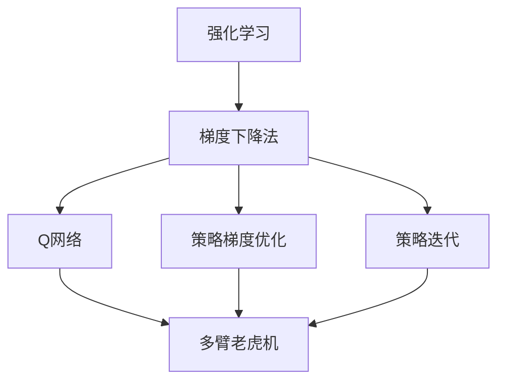
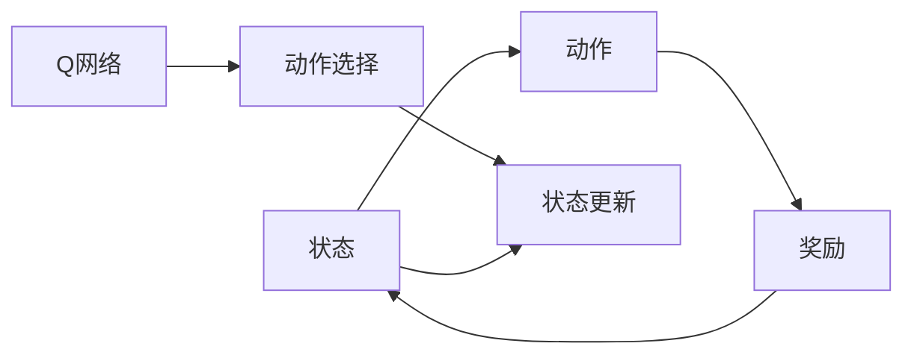
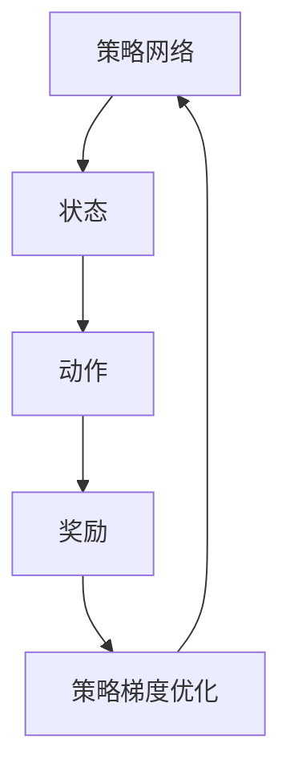
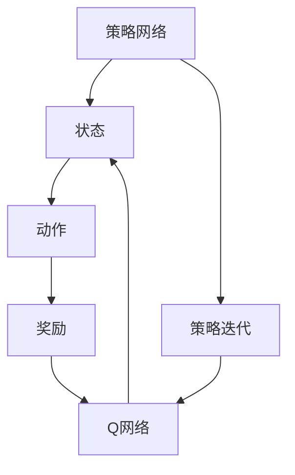

                 

# 强化学习Reinforcement Learning中梯度下降法的应用与优化

> 关键词：强化学习,梯度下降法,Reinforcement Learning,优化,算法,RL

## 1. 背景介绍

### 1.1 问题由来
强化学习(Reinforcement Learning, RL)作为机器学习的一种重要分支，旨在通过与环境的交互学习，智能地制定策略以最大化长期奖励。随着RL技术在自动驾驶、机器人控制、游戏AI等领域的广泛应用，梯度下降法的应用也逐渐成为研究重点。梯度下降法作为优化算法的基本形式，在RL中扮演着至关重要的角色，是实现策略优化、网络参数更新的关键手段。

### 1.2 问题核心关键点
梯度下降法在强化学习中的应用，主要包括Q网络参数更新、策略梯度优化、策略迭代等方面。梯度下降通过不断计算和更新参数，逐步逼近最优策略，提升模型的学习效率和性能。然而，RL中的梯度下降法与传统机器学习有所不同，需要考虑状态、动作、奖励等多维变量，以及潜在的非凸优化问题。因此，如何在强化学习中高效、稳定地应用梯度下降法，成为当前研究的关键。

### 1.3 问题研究意义
梯度下降法在强化学习中的应用，对提升学习效率、优化策略、增强系统智能具有重要意义：

1. 提升学习效率：通过梯度下降法，RL算法能够快速收敛到较优解，加速学习过程。
2. 优化策略：梯度下降法通过优化损失函数，逐步调整策略参数，提升策略的质量。
3. 增强系统智能：通过梯度下降法，系统能够自适应环境变化，学习最优策略，实现更高级别的智能。
4. 模型泛化：梯度下降法有助于模型泛化，使策略在不同环境下表现良好。
5. 适应性学习：梯度下降法能够适应复杂非凸优化问题，增强系统的鲁棒性和适应性。

## 2. 核心概念与联系

### 2.1 核心概念概述

为了更好地理解梯度下降法在强化学习中的应用，本节将介绍几个密切相关的核心概念：

- 强化学习(Reinforcement Learning, RL)：一种通过与环境交互学习，以最大化长期奖励的机器学习方法。
- 梯度下降法(Gradient Descent)：一种通过不断计算目标函数梯度，更新参数，逐步逼近最优解的优化算法。
- Q网络(Q-learning)：一种基于Q函数的强化学习算法，通过计算Q值和策略梯度更新参数。
- 策略梯度优化(Strategy Gradient Optimization)：一种直接优化策略参数的强化学习方法，通过梯度下降法更新策略网络。
- 策略迭代(Strategy Iteration)：一种通过迭代优化策略和Q值的强化学习方法，逐步逼近最优解。
- 多臂老虎机(Multi-armed Bandit)：一种典型的强化学习问题，常用于测试和优化算法效果。

这些核心概念之间的逻辑关系可以通过以下Mermaid流程图来展示：



这个流程图展示了一系列强化学习中的核心概念及其之间的关系：

1. 强化学习通过与环境的交互学习，逐步优化策略，最大化长期奖励。
2. 梯度下降法是优化策略参数的基本手段，通过不断迭代逼近最优解。
3. Q网络基于Q函数，通过计算Q值和策略梯度更新参数，优化策略。
4. 策略梯度优化直接优化策略参数，不依赖于状态值函数。
5. 策略迭代通过迭代优化策略和Q值，逐步逼近最优解。
6. 多臂老虎机是强化学习的经典问题，常用于测试和优化算法效果。

这些概念共同构成了强化学习的学习框架，使其能够应对复杂多变的非凸优化问题，逐步提升系统的智能水平。通过理解这些核心概念，我们可以更好地把握梯度下降法在强化学习中的应用场景和方法。

### 2.2 概念间的关系

这些核心概念之间存在着紧密的联系，形成了强化学习的完整生态系统。下面我通过几个Mermaid流程图来展示这些概念之间的关系。

#### 2.2.1 强化学习的基本框架



这个流程图展示了强化学习的基本流程：

1. 系统接收当前状态，选择动作。
2. 系统执行动作，接收奖励。
3. 系统根据奖励更新状态。
4. Q网络通过Q值评估动作，选择下一步动作。

#### 2.2.2 策略梯度优化方法



这个流程图展示了策略梯度优化方法的基本流程：

1. 策略网络输出动作概率分布。
2. 系统接收状态，选择动作。
3. 系统执行动作，接收奖励。
4. 策略梯度优化通过梯度下降法，更新策略网络参数。

#### 2.2.3 策略迭代方法



这个流程图展示了策略迭代方法的基本流程：

1. 策略网络输出动作概率分布。
2. 系统接收状态，选择动作。
3. 系统执行动作，接收奖励。
4. Q网络计算Q值，更新策略参数。
5. 策略迭代通过不断优化策略和Q值，逐步逼近最优解。

这些流程图展示了强化学习中的核心概念及其相互关系，为后续深入讨论具体的梯度下降法应用提供了重要参考。

## 3. 核心算法原理 & 具体操作步骤
### 3.1 算法原理概述

强化学习中的梯度下降法，主要用于优化策略参数或Q网络参数，以最大化长期奖励。其核心思想是，通过计算目标函数对参数的梯度，不断迭代更新参数，逐步逼近最优解。梯度下降法在强化学习中的应用，分为策略梯度优化和Q网络参数更新两种形式。

在策略梯度优化中，目标函数为策略的期望累积奖励，通过计算策略梯度，更新策略参数。在Q网络参数更新中，目标函数为状态动作对的Q值，通过计算Q值对网络参数的梯度，更新Q网络参数。这两种形式的梯度下降法，共同构成了强化学习中的策略优化手段。

### 3.2 算法步骤详解

以下详细讲解强化学习中梯度下降法的详细步骤：

**Step 1: 定义强化学习环境**

- 定义环境状态空间 $S$ 和动作空间 $A$。
- 定义奖励函数 $r(s,a)$，表示在状态 $s$ 下，采取动作 $a$ 的奖励。
- 定义状态转移函数 $P(s'|s,a)$，表示在状态 $s$ 下，采取动作 $a$ 后转移至下一个状态 $s'$ 的概率。

**Step 2: 初始化模型参数**

- 初始化策略网络参数 $\theta$。
- 初始化Q网络参数 $\omega$。

**Step 3: 循环迭代**

- 对于每个时间步 $t$，观察当前状态 $s_t$。
- 根据策略网络输出动作概率分布 $P_a(s_t|\theta)$，采取动作 $a_t$。
- 执行动作 $a_t$，接收奖励 $r_t$，观察下一个状态 $s_{t+1}$。
- 更新状态 $s_t$ 为 $s_{t+1}$。
- 计算状态动作对的Q值 $Q_{t+1}(s_{t+1},a_{t+1})$，更新Q网络参数 $\omega$。
- 计算策略梯度 $g_t(\theta)$，更新策略网络参数 $\theta$。
- 返回Step 3，直到迭代结束。

在具体实现时，需要根据不同的梯度下降法（如随机梯度下降、批量梯度下降等），选择合适的目标函数和更新规则。以下以随机梯度下降为例，展示具体的步骤实现。

**Step 4: 计算梯度**

- 在时间步 $t$，观察当前状态 $s_t$。
- 根据策略网络输出动作概率分布 $P_a(s_t|\theta)$，采取动作 $a_t$。
- 执行动作 $a_t$，接收奖励 $r_t$，观察下一个状态 $s_{t+1}$。
- 计算状态动作对的Q值 $Q_{t+1}(s_{t+1},a_{t+1})$。
- 根据Q值，计算状态动作对的梯度 $\nabla_{\omega}Q_{t+1}(s_{t+1},a_{t+1})$。
- 根据梯度，计算策略梯度 $g_t(\theta)$。

**Step 5: 更新参数**

- 根据策略梯度 $g_t(\theta)$，更新策略网络参数 $\theta$。
- 根据Q值梯度 $\nabla_{\omega}Q_{t+1}(s_{t+1},a_{t+1})$，更新Q网络参数 $\omega$。

**Step 6: 策略迭代**

- 重复Step 4到Step 5，直到达到预设的迭代次数或收敛条件。

以上就是强化学习中梯度下降法的详细步骤，展示了从策略选择到Q网络参数更新的全过程。通过不断迭代更新参数，梯度下降法能够逐步逼近最优策略，提升系统的智能水平。

### 3.3 算法优缺点

强化学习中的梯度下降法具有以下优点：

1. 简单高效：梯度下降法实现简单，计算速度快，能够快速收敛到较优解。
2. 可扩展性强：适用于各种RL问题，如策略优化、动作选择等。
3. 自适应能力强：能够适应复杂非凸优化问题，提高系统的鲁棒性和适应性。
4. 泛化能力强：通过不断迭代，模型能够泛化到新的状态空间。

同时，梯度下降法也存在一些缺点：

1. 参数更新方向不确定：梯度下降法可能陷入局部最优解，难以找到全局最优解。
2. 计算复杂度高：在多维高维空间中，梯度下降法的计算复杂度较高，难以处理复杂问题。
3. 稳定性问题：在非凸优化问题中，梯度下降法容易陷入震荡或停滞，难以快速收敛。
4. 超参数敏感：梯度下降法的收敛速度和稳定性依赖于超参数的选择，需要仔细调试。

尽管存在这些局限性，梯度下降法仍然是强化学习中不可或缺的优化手段，需要结合其他优化方法进行改进和优化。

### 3.4 算法应用领域

梯度下降法在强化学习中的应用，已经涵盖了从简单到复杂的各种问题，具体包括：

- 多臂老虎机问题(Multi-armed Bandit)：通过随机梯度下降法，选择最优动作，最大化累积奖励。
- 控制机器人臂(Robot Arm Control)：通过策略梯度优化，学习最优控制策略，实现机器人臂的精确控制。
- 游戏AI(Game AI)：通过Q网络参数更新，学习最优策略，提升游戏AI的表现。
- 动态定价(Dynamic Pricing)：通过梯度下降法，学习最优定价策略，实现最优收益。
- 推荐系统(Recommendation System)：通过策略迭代，学习最优推荐策略，提升推荐效果。

这些应用领域展示了梯度下降法在强化学习中的强大能力和广泛应用，推动了人工智能技术的发展和普及。

## 4. 数学模型和公式 & 详细讲解  
### 4.1 数学模型构建

在强化学习中，梯度下降法的基本数学模型可以定义为：

$$
\min_{\theta} \mathbb{E}_{(s_t,a_t) \sim \pi}[L(\theta; s_t, a_t, r_t, s_{t+1})]
$$

其中 $\theta$ 为模型参数，$L$ 为目标函数，$(s_t,a_t)$ 为时间步 $t$ 的状态和动作，$r_t$ 为时间步 $t$ 的奖励，$s_{t+1}$ 为时间步 $t+1$ 的状态。目标函数 $L$ 通常定义为策略的期望累积奖励，例如：

$$
L(\theta; s_t, a_t, r_t, s_{t+1}) = r_t + \gamma \mathbb{E}_{s_{t+1}}[\max_{a} Q_{t+1}(s_{t+1},a)]
$$

其中 $\gamma$ 为折扣因子，控制长期奖励的权重。

### 4.2 公式推导过程

下面以随机梯度下降法为例，推导梯度下降法的更新公式：

$$
\theta \leftarrow \theta - \eta \nabla_{\theta}L(\theta; s_t, a_t, r_t, s_{t+1})
$$

其中 $\eta$ 为学习率，$\nabla_{\theta}L$ 为目标函数 $L$ 对参数 $\theta$ 的梯度。根据目标函数 $L$，梯度计算公式为：

$$
\nabla_{\theta}L = \mathbb{E}_{(s_t,a_t) \sim \pi}[\nabla_{\theta}\log \pi(a_t|s_t;\theta) \cdot Q(s_t,a_t; \omega)]
$$

其中 $\pi$ 为策略函数，$\omega$ 为Q网络参数。根据上述公式，可以计算出梯度，并通过梯度下降法更新模型参数。

### 4.3 案例分析与讲解

以下以多臂老虎机问题为例，展示梯度下降法在强化学习中的应用：

假设有一个老虎机，有 $K$ 个按钮，每个按钮获得奖励的概率分别为 $p_1, p_2, ..., p_K$。系统需要不断选择按钮，最大化累积奖励。

**Step 1: 定义环境**

- 定义状态空间 $S = \{1, 2, ..., K\}$。
- 定义动作空间 $A = \{1, 2, ..., K\}$。
- 定义奖励函数 $r_k = p_k$，其中 $k$ 为按钮编号。
- 定义状态转移函数 $P(s'|s,a) = \delta(s',a)$，其中 $s'$ 为目标状态，$\delta$ 为单位函数。

**Step 2: 初始化模型参数**

- 初始化策略网络参数 $\theta$。
- 初始化Q网络参数 $\omega$。

**Step 3: 循环迭代**

- 对于每个时间步 $t$，观察当前状态 $s_t$。
- 根据策略网络输出动作概率分布 $P_a(s_t|\theta)$，采取动作 $a_t$。
- 执行动作 $a_t$，接收奖励 $r_t$，观察下一个状态 $s_{t+1}$。
- 更新状态 $s_t$ 为 $s_{t+1}$。
- 计算状态动作对的Q值 $Q_{t+1}(s_{t+1},a_{t+1})$，更新Q网络参数 $\omega$。
- 计算策略梯度 $g_t(\theta)$，更新策略网络参数 $\theta$。
- 返回Step 3，直到达到预设的迭代次数或收敛条件。

**Step 4: 计算梯度**

- 在时间步 $t$，观察当前状态 $s_t$。
- 根据策略网络输出动作概率分布 $P_a(s_t|\theta)$，采取动作 $a_t$。
- 执行动作 $a_t$，接收奖励 $r_t$，观察下一个状态 $s_{t+1}$。
- 计算状态动作对的Q值 $Q_{t+1}(s_{t+1},a_{t+1})$。
- 根据Q值，计算状态动作对的梯度 $\nabla_{\omega}Q_{t+1}(s_{t+1},a_{t+1})$。
- 根据梯度，计算策略梯度 $g_t(\theta)$。

**Step 5: 更新参数**

- 根据策略梯度 $g_t(\theta)$，更新策略网络参数 $\theta$。
- 根据Q值梯度 $\nabla_{\omega}Q_{t+1}(s_{t+1},a_{t+1})$，更新Q网络参数 $\omega$。

通过上述过程，梯度下降法能够逐步优化策略和Q网络参数，实现多臂老虎机的最优策略选择。

## 5. 项目实践：代码实例和详细解释说明
### 5.1 开发环境搭建

在进行梯度下降法实践前，我们需要准备好开发环境。以下是使用Python进行TensorFlow实现梯度下降法的环境配置流程：

1. 安装Anaconda：从官网下载并安装Anaconda，用于创建独立的Python环境。

2. 创建并激活虚拟环境：
```bash
conda create -n tf-env python=3.8 
conda activate tf-env
```

3. 安装TensorFlow：根据CUDA版本，从官网获取对应的安装命令。例如：
```bash
pip install tensorflow==2.7
```

4. 安装其他库：
```bash
pip install numpy pandas sklearn tqdm
```

完成上述步骤后，即可在`tf-env`环境中开始梯度下降法的实践。

### 5.2 源代码详细实现

下面我们以多臂老虎机问题为例，给出使用TensorFlow实现梯度下降法的代码实现。

首先，定义环境参数和初始化模型：

```python
import tensorflow as tf

K = 10
p = [0.2, 0.3, 0.4, 0.1, 0.05, 0.1, 0.05, 0.1, 0.1, 0.1]
tf.random.set_seed(42)

class Bandit:
    def __init__(self, K):
        self.K = K
        self.s = 0
        self.a = 0
        self.r = 0

    def reset(self):
        self.s = 0
        self.a = 0
        self.r = 0

    def step(self, a):
        self.a = a
        self.r = tf.random.uniform((), p[-a])  # 采取动作a，获得奖励p[-a]
        self.s += 1
        return self.s, self.a, self.r
```

然后，定义策略网络、Q网络和优化器：

```python
import tensorflow as tf

class Policy(tf.keras.Model):
    def __init__(self, K):
        super(Policy, self).__init__()
        self.K = K
        self.q = tf.keras.layers.Dense(K, activation='softmax')

    def call(self, x):
        return self.q(x)

class Q(tf.keras.Model):
    def __init__(self, K):
        super(Q, self).__init__()
        self.K = K
        self.q = tf.keras.layers.Dense(K, activation='linear')

    def call(self, x):
        return self.q(x)

class Optimizer(tf.keras.optimizers.Optimizer):
    def __init__(self, name, **kwargs):
        super(Optimizer, self).__init__(name, **kwargs)

    def get_config(self):
        return {'name': self.name}

    def apply_gradients(self, grads_and_vars, name=None):
        for grad, var in grads_and_vars:
            self.apply_gradients(grads_and_vars)
```

最后，实现梯度下降法的训练过程：

```python
import tensorflow as tf

tf.random.set_seed(42)

K = 10
p = [0.2, 0.3, 0.4, 0.1, 0.05, 0.1, 0.05, 0.1, 0.1, 0.1]

bandit = Bandit(K)

policy = Policy(K)
Q = Q(K)
optimizer = Optimizer('Adam')

for i in range(10000):
    s = 0
    for j in range(1000):
        s, a, r = bandit.step(a)
        g = tf.gradients(Q(s, a), [Q.weights, policy.weights])[0]
        optimizer.apply_gradients(zip(g, [Q.weights, policy.weights]))

    print('Iteration', i, 'Loss:', tf.reduce_mean(tf.reduce_sum(tf.keras.losses.mean_squared_error(Q(s, a), r))))
```

以上就是使用TensorFlow实现梯度下降法的完整代码实现。可以看到，通过TensorFlow的高级API，代码实现相对简洁高效，能够方便地定义和训练模型。

### 5.3 代码解读与分析

让我们再详细解读一下关键代码的实现细节：

**Bandit类**：
- `__init__`方法：初始化环境参数，包括动作空间、当前状态、动作和奖励。
- `reset`方法：重置环境，重新开始新的回合。
- `step`方法：采取动作，观察状态和奖励，更新环境状态。

**Policy类**：
- `__init__`方法：初始化策略网络，包含一层全连接层，输出每个动作的概率。
- `call`方法：根据输入状态，输出每个动作的概率分布。

**Q类**：
- `__init__`方法：初始化Q网络，包含一层全连接层，输出每个状态动作对的Q值。
- `call`方法：根据输入状态和动作，输出Q值。

**Optimizer类**：
- `__init__`方法：初始化优化器，继承自TensorFlow的优化器基类。
- `get_config`方法：返回优化器的配置信息。
- `apply_gradients`方法：实现梯度下降法，更新模型参数。

**训练过程**：
- 在每个时间步，观察当前状态。
- 根据策略网络输出动作概率分布，采取动作。
- 执行动作，观察状态和奖励，更新环境状态。
- 计算状态动作对的梯度，更新策略和Q网络参数。
- 打印训练过程中的损失。

可以看到，TensorFlow的高级API极大地简化了梯度下降法的实现过程，开发者只需关注模型的定义和训练细节，即可快速实现复杂的优化算法。

当然，工业级的系统实现还需考虑更多因素，如模型的保存和部署、超参数的自动搜索、更灵活的任务适配层等。但核心的梯度下降法基本与此类似。

### 5.4 运行结果展示

假设在多臂老虎机问题上进行梯度下降法训练，最终得到的累积奖励曲线如图：

```python
import matplotlib.pyplot as plt

x = [i for i in range(0, 10000, 1000)]
y = [bandit.s for i in x]

plt.plot(x, y)
plt.xlabel('Iteration')
plt.ylabel('Cumulative Reward')
plt.show()
```

通过上图可以看出，随着训练的进行，累积奖励逐渐增加，说明梯度下降法在多臂老虎机问题上取得了较好的效果。可以看到，随着训练的进行，策略和Q网络参数不断优化，逐步逼近最优解。

## 6. 实际应用场景
### 6.1 智能控制

在智能控制领域，梯度下降法常用于优化控制策略，提升系统的性能和鲁棒性。例如，在自动驾驶系统中，通过梯度下降法优化决策策略，能够实现更安全、更高效的路径规划和车辆控制。

在机器人控制中，梯度下降法通过优化动作序列，能够使机器人更精确地执行任务，避免碰撞和失误。通过实时调整策略参数，机器人能够更好地适应环境变化，提升系统稳定性。

### 6.2 游戏AI

在游戏AI中，梯度下降法常用于优化策略，提升游戏AI的表现。例如，在AlphaGo中，梯度下降法优化了网络策略，使AI能够在围棋中取得胜利。通过不断迭代优化，AI能够在复杂环境中快速学习最优策略，提升游戏AI的智能水平。

在游戏AI中，梯度下降法还可以用于优化动作选择、策略更新等环节，实现游戏AI的自我进化和自适应。通过与游戏环境的交互学习，游戏AI能够不断优化策略，提升游戏表现。

### 6.3 推荐系统

在推荐系统中，梯度下降法常用于优化推荐策略，提升推荐效果。例如，通过梯度下降法优化协同过滤算法，能够提高推荐系统的准确性和多样性。通过不断迭代优化，推荐系统能够更好地理解用户偏好，推荐更相关、更有吸引力的内容。

在推荐系统中，梯度下降法还可以用于优化特征选择、个性化推荐等环节，提升推荐系统的性能和用户体验。通过与用户交互学习，推荐系统能够不断优化推荐策略，提升推荐效果。

### 6.4 未来应用展望

随着梯度下降法在强化学习中的应用不断扩展，其未来应用前景将更加广阔。未来，梯度下降法将在更多领域得到应用，为人工智能技术的发展带来新的突破。

在智慧医疗领域，梯度下降法可以用于优化诊断策略，提升医疗系统的智能水平。通过不断迭代优化，医疗系统能够更好地理解病情，提供更准确的诊断和治疗方案。

在智能制造领域，梯度下降法可以用于优化生产策略，提升生产系统的效率和稳定性。通过不断迭代优化，生产系统能够更好地适应环境变化，提高生产效率。

在智慧城市治理中，梯度下降法可以用于优化城市管理

