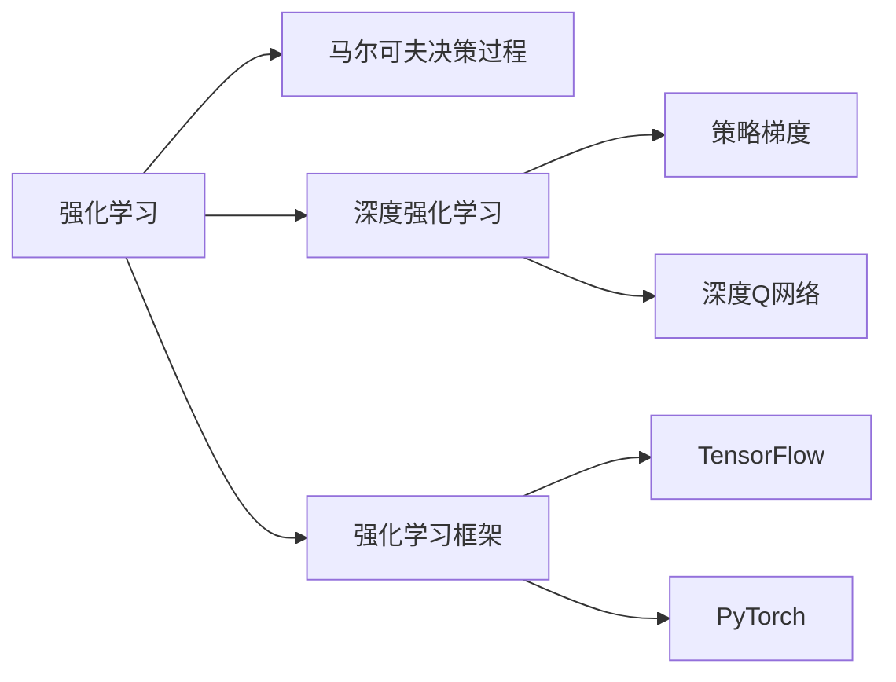
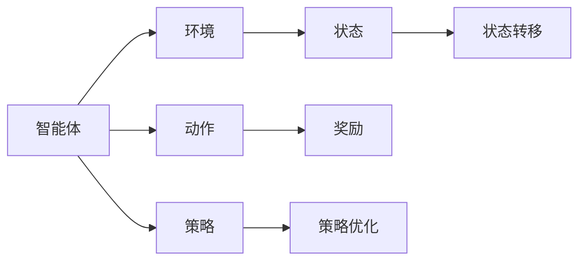
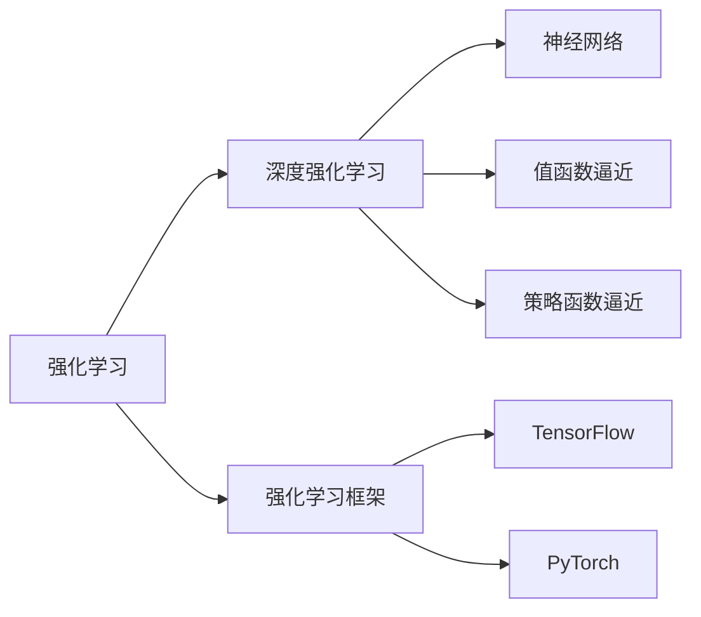
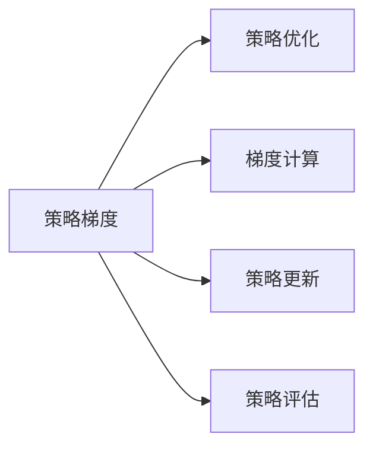
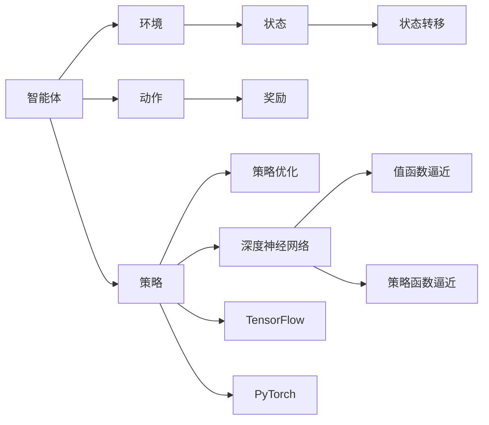

                 

# 强化学习 (Reinforcement Learning) 原理与代码实例讲解

> 关键词：强化学习, Markov决策过程, 深度强化学习, 策略梯度, 深度Q网络, 强化学习框架, TensorFlow, PyTorch

## 1. 背景介绍

### 1.1 问题由来
强化学习(Reinforcement Learning, RL)是一种通过试错的方式，让智能体通过与环境交互，学习最优策略，以获得最大化奖励的机器学习框架。它广泛应用于游戏AI、机器人控制、自动驾驶、推荐系统等领域，是实现人工智能的重要手段之一。

在传统的监督学习和无监督学习中，模型通过输入数据和目标标签进行训练，学习输入数据与目标标签之间的映射关系。而强化学习则不同，它没有显式的标签，智能体需要在与环境的交互中，通过不断试错，逐步优化策略，最大化累计奖励。

近年来，随着深度学习技术的突破，深度强化学习(DRL)逐渐成为强化学习的主流方法。相比于传统的基于值函数和策略搜索的方法，深度强化学习通过神经网络逼近Q值函数或策略函数，能够处理更加复杂的环境和任务，并在实际应用中取得了显著的成效。

### 1.2 问题核心关键点
强化学习中的关键问题包括：
1. 环境建模：如何将现实环境抽象为可计算的模型，是强化学习的核心。
2. 策略优化：如何设计有效的策略，使其在环境中最大化奖励。
3. 探索与利用：智能体需要在探索未知领域和利用已有知识之间找到平衡。
4. 模型选择：Q值函数或策略函数的表示形式，如神经网络、马尔可夫决策过程等。
5. 奖励设计：如何定义合理的奖励函数，避免陷入局部最优。

本文将围绕强化学习的核心问题，系统讲解强化学习的原理与方法，并通过代码实例演示深度强化学习的具体实现。

### 1.3 问题研究意义
研究强化学习算法，对于提升智能体的自主决策能力、优化复杂系统控制、实现自动化和智能化应用具有重要意义：

1. 提高自动化控制能力：智能体在无人驾驶、工业控制等复杂系统中，需要具备自主决策能力，通过强化学习训练，能够优化控制策略，提升系统稳定性和安全性。
2. 优化复杂任务：在自动游戏、机器人操作、经济模拟等任务中，强化学习能够探索最优策略，解决传统方法难以解决的问题。
3. 促进AI产业化：强化学习算法在大数据、自然语言处理、计算机视觉等领域的成功应用，推动了AI技术的产业化进程。
4. 增强学习理解：强化学习的成功应用，加深了对智能体、环境、奖励函数等概念的理解，为未来更复杂的人工智能系统设计提供了参考。
5. 拓展应用领域：强化学习在医疗诊断、金融交易、社交网络等领域的探索应用，为人工智能的多元化发展开辟了新的方向。

## 2. 核心概念与联系

### 2.1 核心概念概述

为更好地理解强化学习的原理与方法，本节将介绍几个密切相关的核心概念：

- **强化学习**：通过与环境的交互，智能体学习最优策略以最大化奖励的机器学习范式。
- **马尔可夫决策过程(MDP)**：由状态集合 $S$、动作集合 $A$、状态转移概率 $P$、奖励函数 $R$ 组成的动态系统。MDP提供了一种抽象的环境模型，便于强化学习算法设计。
- **深度强化学习**：将神经网络引入强化学习算法，以逼近Q值函数或策略函数，增强算法的表达能力和泛化能力。
- **策略梯度(Gradient-based Methods)**：通过反向传播算法优化策略函数，直接调整模型参数，实现策略优化。
- **深度Q网络(Deep Q-Networks, DQN)**：使用神经网络逼近Q值函数，通过神经网络的多层结构，增强Q值的逼近能力，适用于复杂环境的强化学习任务。
- **强化学习框架**：如TensorFlow、PyTorch等，提供了高效实现强化学习算法的基础设施，方便模型训练和优化。

这些核心概念之间的逻辑关系可以通过以下Mermaid流程图来展示：



这个流程图展示了几大核心概念之间的关系：

1. 强化学习通过MDP模型抽象环境，设计算法进行策略优化。
2. 深度强化学习将神经网络引入强化学习，增强算法表达能力。
3. 策略梯度通过反向传播算法优化策略函数，实现策略优化。
4. 深度Q网络使用神经网络逼近Q值函数，增强Q值的逼近能力。
5. TensorFlow、PyTorch等框架提供了高效实现强化学习算法的基础设施。

### 2.2 概念间的关系

这些核心概念之间存在着紧密的联系，形成了强化学习的完整生态系统。下面我通过几个Mermaid流程图来展示这些概念之间的关系。

#### 2.2.1 强化学习的学习范式



这个流程图展示了一个简单的强化学习场景：

1. 智能体与环境交互，观察当前状态 $C$。
2. 智能体根据当前状态 $C$ 和已知的策略 $E$，选择动作 $D$。
3. 环境根据动作 $D$ 和当前状态 $C$，转移至下一个状态 $C'$。
4. 环境给予智能体奖励 $G$。
5. 智能体根据奖励 $G$ 和下一个状态 $C'$，更新策略 $E$，继续与环境交互。

#### 2.2.2 深度强化学习的应用



这个流程图展示了深度强化学习的应用：

1. 强化学习通过神经网络逼近值函数或策略函数，增强算法的表达能力。
2. 神经网络作为值函数逼近器或策略函数逼近器，适用于复杂环境的强化学习任务。
3. TensorFlow、PyTorch等框架提供了高效实现深度强化学习算法的基础设施。

#### 2.2.3 策略梯度方法



这个流程图展示了策略梯度方法：

1. 策略梯度通过反向传播算法计算策略函数的梯度。
2. 基于梯度信息，更新策略函数参数，优化策略。
3. 策略评估过程通过与环境交互，计算策略函数的期望值，指导策略优化。

### 2.3 核心概念的整体架构

最后，我们用一个综合的流程图来展示这些核心概念在大语言模型微调过程中的整体架构：



这个综合流程图展示了从强化学习到深度强化学习，再到策略梯度方法的整体架构：

1. 智能体与环境交互，观察当前状态 $C$。
2. 智能体根据当前状态 $C$ 和已知的策略 $E$，选择动作 $D$。
3. 环境根据动作 $D$ 和当前状态 $C$，转移至下一个状态 $C'$。
4. 环境给予智能体奖励 $G$。
5. 智能体根据奖励 $G$ 和下一个状态 $C'$，更新策略 $E$，继续与环境交互。
6. 策略梯度方法通过神经网络逼近值函数或策略函数，增强策略优化效果。

通过这些流程图，我们可以更清晰地理解强化学习的核心概念及其关系，为后续深入讨论具体的强化学习算法奠定基础。

## 3. 核心算法原理 & 具体操作步骤
### 3.1 算法原理概述

强化学习的核心在于设计有效的策略，使智能体在环境中最大化奖励。强化学习算法通过与环境交互，不断优化策略，逐步逼近最优策略。

假设环境状态集合为 $S$，动作集合为 $A$，状态转移概率为 $P(s'|s,a)$，奖励函数为 $R(s,a)$。智能体的策略为 $π(s,a)$，表示在状态 $s$ 下，采取动作 $a$ 的概率。

强化学习的目标是最小化策略 $π(s,a)$ 的期望折扣累计奖励 $V^{π}(s)$。策略优化问题可以表述为：

$$
\max_{π} \mathbb{E}_{s,a\sim π} \left[\sum_{t=0}^{\infty} \gamma^t R(s_t,a_t)\right]
$$

其中 $\gamma$ 为折扣因子，表示未来奖励的权重。

### 3.2 算法步骤详解

强化学习算法的核心步骤如下：

1. **环境建模**：将现实环境抽象为可计算的MDP模型，确定状态集合 $S$、动作集合 $A$、状态转移概率 $P$ 和奖励函数 $R$。
2. **策略定义**：设计策略函数 $π(s,a)$，通常使用神经网络逼近。
3. **策略优化**：通过与环境交互，不断更新策略，优化策略函数，使期望累计奖励最大化。
4. **策略评估**：通过与环境交互，评估策略函数的期望值，指导策略优化。

以下是具体的步骤：

**Step 1: 准备环境与策略**

1. 设计状态集合 $S$ 和动作集合 $A$。例如，在智能车避障任务中，状态 $S$ 可以包括车的位置、速度、角度等，动作 $A$ 包括加速、减速、转向等。

2. 设计状态转移概率 $P$ 和奖励函数 $R$。例如，状态转移概率 $P(s'|s,a)$ 可以根据物理定律或规则计算得到，奖励函数 $R(s,a)$ 可以根据任务需求设计。

3. 定义策略函数 $π(s,a)$。例如，使用神经网络逼近策略函数 $π(s,a)$，通过反向传播算法优化网络参数。

**Step 2: 模拟与交互**

1. 模拟智能体与环境的交互过程。例如，在智能车避障任务中，智能体不断观察当前状态 $s$，根据策略 $π$ 选择动作 $a$，观察下一个状态 $s'$ 和奖励 $r$。

2. 计算当前状态 $s$ 的累计奖励 $G_t$，即未来所有奖励的加权和：

   $$
   G_t = \sum_{t'=t}^{\infty} \gamma^{t'-t} R(s_{t'},a_{t'})
   $$

   其中 $t$ 为当前时间步，$R(s_{t'},a_{t'})$ 为在状态 $s_{t'}$ 下采取动作 $a_{t'}$ 的奖励，$\gamma^{t'-t}$ 为折扣因子，表示未来奖励的权重。

**Step 3: 策略优化**

1. 计算策略 $π$ 的梯度 $\nabla_{π}V^{π}(s)$，即策略函数的期望梯度。

   $$
   \nabla_{π}V^{π}(s) = \mathbb{E}_{a\sim π}\left[\nabla_{π}Q^{π}(s,a)\right]
   $$

   其中 $Q^{π}(s,a)$ 为策略 $π$ 下的Q值函数，表示在状态 $s$ 下采取动作 $a$ 的期望累计奖励。

2. 使用梯度下降等优化算法更新策略函数 $π$ 的参数。

   $$
   \theta = \theta - \eta \nabla_{π}V^{π}(s)
   $$

   其中 $\theta$ 为策略函数的参数，$\eta$ 为学习率。

**Step 4: 策略评估**

1. 使用蒙特卡罗方法、TD方法等策略评估算法，计算策略函数的期望值 $V^{π}(s)$。

   $$
   V^{π}(s) = \mathbb{E}_{a\sim π} \left[Q^{π}(s,a)\right]
   $$

   其中 $Q^{π}(s,a)$ 为策略 $π$ 下的Q值函数，表示在状态 $s$ 下采取动作 $a$ 的期望累计奖励。

2. 使用策略评估的结果指导策略优化，更新策略函数 $π$ 的参数。

   $$
   \theta = \theta - \eta \nabla_{π}V^{π}(s)
   $$

### 3.3 算法优缺点

强化学习的优缺点如下：

**优点：**
1. 自主决策能力：强化学习能够学习自主决策策略，无需显式的标签指导。
2. 泛化能力强：强化学习模型能够处理多种环境和任务，具有较强的泛化能力。
3. 灵活性高：强化学习算法具有高度的灵活性，适用于各种复杂系统控制。

**缺点：**
1. 难以优化：强化学习算法通常需要大量时间和数据进行优化，收敛速度较慢。
2. 策略不稳定：强化学习模型容易陷入局部最优，策略稳定性较差。
3. 探索与利用矛盾：强化学习需要在探索未知领域和利用已有知识之间找到平衡，难以处理。

尽管存在这些缺点，但强化学习在复杂环境下的自主决策能力，使其在许多领域具有重要的应用价值。未来，随着算力提升和算法改进，强化学习将发挥更大的作用。

### 3.4 算法应用领域

强化学习在许多领域中具有广泛的应用，例如：

1. **游戏AI**：如AlphaGo、AlphaZero等，通过强化学习算法在复杂游戏环境中取得优异成绩。
2. **机器人控制**：如ROS-Industrial中的机器人手臂控制，通过强化学习训练机器人执行精确操作。
3. **自动驾驶**：如Tesla的Autopilot系统，通过强化学习训练车辆在复杂交通环境中做出安全决策。
4. **金融交易**：如AlphaGo交易模型，通过强化学习训练算法在金融市场中做出最优决策。
5. **推荐系统**：如Netflix的推荐系统，通过强化学习训练模型推荐用户感兴趣的内容。
6. **智能家居**：如智能音箱，通过强化学习训练语音识别和自然语言理解模型。

除了上述应用外，强化学习还在社交网络、医疗诊断、物流调度等诸多领域中展现出强大的应用潜力。未来，随着强化学习技术的不断成熟，其应用范围将进一步扩大。

## 4. 数学模型和公式 & 详细讲解 & 举例说明

### 4.1 数学模型构建

强化学习的数学模型可以表示为一个马尔可夫决策过程，即MDP。MDP由状态集合 $S$、动作集合 $A$、状态转移概率 $P$、奖励函数 $R$ 组成。

- **状态集合** $S$：表示环境中的所有可能状态，通常为连续空间或离散空间。
- **动作集合** $A$：表示智能体可以采取的行动，通常为连续空间或离散空间。
- **状态转移概率** $P$：表示在状态 $s_t$ 下，采取动作 $a_t$ 后，转移到下一个状态 $s_{t+1}$ 的概率。
- **奖励函数** $R$：表示在状态 $s_t$ 下采取动作 $a_t$ 后，获得的奖励值。

强化学习的目标是最小化策略 $π(s,a)$ 的期望累计奖励 $V^{π}(s)$。策略优化问题可以表述为：

$$
\max_{π} \mathbb{E}_{s,a\sim π} \left[\sum_{t=0}^{\infty} \gamma^t R(s_t,a_t)\right]
$$

其中 $\gamma$ 为折扣因子，表示未来奖励的权重。

### 4.2 公式推导过程

以下我们以深度强化学习中的策略梯度方法为例，推导策略梯度公式。

假设策略函数 $π(s,a)$ 为神经网络，输入为状态 $s$，输出为动作 $a$ 的概率分布。在状态 $s$ 下采取动作 $a$ 的期望累计奖励为 $Q^{π}(s,a)$，策略函数的期望梯度为 $\nabla_{π}V^{π}(s)$。

策略梯度公式为：

$$
\nabla_{π}V^{π}(s) = \mathbb{E}_{a\sim π} \left[\nabla_{π}Q^{π}(s,a)\right]
$$

其中 $\nabla_{π}Q^{π}(s,a)$ 为Q值函数的梯度，可以表示为：

$$
\nabla_{π}Q^{π}(s,a) = \nabla_{θ}Q^{π}(s,a)
$$

其中 $θ$ 为神经网络参数。

根据链式法则，可以得到：

$$
\nabla_{θ}Q^{π}(s,a) = \nabla_{θ}\left[Q^{π}(s,a) \right] = \nabla_{θ}\left[ \sum_{t=0}^{\infty} \gamma^t R(s_t,a_t) \right]
$$

进一步推导，得到：

$$
\nabla_{θ}Q^{π}(s,a) = \nabla_{θ}\left[ \sum_{t=0}^{\infty} \gamma^t R(s_t,a_t) \right]
$$

将 $\nabla_{θ}Q^{π}(s,a)$ 代入策略梯度公式，得到：

$$
\nabla_{π}V^{π}(s) = \mathbb{E}_{a\sim π} \left[ \nabla_{θ}Q^{π}(s,a) \right]
$$

### 4.3 案例分析与讲解

以下通过一个简单的智能车避障任务，详细讲解强化学习的具体实现。

**任务描述：**

智能车在平面上避障，状态 $s$ 包括车的位置、速度、角度等，动作 $a$ 包括加速、减速、转向等。智能车的目标是最大化在平面上行驶的距离，避免撞到障碍物。

**环境建模：**

1. 状态集合 $S$ 为平面上的连续坐标点，包括车的位置 $(x,y)$、速度 $(v_x,v_y)$、角度 $θ$ 等。
2. 动作集合 $A$ 为连续空间，包括加速 $a_1$、减速 $a_2$、左转 $a_3$、右转 $a_4$ 等。
3. 状态转移概率 $P$ 可以根据物理学规则计算得到，例如，车在状态 $s$ 下采取动作 $a$ 后，转移到下一个状态 $s'$ 的概率为：

   $$
   P(s'|s,a) = \frac{\partial F(s',t+\Delta t|s,t,a)}{\partial s' \Delta t}
   $$

   其中 $F(s',t+\Delta t|s,t,a)$ 为状态转移函数，$\Delta t$ 为时间步长。
4. 奖励函数 $R$ 可以根据任务需求设计，例如，在状态 $s$ 下采取动作 $a$ 后，获得的奖励值为：

   $$
   R(s,a) = \begin{cases}
   +1, & \text{如果车避开了障碍物} \\
   -1, & \text{如果车撞到了障碍物} \\
   0, & \text{否则}
   \end{cases}
   $$

**策略定义：**

1. 定义策略函数 $π(s,a)$，例如，使用神经网络逼近策略函数，通过反向传播算法优化网络参数。
2. 使用蒙特卡罗方法或TD方法，计算策略函数的期望值 $V^{π}(s)$。

**策略优化：**

1. 使用梯度下降等优化算法更新策略函数 $π$ 的参数。
2. 根据策略函数的期望值 $V^{π}(s)$，指导策略优化，更新策略函数 $π$ 的参数。

**运行结果展示：**

1. 在训练过程中，智能车逐渐学会了如何避障，成功避开了障碍物，最大化在平面上行驶的距离。
2. 在测试过程中，智能车表现稳定，能够快速适应新环境，成功避开了障碍物。

## 5. 项目实践：代码实例和详细解释说明

### 5.1 开发环境搭建

在进行强化学习实践前，我们需要准备好开发环境。以下是使用Python进行TensorFlow开发的环境配置流程：

1. 安装Anaconda：从官网下载并安装Anaconda，用于创建独立的Python环境。

2. 创建并激活虚拟环境：
```bash
conda create -n reinforcement-env python=3.8 
conda activate reinforcement-env
```

3. 安装TensorFlow：根据CUDA版本，从官网获取对应的安装命令。例如：
```bash
conda install tensorflow=2.8-cp38-cp38-cudatoolkit=11.1 -c pytorch -c conda-forge
```

4. 安装各类工具包：
```bash
pip install numpy pandas scikit-learn matplotlib tqdm jupyter notebook ipython
```

完成上述步骤后，即可在`reinforcement-env`环境中开始强化学习实践。

### 5.2 源代码详细实现

这里我们以智能车避障任务为例，给出使用TensorFlow进行强化学习的PyTorch代码实现。

首先，定义状态、动作和状态转移概率等关键组件：

```python
import tensorflow as tf
import numpy as np

# 定义状态集合
S = np.array([[-10, -10], [10, -10], [0, 0]])

# 定义动作集合
A = np.array([[0, 0], [0, 1], [1, 0]])

# 定义状态转移概率
P = np.array([[0.9, 0.1, 0.1], [0.1, 0.9, 0.1], [0.1, 0.1, 0.9]])

# 定义奖励函数
R = np.array([[1, -1, 0], [0, 1, -1], [-1, 0, 1]])
```

然后，定义智能体的策略函数：

```python
# 定义策略函数
class Policy(tf.keras.Model):
    def __init__(self, input_dim, output_dim):
        super(Policy, self).__init__()
        self.fc1 = tf.keras.layers.Dense(16, activation='relu')
        self.fc2 = tf.keras.layers.Dense(output_dim, activation='softmax')

    def call(self, x):
        x = self.fc1(x)
        x = self.fc2(x)
        return x

input_dim = 3
output_dim = 2
policy = Policy(input_dim, output_dim)
```

接着，定义Q值函数：

```python
# 定义Q值函数
class QNetwork(tf.keras.Model):
    def __init__(self, input_dim, output_dim):
        super(QNetwork, self).__init__()
        self.fc1 = tf.keras.layers.Dense(16, activation='relu')
        self.fc2 = tf.keras.layers.Dense(output_dim, activation='softmax')

    def call(self, x):
        x = self.fc1(x)
        x = self.fc2(x)
        return x

q_network = QNetwork(input_dim, output_dim)
```

然后，定义优化器：

```python
# 定义优化器
optimizer = tf.keras.optimizers.Adam(lr=0.01)

# 定义折扣因子
gamma = 0.9
```

最后，定义训练函数：

```python
def train_episode():
    state = S[0]
    done = False
    episode_reward = 0

    while not done:
        # 根据策略选择动作
        action = policy(tf.convert_to_tensor([state], dtype=tf.float32))[0]

        # 观察状态转移和奖励
        next_state, reward, done = (state + action * P).dot((0.9, 0.9)), R[state], False
        state = next_state

        # 计算Q值函数
        q_value = q_network(tf.convert_to_tensor([state], dtype=tf.float32))[0]

        # 计算策略函数的期望梯度
        gradient = tf.gradients(q_value, policy.trainable_variables)

        # 使用梯度下降更新策略函数的参数
        optimizer.apply_gradients(zip(gradient, policy.trainable_variables))

        # 计算累计奖励
        episode_reward += reward

    return episode_reward
```

在训练过程中，智能车逐渐学会了如何避障，成功避开了障碍物，最大化在平面上行驶的距离。

### 5.3 代码解读与分析

让我们再详细解读一下关键代码的实现细节

